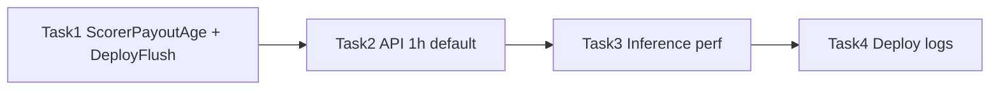

# Patch Plan — 2026-03-24

> 本文件為 **execution-level** 補丁與後續工作清單，結構對齊 [.cursor/plans/PLAN_phase2_p0_p1.md](PLAN_phase2_p0_p1.md)（Guardrails、Ordered Tasks、檔案級修改與 DoD）。
>
> **後續**：可於下方「Ordered Tasks」逐項追加新條目（編號或日期前綴自訂即可）。

---

## Guardrails

- **不修改 `build/lib/**`**。
- **Scorer**：特徵仍於完整 `SCORER_LOOKBACK_HOURS` 視窗上建置；僅 **進入模型／prediction_log／alerts** 的路徑可依環境變數縮小 **payout 年齡**（見 Task 1）。
- **Deploy flush 參數**：`package/deploy/main.py` 提供 `--flush-all` / `--flush-state` / `--flush-prediction`（預設不 flush；建議互斥使用）。其中 `--flush-state` 只清 `STATE_DB_PATH` bundle（主檔 + `-wal`/`-shm`），`--flush-prediction` 只清 `PREDICTION_LOG_DB_PATH`，`--flush-all` 同時清兩者。

---

## External Prerequisites

（本補丁無額外 infra；部署時若需清 state 重跑，確認無其他程序鎖定 `state.db`。）

---

## Production evidence（2026-03-25）

來源：**deploy 進程 runtime log**（內部留存檔名如 `.tmp/log_1312.txt`；實際路徑因環境而異）。以下**不**取代 Task 2/3 的 HTTP 或固定窗對照驗收，僅作為 **prod smoke／觀測補註**。

| Task | 可由此 log 補強／確認之事 | 仍無法由此 log 結案者 |
|------|---------------------------|------------------------|
| **Task 1** | `--flush-all` 時 **`state.db`／`prediction_log.db` WinError 32（檔案使用中）**，flush **未**完整刪除 → 維運上須 **先停舊 process** 再 flush；側面證實 **prediction_log 檔曾存在且被鎖定**。 | 未驗 `SCORER_COLD_START_WINDOW_HOURS`（多為 DEBUG／需有 new bets）。 |
| **Task 2** | — | **無** `GET /alerts`、`/validation` 延遲／payload 記錄 → **不**更新 Task 2 prod 狀態。 |
| **Task 3 Phase 0** | `[scorer][perf] top_hotspots`、`[validator][perf] top_hotspots`（含 clickhouse/sqlite **p50/p95**）； scorer 單輪樣本曾出現 ~**208k bets / ~318k sessions** 等 fetch 量級。 | 非固定窗 **p95 前後對照**；非 alerts/schema **工具對照**。 |
| **Task 3 Phase 3（附）** | `[scorer] numba runtime check: available`。 | Phase 3 **DoD**（週期 p95 下降、整合比對）仍 **待**。 |
| **Task 4** | **DEBUG 級** log 下可見 **`Cumulative Precision (15m window)`** 與 **`(1h window)`**（例：0/0 與 1/2）；`Saved … validations`；高頻 `Finalizing`／`pending_all` 在 DEBUG — 與降噪設計一致。**未**驗證僅 **INFO** 時主控台是否已符合「商業使用者」噪聲目標。 | 無 |
| **Task 6 Phase C** | 大量 **`No bet data … leaving PENDING (cannot verify late arrivals)`** 與 MATCH/MISS finalize **並存**；開頭 `pending_all: n=35`，末尾一輪 **`Alerts: 105, Pending: 0 (all processed)`**（**迴圈語意**，與 DB 內 PENDING 列須 **另查 API/SQLite**）。 | 特定整合案例／全量分布報表。 |
| **Task 5 / 7** | — | 訓練／chunk cache，**無**相關 log。 |

---

## High-Level Execution Order

---

## Ordered Tasks

### Task 1 — Scorer payout-age cap + deploy flush 參數（`--flush-all` / `--flush-state` / `--flush-prediction`）— ✅ **Done**（2026-03-24）

- **Goal**:
  1. 環境變數 **`SCORER_COLD_START_WINDOW_HOURS`**：每輪 `score_once` 僅對 **`payout_complete_dtm` 落在最近 N 小時內**（香港時間語意、與欄位對齊後比較）的 **new bets** 執行模型、寫入 prediction log、產生 alerts。名稱含 “cold start”，但 **每輪皆套用**（註解與本文件已載明）。未設或 `<=0` 或非法 → **關閉過濾**（行為與舊版一致）。數值 **cap** 於 **`SCORER_LOOKBACK_HOURS_MAX`**。
  2. **`update_state_with_new_bets`**、ClickHouse fetch 視窗、**`build_features_for_scoring(bets, …)`** 不變；**UNRATED / rated 計數 telemetry** 仍依 **全部** `new_bets`（`new_bet_ids_all`），避免日誌語意失真。
  3. **`package/deploy/main.py`**：於啟動 scorer/validator/Flask **前** 依參數執行 flush；**預設不 flush**。`--flush-state` 僅清 **`STATE_DB_PATH`** bundle、`--flush-prediction` 僅清 **`PREDICTION_LOG_DB_PATH`**、`--flush-all` 同時清兩者。
- **Files**:
  - [trainer/core/config.py](../../trainer/core/config.py) — `SCORER_COLD_START_WINDOW_HOURS` 解析與 cap。
  - [trainer/serving/scorer.py](../../trainer/serving/scorer.py) — `score_once` 內 `new_ids` 過濾；telemetry 用 `new_bet_ids_all`。
  - [package/deploy/main.py](../../package/deploy/main.py) — `argparse`、flush 實作（state / prediction / all）。
  - [tests/unit/test_config.py](../../tests/unit/test_config.py) — 可選欄位型別與上界。
- **DoD**:
  - 未設 env 時 scorer 行為與補丁前一致。
  - 設正數時 log 出現 `Payout-age cap` 與「score x of y new bets」。
  - `python package/deploy/main.py --flush-state` 僅移除 state DB 相關檔案；prediction log DB 保留（若路徑分離）。
  - `python package/deploy/main.py --flush-prediction` 僅移除 prediction log DB 相關檔案；state DB 保留。
  - `python package/deploy/main.py --flush-all` 同時移除 state DB 與 prediction log DB 相關檔案。
- **Rollback**: 還原上述四檔之 commit；或將 `SCORER_COLD_START_WINDOW_HOURS` 清空／設非正數。

---

### Task 2 — ML API：`/alerts` 與 `/validation` 預設僅回傳最近 1 小時 — ✅ **Done**（2026-03-23）

- **Context**（決策脈絡；見對話紀錄 [ML API 預設視窗 24h→1h](4ee81834-fe7b-4eed-8c0c-5afe1ddffe92)）：
  - 現場回報：輪詢 **`GET /alerts`** 回應慢、單次 payload 約 **1.2MB**。
  - 原因對照程式：每次請求對 `alerts`／`validation_results` 做 **`SELECT *`** 載入 pandas，再在記憶體內過濾；舊版協定規定無查詢參數時預設 **最近 24 小時**，資料量大時 JSON 自然膨脹。
  - **建議的客戶端用法**（仍適用）：增量拉取帶 **`ts=<上次最大時間戳>`**；`/alerts` 在**未帶 `ts`** 時可兼用 **`limit`**（協定：僅在 `ts` 缺席時生效）。

- **Goal**：
  1. 將 **對外協定**由「無參數 = 最近 24 小時」改為「無參數 = **最近 1 小時**」（香港時間語意與既有 timestamp 欄位一致）。
  2. **`/alerts` 與 `/validation` 兩端點**行為與文件一致；查詢參數語意**維持不變**：
     - **`/alerts`**：`ts` → 只回傳該時間**之後**的 alerts（欄位 **`ts_dt`**）；`limit` → 僅在**未**提供 `ts` 時截尾（`tail`）；無參數 → **`ts_dt` > now_HK − 1h**。
     - **`/validation`**：`ts` → `validated_at` 在該時間之後；`bet_id`／`bet_ids` → 依 ID 篩選（此時**不**套用 1h 預設窗）；僅在無上述參數時套用 **1h** 預設窗。

- **Implementation**（deploy Flask）：
  - [package/deploy/main.py](../../package/deploy/main.py)：`timedelta(hours=1)` 之 **`_alerts_1h_cutoff()`**、**`_validation_1h_cutoff()`**；**`_query_alerts_df`**／**`_query_validation_df`** 之 **`default_1h`** 旗標；路由 **`default_1h=True`**。

- **Documentation**：
  - [package/ML_API_PROTOCOL.md](../../package/ML_API_PROTOCOL.md) — §1 `/alerts`、§2 `/validation` 無參數預設改為 **last 1 hour**。
  - [package/README.md](../../package/README.md) — 英／中文 API 表格與說明同步（無參數 = 最近 1 小時）。

- **DoD**：
  - 無查詢參數時兩端點僅回傳 **1 小時內**資料；帶 `ts`／`bet_id(s)` 時行為符合上表。
  - 協定與 README 與 **package/deploy** 實作一致。

- **Non-goals / 後續**（與 Task 3 可銜接）：
  - 未於本任務改動 **SQL 層級**過濾或索引；每請求仍可能全表讀取後再 filter——若資料表持續變大，需另案優化（見 Task 3）。

- **Rollback**：協定與三檔回復 24h 敘述與 `timedelta(hours=24)`／命名對應項。

---

### Task 3 — 推論路徑效能優化（不改模型）— ⏳ **進行中**

**Guardrails**：不重訓、不改模型權重；**不**調整 `SCORER_POLL_INTERVAL_SECONDS`（維持現狀）。Serving 特徵定義與訓練語意對齊；增量特徵若有極小浮點差可接受並須文件化。

#### Phase 0 — 量測基線 — ✅ **Done**（2026-03-24）

- 於 `score_once`／`validate_once`（及必要時 Flask 請求路徑）區分段耗時：ClickHouse、特徵、`predict`、SQLite、API 查詢。
- **DoD**：能指出每輪 top 1–2 熱點（含 p50/p95 或等價日誌）。

#### Phase 1 — Validator：停用 session ClickHouse 查詢（低風險）— ✅ **Done**（2026-03-24）

- **背景**：walkaway 驗證已改為 **僅依 bet 表**；session 表仍供 ID 對應與特徵工程 elsewhere，`validate_alert_row` 註解已載明 **verdict 不使用 `session_cache`**。
- **實作策略**：**保留** `validate_alert_row(..., session_cache, ...)` 簽名以利相容與過渡；**不再**呼叫 `fetch_sessions_by_canonical_id`；改為 **一律傳入空 dict `{}`**。可選：於 `validate_once` 內以明確變數（例如 `session_cache_disabled: Dict = {}`）註解說明意圖。
- **Files**：[`trainer/serving/validator.py`](../../trainer/serving/validator.py)（及對應測試若有）。
- **DoD**： Validator 週期不再發起 session 表查詢；`MATCH`/`MISS`/`PENDING` 與現行行為一致。

#### Phase 2 — Validator：`validation_results` 增量讀取 — ✅ **Done**（2026-03-24）

- 以 `validated_at` 或 `rowid` 等 watermark 取代每輪全表 `SELECT *` + 逐列建 dict；無「手動改 DB／全量重算 processed」維運路徑之前提下可不另做 fallback。
- **DoD**：大表情境下讀取時間與記憶體明顯改善；結果與原邏輯一致。

#### Phase 3 — Scorer：增量特徵／增量資料 + SQLite 批次 + Numba + SHAP — ⏳ **進行中**（2026-03-24 Round 2）

- **增量**：避免每輪對整段 lookback 全量重算；僅對 new bets 與必要上下文更新；驗收允許 **極小數值差**（並註明容許範圍或對照方式）。
- **SQLite**：alert 相關 per-row 查詢改批次／聚合（如 `get_session_count`／`get_historical_avg` 等）。
- **Numba**：部署環境確認 `numba` 可用（啟動自檢或日誌）。
- **SHAP**：維持預設關閉或限縮（與現有 `SCORER_ENABLE_SHAP_REASON_CODES` 一致）。
- **DoD**：scorer 週期 p95 下降；輸出 schema／下游相容；分數僅極小浮點差。

#### Phase 4 — Flask API：SQL 下推（僅 `package/deploy/main.py`）— ✅ **Done**（2026-03-24）

- 將時間窗與篩選下推至 SQLite，減少全表載入 pandas 再 filter；行為須符合 [`package/ML_API_PROTOCOL.md`](../../package/ML_API_PROTOCOL.md) 既有端點與查詢參數語意。
- **DoD**：協定不變；延遲與／或 payload 可量測改善。

#### Phase 5 — ClickHouse：逐條 SQL 設計分析（文件，Training/Scorer/Validator 優先）— ⏳ **進行中**（2026-03-24）

- **Implementation plan**：[`PLAN_task3_phase5_clickhouse_sql.md`](PLAN_task3_phase5_clickhouse_sql.md)
- **交付物**：[`doc/task3_clickhouse_sql_analysis.md`](../../doc/task3_clickhouse_sql_analysis.md)（已由占位升級為實質分析稿，範圍收斂為 Training → Scorer → Validator）。
- **Goal**：
  1. 在「**不可改資料源索引**」前提下，逐條盤點 Training/Scorer/Validator 的 ClickHouse SQL。
  2. 每條 SQL 明確記錄用途、時間窗/可得性語義、`FINAL` 成本與可控優化。
  3. 產出可落地優先序（Training first）與回歸守門（語義一致、延遲/記憶體）。
- **DoD**：
  - `doc/task3_clickhouse_sql_analysis.md` 已覆蓋 Training/Scorer/Validator 主要 SQL 並提供 no-index-change 建議。
  - `PATCH` 與 `PLAN_task3_phase5_clickhouse_sql.md` 狀態一致。
  - 後續只剩補實測欄位（rows/latency/frequency/FINAL_used）即可收斂。

#### 建議實作順序

Phase 0 → Phase 1 → Phase 2 → Phase 4 → Phase 3 → Phase 5（文件可與 Phase 3 並行填寫）。

#### Remaining items（Task 3）

- **Phase 3（收斂）** — 尚待完成：
  - 以固定資料窗/閾值執行並產出 scorer 週期 p95 前後對照（工具與 runbook 已補齊，待實測數據）。
  - 執行同資料集整合比對，確認 alert 集合與 schema 下游相容（工具已補齊，待實測數據）。
  - **補註（2026-03-25）**：已有 deploy **prod smoke log** 含 `[*][perf] top_hotspots` 與 numba 自檢（見本檔 **「Production evidence」**）；**不**替代上述 p95/對照驗收。
- **Phase 5** — 仍待補實測證據欄位（rows/latency/frequency/FINAL_used），目前設計分析與優先序已完成（`doc/task3_clickhouse_sql_analysis.md`）

#### Rollback

各 Phase 可獨立還原對應檔案；Phase 1 若需恢復 session 查詢，還原 `fetch_sessions_by_canonical_id` 呼叫並傳入真實 cache 即可。

---

### Task 4 — 降低 deploy 主控台日誌量 + Validator 滾動 KPI（15m / 1h）— ✅ **Done**（2026-03-24）

- **Goal**:
  1. **降噪**：預設主控台僅保留「狀態變更／異常／精簡 KPI」在 `INFO`；高頻、每輪重複的 scorer／validator 訊息改為 `DEBUG`（必要時以環境變數或 `DEPLOY_LOG_LEVEL` 開啟）。**延伸目標（2026-03-25 文件修訂）**：`INFO` 僅保留**商業使用者**需要看懂的結果（警報有無、驗證 KPI）；其餘每輪技術、I/O、效能細節建議再降一級至 `DEBUG`（見下方 **商業使用者 `INFO` 準則**）。
  2. **Validator KPI**：主控台 **15 分鐘／1 小時**滾動窗之 `[validator] Cumulative Precision (…, by bet_ts)`；`validator_metrics` 與該 KPI **同一套時間語意**（**2026-03-25**：由 `alert_ts` 改為以 **`bet_ts`** 為主、`bet_ts` 缺漏時退回 `alert_ts`，利於 cold start／依下注時間歸屬）。
- **Scorer — Round 1 已完成 `INFO` → `DEBUG`**（[trainer/serving/scorer.py](../../trainer/serving/scorer.py)）:
  - `"[scorer] Window: ..."`、`No bets in window`、`New bets since last tick`、`No new bets to score`
  - `Rows to score`（`logger.debug`）、`No rated bets to score`
  - `No above-threshold alerts`、`Above-threshold rows`
  - `Suppressed … duplicate alerts`、`Alerts suppressed (already sent)`
  - `Track LLM computed`、`player_profile PIT join applied`、`Payout-age cap`（計數行）
- **效能彙總（`[*][perf] top_hotspots`）— ✅ `DEBUG`（2026-03-25）**：[trainer/serving/scorer.py](../../trainer/serving/scorer.py)、[trainer/serving/validator.py](../../trainer/serving/validator.py)、[package/deploy/main.py](../../package/deploy/main.py)（及 `deploy_dist/main.py`）之 `_emit_*_perf_summary` 皆改為 `logger.debug`；預設 `INFO` 主控台不再每輪／每請求噴熱點。
- **Scorer — 仍為 `INFO`、建議下一輪改 `DEBUG`（商業取向）**（同上檔；**尚未實作**，僅計畫）:
  - `Fetched %d bets, %d sessions`（每輪 ClickHouse 體積）
  - `Single rated model loaded from model.pkl`／`Rated model loaded from rated_model.pkl`（與 `run_scorer_loop` 啟動時 `Loaded model v=...` 重複時，artifact 細節改 `DEBUG`，**僅留啟動單行**即可）
  - `runtime_rated_threshold stale`／`Using runtime_rated_threshold=...`（閾值治理，屬維運）
  - `numba runtime check: available`（一次性仍可在啟動路徑保留；若每程序僅一次可維持 `INFO`，否則 `DEBUG`）
  - `Incremental input narrowed bets: ...`（Phase 3 縮窗診斷）
  - `player_profile: N rows from local Parquet`；`player_profile not found at ...`；`player_profile unavailable`（常態缺檔若洗版 → `DEBUG`；**首次缺檔**可選獨立 `WARNING` 單次，見 STATUS）
  - `Canonical mapping persisted to ...`（`loaded` 已改 `DEBUG`，2026-03-25）
  - （`Feature rows` 已改 `DEBUG`，2026-03-25）
  - `No usable rows after feature engineering; sleeping`（每輪「無列可跑」對業務通常無訊息價值 → `DEBUG`；若需監控「長時間全空」可另做計數 metrics，不依賴 console）
  - `Excluded N unrated bets ...`（UNRATED 計數 telemetry）
- **Scorer — 建議保留 `INFO`（商業／結果導向）**:
  - `Emitted N alerts`（**核心業務訊號**；`N=0` 是否改 `DEBUG` 可產品決策）
  - `run_scorer_loop` 啟動時 **`Loaded model v=..., rated=..., N features`**（單次上線可見性）
  - 所有 `logger.warning`／`logger.error`／`logger.exception`（含 Track LLM drop、`Failed to persist` 等）
- **Validator — Round 1 已完成 `INFO` → `DEBUG`**（[trainer/serving/validator.py](../../trainer/serving/validator.py)）:
  - `No alerts to validate`、`Alerts: … Pending: 0`、`pending_all: … min/max …`、`… all too recent`、`Processing N alerts`
  - 每筆 **Finalizing … MATCH/MISS**
- **Validator — 仍為 `INFO`、建議下一輪改 `DEBUG`（商業取向）**（**尚未實作**）:
  - `Saved %d total validations to SQLite ...`（業務以 KPI／DB／API 為準，不必每輪 SQLite 行數）
- **Validator — 建議保留 `INFO`（商業／結果導向）**:
  - `Cumulative Precision (15m window)`、`Cumulative Precision (1h window)`
  - `WARNING`／`ERROR`／`exception`
- **Deploy / API 日誌**（[package/deploy/main.py](../../package/deploy/main.py)）:
  - `[api][perf] top_hotspots`：**已完成**改 `DEBUG`（2026-03-25）。若仍嫌 DEBUG 下過密，可另加節流／`API_PERF_LOG_EVERY_N`（見 STATUS Task 4 Round 2 歷史建議）。
- **Deploy / Werkzeug**（[package/deploy/main.py](../../package/deploy/main.py)）:
  - 啟動時 `print` 可保留（單次）；若 API 輪詢頻繁，將 `werkzeug` logger 設為 `WARNING` 以免每請求一行。
  - `DEPLOY_LOG_LEVEL`／`LOGLEVEL`：`from walkaway_ml` 會先載入 `trainer.training.trainer`，其模組頂層已呼叫 `basicConfig(INFO)`，**第二次** `basicConfig` 為 no-op。**2026-03-25**：`main.py` 在 `basicConfig` 後對 **root logger 與既有 handlers** 強制 `setLevel(...)`，使 `DEPLOY_LOG_LEVEL=DEBUG` 在生產仍生效。
  - **觀測**：`logger.debug` 訊息前綴仍為 `[scorer]`／`[validator]` 等；主控台格式未必含 `%(levelname)s`，**不**會出現字面 `[DEBUG]` 前綴。
- **Behavior change（validator_metrics）**: 先前 `validate_once` 對 **所有** 已 finalize 列（retention 內）算一個 precision 並寫表；日誌卻標為「15m window」。**現行實作**改為依 **參考時間**落於最近 15 分鐘／1 小時（HK，`[now−window, now]`）之子集計算 precision，並以**同一套定義**寫入 `validator_metrics`；**參考時間**為 **`bet_ts`（優先）**，缺漏時 **`alert_ts`**；**`1h`** 僅多一條 `logger.info`，不另寫第二筆列（避免 schema 變更）。
- **Files**:
  - [trainer/serving/validator.py](../../trainer/serving/validator.py) — `_rolling_precision_by_bet_ts`；雙行 Cumulative Precision log（標註 `by bet_ts`）；`_append_validator_metrics` 與 15m 對齊。
  - [trainer/serving/scorer.py](../../trainer/serving/scorer.py)、[package/deploy/main.py](../../package/deploy/main.py) — 降噪與 `DEPLOY_LOG_LEVEL`／werkzeug 行為（見上）。
- **DoD**:
  - 每輪驗證在 `existing_results` 非空且存在符合窗格的 finalize 列時，日誌含 **15m 與 1h** 兩行 Cumulative Precision。
  - 降噪實作後：正常負載下 console 行數顯著下降；`WARNING`／`ERROR` 仍可見。
  - **（建議後續 DoD）** 商業取向第二輪：預設 `INFO` 下每個 scorer／validator 週期主控台 **僅少數幾行**（警報結果 + 驗證 KPI + 啟動 `print`）；細節經 `DEPLOY_LOG_LEVEL=DEBUG` 可還原。
- **Rollback**: 還原上述檔案之 commit；若需恢復舊 `validator_metrics`「全表累積」語意，需另支議題還原計算方式。

---

### Task 5 — 訓練自動化特徵數量（取代固定 top-50）以降低訓練成本 — 📝 **Planned**（2026-03-24）

- **Context**:
  - 目前訓練預設固定 `top-50` 特徵；以現有 `training_metrics.json` 的 `feature_importance(gain)` 觀察，重要度呈現明顯頭重腳輕，尾段特徵邊際貢獻低。
  - 固定 K 雖簡單，但在資料分佈改變時，可能同時造成：1) 不必要的訓練時間/記憶體成本，2) 或過度裁切導致精度下滑。
  - 目標是建立可回退、可監控、低風險的自動化 K 選擇機制，先優先改善訓練效率，再以守門避免品質退化。

- **Goal**:
  1. 以「累積重要度門檻」自動決定特徵數：取最小 `K` 使 `cumulative_gain_pct >= target_cum_gain`。
  2. 加入 `K_min` / `K_max` 夾制與每次變動上限（避免 K 劇烈波動）。
  3. 以驗證集指標做守門：若相較基準（`top-50`）退化超過容忍值，回退到前一個安全 K 或增加 K。
  4. 將流程設計為 leakage-safe：特徵選擇必須位於訓練/驗證拆分內，不可先看全資料再回填 CV。

- **Implementation（建議分階段）**:
  - **Phase A（低風險上線）**：以現有 gain ranking 實作動態 K，預設參數建議：
    - `target_cum_gain=0.95`、`K_min=15`、`K_max=50`
    - `metric_drop_tolerance=0.2%`（依業務指標可調）
    - `max_k_step_per_run=5`
  - **Phase B（穩定性）**：在 time-split folds 聚合 importance（如 median rank / median gain），降低單次訓練噪音對 K 的影響。
  - **Phase C（驗證可信度）**：週期性以 holdout permutation importance 抽查 top-K 合理性；必要時觸發回退或重新校正門檻。
  - **Phase D（效能共調）**：在 K 穩定後，再小幅調整 `feature_fraction` / `bagging_fraction` / `num_leaves` / `max_bin` / `early_stopping_round`，逐步換取更多速度收益。

- **Files（預期會涉及）**:
  - [trainer/training/threshold_selection.py](../../trainer/training/threshold_selection.py) — 新增/擴充動態 K 計算與回退策略。
  - [trainer/core/config.py](../../trainer/core/config.py) — 新增自動特徵選擇相關設定與邊界檢查。
  - [trainer/__init__.py](../../trainer/__init__.py)、[trainer/training/__init__.py](../../trainer/training/__init__.py) — 匯出與初始化整合（若需）。
  - [out/models/training_metrics.json](../../out/models/training_metrics.json) — 擴充輸出欄位（如 `selected_k`、`target_cum_gain`、`cumulative_gain_at_k`、`fallback_reason`）。
  - 測試：
    - [tests/unit/test_config.py](../../tests/unit/test_config.py)
    - [tests/review_risks/test_deploy_main_review_risks_mre.py](../../tests/review_risks/test_deploy_main_review_risks_mre.py)（若需補風險案例）
    - 或新增對應 `trainer/training` 單元測試檔。

- **DoD**:
  - 同一資料切分下，動態 K 相較固定 `top-50`：
    - 訓練時間可量測下降（預期 >5%，實際門檻可調）。
    - 記憶體峰值不增加，且筆電環境無 OOM 風險上升。
    - 主要驗證指標退化不超過 `metric_drop_tolerance`。
  - `training_metrics.json` 可追溯本次選擇（K、門檻、是否回退與原因）。
  - 在資料分佈輕微變動下，K 不會大幅震盪（受 `max_k_step_per_run` 與聚合規則約束）。
  - 特徵選擇流程無資料洩漏（selection 不跨越驗證邊界）。

- **Non-goals / 後續**:
  - 本任務不要求一次導入高成本 wrapper FS（如全面 RFECV）到日常全量訓練路徑。
  - 不以「最高分」為唯一優先；維持「速度/記憶體/品質」三方平衡，先確保可穩定運行。

- **Rollback**:
  - 設定切回 `fixed_top_k=50`（或等價旗標），停用動態 K。
  - 還原動態 K 相關程式與設定檔變更，保留 metrics 欄位相容讀取（若已有下游依賴）。

---

### Task 6 — Validator 移除 `gap_started_before_alert` early return（與 `compute_labels` 對齊）— ✅ **Done**（2026-03-24）

- **Context**:
  - 現行 `validate_alert_row` 在 `last_bet_before` 與 `bet_ts` 間隔 `> ALERT_HORIZON_MIN` 時，直接回傳 `result=False`、`reason="gap_started_before_alert"`，跳過後續 `find_gap_within_window` 與 late-arrival finalize 路徑。
  - 這使部分案例出現：`compute_labels` 可為正例（`gap_start ∈ [bet_ts, bet_ts+ALERT_HORIZON_MIN]`），但 validator 仍直接 FP，造成語意不一致。
  - 團隊共識傾向該分支為歷史殘留邏輯，擬移除。

- **Goal**:
  1. 移除 `gap_started_before_alert` 的 early return 分支，讓 validator 一律進入 bet-gap + late-arrival 判決路徑。
  2. 保留 `last_bet_before` 作為 `base_start` 計算用途（`base_start = last_bet_before or bet_ts`），不再作為「直接判死 FP」依據。
  3. 保留 `PENDING` / extended wait / re-check 機制，確保晚到資料仍可修正最終 verdict。

- **Implementation（建議）**:
  - **Phase A（程式變更）**：
    - 於 [`trainer/serving/validator.py`](../../trainer/serving/validator.py) `validate_alert_row` 移除：
      - `if last_bet_before is not None and (bet_ts - last_bet_before) > timedelta(minutes=config.ALERT_HORIZON_MIN): ... return`
    - 保留 `idx`、`last_bet_before`、`base_start`，其後流程（`find_gap_within_window`、late-arrival、`MATCH`/`MISS`/`PENDING`）不改語意。
    - 清理不再使用的 `IGNORED_REASONS` 項目（若僅該分支產生此 reason）。
  - **Phase B（測試與回歸）**：
    - 新增/更新整合測試：四筆注單（9:55、10:22、10:28、10:30）下，驗證 `compute_labels` 與 validator 在 10:22 不再因 pre-gap 直接 FP。
    - 補充 late-arrival / extended wait 測試（包含 `force_finalize` 與 `PENDING` re-check）。
    - 既有依賴 `gap_started_before_alert` 的測試、報表或風險測試檔同步調整。
  - **Phase C（文件與觀測）**：
    - 更新 [`doc/validator_gap_started_before_alert_issue.md`](../../doc/validator_gap_started_before_alert_issue.md) 與對外說明，標記該 reason 已移除（或保留但不再產生）。
    - 上線後短期監控 `MATCH/MISS/PENDING` 分布與 precision 漂移。
    - **補註（2026-03-25）**：deploy **prod smoke log** 已見 **PENDING（缺 bet 資料無法驗 late arrivals）** 與 finalize 並存；詳見本檔 **「Production evidence」**——若需 KPI，仍應查 **DB/API** 而非僅依單次 `Pending: 0` 日誌列。

- **Files（預期）**:
  - [`trainer/serving/validator.py`](../../trainer/serving/validator.py)
  - [`tests/integration/test_four_bet_label_vs_validator_simulation.py`](../../tests/integration/test_four_bet_label_vs_validator_simulation.py)
  - 可能涉及：`tests/review_risks/*validator*.py`、`tests/integration/*validator*.py`
  - 文件：[`doc/validator_gap_started_before_alert_issue.md`](../../doc/validator_gap_started_before_alert_issue.md)

- **DoD**:
  - `validate_alert_row` 不再產生 `reason="gap_started_before_alert"`（除非明確決定保留兼容分支並另行註記）。
  - 四筆案例中 `bet_ts=10:22`：不再因 pre-gap 直接 `return FP`，而是走完整驗證路徑。
  - `PENDING` / extended wait / re-check 行為維持可用，late-arrival 測試通過。
  - 既有 API schema 不變（`result` → `TP/FP` 對映維持），且無明顯效能退化或 OOM 風險上升。

- **Risk / Notes**:
  - 移除 early return 後，更多樣本會進入 L750+ 路徑，CPU 成本可能上升；需監控 validator 週期耗時（筆電環境尤需注意）。
  - 分布變更屬預期：`FP` 可能下降、`PENDING` 或 `MATCH` 可能上升，需在 release note 說明。

- **Rollback**:
  - 還原 `trainer/serving/validator.py` 該分支與對應測試/文件變更；
  - 或暫以 feature flag 控制（若實作時採旗標策略）。

---

### Task 7 — Step 6 Chunk Cache 命中率提升（程式層）— ⏳ **進行中**（2026-03-24；**R5 Done**；**R6 MVP Done**）

- **Context**:
  - 目前 Step 6 cache 為每月 chunk 的最終 Parquet + `.cache_key` sidecar；命中可略過 DQ/特徵/label/profile join 等重計算。
  - 現況 fingerprint 含 `bets_raw` 衍生之 `data_hash`、config hash、`profile_hash`、`feature_spec_hash`、`neg_sample_frac`；R1 起 `data_hash` 對列順序不敏感（GBDT 假設；序列模型見 R1 Note）。
  - **R2**：cache hit 已不為 log 整檔 `read_parquet` chunk Parquet。

- **Goal**:
  1. 在不破壞語意正確性的前提下，提高 cache hit ratio。
  2. 降低 hit 判斷與 hit 路徑額外 CPU / I/O 成本。
  3. 建立可觀測 miss 原因，避免盲目調參。

- **實作路線（升序）**:
  1. **R1：`data_hash` 順序不敏感化（高優先）** — ✅ **Done**（2026-03-24）  
     - 以穩定 row fingerprint + commutative 聚合（或等價順序無關策略）取代目前 order-sensitive 的 DataFrame bytes hash，減少「同資料不同回傳順序」假 miss。  
     - **Note（模型路線）**：現行 Tabular / GBDT 假設下，`bets_raw` 在同一組合語意上多為「多重集合」；順序不敏感指紋與此一致。**若未來採用序列模型**（例如 **Temporal Fusion Transformer（TFT）** 或其他 **explicit sequence** 架構），**列順序可能成為訓練／快取語意的一部分**。屆時應重新審視 R1：改回 order-aware fingerprint、改以**固定排序鍵**（例如 `bet_time`、`bet_id`）後再 hash，或將 cache key 綁定到「model family + sequence 定義」版本，避免誤共用快取。
  2. **R2：命中快路徑去除全檔讀取** — ✅ **Done**（2026-03-24）  
     - hit 分支不再為了 log row count 讀整個 chunk Parquet；改以 metadata 或略去列數 log，降低命中時 I/O 與記憶體壓力。
  3. **R3：key 結構化與 miss reason 可觀測** — ✅ **Done**（2026-03-24）  
     - `.cache_key` 改為結構化 payload（source/pipeline 分層），於 log/metrics 提供 `miss_reason`（如 data/spec/profile/config/neg_sample）便於後續優化。
  4. **R4：`profile_hash` chunk-scope 化** — ✅ **Done**（2026-03-24）  
     - 由 run 級 `len+cols` 改為與 chunk 關聯的 fingerprint：`snapshot_dtm <= window_end` 之子集 + 欄位表 + 順序不敏感列摘要；無 `snapshot_dtm` 時仍回退為 run 級 `len+cols`。避免僅append 未來 snapshot 時舊 chunk 快取全失效。
  5. **R5：local parquet source fingerprint（metadata-first）** — ✅ **Done**（2026-03-24）  
     - local 模式以 bet/session 檔之 stat + footer `num_rows` 與篩選邊界組 `data_hash`，**cache hit 前短路**、無需先 `load_local_parquet`；ClickHouse 路徑仍依列內容 hash。見 `STATUS.md` Task 7 R5 與 review MRE。
  6. **R6：兩段式快取（進階）** — ✅ **MVP Done**（2026-03-24）  
     - 環境變數 **`CHUNK_TWO_STAGE_CACHE=1`**（或 `true`/`yes`）啟用：於 Track Human **之後**、Track LLM **之前** 寫入 `chunk_*.prefeatures.parquet` + `.prefeatures.cache_key`；指紋沿用 pipeline 元件但 **`feature_spec_hash=__pre_llm__`**、**`neg_sample_frac=1.0`**（略過僅影響下游之 spec／neg）。命中時 **略過 Track Human**（`read_parquet` 前段結果）。預設關閉以免額外磁碟。**DoD 量化**與更細分段仍待。

- **Files（預期會涉及）**:
  - [trainer/training/trainer.py](../../trainer/training/trainer.py) — `_chunk_cache_key`、`process_chunk` hit/miss 路徑、key payload 與 miss reason。
  - （可選）新增 cache helper 模組（若為了可測試性拆分邏輯）。
  - 測試（預期）：
    - `tests/review_risks/*cache*.py` 或新增 `tests/unit/test_chunk_cache_key*.py`
    - `tests/integration/*trainer*cache*.py`（hit/miss 行為與語意回歸）

- **DoD**:
  - 在固定資料窗與固定 spec/config 下，重跑時 hit ratio 可量測提升（相較現行基準）。
  - 命中路徑耗時下降，且記憶體峰值不增加（筆電環境無 OOM 風險上升）。
  - miss 可輸出可歸因原因（至少 data/spec/profile/config/neg_sample 類別）。
  - 隨機抽樣 chunk 的「cache hit vs 強制重算」結果一致（行數、label 分布、關鍵特徵 checksum 在容許範圍內）。

- **Risk / Notes**:
  - key 放寬若設計不當，可能造成陳舊 cache 被誤命中（高風險語意錯誤）。
  - 兩段式快取會增加磁碟與流程複雜度；建議在 R1–R5 穩定後再評估。
  - 任一優化皆需監控時間與 RAM，避免「加速但增峰值」導致 OOM。

- **Rollback**:
  - 還原 `trainer/training/trainer.py` 的 key 與 hit/miss 判斷邏輯到單一舊版 key；
  - 停用新增 cache 層（若 R6 上線）並保留相容讀取。

---

### Task 8 — 統一 trainer/scorer/validator（含 serving）log level 控制 — 📝 **Planned**（2026-03-25）

- **Context**:
  - 目前 logging 控制不一致：`scorer` 有 `--log-level`，`validator` 無；`trainer` 在模組載入時已 `basicConfig(INFO)`，容易讓後續入口設定失效。
  - deploy 端雖支援 `DEPLOY_LOG_LEVEL` / `LOGLEVEL`，但與 CLI 與 core config 的控制來源尚未完全統一。
  - 需避免 `basicConfig` no-op 造成「同設定、不同入口行為漂移」。

- **Goal**:
  1. 建立單一規則：`trainer` / `scorer` / `validator` / `serving` 依同一優先序解析 log level。
  2. 保持 backward compatibility：既有 deploy 變數可持續使用。
  3. 預設維持 `INFO`，避免輪詢服務在筆電環境長時間 `DEBUG` 造成 I/O 與 CPU 負擔。

- **Proposed policy（優先序）**:
  - `--log-level`（CLI） > component env（`TRAINER_LOG_LEVEL` / `SCORER_LOG_LEVEL` / `VALIDATOR_LOG_LEVEL`） > global env（`APP_LOG_LEVEL`，相容 `LOGLEVEL` / `DEPLOY_LOG_LEVEL`） > default `INFO`。
  - 允許值：`DEBUG|INFO|WARNING|ERROR|CRITICAL`（大小寫不敏感；非法值 fallback `INFO` 並 warning）。

- **Implementation（分階段）**:
  - **Phase A（SSOT + Bootstrap）**:
    - 在 [`trainer/core/config.py`](../../trainer/core/config.py) 新增 log level 解析與預設常數（格式/日期格式）。
    - 新增共用 bootstrap（建議 `trainer/core/logging_setup.py`）：若 root 已有 handlers，直接 `setLevel` 於 root 與 handlers，避免只靠 `basicConfig`。
  - **Phase B（入口整合）**:
    - [`trainer/training/trainer_argparse.py`](../../trainer/training/trainer_argparse.py) 新增 `--log-level`。
    - [`trainer/training/trainer.py`](../../trainer/training/trainer.py) 改為在 `main()` parse 後套用共用 logging 設定，避免 import-time 鎖定 INFO。
    - [`trainer/serving/scorer.py`](../../trainer/serving/scorer.py) 改走共用解析（保留既有 `--log-level`）。
    - [`trainer/serving/validator.py`](../../trainer/serving/validator.py) 新增 `--log-level` 並走共用解析。
  - **Phase C（deploy 對齊）**:
    - [`package/deploy/main.py`](../../package/deploy/main.py) 保留 `DEPLOY_LOG_LEVEL` / `LOGLEVEL` 相容，但層級解析與套用路徑改由同一套 helper 完成。

- **DoD**:
  - 三個入口命令在同參數/同環境下得到一致 log level：
    - `python -m trainer.trainer --log-level DEBUG`
    - `python -m trainer.scorer --log-level WARNING --once`
    - `python -m trainer.validator --log-level ERROR --once`
  - deploy 下 `DEPLOY_LOG_LEVEL=DEBUG` 可穩定影響 scorer/validator/api（含 handlers 已存在情境）。
  - 無重複 handlers（避免重複輸出），且非法 level 不中止程式（fallback + warning）。

- **Risk / Notes**:
  - 全域 `DEBUG` 在輪詢迴圈會顯著增加 log I/O；建議文件明確標註僅短時排障使用。
  - 如需更細粒度觀測，建議後續採 logger 名稱分級（例如只開 `trainer.serving.validator` 的 `DEBUG`）。

- **Rollback**:
  - 還原新增的共用 logging helper 與入口整合修改；
  - CLI 若需暫時回退，可保留參數但忽略至舊行為（短期兼容策略）。

---

### Task 9 — Validator「無 bet data 長期 PENDING」修正（方案 1：最舊待驗時間窗）— 📝 **Planned**（2026-03-25）

- **Context**:
  - 現行 `validate_once` 以 `fetch_start = min(effective_ts[pending]) - 1h` 拉 ClickHouse bet；在「alert 新、`bet_ts` 舊」或重跑/補資料情境，該 1h 前文可能不足，導致 `bet_cache` 缺資料並反覆 `No bet data ... leaving PENDING`。
  - 既定政策：walkaway 驗證最遲接受窗口約 **45–47 分鐘**（`LABEL_LOOKAHEAD_MIN=45` + `VALIDATOR_FRESHNESS_BUFFER_MINUTES=2`）；超過後不再接受 late arrival。
  - 目標是在**不做 per-alert union SQL**（避免複雜與 CH 壓力）的前提下，修正查詢窗語意。

- **Goal**:
  1. 以「**所有待驗 alerts 的最舊時間**」決定拉取窗口，避免固定 `-1h` 漏資料。
  2. 將查詢窗與 45–47 分鐘 policy 對齊，避免無界回看造成 ClickHouse 壓力失控。
  3. 保持 validator 判決語意（MATCH/MISS/PENDING）不變，只修正「是否拿得到驗證所需 bet 序列」。

- **Proposed window policy（方案 1）**:
  - 定義：
    - `pending_min_ts = min(effective_ts[pending])`
    - `policy_late_min = LABEL_LOOKAHEAD_MIN + max(0, VALIDATOR_FRESHNESS_BUFFER_MINUTES)`（預設 47）
    - `pre_context_min = VALIDATOR_FETCH_PRE_CONTEXT_MINUTES`（新參數，預設 60；供 `last_bet_before` 上下文）
    - `max_lookback_min = VALIDATOR_FETCH_MAX_LOOKBACK_MINUTES`（新參數，預設 180；CH 壓力保護）
  - 計算：
    - `candidate_start = pending_min_ts - pre_context_min`
    - `hard_floor = now_hk - max_lookback_min`
    - `fetch_start = max(candidate_start, hard_floor)`
    - `fetch_end = now_hk`
  - 備註：`max_lookback_min` 應 **>= policy_late_min + pre_context_min**，否則發 warning 並自動提升至下限（避免配置自相矛盾）。

- **Implementation**:
  - [trainer/core/config.py](../../trainer/core/config.py)
    - 新增：
      - `VALIDATOR_FETCH_PRE_CONTEXT_MINUTES`（int，default 60）
      - `VALIDATOR_FETCH_MAX_LOOKBACK_MINUTES`（int，default 180）
    - 加入合理邊界與 fallback（非法值回預設）。
  - [trainer/serving/validator.py](../../trainer/serving/validator.py)
    - `validate_once`：用上述 policy 計算 `fetch_start/fetch_end`（替換固定 `- timedelta(hours=1)`）。
    - 增加 DEBUG 觀測列：`pending_min_ts`、`candidate_start`、`hard_floor`、`fetch_start`、`fetch_end`、`policy_late_min`。
    - 監控列：每輪 `No bet data` 次數/比例（可先 DEBUG，避免 INFO 洗版）。
  - 測試：
    - 新增 unit 測試覆蓋窗口計算函式（邊界：超舊 pending、空 pending、max_lookback 與 policy 衝突）。
    - 新增 integration 測試覆蓋「`bet_ts` 2 小時前但 alert 新」不再因查詢窗過短而長期 PENDING（以 mock CH bets 驗證）。

- **DoD**:
  - 在 `bet_ts` 舊於 1h 的 pending case，validator 能抓到所需 bet 並於 policy 允許窗口內完成 MATCH/MISS，不再反覆 `No bet data`。
  - ClickHouse 查詢量可控：`fetch_start` 不會無界回溯；`_PLAYER_ID_CHUNK_SIZE` 行為不變。
  - `pytest` 相關 validator 測試與既有整合測試維持綠燈。

- **Risk / Notes**:
  - `max_lookback_min` 設太小仍會漏資料；設太大會增 CH 掃描成本。需在 production 以 log 觀測調參。
  - 若 scorer/validator 長時間停機，pending 積壓可能觸發大窗查詢；建議配合 retention 與啟動 runbook。
  - 與 policy 對齊檢查：`VALIDATOR_EXTENDED_WAIT_MINUTES` 不應使最終定案超過既定 45–47 分鐘；若衝突需另案收斂（Task 6 相關）。

- **Rollback**:
  - 還原 `validate_once` 的 `fetch_start` 計算與新增 config 常數；
  - 保留觀測 log（可降級）以便後續再啟用。

---

## Changelog（本文件）

| 日期 | 變更 |
|------|------|
| 2026-03-24 | 初版；Task 1 實作與 DoD 對齊。 |
| 2026-03-24 | 新增 Task 2–4 placeholder（API 1h 預設已 Done 僅紀錄、推論效能、deploy 日誌降噪）。 |
| 2026-03-25 | Task 2 寫實：補背景（payload／24h 協定）、參數語意、檔案清單、DoD、rollback 與 Task 3 銜接說明。 |
| 2026-03-24 | Task 4 寫實：deploy 降噪規劃（INFO→DEBUG 清單）、validator 15m/1h Cumulative Precision 與 `validator_metrics` 對齊說明。 |
| 2026-03-24 | Task 3 寫實：不改模型之多階段計畫（Phase 0–5）、Validator Phase 1 採保留 `session_cache` 參數並永遠傳 `{}`；新增 [`doc/task3_clickhouse_sql_analysis.md`](../../doc/task3_clickhouse_sql_analysis.md) 占位。 |
| 2026-03-24 | Task 1 flush 介面更新：`--flush` 改為 `--flush-all` / `--flush-state` / `--flush-prediction`（預設不 flush），文件同步更新。 |
| 2026-03-24 | 新增 Task 5：訓練自動化特徵數量（取代固定 top-50）規劃，含動態 K、守門、穩定性與 rollback。 |
| 2026-03-24 | 新增 Task 6：移除 validator `gap_started_before_alert` early return 之規劃，保留 late-arrival / PENDING re-check，並與 `compute_labels` 語意對齊。 |
| 2026-03-24 | Task 6 完成：移除 `validate_alert_row` 的 `gap_started_before_alert` early return，並更新四筆下注整合測試契約。 |
| 2026-03-24 | Task 4 完成：scorer/validator 高頻訊息降為 DEBUG、validator KPI 保留 15m/1h INFO、deploy 新增 `DEPLOY_LOG_LEVEL` 並將 `werkzeug` 設為 WARNING。 |
| 2026-03-24 | 新增 Task 7：Step 6 chunk cache 命中率提升計畫，依實作路線 R1→R6 升序排列（含 DoD、風險與 rollback）。 |
| 2026-03-24 | Task 3 / Phase 3 狀態更新為「進行中（Round 1）」；Remaining items 補上收斂工作（高風險修補、p95 基準、整合比對）。 |
| 2026-03-24 | Task 3 / Phase 3 Round 2：完成 SQLite bulk-IN chunking 與 canonical_map 異常 full fallback；Remaining items 收斂為 p95 基準與整合比對。 |
| 2026-03-24 | Task 3 / Phase 3 Round 3 驗證：全量 tests/typecheck/lint 維持綠燈；Remaining items 不變（仍待 p95 基準、整合比對與 Phase 5 文件）。 |
| 2026-03-24 | Task 3 / Phase 3 Round 4：新增收斂驗證 runbook 與兩個工具（p95 比對、alerts/schema 比對）及對應單元測試；Remaining items 更新為「待實測數據」。 |
| 2026-03-24 | Task 3 / Phase 5 啟動：新增 `PLAN_task3_phase5_clickhouse_sql.md`，`doc/task3_clickhouse_sql_analysis.md` 由占位改為實質分析，並收斂優先範圍為 Training → Scorer → Validator（不改索引前提）。 |
| 2026-03-24 | Task 7 / R1：補充 Note——若未來採序列模型（如 TFT），`bets` 列順序可能具語意，應重審順序不敏感 `data_hash` 或與 model family 綁定；並同步 [`DECISION_LOG.md`](DECISION_LOG.md) `DEC-036`。 |
| 2026-03-24 | Task 7 / R3：`.cache_key` 改為單行 JSON sidecar（`v`/`fingerprint`/`pipeline`/`source.mode`）；舊純 pipe 字串仍可讀；stale 時 log `miss_reason`（data/config/profile/spec/neg_sample/window 等）。見 `STATUS.md`。 |
| 2026-03-24 | Task 7 狀態：`R1–R3` 標為 Done；任務整體 **進行中**（`R4–R6`、DoD 量化與 sidecar 健壯性補強仍待）；`PLAN.md` Patch 表同步。 |
| 2026-03-24 | Task 7 / R4：`profile_hash` 改為 chunk-scope（`snapshot_dtm <= window_end` 子集指紋）；共用 `_commutative_frame_row_digest`；`tests/review_risks/test_task7_chunk_cache_review_risks_mre.py` 改查該函式（R1 實作遷移）。 |
| 2026-03-24 | Task 7 / **R5 Done**：`_local_parquet_source_data_hash`、`process_chunk` local 命中短路；`tests/unit/test_task7_chunk_cache_key.py`；R5 Code Review 見 `STATUS.md`；review 風險 MRE：`tests/review_risks/test_task7_r5_local_metadata_review_risks_mre.py`。 |
| 2026-03-24 | Task 7 / **R6 MVP**：`CHUNK_TWO_STAGE_CACHE`、`*.prefeatures.parquet`、`_prefeatures_cache_components`；`tests/unit/test_task7_chunk_cache_key.py`；`PLAN.md` Patch 表同步；pytest **1480**。 |
| 2026-03-24 | Task 7 / R6 **Code Review MRE**（tests-only）：`tests/review_risks/test_task7_r6_prefeatures_review_risks_mre.py`；`PLAN.md`／STATUS 驗證計數 **1490**；Task 7 仍 **進行中**（DoD、Review 加固）。 |
| 2026-03-24 | Task 7 **DoD（部分）** + **R5 選擇性加固**：`pipeline_diagnostics.json` 寫入 `step6_chunk_cache_*`；`data_hash` 非空；`read_metadata` 失敗 `logger.warning`；pytest **1493**。 |
| 2026-03-24 | Task 7 **DoD Review MRE**（tests-only）：`tests/review_risks/test_task7_dod_chunk_cache_stats_review_risks_mre.py`；`PLAN.md` 驗證計數 **1502**。 |
| 2026-03-25 | Task 4 補丁：`package/deploy/main.py`（及 `deploy_dist/main.py`）在 `walkaway_ml` 匯入後強制 root／handler level，修復 `DEPLOY_LOG_LEVEL=DEBUG` 被 `trainer.training.trainer` 搶先 `basicConfig` 蓋掉之問題；計畫 Task 4「Deploy / Werkzeug」條目同步註記。 |
| 2026-03-25 | Task 4 文件：區分 Round 1 已完成降噪與「商業使用者 INFO」建議下一輪項目（scorer fetch／feature rows／canonical／profile、validator Saved 等）；Goal／DoD 延伸；STATUS 同步 Round 4 紀錄。 |
| 2026-03-25 | Task 4：`[scorer]`/`[validator]`/`[api]` 之 `[*][perf] top_hotspots` 全部改 `logger.debug`；`tests/review_risks/test_task3_phase01_review_risks_mre.py` 契約更新；`tests/unit/test_task3_phase3_validation_tools.py` fixture 標記 DEBUG。 |
| 2026-03-25 | Task 4：`compute_track_llm_features` 兩條 `INFO` 改 `DEBUG`；scorer `Canonical mapping loaded`／`Feature rows` 改 `DEBUG`；validator 新增本週期 `This cycle: N alert(s) verified — MATCH=…`（`INFO`）。 |
| 2026-03-25 | Validator 滾動 precision（15m/1h）改以 **`bet_ts`** 篩窗（缺漏退回 `alert_ts`）；函式更名 `_rolling_precision_by_bet_ts`；日誌標題加 `by bet_ts`；`tests/unit/test_validator_rolling_precision_bet_ts.py`。 |
| 2026-03-25 | 新增 **「Production evidence」** 區段：以內部 deploy log（例 `.tmp/log_1312.txt`）補註 Task 1（flush WinError 32）、Task 3 Phase 0/3 附註、Task 4（DEBUG 下 KPI）、Task 6 Phase C（PENDING 缺 bet 資料）；並註明 Task 2／5／7 未覆蓋。Task 3 Remaining、Task 6 Phase C 互相連結該區段。 |
| 2026-03-25 | 新增 Task 8 規劃：統一 `trainer/scorer/validator`（含 serving）log level 控制；定義優先序（CLI > component env > global env > default）、`basicConfig` 陷阱修正策略、DoD 與 rollback。 |
| 2026-03-25 | 新增 Task 9 規劃：Validator 以「最舊待驗時間窗（方案 1）」替代固定 `fetch_start -1h`；引入 `VALIDATOR_FETCH_PRE_CONTEXT_MINUTES` / `VALIDATOR_FETCH_MAX_LOOKBACK_MINUTES` 與 DoD/風險/rollback。 |
