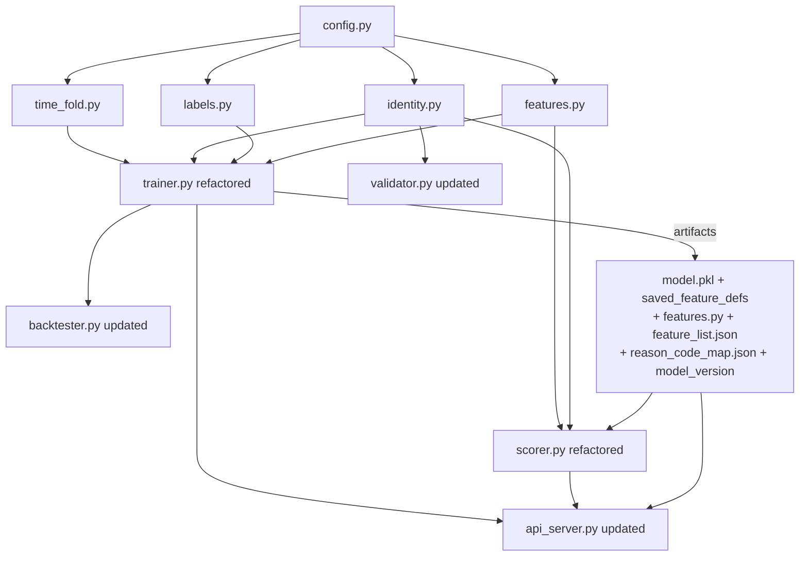

# Patron Walkaway Phase 1 — Implementation Plan

## Current State Summary

Existing files in `trainer/`:

- `config.py` (51 lines) — minimal constants, needs many additions
- `trainer.py` (663 lines) — monolithic: loads data, engineers features (for-loop `loss_streak`, inline rolling), trains single LightGBM model
- `scorer.py` (724 lines) — inline feature computation, no Featuretools, uses `player_id` only
- `backtester.py` (138 lines) — imports `build_labels_and_features` directly from `trainer.py`
- `validator.py` (751 lines) — uses `player_id`, 45-min horizon already present
- `api_server.py` (289 lines) — serves frontend UI + data API; no `/score`, `/health`, `/model_info`

**None of the 4 new modules exist** (`identity.py`, `labels.py`, `features.py`, `time_fold.py`).

## New Packages Required

Before implementation, these must be installed:

```
pip install featuretools optuna shap
```

## Module Dependency Graph




## Artifact Structure (output of trainer.py)

```
trainer/models/
├── rated_model.pkl
├── nonrated_model.pkl
├── saved_feature_defs/          ← featuretools save_features output
├── feature_list.json            ← final screened feature names
├── reason_code_map.json         ← feature → reason_code mapping
└── model_version                ← e.g. "20260228-153000-abc1234"
```

---

## Step-by-Step Implementation

### Step 0 — `trainer/config.py` (update, ~90 lines total)

Add to existing file:

```python
# Business parameters
WALKAWAY_GAP_MIN = 30
ALERT_HORIZON_MIN = 15
LABEL_LOOKAHEAD_MIN = 45  # = X + Y
BET_AVAIL_DELAY_MIN = 1
SESSION_AVAIL_DELAY_MIN = 7   # SSOT §4.2; use 15 for more conservative
RUN_BREAK_MIN = WALKAWAY_GAP_MIN

# Threshold search (DEC-009, DEC-010: F1 maximize, no precision/alert-volume constraint)
OPTUNA_N_TRIALS = 300
# Deprecated / rollback only: G1_PRECISION_MIN, G1_ALERT_VOLUME_MIN_PER_HOUR, G1_FBETA

# Track B constants
TABLE_HC_WINDOW_MIN = 30
PLACEHOLDER_PLAYER_ID = -1
LOSS_STREAK_PUSH_RESETS = False
HIST_AVG_BET_CAP = 500_000

# SQL helpers
CASINO_PLAYER_ID_CLEAN_SQL = (
    "CASE WHEN lower(trim(casino_player_id)) IN ('', 'null') "
    "THEN NULL ELSE trim(casino_player_id) END"
)
```

### Step 1 — DQ guardrails (embedded in each module's SQL)

Not a separate file; the DQ rules are applied wherever data is fetched:

- `t_bet`: `FINAL`, `payout_complete_dtm IS NOT NULL`, `player_id != -1`
- `t_session`: NO `FINAL`, FND-01 ROW_NUMBER CTE, `is_manual=0`, `is_deleted=0 AND is_canceled=0`, `COALESCE(turnover,0)>0 OR COALESCE(num_games_with_wager,0)>0`

### Step 2 — `trainer/identity.py` (new, ~200 lines)

Key interface:

```python
def build_canonical_mapping(client, cutoff_dtm: datetime) -> pd.DataFrame:
    """Returns DataFrame with columns [player_id, canonical_id].
    Uses FND-01 CTE dedup, FND-12 fake account exclusion, D2 M:N resolution."""

def resolve_canonical_id(player_id, session_id, mapping_df, session_lookup) -> str:
    """Three-step D2 resolution for online scoring. Returns canonical_id string."""
```

SQL patterns: both queries use `WITH deduped AS (ROW_NUMBER OVER PARTITION BY session_id ...)`. FND-12 fake-account exclusion must also be applied when building `player_profile_daily` (DEC-011).

### Step 3 — `trainer/labels.py` (new, ~150 lines)

Key interface:

```python
def compute_labels(
    bets_df: pd.DataFrame,          # must be sorted by (canonical_id, payout_complete_dtm, bet_id)
    window_end: datetime,           # core window end
    extended_end: datetime,         # C1 extended end (window_end + LABEL_LOOKAHEAD_MIN or 1 day)
) -> pd.DataFrame:
    """Returns bets_df with added columns: label (0/1), censored (bool).
    gap_start logic: b_{i+1} - b_i >= WALKAWAY_GAP_MIN.
    H1: next_bet missing → censored if coverage insufficient."""
```

### Step 4 — `trainer/features.py` (new, ~350 lines)

**Track A — EntitySet and player_profile_daily (SSOT §8.2, DEC-011)**  
- Rated: `t_bet` → `t_session` (many-to-one by `session_id`). **player_profile_daily** is not added as an EntitySet relationship; use **PIT/as-of join**: for each bet, join the latest `player_profile_daily` row with `snapshot_dtm <= bet_time` by `canonical_id`, then attach profile columns to the bet. Full spec: `doc/player_profile_daily_spec.md`.  
- Non-rated: EntitySet contains only `t_bet`.

Key interfaces:

```python
# Track A
def build_entity_set(bets_df, sessions_df, cutoff_times) -> ft.EntitySet:
    """Builds Featuretools EntitySet: t_bet → t_session (no player entity; profile via as-of join)."""

def run_dfs_exploration(es, cutoff_df, max_depth=2) -> Tuple[pd.DataFrame, list]:
    """Phase 1: DFS on sampled data, returns feature_matrix + feature_defs."""

def save_feature_defs(feature_defs, path: Path): ...
def load_feature_defs(path: Path): ...
def compute_feature_matrix(es, saved_feature_defs, cutoff_df) -> pd.DataFrame:
    """Phase 2: Apply saved defs to full data."""

# Track B Phase 1 (vectorized, shared by trainer AND scorer). table_hc deferred to Phase 2.
def compute_loss_streak(bets_df: pd.DataFrame, cutoff_time: datetime = None) -> pd.Series:
    """Vectorized: status='LOSE'→+1, 'WIN'→reset, 'PUSH'→conditional on LOSS_STREAK_PUSH_RESETS."""

def compute_run_boundary(bets_df: pd.DataFrame) -> pd.DataFrame:
    """Vectorized: RUN_BREAK_MIN gap → new run. Returns run_id, minutes_since_run_start."""

# compute_table_hc: Phase 2 only (not in Phase 1 feature_list.json)

# Feature screening
def screen_features(feature_matrix, labels, feature_names) -> list:
    """Two-stage: (1) mutual info + VIF, (2) optional LightGBM importance on train only."""
```

### Step 5 — `trainer/time_fold.py` (new, ~120 lines) + `trainer/trainer.py` (refactor, ~500 lines)

**time_fold.py** provides:

```python
def get_monthly_chunks(start: datetime, end: datetime) -> list[dict]:
    """Returns list of {window_start, window_end, extended_end} dicts.
    Semantics: core=[window_start, window_end), extended=[window_end, extended_end).
    extended_end = window_end + max(LABEL_LOOKAHEAD_MIN, 1 day)."""

def get_train_valid_test_split(chunks: list, train_frac=0.7, valid_frac=0.15) -> dict:
    """Returns {train_chunks, valid_chunks, test_chunks} by time order."""
```

**trainer.py** refactored flow:

1. Call `time_fold.get_monthly_chunks()` for all boundaries
2. For each chunk: fetch `t_bet` + `t_session` with DQ guardrails, build labels (C1), build features (Phase 1 DFS on sampled, Phase 2 full), write parquet
   - Training/dev may optionally read the **already-exported full tables** from local Parquet (e.g. `.data/` folder, via Pandas or DuckDB) instead of querying ClickHouse to speed up iteration. This is an I/O swap only: apply the same DQ filters/dedup rules and enforce the same available-time/cutoff semantics. Production scoring/validation still uses ClickHouse as the source of truth.
3. After all chunks: load parquets, split train/valid/test
4. **Run-level sample weight**: Compute `sample_weight = 1 / N_run` per observation (training set only), where `N_run` = number of bets in the same run (same `canonical_id`, same run from `compute_run_boundary`). This corrects length bias so each run contributes more equally; use with `class_weight='balanced'`.
5. Optuna hyperparameter search on valid set
6. Train Rated + Non-rated LightGBM models with `class_weight='balanced'` + `sample_weight`
7. Save atomic artifact bundle

### Step 6 — `trainer/backtester.py` (update, ~250 lines)

Remove dependency on `trainer.build_labels_and_features`. Import from `labels.py` and `features.py` directly.

Add:

- **Optuna TPE 2D threshold search** (`rated_threshold`, `nonrated_threshold`): **F1 maximize** (DEC-009, DEC-010); no G1 precision/alert-volume constraint.
- **Bet-level (Micro) metrics** only for Phase 1: `compute_micro_metrics(df, threshold)` (Precision, Recall, PR-AUC, F-beta, alerts/hour). Macro-by-run deferred (DEC-012).
- **Per-run at-most-1-TP dedup** for evaluation only (offline metric; does not imply online alert throttling).

### Step 7 — `trainer/scorer.py` (refactor, ~600 lines)

Key changes from existing:

- Remove inline feature computation; replace with:
  - Track A: `featuretools.calculate_feature_matrix(saved_feature_defs, entityset)` with current poll time as cutoff; rated path uses player_profile_daily via PIT/as-of join (see Step 4).
  - Track B Phase 1: `from features import compute_loss_streak, compute_run_boundary` (no `compute_table_hc` in Phase 1).
- `t_session` queries: NO FINAL, FND-01 CTE dedup, `session_avail_dtm <= now - SESSION_AVAIL_DELAY_MIN`
- D2 three-step identity resolution via `identity.resolve_canonical_id()`
- H3 model routing: `is_rated_obs = (resolved_card_id IS NOT NULL)`, no `is_known_player`
- Reason code output: SHAP top-k → `reason_code_map.json` lookup, output every poll without filtering
- Output includes: `reason_codes`, `score`, `margin`, `model_version`, `scored_at`

Existing SQLite `alerts` table schema needs `reason_codes`, `model_version`, `scored_at`, `margin`, `canonical_id`, `is_rated_obs` columns added.

### Step 8 — `trainer/validator.py` (update, ~800 lines)

Changes to existing:

- Replace `player_id` grouping key with `canonical_id` (load from identity mapping cache)
- `LABEL_LOOKAHEAD_MIN = 45` from config (already effectively 45 in existing code)
- Run/gaming_day dedup: use `gaming_day` column (and run boundaries when needed; already in t_bet/t_session)
- Write back `canonical_id` and `model_version` to validation_results table

### Step 9 — `trainer/api_server.py` (update, ~350 lines)

Keep all existing routes intact (frontend serving + data API). Add:

```python
@app.route("/score", methods=["POST"])
def score():
    """Stateless scoring endpoint. Loads current model bundle on first request (cached).
    Input: JSON list of bet-level feature dicts (max 10,000).
    Output: JSON list of {score, alert, reason_codes, model_version}.
    422 if schema mismatch."""

@app.route("/health", methods=["GET"])
def health():
    """Returns {"status": "ok", "model_version": current_version}."""

@app.route("/model_info", methods=["GET"])
def model_info():
    """Returns {"model_type", "model_version", "features": [...], "training_metrics": {...}}
    Reads dynamically from feature_list.json and model_version file."""
```

Schema validation: check that all columns in `feature_list.json` are present in request; return 422 if not.

### Step 10 — `tests/` directory (new)

Structure:

```
tests/
├── test_config.py          ← validates all required constants exist
├── test_labels.py          ← label sanity, H1 censoring, no leakage from extended zone
├── test_features.py        ← Track B vectorized correctness, cutoff enforcement, parity
├── test_identity.py        ← D2 M:N resolution, FND-12 exclusion, cutoff_dtm leakage
├── test_trainer.py         ← run-level sample_weight correctness, artifact bundle completeness
├── test_backtester.py      ← Bet-level metrics, per-run TP dedup evaluation
├── test_scorer.py          ← model routing (H3), reason code output completeness
└── test_dq_guardrails.py   ← schema compliance (no is_manual on t_bet, no FINAL on t_session)
```

Uses `pytest` with small synthetic DataFrames — no ClickHouse connection required.

---

## Implementation Order

1. `config.py` (prerequisite for everything)
2. `time_fold.py` (prerequisite for trainer)
3. `identity.py` (prerequisite for trainer + scorer)
4. `labels.py` (prerequisite for trainer)
5. `features.py` (prerequisite for trainer + scorer)
6. `trainer.py` (refactor, depends on 1-5)
7. `backtester.py` (depends on features.py + labels.py)
8. `scorer.py` (depends on features.py + identity.py + model artifacts)
9. `validator.py` (depends on identity.py)
10. `api_server.py` (depends on model artifacts structure)
11. `tests/` (validates all of the above)

## Fast Mode（DEC-017 — Data-Horizon 限制模式）

> **取代先前的 DEC-015（Rated Sampling + Full Nonrated）。** DEC-015 的 Rated Sampling 功能保留為獨立的 `--sample-rated N` flag。

### 設計原則

**Fast mode = 「假設你只有最近 N 天的原始資料」。**

這是 data-source 層級的限制，所有子模組（identity、labels、features、profile ETL）必須遵守同一個時間邊界，不得存取或計算超出此邊界的任何資料。速度提升是「資料量減少」的自然結果，而非抽樣或跳步。

### 核心概念：Data Horizon

```
                    data_horizon_days
          |<─────────────────────────────>|
  data_start                         data_end
  (= effective_start)                (= effective_end)
          │                               │
          │   canonical mapping: 只用此範圍內的 sessions
          │   profile snapshots: 只建此範圍內的日期
          │   profile features:  只計算 ≤ data_horizon_days 的窗口
          │   training chunks:   只處理此範圍內的 chunks
```

- `data_horizon_days = (effective_end - effective_start).days`
- `effective_start` / `effective_end` 由 `--recent-chunks` 或 `--start`/`--end` 決定
- Normal mode 不影響（profile 仍可 lookback 365 天）

### 行為對照表

| 面向 | Normal Mode | Fast Mode (`--fast-mode`) |
|------|-------------|---------------------------|
| **資料時間範圍** | 全量（含 profile 365 天 lookback） | 僅 effective window 內（不往前推 365 天） |
| **Canonical mapping** | effective window 內的 sessions | 同左（不變） |
| **Profile snapshot 日期範圍** | `effective_start - 365d` → `effective_end` | `effective_start` → `effective_end`（不往前推） |
| **Profile 特徵窗口** | 7d / 30d / 90d / 180d / 365d 全部計算 | **動態**：只計算 ≤ `data_horizon_days` 的窗口（見下表） |
| **Profile snapshot 頻率** | 每天 | 每 7 天（`snapshot_interval_days=7`） |
| **Optuna 超參搜索** | OPTUNA_N_TRIALS 次 | 跳過，使用 default HP（`--skip-optuna` 隱含） |
| **Rated 玩家範圍** | 全量 | **全量**（預設不抽樣；可搭配 `--sample-rated N`） |
| **模型 artifact** | 正常輸出 | 結構不變，metadata 標記 `fast_mode=True` |

### Profile 特徵動態分層

`_compute_profile` 根據 `max_lookback_days` 決定計算哪些時間窗口。超出可用天數的窗口直接跳過，對應欄位為 NaN。

| 可用資料天數 (`data_horizon_days`) | 計算的窗口 | 跳過的窗口 |
|---|---|---|
| < 7 天 | 無（跳過 profile） | 全部 |
| 7–29 天 | 7d | 30d, 90d, 180d, 365d |
| 30–89 天 | 7d, 30d | 90d, 180d, 365d |
| 90–179 天 | 7d, 30d, 90d | 180d, 365d |
| 180–364 天 | 7d, 30d, 90d, 180d | 365d |
| ≥ 365 天 | 全部 | 無 |

**Ratio 特徵**（如 `turnover_30d_over_180d`）：需要分子和分母兩個窗口都有效才計算，否則為 NaN。

**Recency 特徵**（`days_since_last_session`、`days_since_first_session`）：語義仍正確，但 `days_since_first_session` 的上限會被截斷至可用資料範圍，可接受。

### 獨立 Flag：`--sample-rated N`

與 `--fast-mode` 完全正交。控制「rated 玩家數量」而非「資料時間範圍」。

- **預設**：不啟用（全量 rated patrons）
- **行為**：從 canonical_map 中 deterministic sort + head(N) 抽樣，傳 `canonical_id_whitelist` 給 profile ETL 與 training
- **適用情境**：在全量日期範圍上以少量 patron 快速測試完整 pipeline

| 指令範例 | 行為 |
|---|---|
| `--fast-mode --recent-chunks 1` | 只用最後 1 個月資料，全量 rated patrons，profile 特徵窗口 ≤ ~30d |
| `--fast-mode --recent-chunks 3 --sample-rated 1000` | 最後 3 個月資料，只取 1000 rated patrons |
| `--sample-rated 500`（無 fast-mode） | 全量日期範圍（含 365d lookback），但只取 500 rated patrons |
| 什麼都不加 | 全量日期 + 全量 rated（production 正常模式） |

### Bug 修復：`canonical_map` 傳遞鏈（兩種模式都需要）

**現有問題**：`trainer.py:run_pipeline` 在記憶體中建好 `canonical_map`，但呼叫 `ensure_player_profile_daily_ready` → `backfill` 時，`backfill()` 沒有 `canonical_map` 參數，自行去讀 `data/canonical_mapping.parquet`（不存在）→ 每天噴 `No local canonical_mapping.parquet; cannot join canonical_id` → profile 全部建失敗。

**修正**：
- `backfill()` 新增 `canonical_map: Optional[pd.DataFrame] = None` 參數
- `ensure_player_profile_daily_ready()` 新增 `canonical_map` 參數
- `trainer.py:run_pipeline` 把已建好的 `canonical_map` 一路傳到底
- 此修正同時適用 normal mode 和 fast mode

### 各模組改動清單

1. **`features.py`**
   - 新增 `get_profile_feature_cols(max_lookback_days: int = 365) -> List[str]`
   - 根據 `max_lookback_days` 過濾出可計算的特徵子集
   - 靜態 `PROFILE_FEATURE_COLS` 保留（= `get_profile_feature_cols(365)`，用於 scorer / normal mode 參考）

2. **`etl_player_profile.py`**
   - `backfill()` 新增 `canonical_map` 參數，傳入時跳過自行建 map 邏輯
   - `backfill()` 新增 `max_lookback_days` 參數
   - `build_player_profile_daily()` 新增 `max_lookback_days` 參數，傳遞至 `_compute_profile`
   - `_compute_profile()` 新增 `max_lookback_days` 參數，只計算有效窗口的特徵
   - `canonical_id_whitelist` 參數保留（給 `--sample-rated` 用）

3. **`trainer.py`**
   - `--fast-mode`：推導 `data_horizon_days = (effective_end - effective_start).days`
   - `--sample-rated N`（新 flag，取代原 fast-mode 隱含的抽樣，預設不啟用）
   - `ensure_player_profile_daily_ready()` 新增 `canonical_map` 和 `max_lookback_days` 參數
   - Fast mode：`required_start = effective_start.date()`（不往前推 365 天）
   - 用 `get_profile_feature_cols(data_horizon_days)` 決定動態 feature list
   - `ALL_FEATURE_COLS` 在 `run_pipeline` 中動態組合（Track B + Legacy + Profile 子集）
   - 把 `canonical_map` 一路傳入 profile 建表流程

### 不改動的部分

- 快取 schema hash 機制照常運作
- 時間折疊（`time_fold.py`）不受影響
- `--recent-chunks` 與 `--fast-mode` 可疊加使用
- Nonrated model 路徑完全不受影響
- `--fast-mode-no-preload` 保留（低 RAM 保護，正交）
- `--skip-optuna` 保留（可不搭配 fast-mode 獨立使用）

### 安全護欄

- Fast-mode 產出的模型 **不得用於生產推論**；artifact metadata 標記 `fast_mode=True`
- Scorer 載入模型時應檢查此 flag 並在 production 環境拒絕載入
- Fast-mode 的 profile cache 與 normal-mode 不混用（schema hash 機制自動處理）
- `--sample-rated` 產出的模型同樣標記（rated 模型只用部分玩家訓練）

---

## --recent-chunks 與 Local Parquet 視窗對齊

### 目的

使用 `--use-local-parquet` 且未指定 `--start`/`--end` 時，預設視窗為「現在往前 N 天」，導致本機 Parquet 資料若早於今日，會產生無資料的 chunk；`--recent-chunks N` 取的是「相對今天」的最後 N 個 chunk，在離線資料上無效。

改為以**資料實際結束日**為基準：從 bet / session Parquet 的 metadata 讀取 max date，用其作為視窗 end，再回推 start，使 `--recent-chunks` 表示「資料內最近 N 個月度 chunk」。

### 行為

| 情境 | 行為 |
|------|------|
| 未用 `--use-local-parquet` | 不變：視窗仍為 now - days ~ now - 30min |
| 使用 `--use-local-parquet` 且未給 `--start`/`--end` | 從 `gmwds_t_bet.parquet` 與 `gmwds_t_session.parquet` 的 row-group statistics 讀取 (min, max) date；end = min(bet_max, session_max) 的當日 00:00（exclusive 語義取次日 00:00），start = end - days；若 metadata 讀取失敗則 fallback 原邏輯並 log warning |
| 顯式提供 `--start` 與 `--end` | 不受影響，不偵測資料範圍 |

### 實作要點

- `trainer.py` 新增 `_detect_local_data_end()`：呼叫既有 `_parquet_date_range(bet_path, ...)` 與 `_parquet_date_range(session_path, ...)`，取兩者 max date 的 **min**（保守：兩表都有資料到該日）。
- 在 `run_pipeline()` 中，`parse_window(args)` 之後、`get_monthly_chunks()` 之前：若 `use_local_parquet and not (args.start or args.end)`，則以偵測到的 data_end 調整 start/end，並 log 調整後的視窗。
- 僅讀 metadata（row-group statistics），不掃描資料列，零額外 I/O 成本。

### 安全與相容性

- ClickHouse 路徑與顯式 `--start`/`--end` 完全不變。
- 同一份 Parquet 重跑 → 相同視窗 → 可重現。
- Bet / session 結束日若差 1–2 天，取 min 確保兩表在 end 前皆有資料。

---

## 解決 Fast Mode 在 8GB 記憶體上的 OOM 問題

### 目的

Fast Mode 目前會呼叫 `_preload_sessions_local()`，一次將整個 `gmwds_t_session.parquet`（約 7400 萬列，大小 2-4GB+）載入記憶體。在 8GB 記憶體的機器上，這會直接導致 OOM。我們需要提供關閉 Preload 的選項，並透過 Pandas/PyArrow 的 `filters` 下推（Predicate Pushdown）技術，讓逐日讀取時記憶體也能保持在安全範圍。

> **DEC-017 備註**：新的 Data-Horizon 設計下，`--fast-mode --recent-chunks N` 會將 profile 日期範圍限制在 effective window 內（不往前推 365 天），session 讀取範圍也相應縮小，本身即大幅降低記憶體需求。`--fast-mode-no-preload` 仍作為額外保險，適用於即使限縮後 session 量仍然很大的情境。

### 實作要點（方案一：Pandas + filters）

1. **新增 CLI 開關關閉 Preload**
   - 在 `trainer.py` 新增 `--fast-mode-no-preload` 參數。
   - 將此參數一路傳遞：`run_pipeline` -> `ensure_player_profile_daily_ready` -> `backfill`。
   - 在 `backfill` 中，若此開關開啟，則 **不呼叫** `_preload_sessions_local()`，讓 `preloaded_sessions` 維持 `None`，從而觸發原本的「逐日讀取」邏輯 (`_load_sessions_local`)。

2. **優化 `_load_sessions_local` (加入 Parquet Filters)**
   - 在 `etl_player_profile.py` 的 `_load_sessions_local` 中，目前的寫法是整檔讀取 (`pd.read_parquet(..., columns=...)`)。
   - 改為使用 `filters=[...]`，限制 `session_end_dtm` (或 `session_start_dtm` 等) 必須在 `[lo_dtm, snapshot_dtm]` 之間。
   - 需要引入與 `trainer.load_local_parquet` 相同的 `_filter_ts` 邏輯，以正確處理 Parquet 欄位是否帶有 timezone (`timestamp[ms, tz=UTC]`) 的問題，避免 PyArrow `ArrowNotImplementedError`。

### 影響評估

- **記憶體**：顯著降低峰值，允許 8GB 機器順利跑完 Fast Mode。
- **速度**：Backfill 階段會因為 N 次 Parquet 讀取而稍微變慢，但透過 filters 下推，每次只讀取相關的 row-groups，能將 I/O 成本降到最低。
- **正確性**：無影響，依賴現有的邏輯產出完全相同的 Profile DataFrame。

---

## Key Risks / Notes

- **featuretools + optuna must be installed** before running the refactored trainer
- The **existing `walkaway_model.pkl`** format (single model, `{"model", "features", "threshold"}`) is incompatible with the new dual-model format; the scorer will need the new artifacts before it can score
- The `backtester.py` currently imports `build_labels_and_features` directly from `trainer.py` — this import is removed in the refactored version
- `api_server.py`'s existing data-serving routes (`/get_alerts`, `/get_validation`, `/get_floor_status`) are left completely intact; only new model-API routes are added

