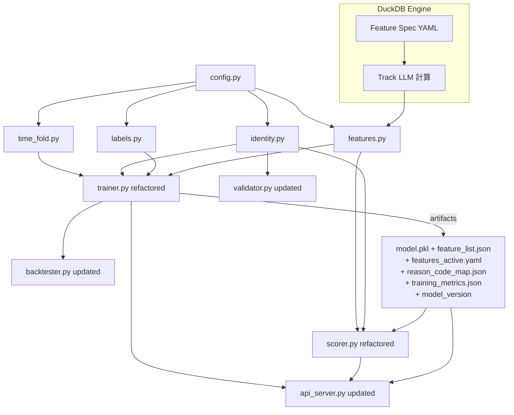

# Patron Walkaway Phase 1 — 實作計畫（SSOT v10 對齊）

> **本計畫對齊 `ssot/patron_walkaway_phase_1.plan.md`（v10）與 `ssot/trainer_plan_ssot.md`。**
>
> v10 核心變更：
> - **單一 Rated 模型**：不為無卡客建模或推論；Non-rated 觀測僅記錄 volume。
> - **三軌特徵工程**（DEC-022/023/024）：Track Profile（`player_profile_daily`）、Track LLM（DuckDB + Feature Spec YAML）、Track Human（向量化手寫狀態機）。
> - **閾值策略**（DEC-009/010）：**F1 最大化**，無 precision/alert volume 門檻約束。
> - **Track Human Phase 1**：`loss_streak`、`run_boundary` 啟用；`table_hc` 延至 Phase 2。
> - **DuckDB 為核心計算引擎**（DEC-023）：取代 Featuretools DFS，用於 Track LLM；並作為 `player_profile` **local Parquet ETL** 的目標加速引擎。**ClickHouse path 先維持現狀**（SQL → Python/pandas → 聚合）。
> - **Feature Spec YAML**（DEC-024）：集中管理三軌候選特徵定義。
> - **DEC-021**：無卡客 volume logging 規格。

---

## 架構決策摘要（SSOT 固定）

- 身份歸戶：**D2**（Canonical ID；`casino_player_id` 優先）
- 右截尾：**C1**（Extended pull；至少 X+Y，建議 1 天）
- Session 特徵策略：**S1**（保守；Phase 1 不啟用 `table_hc`）
- 上線閾值策略：**F1 最大化**（DEC-009/010）；不設 precision/alert volume 下限約束
- 模型：Phase 1 = **LightGBM 單一模型（Rated only）**
- 評估口徑：**Bet-level**（SSOT §10；Run-level 延後見 DEC-012）
- 術語：**Run**（bet-derived 連續下注段；gap ≥ RUN_BREAK_MIN 切分；DEC-013）
- 特徵計算引擎：**DuckDB**（DEC-023；Track LLM 核心，且規劃用於 `player_profile` 的 local Parquet ETL；ClickHouse ETL path 暫不改）

---

## SSOT 章節對應與相關文件

| SSOT 章節 | 對應 Phase 1 步驟 | 備註 |
|-----------|------------------|------|
| §2 名詞定義 | Step 0 | WALKAWAY_GAP_MIN, ALERT_HORIZON_MIN, Run 定義 |
| §4 資料來源與即時可用性 | Step 0, Step 5, Step 7 | BET_AVAIL_DELAY_MIN, SESSION_AVAIL_DELAY_MIN, time_fold |
| §4.3 Player-level table | Step 4 Track Profile | 完整規格見 `doc/player_profile_daily_spec.md` |
| §5 關鍵資料品質護欄 | Step 1, Step 2 | FND-01～FND-14, F3, FND-04 不要過濾 status |
| §6 玩家身份歸戶 D2 | Step 2 identity.py | FND-12 建置時套用；FND-12 亦用於 player_profile_daily |
| §7 標籤設計 | Step 3 labels.py | C1 延伸拉取，G3 穩定排序 |
| §8.2 特徵工程（三軌） | Step 4 features.py | Track Profile / Track LLM / Track Human |
| §8.3 Session 特徵 S1 | Step 4, Step 7 | 進行中 session 不可見；table_hc Phase 1 不啟用 |
| §9 建模方法 | Step 5, Step 6 | 單一模型、Optuna、PR-AUC 超參、F1 閾值 |
| §9.4 Model API Contract | Step 9 | 完整合約見 `doc/model_api_protocol.md` |
| §10 評估與閾值 | Step 6 | Bet-level；F1 最大化；DEC-009/010 |
| §12 Remediation / Reason codes | Step 7, Step 10 | TRN-* 對應；reason codes 見 §12.1 |

**相關文件**：`doc/FINDINGS.md`（FND-*）、`doc/player_profile_daily_spec.md`（player-level 欄位規格）、`doc/model_api_protocol.md`（API 合約）、`.cursor/plans/DECISION_LOG.md`（DEC-*）、`schema/GDP_GMWDS_Raw_Schema_Dictionary.md`（欄位字典）

---

## 主要異動檔案

```
trainer/
├── config.py        ← 更新：新增 TABLE_HC_WINDOW_MIN / PLACEHOLDER_PLAYER_ID
│                              / LOSS_STREAK_PUSH_RESETS / HIST_AVG_BET_CAP
│                              / OPTUNA_N_TRIALS / UNRATED_VOLUME_LOG
├── time_fold.py     ← 新建：集中式時間窗口定義器（SSOT §4.3）
├── identity.py      ← 新建：D2 歸戶（FND-12 正確聚合 + player_id != -1）
├── labels.py        ← 新建：C1 防洩漏標籤
├── features.py      ← 新建：三軌特徵工程（Track Profile / Track LLM / Track Human）
│                              Track LLM：DuckDB + Feature Spec YAML
│                              Track Human Phase 1：loss_streak / run_boundary
│                              table_hc 延至 Phase 2
├── trainer.py       ← 重構：整合三軌，DuckDB 特徵計算 + Feature Screening
│                              僅訓練 Rated 模型
├── scorer.py        ← 重構：內嵌 DuckDB 計算 Track LLM + 匯入 features.py
│                              D2 四步身份判定，無卡客僅 volume log
├── backtester.py    ← 更新：單一閾值搜尋（Optuna TPE），無 G1 約束；僅 rated 觀測
├── validator.py     ← 更新：canonical_id + 45min horizon
└── api_server.py    ← 更新：Model API Contract（單一模型）

trainer/feature_spec/
└── features_candidates.template.yaml  ← Feature Spec YAML 候選特徵定義（DEC-024）

tests/
├── test_config.py
├── test_labels.py
├── test_features.py
├── test_identity.py
├── test_trainer.py
├── test_backtester.py
├── test_scorer.py
└── test_dq_guardrails.py
```

---

## Module 依賴圖



---

## Artifact 結構（output of trainer.py）

```
trainer/models/
├── model.pkl                   ← 單一 Rated LightGBM 模型
├── feature_list.json           ← 最終篩選後的特徵名稱清單（三軌合併）
├── features_active.yaml        ← 篩選後的 active Feature Spec（含 track/type 等 metadata）
├── reason_code_map.json        ← feature → reason_code 映射
├── training_metrics.json       ← validation + test set metrics；feature importance 排名
└── model_version               ← e.g. "20260228-153000-abc1234"
```

`training_metrics.json` 必須包含：
1. Validation-set 指標（用於 Optuna 超參調優）與 test-set 指標（held-out 最終報告）
2. 模型使用的特徵清單，按 importance 排名（記錄使用的 importance method，如 `"gain"` / `"shap"`）
3. Feature Spec YAML hash（追蹤此模型使用哪一版特徵定義）

---

## Phase 1 實作步驟

### Step 0 — 集中常數定義（`trainer/config.py`）

**目標**：全系統唯一事實來源。

**業務參數**

- `WALKAWAY_GAP_MIN = 30`（X）
- `ALERT_HORIZON_MIN = 15`（Y）
- `LABEL_LOOKAHEAD_MIN = 45`（= X + Y）

**資料可用性延遲**

- `BET_AVAIL_DELAY_MIN = 1`（`t_bet`；SSOT §4.2）
- `SESSION_AVAIL_DELAY_MIN = 7`（`t_session`；SSOT §2.1/§4.2；若需更保守可設為 15）

**Run 邊界**

- `RUN_BREAK_MIN = WALKAWAY_GAP_MIN`（= 30 分鐘）

**Gaming Day（v4：G4 修正）**

- 主流程以資料表 `gaming_day` 欄位為準。
- `GAMING_DAY_START_HOUR = 6` 僅保留為備援參數。

**閾值搜尋（DEC-009/010/021：F1 最大化，單一閾值，無 G1 約束）**

- `OPTUNA_N_TRIALS = 300`（Optuna TPE 搜尋次數；1D 空間通常足以收斂）
- 廢棄：`G1_PRECISION_MIN`、`G1_ALERT_VOLUME_MIN_PER_HOUR`、`G1_FBETA`（見 DEC-009/010 回退說明）

**新增常數**

- `TABLE_HC_WINDOW_MIN = 30`（D1：S1 `table_hc` 回溯窗口分鐘數）
- `PLACEHOLDER_PLAYER_ID = -1`（E4/F1：無效佔位符）
- `LOSS_STREAK_PUSH_RESETS = False`（F4：PUSH 是否重置連敗計數）
- `HIST_AVG_BET_CAP = 500_000`（F2：`hist_avg_bet` winsorization 上限）
- `UNRATED_VOLUME_LOG = True`（DEC-021：是否記錄無卡客 volume 統計）

**SQL fragment 常數**

```python
CASINO_PLAYER_ID_CLEAN_SQL = (
    "CASE WHEN lower(trim(casino_player_id)) IN ('', 'null') "
    "THEN NULL ELSE trim(casino_player_id) END"
)
```

---

### Step 1 — 資料品質護欄（嵌入各模組 SQL）

**目標**：修正所有 P0 DQ 問題（對齊 SSOT §5）。非獨立檔案，DQ 規則嵌入各模組。

**必須實作的過濾模式**

- **G1（高）**：`t_session` **禁用 `FINAL`**。ReplacingMergeTree 無 version 欄位，FINAL 會非決定性丟列。必須依賴 FND-01 SQL window 去重。
- **E5**：`t_bet` 可使用 `FINAL`；`t_session` 一律不用。
- **FND-01（TRN-01）**：`t_session` 去重：`ROW_NUMBER() OVER (PARTITION BY session_id ORDER BY lud_dtm DESC NULLS LAST, __etl_insert_Dtm DESC) = 1`
- **FND-02（TRN-02 — E1 修正）**：`is_manual = 0` **僅適用 `t_session`**。`t_bet` 無此欄位。
- **E3**：`t_bet` 查詢基礎 WHERE 必須包含 `payout_complete_dtm IS NOT NULL`。
- **E4/F1**：`player_id = -1` 或 NULL 視為無效。
  - **G2**：若 `player_id` 無效但 `session_id` 有效，先 join `t_session`（FND-01 去重後）回補：`effective_player_id = COALESCE(t_bet.player_id, t_session.player_id)`。最終只保留有效的 `effective_player_id`。
- **F3**：`t_session` 查詢加入 `is_deleted = 0 AND is_canceled = 0`。
- **FND-03**：`casino_player_id` 清洗使用 `CASINO_PLAYER_ID_CLEAN_SQL`。
- **FND-04（E7 修正）**：**不要**過濾 `status = 'SUCCESS'`。保留 `COALESCE(turnover, 0) > 0 OR COALESCE(num_games_with_wager, 0) > 0` 的 Session。
- **FND-06/FND-08**：移除 `bet_reconciled_at`、`bonus`、`tip_amount`、`increment_wager`、`payout_value`。
- **FND-09**：禁用 `is_known_player`；改為 `casino_player_id IS NOT NULL`。
- **FND-13**：禁止使用 `__etl_insert_Dtm`、`__ts_ms` 做時間排序。

---

### Step 2 — 身份歸戶模組（`trainer/identity.py`，D2）

**目標**：建立 `player_id → canonical_id` 映射。

**Key Interface**

```python
def build_canonical_mapping(client, cutoff_dtm: datetime) -> pd.DataFrame:
    """Returns DataFrame with columns [player_id, canonical_id].
    Uses FND-01 CTE dedup, FND-12 fake account exclusion, D2 M:N resolution.
    cutoff_dtm prevents mapping leakage (B1)."""

def resolve_canonical_id(player_id, session_id, mapping_df, session_lookup) -> Optional[str]:
    """D2 identity resolution for online scoring.
    Returns canonical_id string. Step 3 fallback: if not in mapping (unrated),
    returns str(player_id) so downstream can identify the observation; only
    returns None when player_id is None or PLACEHOLDER_PLAYER_ID (no usable identity).
    Rated vs unrated is determined by canonical_id in mapping (casino_player_id), not by this return."""
```

**Mapping 建置查詢**（G1：不用 FINAL；I2：先 FND-01 CTE 去重）

```sql
WITH deduped AS (
  SELECT *,
    ROW_NUMBER() OVER (
      PARTITION BY session_id
      ORDER BY lud_dtm DESC NULLS LAST, __etl_insert_Dtm DESC
    ) AS rn
  FROM t_session
)
SELECT player_id, casino_player_id
FROM deduped
WHERE rn = 1
  AND is_manual = 0
  AND is_deleted = 0 AND is_canceled = 0
  AND player_id IS NOT NULL AND player_id != {PLACEHOLDER_PLAYER_ID}
  AND COALESCE(session_end_dtm, lud_dtm) <= :cutoff_dtm
  AND {CASINO_PLAYER_ID_CLEAN_SQL} IS NOT NULL
```

**FND-12 假帳號排除**（E6/I1/I2 修正；應用於 Canonical mapping 與 player_profile_daily）

```sql
WITH deduped AS (
  SELECT *,
    ROW_NUMBER() OVER (
      PARTITION BY session_id
      ORDER BY lud_dtm DESC NULLS LAST, __etl_insert_Dtm DESC
    ) AS rn
  FROM t_session
)
SELECT player_id
FROM deduped
WHERE rn = 1 AND is_manual = 0
  AND is_deleted = 0 AND is_canceled = 0
  AND player_id IS NOT NULL AND player_id != {PLACEHOLDER_PLAYER_ID}
GROUP BY player_id
HAVING COUNT(session_id) = 1 AND SUM(COALESCE(num_games_with_wager, 0)) <= 1
```

**M:N 衝突規則**

- 情境 1（斷鏈重發）：同一 `casino_player_id` ↔ 多個 `player_id` → 全部映射至同一 `canonical_id = casino_player_id`
- 情境 2（換卡）：同一 `player_id` ↔ 多個 `casino_player_id` → 取最新（最大 `lud_dtm`）的 `casino_player_id`

**語義**

- 訓練期：`cutoff_dtm = training_window_end`，防止 mapping leakage（B1）
- 推論期：定期增量更新快取（每小時），`built_at` + `model_version` 記錄
- **訓練與推論僅保留 `canonical_id` 來自 `casino_player_id`（IS NOT NULL）的條目**。兜底到 player_id 的映射保留作身份辨識參考，但不用於特徵計算或模型推論。

---

### Step 3 — 標籤建構模組（`trainer/labels.py`，C1）

**目標**：防洩漏 walkaway label，處理右截尾（TRN-06）。

**Key Interface**

```python
def compute_labels(
    bets_df: pd.DataFrame,          # sorted by (canonical_id, payout_complete_dtm, bet_id)
    window_end: datetime,
    extended_end: datetime,         # C1 extended end (window_end + LABEL_LOOKAHEAD_MIN or 1 day)
) -> pd.DataFrame:
    """Returns bets_df with added columns: label (0/1), censored (bool).
    Only processes rated bets (canonical_id in Canonical ID whitelist)."""
```

**規則**

- **僅處理 rated 觀測**：標籤建構前，先過濾只保留 `canonical_id IN Canonical ID 名單（= casino_player_id 集合）` 的 bet 序列
- **G3 穩定排序**：`ORDER BY payout_complete_dtm ASC, bet_id ASC`
- Gap start：`b_{i+1} - b_i ≥ WALKAWAY_GAP_MIN`
- Label：觀測點 `t = b_j`，若 `[t, t + ALERT_HORIZON_MIN]` 內存在 gap start → `label = 1`
- **C1 延伸拉取**：`window_end` 往後至少 `LABEL_LOOKAHEAD_MIN`，實務建議 1 天；延伸區間僅用於標籤計算，不納入訓練集
- **H1 終端下注**：next_bet 缺失時：
  - 可判定：`b_i + WALKAWAY_GAP_MIN <= extended_end` → 視為 gap start
  - 不可判定：覆蓋不足 → `censored = True`，排除訓練/評估
- 嚴禁進入特徵：`minutes_to_next_bet`、`next_bet_dtm` 等

---

### Step 4 — 共用特徵模組（`trainer/features.py`，Train-Serve Parity 核心）

**目標**：導入三軌特徵工程，取代舊有靜態特徵清單與 Featuretools DFS；確保 Trainer 與 Scorer 間的絕對 parity。

#### A. Track Profile：玩家輪廓特徵（`player_profile_daily`）

- `player_profile_daily`（DEC-011）為 **rated-only** 快取衍生表，提供長期歷史輪廓（patron profile）
- PIT/as-of join：對每筆 bet，以 `canonical_id` 為 key，選取 `snapshot_dtm <= bet_time` 的最新快照，將 profile 欄位貼到該筆 bet 作為特徵
- 建置前必須套用 §5 DQ（FND-01/02/03/04/09/12）
- Non-rated 不計算 Track Profile
- 完整欄位清單見 `doc/player_profile_daily_spec.md`
- **實作策略（OPT-002）**：
  - **Local Parquet path**：改為 DuckDB 直接掃描 `t_session` Parquet、套用 DQ / D2 / FND-12，並在 DuckDB 內完成 profile 聚合後才將結果拉回 Python。
  - **ClickHouse path**：**維持現狀**，仍由 ClickHouse SQL 抽取 session 結果到 Python/pandas，再沿用既有聚合邏輯；本次不做 DuckDB 化。

```python
def join_player_profile_daily(
    bets_df: pd.DataFrame,
    profile_df: pd.DataFrame,
    time_col: str = "payout_complete_dtm",
) -> pd.DataFrame:
    """PIT/as-of join: for each bet, attach the latest profile snapshot
    where snapshot_dtm <= bet_time."""
```

#### B. Track LLM：DuckDB + Feature Spec YAML 的 Bet-level 特徵

以 DuckDB 為引擎，對 `t_bet` 進行 partition-by `canonical_id`、order-by `payout_complete_dtm, bet_id` 的時間窗口與 lag/transform/derived 計算。

**Feature Spec YAML 定義（DEC-024）**：

- `type`：`window` / `lag` / `transform` / `derived`
- `expression`：不含 `SELECT`/`FROM`/`JOIN` 的純運算片段
- `window_frame`：僅允許過去 + 當前 row（禁止 `FOLLOWING`）；Parser 靜態檢查
- `max_window_minutes` 控制視窗長度上限，驅動 scorer 的 `HISTORY_WINDOW_MIN`

**執行方式**：

- 訓練端：DuckDB 掃描 Parquet，按月度 chunk + C1 延伸區間計算全量 Track LLM 候選特徵
- 推論端：`scorer.py` 內嵌 DuckDB，對最近 `HISTORY_WINDOW_MIN` 的 bets 執行相同 SQL

```python
def compute_track_llm_features(
    bets_df: pd.DataFrame,
    feature_spec: dict,
    cutoff_time: datetime = None,
) -> pd.DataFrame:
    """Compute Track LLM features via DuckDB using Feature Spec YAML definitions.
    All window frames are strictly backward-looking (no FOLLOWING)."""

def load_feature_spec(yaml_path: Path) -> dict:
    """Load and validate Feature Spec YAML. Static check: no FOLLOWING,
    no SELECT/FROM/JOIN in expressions, no circular depends_on."""
```

#### C. Track Human：手工向量化特徵（狀態機與 Run-level）

以下特徵涉及條件重置狀態機或跨下注段聚合，無法以單一 window function 安全表達，必須以向量化程式碼手寫實作：

| 特徵 | 為何不適合 Track LLM | 實作方式 |
|------|---------------------|----------|
| `loss_streak` | 需「遇 WIN 重置、遇 PUSH 條件可選擇不重置」的序列狀態機 | 向量化 Pandas/Polars；`status='LOSE'`→+1，`WIN`→重置，`PUSH` 依 `LOSS_STREAK_PUSH_RESETS`（F4） |
| `run_boundary` / `minutes_since_run_start` | 需「相鄰 bet 間距 ≥ `RUN_BREAK_MIN` → 新 run」的序列切割 | 同上（B2 修正） |
| `table_hc`（S1） | 需跨玩家、以 `table_id` 為軸心的滾動聚合 | **Phase 1 不啟用**，延至 Phase 2 |

```python
def compute_loss_streak(bets_df: pd.DataFrame, cutoff_time: datetime = None) -> pd.Series:
    """Vectorized: status='LOSE'→+1, 'WIN'→reset, 'PUSH'→conditional."""

def compute_run_boundary(bets_df: pd.DataFrame) -> pd.DataFrame:
    """Vectorized: RUN_BREAK_MIN gap → new run. Returns run_id, minutes_since_run_start."""
```

#### D. 特徵篩選（Feature Screening）

Feature Spec YAML 定義三軌的**候選特徵全集**；Trainer 在訓練集上執行兩階段 Feature Screening：

1. **第一階段**：單變量與目標關聯（mutual information、變異數門檻）及冗餘剔除（高相關、VIF）
2. **第二階段（可選）**：在**訓練集**上以輕量 LightGBM 計算 feature importance 或 SHAP，取 top-K。**嚴格限制在 Train 集，不得使用 valid/test**（SSOT §8.2.C）

最終通過篩選的特徵清單 = `feature_list.json` / `features_active.yaml`，訓練與推論端僅計算此清單內特徵。

```python
def screen_features(feature_matrix, labels, feature_names,
                    top_k=None, use_lgbm=False) -> list:
    """Two-stage screening across all tracks (Profile + LLM + Human).
    top_k from config.SCREEN_FEATURES_TOP_K (int or None)."""
```

#### E. 防洩漏與 Cutoff Time

- Track LLM：window/lag/derived 僅看當前 row 及之前（禁止 `FOLLOWING`）
- Track Profile：`snapshot_dtm <= bet_time`
- Track Human：基於相同排序與 cutoff 語義
- `t_session` 使用：`session_avail_dtm <= cutoff_time`
- 進行中 Session 不可見（SSOT §8.3）
- 數值欄位（如 `wager`）做 `fillna(0)` 防呆

#### 特徵組對應

- **單一 Rated 模型**：Track Profile（player-level）+ Track LLM（bet-level 窗口/節奏）+ Track Human（Run/狀態機）。三軌混合後經 Feature Screening 產出統一特徵集合。

---

### Step 5 — 訓練器重構（`trainer/trainer.py`）+ 時間窗口定義器（`trainer/time_fold.py`）

#### time_fold.py（新建，集中式時間窗口定義器，SSOT §4.3）

```python
def get_monthly_chunks(start: datetime, end: datetime) -> list[dict]:
    """Returns list of {window_start, window_end, extended_end} dicts.
    core=[window_start, window_end), extended=[window_end, extended_end).
    extended_end = window_end + max(LABEL_LOOKAHEAD_MIN, 1 day)."""

def get_train_valid_test_split(chunks: list, train_frac=0.7, valid_frac=0.15) -> dict:
    """Returns {train_chunks, valid_chunks, test_chunks} by time order."""
```

所有 ETL、特徵計算與模型切割**必須**呼叫此模組取得時間邊界，禁止在 trainer 內部自行計算。

**邊界語義合約**：核心窗口 `[window_start, window_end)`；延伸區間 `[window_end, extended_end)` **僅供**標籤計算，其樣本**絕對不可**納入訓練集。

#### trainer.py 重構流程

1. 呼叫 `time_fold.get_monthly_chunks()` 取得所有邊界
2. 呼叫 `identity.build_canonical_mapping(cutoff_dtm=training_window_end)`
3. **僅保留 rated 觀測**：`canonical_id` 來自 `casino_player_id` 的 bet
4. 對每個 chunk：
   - 抽取 `t_bet` + `t_session`（DQ 護欄）
   - 建構標籤（C1 延伸拉取）
   - 計算三軌特徵：
     - Track Profile：PIT/as-of join `player_profile_daily`
     - Track LLM：DuckDB + Feature Spec YAML 計算 bet-level 窗口特徵
     - Track Human：向量化 `loss_streak`、`run_boundary`
   - 寫入 parquet cache
5. 合併所有 chunks，row-level time-split（Train 70% / Valid 15% / Test 15%，嚴格按 `payout_complete_dtm` 排序）
6. **Feature Screening**（在 Train 集上）：三軌候選特徵全集 → 兩階段篩選 → `feature_list.json`
7. **Run-level sample weight**：`sample_weight = 1 / N_run`，其中 `N_run` = 同一 run 內觀測點數。搭配 `class_weight='balanced'`
8. **Optuna 超參搜尋**：在 validation set 上以 PR-AUC 為目標
9. **訓練單一 LightGBM 模型**（`class_weight='balanced'` + `sample_weight`）
10. **Test set 評估**：test_prauc, test_f1, test_precision, test_recall 等
11. **Feature importance**：per-model feature ranking（gain/SHAP），記錄 importance_method
12. **輸出原子 artifact bundle**：`model.pkl` + `feature_list.json` + `features_active.yaml` + `reason_code_map.json` + `training_metrics.json` + `model_version`

**離線資料源**：允許以本機 Parquet 取代 ClickHouse，但必須套用完全相同的 DQ/去重/available_time 規則。  
**OPT-002 補充**：DuckDB 化的範圍先限定在 **local Parquet 的 `player_profile` ETL**；Production / ClickHouse path 仍以現有 SQL → Python/pandas 聚合為準，不在本輪變更。

**TRN-07 快取驗證**：快取 key = `(window_start, window_end, data_hash)`

---

### Step 6 — 閾值選擇與回測（`trainer/backtester.py`）

**F1 單一閾值搜尋**（DEC-009/010；I6 Optuna TPE）

```python
import optuna
from sklearn.metrics import f1_score
from config import OPTUNA_N_TRIALS

def objective(trial):
    t = trial.suggest_float("threshold", 0.01, 0.99)
    pred = (scores_val >= t).astype(int)
    return f1_score(y_val, pred, zero_division=0)

study = optuna.create_study(direction="maximize",
                            sampler=optuna.samplers.TPESampler(seed=42))
study.optimize(objective, n_trials=OPTUNA_N_TRIALS)
```

- `OPTUNA_N_TRIALS = 300`
- 閾值只在 validation set 選定；test set 僅用於最終報告

**回測規則**

- **僅含 rated 觀測**（canonical_id 來自 casino_player_id）；無卡客 bet 不計入任何指標
- **per-run at-most-1-TP dedup**（離線評估口徑，不意味線上只發一次 alert）
- **G4**：dedup 可依 `(canonical_id, gaming_day)` 或 `(canonical_id, run_id)`
- 嚴格時序處理，不 look-ahead

**輸出**（valid + test 各一份）

- **Micro（Bet-level）**：Precision / Recall / PR-AUC / F-beta / alerts-per-hour（P5–P95）
- **Macro-by-run**：Phase 1 不採用，延後（DEC-012）
- `threshold`、Optuna study 結果

---

### Step 7 — Scorer 更新（`trainer/scorer.py`）

**核心變更**

- **移除**所有獨立特徵計算，改為三軌：
  - **Track Profile**：PIT/as-of join `player_profile_daily` snapshot
  - **Track LLM**：`scorer.py` 內嵌 DuckDB，對最近 `HISTORY_WINDOW_MIN` 分鐘的 bets 執行 Feature Spec 定義的 SQL 計算
  - **Track Human**：匯入 `features.py` 向量化函數（`loss_streak`、`run_boundary`；`table_hc` Phase 1 不啟用）
- **G3**：穩定排序 `ORDER BY payout_complete_dtm ASC, bet_id ASC`
- `t_bet` 可使用 `FINAL`；`t_session` 禁用 `FINAL`（G1），FND-01 去重
- **G2**：`effective_player_id = COALESCE(t_bet.player_id, t_session.player_id)`

**D2 四步身份判定與推論路由**（§6.4）

1. 當前 bet 的 `session_id` → 連結到 `t_session.casino_player_id`？
2. 該 `player_id` 在先前已完成 Session 中曾關聯卡號？
3. 兜底：視為無卡客
4. **`is_rated_obs = (resolved_card_id IS NOT NULL)`**
   - `True` → 呼叫 Rated model 打分並發佈警報
   - `False` → **跳過打分**，記錄 unrated volume（DEC-021）

**H3（禁止使用 `is_known_player`）**：路由僅依 `resolved_card_id` 定義的 `is_rated_obs`。

**Volume Logging（DEC-021）**

若 `UNRATED_VOLUME_LOG=True`，每輪推論記錄：`poll_cycle_ts`、`unrated_player_count`、`unrated_bet_count`、`rated_player_count`、`rated_bet_count`。

**Reason code 輸出**（SSOT §12.1）

- SHAP top-k → 4 個固定 reason codes：`BETTING_PACE_DROPPING`、`GAP_INCREASING`、`LOSS_STREAK`、`LOW_ACTIVITY_RECENTLY`
- 版本化映射表（隨 `model_version` 管理）
- 每次推論**必須輸出** `reason_codes`、`score`、`margin`、`model_version`、`scored_at`
- 展示穩定性（如「連續兩輪一致才展示」）屬前端/產品責任，不在模型層實作

---

### Step 8 — 線上 Validator 更新（`trainer/validator.py`）

- Horizon = `LABEL_LOOKAHEAD_MIN = 45`（from config）
- 分組鍵改用 `canonical_id`（D2）
- Ground truth：`t_bet FINAL` 時間序列，警報後 45 分鐘內出現 ≥ `WALKAWAY_GAP_MIN` 間隔
- 去重：同 Step 6（gaming day 邊界）
- 回寫欄位新增 `model_version`, `canonical_id`, `threshold_used`, `margin`
- **僅驗證 rated 觀測的 ground truth；無卡客不存在警報，故不需驗證。**

---

### Step 9 — Model Service API（`trainer/api_server.py`）

- 對齊 SSOT §9.4；完整 API 合約見 `doc/model_api_protocol.md`
- `POST /score`：接收一批 rated-only 特徵列（上限 10,000）→ 3 秒內回傳；stateless & idempotent
- `GET /health`：`{"status": "ok", "model_version": str}`
- `GET /model_info`：從 `feature_list.json` 動態讀取；**單一模型**，不再列 rated/nonrated
- 缺欄位或多餘欄位一律 422，不默默補齊
- 保留所有既有 frontend serving + data API routes

---

### Step 10 — Testing & Validation 規格

**必須實作的測試**

- **Leakage 偵測**
  - 歷史特徵 `session_avail_dtm <= obs_time`
  - Track LLM window frame 無 `FOLLOWING`
  - Cutoff Time 驗證：DuckDB 產出的 feature matrix 僅使用當前 row 及之前
  - 標籤延伸區間未混入特徵計算（C1）
- **Train-Serve Parity**
  - 同一批觀測點，trainer（批次 DuckDB）vs scorer（增量 DuckDB）的三軌特徵值差異 < 1e-6
  - `run_boundary`、rolling window 邊界語義一致
  - G1：`t_session` 不使用 FINAL
  - G3：同毫秒多注排序一致
  - G2：player_id 回補路徑正確
- **Label Sanity**
  - `label = 1` 比例在 5%–25%
  - H1：next_bet 缺失分流正確（可判定 vs censored）
- **D2 覆蓋率**
  - `canonical_id` 空值率 < 1%
  - FND-12 假帳號排除影響行數
  - `player_id = -1` 已全數排除
- **Schema 合規**
  - `t_bet` 不含 `is_manual`（E1）
  - FND-08 欄位未出現在 feature 計算中
  - `loss_streak` 僅依賴 `status` 等預期欄位（E2）
  - `hist_avg_bet` ≤ `HIST_AVG_BET_CAP`（F2）
  - G5：winsorization 先 row-level cap 再聚合
  - H4：`wager_null_pct` 監控
- **Model Routing**
  - H3：`is_rated_obs = False` 不呼叫模型、不產出 alert；僅 volume log
  - `is_rated_obs = True` 走完整打分
- **評估口徑**
  - Bet-level（Micro）為主；僅含 rated 觀測
  - 同一 run 至多 1 次 TP（離線評估口徑去重）
- **Feature Spec YAML 靜態驗證**
  - YAML 可成功載入，feature_id 唯一
  - Track LLM window 類型 window_frame 無 `FOLLOWING`
  - expression 僅使用白名單函數（無 `SELECT`/`FROM`/`JOIN`）
  - `derived` 的 `depends_on` 無循環依賴
  - Track Human / Track Profile 的 `input_columns` / `source_column` 與 schema 一致

---

## 實作順序

1. `config.py`（全系統常數）
2. `time_fold.py`（時間窗口定義器）
3. `identity.py`（D2 歸戶）
4. `labels.py`（C1 防洩漏標籤）
5. `features.py`（三軌特徵工程）+ Feature Spec YAML
6. `trainer.py`（重構，依賴 1–5）
7. `backtester.py`（依賴 features.py + labels.py）
8. `scorer.py`（依賴 features.py + identity.py + model artifacts）
9. `validator.py`（依賴 identity.py）
10. `api_server.py`（依賴 model artifacts）
11. `tests/`（驗證以上所有）

---

## Fast Mode（DEC-017 — Data-Horizon 限制模式）

### 設計原則

**Fast mode = 「假設你只有最近 N 天的原始資料」。**

這是 data-source 層級的限制，所有子模組（identity、labels、features、profile ETL）必須遵守同一時間邊界。速度提升是資料量減少的自然結果，而非抽樣或跳步。

### 核心概念：Data Horizon

```
                    data_horizon_days
          |<─────────────────────────────>|
  data_start                         data_end
  (= effective_start)                (= effective_end)
          │                               │
          │   canonical mapping: 只用此範圍內的 sessions
          │   profile snapshots: 只建此範圍內的日期
          │   profile features:  只計算 ≤ data_horizon_days 的窗口
          │   training chunks:   只處理此範圍內的 chunks
```

### 行為對照表

| 面向 | Normal Mode | Fast Mode (`--fast-mode`) |
|------|-------------|---------------------------|
| **資料時間範圍** | 全量訓練視窗 | 僅 effective window 內 |
| **Canonical mapping** | effective window 內的 sessions | 同左 |
| **Profile snapshot 日期範圍** | `latest_month_end_on_or_before(effective_start)` → `effective_end` | 同左 |
| **Profile 特徵窗口** | 7d / 30d / 90d / 180d / 365d 全部計算 | **動態**：只計算 ≤ `data_horizon_days` 的窗口 |
| **Profile snapshot 頻率** | 每月最後一天（month-end） | 同左 |
| **Optuna 超參搜索** | OPTUNA_N_TRIALS 次 | 跳過，使用 default HP |
| **模型 artifact** | 正常輸出 | metadata 標記 `fast_mode=True` |

### Profile 特徵動態分層

| 可用資料天數 | 計算的窗口 | 跳過的窗口 |
|---|---|---|
| < 7 天 | 無（跳過 profile） | 全部 |
| 7–29 天 | 7d | 30d, 90d, 180d, 365d |
| 30–89 天 | 7d, 30d | 90d, 180d, 365d |
| 90–179 天 | 7d, 30d, 90d | 180d, 365d |
| 180–364 天 | 7d, 30d, 90d, 180d | 365d |
| ≥ 365 天 | 全部 | 無 |

### 獨立 Flag：`--sample-rated N`

與 `--fast-mode` 完全正交。控制「rated 玩家數量」而非「資料時間範圍」。

| 指令範例 | 行為 |
|---|---|
| `--fast-mode --recent-chunks 1` | 只用最後 1 個月資料，全量 rated patrons |
| `--fast-mode --recent-chunks 3 --sample-rated 1000` | 最後 3 個月，1000 rated patrons |
| `--sample-rated 500` | 全量日期範圍，500 rated patrons |
| 什麼都不加 | 全量 + 全量（production 正常模式） |

### 安全護欄

- Fast-mode 產出的模型**不得用於生產推論**；artifact metadata 標記 `fast_mode=True`
- Scorer 載入模型時應檢查此 flag 並在 production 環境拒絕載入
- `--sample-rated` 產出的模型同樣標記

---

## --recent-chunks 與 Local Parquet 視窗對齊

使用 `--use-local-parquet` 且未指定 `--start`/`--end` 時，以**資料實際結束日**為基準（從 Parquet metadata 讀取 max date），使 `--recent-chunks` 表示「資料內最近 N 個月度 chunk」。

| 情境 | 行為 |
|------|------|
| 未用 `--use-local-parquet` | 不變 |
| `--use-local-parquet` 且未給 `--start`/`--end` | 從 Parquet row-group statistics 偵測 data_end；start = end - days |
| 顯式 `--start`/`--end` | 不受影響 |

---

## OOM 解決（Fast Mode 低記憶體保護）

`--fast-mode-no-preload`：不一次 preload 整個 `gmwds_t_session.parquet`，改為逐日 Parquet 讀取 + Predicate Pushdown（`filters=[...]`）。

---

## Datetime 時區統一正規化（DEC-018）

### 原則

**Pipeline 內部統一為 tz-naive HK 當地時間。**

- `apply_dq()` R23 已將資料 strip 為 tz-naive HK
- 邊界（`window_start`/`window_end`/`extended_end`）在 `process_chunk()` 入口 strip tz
- `payout_complete_dtm` 統一為 `datetime64[ns]`

### 改動

1. `process_chunk()` 入口 strip 邊界 tz
2. `apply_dq()` R23 末尾統一 resolution 為 `datetime64[ns]`
3. 移除逐點 tz-alignment 補丁
4. 防呆 assertion

### 不改動

- `time_fold.py` 仍產出 tz-aware 邊界
- `parse_window()` / `_to_hk()` 仍回傳 tz-aware（DB query 需要 tz）
- `scorer.py` 獨立處理

---

## player_profile_daily 月結更新 + DuckDB ETL 方向（DEC-019 / OPT-002）

**目標**：

- 將 snapshot 更新頻率從每日改為每月最後一天（DEC-019）
- 將 `player_profile` 的 **local Parquet ETL** 改為 DuckDB 掃描 / 聚合，消除 pandas 全表載入造成的 OOM 與長時間等待
- **ClickHouse path 維持現狀**，本輪不調整

- PIT 語意不變
- Profile 為 30d/90d/365d 長期聚合，snapshot 月結後特徵最多落後約一個月
- 月結日期以 HK 時間為準
- `ensure_player_profile_ready` 的 snapshot 覆蓋範圍以 `latest_month_end_on_or_before(effective_start)` 為起點，避免為首個部分月份遺漏 anchor snapshot，也避免無效地回補整整 365 天的舊快照
- DuckDB rollout scope：**只覆蓋 local Parquet path**；ClickHouse path 仍走現有 SQL → Python/pandas → 聚合流程

---

## 特徵篩選統一 top_k（Screening）

**單一 `top_k`** 語意：最終回傳的特徵數上限（可為 `None` 表示不設上限）。

- 由 `config.SCREEN_FEATURES_TOP_K`（`Optional[int]`）控制
- `use_lgbm=False`：Stage 1 結束後依 MI 排序取前 `top_k`
- `use_lgbm=True`：Stage 1 → Stage 2（LGBM importance）→ 依 LGBM 排序取前 `top_k`

---

## 特徵整合計畫：Feature Spec YAML 單一 SSOT（已實作）

### 目標與原則

1. **YAML = 三軌候選特徵的唯一真相來源**：所有 Track Profile / Track LLM / Track Human 的候選特徵均在 Feature Spec YAML 定義；Python 不再硬編碼 `PROFILE_FEATURE_COLS`、`TRACK_B_FEATURE_COLS`、`LEGACY_FEATURE_COLS`。
2. **Scorer 由 Trainer 產出驅動**：Scorer 計算的特徵清單與計算方式完全由 trainer 產出的 `feature_list.json` + `feature_spec.yaml` 決定，與訓練使用同一套計算路徑（train-serve parity）。
3. **Serving 不依賴 session**：所有進模型的候選特徵計算**不得**依賴 `session_id`、`session_start_dtm`、`session_end_dtm`，因即時 serving 時不能假設 session 資訊可用。
4. **Track LLM 單一 partition**：所有 Track LLM 的 window/aggregate 一律 `PARTITION BY canonical_id`，ORDER BY 與現有 `partition_key`/`order_by` 一致；不支援 `partition_by: "session_id"`。

### Step 1 — YAML 補完

| 項目 | 內容 |
|------|------|
| **track_profile.candidates** | 將 `features.py` 的 47 個 profile 欄位全部補進 YAML；每項含 `min_lookback_days`（取代 `_PROFILE_FEATURE_MIN_DAYS`）。 |
| **track_llm.candidates** | 吸收原 Legacy 10 個特徵：5 個 raw 欄位用 `type: "passthrough"`（wager, payout_odds, base_ha, is_back_bet, position_idx）；cum_bets、cum_wager 用 window（**PARTITION BY canonical_id**）；avg_wager_sofar 用 derived；time_of_day_sin/cos 用 derived（僅依 payout_complete_dtm）。 |
| **track_human.candidates** | 已完整，不需改。 |
| **中間變數** | `prev_status`（dtype: "str"）標記 `screening_eligible: false`，不參與 screening。 |
| **Session 依賴** | 任何依賴 session 的特徵（如 session_duration_min、bets_per_minute）**不**列入 Feature Spec 的 model 候選。 |

### Step 2 — Python helper（features.py）

- `get_candidate_feature_ids(spec, track, screening_only=False)`：從 YAML 讀取某軌 feature_id 列表；`screening_only=True` 時排除 dtype=str / screening_eligible=false。
- `get_all_candidate_feature_ids(spec, screening_only=False)`：三軌合併去重。
- `get_profile_min_lookback(spec)`：從 track_profile.candidates 讀取 `min_lookback_days`，取代 `_PROFILE_FEATURE_MIN_DAYS`。
- `coerce_feature_dtypes(df, feature_cols)`：非數值欄 `pd.to_numeric(..., errors="coerce")`，訓練與推論共用。

### Step 3 — 移除硬編碼，改用 YAML

- **trainer.py**：刪除 `TRACK_B_FEATURE_COLS`、`LEGACY_FEATURE_COLS`、`ALL_FEATURE_COLS`；刪除 `add_legacy_features()`（cum_bets 等改由 Track LLM DuckDB 計算）。候選清單改為 `get_all_candidate_feature_ids(spec, screening_only=True)`。
- **features.py**：`PROFILE_FEATURE_COLS`、`_PROFILE_FEATURE_MIN_DAYS` 改為從 YAML 動態讀取；`get_profile_feature_cols(max_lookback_days)` 依 YAML 的 `min_lookback_days` 過濾。
- **reason_code_map**：從 YAML 的 `reason_code_category` 產生，不再硬編碼 `_STATIC_REASON_CODES`。

### Step 4 — compute_track_llm_features 擴充

- 支援 `type: "passthrough"`（raw column 直接選出）。
- 支援 cum_bets / cum_wager（window, PARTITION BY canonical_id）/ avg_wager_sofar（derived）/ time_of_day_sin|cos（derived）。
- **不**實作 `partition_by` 覆蓋；所有特徵皆用既有 `partition_key: canonical_id`。

### Step 5 — Screening 改造

- 候選來源改為 `get_all_candidate_feature_ids(spec, screening_only=True)`。
- 在 `screen_features()` 內加入 `coerce_feature_dtypes` + 僅對數值欄做 zero-variance / 後續步驟，修復字串欄位導致 `X.std()` 報錯。
- 可選：簡化為僅 LightGBM importance 篩選 + top_k（移除 MI + 相關性修剪）。

### Step 6 — Scorer 對齊

- Scorer 僅依 `feature_list.json` + `feature_spec.yaml` 與 trainer 共用之計算函式（Track LLM / Track Human / Track Profile）產出特徵。
- **不假設即時 session 可用**：移除依賴 session_start_dtm / session_end_dtm 的模型特徵計算；若有 session 僅供 alert DB 展示用且不進模型。
- `_score_df()` 改用共用 `coerce_feature_dtypes`；profile 與否改由 YAML 判斷。

### Step 7 — Artifact 產出

- `feature_list.json` 的 track 標記改為 YAML 的 track key（track_llm / track_human / track_profile），不再使用 "B" / "legacy"。
- `reason_code_map.json` 由 YAML 的 `reason_code_category` 產生。

### Step 8 — 測試

- YAML 完整性（feature_id 唯一、dtype 合法、無 session 依賴）。
- 向後相容：載入舊版 feature_list（含 "B"/"legacy"）時 scorer 不報錯。
- Train-serve parity：同一批資料、同一套函式，特徵值一致。
- 無 session 時 scorer 仍可正確計算 feature_list 內所有特徵。

### 實作順序

1. Step 1（YAML 補完）→ 2（helpers）→ 4（compute_track_llm_features 擴充）→ 3（移除硬編碼）→ 5（Screening）→ 7（Artifact）→ 6（Scorer）→ 8（測試）。

---

## TRN-* Remediation Checklist（SSOT §12）

| TRN | 問題描述 | 計畫落地 | 備註 |
|-----|---------|---------|------|
| **TRN-01** | Session 去重未使用 `lud_dtm` | Step 1（FND-01） | t_session 禁用 FINAL（G1），純依 FND-01 去重 |
| **TRN-02** | 未排除 `is_manual = 1` | Step 1（FND-02） | **僅 t_session**；t_bet 無此欄（E1 修正） |
| **TRN-03** | `player_id` 歸戶斷鏈 | Step 2（identity.py） | E6 FND-12；E4 player_id != -1 |
| **TRN-05** | `table_hc` 依賴 `session_end` | Step 4（S1）、Step 7 | Phase 1 不啟用 table_hc |
| **TRN-06** | 右截尾標籤膨脹 | Step 3（labels.py） | C1 + H1 censoring |
| **TRN-07** | 快取無窗口一致性 | Step 5、Step 7 | cache key 含 window 邊界 |
| **TRN-08** | Rolling window 邊界不一致 | Step 4、Step 7 | 三軌共用 cutoff_time |
| **TRN-09** | `loss_streak` 字串比較永為 0 | Step 4 Track Human | E2：改用 `status='LOSE'` |
| **TRN-11** | 閾值過度保守 | Step 6（F1 最大化） | v10：移除 G1 約束 |

---

## Spec Compliance Review 修正摘要（六輪）

| 編號 | 嚴重性 | 修正位置 |
|------|--------|---------|
| A1 | 高 | Step 4：`session_avail_dtm <= cutoff_time` |
| B1 | 中 | Step 2：`cutoff_dtm` 截止 |
| E1 | **高** | Step 1：移除 `t_bet.is_manual` |
| E2 | **高** | Step 4 Track Human：`status='LOSE'` |
| E3 | 中 | Step 1：`IS NOT NULL` |
| E4/F1 | 中 | Step 0/1/2：`PLACEHOLDER_PLAYER_ID` |
| G1 | **高** | Step 1/2/4/7：`t_session` 禁用 FINAL |
| G2 | 中 | Step 1/4/7：回補 `effective_player_id` |
| G3 | 中 | Step 3/4/7：穩定排序 `payout_complete_dtm, bet_id` |
| H1 | 中 | Step 3/10：next_bet 缺失分流 |
| H3 | 低 | Step 7/10：Rated 打分 / Non-rated 跳過 |
| I1 | 中 | Step 2：`num_games_with_wager` |
| I2 | 中 | Step 2：FND-01 CTE |
| I6 | 低 | Step 0/6：Optuna TPE |

---

## 開放問題

### 業務端協商未決（SSOT §13）

1. **營運校準**：具體 Precision/Recall 權衡底線？每班公關可處理多少警報？
2. **Phase 1 閾值策略（v10 已決）**：F1 最大化、無 gate 約束（DEC-009/010）

### 實作待確認參數

- `TABLE_HC_WINDOW_MIN`（暫定 30 分鐘）
- `HIST_AVG_BET_CAP`（暫定 500,000；需 EDA 驗證）
- `LOSS_STREAK_PUSH_RESETS`（暫定 False；需業務確認）

---

## 本計畫不涵蓋（Phase 2+ 事項）

- PIT-correct D2 mapping（D3 備忘）
- `t_game` 牌局氛圍特徵（FND-14）
- `table_hc` 啟用（可實作但 Phase 1 不呼叫）
- 序列嵌入 / SSL 預訓練（SSOT §8.4 Phase 2–3）
- AutoML / FLAML 集成探索（SSOT §9.2 Phase 2+）
- 跨桌造訪建模
- Run-level / Macro-by-run 評估（DEC-012）
- Per-player 警報冷卻期（Cooldown）
- 無卡客覆蓋（需另立 DEC）

---

## Key Risks / Notes

- **DuckDB 必須安裝**：Track LLM 核心依賴
- **Optuna 必須安裝**：超參搜尋與閾值搜尋
- **Feature Spec YAML 必須到位**：三軌候選特徵定義的唯一來源
- 既有 `walkaway_model.pkl` 格式（單模型 `{"model", "features", "threshold"}`）與新 artifact 結構不相容；scorer 需新 artifacts 才能推論
- `api_server.py` 既有 data-serving routes（`/get_alerts`, `/get_validation`, `/get_floor_status`）完全保留

---

## DuckDB 記憶體預算動態化計畫（2026-03-06）

### 背景

- 目前 `trainer/etl_player_profile.py` 的 `_compute_profile_duckdb()` 在建立 DuckDB 連線後，未設定 `memory_limit`、`threads` 或其他 runtime guard。
- 在低 RAM 機器上，`player_profile` 的 local Parquet DuckDB ETL 可能在 Step 4 直接 OOM；而 `trainer.py` 既有的 OOM-check 只保護 Step 7，無法覆蓋這條路徑。
- 若直接寫死 `SET memory_limit='2GB'`，雖可暫時避開部分 OOM，但在不同 RAM 的 PC 上會造成兩種問題：
  - 高 RAM 機器過度保守，效能被白白限制。
  - 低 RAM 機器仍可能與 Python / OS 爭搶剩餘記憶體。

### 目標

- 將 DuckDB 的記憶體限制改為依「當前可用 RAM」動態計算，而非固定值。
- 保持 `build_player_profile()` 可獨立執行，不依賴只有 `trainer.py` 才有的前置流程。
- 讓低 RAM 機器在 DuckDB 失敗時，仍能清楚地 fallback 到既有 pandas + PyArrow pushdown 路徑。
- 提供可調參數，但預設值應對不同機器自動適配。

### 變更範圍

- `trainer/config.py`
- `trainer/etl_player_profile.py`
- `tests/`（新增記憶體預算與 fallback 行為的單元測試）
- 可選：`trainer/trainer.py` 共用 RAM helper；若會導致耦合變高，則不強求

### 設計決策

1. **不採用靜態 `memory_limit='2GB'`**
   - 這只能作為除錯或緊急 workaround，不應是 production / cross-machine 預設。

2. **優先採用「ETL 內自算 RAM budget」**
   - `player_profile` ETL 不只會從 `trainer.py` 進入，也可能被直接執行。
   - 因此 `_compute_profile_duckdb()` 或其附近 helper 應能在沒有 trainer context 的情況下，自行讀取當前 available RAM 並計算 DuckDB limit。

3. **保留與 trainer OOM-check 的語義一致性，但不強耦合**
   - trainer 目前使用 `available_ram * NEG_SAMPLE_RAM_SAFETY` 作為 Step 7 預算。
   - 新方案可借用相同思路，但不直接依賴 trainer 內部函式，以免 ETL 單獨執行時失效。

4. **動態天花板（effective_max）**
   - 上限不再僅用固定 `MAX_GB`，改為 effective_max = min(MAX_GB, available_ram × PROFILE_DUCKDB_RAM_MAX_FRACTION)（當 RAM_MAX_FRACTION 有值時）。
   - 高 RAM 機器（例如 44 GB 可用）時，DuckDB 可取得約 20 GB（0.45 × 44）而非被 8 GB 卡死，降低 profile ETL OOM 機率。

### 具體實作步驟

#### Step A — 在 `config.py` 新增 DuckDB runtime budget 參數

新增以下設定，避免把 policy 寫死在 `etl_player_profile.py`：

- `PROFILE_DUCKDB_RAM_FRACTION`
  - 預設建議：`0.5`
  - 語意：DuckDB 最多可使用目前 `available_ram` 的多少比例。
- `PROFILE_DUCKDB_MEMORY_LIMIT_MIN_GB`
  - 預設建議：`0.5`
  - 語意：避免在極低 available RAM 時算出不合理的小值。
- `PROFILE_DUCKDB_MEMORY_LIMIT_MAX_GB`
  - 預設建議：`8.0`
  - 語意：避免高 RAM 機器讓單一 DuckDB 查詢無上限膨脹。
- `PROFILE_DUCKDB_RAM_MAX_FRACTION`（`Optional[float]`）
  - 預設建議：`0.45`；設為 `None` 表示僅用 `MAX_GB`，不依可用 RAM 再壓一層。
  - 語意：effective 天花板 = min(MAX_GB, available_ram × 此比例)。高 RAM 時可放寬 DuckDB 上限，減少 OOM。
- `PROFILE_DUCKDB_THREADS`
  - 預設建議：`2`
  - 語意：低 RAM / 筆電環境先保守限制執行緒，降低峰值記憶體。
- `PROFILE_DUCKDB_PRESERVE_INSERTION_ORDER`
  - 預設建議：`False`
  - 語意：依 DuckDB OOM 訊息建議，關閉 insertion-order preservation 以減少記憶體壓力。

#### Step B — 在 `etl_player_profile.py` 抽出 DuckDB runtime guard helper

新增小型 helper，責任分離如下：

- `_get_available_ram_bytes() -> Optional[int]`
  - 優先使用 `psutil.virtual_memory().available`
  - 若 `psutil` 不存在，回傳 `None`
- `_compute_duckdb_memory_limit_bytes(available_ram_bytes: Optional[int])`（或同義之 budget helper）
  - 若有 available RAM：
    - `cap = min(MAX_GB, available_ram × PROFILE_DUCKDB_RAM_MAX_FRACTION)`（當 RAM_MAX_FRACTION 有值時；否則 `cap = MAX_GB`）
    - `budget = clamp(available_ram × PROFILE_DUCKDB_RAM_FRACTION, MIN_GB, cap)`
  - 若無 available RAM：
    - 使用 `PROFILE_DUCKDB_MEMORY_LIMIT_MAX_GB` 與 `MIN_GB` 推導出保守 fallback
    - 或回傳 `None`，代表不設定 `memory_limit`；二者需選一個，實作時以「保守預設」為優先
- `_configure_duckdb_runtime(_con, *, budget_bytes, threads, preserve_insertion_order)`
  - 統一執行：
    - `SET memory_limit='...GB'`
    - `SET threads=...`
    - `SET preserve_insertion_order=false`
  - 並記錄 log，讓使用者在 terminal 可看到本次實際套用的限制

#### Step C — 在 `_compute_profile_duckdb()` 連線建立後套用 runtime guard

修改流程：

- 在 `_con = duckdb.connect(":memory:")` 後立即呼叫 runtime helper
- 若已有外部傳入 `con`：
  - 預設仍套用 guard，確保共享連線也遵守 budget
  - 但需避免重複 log 太多次；可只在第一次或明確需要時 log
- 若設定失敗：
  - 記 warning，保留後續 fallback 路徑，不應讓設定失敗直接中斷整個 profile ETL

#### Step D — 強化 OOM / fallback 日誌

新增或調整 log，至少包含：

- `available_ram`
- 計算出的 `duckdb memory_limit`
- `threads`
- 是否關閉 `preserve_insertion_order`
- 若 DuckDB query 失敗：
  - 失敗類型是否為 OOM
  - 是否將回退到 pandas ETL

目標是讓 terminal 一眼看出：

- 這台機器看到多少可用 RAM
- DuckDB 實際被限制到多少
- 失敗時是 budget 不夠、設定未生效，還是 SQL 本身問題

#### Step E — 測試

至少新增以下測試：

- **budget 計算測試**
  - 模擬不同 available RAM（例如 2 GB、8 GB、32 GB）
  - 驗證輸出的 `memory_limit` 會按 fraction 計算，且受到 min/max clamp
- **無 psutil 測試**
  - 驗證沒有 `psutil` 時仍能得到保守 fallback 行為，而不是直接崩潰
- **DuckDB runtime 設定測試**
  - 驗證 helper 會對 connection 執行對應 `SET` 指令
- **OOM fallback 測試**
  - 模擬 `_con.execute(...).df()` 拋出 OOM 例外時，`build_player_profile()` 仍會走既有 pandas fallback 邏輯

### 驗收標準

- 在低 RAM 機器上，DuckDB 路徑不再無上限吃滿整機可用記憶體。
- 在高 RAM 機器上，DuckDB 可自動拿到比 2 GB 更合理的記憶體上限。
- `player_profile` ETL 單獨執行時，不需要依賴 `trainer.py` 也能動態決定 budget。
- terminal log 可清楚顯示本次 DuckDB runtime guard 的實際值。
- DuckDB 失敗時仍能維持既有 pandas fallback 行為。

### 動態天花板（2026-03 補充）

- **問題**：固定 `MAX_GB=8` 在 session Parquet 較大、單一 snapshot 查詢較重時，DuckDB 易觸及 memory_limit 而 OOM，再 fallback 到 pandas ETL。
- **對策**：天花板改為依「當前可用 RAM」動態計算：effective_max = min(MAX_GB, available_ram × PROFILE_DUCKDB_RAM_MAX_FRACTION)。高 RAM 機器可自動放寬 DuckDB 上限，減少 OOM。
- **設定**：`config.PROFILE_DUCKDB_RAM_MAX_FRACTION`（預設 0.45；`None` 表示僅用 MAX_GB）。
- **本階段不做**：OOM 後自動重試並提高預算（留待需要時再實作）。

### 備註

- 若後續發現 trainer 與 profile ETL 都需要相同的 RAM helper，可再抽到共用 utility；但第一步不應為了「共用」而把兩條路徑硬綁在一起。
- 若實測顯示 `threads=2` 仍過高，可再把 `PROFILE_DUCKDB_THREADS` 納入按 RAM 動態調整，但這屬第二階段優化，先不在第一輪增加複雜度。
