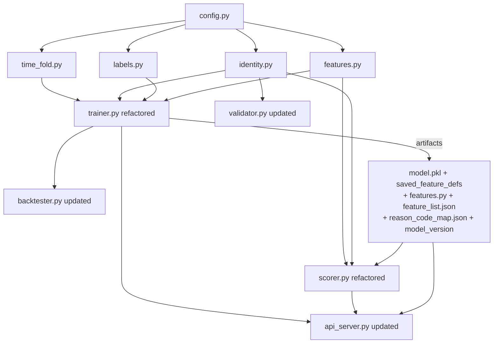

# Patron Walkaway Phase 1 — Implementation Plan

## Current State Summary

Existing files in `trainer/`:

- `config.py` (51 lines) — minimal constants, needs many additions
- `trainer.py` (663 lines) — monolithic: loads data, engineers features (for-loop `loss_streak`, inline rolling), trains single LightGBM model
- `scorer.py` (724 lines) — inline feature computation, no Featuretools, uses `player_id` only
- `backtester.py` (138 lines) — imports `build_labels_and_features` directly from `trainer.py`
- `validator.py` (751 lines) — uses `player_id`, 45-min horizon already present
- `api_server.py` (289 lines) — serves frontend UI + data API; no `/score`, `/health`, `/model_info`

**None of the 4 new modules exist** (`identity.py`, `labels.py`, `features.py`, `time_fold.py`).

## New Packages Required

Before implementation, these must be installed:

```
pip install featuretools optuna shap
```

## Module Dependency Graph




## Artifact Structure (output of trainer.py)

```
trainer/models/
├── rated_model.pkl
├── nonrated_model.pkl
├── saved_feature_defs/          ← featuretools save_features output
├── feature_list.json            ← final screened feature names
├── reason_code_map.json         ← feature → reason_code mapping
└── model_version                ← e.g. "20260228-153000-abc1234"
```

---

## Step-by-Step Implementation

### Step 0 — `trainer/config.py` (update, ~90 lines total)

Add to existing file:

```python
# Business parameters
WALKAWAY_GAP_MIN = 30
ALERT_HORIZON_MIN = 15
LABEL_LOOKAHEAD_MIN = 45  # = X + Y
BET_AVAIL_DELAY_MIN = 1
SESSION_AVAIL_DELAY_MIN = 7   # SSOT §4.2; use 15 for more conservative
RUN_BREAK_MIN = WALKAWAY_GAP_MIN

# Threshold search (DEC-009, DEC-010: F1 maximize, no precision/alert-volume constraint)
OPTUNA_N_TRIALS = 300
# Deprecated / rollback only: G1_PRECISION_MIN, G1_ALERT_VOLUME_MIN_PER_HOUR, G1_FBETA

# Track B constants
TABLE_HC_WINDOW_MIN = 30
PLACEHOLDER_PLAYER_ID = -1
LOSS_STREAK_PUSH_RESETS = False
HIST_AVG_BET_CAP = 500_000

# SQL helpers
CASINO_PLAYER_ID_CLEAN_SQL = (
    "CASE WHEN lower(trim(casino_player_id)) IN ('', 'null') "
    "THEN NULL ELSE trim(casino_player_id) END"
)
```

### Step 1 — DQ guardrails (embedded in each module's SQL)

Not a separate file; the DQ rules are applied wherever data is fetched:

- `t_bet`: `FINAL`, `payout_complete_dtm IS NOT NULL`, `player_id != -1`
- `t_session`: NO `FINAL`, FND-01 ROW_NUMBER CTE, `is_manual=0`, `is_deleted=0 AND is_canceled=0`, `COALESCE(turnover,0)>0 OR COALESCE(num_games_with_wager,0)>0`

### Step 2 — `trainer/identity.py` (new, ~200 lines)

Key interface:

```python
def build_canonical_mapping(client, cutoff_dtm: datetime) -> pd.DataFrame:
    """Returns DataFrame with columns [player_id, canonical_id].
    Uses FND-01 CTE dedup, FND-12 fake account exclusion, D2 M:N resolution."""

def resolve_canonical_id(player_id, session_id, mapping_df, session_lookup) -> str:
    """Three-step D2 resolution for online scoring. Returns canonical_id string."""
```

SQL patterns: both queries use `WITH deduped AS (ROW_NUMBER OVER PARTITION BY session_id ...)`. FND-12 fake-account exclusion must also be applied when building `player_profile_daily` (DEC-011).

### Step 3 — `trainer/labels.py` (new, ~150 lines)

Key interface:

```python
def compute_labels(
    bets_df: pd.DataFrame,          # must be sorted by (canonical_id, payout_complete_dtm, bet_id)
    window_end: datetime,           # core window end
    extended_end: datetime,         # C1 extended end (window_end + LABEL_LOOKAHEAD_MIN or 1 day)
) -> pd.DataFrame:
    """Returns bets_df with added columns: label (0/1), censored (bool).
    gap_start logic: b_{i+1} - b_i >= WALKAWAY_GAP_MIN.
    H1: next_bet missing → censored if coverage insufficient."""
```

### Step 4 — `trainer/features.py` (new, ~350 lines)

**Track A — EntitySet and player_profile_daily (SSOT §8.2, DEC-011)**  
- Rated: `t_bet` → `t_session` (many-to-one by `session_id`). **player_profile_daily** is not added as an EntitySet relationship; use **PIT/as-of join**: for each bet, join the latest `player_profile_daily` row with `snapshot_dtm <= bet_time` by `canonical_id`, then attach profile columns to the bet. Full spec: `doc/player_profile_daily_spec.md`.  
- Non-rated: EntitySet contains only `t_bet`.

Key interfaces:

```python
# Track A
def build_entity_set(bets_df, sessions_df, cutoff_times) -> ft.EntitySet:
    """Builds Featuretools EntitySet: t_bet → t_session (no player entity; profile via as-of join)."""

def run_dfs_exploration(es, cutoff_df, max_depth=2) -> Tuple[pd.DataFrame, list]:
    """Phase 1: DFS on sampled data, returns feature_matrix + feature_defs."""

def save_feature_defs(feature_defs, path: Path): ...
def load_feature_defs(path: Path): ...
def compute_feature_matrix(es, saved_feature_defs, cutoff_df) -> pd.DataFrame:
    """Phase 2: Apply saved defs to full data."""

# Track B Phase 1 (vectorized, shared by trainer AND scorer). table_hc deferred to Phase 2.
def compute_loss_streak(bets_df: pd.DataFrame, cutoff_time: datetime = None) -> pd.Series:
    """Vectorized: status='LOSE'→+1, 'WIN'→reset, 'PUSH'→conditional on LOSS_STREAK_PUSH_RESETS."""

def compute_run_boundary(bets_df: pd.DataFrame) -> pd.DataFrame:
    """Vectorized: RUN_BREAK_MIN gap → new run. Returns run_id, minutes_since_run_start."""

# compute_table_hc: Phase 2 only (not in Phase 1 feature_list.json)

# Feature screening
def screen_features(feature_matrix, labels, feature_names) -> list:
    """Two-stage: (1) mutual info + VIF, (2) optional LightGBM importance on train only."""
```

### Step 5 — `trainer/time_fold.py` (new, ~120 lines) + `trainer/trainer.py` (refactor, ~500 lines)

**time_fold.py** provides:

```python
def get_monthly_chunks(start: datetime, end: datetime) -> list[dict]:
    """Returns list of {window_start, window_end, extended_end} dicts.
    Semantics: core=[window_start, window_end), extended=[window_end, extended_end).
    extended_end = window_end + max(LABEL_LOOKAHEAD_MIN, 1 day)."""

def get_train_valid_test_split(chunks: list, train_frac=0.7, valid_frac=0.15) -> dict:
    """Returns {train_chunks, valid_chunks, test_chunks} by time order."""
```

**trainer.py** refactored flow:

1. Call `time_fold.get_monthly_chunks()` for all boundaries
2. For each chunk: fetch `t_bet` + `t_session` with DQ guardrails, build labels (C1), build features (Phase 1 DFS on sampled, Phase 2 full), write parquet
   - Training/dev may optionally read the **already-exported full tables** from local Parquet (e.g. `.data/` folder, via Pandas or DuckDB) instead of querying ClickHouse to speed up iteration. This is an I/O swap only: apply the same DQ filters/dedup rules and enforce the same available-time/cutoff semantics. Production scoring/validation still uses ClickHouse as the source of truth.
3. After all chunks: load parquets, split train/valid/test
4. **Run-level sample weight**: Compute `sample_weight = 1 / N_run` per observation (training set only), where `N_run` = number of bets in the same run (same `canonical_id`, same run from `compute_run_boundary`). This corrects length bias so each run contributes more equally; use with `class_weight='balanced'`.
5. Optuna hyperparameter search on valid set
6. Train Rated + Non-rated LightGBM models with `class_weight='balanced'` + `sample_weight`
7. Save atomic artifact bundle

### Step 6 — `trainer/backtester.py` (update, ~250 lines)

Remove dependency on `trainer.build_labels_and_features`. Import from `labels.py` and `features.py` directly.

Add:

- **Optuna TPE 2D threshold search** (`rated_threshold`, `nonrated_threshold`): **F1 maximize** (DEC-009, DEC-010); no G1 precision/alert-volume constraint.
- **Bet-level (Micro) metrics** only for Phase 1: `compute_micro_metrics(df, threshold)` (Precision, Recall, PR-AUC, F-beta, alerts/hour). Macro-by-run deferred (DEC-012).
- **Per-run at-most-1-TP dedup** for evaluation only (offline metric; does not imply online alert throttling).

### Step 7 — `trainer/scorer.py` (refactor, ~600 lines)

Key changes from existing:

- Remove inline feature computation; replace with:
  - Track A: `featuretools.calculate_feature_matrix(saved_feature_defs, entityset)` with current poll time as cutoff; rated path uses player_profile_daily via PIT/as-of join (see Step 4).
  - Track B Phase 1: `from features import compute_loss_streak, compute_run_boundary` (no `compute_table_hc` in Phase 1).
- `t_session` queries: NO FINAL, FND-01 CTE dedup, `session_avail_dtm <= now - SESSION_AVAIL_DELAY_MIN`
- D2 three-step identity resolution via `identity.resolve_canonical_id()`
- H3 model routing: `is_rated_obs = (resolved_card_id IS NOT NULL)`, no `is_known_player`
- Reason code output: SHAP top-k → `reason_code_map.json` lookup, output every poll without filtering
- Output includes: `reason_codes`, `score`, `margin`, `model_version`, `scored_at`

Existing SQLite `alerts` table schema needs `reason_codes`, `model_version`, `scored_at`, `margin`, `canonical_id`, `is_rated_obs` columns added.

### Step 8 — `trainer/validator.py` (update, ~800 lines)

Changes to existing:

- Replace `player_id` grouping key with `canonical_id` (load from identity mapping cache)
- `LABEL_LOOKAHEAD_MIN = 45` from config (already effectively 45 in existing code)
- Run/gaming_day dedup: use `gaming_day` column (and run boundaries when needed; already in t_bet/t_session)
- Write back `canonical_id` and `model_version` to validation_results table

### Step 9 — `trainer/api_server.py` (update, ~350 lines)

Keep all existing routes intact (frontend serving + data API). Add:

```python
@app.route("/score", methods=["POST"])
def score():
    """Stateless scoring endpoint. Loads current model bundle on first request (cached).
    Input: JSON list of bet-level feature dicts (max 10,000).
    Output: JSON list of {score, alert, reason_codes, model_version}.
    422 if schema mismatch."""

@app.route("/health", methods=["GET"])
def health():
    """Returns {"status": "ok", "model_version": current_version}."""

@app.route("/model_info", methods=["GET"])
def model_info():
    """Returns {"model_type", "model_version", "features": [...], "training_metrics": {...}}
    Reads dynamically from feature_list.json and model_version file."""
```

Schema validation: check that all columns in `feature_list.json` are present in request; return 422 if not.

### Step 10 — `tests/` directory (new)

Structure:

```
tests/
├── test_config.py          ← validates all required constants exist
├── test_labels.py          ← label sanity, H1 censoring, no leakage from extended zone
├── test_features.py        ← Track B vectorized correctness, cutoff enforcement, parity
├── test_identity.py        ← D2 M:N resolution, FND-12 exclusion, cutoff_dtm leakage
├── test_trainer.py         ← run-level sample_weight correctness, artifact bundle completeness
├── test_backtester.py      ← Bet-level metrics, per-run TP dedup evaluation
├── test_scorer.py          ← model routing (H3), reason code output completeness
└── test_dq_guardrails.py   ← schema compliance (no is_manual on t_bet, no FINAL on t_session)
```

Uses `pytest` with small synthetic DataFrames — no ClickHouse connection required.

---

## Implementation Order

1. `config.py` (prerequisite for everything)
2. `time_fold.py` (prerequisite for trainer)
3. `identity.py` (prerequisite for trainer + scorer)
4. `labels.py` (prerequisite for trainer)
5. `features.py` (prerequisite for trainer + scorer)
6. `trainer.py` (refactor, depends on 1-5)
7. `backtester.py` (depends on features.py + labels.py)
8. `scorer.py` (depends on features.py + identity.py + model artifacts)
9. `validator.py` (depends on identity.py)
10. `api_server.py` (depends on model artifacts structure)
11. `tests/` (validates all of the above)

## Key Risks / Notes

- **featuretools + optuna must be installed** before running the refactored trainer
- The **existing `walkaway_model.pkl`** format (single model, `{"model", "features", "threshold"}`) is incompatible with the new dual-model format; the scorer will need the new artifacts before it can score
- The `backtester.py` currently imports `build_labels_and_features` directly from `trainer.py` — this import is removed in the refactored version
- `api_server.py`'s existing data-serving routes (`/get_alerts`, `/get_validation`, `/get_floor_status`) are left completely intact; only new model-API routes are added

