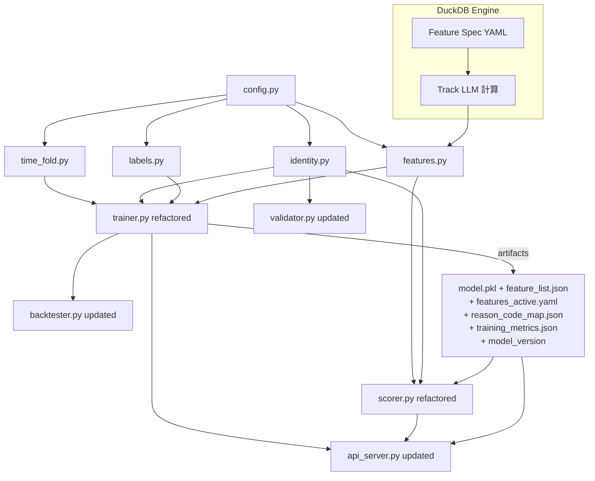

# Patron Walkaway Phase 1 — 實作計畫（SSOT v10 對齊）

> **本計畫對齊 `ssot/patron_walkaway_phase_1.plan.md`（v10）與 `ssot/trainer_plan_ssot.md`。**
>
> v10 核心變更：
> - **單一 Rated 模型**：不為無卡客建模或推論；Non-rated 觀測僅記錄 volume。
> - **三軌特徵工程**（DEC-022/023/024）：Track Profile（`player_profile_daily`）、Track LLM（DuckDB + Feature Spec YAML）、Track Human（向量化手寫狀態機）。
> - **閾值策略**（DEC-009/010）：**F1 最大化**，無 precision/alert volume 門檻約束。
> - **Track Human Phase 1**：`loss_streak`、`run_boundary` 啟用；`table_hc` 延至 Phase 2。
> - **DuckDB 為核心計算引擎**（DEC-023）：取代 Featuretools DFS，用於 Track LLM；並作為 `player_profile` **local Parquet ETL** 的目標加速引擎。**ClickHouse path 先維持現狀**（SQL → Python/pandas → 聚合）。
> - **Feature Spec YAML**（DEC-024）：集中管理三軌候選特徵定義。
> - **DEC-021**：無卡客 volume logging 規格。

---

## 架構決策摘要（SSOT 固定）

- 身份歸戶：**D2**（Canonical ID；`casino_player_id` 優先）
- 右截尾：**C1**（Extended pull；至少 X+Y，建議 1 天）
- Session 特徵策略：**S1**（保守；Phase 1 不啟用 `table_hc`）
- 上線閾值策略：**F1 最大化**（DEC-009/010）；不設 precision/alert volume 下限約束
- 模型：Phase 1 = **LightGBM 單一模型（Rated only）**
- 評估口徑：**Bet-level**（SSOT §10；Run-level 延後見 DEC-012）
- 術語：**Run**（bet-derived 連續下注段；gap ≥ RUN_BREAK_MIN 切分；DEC-013）
- 特徵計算引擎：**DuckDB**（DEC-023；Track LLM 核心，且規劃用於 `player_profile` 的 local Parquet ETL；ClickHouse ETL path 暫不改）

---

## 接下來要做的事（Current focus）

Phase 1 主體（Step 0～Step 10、DuckDB 動態天花板、特徵整合 YAML SSOT、Post-Load Normalizer、Feature Screening LGBM 預設）均已完成。可選／後續：

| 優先 | 項目 | 狀態 | 規格位置 |
|------|------|------|----------|
| 1 | **Post-Load Normalizer** | completed | 下方「Post-Load Normalizer」一節 |
| 2 | **Feature Screening：LightGBM 預設** | completed | 下方「Feature Screening：LightGBM 取代 MI」一節 |
| 3 | **Step 7 Out-of-Core 排序 + OOM Failsafe** | completed（含 Layer 2 failsafe） | 下方「Step 7 Out-of-Core 排序 + OOM Failsafe 計畫」一節 |
| 4 | **方案 B：LightGBM 從檔案訓練** | completed（Round 198 狀態更新；R199 審查邊界條件已於 Round 201 修正：valid 缺欄不 KeyError、export common_cols 空時拋 ValueError；Config、Step 8、CSV 匯出、從檔案訓練、Booster 包裝、R191/193/197 已完成；手動 pipeline 比對可選） | 下方「方案 B：LightGBM 從檔案訓練」一節 |
| 5 | **方案 B+：LibSVM + 完整 OOM 避免** | 階段 1–6 已完成（階段 6 第 3 步 Test 從檔案 predict 已於 Round 220 實作） | 下方「方案 B+：LibSVM 匯出與完整 OOM 避免計畫」一節 |
| 6 | **Train–Serve Parity：Scorer / Backtester 與 trainer 對齊** | 完成（Round 221：Scorer + Backtester 打分前準備；Round 222：Backtester player_profile PIT join、Track LLM 在完整 bets 上計算後 merge 再 label） | 下方「Train–Serve Parity：Scorer / Backtester 與 trainer.py 對齊規格」一節；R221 審查風險已轉為 tests（test_review_risks_round221_train_serve_parity.py） |
| 7 | **Backtester 評估輸出格式對齊 trainer** | completed | 下方「Backtester 評估輸出格式對齊 trainer」一節；步驟 1–4、6 已完成（Round 225/226），步驟 3 於 Round 226 實作（section flat、無 micro 巢狀）。 |
| 8 | **Backtester precision-at-recall 指標** | completed | 下方「Backtester precision-at-recall 指標」一節；Round 229/230/231 實作與 Review 修復。 |
| 9 | **api_server 對齊 model_api_protocol** | in progress | 下方「api_server 對齊 model_api_protocol 實作計畫」一節；步驟 1–5 已完成（Round 232/234/235/237/238），僅步驟 6（可選 doc）未做。 |
| 10 | **Canonical mapping 全歷史 + DuckDB + 寫出/載入 + 強制重建** | pending | 下方「Canonical mapping 全歷史 + DuckDB 降 RAM + 寫出/載入與生產增量更新」一節；含 `--rebuild-canonical-mapping`（trainer + scorer）。 |

**Plan 狀態摘要（Round 240）**：上表 1～8 項為 **completed**，第 9 項為 **in progress**（步驟 1–5 完成，僅步驟 6 可選未做），第 10 項為 **pending**。tests / typecheck / lint 全過（見 STATUS.md Round 240）。

**建議實作順序**：Post-Load Normalizer 與 Feature Screening 預設已完成；Step 7 改用 DuckDB 做 out-of-core 排序並加入 OOM 時自動降 NEG_SAMPLE_FRAC 重跑之 failsafe，可依需要排入。Backtester 輸出格式對齊（項目 7）可獨立排入。

**可選／後續**（非阻斷）：(1) OOM 預檢查（Step 6 以 Chunk 1 實測大小決定 NEG_SAMPLE_FRAC）已於 Round 210/211/212 實作並通過 Review 修復；規格見「OOM 預檢查：Step 5 後以 Chunk 1 實測大小決定 NEG_SAMPLE_FRAC」一節。(2) Round 222 Review 建議之 production 補強（Track LLM 失敗 warning、canonical_ids=[]、use_local_parquet 參數、candidates 型別防呆）可依優先度排入。

---

## SSOT 章節對應與相關文件

| SSOT 章節 | 對應 Phase 1 步驟 | 備註 |
|-----------|------------------|------|
| §2 名詞定義 | Step 0 | WALKAWAY_GAP_MIN, ALERT_HORIZON_MIN, Run 定義 |
| §4 資料來源與即時可用性 | Step 0, Step 5, Step 7 | BET_AVAIL_DELAY_MIN, SESSION_AVAIL_DELAY_MIN, time_fold |
| §4.3 Player-level table | Step 4 Track Profile | 完整規格見 `doc/player_profile_daily_spec.md` |
| §5 關鍵資料品質護欄 | Step 1, Step 2 | FND-01～FND-14, F3, FND-04 不要過濾 status |
| §6 玩家身份歸戶 D2 | Step 2 identity.py | FND-12 建置時套用；FND-12 亦用於 player_profile_daily |
| §7 標籤設計 | Step 3 labels.py | C1 延伸拉取，G3 穩定排序 |
| §8.2 特徵工程（三軌） | Step 4 features.py | Track Profile / Track LLM / Track Human |
| §8.3 Session 特徵 S1 | Step 4, Step 7 | 進行中 session 不可見；table_hc Phase 1 不啟用 |
| §9 建模方法 | Step 5, Step 6 | 單一模型、Optuna、PR-AUC 超參、F1 閾值 |
| §9.4 Model API Contract | Step 9 | 完整合約見 `doc/model_api_protocol.md` |
| §10 評估與閾值 | Step 6 | Bet-level；F1 最大化；DEC-009/010 |
| §12 Remediation / Reason codes | Step 7, Step 10 | TRN-* 對應；reason codes 見 §12.1 |

**相關文件**：`doc/FINDINGS.md`（FND-*）、`doc/player_profile_daily_spec.md`（player-level 欄位規格）、`doc/model_api_protocol.md`（API 合約）、`.cursor/plans/DECISION_LOG.md`（DEC-*）、`schema/GDP_GMWDS_Raw_Schema_Dictionary.md`（欄位字典）

---

## 主要異動檔案

```
trainer/
├── config.py        ← 更新：新增 TABLE_HC_WINDOW_MIN / PLACEHOLDER_PLAYER_ID
│                              / LOSS_STREAK_PUSH_RESETS / HIST_AVG_BET_CAP
│                              / OPTUNA_N_TRIALS / UNRATED_VOLUME_LOG
├── schema_io.py     ← 新建：Post-Load Normalizer（與來源無關的 schema/dtype 正規化）
│                              normalize_bets_sessions()；categorical 常數；原則見下方「Post-Load Normalizer」
├── time_fold.py     ← 新建：集中式時間窗口定義器（SSOT §4.3）
├── identity.py      ← 新建：D2 歸戶（FND-12 正確聚合 + player_id != -1）
├── labels.py        ← 新建：C1 防洩漏標籤
├── features.py      ← 新建：三軌特徵工程（Track Profile / Track LLM / Track Human）
│                              Track LLM：DuckDB + Feature Spec YAML
│                              Track Human Phase 1：loss_streak / run_boundary
│                              table_hc 延至 Phase 2
├── trainer.py       ← 重構：整合三軌，DuckDB 特徵計算 + Feature Screening
│                              僅訓練 Rated 模型；load 後呼叫 normalize_bets_sessions；apply_dq 排除 categorical
├── scorer.py        ← 重構：內嵌 DuckDB 計算 Track LLM + 匯入 features.py
│                              D2 四步身份判定，無卡客僅 volume log；fetch 後呼叫 normalize_bets_sessions
├── backtester.py    ← 更新：單一閾值搜尋（Optuna TPE），無 G1 約束；僅 rated 觀測；load 後呼叫 normalize_bets_sessions
├── validator.py     ← 更新：canonical_id + 45min horizon
├── etl_player_profile.py  ← 更新：取得 sessions_raw 後呼叫 normalize_bets_sessions（與 trainer/scorer 共用型別契約）
└── api_server.py    ← 更新：Model API Contract（單一模型）

trainer/feature_spec/
└── features_candidates.template.yaml  ← Feature Spec YAML 候選特徵定義（DEC-024）

tests/
├── test_config.py
├── test_labels.py
├── test_features.py
├── test_identity.py
├── test_trainer.py
├── test_backtester.py
├── test_scorer.py
└── test_dq_guardrails.py
```

---

## Module 依賴圖



---

## Artifact 結構（output of trainer.py）

```
trainer/models/
├── model.pkl                   ← 單一 Rated LightGBM 模型
├── feature_list.json           ← 最終篩選後的特徵名稱清單（三軌合併）
├── features_active.yaml        ← 篩選後的 active Feature Spec（含 track/type 等 metadata）
├── reason_code_map.json        ← feature → reason_code 映射
├── training_metrics.json       ← validation + test set metrics；feature importance 排名
└── model_version               ← e.g. "20260228-153000-abc1234"
```

`training_metrics.json` 必須包含：
1. Validation-set 指標（用於 Optuna 超參調優）與 test-set 指標（held-out 最終報告）
2. 模型使用的特徵清單，按 importance 排名（記錄使用的 importance method，如 `"gain"` / `"shap"`）
3. Feature Spec YAML hash（追蹤此模型使用哪一版特徵定義）

---

## Phase 1 實作步驟

### Step 0 — 集中常數定義（`trainer/config.py`）

**目標**：全系統唯一事實來源。

**業務參數**

- `WALKAWAY_GAP_MIN = 30`（X）
- `ALERT_HORIZON_MIN = 15`（Y）
- `LABEL_LOOKAHEAD_MIN = 45`（= X + Y）

**資料可用性延遲**

- `BET_AVAIL_DELAY_MIN = 1`（`t_bet`；SSOT §4.2）
- `SESSION_AVAIL_DELAY_MIN = 7`（`t_session`；SSOT §2.1/§4.2；若需更保守可設為 15）

**Run 邊界**

- `RUN_BREAK_MIN = WALKAWAY_GAP_MIN`（= 30 分鐘）

**Gaming Day（v4：G4 修正）**

- 主流程以資料表 `gaming_day` 欄位為準。
- `GAMING_DAY_START_HOUR = 6` 僅保留為備援參數。

**閾值搜尋（DEC-009/010/021：F1 最大化，單一閾值，無 G1 約束）**

- `OPTUNA_N_TRIALS = 300`（Optuna TPE 搜尋次數；1D 空間通常足以收斂）
- 廢棄：`G1_PRECISION_MIN`、`G1_ALERT_VOLUME_MIN_PER_HOUR`、`G1_FBETA`（見 DEC-009/010 回退說明）

**新增常數**

- `TABLE_HC_WINDOW_MIN = 30`（D1：S1 `table_hc` 回溯窗口分鐘數）
- `PLACEHOLDER_PLAYER_ID = -1`（E4/F1：無效佔位符）
- `LOSS_STREAK_PUSH_RESETS = False`（F4：PUSH 是否重置連敗計數）
- `HIST_AVG_BET_CAP = 500_000`（F2：`hist_avg_bet` winsorization 上限）
- `UNRATED_VOLUME_LOG = True`（DEC-021：是否記錄無卡客 volume 統計）

**SQL fragment 常數**

```python
CASINO_PLAYER_ID_CLEAN_SQL = (
    "CASE WHEN lower(trim(casino_player_id)) IN ('', 'null') "
    "THEN NULL ELSE trim(casino_player_id) END"
)
```

---

### Step 1 — 資料品質護欄（嵌入各模組 SQL）

**目標**：修正所有 P0 DQ 問題（對齊 SSOT §5）。非獨立檔案，DQ 規則嵌入各模組。

**必須實作的過濾模式**

- **G1（高）**：`t_session` **禁用 `FINAL`**。ReplacingMergeTree 無 version 欄位，FINAL 會非決定性丟列。必須依賴 FND-01 SQL window 去重。
- **E5**：`t_bet` 可使用 `FINAL`；`t_session` 一律不用。
- **FND-01（TRN-01）**：`t_session` 去重：`ROW_NUMBER() OVER (PARTITION BY session_id ORDER BY lud_dtm DESC NULLS LAST, __etl_insert_Dtm DESC) = 1`
- **FND-02（TRN-02 — E1 修正）**：`is_manual = 0` **僅適用 `t_session`**。`t_bet` 無此欄位。
- **E3**：`t_bet` 查詢基礎 WHERE 必須包含 `payout_complete_dtm IS NOT NULL`。
- **E4/F1**：`player_id = -1` 或 NULL 視為無效。
  - **G2**：若 `player_id` 無效但 `session_id` 有效，先 join `t_session`（FND-01 去重後）回補：`effective_player_id = COALESCE(t_bet.player_id, t_session.player_id)`。最終只保留有效的 `effective_player_id`。
- **F3**：`t_session` 查詢加入 `is_deleted = 0 AND is_canceled = 0`。
- **FND-03**：`casino_player_id` 清洗使用 `CASINO_PLAYER_ID_CLEAN_SQL`。
- **FND-04（E7 修正）**：**不要**過濾 `status = 'SUCCESS'`。保留 `COALESCE(turnover, 0) > 0 OR COALESCE(num_games_with_wager, 0) > 0` 的 Session。
- **FND-06/FND-08**：移除 `bet_reconciled_at`、`bonus`、`tip_amount`、`increment_wager`、`payout_value`。
- **FND-09**：禁用 `is_known_player`；改為 `casino_player_id IS NOT NULL`。
- **FND-13**：禁止使用 `__etl_insert_Dtm`、`__ts_ms` 做時間排序。

---

### Step 2 — 身份歸戶模組（`trainer/identity.py`，D2）

**目標**：建立 `player_id → canonical_id` 映射。

**Key Interface**

```python
def build_canonical_mapping(client, cutoff_dtm: datetime) -> pd.DataFrame:
    """Returns DataFrame with columns [player_id, canonical_id].
    Uses FND-01 CTE dedup, FND-12 fake account exclusion, D2 M:N resolution.
    cutoff_dtm prevents mapping leakage (B1)."""

def resolve_canonical_id(player_id, session_id, mapping_df, session_lookup) -> Optional[str]:
    """D2 identity resolution for online scoring.
    Returns canonical_id string. Step 3 fallback: if not in mapping (unrated),
    returns str(player_id) so downstream can identify the observation; only
    returns None when player_id is None or PLACEHOLDER_PLAYER_ID (no usable identity).
    Rated vs unrated is determined by canonical_id in mapping (casino_player_id), not by this return."""
```

**Mapping 建置查詢**（G1：不用 FINAL；I2：先 FND-01 CTE 去重）

```sql
WITH deduped AS (
  SELECT *,
    ROW_NUMBER() OVER (
      PARTITION BY session_id
      ORDER BY lud_dtm DESC NULLS LAST, __etl_insert_Dtm DESC
    ) AS rn
  FROM t_session
)
SELECT player_id, casino_player_id
FROM deduped
WHERE rn = 1
  AND is_manual = 0
  AND is_deleted = 0 AND is_canceled = 0
  AND player_id IS NOT NULL AND player_id != {PLACEHOLDER_PLAYER_ID}
  AND COALESCE(session_end_dtm, lud_dtm) <= :cutoff_dtm
  AND {CASINO_PLAYER_ID_CLEAN_SQL} IS NOT NULL
```

**FND-12 假帳號排除**（E6/I1/I2 修正；應用於 Canonical mapping 與 player_profile_daily）

```sql
WITH deduped AS (
  SELECT *,
    ROW_NUMBER() OVER (
      PARTITION BY session_id
      ORDER BY lud_dtm DESC NULLS LAST, __etl_insert_Dtm DESC
    ) AS rn
  FROM t_session
)
SELECT player_id
FROM deduped
WHERE rn = 1 AND is_manual = 0
  AND is_deleted = 0 AND is_canceled = 0
  AND player_id IS NOT NULL AND player_id != {PLACEHOLDER_PLAYER_ID}
GROUP BY player_id
HAVING COUNT(session_id) = 1 AND SUM(COALESCE(num_games_with_wager, 0)) <= 1
```

**M:N 衝突規則**

- 情境 1（斷鏈重發）：同一 `casino_player_id` ↔ 多個 `player_id` → 全部映射至同一 `canonical_id = casino_player_id`
- 情境 2（換卡）：同一 `player_id` ↔ 多個 `casino_player_id` → 取最新（最大 `lud_dtm`）的 `casino_player_id`

**語義**

- 訓練期：`cutoff_dtm = training_window_end`，防止 mapping leakage（B1）
- 推論期：定期增量更新快取（每小時），`built_at` + `model_version` 記錄
- **訓練與推論僅保留 `canonical_id` 來自 `casino_player_id`（IS NOT NULL）的條目**。兜底到 player_id 的映射保留作身份辨識參考，但不用於特徵計算或模型推論。

---

### Step 3 — 標籤建構模組（`trainer/labels.py`，C1）

**目標**：防洩漏 walkaway label，處理右截尾（TRN-06）。

**Key Interface**

```python
def compute_labels(
    bets_df: pd.DataFrame,          # sorted by (canonical_id, payout_complete_dtm, bet_id)
    window_end: datetime,
    extended_end: datetime,         # C1 extended end (window_end + LABEL_LOOKAHEAD_MIN or 1 day)
) -> pd.DataFrame:
    """Returns bets_df with added columns: label (0/1), censored (bool).
    Only processes rated bets (canonical_id in Canonical ID whitelist)."""
```

**規則**

- **僅處理 rated 觀測**：標籤建構前，先過濾只保留 `canonical_id IN Canonical ID 名單（= casino_player_id 集合）` 的 bet 序列
- **G3 穩定排序**：`ORDER BY payout_complete_dtm ASC, bet_id ASC`
- Gap start：`b_{i+1} - b_i ≥ WALKAWAY_GAP_MIN`
- Label：觀測點 `t = b_j`，若 `[t, t + ALERT_HORIZON_MIN]` 內存在 gap start → `label = 1`
- **C1 延伸拉取**：`window_end` 往後至少 `LABEL_LOOKAHEAD_MIN`，實務建議 1 天；延伸區間僅用於標籤計算，不納入訓練集
- **H1 終端下注**：next_bet 缺失時：
  - 可判定：`b_i + WALKAWAY_GAP_MIN <= extended_end` → 視為 gap start
  - 不可判定：覆蓋不足 → `censored = True`，排除訓練/評估
- 嚴禁進入特徵：`minutes_to_next_bet`、`next_bet_dtm` 等

---

### Step 4 — 共用特徵模組（`trainer/features.py`，Train-Serve Parity 核心）

**目標**：導入三軌特徵工程，取代舊有靜態特徵清單與 Featuretools DFS；確保 Trainer 與 Scorer 間的絕對 parity。

#### A. Track Profile：玩家輪廓特徵（`player_profile_daily`）

- `player_profile_daily`（DEC-011）為 **rated-only** 快取衍生表，提供長期歷史輪廓（patron profile）
- PIT/as-of join：對每筆 bet，以 `canonical_id` 為 key，選取 `snapshot_dtm <= bet_time` 的最新快照，將 profile 欄位貼到該筆 bet 作為特徵
- 建置前必須套用 §5 DQ（FND-01/02/03/04/09/12）
- Non-rated 不計算 Track Profile
- 完整欄位清單見 `doc/player_profile_daily_spec.md`
- **實作策略（OPT-002）**：
  - **Local Parquet path**：改為 DuckDB 直接掃描 `t_session` Parquet、套用 DQ / D2 / FND-12，並在 DuckDB 內完成 profile 聚合後才將結果拉回 Python。
  - **ClickHouse path**：**維持現狀**，仍由 ClickHouse SQL 抽取 session 結果到 Python/pandas，再沿用既有聚合邏輯；本次不做 DuckDB 化。

```python
def join_player_profile_daily(
    bets_df: pd.DataFrame,
    profile_df: pd.DataFrame,
    time_col: str = "payout_complete_dtm",
) -> pd.DataFrame:
    """PIT/as-of join: for each bet, attach the latest profile snapshot
    where snapshot_dtm <= bet_time."""
```

#### B. Track LLM：DuckDB + Feature Spec YAML 的 Bet-level 特徵

以 DuckDB 為引擎，對 `t_bet` 進行 partition-by `canonical_id`、order-by `payout_complete_dtm, bet_id` 的時間窗口與 lag/transform/derived 計算。

**Feature Spec YAML 定義（DEC-024）**：

- `type`：`window` / `lag` / `transform` / `derived`
- `expression`：不含 `SELECT`/`FROM`/`JOIN` 的純運算片段
- `window_frame`：僅允許過去 + 當前 row（禁止 `FOLLOWING`）；Parser 靜態檢查
- `max_window_minutes` 控制視窗長度上限，驅動 scorer 的 `HISTORY_WINDOW_MIN`

**執行方式**：

- 訓練端：DuckDB 掃描 Parquet，按月度 chunk + C1 延伸區間計算全量 Track LLM 候選特徵
- 推論端：`scorer.py` 內嵌 DuckDB，對最近 `HISTORY_WINDOW_MIN` 的 bets 執行相同 SQL

```python
def compute_track_llm_features(
    bets_df: pd.DataFrame,
    feature_spec: dict,
    cutoff_time: datetime = None,
) -> pd.DataFrame:
    """Compute Track LLM features via DuckDB using Feature Spec YAML definitions.
    All window frames are strictly backward-looking (no FOLLOWING)."""

def load_feature_spec(yaml_path: Path) -> dict:
    """Load and validate Feature Spec YAML. Static check: no FOLLOWING,
    no SELECT/FROM/JOIN in expressions, no circular depends_on."""
```

#### C. Track Human：手工向量化特徵（狀態機與 Run-level）

以下特徵涉及條件重置狀態機或跨下注段聚合，無法以單一 window function 安全表達，必須以向量化程式碼手寫實作：

| 特徵 | 為何不適合 Track LLM | 實作方式 |
|------|---------------------|----------|
| `loss_streak` | 需「遇 WIN 重置、遇 PUSH 條件可選擇不重置」的序列狀態機 | 向量化 Pandas/Polars；`status='LOSE'`→+1，`WIN`→重置，`PUSH` 依 `LOSS_STREAK_PUSH_RESETS`（F4） |
| `run_boundary` / `minutes_since_run_start` | 需「相鄰 bet 間距 ≥ `RUN_BREAK_MIN` → 新 run」的序列切割 | 同上（B2 修正） |
| `table_hc`（S1） | 需跨玩家、以 `table_id` 為軸心的滾動聚合 | **Phase 1 不啟用**，延至 Phase 2 |

```python
def compute_loss_streak(bets_df: pd.DataFrame, cutoff_time: datetime = None) -> pd.Series:
    """Vectorized: status='LOSE'→+1, 'WIN'→reset, 'PUSH'→conditional."""

def compute_run_boundary(bets_df: pd.DataFrame) -> pd.DataFrame:
    """Vectorized: RUN_BREAK_MIN gap → new run. Returns run_id, minutes_since_run_start."""
```

#### D. 特徵篩選（Feature Screening）

Feature Spec YAML 定義三軌的**候選特徵全集**；Trainer 在訓練集上執行兩階段 Feature Screening：

1. **第一階段**：單變量與目標關聯（mutual information、變異數門檻）及冗餘剔除（高相關、VIF）
2. **第二階段（可選）**：在**訓練集**上以輕量 LightGBM 計算 feature importance 或 SHAP，取 top-K。**嚴格限制在 Train 集，不得使用 valid/test**（SSOT §8.2.C）

最終通過篩選的特徵清單 = `feature_list.json` / `features_active.yaml`，訓練與推論端僅計算此清單內特徵。

```python
def screen_features(feature_matrix, labels, feature_names,
                    top_k=None, use_lgbm=False) -> list:
    """Two-stage screening across all tracks (Profile + LLM + Human).
    top_k from config.SCREEN_FEATURES_TOP_K (int or None)."""
```

#### E. 防洩漏與 Cutoff Time

- Track LLM：window/lag/derived 僅看當前 row 及之前（禁止 `FOLLOWING`）
- Track Profile：`snapshot_dtm <= bet_time`
- Track Human：基於相同排序與 cutoff 語義
- `t_session` 使用：`session_avail_dtm <= cutoff_time`
- 進行中 Session 不可見（SSOT §8.3）
- 數值欄位（如 `wager`）做 `fillna(0)` 防呆

#### 特徵組對應

- **單一 Rated 模型**：Track Profile（player-level）+ Track LLM（bet-level 窗口/節奏）+ Track Human（Run/狀態機）。三軌混合後經 Feature Screening 產出統一特徵集合。

---

### Step 5 — 訓練器重構（`trainer/trainer.py`）+ 時間窗口定義器（`trainer/time_fold.py`）

#### time_fold.py（新建，集中式時間窗口定義器，SSOT §4.3）

```python
def get_monthly_chunks(start: datetime, end: datetime) -> list[dict]:
    """Returns list of {window_start, window_end, extended_end} dicts.
    core=[window_start, window_end), extended=[window_end, extended_end).
    extended_end = window_end + max(LABEL_LOOKAHEAD_MIN, 1 day)."""

def get_train_valid_test_split(chunks: list, train_frac=0.7, valid_frac=0.15) -> dict:
    """Returns {train_chunks, valid_chunks, test_chunks} by time order."""
```

所有 ETL、特徵計算與模型切割**必須**呼叫此模組取得時間邊界，禁止在 trainer 內部自行計算。

**邊界語義合約**：核心窗口 `[window_start, window_end)`；延伸區間 `[window_end, extended_end)` **僅供**標籤計算，其樣本**絕對不可**納入訓練集。

#### trainer.py 重構流程

1. 呼叫 `time_fold.get_monthly_chunks()` 取得所有邊界
2. 呼叫 `identity.build_canonical_mapping(cutoff_dtm=training_window_end)`
3. **僅保留 rated 觀測**：`canonical_id` 來自 `casino_player_id` 的 bet
4. 對每個 chunk：
   - 抽取 `t_bet` + `t_session`（DQ 護欄）
   - 建構標籤（C1 延伸拉取）
   - 計算三軌特徵：
     - Track Profile：PIT/as-of join `player_profile_daily`
     - Track LLM：DuckDB + Feature Spec YAML 計算 bet-level 窗口特徵
     - Track Human：向量化 `loss_streak`、`run_boundary`
   - 寫入 parquet cache
5. 合併所有 chunks，row-level time-split（Train 70% / Valid 15% / Test 15%，嚴格按 `payout_complete_dtm` 排序）
6. **Feature Screening**（在 Train 集上）：三軌候選特徵全集 → 兩階段篩選 → `feature_list.json`
7. **Run-level sample weight**：`sample_weight = 1 / N_run`，其中 `N_run` = 同一 run 內觀測點數。搭配 `class_weight='balanced'`
8. **Optuna 超參搜尋**：在 validation set 上以 PR-AUC 為目標
9. **訓練單一 LightGBM 模型**（`class_weight='balanced'` + `sample_weight`）
10. **Test set 評估**：test_prauc, test_f1, test_precision, test_recall 等
11. **Feature importance**：per-model feature ranking（gain/SHAP），記錄 importance_method
12. **輸出原子 artifact bundle**：`model.pkl` + `feature_list.json` + `features_active.yaml` + `reason_code_map.json` + `training_metrics.json` + `model_version`

**離線資料源**：允許以本機 Parquet 取代 ClickHouse，但必須套用完全相同的 DQ/去重/available_time 規則。  
**OPT-002 補充**：DuckDB 化的範圍先限定在 **local Parquet 的 `player_profile` ETL**；Production / ClickHouse path 仍以現有 SQL → Python/pandas 聚合為準，不在本輪變更。

**TRN-07 快取驗證**：快取 key = `(window_start, window_end, data_hash)`

---

### Step 6 — 閾值選擇與回測（`trainer/backtester.py`）

**F1 單一閾值搜尋**（DEC-009/010；I6 Optuna TPE）

```python
import optuna
from sklearn.metrics import f1_score
from config import OPTUNA_N_TRIALS

def objective(trial):
    t = trial.suggest_float("threshold", 0.01, 0.99)
    pred = (scores_val >= t).astype(int)
    return f1_score(y_val, pred, zero_division=0)

study = optuna.create_study(direction="maximize",
                            sampler=optuna.samplers.TPESampler(seed=42))
study.optimize(objective, n_trials=OPTUNA_N_TRIALS)
```

- `OPTUNA_N_TRIALS = 300`
- 閾值只在 validation set 選定；test set 僅用於最終報告

**回測規則**

- **僅含 rated 觀測**（canonical_id 來自 casino_player_id）；無卡客 bet 不計入任何指標
- **per-run at-most-1-TP dedup**（離線評估口徑，不意味線上只發一次 alert）
- **G4**：dedup 可依 `(canonical_id, gaming_day)` 或 `(canonical_id, run_id)`
- 嚴格時序處理，不 look-ahead

**輸出**（valid + test 各一份）

- **Micro（Bet-level）**：Precision / Recall / PR-AUC / F-beta / alerts-per-hour（P5–P95）
- **Macro-by-run**：Phase 1 不採用，延後（DEC-012）
- `threshold`、Optuna study 結果

---

### Step 7 — Scorer 更新（`trainer/scorer.py`）

**核心變更**

- **移除**所有獨立特徵計算，改為三軌：
  - **Track Profile**：PIT/as-of join `player_profile_daily` snapshot
  - **Track LLM**：`scorer.py` 內嵌 DuckDB，對最近 `HISTORY_WINDOW_MIN` 分鐘的 bets 執行 Feature Spec 定義的 SQL 計算
  - **Track Human**：匯入 `features.py` 向量化函數（`loss_streak`、`run_boundary`；`table_hc` Phase 1 不啟用）
- **G3**：穩定排序 `ORDER BY payout_complete_dtm ASC, bet_id ASC`
- `t_bet` 可使用 `FINAL`；`t_session` 禁用 `FINAL`（G1），FND-01 去重
- **G2**：`effective_player_id = COALESCE(t_bet.player_id, t_session.player_id)`

**D2 四步身份判定與推論路由**（§6.4）

1. 當前 bet 的 `session_id` → 連結到 `t_session.casino_player_id`？
2. 該 `player_id` 在先前已完成 Session 中曾關聯卡號？
3. 兜底：視為無卡客
4. **`is_rated_obs = (resolved_card_id IS NOT NULL)`**
   - `True` → 呼叫 Rated model 打分並發佈警報
   - `False` → **跳過打分**，記錄 unrated volume（DEC-021）

**H3（禁止使用 `is_known_player`）**：路由僅依 `resolved_card_id` 定義的 `is_rated_obs`。

**Volume Logging（DEC-021）**

若 `UNRATED_VOLUME_LOG=True`，每輪推論記錄：`poll_cycle_ts`、`unrated_player_count`、`unrated_bet_count`、`rated_player_count`、`rated_bet_count`。

**Reason code 輸出**（SSOT §12.1）

- SHAP top-k → 4 個固定 reason codes：`BETTING_PACE_DROPPING`、`GAP_INCREASING`、`LOSS_STREAK`、`LOW_ACTIVITY_RECENTLY`
- 版本化映射表（隨 `model_version` 管理）
- 每次推論**必須輸出** `reason_codes`、`score`、`margin`、`model_version`、`scored_at`
- 展示穩定性（如「連續兩輪一致才展示」）屬前端/產品責任，不在模型層實作

---

### Step 8 — 線上 Validator 更新（`trainer/validator.py`）

- Horizon = `LABEL_LOOKAHEAD_MIN = 45`（from config）
- 分組鍵改用 `canonical_id`（D2）
- Ground truth：`t_bet FINAL` 時間序列，警報後 45 分鐘內出現 ≥ `WALKAWAY_GAP_MIN` 間隔
- 去重：同 Step 6（gaming day 邊界）
- 回寫欄位新增 `model_version`, `canonical_id`, `threshold_used`, `margin`
- **僅驗證 rated 觀測的 ground truth；無卡客不存在警報，故不需驗證。**

---

### Step 9 — Model Service API（`trainer/api_server.py`）

- 對齊 SSOT §9.4；完整 API 合約見 `doc/model_api_protocol.md`
- `POST /score`：接收一批 rated-only 特徵列（上限 10,000）→ 3 秒內回傳；stateless & idempotent
- `GET /health`：`{"status": "ok", "model_version": str}`
- `GET /model_info`：從 `feature_list.json` 動態讀取；**單一模型**，不再列 rated/nonrated
- 缺欄位或多餘欄位一律 422，不默默補齊
- 保留所有既有 frontend serving + data API routes
- **待實作**：與 protocol 的 request/response 形狀、錯誤格式、/health、/model_info 完全對齊，見下方「api_server 對齊 model_api_protocol 實作計畫」。

---

### api_server 對齊 model_api_protocol 實作計畫

**目標**：`trainer/api_server.py` 與 `doc/model_api_protocol.md` 對齊；特徵仍由 `feature_list.json` 決定；本階段不回傳 `reason_codes`。

#### 1. Request（POST /score）

| 項目 | 規格 |
|------|------|
| Body 形狀 | 單一物件 `{"rows": [ ... ]}`。非物件或無 `rows` → **400** `{"error": "Malformed JSON or missing 'rows'"}`。 |
| rows | 必須為陣列。非陣列 → 400。`rows == []` → **400** `{"error": "empty rows"}`。 |
| 筆數上限 | `len(rows)` ≤ `_MAX_SCORE_ROWS`（如 10,000）。 |
| 必填欄位 | 每筆 row：**所有 feature_list 特徵** + **bet_id**。缺任一 → **422** `{"error": "missing features", "missing": [...], "extra": [...]}`。 |
| 型別錯誤 | 特徵值非 int/float/bool → **422** `{"error": "invalid feature types", "missing": [], "extra": ["<field>", ...]}`。 |
| 額外欄位 | **is_rated**（可選，預設 false）為保留鍵。 |
| Pass-through | 凡鍵名 **不在 feature_list 且非保留鍵** 者，一律視為 pass-through，在 response 的對應 `scores[i]` 原樣 echo。 |
| Console | 每個 request 一次：列印所有 pass-through 鍵，例如 `[api] Pass-through keys (not in feature list): bet_id, session_id, ...`。 |

#### 2. Response（POST /score 成功）

- 單一物件：`{"model_version": "<string>", "threshold": <float>, "scores": [ ... ]}`。
- `scores[i]`：至少 `bet_id`, `score`, `alert`；其餘為該 row 的 **pass-through 鍵**原樣帶入。
- **不**回傳 `reason_codes`（下階段實作）。

#### 3. GET /health

- Body：`{"status": "ok", "model_version": "<string>", "model_loaded": <bool>}`。
- 無 artifact：`model_version` 為 `"no_model"`，`model_loaded` 為 `false`。
- 有 artifact 且 `arts["rated"]` 非 None：`model_loaded` 為 `true`。

#### 4. GET /model_info

- 無 artifact → **503** `{"error": "model not ready"}`。
- 有 artifact：`model_version`（來自 `model_version` 檔）、`model_type`（如 `"LightGBM"`）、`threshold`（來自 pkl）、`feature_count`、`features`（來自 `feature_list.json`）、**training_metrics**（從 **`trainer/models/training_metrics.json` 讀取並照檔案原樣**放入回應；若檔案不存在或讀取失敗則 `{}`）。
- 載入 artifact 時（如 `_load_artifacts`）一併讀取 `training_metrics.json` 存於 `arts`，供 `/model_info` 使用。

#### 5. 錯誤回應（對齊 protocol §5）

| HTTP | 情境 | Body |
|------|------|------|
| 400 | Body 非 JSON、非物件、缺 `rows`、`rows` 非陣列 | `{"error": "Malformed JSON or missing 'rows'"}`（或簡短描述）。 |
| 400 | `rows` 為空 `[]` | `{"error": "empty rows"}`。 |
| 422 | 缺少必填特徵（feature_list 或 bet_id） | `{"error": "missing features", "missing": ["col1", ...], "extra": ["col2", ...]}`。 |
| 422 | 特徵型別錯誤 | `{"error": "invalid feature types", "missing": [], "extra": ["field1", ...]}`。 |
| 503 | 無 artifact / model 未載入 | `{"error": "model not ready"}`。 |

#### 6. 決定摘要

| 項目 | 決定 |
|------|------|
| Pass-through | 依「非特徵」動態：不在 feature_list 且非保留鍵即 pass-through；console 列出所有此類鍵。 |
| GET /model_info training_metrics | 照 `training_metrics.json` 原樣（選項 B）。 |
| 特徵型別錯誤 | 422，`"error": "invalid feature types"`。 |
| Empty rows | 400 + `{"error": "empty rows"}`。 |

#### 7. 實作順序建議

1. 在 `_load_artifacts()` 中讀取 `MODEL_DIR / "training_metrics.json"`，存成 `arts["training_metrics_from_file"]`（或 `arts["training_metrics"]`）。
2. GET /health：加上 `model_loaded`。
3. GET /model_info：從 artifact + `training_metrics.json` 組出；`training_metrics` 照檔案原樣。
4. POST /score：改為接受 `{"rows": [...]}`；空 rows → 400；missing/extra → 422；型別錯誤 → 422 `"invalid feature types"`；計算 pass-through 並列印 console；組 response `{ model_version, threshold, scores }`，scores 含 bet_id、score、alert 及 pass-through 鍵，不含 reason_codes。
5. 統一 400/422/503 body 與 protocol §5。
6. 可選：更新 `doc/model_api_protocol.md` 註明 request 形狀、特徵由 feature_list 決定、is_rated、pass-through 規則、422 含 `invalid feature types`、empty rows → 400、training_metrics 照 artifact 原樣。

**實作狀態（Round 244）**：步驟 1–6 已完成（Round 232/234：步驟 1–3；Round 235：步驟 4 POST /score；Round 237/238：步驟 5；Round 241：步驟 6 doc 更新；Round 242 Review、Round 243 風險測試鎖定行為）。可選後續：threshold/feature_count 於 GET /model_info、NumPy 純量接受、body 大小 413（見 STATUS Round 242 Review）。

---

### Step 10 — Testing & Validation 規格

**必須實作的測試**

- **Leakage 偵測**
  - 歷史特徵 `session_avail_dtm <= obs_time`
  - Track LLM window frame 無 `FOLLOWING`
  - Cutoff Time 驗證：DuckDB 產出的 feature matrix 僅使用當前 row 及之前
  - 標籤延伸區間未混入特徵計算（C1）
- **Train-Serve Parity**
  - 同一批觀測點，trainer（批次 DuckDB）vs scorer（增量 DuckDB）的三軌特徵值差異 < 1e-6
  - `run_boundary`、rolling window 邊界語義一致
  - G1：`t_session` 不使用 FINAL
  - G3：同毫秒多注排序一致
  - G2：player_id 回補路徑正確
- **Label Sanity**
  - `label = 1` 比例在 5%–25%
  - H1：next_bet 缺失分流正確（可判定 vs censored）
- **D2 覆蓋率**
  - `canonical_id` 空值率 < 1%
  - FND-12 假帳號排除影響行數
  - `player_id = -1` 已全數排除
- **Schema 合規**
  - `t_bet` 不含 `is_manual`（E1）
  - FND-08 欄位未出現在 feature 計算中
  - `loss_streak` 僅依賴 `status` 等預期欄位（E2）
  - `hist_avg_bet` ≤ `HIST_AVG_BET_CAP`（F2）
  - G5：winsorization 先 row-level cap 再聚合
  - H4：`wager_null_pct` 監控
- **Model Routing**
  - H3：`is_rated_obs = False` 不呼叫模型、不產出 alert；僅 volume log
  - `is_rated_obs = True` 走完整打分
- **評估口徑**
  - Bet-level（Micro）為主；僅含 rated 觀測
  - 同一 run 至多 1 次 TP（離線評估口徑去重）
- **Feature Spec YAML 靜態驗證**
  - YAML 可成功載入，feature_id 唯一
  - Track LLM window 類型 window_frame 無 `FOLLOWING`
  - expression 僅使用白名單函數（無 `SELECT`/`FROM`/`JOIN`）
  - `derived` 的 `depends_on` 無循環依賴
  - Track Human / Track Profile 的 `input_columns` / `source_column` 與 schema 一致

---

## 實作順序（Phase 1 已完成）

以下為 Phase 1 的原始模組順序，**均已完成**。目前待辦見上方「接下來要做的事」。

1. `config.py`（全系統常數） ✓  
2. `time_fold.py`（時間窗口定義器） ✓  
3. `identity.py`（D2 歸戶） ✓  
4. `labels.py`（C1 防洩漏標籤） ✓  
5. `features.py`（三軌特徵工程）+ Feature Spec YAML ✓  
6. `trainer.py`（重構，依賴 1–5） ✓  
7. `backtester.py`（依賴 features.py + labels.py） ✓  
8. `scorer.py`（依賴 features.py + identity.py + model artifacts） ✓  
9. `validator.py`（依賴 identity.py） ✓  
10. `api_server.py`（依賴 model artifacts） ✓  
11. `tests/`（驗證以上所有） ✓  

---

## Fast Mode（DEC-017 — Data-Horizon 限制模式）

### 設計原則

**Fast mode = 「假設你只有最近 N 天的原始資料」。**

這是 data-source 層級的限制，所有子模組（identity、labels、features、profile ETL）必須遵守同一時間邊界。速度提升是資料量減少的自然結果，而非抽樣或跳步。

### 核心概念：Data Horizon

```
                    data_horizon_days
          |<─────────────────────────────>|
  data_start                         data_end
  (= effective_start)                (= effective_end)
          │                               │
          │   canonical mapping: 只用此範圍內的 sessions
          │   profile snapshots: 只建此範圍內的日期
          │   profile features:  只計算 ≤ data_horizon_days 的窗口
          │   training chunks:   只處理此範圍內的 chunks
```

### 行為對照表

| 面向 | Normal Mode | Fast Mode (`--fast-mode`) |
|------|-------------|---------------------------|
| **資料時間範圍** | 全量訓練視窗 | 僅 effective window 內 |
| **Canonical mapping** | effective window 內的 sessions | 同左 |
| **Profile snapshot 日期範圍** | `latest_month_end_on_or_before(effective_start)` → `effective_end` | 同左 |
| **Profile 特徵窗口** | 7d / 30d / 90d / 180d / 365d 全部計算 | **動態**：只計算 ≤ `data_horizon_days` 的窗口 |
| **Profile snapshot 頻率** | 每月最後一天（month-end） | 同左 |
| **Optuna 超參搜索** | OPTUNA_N_TRIALS 次 | 跳過，使用 default HP |
| **模型 artifact** | 正常輸出 | metadata 標記 `fast_mode=True` |

### Profile 特徵動態分層

| 可用資料天數 | 計算的窗口 | 跳過的窗口 |
|---|---|---|
| < 7 天 | 無（跳過 profile） | 全部 |
| 7–29 天 | 7d | 30d, 90d, 180d, 365d |
| 30–89 天 | 7d, 30d | 90d, 180d, 365d |
| 90–179 天 | 7d, 30d, 90d | 180d, 365d |
| 180–364 天 | 7d, 30d, 90d, 180d | 365d |
| ≥ 365 天 | 全部 | 無 |

### 獨立 Flag：`--sample-rated N`

與 `--fast-mode` 完全正交。控制「rated 玩家數量」而非「資料時間範圍」。

| 指令範例 | 行為 |
|---|---|
| `--fast-mode --recent-chunks 1` | 只用最後 1 個月資料，全量 rated patrons |
| `--fast-mode --recent-chunks 3 --sample-rated 1000` | 最後 3 個月，1000 rated patrons |
| `--sample-rated 500` | 全量日期範圍，500 rated patrons |
| 什麼都不加 | 全量 + 全量（production 正常模式） |

### 安全護欄

- Fast-mode 產出的模型**不得用於生產推論**；artifact metadata 標記 `fast_mode=True`
- Scorer 載入模型時應檢查此 flag 並在 production 環境拒絕載入
- `--sample-rated` 產出的模型同樣標記

---

## --recent-chunks 與 Local Parquet 視窗對齊

使用 `--use-local-parquet` 且未指定 `--start`/`--end` 時，以**資料實際結束日**為基準（從 Parquet metadata 讀取 max date），使 `--recent-chunks` 表示「資料內最近 N 個月度 chunk」。

| 情境 | 行為 |
|------|------|
| 未用 `--use-local-parquet` | 不變 |
| `--use-local-parquet` 且未給 `--start`/`--end` | 從 Parquet row-group statistics 偵測 data_end；start = end - days |
| 顯式 `--start`/`--end` | 不受影響 |

---

## OOM 解決（Fast Mode 低記憶體保護）

`--fast-mode-no-preload`：不一次 preload 整個 `gmwds_t_session.parquet`，改為逐日 Parquet 讀取 + Predicate Pushdown（`filters=[...]`）。

---

## OOM 預檢查：Step 5 後以 Chunk 1 實測大小決定 NEG_SAMPLE_FRAC（計畫）

### 目標

- 在 **Step 5 之後**，用 **第 1 個 chunk 的實際產物大小**（on-disk parquet）來估計 Step 7 的 peak RAM，再決定是否要對負樣本做 downsampling（NEG_SAMPLE_FRAC）。
- 若 chunk 1 的 parquet **已存在且 cache key 吻合**（即先前以 frac=1.0 算過），則**不重算**，直接用該檔 `stat().st_size` 當 `size_chunk1`。
- 若估計超過 budget 且要 downsampling，則 **chunk 1 整段重跑一次**（與 chunks 2..N 一致使用 `_effective_neg_sample_frac`）。

### 現狀簡述

- **Step 1 後**：`_oom_check_and_adjust_neg_sample_frac(chunks, NEG_SAMPLE_FRAC)` 用「快取 chunk 平均大小」或 **200 MB/chunk 預設** 估計 Step 7 peak，得到 `_early_frac`。
- **Step 6**：所有 chunk 用 `_effective_neg_sample_frac`（目前即 `_early_frac`）一次 loop 跑完。
- **問題**：沒有有效 cache 時 200 MB 低估，導致未觸發 downsampling，Step 7 仍 OOM。

### 新流程（高層）

1. **Step 1**：維持現有 OOM 檢查，得到 `_early_frac`（使用者已設 &lt; 1.0 時沿用；chunk-1 探針僅在需要時覆寫最終 frac）。
2. **Step 2～5**：不變。
3. **Step 6（改動點）**：僅在 `NEG_SAMPLE_FRAC_AUTO is True` 且 `len(chunks) > 0` 時做「chunk 1 探針」：
   - 呼叫 `process_chunk(chunks[0], ..., neg_sample_frac=1.0)`。
   - 若回傳 `path1 is not None`：`size_chunk1 = path1.stat().st_size` → `_effective_neg_sample_frac = _oom_check_after_chunk1(size_chunk1, len(chunks), _early_frac)`。若 `_effective_neg_sample_frac < 1.0`，再呼叫一次 `process_chunk(chunks[0], ..., neg_sample_frac=_effective_neg_sample_frac)`（chunk 1 重跑一整遍）；`chunk_paths = [path1]`（或重跑後的 path），然後對 `chunks[1:]` 依序 `process_chunk(..., neg_sample_frac=_effective_neg_sample_frac)` 並 append。
   - 若 `path1 is None`（chunk 1 無資料）：不做探針決策，`_effective_neg_sample_frac = _early_frac`，所有 chunks 用 `_early_frac` 跑（單一 loop，與現有行為一致）。
4. 若 `NEG_SAMPLE_FRAC_AUTO is False`（或 `len(chunks)==0`）：不做 chunk 1 探針，`_effective_neg_sample_frac = _early_frac`，所有 chunks 用 `_early_frac` 一次 loop（與現有完全相同）。
5. **Step 7 及之後**：仍使用 `_effective_neg_sample_frac`（artifact、log 等），無需改介面。

### 新增／使用的元件

- **`_oom_check_after_chunk1(per_chunk_bytes, n_chunks, current_frac) -> float`**  
  輸入：chunk 1 的 on-disk 大小（bytes）、chunk 總數、目前 frac（即 `_early_frac`）。公式與現有 OOM 檢查一致：`estimated_peak_ram = n_chunks * per_chunk_bytes * CHUNK_CONCAT_RAM_FACTOR * (1 + TRAIN_SPLIT_FRAC)`，`ram_budget = available_ram * NEG_SAMPLE_RAM_SAFETY`（需 psutil）。政策：若 `estimated_peak_ram <= ram_budget` 回傳 `current_frac`；若 `current_frac < 1.0`（使用者已設）僅 log 警告、回傳 `current_frac`；否則依現有公式計算 `auto_frac`，clamp 到 `[NEG_SAMPLE_FRAC_MIN, 1.0]`，log/print 後回傳。若無 psutil 則直接回傳 `current_frac`。
- **Cache 行為**：第一次 `process_chunk(chunks[0], neg_sample_frac=1.0)` 時，若該 chunk 已有 parquet 且 `.cache_key` 與「此 run 的 config + profile_hash + feature_spec_hash + ns1.0000」一致，則 cache hit、直接回傳 path 不重算；否則重算並寫入、回傳 path。兩種情況都用回傳的 path 做 `stat().st_size`。

### 需決策／共識的點

| # | 項目 | 建議 |
|---|------|------|
| 5.1 | Step 1 的 OOM 檢查是否保留？ | **保留**。使用者若已設 `NEG_SAMPLE_FRAC<1` 就固定 `_early_frac`；chunk-1 探針僅在 frac=1.0 時用實測 size 再決定是否調低。 |
| 5.2 | Chunk 1 時間範圍較短導致 size 偏小 | **先不做** scaling；實作簡單、行為可預期；若實務上仍低估再加「依日期長度」scaling。 |
| 5.3 | Chunk 1 為空（`path1 is None`） | 回退：`_effective_neg_sample_frac = _early_frac`，所有 chunks 用 `_early_frac` 一次 loop。 |
| 5.4 | 日誌 | 探針時加簡短說明（OOM probe）；`_oom_check_after_chunk1` 內 log/print 標註 "(chunk 1 size)" 以區分 Step 1 的檢查。 |

### 邊界與不變性

- **單一 chunk**：仍會跑一次 chunk 1（frac=1.0），量 size；若超過 budget 會得到 `_effective_neg_sample_frac < 1.0`，再重跑同一個 chunk 一次。
- **Cache key**：已含 `neg_sample_frac`（例如 `ns1.0000`），「frac=1.0 的 cache」與「frac&lt;1 的 cache」不會混用。
- **force_recompute**：若 `force_recompute=True`，chunk 1 會重算兩次（探針一次、若 downsampling 再一次）；可接受。
- **Artifact / 後續步驟**：仍只使用一個 `_effective_neg_sample_frac`，寫入 training_metrics、log 等，與現有一致。

### 實作順序建議

1. 新增 `_oom_check_after_chunk1(per_chunk_bytes, n_chunks, current_frac)`，與現有 OOM 檢查相同常數與公式。
2. 在 `run_pipeline` 的 Step 6：在「Process chunks」loop 前，加入「若 AUTO 且 len(chunks)&gt;0：先處理 chunk 1（frac=1.0）、量 size、呼叫 `_oom_check_after_chunk1`、必要時重跑 chunk 1、再處理 chunks[1:]」的分支；其餘情況維持現有單一 loop。
3. 確認 `_effective_neg_sample_frac` 在 Step 6 後被正確設定並一路用到 Step 7 與 artifact。
4. 補上簡短 log/print（OOM probe、chunk 1 size 估計結果）。

### 驗證要點

- 無 cache、chunk 較大（例如 1.37 GB/4 chunks）：探針應得到約 35 GB 估計、超過 budget，並觸發 auto downsampling。
- 有 cache（frac=1.0）：chunk 1 不重算，僅 `stat()`，估計與上類似。
- 使用者設 `NEG_SAMPLE_FRAC=0.3`：Step 1 的 `_early_frac=0.3`，chunk-1 探針不覆寫（僅可能 log 警告）。
- `NEG_SAMPLE_FRAC_AUTO=False`：行為與改動前完全一致（不做探針）。

---

## Datetime 時區統一正規化（DEC-018）

### 原則

**Pipeline 內部統一為 tz-naive HK 當地時間。**

- `apply_dq()` R23 已將資料 strip 為 tz-naive HK
- 邊界（`window_start`/`window_end`/`extended_end`）在 `process_chunk()` 入口 strip tz
- `payout_complete_dtm` 統一為 `datetime64[ns]`

### 改動

1. `process_chunk()` 入口 strip 邊界 tz
2. `apply_dq()` R23 末尾統一 resolution 為 `datetime64[ns]`
3. 移除逐點 tz-alignment 補丁
4. 防呆 assertion

### 不改動

- `time_fold.py` 仍產出 tz-aware 邊界
- `parse_window()` / `_to_hk()` 仍回傳 tz-aware（DB query 需要 tz）
- `scorer.py` 獨立處理

---

## Post-Load Normalizer（與來源無關的 Schema/Dtype 正規化）

### 原則（須寫入文件）

**Always preprocess data input the same way regardless of source.**

不論資料來自 Parquet、ClickHouse、API 或 ETL 的讀取路徑，只要進入 pipeline（trainer / scorer / backtester / ETL），都必須先經同一個 normalizer，再進行後續 DQ、特徵或寫出。這樣可保證型別契約一致、避免來源不同導致靜默行為差異。

### 目標與範圍

- **單一職責**：對「剛載入的 raw bets / sessions DataFrame」做 **schema/dtype 正規化**（含標註 categorical），與資料來源無關。
- **不負責**：過濾、時區、業務 DQ、identity、特徵計算、cache key。這些留在現有流程。

### Categorical 與 NaN

- **Categorical 的 fillna**：**保留 NaN 在 category 中**，不在 normalizer 裡對 categorical 欄位做 fillna 再 `astype("category")`。直接對該欄位 `astype("category")`；pandas 會保留 NaN。
- **Key numeric 欄位**（如 bet_id, session_id, player_id）：維持 `pd.to_numeric(..., errors="coerce")`，不在此處 fillna，由 `apply_dq` 或下游負責。

### 實作契約

- **模組**：`trainer/schema_io.py`
- **函數**：`normalize_bets_sessions(bets: pd.DataFrame, sessions: pd.DataFrame) -> Tuple[pd.DataFrame, pd.DataFrame]`
- **常數**（單一真相來源）：`BET_CATEGORICAL_COLUMNS`（如 `table_id`, `position_idx`, `is_back_bet`）、`SESSION_CATEGORICAL_COLUMNS`（如 `table_id`）、`BET_KEY_NUMERIC_COLUMNS`、`SESSION_KEY_NUMERIC_COLUMNS`
- **行為**：對存在的欄位做 categorical → `astype("category")`（保留 NaN）；key 欄位 → `to_numeric(..., errors="coerce")`；回傳 copy，不 mutate 呼叫端。

### 必須經過 Normalizer 的入口

| 入口 | 取得資料後 | 說明 |
|------|------------|------|
| **trainer** `process_chunk()` | 先 cache key(**raw**)，再 normalize，再 `apply_dq` | Parquet / ClickHouse 二選一 |
| **trainer** sessions-only | normalize(sessions)，再 `apply_dq` | 建 canonical mapping 時 |
| **backtester** `main()` | load 後 normalize，再 `backtest()` → `apply_dq` | 同上 |
| **scorer** `score_once()` | `fetch_recent_data()` 後 normalize，再 `build_features_for_scoring` | ClickHouse |
| **etl_player_profile** | 取得 `sessions_raw` 後、任何業務邏輯前 `normalize_bets_sessions(pd.DataFrame(), sessions_raw)` | 與 trainer/scorer 共用型別契約 |

### apply_dq 配合修改

- 對 `bet_id`, `session_id`, `player_id` 做 to_numeric；**不要**對 `table_id`（已為 categorical）。
- 對 `wager`, `payout_odds`, `base_ha` 做 to_numeric + fillna(0)；**跳過** `is_back_bet`, `position_idx`（已為 categorical）。

### ETL

- 在取得 `sessions_raw` 之後、D2 join / `_compute_profile` 之前呼叫 `normalize_bets_sessions(pd.DataFrame(), sessions_raw)`，後續一律使用回傳的 sessions。
- 在 ETL 註解/文件標註：與 trainer/scorer 共用型別契約，同一原則「不論來源、同一套前置」。

### 文件

- 在 `schema_io.py` 模組 docstring 寫明上述原則。
- 建議在 `doc/` 或 README 新增「Data loading & preprocessing」小節，列出原則與所有須經 normalizer 的入口。

### 實作順序建議

1. Phase 1：新增 `schema_io.py`、常數、`normalize_bets_sessions`（categorical 保留 NaN）、單元測試。
2. Phase 2：Trainer（process_chunk + sessions-only）+ `apply_dq` 排除 categorical。
3. Phase 3：Backtester 接上 normalizer。
4. Phase 4：Scorer 接上 normalizer，`build_features_for_scoring` 不再對 categorical 欄位 to_numeric。
5. Phase 5：ETL 在取得 `sessions_raw` 後呼叫 normalizer，加註解/文件。
6. Phase 6：專案文件新增/更新「Data loading & preprocessing」小節。

---

## Train–Serve Parity：Scorer / Backtester 與 trainer.py 對齊規格

本節為 **scorer.py** 與 **backtester.py** 與 **trainer.py** 行為對齊的單一規格來源（專案關鍵）。實作與審查時須依此檢查，確保訓練、回測、即時推論三者特徵與評分契約一致。

### 原則

- **Trainer 為對齊基準**：Scorer 與 Backtester 的資料欄位、特徵計算順序、打分前準備（欄位補齊、dtype、profile vs 非 profile 填值）須與 `trainer.py`（含 `process_chunk`、`apply_dq`、`add_track_b_features`、Track LLM、player_profile PIT join、artifact 使用方式）一致。
- **Post-Load Normalizer**：三者皆在載入 raw 資料後、業務邏輯前呼叫 `normalize_bets_sessions`（見上方「Post-Load Normalizer」一節）。

### H2 session_avail_dtm（Backtester 不實作）

- **SSOT §4.2**：Session 資料「可用」定義為 `session_avail_dtm = COALESCE(session_end_dtm, lud_dtm)` 且 `session_avail_dtm <= 當前時間 - SESSION_AVAIL_DELAY_MIN`（H2 gate）。
- **Scorer**：即時拉取時**必須**套用 H2（只拉已可用 session），與 identity 的 available-time gate 一致。
- **Trainer**：`load_clickhouse_data` 的 session 查詢**不**套用 H2；訓練使用視窗內所有 session。
- **Backtester**：**不實作 H2**，與 trainer 行為一致。回測評估「視窗內所有已寫入的 session」，不模擬即時資料延遲。若未來需「模擬線上資料可用性」可選配 H2，但非預設規格。

### Scorer 對齊項目（與 trainer 一致）

| 項目 | 規格 | 說明 |
|------|------|------|
| **Bet 查詢含 gaming_day** | Scorer 的 `fetch_recent_data` bet SELECT 須包含與 trainer `_BET_SELECT_COLS` 一致的 `gaming_day` 來源（如 `COALESCE(gaming_day, toDate(payout_complete_dtm)) AS gaming_day`）。 | 避免日後依賴 gaming_day 的特徵或邏輯在 serve 端缺欄。 |
| **Session casino_player_id 清洗** | 與 trainer / config 一致。Trainer 使用 `CASE WHEN lower(trim(casino_player_id)) IN ('', 'null') THEN NULL ELSE trim(casino_player_id) END`；scorer 使用 `config.CASINO_PLAYER_ID_CLEAN_SQL` 時須確保未設定時預設與上述語意一致，或文件明確要求必須設定該 config。 | D2 身份與 rated 判定與訓練一致。 |
| **其餘** | 已對齊：normalize、identity、Track B、Track LLM、player_profile PIT join、`coerce_feature_dtypes`、artifact 與 feature_list_meta 使用方式。 | 維持現有實作即可。 |

### Backtester 對齊項目（與 trainer 一致）

| 項目 | 規格 | 說明 |
|------|------|------|
| **player_profile PIT join** | **必須**。Backtester 須與 trainer 相同方式載入 player_profile（如 `load_player_profile` 或 `data/player_profile.parquet`），並在 label 過濾後、打分前呼叫 `join_player_profile(labeled, profile_df)`。非 profile 補 0、profile 無 snapshot 留 NaN（R74/R79）。 | 模型 artifact 含 track_profile 特徵；缺 join 會導致輸入缺欄或與訓練不一致。 |
| **Track LLM 計算順序與輸入** | **必須**。在 **完整 bets**（`add_track_b_features` 之後、`compute_labels` 之前）上呼叫 `compute_track_llm_features(bets, feature_spec=..., cutoff_time=window_end)`，再 merge 回 bets，然後才 `compute_labels` 與時間過濾得到 `labeled`。與 trainer `process_chunk` 順序一致。 | 若在已過濾的 `labeled` 上計算 Track LLM，rolling/歷史視窗會缺少上下文，與訓練特徵不一致。 |
| **打分前欄位與 dtype** | **必須**。打分前須：(1) 依 artifact 的 feature_list / feature_list_meta 區分 profile 與非 profile；(2) 缺欄時非 profile 補 0、profile 補 NaN；(3) 呼叫 `coerce_feature_dtypes(labeled, feature_list)`；(4) 以 **完整** artifact feature 列表（與順序）傳入 `predict_proba`，不得以「僅存在於 df 的欄位」縮減。 | 與 trainer / scorer 的 `_score_df` 前準備一致；缺欄或 dtype 不一致會導致評分與訓練/線上不一致。 |
| **H2 session_avail_dtm** | **不實作**（見上）。 | 與 trainer 一致。 |

### 實作與審查檢查清單

- [x] Scorer：bet 查詢含 `gaming_day`；session `casino_player_id` 與 config/trainer 一致。（Round 221 已完成）
- [x] Backtester：player_profile PIT join；Track LLM 在完整 bets 上計算後 merge 再 label。（Round 222 完成；打分前補齊欄位 + `coerce_feature_dtypes` + 完整 feature 矩陣已於 Round 221 完成）
- [x] 確認 Backtester 未套用 H2 session_avail_dtm 過濾（與 trainer 行為一致；規格明訂不實作）。

---

## Backtester 評估輸出格式對齊 trainer（計畫）

### 目標與背景

- **對齊對象**：`trainer/backtester.py` 寫出的 `backtest_metrics.json` 與 `trainer/trainer.py` 的 `training_metrics.json` 在「評估指標」的鍵名與結構上一致，方便比對與下游共用。
- **移除 macro_by_visit**：專案已無「visit」概念，不再產出 per-gaming-day / per-visit 的 macro 指標；backtester 僅保留 observation-level（micro）指標，並改為與 trainer 的 test 評估格式一致。

### 範圍

- **僅改動**：`trainer/backtester.py`（及必要時其單元測試）。
- **不改動**：`trainer/trainer.py`、scorer、artifact 結構（model.pkl / feature_list.json 等）。

### 設計要點

1. **廢除 macro_by_visit**
   - 不再呼叫 `compute_macro_by_gaming_day_metrics`。
   - 從 `_compute_section_metrics` 回傳中移除 `macro_by_visit` 與 `rated_track.macro_by_visit`。
   - 模組頂部 docstring 中 G4 / Macro-by-visit / per-visit 相關描述一併刪除或改寫。
   - 可選擇保留 `compute_macro_by_gaming_day_metrics` 函式本體但不再被呼叫，或整段移除（若確定未來不做 run-level macro 再實作）。

2. **輸出格式對齊 trainer**
   - Trainer 的評估輸出為 **flat**：`test_ap`, `test_precision`, `test_recall`, `test_f1`, `test_fbeta_05`, `threshold`, `test_samples`, `test_positives`, `test_random_ap` 等（見 `_compute_test_metrics`）。
   - Backtester 目前為巢狀：`model_default.micro`, `model_default.macro_by_visit`, `optuna.*`。
   - **對齊後**：每個 section（`model_default` / `optuna`）改為 **flat、trainer 風格** 的鍵名，且不再包含 `micro` / `macro_by_visit` 巢狀。

3. **鍵名對應**

   | 目前 backtester（micro 內） | 對齊後（trainer 風格） |
   |---------------------------|-------------------------|
   | `ap`                      | `test_ap`               |
   | `precision`               | `test_precision`        |
   | `recall`                  | `test_recall`          |
   | （需新增）                 | `test_f1`（2×P×R/(P+R)）|
   | `fbeta_0.5`               | `test_fbeta_05`         |
   | `rated_threshold`         | `threshold`             |
   | `observations`            | `test_samples`          |
   | `positives`               | `test_positives`        |
   | （可算）                  | `test_random_ap` = positives / test_samples |
   | `alerts`                  | 保留 `alerts`（或註解說明等同 TP+FP） |
   | `alerts_per_hour`         | 保留（trainer 無此欄，但 backtester 保留合理） |

4. **結構**
   - 保留 `model_default` 與 `optuna` 兩個區塊（若啟用 Optuna），各自為一組 flat 的 test_* + threshold + alerts 等。
   - 不再有 `rated_track` 巢狀；若需「僅 rated 軌」語意，以註解或單一 flat 區塊表達即可。

### 實作步驟建議

| 步驟 | 內容 |
|------|------|
| 1 | 在 `_compute_section_metrics` 中停止呼叫 `compute_macro_by_gaming_day_metrics`，並從回傳移除 `macro_by_visit`、`rated_track.macro_by_visit`。 |
| 2 | 在 `compute_micro_metrics`（或 `_compute_section_metrics` 內）補算 `test_f1`、`test_random_ap`，並將回傳鍵改為 `test_ap`, `test_precision`, `test_recall`, `test_f1`, `test_fbeta_05`, `threshold`, `test_samples`, `test_positives`, `test_random_ap`, `alerts`, `alerts_per_hour` 等，改為 flat 結構。 |
| 3 | 在 `backtest()` 組裝結果時，`model_default` / `optuna` 底下改為直接展開上述 flat 鍵，不再包一層 `micro`。 |
| 4 | 更新 backtester 模組與函式 docstring，移除或改寫 G4、Macro-by-visit、per-visit 相關說明。 |
| 5 | 可選：以 `precision_recall_curve` 產出 `test_precision_at_recall_0.01/0.1/0.5`、若需再產出 `test_precision_prod_adjusted`，以與 trainer 完全一致。 |
| 6 | 更新或新增單元測試，驗證輸出鍵名與結構、以及不再出現 `macro_by_visit`。 |

### 驗收

- `backtest_metrics.json` 中無 `macro_by_visit`、無 `micro` 巢狀；`model_default` 與 `optuna` 均為 trainer 風格的 flat test_* 鍵名。
- 既有 backtester 流程與呼叫端（若有）仍可正常執行；數值語意不變（僅鍵名與結構變更）。

**實作狀態（Round 226）**：步驟 1、2、4、6 於 Round 225 完成；步驟 3（`model_default`/`optuna` 改為 flat、無 `micro` 巢狀）於 Round 226 完成。

---

## Backtester precision-at-recall 指標（計畫）

### 目標與背景

- **對齊對象**：`trainer/backtester.py` 寫出的 `backtest_metrics.json`（以及 backtester 的 performance log）與 `trainer/trainer.py` 的 test 評估指標一致，包含 **precision at recall = X** 的閾值無關指標。
- **參考**：trainer 在 `_compute_test_metrics` / `_compute_test_metrics_from_scores` 中已產出 `test_precision_at_recall_0.01`、`test_precision_at_recall_0.1`、`test_precision_at_recall_0.5`（見 `trainer.py` 約 2501、2560–2567、2597–2607、2619 行）；backtester 目前僅有單一閾值下的 test_precision / test_recall，未產出 PR 曲線上的 precision-at-recall。

### 範圍

- **改動**：`trainer/backtester.py`（`compute_micro_metrics`、`_zeroed_flat_metrics`，必要時 docstring / 模組頂部說明）；可選：backtester 的 logger 輸出（若需與 trainer 類似的「prec@rec…」log）。
- **不改動**：`trainer/trainer.py`、scorer、artifact 結構；現有 backtester 其餘流程與鍵名語意不變。

### 設計要點

1. **Target recalls 與 trainer 一致**
   - 使用與 trainer 相同的 recall 水準：`(0.01, 0.1, 0.5)`（即 `_TARGET_RECALLS`）。
   - 鍵名：`test_precision_at_recall_0.01`、`test_precision_at_recall_0.1`、`test_precision_at_recall_0.5`。

2. **計算方式（與 trainer 一致）**
   - 使用 `sklearn.metrics.precision_recall_curve(df["label"], df["score"])` 取得 PR 曲線。
   - 對每個 target recall `r`：在「recall ≥ r」的曲線點中取 **precision 最大值** 作為 `test_precision_at_recall_{r}`；若無滿足條件的點則為 `None`。

3. **邊界與零值路徑**
   - Empty df、label 含 NaN、單一類別（n_pos==0 或 n_pos==n_samples）：與現有零值 flat 一致，此三鍵設為 `None`（在 `_zeroed_flat_metrics` 及 `compute_micro_metrics` 的 early-return 路徑中補齊）。

4. **輸出**
   - 三鍵納入 `compute_micro_metrics` 回傳 dict → 經 `_compute_section_metrics` 進入 `model_default` / `optuna` → 寫入 `backtest_metrics.json`。
   - 可選：在寫出 JSON 後或組裝 results 時，以 `logger.info` 輸出「prec@rec0.01=… prec@rec0.1=… prec@rec0.5=…」，格式可對齊 trainer 的 test PR-curve log。

### 實作步驟建議

| 步驟 | 內容 |
|------|------|
| 1 | 在 `backtester.py` 中自 `sklearn.metrics` 新增 `precision_recall_curve` import（若尚未引入）。 |
| 2 | 定義與 trainer 一致的 target recalls 常數（如 `_TARGET_RECALLS = (0.01, 0.1, 0.5)`），並在 `_zeroed_flat_metrics` 中為 `test_precision_at_recall_{r}` 三鍵設為 `None`。 |
| 3 | 在 `compute_micro_metrics` 的「有效 df」路徑中，於計算完 AP/F-beta 後呼叫 `precision_recall_curve(df["label"], df["score"])`，依上述邏輯計算三項 precision-at-recall，併入回傳 dict。 |
| 4 | 更新 `compute_micro_metrics`（及模組）docstring，說明回傳包含 `test_precision_at_recall_0.01/0.1/0.5`（可為 `None`）。 |
| 5 | 可選：在 `backtest()` 寫出 `backtest_metrics.json` 後，對 `model_default`（或 optuna）做一次 `logger.info`，輸出 prec@rec 行。 |
| 6 | 更新 section 鍵集契約：若存在 `_EXPECTED_SECTION_KEYS` / `_EXPECTED_FLAT_KEYS` 等測試常數，將三鍵加入預期鍵集；新增或調整單元測試，驗證三鍵存在且在邊界時為 `None`、在有效資料時為 float 或 None。 |

### 驗收

- `backtest_metrics.json` 的 `model_default` 與 `optuna` 區塊含有 `test_precision_at_recall_0.01`、`test_precision_at_recall_0.1`、`test_precision_at_recall_0.5`，語意與 trainer 一致（PR 曲線上、recall ≥ r 時之最大 precision）。
- Empty/NaN/single-class 時三鍵為 `None`，不影響既有欄位與下游。
- 既有 backtester 流程與呼叫端可正常執行；可選驗證：與 trainer 同筆資料下，backtester 與 trainer 的 precision-at-recall 數值一致或極接近。

**實作狀態**：待實作（pending）。

---

## player_profile_daily 月結更新 + DuckDB ETL 方向（DEC-019 / OPT-002）

**目標**：

- 將 snapshot 更新頻率從每日改為每月最後一天（DEC-019）
- 將 `player_profile` 的 **local Parquet ETL** 改為 DuckDB 掃描 / 聚合，消除 pandas 全表載入造成的 OOM 與長時間等待
- **ClickHouse path 維持現狀**，本輪不調整

- PIT 語意不變
- Profile 為 30d/90d/365d 長期聚合，snapshot 月結後特徵最多落後約一個月
- 月結日期以 HK 時間為準
- `ensure_player_profile_ready` 的 snapshot 覆蓋範圍以 `latest_month_end_on_or_before(effective_start)` 為起點，避免為首個部分月份遺漏 anchor snapshot，也避免無效地回補整整 365 天的舊快照
- DuckDB rollout scope：**只覆蓋 local Parquet path**；ClickHouse path 仍走現有 SQL → Python/pandas → 聚合流程

---

## 特徵篩選統一 top_k（Screening）

**單一 `top_k`** 語意：最終回傳的特徵數上限（可為 `None` 表示不設上限）。

- 由 `config.SCREEN_FEATURES_TOP_K`（`Optional[int]`）控制
- `use_lgbm=False`：Stage 1 結束後依 MI 排序取前 `top_k`
- `use_lgbm=True`：Stage 1 → Stage 2（LGBM importance）→ 依 LGBM 排序取前 `top_k`

---

## Feature Screening：LightGBM 取代 MI 並省時間（計畫）

### 目標

- **預設**：screening 改為 **LightGBM-only**（zv → LGBM 排序 → correlation pruning → top_k），省下約 255s 的 `mutual_info_classif` 時間。
- **保留**：MI 路徑完整保留，可透過設定切回「MI」或「MI + LGBM 重排」，不刪除任何 MI 相關程式碼。

### 行為與介面

以單一 **method 開關** 區分三種行為；MI 程式僅在 `"mi"` 與 `"mi_then_lgbm"` 路徑執行。

| `screen_method` | 流程 | 用途 |
|-----------------|------|------|
| `"lgbm"` | zv → LGBM 排序 → correlation pruning → top_k | 預設，省時間 |
| `"mi"` | zv → MI 排序 → correlation pruning → top_k | 保留，必要時可切回 |
| `"mi_then_lgbm"` | zv → MI → correlation pruning → LGBM 重排 → top_k | 保留現有兩階段行為 |

- **Config**：新增 `SCREEN_FEATURES_METHOD`，預設 `"lgbm"`。
- **`screen_features()`**：新增參數 `screen_method`；依其值分支；MI 僅在 `"mi"` / `"mi_then_lgbm"` 時執行。

### 檔案與修改清單

| 檔案 | 修改內容 |
|------|----------|
| `trainer/config.py` | 新增 `SCREEN_FEATURES_METHOD`（`"lgbm"` \| `"mi"` \| `"mi_then_lgbm"`），註解說明三種 mode。 |
| `trainer/features.py` | 新增 `screen_method` 參數；實作 LGBM-only 分支；重構為三條分支，**保留全部 MI 與 correlation 程式碼**。 |
| `trainer/trainer.py` | 呼叫 `screen_features(..., screen_method=SCREEN_FEATURES_METHOD)`。 |

### Config（`trainer/config.py`）

在 DEC-020 / `SCREEN_FEATURES_TOP_K` 附近新增：

- `SCREEN_FEATURES_METHOD`：`Literal["lgbm", "mi", "mi_then_lgbm"]` 或 `str`，預設 `"lgbm"`。
- 註解：`"lgbm"` = 快速 LGBM-only；`"mi"` = 原 MI 路徑；`"mi_then_lgbm"` = 原 use_lgbm=True 兩階段。

### `screen_features()`（`trainer/features.py`）邏輯

- **簽名**：新增參數 `screen_method: str = "lgbm"`（或由 caller 傳入 `SCREEN_FEATURES_METHOD`）。
- **開頭**：若 `screen_method not in ("lgbm", "mi", "mi_then_lgbm")` 則 `raise ValueError`。其餘不變：`X`、`coerce_feature_dtypes`、zero-variance → `nonzero`、`X_safe`；若 `X.empty` 則 `return []`。
- **分支一 `screen_method == "lgbm"`**：不做 `mutual_info_classif`；`candidates = nonzero`；fit LightGBM 於 `X_safe[candidates]`（與現有 Stage 2 相同 params，如 100 rounds）；依 `feature_importance(importance_type="split")` 排序；**沿用現有 correlation pruning**（對 LGBM 排序後的 list）；再依 `effective_top_k` 截斷；`return candidates`。
- **分支二 `screen_method == "mi"`**：保留現有 MI 程式碼（`mutual_info_classif` → `candidates`）、現有 correlation pruning、`top_k`；`return candidates`。
- **分支三 `screen_method == "mi_then_lgbm"`**：與分支二相同到 correlation pruning 後，再執行現有 Stage 2（LGBM 於 survivors、importance 重排、top_k）；`return candidates`。
- **向後相容**（可選）：若保留 `use_lgbm` 參數，可於開頭做 `if use_lgbm and screen_method == "lgbm": screen_method = "mi_then_lgbm"`。
- **Docstring**：更新為三種 `screen_method` 行為說明，並註明 MI 僅在 `"mi"` 與 `"mi_then_lgbm"` 時執行。

### Trainer（`trainer/trainer.py`）

- 呼叫 `screen_features(..., screen_method=SCREEN_FEATURES_METHOD)`（需自 config import `SCREEN_FEATURES_METHOD`）。

### 實作順序建議

1. **config**：新增 `SCREEN_FEATURES_METHOD = "lgbm"` 及註解。
2. **features.py**：加 `screen_method` 與合法值檢查；實作 LGBM-only 分支並補 log；將現有程式包成 `"mi"` 與 `"mi_then_lgbm"` 兩條分支，不刪除任何 MI 或 correlation 程式碼；更新 docstring。
3. **trainer.py**：import `SCREEN_FEATURES_METHOD`，傳入 `screen_method=SCREEN_FEATURES_METHOD`。

### 測試與回歸

- **預設**：跑一次 pipeline，確認 Step 8 時間明顯下降、screened 特徵數與後續訓練正常。
- **切回 MI**：設 `SCREEN_FEATURES_METHOD="mi"` 再跑，確認 Step 8 時間約 255s、結果與原 MI 一致。
- **兩階段**：設 `SCREEN_FEATURES_METHOD="mi_then_lgbm"`，確認與原 `use_lgbm=True` 行為一致（若有保留該相容邏輯）。

### 小結

- **改動點**：config 一個新常數；`screen_features()` 一個新參數與三條分支；trainer 傳入 `screen_method`。
- **MI 程式**：全部保留在 `"mi"` 與 `"mi_then_lgbm"` 路徑，未來改回或 A/B 測試僅需改 config。
- **預設**：`SCREEN_FEATURES_METHOD = "lgbm"`，即用 LightGBM screening 取代 MI 並省時間。

---

## 特徵整合計畫：Feature Spec YAML 單一 SSOT（已實作）

### 目標與原則

1. **YAML = 三軌候選特徵的唯一真相來源**：所有 Track Profile / Track LLM / Track Human 的候選特徵均在 Feature Spec YAML 定義；Python 不再硬編碼 `PROFILE_FEATURE_COLS`、`TRACK_B_FEATURE_COLS`、`LEGACY_FEATURE_COLS`。
2. **Scorer 由 Trainer 產出驅動**：Scorer 計算的特徵清單與計算方式完全由 trainer 產出的 `feature_list.json` + `feature_spec.yaml` 決定，與訓練使用同一套計算路徑（train-serve parity）。
3. **Serving 不依賴 session**：所有進模型的候選特徵計算**不得**依賴 `session_id`、`session_start_dtm`、`session_end_dtm`，因即時 serving 時不能假設 session 資訊可用。
4. **Track LLM 單一 partition**：所有 Track LLM 的 window/aggregate 一律 `PARTITION BY canonical_id`，ORDER BY 與現有 `partition_key`/`order_by` 一致；不支援 `partition_by: "session_id"`。

### Step 1 — YAML 補完

| 項目 | 內容 |
|------|------|
| **track_profile.candidates** | 將 `features.py` 的 47 個 profile 欄位全部補進 YAML；每項含 `min_lookback_days`（取代 `_PROFILE_FEATURE_MIN_DAYS`）。 |
| **track_llm.candidates** | 吸收原 Legacy 10 個特徵：5 個 raw 欄位用 `type: "passthrough"`（wager, payout_odds, base_ha, is_back_bet, position_idx）；cum_bets、cum_wager 用 window（**PARTITION BY canonical_id**）；avg_wager_sofar 用 derived；time_of_day_sin/cos 用 derived（僅依 payout_complete_dtm）。 |
| **track_human.candidates** | 已完整，不需改。 |
| **中間變數** | `prev_status`（dtype: "str"）標記 `screening_eligible: false`，不參與 screening。 |
| **Session 依賴** | 任何依賴 session 的特徵（如 session_duration_min、bets_per_minute）**不**列入 Feature Spec 的 model 候選。 |

### Step 2 — Python helper（features.py）

- `get_candidate_feature_ids(spec, track, screening_only=False)`：從 YAML 讀取某軌 feature_id 列表；`screening_only=True` 時排除 dtype=str / screening_eligible=false。
- `get_all_candidate_feature_ids(spec, screening_only=False)`：三軌合併去重。
- `get_profile_min_lookback(spec)`：從 track_profile.candidates 讀取 `min_lookback_days`，取代 `_PROFILE_FEATURE_MIN_DAYS`。
- `coerce_feature_dtypes(df, feature_cols)`：非數值欄 `pd.to_numeric(..., errors="coerce")`，訓練與推論共用。

### Step 3 — 移除硬編碼，改用 YAML

- **trainer.py**：刪除 `TRACK_B_FEATURE_COLS`、`LEGACY_FEATURE_COLS`、`ALL_FEATURE_COLS`；刪除 `add_legacy_features()`（cum_bets 等改由 Track LLM DuckDB 計算）。候選清單改為 `get_all_candidate_feature_ids(spec, screening_only=True)`。
- **features.py**：`PROFILE_FEATURE_COLS`、`_PROFILE_FEATURE_MIN_DAYS` 改為從 YAML 動態讀取；`get_profile_feature_cols(max_lookback_days)` 依 YAML 的 `min_lookback_days` 過濾。
- **reason_code_map**：從 YAML 的 `reason_code_category` 產生，不再硬編碼 `_STATIC_REASON_CODES`。

### Step 4 — compute_track_llm_features 擴充

- 支援 `type: "passthrough"`（raw column 直接選出）。
- 支援 cum_bets / cum_wager（window, PARTITION BY canonical_id）/ avg_wager_sofar（derived）/ time_of_day_sin|cos（derived）。
- **不**實作 `partition_by` 覆蓋；所有特徵皆用既有 `partition_key: canonical_id`。

### Step 5 — Screening 改造

- 候選來源改為 `get_all_candidate_feature_ids(spec, screening_only=True)`。
- 在 `screen_features()` 內加入 `coerce_feature_dtypes` + 僅對數值欄做 zero-variance / 後續步驟，修復字串欄位導致 `X.std()` 報錯。
- 可選：簡化為僅 LightGBM importance 篩選 + top_k（移除 MI + 相關性修剪）。

### Step 6 — Scorer 對齊

- Scorer 僅依 `feature_list.json` + `feature_spec.yaml` 與 trainer 共用之計算函式（Track LLM / Track Human / Track Profile）產出特徵。
- **不假設即時 session 可用**：移除依賴 session_start_dtm / session_end_dtm 的模型特徵計算；若有 session 僅供 alert DB 展示用且不進模型。
- `_score_df()` 改用共用 `coerce_feature_dtypes`；profile 與否改由 YAML 判斷。

### Step 7 — Artifact 產出

- `feature_list.json` 的 track 標記改為 YAML 的 track key（track_llm / track_human / track_profile），不再使用 "B" / "legacy"。
- `reason_code_map.json` 由 YAML 的 `reason_code_category` 產生。

### Step 8 — 測試

- YAML 完整性（feature_id 唯一、dtype 合法、無 session 依賴）。
- 向後相容：載入舊版 feature_list（含 "B"/"legacy"）時 scorer 不報錯。
- Train-serve parity：同一批資料、同一套函式，特徵值一致。
- 無 session 時 scorer 仍可正確計算 feature_list 內所有特徵。

### 實作順序

1. Step 1（YAML 補完）→ 2（helpers）→ 4（compute_track_llm_features 擴充）→ 3（移除硬編碼）→ 5（Screening）→ 7（Artifact）→ 6（Scorer）→ 8（測試）。

---

## TRN-* Remediation Checklist（SSOT §12）

| TRN | 問題描述 | 計畫落地 | 備註 |
|-----|---------|---------|------|
| **TRN-01** | Session 去重未使用 `lud_dtm` | Step 1（FND-01） | t_session 禁用 FINAL（G1），純依 FND-01 去重 |
| **TRN-02** | 未排除 `is_manual = 1` | Step 1（FND-02） | **僅 t_session**；t_bet 無此欄（E1 修正） |
| **TRN-03** | `player_id` 歸戶斷鏈 | Step 2（identity.py） | E6 FND-12；E4 player_id != -1 |
| **TRN-05** | `table_hc` 依賴 `session_end` | Step 4（S1）、Step 7 | Phase 1 不啟用 table_hc |
| **TRN-06** | 右截尾標籤膨脹 | Step 3（labels.py） | C1 + H1 censoring |
| **TRN-07** | 快取無窗口一致性 | Step 5、Step 7 | cache key 含 window 邊界 |
| **TRN-08** | Rolling window 邊界不一致 | Step 4、Step 7 | 三軌共用 cutoff_time |
| **TRN-09** | `loss_streak` 字串比較永為 0 | Step 4 Track Human | E2：改用 `status='LOSE'` |
| **TRN-11** | 閾值過度保守 | Step 6（F1 最大化） | v10：移除 G1 約束 |

---

## Spec Compliance Review 修正摘要（六輪）

| 編號 | 嚴重性 | 修正位置 |
|------|--------|---------|
| A1 | 高 | Step 4：`session_avail_dtm <= cutoff_time` |
| B1 | 中 | Step 2：`cutoff_dtm` 截止 |
| E1 | **高** | Step 1：移除 `t_bet.is_manual` |
| E2 | **高** | Step 4 Track Human：`status='LOSE'` |
| E3 | 中 | Step 1：`IS NOT NULL` |
| E4/F1 | 中 | Step 0/1/2：`PLACEHOLDER_PLAYER_ID` |
| G1 | **高** | Step 1/2/4/7：`t_session` 禁用 FINAL |
| G2 | 中 | Step 1/4/7：回補 `effective_player_id` |
| G3 | 中 | Step 3/4/7：穩定排序 `payout_complete_dtm, bet_id` |
| H1 | 中 | Step 3/10：next_bet 缺失分流 |
| H3 | 低 | Step 7/10：Rated 打分 / Non-rated 跳過 |
| I1 | 中 | Step 2：`num_games_with_wager` |
| I2 | 中 | Step 2：FND-01 CTE |
| I6 | 低 | Step 0/6：Optuna TPE |

---

## Canonical mapping 全歷史 + DuckDB 降 RAM + 寫出/載入與生產增量更新（計畫）

### 目標與背景

1. **全歷史建 mapping**：Canonical mapping 改為使用「到 `train_end` 為止的**全部歷史** session」，不再受 `--days` 限制；B1 不變：僅使用 `COALESCE(session_end_dtm, lud_dtm) <= train_end`。
2. **ClickHouse**：已確認建 mapping 時**未**用 `effective_start` / `--days` 限縮；SQL 掃整表、只做 `<= cutoff_dtm`。**無需改動**。
3. **Local Parquet**：目前以 `load_local_parquet(effective_start, effective_end, ...)` 只載訓練窗內 session，導致 mapping 不完整且易 OOM。改為以 **DuckDB** 掃整份 session Parquet、在 DB 內 dedup + DQ + 產出 links/dummy，再在 pandas 做 M:N，目標 peak RAM 約 4–6 GB。
4. **寫出與共用**：目前**未**寫入 canonical mapping。納入「建完即寫出」與「若存在且有效則載入」，即可在強機算一次、將檔案放到 `data/`，在筆電或他機共用（假設 session 資料一致且更新至同一時點）。
5. **生產增量更新**：Session 表頻繁更新時，需能依「mapping 已涵蓋到之時間」只拉新 session、**patch** 既有 mapping，且過程要快以支援即時。

### 一、全歷史 + DuckDB（Local Parquet）

| 步驟 | 內容 |
|------|------|
| 1 | **Config**：新增 `CANONICAL_MAP_DUCKDB_*`（memory_limit 上下限、threads）；可選 `CANONICAL_MAP_USE_FULL_SESSIONS_PANDAS`（強制舊 pandas 全量，僅除錯）。 |
| 2 | **DuckDB 建 mapping**：實作「讀 session Parquet（僅 _CANONICAL_MAP_SESSION_COLS）→ DuckDB 內 FND-01 dedup、FND-02/FND-04、FND-12 → 產出 links + dummy」；WHERE 用 `COALESCE(session_end_dtm, lud_dtm) <= :train_end`；不依賴 Parquet 時間 pushdown。 |
| 3 | **Identity**：新增 `build_canonical_mapping_from_links(links_df, dummy_pids)`（FND-03 + M:N），回傳 `[player_id, canonical_id]`。 |
| 4 | **Trainer Step 3（local Parquet）**：改為呼叫 DuckDB 路徑產出 links + dummy → `build_canonical_mapping_from_links`；不再用 `load_local_parquet(effective_start, effective_end, sessions_only=True)` 建 mapping。 |
| 5 | **錯誤處理**：DuckDB 不可用或查詢失敗時 fail fast 並提示；可選實作 `CANONICAL_MAP_USE_FULL_SESSIONS_PANDAS`。 |
| 6 | **測試**：DuckDB 路徑與「全量 pandas 建 map」結果一致；無 DuckDB 時行為與錯誤訊息正確。 |

### 二、寫出與載入（共用 artifact）

| 步驟 | 內容 |
|------|------|
| 7 | **寫出**：Step 3 成功建出 `canonical_map` 後，寫入 `data/canonical_mapping.parquet`；可選寫 sidecar `data/canonical_mapping.cutoff.json`（`cutoff_dtm` = 本次使用的 train_end），標示此 mapping 有效截止時間。 |
| 8 | **載入**：Step 3 開始時，若 `data/canonical_mapping.parquet` 存在且（若有 sidecar）`cutoff_dtm >= train_end`，且**未**指定強制重建（見下），則載入並跳過建表；否則照常建。若規定 sidecar 為必備，則 cutoff &lt; train_end 時一律重建。 |
| 9 | **共用語意**：共用時假設兩邊 session 資料一致且更新至同一時點；mapping 的 cutoff 應 ≥ 該次 run 的 `train_end`。 |

### 三、強制重建（command-line）

| 項目 | 規格 |
|------|------|
| **Training** | 新增 CLI 參數（例如 `--rebuild-canonical-mapping`）。若指定，Step 3 **一律**從頭建 mapping（ClickHouse 或 DuckDB/全歷史），**不**讀取既有 `canonical_mapping.parquet`；建完後照常寫出。 |
| **Serving** | Scorer（或對應 entrypoint）新增同等參數（例如 `--rebuild-canonical-mapping`）。若指定，該輪**不**載入既有 mapping 或增量 state，改為依當時資料源（ClickHouse 全量或 local session 全量）從頭建 mapping；建完後可寫出供後續輪次使用。 |
| **語意** | 用於：mapping 損壞/過期、schema 或 DQ 變更後需重算、或除錯時確保與載入 artifact 無關。 |

### 四、建表耗時估計（16 個月資料）

假設 session 約 70M–95M 行（16 個月）、僅讀 11 欄、DuckDB 設 memory_limit。

| 路徑 | 預估時間 | 備註 |
|------|----------|------|
| **ClickHouse** | **約 10–60 秒** | 掃整表、dedup + filter 在 DB 端；Python 只收 (player_id, canonical_id)。 |
| **Local Parquet（DuckDB）** | **約 2–5 分鐘**（SSD）/ **約 4–8 分鐘**（HDD） | 讀 1–3 GB 壓縮 Parquet、DuckDB 內 dedup/filter、產出 links；pandas M:N 約 &lt;1 min。 |

### 五、生產增量更新（可選／Phase 2）

**目標**：Session 表頻繁更新時，不每輪全表重算；依「mapping 已涵蓋到之時間」只拉新 session，patch 既有 mapping，並滿足即時延遲。

**持久化狀態**（除既有 mapping 外需新增）：**cutoff_dtm**、**last_lud**（player_id → lud_dtm）、**player_stats**（player_id → session_count, sum_games）；可選持久化 **links** 取代 last_lud 並每次全量 M:N。

**增量流程**：載入狀態 → 查詢 `COALESCE(session_end_dtm, lud_dtm) > cutoff_dtm AND <= new_cutoff` → 新 session FND-01 + DQ → 更新 player_stats 與 dummy set → 增量 M:N 更新 mapping 與 last_lud → 寫回並更新 cutoff_dtm。

**觸發**：Scorer 每輪若有持久化 mapping 且 cutoff 接近 now 則只拉增量並 patch；否則冷啟動全量建表後再恢復增量。

---

## 開放問題

**實作待辦**：無；可選／後續見「接下來要做的事」一節（OOM 預檢查等）。

### 業務端協商未決（SSOT §13）

1. **營運校準**：具體 Precision/Recall 權衡底線？每班公關可處理多少警報？
2. **Phase 1 閾值策略（v10 已決）**：F1 最大化、無 gate 約束（DEC-009/010）

### 實作待確認參數

- `TABLE_HC_WINDOW_MIN`（暫定 30 分鐘）
- `HIST_AVG_BET_CAP`（暫定 500,000；需 EDA 驗證）
- `LOSS_STREAK_PUSH_RESETS`（暫定 False；需業務確認）

---

## 本計畫不涵蓋（Phase 2+ 事項）

- PIT-correct D2 mapping（D3 備忘）
- `t_game` 牌局氛圍特徵（FND-14）
- `table_hc` 啟用（可實作但 Phase 1 不呼叫）
- 序列嵌入 / SSL 預訓練（SSOT §8.4 Phase 2–3）
- AutoML / FLAML 集成探索（SSOT §9.2 Phase 2+）
- 跨桌造訪建模
- Run-level / Macro-by-run 評估（DEC-012）
- Per-player 警報冷卻期（Cooldown）
- 無卡客覆蓋（需另立 DEC）

---

## Key Risks / Notes

- **DuckDB 必須安裝**：Track LLM 核心依賴
- **Optuna 必須安裝**：超參搜尋與閾值搜尋
- **Feature Spec YAML 必須到位**：三軌候選特徵定義的唯一來源
- 既有 `walkaway_model.pkl` 格式（單模型 `{"model", "features", "threshold"}`）與新 artifact 結構不相容；scorer 需新 artifacts 才能推論
- `api_server.py` 既有 data-serving routes（`/get_alerts`, `/get_validation`, `/get_floor_status`）完全保留

---

## DuckDB 記憶體預算動態化計畫（2026-03-06）

### 背景

- 目前 `trainer/etl_player_profile.py` 的 `_compute_profile_duckdb()` 在建立 DuckDB 連線後，未設定 `memory_limit`、`threads` 或其他 runtime guard。
- 在低 RAM 機器上，`player_profile` 的 local Parquet DuckDB ETL 可能在 Step 4 直接 OOM；而 `trainer.py` 既有的 OOM-check 只保護 Step 7，無法覆蓋這條路徑。
- 若直接寫死 `SET memory_limit='2GB'`，雖可暫時避開部分 OOM，但在不同 RAM 的 PC 上會造成兩種問題：
  - 高 RAM 機器過度保守，效能被白白限制。
  - 低 RAM 機器仍可能與 Python / OS 爭搶剩餘記憶體。

### 目標

- 將 DuckDB 的記憶體限制改為依「當前可用 RAM」動態計算，而非固定值。
- 保持 `build_player_profile()` 可獨立執行，不依賴只有 `trainer.py` 才有的前置流程。
- 讓低 RAM 機器在 DuckDB 失敗時，仍能清楚地 fallback 到既有 pandas + PyArrow pushdown 路徑。
- 提供可調參數，但預設值應對不同機器自動適配。

### 變更範圍

- `trainer/config.py`
- `trainer/etl_player_profile.py`
- `tests/`（新增記憶體預算與 fallback 行為的單元測試）
- 可選：`trainer/trainer.py` 共用 RAM helper；若會導致耦合變高，則不強求

### 設計決策

1. **不採用靜態 `memory_limit='2GB'`**
   - 這只能作為除錯或緊急 workaround，不應是 production / cross-machine 預設。

2. **優先採用「ETL 內自算 RAM budget」**
   - `player_profile` ETL 不只會從 `trainer.py` 進入，也可能被直接執行。
   - 因此 `_compute_profile_duckdb()` 或其附近 helper 應能在沒有 trainer context 的情況下，自行讀取當前 available RAM 並計算 DuckDB limit。

3. **保留與 trainer OOM-check 的語義一致性，但不強耦合**
   - trainer 目前使用 `available_ram * NEG_SAMPLE_RAM_SAFETY` 作為 Step 7 預算。
   - 新方案可借用相同思路，但不直接依賴 trainer 內部函式，以免 ETL 單獨執行時失效。

4. **動態天花板（effective_max）**
   - 上限不再僅用固定 `MAX_GB`，改為 effective_max = min(MAX_GB, available_ram × PROFILE_DUCKDB_RAM_MAX_FRACTION)（當 RAM_MAX_FRACTION 有值時）。
   - 高 RAM 機器（例如 44 GB 可用）時，DuckDB 可取得約 20 GB（0.45 × 44）而非被 8 GB 卡死，降低 profile ETL OOM 機率。

### 具體實作步驟

#### Step A — 在 `config.py` 新增 DuckDB runtime budget 參數

新增以下設定，避免把 policy 寫死在 `etl_player_profile.py`：

- `PROFILE_DUCKDB_RAM_FRACTION`
  - 預設建議：`0.5`
  - 語意：DuckDB 最多可使用目前 `available_ram` 的多少比例。
- `PROFILE_DUCKDB_MEMORY_LIMIT_MIN_GB`
  - 預設建議：`0.5`
  - 語意：避免在極低 available RAM 時算出不合理的小值。
- `PROFILE_DUCKDB_MEMORY_LIMIT_MAX_GB`
  - 預設建議：`8.0`
  - 語意：避免高 RAM 機器讓單一 DuckDB 查詢無上限膨脹。
- `PROFILE_DUCKDB_RAM_MAX_FRACTION`（`Optional[float]`）
  - 預設建議：`0.45`；設為 `None` 表示僅用 `MAX_GB`，不依可用 RAM 再壓一層。
  - 語意：effective 天花板 = min(MAX_GB, available_ram × 此比例)。高 RAM 時可放寬 DuckDB 上限，減少 OOM。
- `PROFILE_DUCKDB_THREADS`
  - 預設建議：`2`
  - 語意：低 RAM / 筆電環境先保守限制執行緒，降低峰值記憶體。
- `PROFILE_DUCKDB_PRESERVE_INSERTION_ORDER`
  - 預設建議：`False`
  - 語意：依 DuckDB OOM 訊息建議，關閉 insertion-order preservation 以減少記憶體壓力。

#### Step B — 在 `etl_player_profile.py` 抽出 DuckDB runtime guard helper

新增小型 helper，責任分離如下：

- `_get_available_ram_bytes() -> Optional[int]`
  - 優先使用 `psutil.virtual_memory().available`
  - 若 `psutil` 不存在，回傳 `None`
- `_compute_duckdb_memory_limit_bytes(available_ram_bytes: Optional[int])`（或同義之 budget helper）
  - 若有 available RAM：
    - `cap = min(MAX_GB, available_ram × PROFILE_DUCKDB_RAM_MAX_FRACTION)`（當 RAM_MAX_FRACTION 有值時；否則 `cap = MAX_GB`）
    - `budget = clamp(available_ram × PROFILE_DUCKDB_RAM_FRACTION, MIN_GB, cap)`
  - 若無 available RAM：
    - 使用 `PROFILE_DUCKDB_MEMORY_LIMIT_MAX_GB` 與 `MIN_GB` 推導出保守 fallback
    - 或回傳 `None`，代表不設定 `memory_limit`；二者需選一個，實作時以「保守預設」為優先
- `_configure_duckdb_runtime(_con, *, budget_bytes, threads, preserve_insertion_order)`
  - 統一執行：
    - `SET memory_limit='...GB'`
    - `SET threads=...`
    - `SET preserve_insertion_order=false`
  - 並記錄 log，讓使用者在 terminal 可看到本次實際套用的限制

#### Step C — 在 `_compute_profile_duckdb()` 連線建立後套用 runtime guard

修改流程：

- 在 `_con = duckdb.connect(":memory:")` 後立即呼叫 runtime helper
- 若已有外部傳入 `con`：
  - 預設仍套用 guard，確保共享連線也遵守 budget
  - 但需避免重複 log 太多次；可只在第一次或明確需要時 log
- 若設定失敗：
  - 記 warning，保留後續 fallback 路徑，不應讓設定失敗直接中斷整個 profile ETL

#### Step D — 強化 OOM / fallback 日誌

新增或調整 log，至少包含：

- `available_ram`
- 計算出的 `duckdb memory_limit`
- `threads`
- 是否關閉 `preserve_insertion_order`
- 若 DuckDB query 失敗：
  - 失敗類型是否為 OOM
  - 是否將回退到 pandas ETL

目標是讓 terminal 一眼看出：

- 這台機器看到多少可用 RAM
- DuckDB 實際被限制到多少
- 失敗時是 budget 不夠、設定未生效，還是 SQL 本身問題

#### Step E — 測試

至少新增以下測試：

- **budget 計算測試**
  - 模擬不同 available RAM（例如 2 GB、8 GB、32 GB）
  - 驗證輸出的 `memory_limit` 會按 fraction 計算，且受到 min/max clamp
- **無 psutil 測試**
  - 驗證沒有 `psutil` 時仍能得到保守 fallback 行為，而不是直接崩潰
- **DuckDB runtime 設定測試**
  - 驗證 helper 會對 connection 執行對應 `SET` 指令
- **OOM fallback 測試**
  - 模擬 `_con.execute(...).df()` 拋出 OOM 例外時，`build_player_profile()` 仍會走既有 pandas fallback 邏輯

### 驗收標準

- 在低 RAM 機器上，DuckDB 路徑不再無上限吃滿整機可用記憶體。
- 在高 RAM 機器上，DuckDB 可自動拿到比 2 GB 更合理的記憶體上限。
- `player_profile` ETL 單獨執行時，不需要依賴 `trainer.py` 也能動態決定 budget。
- terminal log 可清楚顯示本次 DuckDB runtime guard 的實際值。
- DuckDB 失敗時仍能維持既有 pandas fallback 行為。

### 動態天花板（2026-03 補充）

- **問題**：固定 `MAX_GB=8` 在 session Parquet 較大、單一 snapshot 查詢較重時，DuckDB 易觸及 memory_limit 而 OOM，再 fallback 到 pandas ETL。
- **對策**：天花板改為依「當前可用 RAM」動態計算：effective_max = min(MAX_GB, available_ram × PROFILE_DUCKDB_RAM_MAX_FRACTION)。高 RAM 機器可自動放寬 DuckDB 上限，減少 OOM。
- **設定**：`config.PROFILE_DUCKDB_RAM_MAX_FRACTION`（預設 0.45；`None` 表示僅用 MAX_GB）。
- **本階段不做**：OOM 後自動重試並提高預算（留待需要時再實作）。

### 備註

- 若後續發現 trainer 與 profile ETL 都需要相同的 RAM helper，可再抽到共用 utility；但第一步不應為了「共用」而把兩條路徑硬綁在一起。
- 若實測顯示 `threads=2` 仍過高，可再把 `PROFILE_DUCKDB_THREADS` 納入按 RAM 動態調整，但這屬第二階段優化，先不在第一輪增加複雜度。

---

## Step 7 Out-of-Core 排序 + OOM Failsafe 計畫（部分實作）

**實作現狀**：Config（Step 0）、輔助函式（Step 2）、`_duckdb_sort_and_split()`（Step 1）、`_step7_oom_failsafe_next_frac` 與 `_step7_pandas_fallback()`（Step 4/5）、orchestrator `_step7_sort_and_split` 與 run_pipeline Step 7 接線（Step 3）、讀回後暫存清理、R803、OOM pre-check（Step 6）均已實作。**Layer 2**（Round 180/181）：DuckDB OOM 時砍半 NEG_SAMPLE_FRAC、重跑 Step 6、再試 _duckdb_sort_and_split；step6_completed 旗標防無限迴圈、最多 3 次 retry、except 內清理 split parquets、current_neg_frac (0,1] 驗證，已完成。**DuckDB temp 目錄清理**已於 Round 213 實作（Step 7 成功後呼叫 `_step7_clean_duckdb_temp_dir()`，失敗僅 log warning）；**R213 Review #1 白名單**已於 Round 215 實作（僅在路徑為 DATA_DIR/duckdb_tmp 或位於 DATA_DIR 之下時才 rmtree，避免誤刪系統/使用者目錄）。

### 一、問題根因回顧

目前 Step 7 的 peak RAM 由三件事疊加造成：

| 時間點 | 記憶體佔用 |
|--------|-----------|
| `pd.concat(all_dfs)` 建出 `full_df` | ~40 GB（86M 列 × ~70 欄） |
| `full_df.sort_values(...)` 的**臨時 indexer 陣列** | +27.6 GiB（shape (43, 86M) float64） |
| **Peak** | ~67 GB > 47 GB available → OOM |

現有 OOM pre-check（`_oom_check_and_adjust_neg_sample_frac`）以 `CHUNK_CONCAT_RAM_FACTOR=15` 估算 peak，**但估算值 34.9 GB 低於實際**（沒有精確捕捉到 sort 的暫存配置）。而且，它判定 34.9 ≤ budget 35.3 → 不需調整 → 結果照樣 OOM。

### 二、整體架構（三層防線）

```
Layer 1:  DuckDB out-of-core sort+split（正常路徑，消除 sort OOM）
Layer 2:  DuckDB OOM → 自動降 NEG_SAMPLE_FRAC → 重跑 Step 6 + 7
Layer 3:  pandas in-memory fallback（DuckDB 不可用時，搭配強制降採樣）
```

### 三、詳細步驟

#### Step 0：新增 config 常數（`config.py`）

```python
# --- Step 7 DuckDB out-of-core sort (OOM-safe) ---
STEP7_USE_DUCKDB: bool = True
STEP7_DUCKDB_RAM_FRACTION: float = 0.50
STEP7_DUCKDB_RAM_MIN_GB: float = 2.0
STEP7_DUCKDB_RAM_MAX_GB: float = 24.0
STEP7_DUCKDB_THREADS: int = 4
STEP7_DUCKDB_PRESERVE_INSERTION_ORDER: bool = False
# Temp directory for DuckDB spill; None = use DATA_DIR / "duckdb_tmp"
STEP7_DUCKDB_TEMP_DIR: Optional[str] = None
```

#### Step 1：新函式 `_duckdb_sort_and_split()`

位置：`trainer.py` 裡 Step 7 區塊附近。

**輸入**：`chunk_paths: List[Path]`, `train_frac: float`, `valid_frac: float`  
**輸出**：`(train_path, valid_path, test_path)` — 三個 Parquet 檔路徑

邏輯概要：

1. `con = duckdb.connect(":memory:")`
2. 設定 `memory_limit`、`temp_directory`（`_compute_step7_duckdb_budget()`、`_configure_step7_duckdb_runtime()`）
3. `SELECT count(*) FROM read_parquet([...])` 得到 `n_rows`，計算 `train_end_idx`、`valid_end_idx`
4. `CREATE TEMP VIEW sorted_bets AS SELECT *, ROW_NUMBER() OVER (ORDER BY payout_complete_dtm, canonical_id, bet_id) - 1 AS _rn FROM read_parquet(?)`
5. 三個 `COPY (SELECT * EXCLUDE (_rn) FROM sorted_bets WHERE _rn >= lo AND _rn < hi) TO 'path' (FORMAT PARQUET)`
6. `con.close()`，回傳三個路徑

DuckDB 的 `ORDER BY` 超過 `memory_limit` 時會自動 spill 到磁碟，不會一次配置 27.6 GiB。

#### Step 2：輔助函式

- `_compute_step7_duckdb_budget()` — 依 `STEP7_DUCKDB_*` 與 `psutil.virtual_memory().available` 計算 budget bytes
- `_configure_step7_duckdb_runtime(con, budget_bytes)` — 設定 `memory_limit`、`threads`、`temp_directory`、`preserve_insertion_order`
- `_is_duckdb_oom(exc)` — 偵測 `duckdb.OutOfMemoryException` 或 `MemoryError` 或 "unable to allocate" 字串

#### Step 3：改寫 Step 7（`run_pipeline` 裡）

替換現有的 `all_dfs = [pd.read_parquet(p) for p in chunk_paths]` … `del full_df` 整段，改為呼叫 orchestrator：

- `_step7_sort_and_split(chunk_paths, train_frac, valid_frac, effective_neg_sample_frac, chunks, **retry_kwargs)`  
  回傳 `(train_df, valid_df, test_df)`。

#### Step 4：OOM Failsafe（Layer 2）— `_step7_oom_failsafe()`

當 DuckDB 在 sort 時 OOM：

1. 將 NEG_SAMPLE_FRAC 砍半（floor = `NEG_SAMPLE_FRAC_MIN`）
2. 以 `force_recompute=True` 與新 frac 重跑 Step 6（`process_chunk` 對所有 chunks）
3. 再呼叫 `_duckdb_sort_and_split()`；成功則讀回三個 Parquet 成 DataFrame 並回傳
4. 若仍 OOM 且 frac 已到 floor → 明確 raise，提示縮短 `--days` 或加 RAM
5. 最多 retry 數次（例如 3 次）

#### Step 5：Pandas fallback（Layer 3）— `_step7_pandas_fallback()`

當 `STEP7_USE_DUCKDB=False` 或 DuckDB 發生非 OOM 錯誤時，使用現有 pandas concat + sort + split 邏輯（可包在 try/except MemoryError 中，若 OOM 再 raise 或走 failsafe）。

#### Step 6：更新 OOM Pre-check（`_oom_check_and_adjust_neg_sample_frac`）

- 若 `STEP7_USE_DUCKDB=True`：估算「讀回最大 split（train）的 RAM」而非 concat+sort peak，例如 `on_disk_total × CHUNK_CONCAT_RAM_FACTOR × TRAIN_SPLIT_FRAC`
- 若 `STEP7_USE_DUCKDB=False`：維持現有公式

#### Step 7：保留 R700、清理暫存

- 從 `train_df["payout_complete_dtm"].max()` 取 `_actual_train_end`，與 chunk-level `train_end` 比對（R700）— 邏輯不變
- Step 7 完成後刪除 `split_train.parquet` / `split_valid.parquet` / `split_test.parquet` 及 DuckDB temp 目錄；清理 DuckDB temp 時僅允許刪除「等於 DATA_DIR/duckdb_tmp 或位於 DATA_DIR 之下」的路徑（R213 Review #1 白名單，Round 215）

### 四、記憶體流向比較

| 階段 | 現有 (pandas) | 新方案 (DuckDB) |
|------|----------------|-----------------|
| concat all chunks | ~40 GB | 0 — DuckDB 直讀 Parquet |
| sort | +27.6 GB（temp） | 由 DuckDB 控制，超限 spill |
| split → 3 個 DF | ~40 GB | 寫成 3 個 Parquet |
| 讀回 train_df | — | ~28 GB（70%） |
| 讀回 valid_df / test_df | — | 各約 ~6 GB |
| **Step 7 Peak** | **~67 GB → OOM** | **~40 GB → 可接受** |

### 五、Failsafe 流程圖

```
Step 7 開始
  │
  ├─ STEP7_USE_DUCKDB = True?
  │    ├─ Yes → _duckdb_sort_and_split()
  │    │         ├─ 成功 → 讀回 train/valid/test DF → 繼續 Step 8
  │    │         ├─ DuckDB OOM →
  │    │         │    ├─ 砍半 NEG_SAMPLE_FRAC
  │    │         │    ├─ 重跑 Step 6 (process_chunk force_recompute)
  │    │         │    ├─ 重試 _duckdb_sort_and_split()
  │    │         │    ├─ 成功 → 繼續 Step 8
  │    │         │    └─ 仍 OOM & 到 floor → 明確報錯 (縮 --days 或加 RAM)
  │    │         └─ 非 OOM 錯誤 → 降級到 pandas fallback
  │    └─ No  → _step7_pandas_fallback()
  │              ├─ 成功 → 繼續 Step 8
  │              └─ MemoryError → 報錯
  │
  └─ 繼續 Step 8 → Step 9 → Step 10
```

### 六、磁碟需求

- DuckDB spill + 三個 split Parquet 暫存：額外約 10–15 GB（依資料量）
- 確認 `trainer/.data/` 所在磁碟空間足夠；必要時 `STEP7_DUCKDB_TEMP_DIR` 指到另一磁碟

### 七、實作順序建議

1. 在 `config.py` 加 `STEP7_DUCKDB_*` 常數
2. 實作 `_compute_step7_duckdb_budget`、`_configure_step7_duckdb_runtime`、`_is_duckdb_oom`
3. 實作 `_duckdb_sort_and_split()`
4. 實作 `_step7_oom_failsafe()`
5. 實作 `_step7_pandas_fallback()`（從現有 Step 7 抽出）
6. 實作 orchestrator `_step7_sort_and_split()`
7. 在 `run_pipeline()` 的 Step 7 改為呼叫 orchestrator
8. 更新 `_oom_check_and_adjust_neg_sample_frac()` 以區分 DuckDB / pandas 的 peak 估算
9. 測試：先 `--days 7` 小資料，再 `--days 90` 驗證

---

## 方案 B：LightGBM 從檔案訓練（部分實作）

**實作狀態**：Config、Step 8 抽樣篩選、匯出 CSV、從檔案 `lgb.train`、Booster 包裝 artifact 已實作。Round 191 Review #1/#3（hp 為空或缺鍵時合併預設、num_boost_round ≥ 1）已於 Round 193 修正並通過對應測試。Round 199 Review 邊界條件（valid 缺特徵欄不 KeyError、export 時 common_cols 空則 ValueError）已於 Round 201 修正並通過 `test_review_risks_round199_plan_b_from_file`。

**目標**：在 Step 7 已產出 `train.parquet` / `valid.parquet` / `test.parquet` 的前提下，**不將完整 train 載入 Python 記憶體**，改由 LightGBM 從磁碟檔案讀取訓練資料（`lgb.Dataset(path)` + `lgb.train()`），以進一步避免「讀回 train_df」導致的 OOM。  
**前提**：Step 7 Out-of-Core 排序計畫已實作（DuckDB 產出三個 split Parquet）；方案 B 為「若讀回 train 仍 OOM」或「希望訓練階段完全不握有 60M 列」時的進階選項。

### 一、現狀與約束

| 項目 | 現狀 |
|------|------|
| 訓練入口 | `train_single_rated_model(train_df, valid_df, feature_cols, ..., test_df)` |
| 實際擬合 | `LGBMClassifier.fit(X_train, y_train, sample_weight=sw_train, eval_set=[(X_val, y_val)], ...)` |
| sample_weight | `compute_sample_weights(train_df)`：依 `canonical_id` + `run_id` 算 `1/N_run`；chunk 產物含 `run_id`，split Parquet 會帶出 |
| Step 8 篩選 | `screen_features(feature_matrix=train_df, labels=train_df["label"], ...)` — **目前必須有 train 資料在記憶體** |
| Artifact | `model.pkl` 內為 `{"model": LGBMClassifier, "threshold", "features"}`；scorer 使用 `model.predict_proba(X)[:, 1]` |
| 驗證/測試 | `_train_one_model` 內用 `eval_set`、threshold 選自 validation；`_compute_test_metrics(model, ..., X_test, y_test)` 需 X_test / y_test |

LightGBM 支援從**檔案**建 `Dataset`：`data` 可為 **CSV / TSV / LibSVM 或 LightGBM 二進位檔**路徑；**不支援 Parquet**。從檔案建 `Dataset` 時，C++ 端會讀檔，Python 端不需先 `pd.read_parquet` 整份 train，可降低 Python 側 peak。

### 二、整體流程（高層）

1. **Step 7** 產出 `train.parquet`、`valid.parquet`、`test.parquet`（含 `label`、`run_id`、`canonical_id`、`is_rated` 與所有候選特徵）。
2. **Step 8 特徵篩選**：在**不載入完整 train** 的前提下取得 `screened_cols`（見下方「特徵篩選策略」）。
3. **匯出為 LightGBM 可讀格式**：僅 **rated** 列、僅 **screened_cols + label + weight**；weight 在 DuckDB 內以 `1 / COUNT(*) OVER (PARTITION BY canonical_id, run_id)` 計算，與現有 `compute_sample_weights` 語義一致。
4. **Step 9 訓練**：`lgb.Dataset(train_path, ...)`、`lgb.Dataset(valid_path, reference=dtrain, ...)`，`lgb.train(params, dtrain, valid_sets=[dvalid], ...)`，取得 **Booster**。
5. **閾值與測試**：validation 預測可改為「從 valid 檔案或 valid.parquet 分塊 predict」；test 同理，避免一次載入 13M 列。
6. **Artifact 相容**：將 Booster 包成 scorer 可用的介面（具 `predict_proba(X)[:, 1]` 與 `booster_`），仍寫入 `model.pkl`，不改變現有 scorer/backtester 載入格式。

### 三、特徵篩選策略（Step 8）

目前 `screen_features(feature_matrix=train_df, labels=train_df["label"], ...)` 需要整份 train。方案 B 可擇一：

- **策略 A（建議）— 抽樣篩選**  
  - 自 `train.parquet` **只讀取前 N 列（或隨機抽樣）** 作為 `train_sample`（例如 1–2M 列），足夠做 MI / LGBM screening 即可。  
  - 對 `train_sample` 執行現有 `screen_features(...)`，得到 `screened_cols`。  
  - **注意**：篩選結果與「全量 train 篩選」可能略有差異，需在文件與 log 中註明「screening 使用 N 列抽樣」。

- **策略 B — 仍載入全量 train 做篩選**  
  - 若記憶體允許（例如已做負採樣、train 較小），可維持現狀：Step 7 讀回 `train_df`，Step 8 用完整 `train_df` 篩選，篩選完再寫出 train/valid 到檔案並釋放 `train_df`，Step 9 從檔案訓練。  
  - 好處是篩選語義與現有完全一致；缺點是仍有一段時間握有完整 train_df。

實作時建議預設採用**策略 A**，並以 config 或 flag 切換（例如 `STEP8_SCREEN_SAMPLE_ROWS`：`None` = 全量，整數 = 最多取 N 列做篩選）。

### 四、匯出格式與 weight / label

- **格式選擇**  
  - **CSV/TSV**：DuckDB 可 `COPY (SELECT ...) TO 'train.csv'`，不需經 pandas。LightGBM Python API 從檔案建 `Dataset` 時，若 label/weight 在檔案內，需確認 API 是否支援「指定欄位為 label/weight」（文件需查證）；若僅支援傳入獨立 `label=`/`weight=`，則 60M 列會變成兩個 60M 長陣列，失去省記憶體意義。  
  - **LightGBM 二進位**：`Dataset.save_binary()` 產生的檔案可含內部表示；但 **無法對單一檔案做 append**，且通常需先從一塊 in-memory 資料建 `Dataset` 再存檔，不適合「從未載入的 60M 列」直接寫出。  
  - **實務建議**：優先以 **CSV 或 TSV** 由 DuckDB 串流寫出（欄位順序：`feat1, feat2, ..., label, weight`），並在實作前查證 LightGBM 對「從 CSV 讀取且 label/weight 為檔案欄位」的支援方式；若必須傳入獨立 `label`/`weight`，可評估「分塊讀 Parquet → 逐塊寫 CSV + 累積寫 label/weight 到側檔」或改用 CLI 版 LightGBM 的參數（若支援從多檔/欄位指定）。

- **Weight 計算**  
  - 在 DuckDB 匯出 train 時，於 SQL 中計算：  
    `weight = 1.0 / COUNT(*) OVER (PARTITION BY canonical_id, run_id)`  
  - 與現有 `compute_sample_weights`（同一 run 內每列 1/N_run）一致。  
  - 僅匯出 `is_rated == true` 的列。

- **Valid**  
  - 同欄位集合（screened_cols + label），不需 weight。  
  - 用於 `lgb.Dataset(valid_path, reference=dtrain)` 以對齊 binning。

### 五、訓練 API 與參數

- 改為使用 **原生 API**：`lgb.train(params, dtrain, num_boost_round=..., valid_sets=[dvalid], callbacks=[early_stopping, log_evaluation])`。  
- `params` 與現有 `_base_lgb_params()` + Optuna 產出一致（objective、metric、num_class、class_weight 等）；若 Optuna 仍用 `train_df` 抽樣做 HPO，可維持「僅 HPO 時用抽樣 DataFrame」，正式訓練用檔案。  
- **Optuna**：可 (1) 仍用抽樣 `train_df`/`valid_df` 跑 Optuna，定出超參後，再以「全量 train/valid 檔案」跑一次 `lgb.train`；或 (2) 第一輪就用檔案建 `Dataset` 跑 Optuna（需確認 Optuna 是否重複建 Dataset、對記憶體影響）。

### 六、閾值選擇與 test 評估

- **Validation 預測**  
  - 訓練後得到 Booster；需在 validation 上算分以做 threshold 選擇。  
  - 選項：(a) 自 `valid.parquet` 僅讀取 screened_cols + label，分塊讀（例如 1M 列/次）、每塊 `booster.predict(chunk)`，串接得到 `val_scores`；(b) 若 valid 列數可接受，可一次讀入 valid 再做 `booster.predict`。  
  - 再用既有邏輯：`precision_recall_curve`、F-beta 最大化、`MIN_THRESHOLD_ALERT_COUNT` / `THRESHOLD_MIN_RECALL` 等，產出 `threshold`。

- **Test 評估**  
  - 同樣以分塊讀 `test.parquet`（僅 screened_cols + label）或一次讀入，`booster.predict` 得到 `test_scores`，再呼叫現有 `_compute_test_metrics` 的計算（AP、precision、recall、F1、prod-adjusted precision 等），不改變輸出欄位與 artifact 結構。

### 七、Artifact 與 Scorer 相容

- 目前 scorer 使用 `rated_art["model"].predict_proba(df[model_features])[:, 1]`；`model` 為 `LGBMClassifier`。  
- `lgb.train()` 回傳為 **Booster**，無 `predict_proba`，但有 `.predict(data)` 回傳正類機率。  
- **做法**：  
  - 訓練結束後，建一個 **薄包裝**：實作 `predict_proba(X)[:, 1]` 委派給 `booster.predict(X)`，並暴露 `booster_` 供 `_compute_feature_importance` 等使用（與現有 `model.booster_` 一致）。  
  - 將此包裝物件與 `threshold`、`features` 一併寫入 `model.pkl` / `walkaway_model.pkl`，**不更動** scorer 載入與呼叫方式。  
- 或：若 LightGBM 提供「由 Booster 建回 LGBMClassifier」的官方方式，可採用並寫入既有 `LGBMClassifier` 格式，以最小化改動。

### 八、依賴與觸發條件

- **依賴**：Step 7 已產出 `train.parquet`、`valid.parquet`、`test.parquet`（含 `run_id`、`canonical_id`、`is_rated`、`label` 與所有候選特徵）。  
- **觸發**：可透過 config 開關（例如 `STEP9_TRAIN_FROM_FILE`）或「當估計 train 列數 > 某閾值時自動啟用」，預設可為 `False`，待方案 B 穩定後再改為可選或預設開啟。

### 九、實作順序建議

1. **Config**：新增 `STEP9_TRAIN_FROM_FILE`、`STEP8_SCREEN_SAMPLE_ROWS`（可選）等常數。  
2. **Step 8**：實作「自 train.parquet 抽樣再篩選」路徑（策略 A），並與現有全量篩選路徑並存（可切換）。  
3. **匯出**：實作 DuckDB（或 PyArrow）自 `train.parquet` / `valid.parquet` 選取 rated 列、screened_cols + label + weight（train 含 weight），寫出 CSV/TSV；確認 LightGBM 能從該格式建 `Dataset` 且 label/weight 不需 60M 長陣列。  
4. **Step 9**：實作「從檔案建 dtrain/dvalid → lgb.train → 得到 Booster」路徑；實作 validation/test 的分塊 predict（若需要）。  
5. **Artifact**：實作 Booster → 具 `predict_proba` + `booster_` 的包裝，寫入 `model.pkl`；跑一輪 scorer 與 backtester 確認行為一致。  
6. **Optuna**：決定 HPO 用抽樣或檔案，並在文件中註明。  
7. **測試**：小資料（`--days 7`）與大資料（`--days 90`）各跑一輪，比對「全量 in-memory 訓練」與「從檔案訓練」的 threshold、test AP/F1 等是否在可接受誤差內。

**實作狀態（截至 Round 197）**

| 順序 | 項目 | 狀態 |
|------|------|------|
| 1 | Config | ✅ 已完成（STEP9_TRAIN_FROM_FILE、STEP8_SCREEN_SAMPLE_ROWS，Round 182） |
| 2 | Step 8 抽樣篩選（策略 A） | ✅ 已完成（STEP8_SCREEN_SAMPLE_ROWS 可切換；log 含 cap、int 轉換；Round 184/185） |
| 3 | 匯出 CSV/TSV | ✅ 已完成（common_cols + 去重，Round 186/187） |
| 4 | Step 9 從檔案訓練 | ✅ 已完成（Round 188；Round 190：R188 #1/#2/#3；Round 193：R191 #1/#3 hp 防呆；Round 197：early_stopping 對齊 in-memory） |
| 5 | Artifact Booster 包裝 | ✅ 已完成（Round 188：_BoosterWrapper 提供 predict_proba + booster_） |
| 6 | Optuna | ✅ 已完成（Round 191：HPO 於 in-memory 執行，從檔案訓練時以最佳參數 lgb.train） |
| 7 | 測試（小/大資料比對） | 單元 parity 已完成（Round 194、Round 196 R195 測試、Round 197 全通過）；手動 pipeline（--days 7/90）比對可選 |

### 十、風險與注意

- **篩選語義**：策略 A 用抽樣做 screening，與全量篩選可能略有差異，需在 log/metric 中標註。  
- **LightGBM 版本**：不同版本對 CSV 欄位、label/weight 從檔讀取的支援可能不同，需以實際使用版本驗證。  
- **磁碟 I/O**：大 CSV 寫入與讀取會增加 Step 8/9 時間與磁碟空間；可選保留 split Parquet，僅在「啟用從檔案訓練」時多寫一層 CSV/TSV。

---

## 方案 B+：LibSVM 匯出與完整 OOM 避免計畫（草案）

**實作狀態**：階段 1–2 已於 Round 202/204 實作。階段 3 已於 Round 372/373/374 實作（含 Code Review 修正）。**階段 4**（Step 9 從 LibSVM 訓練）已於 Round 375 實作；Round 206 修復 R375 Code Review 四項邊界條件（.weight 行數 mismatch 警告與暫存 LibSVM、0 行 LibSVM＋空 train 提早 return、test_df 缺欄跳過評估、單一類別 LibSVM fallback），`train_single_rated_model(..., train_libsvm_paths=...)` 建 `lgb.Dataset(path)`、讀 .weight、預設 hp、early_stopping 於 dvalid。**階段 5**（可選 .bin）已於 Round 207/208/209 完成：使用 .bin 前以 `_bin_path.is_file()` 檢查、`save_binary` 失敗時 try/except OSError 僅 log warning 不中斷訓練。**階段 6**（Valid/Test 從檔案或分塊 predict）：第 1 步與 R216 Review 修復已完成（Round 216/217/218）：valid 可從 LibSVM 讀 labels、predict 從路徑、valid_df=None 支援、path 限 DATA_DIR 下、零列不呼叫 predict）。第 2 步已於 Round 219 完成：run_pipeline 在 B+ LibSVM 路徑不載入 valid_df/test_df，改傳 None，以 _n_valid/_n_test 做 log 與 MIN_VALID_TEST_ROWS。R219 Review 風險已轉為契約測試；第 3 步（test 從檔案 predict）已於 Round 220 實作：匯出 test LibSVM、train_single_rated_model 接受 test_libsvm_path、從檔案 predict 並以 _compute_test_metrics_from_scores 計算 test 指標。R220 Review 風險已轉為測試（test_review_risks_round220_plan_b_plus_stage6_step3.py）；tests/mypy/ruff 驗證全過。方案 B+ 階段 6 已全部完成。

### 一、目標與背景

**問題**：大 window（如 `--days 90`）時，Step 7 會 OOM：
- **Pandas fallback**：`full_df.sort_values` 時約 86M 列 × 43 欄 → 單一陣列 ~27.6 GiB，整段 concat + sort 更高。
- **即使 DuckDB 成功**：目前仍會 `pd.read_parquet(train_path)` 把約 60M 列 train 載入 → 同樣有 OOM 風險。
- **方案 B 現況**：匯出 CSV 後，`train_single_rated_model` 仍用 `pd.read_csv(train_path)` 再建 `lgb.Dataset(DataFrame)`，等於 train 還是整份進記憶體，沒有真正「從檔案」訓練。

**目標**：
- 大 window 時不再在 Step 7 / Step 9 因 full/train 進記憶體而 OOM。
- 訓練階段使用 **LightGBM 從檔案**（改用 **LibSVM** 取代 CSV，可選 **.bin** 加速重複訓練）。
- **LightGBM 4.6.0** 支援：從 CSV 用 `params={"label_column","weight_column"}`；從 LibSVM 可用**同名 .weight 檔**（如 `train.libsvm.weight`）自動載入 sample weight，無需 CSV。

### 二、格式選擇：LibSVM 取代 CSV

| 項目 | CSV | LibSVM |
|------|-----|--------|
| 用途 | 目前方案 B 匯出格式 | **建議**：唯一用途為訓練 LightGBM 時 |
| I/O | 較慢、檔大 | 較精簡、解析快，LightGBM C++ 優化 |
| Sample weight | `weight_column` 在 params | 同檔名 `.weight` 檔，一行一權重，4.6.0 自動載入 |
| 串流寫出 | 可 | 可（逐行 `label idx:val idx:val ...`） |

**結論**：改為寫出 **LibSVM**（`train.libsvm`）+ **train.libsvm.weight**，不再寫 CSV；可兼顧效率與 sample weight。

### 三、整體流程（高層）

```
Step 6 → chunk Parquets（不變）
    ↓
Step 7 → DuckDB OOC sort+split → 只寫出 train/valid/test 到「檔案」（Parquet）
        → 不讀回 full/train 進記憶體（僅保留 path + 必要 metadata）
    ↓
Step 8 → 從「train 檔案」取樣（DuckDB LIMIT N 或 PyArrow 前 N 列）做 screening → active_feature_cols
    ↓
匯出（新增）→ 從 split 檔案串流寫出 LibSVM + .weight（不載入 full train）
    ↓
Step 9 → lgb.Dataset(train.libsvm)，LightGBM 自動載入 .weight
        → 真正從檔案訓練；可選第一次建 Dataset 後 save_binary 供重訓使用
```

### 四、分步實作要點

#### 4.1 Step 7：Sort + Split 後不把 train 載入記憶體

- **現狀**：DuckDB 已 OOC 寫出 `split_train.parquet` 等；之後 `train_df = pd.read_parquet(train_path)` 會把約 60M 列載入 → OOM。
- **調整**：
  1. Step 7 成功後**不**對 train 做 `read_parquet`，只保留 `train_path`、`valid_path`、`test_path` 與必要 metadata（如用 DuckDB `SELECT count(*)` 得到 `n_rows`、`label=1` 數等）。
  2. 必要時只對 valid/test 做有條件的輕量讀取（例如僅讀取列數或前 N 列用於檢查）；或 valid/test 也改為「需要時再從檔案讀」。
  3. 若 DuckDB 本身 OOM：保留現有 Layer 2（降 NEG_SAMPLE_FRAC、重跑 Step 6 + Step 7）。若仍失敗，**不要** fallback 到 pandas 全量 concat+sort；改為明確失敗並建議縮小 `--days` 或加大 RAM。

**產物**：`train_path`、`valid_path`、`test_path`（Parquet）；**不再有 `train_df`**（或僅在「小資料 / 除錯」模式可選載入）。

#### 4.2 Step 8：Feature screening 不依賴整份 train_df

- **現狀**：`screen_features(feature_matrix=train_df, ...)` 需要整份 train 在記憶體。
- **做法**：
  1. **Screening 只對樣本**：從 **train 檔案**只讀前 N 列（DuckDB `SELECT * FROM read_parquet(train_path) LIMIT N` 或 PyArrow 前 N 列）做 screening；與現有 `STEP8_SCREEN_SAMPLE_ROWS` 一致，記憶體為 O(N)。
  2. 或大資料時關閉 screening（例如 flag），改用既有 feature_spec / 固定候選特徵。
  3. 進階（可後做）：用 DuckDB 在 train Parquet 上算 variance、簡單相關等，產出篩選後欄位名。

**產物**：`active_feature_cols`，不依賴 `train_df`。

#### 4.3 匯出：從 split 檔案串流寫出 LibSVM + .weight（不 OOM）

- **輸入**：Step 7 的 `train_path` / `valid_path`（Parquet）、Step 8 的 `active_feature_cols`、以及 `is_rated` 與 weight 的定義（與現有 `compute_sample_weights` 語義一致）。
- **輸出**：
  - `train_for_lgb.libsvm`：僅 `is_rated` 列；每行 `label idx1:val1 idx2:val2 ...`（特徵順序固定，對應 `active_feature_cols` 的 index；0 可省略為 sparse）。
  - `train_for_lgb.libsvm.weight`：一行一權重，與 train 行對應；LightGBM 4.6.0 自動載入。
  - `valid_for_lgb.libsvm`（無 weight 檔）。
- **實作**：用 **DuckDB** 從 `train_path`/`valid_path` 依序讀取，篩選 `is_rated`、計算 weight（與現有 run-level `1/N_run` 一致），逐行寫出 LibSVM 與 .weight；或 PyArrow 以 batch/streaming 讀 Parquet，逐 batch 寫出。**不**將 full train 載入記憶體。
- **LightGBM binary（可選）**：第一次從 LibSVM 建好 `lgb.Dataset(train_path, ...)` 後，立刻 `dtrain.save_binary(export_dir / "train_for_lgb.bin")`；之後同份資料重訓可優先使用 `.bin`。

#### 4.4 Step 9：真正從檔案訓練 + 可選 .bin

- **訓練**：`dtrain = lgb.Dataset(str(train_path))`（LightGBM 自動載入同名的 `.weight` 檔），**不再** `pd.read_csv` 或 `pd.read_parquet` 整份 train。
- 若有 valid：`dvalid = lgb.Dataset(str(valid_path), reference=dtrain)`。
- **可選**：第一次建 Dataset 後 `dtrain.save_binary(...)`；之後若存在 `.bin` 則直接用 `lgb.Dataset(bin_path)`。
- **HPO**：大資料時 in-memory HPO 不可行；可改為用 Step 8 的 sample 做少量 trial 的 HPO，得到一組 hp 後對「從檔案」的 full train 單次訓練；或直接使用預設/保守 hp 做 from-file 單次訓練。

#### 4.5 Valid / Test 的評估與記憶體

- **Valid**：約 15% × 86M ≈ 13M 列；可改為從檔案用 `lgb.Booster.predict(dvalid)` 直接對 valid Dataset 預測，或只讀 valid 的 label + 預測結果（或分批讀）算 AP 等，避免一次載入全部欄位。
- **Test**：同理，能從檔案 predict 就從檔案；若必須載入，可考慮只載入 subset 或僅必要欄位做 backtest。

### 五、實作順序建議

| 階段 | 內容 | 目的 |
|------|------|------|
| 1 | Step 7：DuckDB 成功後不讀回 train（只保留 path + metadata）；必要時只讀 valid/test 輕量資訊 | 消除 train 的 60M 列載入，避免 OOM |
| 2 | Step 8：改為從 train **檔案**取樣（DuckDB LIMIT N 或 PyArrow 前 N 列）做 screening | 不依賴 `train_df`，記憶體有上限 |
| 3 | 匯出：實作「從 train_path/valid_path 串流寫出 train_for_lgb.libsvm + .weight、valid_for_lgb.libsvm」 | 大資料也能產出 LibSVM，且保留 weight |
| 4 | Step 9：改為 `lgb.Dataset(train_path)`（自動 .weight）、`lgb.Dataset(valid_path, reference=dtrain)`，移除任何 `pd.read_*` train | 真正 from-file 訓練，不再因 train OOM |
| 5 | 可選：第一次建 Dataset 後 `save_binary`，之後優先使用 .bin | 重複訓練時省 I/O、省時間 |
| 6 | Valid/Test 評估：從檔案或分塊 predict，避免一次載入 13M 列 | 進一步壓低 peak RAM |

### 六、風險與取捨

- **Screening 用樣本**：前 N 列與全量分佈可能略有差異，篩選結果可能與全量不同；可透過 `STEP8_SCREEN_SAMPLE_ROWS` 調大或簡單分層取樣降低偏差。
- **HPO**：大資料時不做 full in-memory HPO，改用 sample-based HPO 或固定 hp，為記憶體與效果取捨。
- **DuckDB 本身 OOM**：86M 列在 DuckDB 的 sort + COPY 仍可能吃滿；可調低 DuckDB memory_limit、或依賴 Layer 2 降 NEG_SAMPLE_FRAC 重跑；必要時在文件中註明建議的 `--days` 與機器 RAM。

### 七、小結

- **OOM** 須從兩頭解決：**Step 7 不要讓 full/train 進記憶體**；**Step 9 不要用 pandas 讀整份 train**。
- **LibSVM**：取代 CSV 作為「僅供 LightGBM 訓練」的匯出格式；配合 `.weight` 檔，4.6.0 完整支援 sample weight。
- **LightGBM binary**：由 LightGBM 在第一次建 Dataset 後 `save_binary` 產生，供後續重訓使用；pipeline 只負責產出 LibSVM + .weight，不直接寫 .bin。
