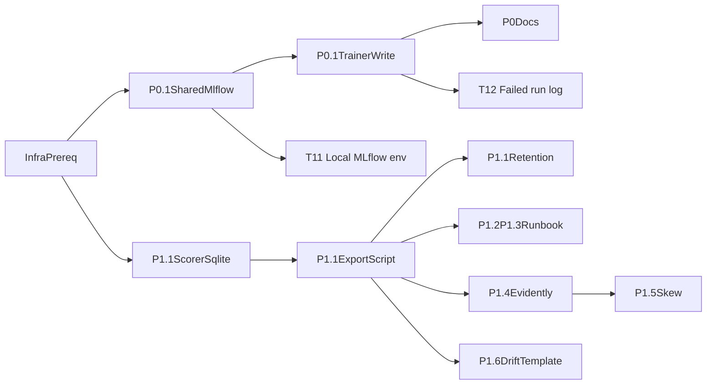

# Phase 2 P0-P1 Work Plan

> 依據：
> [doc/phase2_p0_p1_implementation_plan.md](doc/phase2_p0_p1_implementation_plan.md)
> [ssot/phase2_p0_p1_ssot.md](ssot/phase2_p0_p1_ssot.md)
>
> 本文件為 **execution-level** 工作計畫，直接對應實作順序、檔案級修改、測試、相依、rollback 與 DoD。

---

## Guardrails

- **不修改 `build/lib/**`**。如未來需要打包，應由正式 build 流程重新產出。
- **Scorer hot path 不做任何網路 I/O**，也不在記憶體中累積 5-15 分鐘資料。
- **Scorer 僅 append 到 SQLite**；export 由獨立 process 執行。
- **Prediction log 不做 per-row export update**；使用 **watermark**（例如 `last_exported_prediction_id`）追蹤匯出進度。
- **SQLite 沿用 WAL mode**，避免 scorer 寫入與 export 讀取互相阻塞。
- **MLflow artifact 由 client 直傳 GCS**，不讓 e2-micro 代理大檔。
- **Evidently 僅 manual / ad-hoc**，且明確保留 OOM 風險警告，不預先鎖死抽樣策略。

---

## External Prerequisites

以下不是 repo 內程式修改，但沒有它們，實作與驗證會卡住：

1. GCP MLflow Tracking Server 可連線。
2. GCS bucket 與 service account 權限可用。
3. 匯出程式的執行位置已決定：
   - 與 scorer 同機器跑 cron / Task Scheduler，或
   - 另一台可讀 SQLite 且可連 GCP 的機器。
4. Prediction log 儲存位置已決策：
   - 決策：**拆分獨立的 SQLite 檔案（例如 `prediction_log.db`）**。
   - 理由：Scorer 寫入預測日誌頻率極高，獨立檔案可與 `state.db` 的 API 查詢與 Validator 讀寫在 I/O 層級上實體隔離，徹底避免高頻寫入與大量 export 讀取干擾主系統。
5. 確認 export 預設格式：
   - 預設建議：**Parquet + snappy**
   - 理由：repo 已有 `pyarrow`，snappy CPU 成本較低，對 laptop 較穩；若日後頻寬壓力更大，再評估 gzip/zstd。

---

## High-Level Execution Order

---

## Ordered Tasks

**Current status**（更新於 2026-03-19）：**T0**–**T11** 已完成。**T12** 已完成（含 Step 1、Step 2、optional follow-on、Code Review §1）。**Credential folder consolidation** Step 1–2 已實作（config 自 credential/.env 載入、mlflow_utils 自 credential/mlflow.env 優先、.gitignore 與範本）；Code Review §1（config load_dotenv try/except）、§2（mlflow 例外 log 不洩路徑）已修補，五則 credential_review 測試全過。**Scorer Track Human lookback parity**：scorer 已傳入 `lookback_hours=SCORER_LOOKBACK_HOURS`；Code Review §1（scorer config 改為 `from trainer.core import config`）已修補；5 則契約／邊界測試就位；tests/ruff 通過，見 STATUS.md § Scorer Track Human lookback parity fix。**R3505 cutoff_time 正規化**：Code Review §1–§4 已修補；見 STATUS.md § Round — R3505 正規化 Production 修補。**T13 MLflow cold-start mitigation**：Step 1–2（重試＋退避、warm-up）與 Code Review #1/#3/#4 修補已完成，見 STATUS.md § T13 Code Review 修補 production。

**Remaining items**（依執行順序）：
- **Credential folder**：Migration（既有 local_state/mlflow.env、repo/.env 搬至 credential/ 並拆分）、可選 deploy 路徑（main.py 改讀 credential/.env）、可選 .gitignore 改為忽略整個 credential/ 再 negate examples）。
- **DB path consolidation（新增）**：統一 runtime DB 目錄（`STATE_DB_PATH`、`PREDICTION_LOG_DB_PATH` 指向同一 `local_state/`），避免 state 與 prediction log 分散在 `trainer/local_state` 與 `local_state` 造成維運與調查口徑混淆。
- **T-TrainingMetricsSchema**：`training_metrics.json` 根層與 `rated` 巢狀對齊、調查 baseline 讀取修正；見下節 **T-TrainingMetricsSchema**。
- **Scorer lookback（可選）**：Code Review §2 — `SCORER_LOOKBACK_HOURS` 非數值或 ≤ 0 時於 scorer 加 fallback（log warning + 用 8）；若實作須同步調整邊界測試預期。
- 其餘 Phase 2 P0–P1 無強制待辦；若要進一步降低風險，可再針對 Code Review §2–§5 的「效能/語義」項（例如 OOM pre-check I/O 成本與 RSS peak 真實最大值語義）做後續優化。

---

### T0. Pre-flight decisions and dependency audit — ✅ Done

- **Depends on**: none
- **Goal**: 凍結最少必要決策，避免後續返工。
- **Files**
  - [requirements.txt](requirements.txt): 確認 training / local script 依賴是否補 `mlflow`
  - [package/deploy/requirements.txt](package/deploy/requirements.txt): 若 export script 在 deploy 環境跑，補 `mlflow`
  - [deploy_dist/requirements.txt](deploy_dist/requirements.txt): 若 deploy_dist 也需要 export script，補 `mlflow`
  - [pyproject.toml](pyproject.toml): 若專案以此作為主依賴來源，也同步更新
- **Implementation notes**
  - `mlflow` 目前 repo **尚未存在**，這是新增依賴。
  - `evidently` 目前 repo **尚未存在**，但它只用於手動 DQ/drift 腳本，不必進 deploy runtime requirements，除非你決定在 deploy 機器上手動跑。
  - 明確排除 `build/lib/**`。
- **Test steps**
  1. 確認依賴檔是否一致，不出現 root 有 `mlflow`、deploy 沒有的半套狀態。
  2. 確認 `pyarrow` 已存在，可支撐 Parquet export。
- **Rollback**
  - 依賴變更尚未進 code，可直接回退 requirements / pyproject 修改。
- **Definition of done**
  - `mlflow` 的安裝邊界已定義清楚。
  - `evidently` 是否只放 root/local script 已明確。
  - 不會有人去改 `build/lib/**`。

### T1. Shared MLflow utility and provenance schema — ✅ Done

- **Depends on**: T0
- **Goal**: 避免 trainer 與 export script 各自手寫 MLflow 邏輯。
- **Files**
  - New: `trainer/core/mlflow_utils.py`
  - New: `doc/phase2_provenance_schema.md`
  - [trainer/core/config.py](trainer/core/config.py)
- **Implementation notes**
  - 在 `trainer/core/mlflow_utils.py` 提供：
    - 讀取 `MLFLOW_TRACKING_URI`
    - safe no-op / warning only 行為
    - 建立或寫入 run/tag/artifact 的 helper
  - provenance schema 至少包含：
    - `model_version`
    - `git_commit`
    - `training_window_start`
    - `training_window_end`
    - `artifact_dir`
    - `feature_spec_path` / feature schema version
    - `training_metrics_path`
  - 不要求 trainer 在 URI 不可達時 fail。
- **Test steps**
  1. 為 utility 補 unit test：URI 未設時僅 warning，不 raise。
  2. mock MLflow client，驗證 tags / params payload 內容。
- **Rollback**
  - trainer / export script 尚未接上前，可單獨回退 utility。
- **Definition of done**
  - repo 內 MLflow 共用邏輯只有一份。
  - provenance key naming 已文檔化。

### T2. P0.1 trainer provenance write — ✅ Done

- **Depends on**: T1
- **Goal**: 在訓練 artifact 完成後，把 provenance 寫到 GCP MLflow。
- **Files**
  - [trainer/training/trainer.py](trainer/training/trainer.py)
  - New: `tests/review_risks/test_review_risks_phase2_mlflow_trainer.py`
  - New: `tests/integration/test_phase2_trainer_mlflow.py`
- **Implementation notes**
  - 接點就在 `save_artifact_bundle(...)` 後、stale artifact cleanup 前後皆可，但要保證：
    - `model_version` 已生成
    - artifact bundle 已落地
  - 建議新增 helper 呼叫，例如 `_log_training_provenance_to_mlflow(...)`
  - 失敗策略：
    - 無 URI / 無法連線 / GCP 失敗 -> `logger.warning(...)`，訓練仍成功
  - 不做本地 fallback MLflow。
- **Test steps**
  1. 跑既有 [tests/integration/test_trainer.py](tests/integration/test_trainer.py) 確認沒回歸。
  2. 新增 mock MLflow integration test，驗證 trainer 在成功與失敗路徑都不 crash。
  3. 手動：設 `MLFLOW_TRACKING_URI` 到測試 server，執行 `run_pipeline`，確認 MLflow run 可查到 `model_version` 與 artifact path。
- **Rollback**
  - 移除 trainer 中的 helper 呼叫即可。
  - 或 unset `MLFLOW_TRACKING_URI` 暫停功能。
- **Definition of done**
  - 給定 `model_version`，能在 MLflow 找到 provenance。
  - URI 不可達時，訓練仍完成。

### T3. P0.2 rollback and provenance query docs — ✅ Done

- **Depends on**: T2
- **Goal**: 將 P0.2「整目錄 rollback」與查詢方式文件化。
- **Files**
  - New: `doc/phase2_provenance_query_runbook.md`
  - New: `doc/phase2_model_rollback_runbook.md`
- **Implementation notes**
  - 明確寫：
    - rollback 只能替換整個 artifact directory / package
    - 禁止只換 `model.pkl`
    - 如何用 `model_version` 查 MLflow provenance
- **Test steps**
  1. 文件 review：用文件步驟實際查一次既有 / 測試 run。
  2. 文件 review：讓另一位維護者照 runbook 模擬 rollback 步驟。
- **Rollback**
  - 純文件，可直接回退。
- **Definition of done**
  - rollback 與 provenance query 均有可操作 runbook。

### T4. P1.1 scorer prediction log schema and write path — ✅ Done

- **Depends on**: T0
- **Goal**: scorer 每次 scoring 後，將必要欄位 append 到 SQLite，不做網路 I/O。
- **Files**
  - [trainer/serving/scorer.py](trainer/serving/scorer.py)
  - [trainer/core/config.py](trainer/core/config.py)
  - New: `tests/review_risks/test_review_risks_phase2_prediction_log_schema.py`
  - New: `tests/integration/test_phase2_prediction_log_sqlite.py`
- **Implementation notes**
  - **不要**在 hot path 寫 full feature vector；只寫最小必要欄位，避免 SQLite 爆量：
    - `prediction_id INTEGER PRIMARY KEY AUTOINCREMENT`
    - `scored_at`
    - `bet_id`
    - `session_id`
    - `player_id`
    - `canonical_id`
    - `casino_player_id`
    - `table_id`
    - `model_version`
    - `score`
    - `margin`
    - `is_alert`
    - `is_rated_obs`
  - 新增 `PREDICTION_LOG_DB_PATH` (預設例如 `local_state/prediction_log.db`) 並獨立開啟連線與 WAL mode。
  - 在 `_score_df(...)` 之後、alert filter 之前或之後插入 prediction log 都可，但要清楚定義：
    - 若目標是「每筆推論」就應在 alert filter **之前**，保存全部 scored rows。
  - 以 batch insert 寫入，不逐 row execute。
- **Test steps**
  1. 跑既有 [tests/integration/test_scorer.py](tests/integration/test_scorer.py)。
  2. 新增 integration test：temp SQLite + mocked artifacts，驗證 scorer 會建立 `prediction_log` 並寫入 rows。
  3. 手動：run scorer once，直接查 SQLite row count 增加。
- **Rollback**
  - 以 config / env 關閉 prediction log。
  - 不必先 drop table；可保留空功能。
- **Definition of done**
  - scorer 可在不連 GCP 的情況下持續寫入 prediction log。
  - 寫入不影響 alerts 主流程。

### T5. P1.1 export watermark, export runner, and MLflow artifact upload

- **Depends on**: T1, T4
- **Goal**: 用獨立 process 匯出 SQLite prediction log 到 MLflow artifact。
- **Files**
  - New: `trainer/scripts/export_predictions_to_mlflow.py`
  - [trainer/serving/scorer.py](trainer/serving/scorer.py) 或同 DB schema 初始處：新增 export watermark / audit metadata
  - [trainer/core/config.py](trainer/core/config.py)
  - New: `tests/integration/test_phase2_prediction_export.py`
- **Implementation notes**
  - **關鍵修正**：不用 `exported_at` per-row update。
  - 方案：
    - 在 `meta` table 加 `prediction_export_last_id`
    - export script 每次讀：
      - `prediction_id > last_exported_id`
      - `scored_at <= now - safety_lag`
      - `ORDER BY prediction_id`
      - `LIMIT batch_rows`
    - 成功上傳後，只更新一次 watermark
  - 可選增加 `prediction_export_runs` audit table，記錄每次 export：
    - start / end time
    - min/max prediction_id
    - row_count
    - artifact path
    - success / error
  - 預設輸出格式：**Parquet + snappy**
  - 路徑建議：依 `model_version/date/hour` 分層，便於查詢與清理。
  - 失敗策略：
    - 上傳失敗 -> 不移動 watermark，不刪資料
    - 下次可重試
- **Test steps**
  1. temp SQLite 建假資料，跑 export script，驗證：
     - 只匯出 watermark 後資料
     - 成功後 watermark 前進
  2. mock MLflow/GCS 失敗，驗證 watermark 不前進、資料保留。
  3. 手動：本機 cron / once 模式跑一輪，確認 artifact 到 MLflow。
- **Rollback**
  - 停掉 export 排程。
  - scorer 仍可照常運作。
- **Definition of done**
  - export 為獨立 process。
  - 失敗不丟資料。
  - 不存在 per-row export update 的高寫入設計。

### T6. P1.1 retention and cleanup

- **Depends on**: T5
- **Goal**: 避免 prediction log 無限成長。
- **Files**
  - [trainer/scripts/export_predictions_to_mlflow.py](trainer/scripts/export_predictions_to_mlflow.py)
  - [trainer/core/config.py](trainer/core/config.py)
  - New: `tests/integration/test_phase2_prediction_retention.py`
- **Implementation notes**
  - retention cleanup 不放在 scorer hot path。
  - export 成功後由 export script 做 **bounded cleanup**：
    - 只刪 `prediction_id <= watermark`
    - 且 `scored_at < retention_cutoff`
    - 分批 delete，避免長 transaction
  - 預設 retention 天數寫進 config。
- **Test steps**
  1. 模擬舊資料 + 新資料，驗證只清理已成功匯出且超過 retention 的 rows。
  2. 驗證未匯出資料不會被清掉。
- **Rollback**
  - 關閉 cleanup，保留資料。
- **Definition of done**
  - DB size 有上界控制。
  - cleanup 不碰未匯出資料。

### T7. P1.2 / P1.3 alert conditions, runbook, message format — ✅ Done

- **Depends on**: T4, T5
- **Goal**: 先把人要怎麼看、怎麼處理寫清楚，即使不做 Slack/email。
- **Files**
  - New: `doc/phase2_alert_runbook.md`
  - New: `doc/phase2_alert_message_format.md`
- **Implementation notes**
  - 至少覆蓋：
    - scorer / export / validator / Evidently 常見異常
    - 誰看、看哪個 DB / artifact / report
    - human-oriented message 應包含哪些欄位
- **Test steps**
  1. 文件 walkthrough：模擬 3 個情境
     - export 失敗
     - validator precision 掉落
     - drift report 異常
- **Rollback**
  - 純文件，可直接回退。
- **Definition of done**
  - 有人能依文件完成 triage。

### T8. P1.4 local Evidently report tooling — ✅ Done

- **Depends on**: T0, T5
- **Goal**: 提供可手動執行的 DQ / drift 報告產生工具，而不只是文件。
- **Files**
  - New: `trainer/scripts/generate_evidently_report.py`
  - New: `doc/phase2_evidently_usage.md`
  - [requirements.txt](requirements.txt) 或 [pyproject.toml](pyproject.toml): 新增 `evidently`
- **Implementation notes**
  - 腳本只做 **manual / ad-hoc**。
  - 輸入建議：
    - reference profile / training snapshot
    - current data file path（由人工挑選或前置匯整）
  - 明確寫出：
    - 報告輸出到本地 `out/` 或 `doc/` 下某固定目錄
    - 可選 sync 到 GCS
    - **OOM 風險警告保留**
  - 不在本任務決定 downsampling / aggregation 實作策略。
- **Test steps**
  1. 小樣本手動跑腳本，確認能產 HTML / JSON 報告。
  2. 驗證無 Evidently 時錯誤訊息清楚。
- **Rollback**
  - 不跑此腳本即可；不影響 scorer / trainer。
- **Definition of done**
  - 至少可手動產生一份本地 Evidently 報告。
  - OOM 風險與操作方式已文件化。

### T9. P1.5 training-serving skew check tooling — ✅ Done

- **Depends on**: T4, T8
- **Goal**: 讓 skew 驗證是可執行流程，不只停留在概念。
- **Files**
  - New: `trainer/scripts/check_training_serving_skew.py`
  - New: `doc/phase2_skew_check_runbook.md`
- **Implementation notes**
  - 先做 **one-shot / manual** 工具即可。
  - 核心輸入：
    - 一批 serving-side ids / timestamps
    - 對應 training-side feature derivation 結果
  - 輸出：
    - 不一致欄位列表
    - 摘要表
    - 可附 CSV / markdown
- **Test steps**
  1. 用小型合成資料驗證一致 / 不一致兩條路徑。
  2. 手動產一份 skew check 輸出。
- **Rollback**
  - 純 script + doc，可獨立回退。
- **Definition of done**
  - 至少能完成一次可重現的 skew 檢查。

### T10. P1.6 drift investigation template and first example report — ✅ Done

- **Depends on**: T5, T7, T8, T9
- **Goal**: 讓 drift 調查有固定產出格式，且能落到 `doc/`。
- **Files**
  - New: `doc/drift_investigation_template.md`
  - New: `doc/phase2_drift_investigation_example.md`
- **Implementation notes**
  - 模板應包含：
    - trigger
    - timeframe
    - model_version
    - evidence used
    - hypotheses
    - checks performed
    - conclusion
    - recommended action
  - example 可用 mock / historical / dry-run 資料，不必等真實事故。
- **Test steps**
  1. 依模板實際填一份 example。
  2. 確認 runbook 中有指向此模板。
- **Rollback**
  - 純文件，可直接回退。
- **Definition of done**
  - repo 內有正式模板與至少一份 example。

### T11. Local MLflow config from project-local file (optional) — ✅ Done

- **Depends on**: T1
- **Goal**: 本機 train / export 預設即帶 MLflow 設定，且**不**將 MLflow 相關變數寫入專案主 `.env`；所有 trials 預設寫入 MLflow。
- **Files**
  - [trainer/core/mlflow_utils.py](trainer/core/mlflow_utils.py)
  - [.gitignore](.gitignore)
  - 使用者建立（不 commit）：`local_state/mlflow.env`
  - 可選：`local_state/mlflow.env.example` 或 doc 說明格式
- **Implementation notes**
  - 在 `mlflow_utils.py` 模組頂層（任一程式 `import` 此模組時）：
    - 由 `Path(__file__).resolve()` 推得 repo 根目錄（`trainer/core/` → 上兩層為 repo root）。
    - 若 `repo_root / "local_state" / "mlflow.env"` 存在，則呼叫 `load_dotenv(該路徑, override=False)`，將該檔內變數注入 `os.environ`。
    - `override=False`：若 process 已設 `MLFLOW_TRACKING_URI` 或 `GOOGLE_APPLICATION_CREDENTIALS`（例如 shell 或系統環境變數），不覆寫。
  - 依賴：專案已有 `python-dotenv`（config 使用），不需新增。
  - `.gitignore`：新增 `local_state/mlflow.env`（或整個 `local_state/`），避免金鑰與 URI 被 commit。
  - `local_state/mlflow.env` 建議內容（兩行，無引號）：
    - `MLFLOW_TRACKING_URI=https://...`
    - `GOOGLE_APPLICATION_CREDENTIALS=<path-to-service-account-key.json>`
  - 主 `.env` 完全不包含上述變數；僅此專用檔負責 MLflow 本機設定。
- **Test steps**
  1. 單元測試：mock 或 temp 建立 `local_state/mlflow.env`，import `mlflow_utils` 後驗證 `os.environ` 含預期鍵（或 `get_tracking_uri()` 回傳該 URI）；無檔時 import 不報錯、不覆寫既有 env。
  2. 可選：integration 測試 — 有檔且 URI 可達時，`is_mlflow_available()` 為 True。
- **Rollback**
  - 移除 `mlflow_utils.py` 頂層的 `load_dotenv(...)` 邏輯即可；不影響既有 `MLFLOW_TRACKING_URI` 由環境變數讀取的行為。
- **Definition of done**
  - 建立 `local_state/mlflow.env` 並設好兩行後，從此專案執行 train / export 無需手動 `export` 環境變數，trials 預設寫入 MLflow。
  - 主 `.env` 仍不包含 MLflow 設定。
- **Code Review follow-up（2026-03-18）**：§1（import 時 try/except，避免 load_dotenv/path 異常導致模組載入失敗）、§2（MLFLOW_ENV_FILE 空字串／空白視為未設）已實作；tests/typecheck/lint 全過，見 STATUS.md「本輪實作：T11 Code Review §1§2 修補」。

### T12. Log failed training runs to MLflow (optional follow-on) — Step 1 ✅ Done

- **Depends on**: T2, T11
- **Step 1 done（2026-03-18）**：單一 run（`train-{start}-{end}-{timestamp}`）、with + try/except、失敗時 `log_tags_safe({"status":"FAILED","error":str(e)[:500]})` 後 raise；`_log_training_provenance_to_mlflow` 有 active run 時只 log 不 start_run。Code Review 風險點已轉成 tests（§1–§4），見 STATUS.md「新增測試：T12 Code Review 風險點」。
- **Goal**: 當訓練 pipeline 在任一步（如 Step 3 canonical mapping OOM）失敗時，也在 MLflow 寫入一筆 run，標記 `status=FAILED`、錯誤訊息（與可選的 failed_step），並寫入 **config、記憶體估計、資料規模** 等，方便在 MLflow UI 區分成功與失敗、排查 OOM／環境問題並改善配置。
- **Files**
  - [trainer/training/trainer.py](trainer/training/trainer.py)
  - [trainer/core/mlflow_utils.py](trainer/core/mlflow_utils.py)
  - 可選：`tests/unit/test_mlflow_utils.py` 或 `tests/integration/test_phase2_trainer_mlflow.py` 補「失敗路徑有 run 且 tag 正確」
- **Implementation notes**
  1. **單一 run 涵蓋整次 pipeline**  
     - 在 `run_pipeline` 內，取得 `effective_start` / `effective_end` 後、Step 1 之前，以 `safe_start_run(run_name=..., tags=...)` 開一個 run。Run 名稱不可依賴 `model_version`（失敗時尚未產生），改為例如 `train-{window_start}-{window_end}-{timestamp}` 或 `train-{timestamp}`。
  2. **整段 pipeline 包在同一個 run 的 context 裡**  
     - 用 `with safe_start_run(run_name=run_name):` 包住從 Step 1 到 Step 10（含 `_log_training_provenance_to_mlflow`）的整段程式，確保成功或失敗離開時 run 都會被結束。
  3. **失敗時寫入狀態與診斷資訊**  
     - 在 `with` 內用 `try/except` 包住 pipeline 本體；在 `except` 中：
       - `log_tags_safe({"status": "FAILED", "error": str(e)[:500]})`，可選 `log_params_safe({"failed_step": current_step})`。
       - **為便於 OOM 與配置改善，失敗時盡量寫入**：`training_window_start` / `training_window_end`、`recent_chunks`、`NEG_SAMPLE_FRAC`（或 `_effective_neg_sample_frac`）、`use_local_parquet`、chunk 數（`len(chunks)`）；若該次 run 已執行 OOM-check，則寫入 est. peak RAM、available、budget（與既有 log 同一組數字）；可選 DuckDB `memory_limit` 等。使 MLflow UI 上可看到「為何失敗、當時 config、記憶體與資料規模」，利於事後調整。
  4. **成功路徑不重複 start_run**  
     - `_log_training_provenance_to_mlflow` 改為：若 `mlflow.active_run()` 已有 run，則**不**再呼叫 `safe_start_run`，僅對當前 run 做 `log_params_safe`（與既有 artifact 寫入）；若沒有 active run（例如單獨呼叫此 helper），則維持現狀（start run + log）。
  5. **風險與注意**  
     - 必須在「所有離開 run_pipeline 的路徑」都結束 run，故一律用 `with safe_start_run(...):` 包住整段，避免漏關。  
     - 不新增依賴；沿用 `log_tags_safe` / `log_params_safe` / `end_run_safe`。MLflow 不可用時 `safe_start_run` 為 no-op，行為與現有一致。
- **Test steps**
  1. 單元或整合：mock pipeline 在 Step 3 拋錯，驗證 MLflow 有對應 run、tag `status=FAILED`、params/tag 含 error（或 failed_step）及 config／資料規模等。
  2. 成功路徑：跑一小段 trainer（如 `--days 1 --use-local-parquet --skip-optuna`），確認 MLflow 仍只有一筆 run、provenance 與 artifact 正確。
  3. 手動：觸發一次 OOM 或人為 exception，在 MLflow UI 確認失敗 run 可見、訊息可讀，且 params 含 window／chunks／NEG_SAMPLE_FRAC／記憶體估計等。
- **Rollback**
  - 移除 `run_pipeline` 頂層的 `with safe_start_run` 與 try/except；還原 `_log_training_provenance_to_mlflow` 為「一律自己 start_run」。即回到「僅成功時寫 MLflow」的行為。
- **Definition of done**
  - 訓練在任一步失敗時，MLflow 會有一筆 run 且可辨識為 FAILED 並含錯誤資訊與 config／記憶體／資料規模（利於 OOM 改善）。
  - 成功完成時仍只有一筆 run，provenance 與 T2 行為一致。
  - 無 MLflow 時行為不變（no-op，不 crash）。

### T13. MLflow cold-start mitigation (optional follow-on) — ✅ Done

- **Depends on**: T2, T12
- **Goal**: 在 Cloud Run MLflow 維持 min instances = 0 的前提下，避免訓練結束後因 cold start 導致 `log-batch` 連續 503、provenance/metrics 寫入失敗。不增加常駐 instance 成本。
- **Context**: 長時間訓練（例如 3 小時）期間無 MLflow 請求，Cloud Run 可能 scale to zero；訓練完成時第一次 `log_params` / `log_metrics` 觸發 cold start 而回 503，client 重試後仍失敗。實作兩層緩解：
  1. **Client 重試＋退避**：在 `log_params_safe`、`log_metrics_safe`（與必要時 `log_tags_safe`）內，對暫時性錯誤（503、502、504 或 exception 訊息含 `too many 503`）做有限次數重試，並使用 exponential backoff（例如 30s、60s、120s）。Cold start 多數在 30–60s 內就緒，數次重試即可成功。
  2. **Warm-up 請求**：在 Step 10 完成後、第一次呼叫 `_log_training_provenance_to_mlflow` / `log_params_safe` 之前，先發一筆輕量 MLflow API 請求（例如 `mlflow.get_run(active_run.info.run_id)`），並對該請求套用相同 503/502/504 重試＋退避邏輯；成功後再執行既有 provenance 與 metrics 寫入，使後續 `log-batch` 打到已 warm 的 instance。
- **Files**
  - [trainer/core/mlflow_utils.py](trainer/core/mlflow_utils.py)
  - [trainer/training/trainer.py](trainer/training/trainer.py)
- **Implementation notes**
  1. **重試條件**：僅對「暫時性伺服器錯誤」重試（HTTP 503/502/504，或 MLflow/requests 拋出之 exception 的 `str(e)` 含 `"503"` / `"too many 503"`）；其他例外維持現狀（log warning、不重試）。
  2. **重試參數**：最大重試次數（例如 3–5）、初始延遲與 backoff 倍率可為常數或 config，避免單次訓練結束後等待過長（例如總等待上界約 2–4 分鐘）。
  3. **Warm-up 時機**：在 `run_pipeline` 內、`_log_training_provenance_to_mlflow(...)` 被呼叫之前；僅在 `has_active_run()` 為 True 時執行（已有 run 才需 warm-up，再 get_run 即可）。
  4. **契約不變**：失敗時仍只 `logger.warning`，不 raise；訓練成功與否不受 MLflow 寫入成敗影響。
- **Test steps**
  1. 單元：mock MLflow client 使第一次呼叫拋 503、第二次成功，驗證 `log_params_safe` / `log_metrics_safe` 在重試後成功且僅呼叫預期次數。
  2. 可選：mock 連續 503，驗證達最大重試後仍只 warning、不 raise。
  3. 手動：在 Cloud Run min instances = 0 下跑完整訓練，確認結束後 provenance 與 metrics 能寫入（或至少重試日誌可觀測）。
- **Rollback**
  - 移除重試迴圈與 warm-up 呼叫，還原為單次呼叫＋失敗即 warning。
- **Definition of done**
  - 在 scale-to-zero MLflow 下，訓練結束後 provenance 與 metrics 能在一至數次重試內寫入，或明確在日誌中留下重試行為；不增加常駐 instance 成本。

### Credential folder consolidation — Step 1–2 ✅ Done；Code Review §1 §2 ✅ Done

- **Step 1–2 已完成**（2026-03-19）：config 自 `_REPO_ROOT/credential/.env` 優先載入（含 try/except）；mlflow_utils 自 `credential/mlflow.env` 再 `local_state/mlflow.env`；.gitignore 與 credential 範本已就位。Code Review §1（config 載入 try/except）、§2（mlflow warning 僅 log 例外類型不洩路徑）已修補。
- **Depends on**: T11（原為 `local_state/mlflow.env` 與主 `.env` 分散）。
- **Goal**: 將所有敏感與環境設定檔集中至單一目錄 `credential/`（repo 根目錄下），便於權限、備份與 .gitignore；並明確區分「一般 env」與「Cloud/MLflow」設定。
- **Target layout**（repo root 下）：
  - `credential/.env` — ClickHouse（CH_HOST, CH_PORT, CH_USER, CH_PASS, SOURCE_DB）、STATE_DB_PATH、MODEL_DIR 等；**不**包含 `GOOGLE_APPLICATION_CREDENTIALS`。
  - `credential/.env.example` — 上述變數之範本（可 commit）。
  - `credential/mlflow.env` — MLflow 與 Cloud 相關：`MLFLOW_TRACKING_URI`、`GOOGLE_APPLICATION_CREDENTIALS=<path-to-key.json>`；**GCP 金鑰路徑僅放於此檔，不放入主 .env**。
  - `credential/mlflow.env.example` — 上述兩行範本（可 commit）。
  - `credential/<gcp-key>.json` — GCP 服務帳戶 key 檔（不 commit）；路徑由 `mlflow.env` 內 `GOOGLE_APPLICATION_CREDENTIALS` 指定（可為絕對路徑或相對 repo root）。
- **Separation rule**: `GOOGLE_APPLICATION_CREDENTIALS` 屬 Cloud/MLflow 用途，僅出現在 `credential/mlflow.env`，不出現在 `credential/.env`。
- **Files to touch**（實作時）：
  - [trainer/core/config.py](trainer/core/config.py)：改為自 `_REPO_ROOT / "credential" / ".env"` 載入（並可保留 `load_dotenv(override=False)` 從 cwd 補齊）。
  - [trainer/core/mlflow_utils.py](trainer/core/mlflow_utils.py)：預設路徑由 `repo_root / "local_state" / "mlflow.env"` 改為 `repo_root / "credential" / "mlflow.env"`；`MLFLOW_ENV_FILE` override 邏輯保留。
  - [package/deploy/main.py](package/deploy/main.py)（可選）：若 deploy 亦採用同一結構，改為 `DEPLOY_ROOT / "credential" / ".env"`，並於 deploy 包內提供 `credential/mlflow.env` 與 key 檔。
  - [.gitignore](.gitignore)：忽略 `credential/` 內實際密鑰與 env（例如 `credential/.env`、`credential/mlflow.env`、`credential/*.json`），保留 `!credential/.env.example`、`!credential/mlflow.env.example`。
- **Migration**: 既有 `local_state/mlflow.env` 與 `trainer/.env`（或 repo root `.env`）搬至 `credential/` 並依上述規則拆分內容；`local_state/` 保留給 state.db、prediction_log.db 等執行期資料。
- **Definition of done**
  - 單一目錄 `credential/` 含 .env、mlflow.env、GCP key；主 .env 不含 Cloud 相關變數；程式自 `credential/` 讀取後 train / scorer / validator 與 deploy 行為一致。
- **剩餘項目**（可選／後續）：
  - Migration：既有 `local_state/mlflow.env`、repo root 或 `trainer/.env` 內容搬至 `credential/` 並依規則拆分。
  - Deploy（可選）：`package/deploy/main.py` 改為自 `DEPLOY_ROOT/credential/.env` 載入；deploy 包內提供 `credential/` 與範本。
  - .gitignore（可選）：改為忽略整個 `credential/` 再以 `!credential/.env.example`、`!credential/mlflow.env.example` 排除範本。

### DB path consolidation（state.db / prediction_log.db 同目錄）— Planned

- **Depends on**: T4, T5, Credential folder consolidation
- **Goal**: 將 runtime SQLite 路徑統一為同一個 `local_state/` 目錄，降低部署、備份、故障排查與調查口徑混用風險。
- **Background（現況差異）**：
  - `STATE_DB_PATH` 在 serving 預設常落於 `trainer/local_state/state.db`（若未覆寫）。
  - `PREDICTION_LOG_DB_PATH` 預設為 repo root `local_state/prediction_log.db`。
  - 兩者分散導致：路徑誤判、跨機器調查不一致、腳本需額外猜測位置。
- **Target state**：
  - `STATE_DB_PATH=<runtime_root>/local_state/state.db`
  - `PREDICTION_LOG_DB_PATH=<runtime_root>/local_state/prediction_log.db`
  - 二者同目錄、不同檔名（**不**合併為單一 SQLite 檔）。
- **Execution steps（建議最小風險）**：
  1. 在 production `credential/.env` 明確設定上述兩個絕對路徑（不依賴 fallback）。
  2. 若舊路徑已有 DB，先停寫服務再搬移（或複製）至新目錄，保留舊檔快照供回滾。
  3. 依序啟動 scorer → validator → API/export，避免讀取端先起造成誤判。
  4. 執行 investigation preflight 與 R2 腳本，確認兩 DB 均由新路徑解析且查詢成功。
- **Validation steps**：
  - `preflight_check.py` 顯示 `PREDICTION_LOG_DB_PATH` 與 `DATA_DIR` resolved 正確，prediction log freshness 正常。
  - `investigate_r2_window.py` 的 `resolution` 區段顯示 `pred_db_path` / `state_db_path` 均在同一 `local_state/`。
  - 交叉查詢：prediction_log `MAX(scored_at)` 持續前進、alerts 表可查且筆數增長符合預期。
- **Rollback**：
  - 停服務，將 `.env` 兩個路徑改回舊值；重新啟動服務。
  - 若新路徑資料不完整，使用搬移前快照回復。
- **Definition of done**：
  - runtime 不再依賴預設 fallback 推測 DB 位置。
  - 所有運維／調查腳本可在不指定 path 的情況下讀到正確 DB。
  - 路徑與備份策略文件化（runbook/STATUS）。

### T-TrainingMetricsSchema — `training_metrics.json` 結構與讀取對齊（P0 維運／調查）— ⏳ Planned

- **Depends on**: 無強制相依（與 P0.1 trainer 寫 artifact、調查腳本可並行），但建議在 **一次訓練 smoke** 後驗證。
- **Goal**: 讓 **`training_metrics.json` 的「可查詢形狀」與下游直覺一致**，避免把「數值其實在巢狀 `rated` 內」誤判成 **null／缺欄**；並明確區分 **結構問題** 與 **評估邏輯上合法的 JSON null**。

#### 問題陳述（觀察到的現象）

- 訓練後打開 `training_metrics.json`，或在 `run_r1_r6_analysis` 的 baseline 裡，**頂層**的 `test_precision_at_recall_0.01`、`threshold_at_recall_0.01`、`test_threshold_uncalibrated` 等常為 **null 或不存在**。
- 同一檔案若展開 **`rated` 物件**，往往可看到上述鍵與完整 train/val/test 指標。

#### 根因（程式與契約）

1. **寫檔結構**  
   `save_artifact_bundle` 使用 `json.dumps({ **combined_metrics, "model_version": ..., ... })`（見 [trainer/training/trainer.py](trainer/training/trainer.py)）。  
   `combined_metrics` 來自 `train_single_rated_model`／`train_dual_model`，形狀為 **`{"rated": <metrics_dict>, ...}`**，其中 **`<metrics_dict>` 才是扁平的** `val_*` / `train_*` / `test_*` / `threshold` 等。  
   因此 **`test_precision_at_recall_0.01` 等落在 `root.rated.*`，不在 `root.*`**。這不是「訓練沒算」，而是 **鍵的層級與消費端假設不一致**。

2. **讀取端假設錯誤（具體 bug）**  
   [investigations/test_vs_production/checks/run_r1_r6_analysis.py](investigations/test_vs_production/checks/run_r1_r6_analysis.py) 的 `_load_training_metrics_baseline` 對  
   `test_precision_at_recall_0.01`、`threshold_at_recall_0.01`、`test_threshold_uncalibrated` 使用 **`data.get(...)` 僅查頂層**，未 fallback 至 **`data["rated"]`**，故 baseline 長期顯示 null（與實際 JSON 內容不符）。

3. **與「真正的 null」分開看**（**非本次 schema bug**，但會同檔並存）  
   `_compute_test_metrics` 在 test 集未過 guard（列數、正負樣本、NaN）、或 PR 曲線上無法達到目標 recall 等情況下，會**刻意**把部分鍵設為 **`None` → JSON `null`**；`alerts_per_minute_at_recall_*` 亦**設計上**為 null（trainer 無 test 窗長）。  
   **修正 schema/讀取後，這些仍可能為 null**——屬**語意正確**，需在文件與調查解讀中保留。

4. **`uncalibrated_threshold` 形狀**  
   頂層為 **`{"rated": bool}`**（v10 單模型），**不是**單一布林；若下游當成「與 `test_threshold_uncalibrated` 同層級的同型欄位」會混淆。計畫中應**明文寫入 schema 說明**，必要時在 doc 範例 JSON 標註。

#### 建議解法（可採「雙軌」以兼顧相容與清晰）

**A. 寫檔（trainer，受益所有未來訓練）** — 擇一或併用：

- **A1（推薦，向後相容）**：在 `save_artifact_bundle` 組出最終 dict 時，除保留既有 **`rated`（與 legacy 可能之 `nonrated`）巢狀物件**外，將 **審計／對外常用的一組鍵**（例如與 R1/R8 baseline、README 敘述一致的 `test_precision_at_recall_*`、`threshold_at_recall_*`、`test_threshold_uncalibrated`、`threshold`（若與 rated 決策閾值同義需註明））**複寫到 JSON 根層**（**僅在無鍵名衝突時**；現有根層已有 `model_version`、`spec_hash` 等，需逐一核對 `metrics` 內鍵名）。  
  - **優點**：舊讀法與新讀法都能用；`/model_info` 原樣回傳檔案時也更直觀。  
  - **成本**：單一 JSON 體積略增（通常可忽略）；**不重複計算**，僅多幾個鍵引用，無 OOM 疑慮。

- **A2（最小改動）**：不複寫根層，只**更新文件與型別/註解**，強制所有消費端讀 **`rated`**。  
  - **缺點**：人眼與舊腳本仍易踩坑；與「修 bug 讓未來訓練受益」的目標較弱。

**建議採 A1 + 文件**，並在 doc 註明：**根層若出現與 `rated` 重複的鍵，數值應一致**（或註明「根層為 denormalized 快照」）。

**B. 讀檔（調查腳本與任何內部工具）**

- 修正 `_load_training_metrics_baseline`：**頂層優先，否則 fallback `data.get("rated")`** 再取子鍵（相容「僅巢狀」舊檔與「根層已複寫」新檔）。
- **Grep** 全 repo：`training_metrics.json` / `test_precision_at_recall` / `threshold_at_recall` 的讀取處，**統一使用同一 helper**（例如 `trainer/core` 或 `investigations` 內小函式），避免下一個腳本再寫錯層級。

#### 文件與契約

- 更新 **[README.md](README.md)**（或 [doc/model_api_protocol_v2.md](doc/model_api_protocol_v2.md) 若需對齊 `/model_info` 回傳形狀）：說明 **根層 metadata** vs **`rated` 內 metrics**；列出 **可能為 JSON null 的鍵**及其語意（guard、PR 不可達、apm 未實作等）。
- 若採 A1：在 [doc/phase2_provenance_schema.md](doc/phase2_provenance_schema.md) 或 [ssot/phase2_p0_p1_ssot.md](ssot/phase2_p0_p1_ssot.md) 增一節 **`training_metrics.json` 鍵層級**（簡短即可）。

#### 測試與驗證

- **Unit / 契約測試**（`tests/`）：  
  - mock `save_artifact_bundle` 的輸入 `combined_metrics`，斷言寫出的 JSON **同時**含 `rated.test_precision_at_recall_0.01`（若該次 metrics 有值）與（若採 A1）**根層**同名鍵一致。  
  - 針對 `_load_training_metrics_baseline`：**僅巢狀**與**根層複寫**兩種 fixture 皆能讀到相同 baseline。
- **手動**：跑一次最小訓練或既有 `training_metrics.json` fixture，確認 R1/R6 分析輸出 baseline 不再無故 null。

#### Rollback

- 還原 `save_artifact_bundle` 的 denormalize 區塊即可；reader 的 fallback 應保留，對舊檔仍友善。

#### Definition of done

- 新產出之 `training_metrics.json`：**調查 baseline 與文件描述的鍵路徑一致**；`_load_training_metrics_baseline` 不再因層級錯誤回報 false null。  
- **pytest / ruff** 通過；若有 touched 檔案在 mypy 範圍內則維持通過。  
- 文件與（可選）SSOT 已更新，**並註明哪些 null 屬正常評估結果而非 bug**。

#### 批判性提醒（實作時必讀）

- **不要把「PR／test guard 造成的合法 `null`」當成同一個 bug 修掉**；否則會掩蓋「test 其實不可用」的訊號。
- **A1 根層複寫**前務必 **grep `metrics` 內所有鍵名**，避免與 `model_version`、`spec_hash`、`uncalibrated_threshold` 等衝突；若有衝突，可改為 **`rated_` 前綴** 或只複寫白名單鍵（較安全）。

---

## File-Level Edit Summary

### Existing files likely to change

- [trainer/training/trainer.py](trainer/training/trainer.py)
  - 在 `save_artifact_bundle(...)` 後接入 provenance logging。
  - （T12）pipeline 開頭以 `with safe_start_run(...)` 包住整段；失敗時在 except 內 `log_tags_safe` / `log_params_safe`（含 config、chunk 數、OOM-check 估計等）。
  - （T13）在 `_log_training_provenance_to_mlflow` 第一次被呼叫前，若有 active run 則呼叫 warm-up（例如 `mlflow_utils` 提供之輕量 get_run 並套用相同 503 重試），再執行既有 provenance / metrics 寫入。
  - （T-TrainingMetricsSchema）`save_artifact_bundle`：`training_metrics.json` 根層與 `rated` 巢狀對齊（建議 A1 denormalize 白名單鍵＋文件）。
- [investigations/test_vs_production/checks/run_r1_r6_analysis.py](investigations/test_vs_production/checks/run_r1_r6_analysis.py)（T-TrainingMetricsSchema）
  - `_load_training_metrics_baseline`：頂層優先、`rated` fallback；可選抽成共用 helper。
- [trainer/serving/scorer.py](trainer/serving/scorer.py)
  - 建立獨立的 `prediction_log.db` 與對應 schema（prediction log + export metadata/audit）
  - 在 `score_once(...)` 中對獨立 DB 進行 batch append
- [trainer/core/config.py](trainer/core/config.py)
  - 新增 Phase 2 相關 env/config
  - （Credential folder 實作時）改為自 `_REPO_ROOT/credential/.env` 載入
- [trainer/core/mlflow_utils.py](trainer/core/mlflow_utils.py)（T11）
  - 模組頂層：若存在 `repo_root/local_state/mlflow.env` 則 `load_dotenv(..., override=False)`，不寫入主 `.env`
  - （T12）`_log_training_provenance_to_mlflow` 呼叫處：有 active run 時只 log 不 start_run（實作在 trainer 內該 helper 的判斷）
  - （Credential folder 實作時）預設路徑改為 `repo_root/credential/mlflow.env`
  - （T13）`log_params_safe` / `log_metrics_safe`（與必要時 `log_tags_safe`）：對 503/502/504 或 `too many 503` 做有限次數重試＋exponential backoff；可選新增 `_warm_up_mlflow_run()` 供 trainer 在第一次 log 前呼叫
- [.gitignore](.gitignore)（T11）
  - 新增 `local_state/mlflow.env`（或 `local_state/`），避免 MLflow 設定檔被 commit
  - （Credential folder 實作時）改為忽略 `credential/` 內敏感檔、保留 `credential/*.example`
- [requirements.txt](requirements.txt)
  - 新增 `mlflow`，以及 `evidently`（若 root/local script 需要）
- [package/deploy/requirements.txt](package/deploy/requirements.txt)
  - 若 export script 在 deploy 環境執行，新增 `mlflow`
- [deploy_dist/requirements.txt](deploy_dist/requirements.txt)
  - 同上，視 deploy_dist 是否要跑 export script

### New files likely to be added

- `trainer/core/mlflow_utils.py`
- `trainer/scripts/export_predictions_to_mlflow.py`
- `trainer/scripts/generate_evidently_report.py`
- `trainer/scripts/check_training_serving_skew.py`
- `doc/phase2_provenance_schema.md`
- `doc/phase2_provenance_query_runbook.md`
- `doc/phase2_model_rollback_runbook.md`
- `doc/phase2_alert_runbook.md`
- `doc/phase2_alert_message_format.md`
- `doc/phase2_evidently_usage.md`
- `doc/phase2_skew_check_runbook.md`
- `doc/drift_investigation_template.md`
- `doc/phase2_drift_investigation_example.md`
- new tests under `tests/integration/` and `tests/review_risks/`

---

## Test Plan

### Existing tests to rerun

- [tests/integration/test_trainer.py](tests/integration/test_trainer.py)
- [tests/integration/test_scorer.py](tests/integration/test_scorer.py)
- [tests/integration/test_validator_datetime_naive_hk.py](tests/integration/test_validator_datetime_naive_hk.py)
- relevant `tests/review_risks/**` touching trainer / scorer / validator

### New automated tests to add

- trainer provenance logging:
  - mock MLflow success path
  - missing URI / connection failure path
- scorer prediction log:
  - schema creation
  - append all scored rows, not only alerts
  - WAL-compatible read/write assumptions
- export script:
  - watermark progression
  - failure leaves watermark unchanged
  - retention cleanup only touches exported old rows
- Evidently / skew scripts:
  - small fixture happy-path smoke tests
- T11 local MLflow env:
  - with `local_state/mlflow.env` present, env vars loaded before first `get_tracking_uri()`; without file, no error and no overwrite of existing env
- T12 failed run log:
  - pipeline 於某步失敗時，MLflow 有一筆 run、tag `status=FAILED`、error 及 config／chunk 數／OOM 估計等；成功路徑仍為單一 run
- T13 MLflow cold-start mitigation:
  - mock 503 後重試成功：`log_params_safe` / `log_metrics_safe` 在第一次 503、第二次成功時僅 warning 一次且最終寫入成功；可選 mock 連續 503 驗證達最大重試後不 raise

### Manual validation

1. Run trainer with `MLFLOW_TRACKING_URI` unset -> training succeeds, warning only.
2. Run trainer with reachable test tracking URI -> provenance visible in MLflow.
3. (T11) Create `local_state/mlflow.env` with URI and key path -> run trainer/export from repo root without manual `export` -> trials logged to MLflow.
4. (T12) Trigger a pipeline failure (e.g. OOM) -> MLflow UI shows one FAILED run with error and params (config, chunks, memory estimate).
5. (T13) With MLflow on Cloud Run min instances = 0, run full training -> after completion, provenance and metrics appear in MLflow (or retries visible in logs).
6. Run scorer once -> `prediction_log` row count increases.
7. Run export script with GCP unavailable -> no crash, watermark unchanged, rows remain.
8. Re-run export script with GCP available -> artifact uploaded, watermark advances.
9. Run validator unchanged -> existing behavior preserved.
10. Produce one local Evidently report and one skew-check output.

---

## Rollback Notes

### P0.1 trainer provenance

- Remove trainer helper call, or unset `MLFLOW_TRACKING_URI`.
- No artifact format rollback required if provenance is metadata-only.

### P1.1 scorer prediction log

- Disable via config / env flag.
- Keep SQLite table in place if rollback needs to be low-risk.

### P1.1 export

- Stop cron / scheduled task.
- Leave SQLite data untouched for later retry.

### P1.4-P1.6 scripts/docs

- Independent rollback; no impact on trainer / scorer runtime path.

### T11 local MLflow env

- Remove the `load_dotenv(...)` block at top of `mlflow_utils.py`; MLflow config again only from process env / main `.env` if used.
- **若已實作 Credential folder**：改回從 `local_state/mlflow.env` 或原 `.env` 路徑載入即可。

### T12 failed run log

- Remove the `with safe_start_run` and try/except at top of `run_pipeline`; restore `_log_training_provenance_to_mlflow` to always start its own run. Restores "log to MLflow only on success" behavior.

### T13 MLflow cold-start mitigation

- Remove retry loop and backoff from `log_params_safe` / `log_metrics_safe` (and `log_tags_safe` if changed); remove warm-up call before `_log_training_provenance_to_mlflow` in trainer. Restores single-attempt log and warning on failure.

### T-TrainingMetricsSchema (`training_metrics.json`)

- Remove denormalized top-level metric keys from `save_artifact_bundle` if A1 was implemented; optionally revert `_load_training_metrics_baseline` to top-level-only if team accepts breaking old files (not recommended—prefer keeping reader fallback).

---

## Phase-Level Definition of Done

### P0 done

- Given a `model_version`, provenance can be found from MLflow (GCP).
- Rollback procedure is documented as whole-artifact only.

### P1.1 done

- scorer appends every scored row to local SQLite without network I/O.
- export runs in a separate process and uploads compressed artifacts to MLflow/GCS.
- export progress uses watermark, not per-row updates.
- GCP outage does not lose prediction rows.
- retention cleanup exists and does not delete unexported rows.

### P1.2-P1.6 done

- alert runbook and alert message format are documented.
- at least one manual Evidently report can be generated locally.
- at least one skew-check run can be performed.
- drift investigation template and one example report exist in `doc/`.

---

## Open Decisions Kept Explicit

這些仍需在實作前或實作中定案，但不阻止本 work plan 開始執行：

1. export batch size、safety lag、retention 天數。
2. export artifact 路徑命名規則。
3. Evidently current data 的前置整理方式。
4. 是否需要 `prediction_export_runs` audit table；本計畫建議加，但若想先簡化，可先只做 `meta` watermark。
5. 是否將 state / prediction runtime DB 路徑統一為同一 `local_state/`（本計畫建議統一，且以 env 明確設定為準，不依賴 fallback）。

