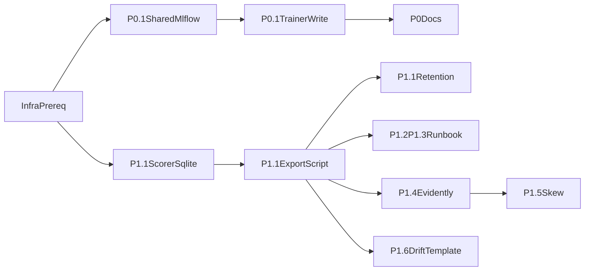

# Phase 2 P0-P1 Work Plan

> 依據：
> [doc/phase2_p0_p1_implementation_plan.md](doc/phase2_p0_p1_implementation_plan.md)
> [ssot/phase2_p0_p1_ssot.md](ssot/phase2_p0_p1_ssot.md)
>
> 本文件為 **execution-level** 工作計畫，直接對應實作順序、檔案級修改、測試、相依、rollback 與 DoD。

---

## Guardrails

- **不修改 `build/lib/**`**。如未來需要打包，應由正式 build 流程重新產出。
- **Scorer hot path 不做任何網路 I/O**，也不在記憶體中累積 5-15 分鐘資料。
- **Scorer 僅 append 到 SQLite**；export 由獨立 process 執行。
- **Prediction log 不做 per-row export update**；使用 **watermark**（例如 `last_exported_prediction_id`）追蹤匯出進度。
- **SQLite 沿用 WAL mode**，避免 scorer 寫入與 export 讀取互相阻塞。
- **MLflow artifact 由 client 直傳 GCS**，不讓 e2-micro 代理大檔。
- **Evidently 僅 manual / ad-hoc**，且明確保留 OOM 風險警告，不預先鎖死抽樣策略。

---

## External Prerequisites

以下不是 repo 內程式修改，但沒有它們，實作與驗證會卡住：

1. GCP MLflow Tracking Server 可連線。
2. GCS bucket 與 service account 權限可用。
3. 匯出程式的執行位置已決定：
   - 與 scorer 同機器跑 cron / Task Scheduler，或
   - 另一台可讀 SQLite 且可連 GCP 的機器。
4. Prediction log 儲存位置已決策：
   - 決策：**拆分獨立的 SQLite 檔案（例如 `prediction_log.db`）**。
   - 理由：Scorer 寫入預測日誌頻率極高，獨立檔案可與 `state.db` 的 API 查詢與 Validator 讀寫在 I/O 層級上實體隔離，徹底避免高頻寫入與大量 export 讀取干擾主系統。
5. 確認 export 預設格式：
   - 預設建議：**Parquet + snappy**
   - 理由：repo 已有 `pyarrow`，snappy CPU 成本較低，對 laptop 較穩；若日後頻寬壓力更大，再評估 gzip/zstd。

---

## High-Level Execution Order

---

## Ordered Tasks

### T0. Pre-flight decisions and dependency audit

- **Depends on**: none
- **Goal**: 凍結最少必要決策，避免後續返工。
- **Files**
  - [requirements.txt](requirements.txt): 確認 training / local script 依賴是否補 `mlflow`
  - [package/deploy/requirements.txt](package/deploy/requirements.txt): 若 export script 在 deploy 環境跑，補 `mlflow`
  - [deploy_dist/requirements.txt](deploy_dist/requirements.txt): 若 deploy_dist 也需要 export script，補 `mlflow`
  - [pyproject.toml](pyproject.toml): 若專案以此作為主依賴來源，也同步更新
- **Implementation notes**
  - `mlflow` 目前 repo **尚未存在**，這是新增依賴。
  - `evidently` 目前 repo **尚未存在**，但它只用於手動 DQ/drift 腳本，不必進 deploy runtime requirements，除非你決定在 deploy 機器上手動跑。
  - 明確排除 `build/lib/**`。
- **Test steps**
  1. 確認依賴檔是否一致，不出現 root 有 `mlflow`、deploy 沒有的半套狀態。
  2. 確認 `pyarrow` 已存在，可支撐 Parquet export。
- **Rollback**
  - 依賴變更尚未進 code，可直接回退 requirements / pyproject 修改。
- **Definition of done**
  - `mlflow` 的安裝邊界已定義清楚。
  - `evidently` 是否只放 root/local script 已明確。
  - 不會有人去改 `build/lib/**`。

### T1. Shared MLflow utility and provenance schema

- **Depends on**: T0
- **Goal**: 避免 trainer 與 export script 各自手寫 MLflow 邏輯。
- **Files**
  - New: `trainer/core/mlflow_utils.py`
  - New: `doc/phase2_provenance_schema.md`
  - [trainer/core/config.py](trainer/core/config.py)
- **Implementation notes**
  - 在 `trainer/core/mlflow_utils.py` 提供：
    - 讀取 `MLFLOW_TRACKING_URI`
    - safe no-op / warning only 行為
    - 建立或寫入 run/tag/artifact 的 helper
  - provenance schema 至少包含：
    - `model_version`
    - `git_commit`
    - `training_window_start`
    - `training_window_end`
    - `artifact_dir`
    - `feature_spec_path` / feature schema version
    - `training_metrics_path`
  - 不要求 trainer 在 URI 不可達時 fail。
- **Test steps**
  1. 為 utility 補 unit test：URI 未設時僅 warning，不 raise。
  2. mock MLflow client，驗證 tags / params payload 內容。
- **Rollback**
  - trainer / export script 尚未接上前，可單獨回退 utility。
- **Definition of done**
  - repo 內 MLflow 共用邏輯只有一份。
  - provenance key naming 已文檔化。

### T2. P0.1 trainer provenance write

- **Depends on**: T1
- **Goal**: 在訓練 artifact 完成後，把 provenance 寫到 GCP MLflow。
- **Files**
  - [trainer/training/trainer.py](trainer/training/trainer.py)
  - New: `tests/review_risks/test_review_risks_phase2_mlflow_trainer.py`
  - New: `tests/integration/test_phase2_trainer_mlflow.py`
- **Implementation notes**
  - 接點就在 `save_artifact_bundle(...)` 後、stale artifact cleanup 前後皆可，但要保證：
    - `model_version` 已生成
    - artifact bundle 已落地
  - 建議新增 helper 呼叫，例如 `_log_training_provenance_to_mlflow(...)`
  - 失敗策略：
    - 無 URI / 無法連線 / GCP 失敗 -> `logger.warning(...)`，訓練仍成功
  - 不做本地 fallback MLflow。
- **Test steps**
  1. 跑既有 [tests/integration/test_trainer.py](tests/integration/test_trainer.py) 確認沒回歸。
  2. 新增 mock MLflow integration test，驗證 trainer 在成功與失敗路徑都不 crash。
  3. 手動：設 `MLFLOW_TRACKING_URI` 到測試 server，執行 `run_pipeline`，確認 MLflow run 可查到 `model_version` 與 artifact path。
- **Rollback**
  - 移除 trainer 中的 helper 呼叫即可。
  - 或 unset `MLFLOW_TRACKING_URI` 暫停功能。
- **Definition of done**
  - 給定 `model_version`，能在 MLflow 找到 provenance。
  - URI 不可達時，訓練仍完成。

### T3. P0.2 rollback and provenance query docs

- **Depends on**: T2
- **Goal**: 將 P0.2「整目錄 rollback」與查詢方式文件化。
- **Files**
  - New: `doc/phase2_provenance_query_runbook.md`
  - New: `doc/phase2_model_rollback_runbook.md`
- **Implementation notes**
  - 明確寫：
    - rollback 只能替換整個 artifact directory / package
    - 禁止只換 `model.pkl`
    - 如何用 `model_version` 查 MLflow provenance
- **Test steps**
  1. 文件 review：用文件步驟實際查一次既有 / 測試 run。
  2. 文件 review：讓另一位維護者照 runbook 模擬 rollback 步驟。
- **Rollback**
  - 純文件，可直接回退。
- **Definition of done**
  - rollback 與 provenance query 均有可操作 runbook。

### T4. P1.1 scorer prediction log schema and write path

- **Depends on**: T0
- **Goal**: scorer 每次 scoring 後，將必要欄位 append 到 SQLite，不做網路 I/O。
- **Files**
  - [trainer/serving/scorer.py](trainer/serving/scorer.py)
  - [trainer/core/config.py](trainer/core/config.py)
  - New: `tests/review_risks/test_review_risks_phase2_prediction_log_schema.py`
  - New: `tests/integration/test_phase2_prediction_log_sqlite.py`
- **Implementation notes**
  - **不要**在 hot path 寫 full feature vector；只寫最小必要欄位，避免 SQLite 爆量：
    - `prediction_id INTEGER PRIMARY KEY AUTOINCREMENT`
    - `scored_at`
    - `bet_id`
    - `session_id`
    - `player_id`
    - `canonical_id`
    - `casino_player_id`
    - `table_id`
    - `model_version`
    - `score`
    - `margin`
    - `is_alert`
    - `is_rated_obs`
  - 新增 `PREDICTION_LOG_DB_PATH` (預設例如 `local_state/prediction_log.db`) 並獨立開啟連線與 WAL mode。
  - 在 `_score_df(...)` 之後、alert filter 之前或之後插入 prediction log 都可，但要清楚定義：
    - 若目標是「每筆推論」就應在 alert filter **之前**，保存全部 scored rows。
  - 以 batch insert 寫入，不逐 row execute。
- **Test steps**
  1. 跑既有 [tests/integration/test_scorer.py](tests/integration/test_scorer.py)。
  2. 新增 integration test：temp SQLite + mocked artifacts，驗證 scorer 會建立 `prediction_log` 並寫入 rows。
  3. 手動：run scorer once，直接查 SQLite row count 增加。
- **Rollback**
  - 以 config / env 關閉 prediction log。
  - 不必先 drop table；可保留空功能。
- **Definition of done**
  - scorer 可在不連 GCP 的情況下持續寫入 prediction log。
  - 寫入不影響 alerts 主流程。

### T5. P1.1 export watermark, export runner, and MLflow artifact upload

- **Depends on**: T1, T4
- **Goal**: 用獨立 process 匯出 SQLite prediction log 到 MLflow artifact。
- **Files**
  - New: `trainer/scripts/export_predictions_to_mlflow.py`
  - [trainer/serving/scorer.py](trainer/serving/scorer.py) 或同 DB schema 初始處：新增 export watermark / audit metadata
  - [trainer/core/config.py](trainer/core/config.py)
  - New: `tests/integration/test_phase2_prediction_export.py`
- **Implementation notes**
  - **關鍵修正**：不用 `exported_at` per-row update。
  - 方案：
    - 在 `meta` table 加 `prediction_export_last_id`
    - export script 每次讀：
      - `prediction_id > last_exported_id`
      - `scored_at <= now - safety_lag`
      - `ORDER BY prediction_id`
      - `LIMIT batch_rows`
    - 成功上傳後，只更新一次 watermark
  - 可選增加 `prediction_export_runs` audit table，記錄每次 export：
    - start / end time
    - min/max prediction_id
    - row_count
    - artifact path
    - success / error
  - 預設輸出格式：**Parquet + snappy**
  - 路徑建議：依 `model_version/date/hour` 分層，便於查詢與清理。
  - 失敗策略：
    - 上傳失敗 -> 不移動 watermark，不刪資料
    - 下次可重試
- **Test steps**
  1. temp SQLite 建假資料，跑 export script，驗證：
     - 只匯出 watermark 後資料
     - 成功後 watermark 前進
  2. mock MLflow/GCS 失敗，驗證 watermark 不前進、資料保留。
  3. 手動：本機 cron / once 模式跑一輪，確認 artifact 到 MLflow。
- **Rollback**
  - 停掉 export 排程。
  - scorer 仍可照常運作。
- **Definition of done**
  - export 為獨立 process。
  - 失敗不丟資料。
  - 不存在 per-row export update 的高寫入設計。

### T6. P1.1 retention and cleanup

- **Depends on**: T5
- **Goal**: 避免 prediction log 無限成長。
- **Files**
  - [trainer/scripts/export_predictions_to_mlflow.py](trainer/scripts/export_predictions_to_mlflow.py)
  - [trainer/core/config.py](trainer/core/config.py)
  - New: `tests/integration/test_phase2_prediction_retention.py`
- **Implementation notes**
  - retention cleanup 不放在 scorer hot path。
  - export 成功後由 export script 做 **bounded cleanup**：
    - 只刪 `prediction_id <= watermark`
    - 且 `scored_at < retention_cutoff`
    - 分批 delete，避免長 transaction
  - 預設 retention 天數寫進 config。
- **Test steps**
  1. 模擬舊資料 + 新資料，驗證只清理已成功匯出且超過 retention 的 rows。
  2. 驗證未匯出資料不會被清掉。
- **Rollback**
  - 關閉 cleanup，保留資料。
- **Definition of done**
  - DB size 有上界控制。
  - cleanup 不碰未匯出資料。

### T7. P1.2 / P1.3 alert conditions, runbook, message format

- **Depends on**: T4, T5
- **Goal**: 先把人要怎麼看、怎麼處理寫清楚，即使不做 Slack/email。
- **Files**
  - New: `doc/phase2_alert_runbook.md`
  - New: `doc/phase2_alert_message_format.md`
- **Implementation notes**
  - 至少覆蓋：
    - scorer / export / validator / Evidently 常見異常
    - 誰看、看哪個 DB / artifact / report
    - human-oriented message 應包含哪些欄位
- **Test steps**
  1. 文件 walkthrough：模擬 3 個情境
     - export 失敗
     - validator precision 掉落
     - drift report 異常
- **Rollback**
  - 純文件，可直接回退。
- **Definition of done**
  - 有人能依文件完成 triage。

### T8. P1.4 local Evidently report tooling

- **Depends on**: T0, T5
- **Goal**: 提供可手動執行的 DQ / drift 報告產生工具，而不只是文件。
- **Files**
  - New: `trainer/scripts/generate_evidently_report.py`
  - New: `doc/phase2_evidently_usage.md`
  - [requirements.txt](requirements.txt) 或 [pyproject.toml](pyproject.toml): 新增 `evidently`
- **Implementation notes**
  - 腳本只做 **manual / ad-hoc**。
  - 輸入建議：
    - reference profile / training snapshot
    - current data file path（由人工挑選或前置匯整）
  - 明確寫出：
    - 報告輸出到本地 `out/` 或 `doc/` 下某固定目錄
    - 可選 sync 到 GCS
    - **OOM 風險警告保留**
  - 不在本任務決定 downsampling / aggregation 實作策略。
- **Test steps**
  1. 小樣本手動跑腳本，確認能產 HTML / JSON 報告。
  2. 驗證無 Evidently 時錯誤訊息清楚。
- **Rollback**
  - 不跑此腳本即可；不影響 scorer / trainer。
- **Definition of done**
  - 至少可手動產生一份本地 Evidently 報告。
  - OOM 風險與操作方式已文件化。

### T9. P1.5 training-serving skew check tooling

- **Depends on**: T4, T8
- **Goal**: 讓 skew 驗證是可執行流程，不只停留在概念。
- **Files**
  - New: `trainer/scripts/check_training_serving_skew.py`
  - New: `doc/phase2_skew_check_runbook.md`
- **Implementation notes**
  - 先做 **one-shot / manual** 工具即可。
  - 核心輸入：
    - 一批 serving-side ids / timestamps
    - 對應 training-side feature derivation 結果
  - 輸出：
    - 不一致欄位列表
    - 摘要表
    - 可附 CSV / markdown
- **Test steps**
  1. 用小型合成資料驗證一致 / 不一致兩條路徑。
  2. 手動產一份 skew check 輸出。
- **Rollback**
  - 純 script + doc，可獨立回退。
- **Definition of done**
  - 至少能完成一次可重現的 skew 檢查。

### T10. P1.6 drift investigation template and first example report

- **Depends on**: T5, T7, T8, T9
- **Goal**: 讓 drift 調查有固定產出格式，且能落到 `doc/`。
- **Files**
  - New: `doc/drift_investigation_template.md`
  - New: `doc/phase2_drift_investigation_example.md`
- **Implementation notes**
  - 模板應包含：
    - trigger
    - timeframe
    - model_version
    - evidence used
    - hypotheses
    - checks performed
    - conclusion
    - recommended action
  - example 可用 mock / historical / dry-run 資料，不必等真實事故。
- **Test steps**
  1. 依模板實際填一份 example。
  2. 確認 runbook 中有指向此模板。
- **Rollback**
  - 純文件，可直接回退。
- **Definition of done**
  - repo 內有正式模板與至少一份 example。

---

## File-Level Edit Summary

### Existing files likely to change

- [trainer/training/trainer.py](trainer/training/trainer.py)
  - 在 `save_artifact_bundle(...)` 後接入 provenance logging。
- [trainer/serving/scorer.py](trainer/serving/scorer.py)
  - 建立獨立的 `prediction_log.db` 與對應 schema（prediction log + export metadata/audit）
  - 在 `score_once(...)` 中對獨立 DB 進行 batch append
- [trainer/core/config.py](trainer/core/config.py)
  - 新增 Phase 2 相關 env/config
- [requirements.txt](requirements.txt)
  - 新增 `mlflow`，以及 `evidently`（若 root/local script 需要）
- [package/deploy/requirements.txt](package/deploy/requirements.txt)
  - 若 export script 在 deploy 環境執行，新增 `mlflow`
- [deploy_dist/requirements.txt](deploy_dist/requirements.txt)
  - 同上，視 deploy_dist 是否要跑 export script

### New files likely to be added

- `trainer/core/mlflow_utils.py`
- `trainer/scripts/export_predictions_to_mlflow.py`
- `trainer/scripts/generate_evidently_report.py`
- `trainer/scripts/check_training_serving_skew.py`
- `doc/phase2_provenance_schema.md`
- `doc/phase2_provenance_query_runbook.md`
- `doc/phase2_model_rollback_runbook.md`
- `doc/phase2_alert_runbook.md`
- `doc/phase2_alert_message_format.md`
- `doc/phase2_evidently_usage.md`
- `doc/phase2_skew_check_runbook.md`
- `doc/drift_investigation_template.md`
- `doc/phase2_drift_investigation_example.md`
- new tests under `tests/integration/` and `tests/review_risks/`

---

## Test Plan

### Existing tests to rerun

- [tests/integration/test_trainer.py](tests/integration/test_trainer.py)
- [tests/integration/test_scorer.py](tests/integration/test_scorer.py)
- [tests/integration/test_validator_datetime_naive_hk.py](tests/integration/test_validator_datetime_naive_hk.py)
- relevant `tests/review_risks/**` touching trainer / scorer / validator

### New automated tests to add

- trainer provenance logging:
  - mock MLflow success path
  - missing URI / connection failure path
- scorer prediction log:
  - schema creation
  - append all scored rows, not only alerts
  - WAL-compatible read/write assumptions
- export script:
  - watermark progression
  - failure leaves watermark unchanged
  - retention cleanup only touches exported old rows
- Evidently / skew scripts:
  - small fixture happy-path smoke tests

### Manual validation

1. Run trainer with `MLFLOW_TRACKING_URI` unset -> training succeeds, warning only.
2. Run trainer with reachable test tracking URI -> provenance visible in MLflow.
3. Run scorer once -> `prediction_log` row count increases.
4. Run export script with GCP unavailable -> no crash, watermark unchanged, rows remain.
5. Re-run export script with GCP available -> artifact uploaded, watermark advances.
6. Run validator unchanged -> existing behavior preserved.
7. Produce one local Evidently report and one skew-check output.

---

## Rollback Notes

### P0.1 trainer provenance

- Remove trainer helper call, or unset `MLFLOW_TRACKING_URI`.
- No artifact format rollback required if provenance is metadata-only.

### P1.1 scorer prediction log

- Disable via config / env flag.
- Keep SQLite table in place if rollback needs to be low-risk.

### P1.1 export

- Stop cron / scheduled task.
- Leave SQLite data untouched for later retry.

### P1.4-P1.6 scripts/docs

- Independent rollback; no impact on trainer / scorer runtime path.

---

## Phase-Level Definition of Done

### P0 done

- Given a `model_version`, provenance can be found from MLflow (GCP).
- Rollback procedure is documented as whole-artifact only.

### P1.1 done

- scorer appends every scored row to local SQLite without network I/O.
- export runs in a separate process and uploads compressed artifacts to MLflow/GCS.
- export progress uses watermark, not per-row updates.
- GCP outage does not lose prediction rows.
- retention cleanup exists and does not delete unexported rows.

### P1.2-P1.6 done

- alert runbook and alert message format are documented.
- at least one manual Evidently report can be generated locally.
- at least one skew-check run can be performed.
- drift investigation template and one example report exist in `doc/`.

---

## Open Decisions Kept Explicit

這些仍需在實作前或實作中定案，但不阻止本 work plan 開始執行：

1. export batch size、safety lag、retention 天數。
2. export artifact 路徑命名規則。
3. Evidently current data 的前置整理方式。
4. 是否需要 `prediction_export_runs` audit table；本計畫建議加，但若想先簡化，可先只做 `meta` watermark。

