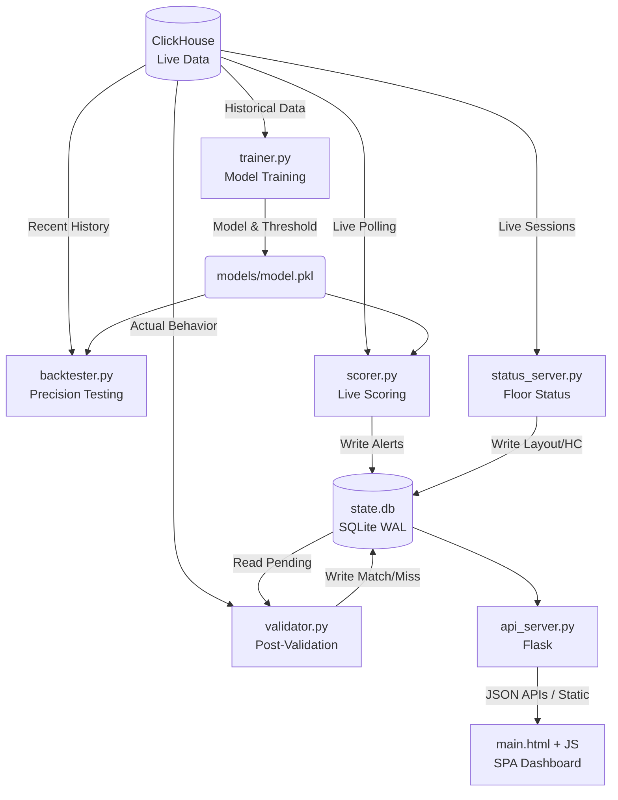

# Patron Walkaway Predictor - System Summary

## Overview
The `trainer/` directory contains a real-time prediction and monitoring system for casino baccarat table games. Its primary goal is to forecast patron "walkaway" (churn) likelihood within the next 15 minutes, validate these predictions against actual behavior, and present the data on a live operator dashboard.

## System Architecture & Data Flow

## Core Modules (Backend)

* **`config.py` & `db_conn.py`**
  Centralized configuration and ClickHouse database connection pool. Contains overriding settings (HK timezone, polling intervals, DB credentials). 
  *⚠️ Security Note: Credentials currently reside in plaintext and require secrets management for production.*
* **`trainer.py` (Model Training)**
  Pulls historical bets and sessions, engineers features (caching them locally in CSVs to reduce DB load), and trains a LightGBM model. Focuses on maximizing precision. 
  *⚠️ Architecture Note: Must ensure data splitting strictly respects time-series boundaries (avoiding random splits) to prevent future leaking.*
* **`backtester.py` (Evaluation)**
  Evaluates the trained model against a designated historical time window to calculate actual precision and true alert counts without impacting live operations.
* **`scorer.py` (Live Inference Engine)**
  Periodically polls new data, scores active players using the model, and generates alerts for those exceeding the threshold. Aims to limit alerts to 1 per visit. State is flushed to a centralized SQLite database.
* **`validator.py` (Ground Truth Checker)**
  An asynchronous service that evaluates "Pending" alerts older than the forecast horizon (e.g., 45 mins). Queries actual DB behavior to determine if a 30-minute gap occurred, updating the alert status to "MATCH" or "MISS".
* **`status_server.py` (Floor State)**
  Maintains the real-time physical floor status (table/seat occupancy) and aggregates historical headcounts (tables vs. seats). Writes JSON snapshots to the shared SQLite DB.
* **`api_server.py` (Web API)**
  Flask-based web server serving the frontend static files and exposing REST endpoints (`/get_floor_status`, `/get_alerts`, `/get_validation`, `/get_hc_history`). Implements robust fallback paths (e.g., reading from legacy CSV buffers or sample data if the DB snapshot is unavailable).

## Frontend Dashboard (`frontend/`)

A single-page application (`main.html`, CSS, modular JS) providing a live operator dashboard.
* **Map Panel (`map.js`)**: Visual representation of the floor. Highlights occupied seats and flashes red/amber for pending high-value alerts. Includes a context menu for issuing rewards (comps).
* **Alerts List (`alerts.js`)**: Real-time, sortable, filterable list of alerts grouped by bet size and status.
* **Validation & Trends (`trends.js`, `hc.js`)**: Cumulative accuracy charts and real-time floor occupancy/momentum trends using Chart.js.
* **Refresh Cycle**: Operates on a standard 45-second polling interval matched to the backend servers, with background reconciliation for stale "Pending" states.

## Key Design Principles & Findings
1. **Centralized State Hub**: The local `state.db` (SQLite in WAL mode) acts as the primary data exchange layer between independent microservices (Scorer, Validator, Status Server) and the API. This decouples the microservices effectively.
2. **Asynchronous Validation**: Alert generation and validation are separated, allowing real-time processing without waiting for definitive outcomes.
3. **Resiliency over Perfection**: The API prioritizes returning data over failing, utilizing legacy flat files (`sessions_buffer.csv`, `table_status.json`) or static sample data as fallbacks if the primary DB pipeline experiences delays.

---

# Patron Walkaway Predictor - 系統摘要 (繁體中文版)

## 系統概述
`trainer/` 目錄包含一個針對賭場百家樂桌檯遊戲的即時預測與監控系統。其主要目標是預測玩家在未來 15 分鐘內「離場 (walkaway / churn)」的可能性，並將這些預測與實際行為進行驗證，最終將資料呈現在即時的營運儀表板上。

## 系統架構與資料流

*(請參考上方英文版的 Mermaid 流程圖)*

## 核心模組 - 後端

* **`config.py` & `db_conn.py`**
  集中式配置與 ClickHouse 資料庫連線池。包含全域設定（如香港時區、輪詢間隔、資料庫憑證）。
  *⚠️ 安全提示：目前憑證以明碼存放，在正式營運環境中需要實作機密管理 (secrets management)。*
* **`trainer.py` (模型訓練)**
  提取歷史投注與會話 (session) 資料，進行特徵工程（將其快取在本地 CSV 以減輕資料庫負載），並訓練 LightGBM 模型。主要著重於最大化預測的精準度 (precision)。
  *⚠️ 架構提示：必須確保資料切割嚴格遵守時間序列邊界（避免隨機切割），以防止未來數據洩露 (future leaking)。*
* **`backtester.py` (模型評估)**
  在指定的歷史時間窗內評估已訓練的模型，計算實際精準度與真實警報數量，且不會影響即時營運服務。
* **`scorer.py` (即時推論引擎)**
  定期輪詢新資料，使用模型對活躍玩家進行評分，並為超過閾值的玩家產生警報。系統目標是限制每個訪問 (visit) 週期內最多只發出 1 個警報。系統狀態會被集中寫入到 SQLite 資料庫中。
* **`validator.py` (真實行為驗證)**
  這是一個非同步服務，負責評估超過預測時間窗（例如 45 分鐘前）的「待處理 (Pending)」警報。它會透過查詢資料庫中的實際玩家行為來判斷是否發生了 30 分鐘的間斷 (gap)，並將警報狀態更新為「命中 (MATCH)」或「未命中 (MISS)」。
* **`status_server.py` (樓層狀態)**
  負責維護即時的實體樓層狀態（桌檯/座位佔用情況），並彙整歷史人數統計（桌數 vs. 座位數）。會定期將 JSON 格式的快照寫入共享的 SQLite 資料庫。
* **`api_server.py` (Web API)**
  基於 Flask 的網頁伺服器，負責提供前端靜態檔案並提供對外的 REST API 端點 (`/get_floor_status`, `/get_alerts`, `/get_validation`, `/get_hc_history`)。實作了強健的降級與容錯路徑（例如：若資料庫快照無法使用，會退回讀取舊版 CSV 緩衝區或靜態樣本資料）。

## 前端儀表板 (`frontend/`)

這是一個單頁應用程式 (SPA，包含 `main.html`, CSS, 模組化 JS)，提供即時的營運監控介面。
* **地圖面板 (`map.js`)**：賭場樓層的視覺化呈現。高亮顯示被佔用的座位，並透過紅色或琥珀色閃爍來標示有待處理高額投注警報的桌檯。包含一個可操作發放獎勵 (comps) 的右鍵選單。
* **警報列表 (`alerts.js`)**：即時、可排序且可篩選的警報列表，使用者可根據投注大小和狀態進行過濾檢視。
* **驗證與趨勢 (`trends.js`, `hc.js`)**：使用 Chart.js 繪製累計預測準確率圖表，以及即時的樓層佔用率與動能 (momentum) 趨勢變化。
* **刷新週期**：以標準的 45 秒輪詢間隔運作（與後端伺服器節奏一致），並具備背景機制來處理與對帳過期的「待處理 (Pending)」狀態。

## 關鍵設計原則與發現
1. **集中式的狀態中樞**：本地的 `state.db`（採用 WAL 模式的 SQLite）作為獨立微服務（Scorer, Validator, Status Server）與 API 之間的主要資料交換層。這種設計有效地解耦了各個微服務。
2. **非同步驗證機制**：警報的產生與結果驗證是分離的，這允許系統持續進行即時預測處理，而不需要等待明確的最終結果。
3. **韌性優於完美 (Resiliency over Perfection)**：API 設計上將「能回傳資料」的優先級置於「完美無誤」之上。如果主要資料庫管道發生延遲或故障，API 會自動退回利用舊有的純文字檔 (`sessions_buffer.csv`, `table_status.json`) 或靜態樣本資料來應對，避免前端介面崩潰。