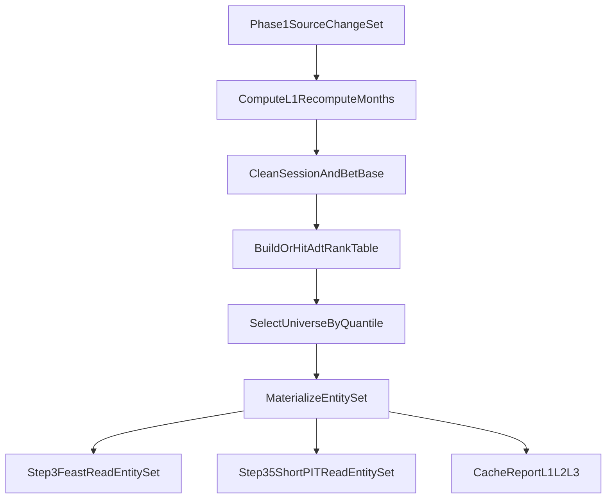

# trainer_hightier - Cache Redesign Working Plan (Phase 2)

本文件屬於 **Working / execution plan** 層，承接：

- [Cache Redesign - SSOT.md](./Cache%20Redesign%20-%20SSOT.md)
- [Cache Redesign - IMPLEMENTATION_PLAN.md](./Cache%20Redesign%20-%20IMPLEMENTATION_PLAN.md)
- [Cache Redesign - WORKING_PLAN.md](./Cache%20Redesign%20-%20WORKING_PLAN.md)（Phase 1 已完成）

本文件只拆 **Phase 2：Cleaned Source And Entity Set Boundary**。Phase 3+ 僅保留摘要與 non-goals。

## 0) Phase 2 Objective

在 Phase 1 `source_change_set` 穩定後，重劃 L1–L3 cache 邊界，使：

1. **L0 cleaned bet/session** 不再綁定 ADT quantile（quantile 變不觸發 L0 重算）。
2. **L2 ADT rank table** 成為 rated universe 的 SSOT（canonical-level rank + player projection）。
3. **L3 entity set** 成為 Step 3 / Step 3.5 / labels join 的共同輸入。
4. **替換** 現有 `cleaned__gmwds_t_bet` ADT-segment preprocess 路徑（D-011）；不維持長期雙軌。

**Milestone（Implementation Plan §12）：** quantile 變更不再 rerun L0 cleaning。

## 1) Decisions Locked (Phase 2)

| ID | 決策 | 備註 |
|----|------|------|
| P2-D-001 | L1 cleaned cache key 改用 `source_manifest_v2` per-partition fingerprint，不再用 inventory `mtime`。 | 與 Phase 1 `changed_partitions` 對齊；inventory fingerprint 逐步 deprecated。 |
| P2-D-002 | Bet L0 只產 **base cleaned**（全玩家、data scope 內）；ADT filter 移出 preprocess SQL。 | 沿用 `cleaned__gmwds_t_bet_base`；segment 路徑改由 entity set 取代。 |
| P2-D-003 | ADT rank table 為 canonical-level；`adt_percentile` 由 rank 衍生，quantile 為 filter。 | 沿用 `patron_profile_csv` + `canonical_mapping_parquet` + slow coverage 語意。 |
| P2-D-004 | Selected universe manifest 只記 quantile + rank table fingerprint + counts。 | 不進 L1 cache key。 |
| P2-D-005 | Entity set grain：`bet_id` × training scope × selected quantile policy hash。 | 含 `source_partition_yyyymm`；供 downstream month invalidation。 |
| P2-D-006 | `partition_recompute_months` 收斂為 `source_change_set.changed_partitions` ∪ correction/backfill。 | 單一「哪些月份要重算」語意；inventory mtime diff 退役。 |
| P2-D-007 | **`use_entity_set_v1=True` 為預設**；legacy 僅 `--use-legacy-bet-segment`。 | Entity set 按月 partition；sidecar 退役不保留過渡。 |
| P2-D-008 | Entity set / universe cache 寫入採 staging → validate → atomic rename（D-013）。 | 對齊 Phase 1 atomic JSON 模式。 |

## 2) Work Breakdown

| ID | Task | Primary files | DoD |
|----|------|---------------|-----|
| P2-WP-1 | Source-changed months → L1 invalidation helper | 新模組 `trainer_hightier/utils/cache_invalidation_v1.py` | 輸入 `source_change_set` + correction/backfill → `l1_recompute_months`；單元測試覆蓋單檔修改只標一月 |
| P2-WP-2 | L1 cleaned cache manifest v2（session + bet base） | `session_l0_preprocess.py`, `bet_l0_preprocess.py`, `cache_invalidation_v1.py` | Cache key 含：source partition content fp、cleaning code hash、L0 data scope；**不含** quantile / allowlist |
| P2-WP-3 | ADT rank table builder + cache | 新模組 `trainer_hightier/utils/universe_cache_v1.py`；擴充 `patron_session_metrics.py` | 產出 `artifacts/cache/universe_v1/adt_rank_latest/.../data.parquet` + sidecar manifest；欄位符合 SSOT §4.2 |
| P2-WP-4 | Selected universe manifest | `universe_cache_v1.py` | `selected_universe_<qslug>_<rank_fp>.json`；filter `adt_percentile >= q AND has_slow_window_coverage` |
| P2-WP-5 | Entity set materializer + cache | 新模組 `trainer_hightier/utils/entity_set_v1.py` | Join cleaned bet **base** × mapping × selected universe；按月 shard 或 Hive partition；manifest 含 universe + scope + source month fps |
| P2-WP-6 | Trainer orchestration | `trainer.py`, `config.py` | `prepare_training_frame`：base bet clean → rank table → entity set；metrics 寫入 `entity_set_*` / `universe_*`；`--use-legacy-bet-segment` 暫留 fallback |
| P2-WP-7 | Step 3 / 3.5 read path cutover | `03_build_training_data.py`, `feature_experiment/short_term_pit_cache.py`, `feast_repo/definitions.py`（若需） | 讀 entity set 取代 ADT-segmented `cleaned__gmwds_t_bet`；row count / universe 與 cutover 前一致（golden compare） |
| P2-WP-8 | Retire bet segment cache path | `bet_l0_preprocess.py`, `trainer.py` | 移除 `adt_segment` 自 bet clean cache record；`cleaned__gmwds_t_bet` 改為 entity set 輸出或 symlink 文件說明；更新 `test_bet_preprocess.py` |
| P2-WP-9 | Converge `partition_recompute_months` | `partition_inventory.py`, `trainer.py` | 以 `source_change_set.changed_partitions` 為主；inventory 僅保留 diagnostic |
| P2-WP-10 | Unit + integration tests | `tests/test_universe_cache_v1.py`, `tests/test_entity_set_v1.py`, `tests/test_cache_invalidation_v1.py` | T-1～T-8（見 §5） |
| P2-WP-11 | RUNBOOK + cache report 擴充 | `RUNBOOK.md`, `source_manifest_v2.py` 或 `cache_report` builder | 文件化 L2/L3 路徑、quantile 變更行為、legacy fallback 開關 |

### P2-WP-3 Detail: ADT rank table manifest

```json
{
  "schema_version": 1,
  "kind": "adt_rank_latest_v1",
  "profile_snapshot_sha256": "...",
  "mapping_sha256": "...",
  "slow_anchor_required": "2026-05-31",
  "canonical_count": 12345,
  "player_projection_count": 23456,
  "rank_table_path": "artifacts/cache/universe_v1/adt_rank_latest/profile=.../data.parquet"
}
```

### P2-WP-5 Detail: Entity set manifest (excerpt)

```json
{
  "schema_version": 1,
  "kind": "training_entity_set_v1",
  "selected_quantile": 0.99,
  "universe_fingerprint": "...",
  "training_scope_fingerprint": "...",
  "source_partition_fps": {"202606": "..."},
  "entity_months": ["202501", "202502"],
  "row_count": 987654,
  "data_path": "artifacts/cache/entity_set_v1/quantile=0p99/scope=.../data.parquet"
}
```

### P2-WP-6 Detail: Metrics keys

- `universe_adt_rank_cache_hit`
- `universe_adt_rank_elapsed_seconds`
- `selected_universe_canonical_count` / `selected_universe_player_count`
- `entity_set_cache_hit`
- `entity_set_elapsed_seconds`
- `entity_set_row_count`
- `l1_recompute_months`（收斂後的月份列表）
- `bet_segment_legacy_fallback_used`（cutover 期診斷）

## 3) Artifact Paths

```text
trainer_hightier/artifacts/cache/
  universe_v1/
    adt_rank_latest/profile=<sha>/mapping=<sha>/slow_anchor=<date>/
      data.parquet
      manifest.json
    selected_universe/
      selected_universe_q0p99_<rank_fp>.json
  entity_set_v1/
    quantile=<qslug>/scope=<scope_fp>/
      manifest.json
      partitions/yyyymm=YYYYMM/data.parquet   # 或單檔 MVP
  cleaned_source_v2/                        # 可選：L1 sidecar 集中目錄
  reports/
    cache_report_<run_id>.json               # 擴充 L1/L2/L3 layers
```

既有路徑過渡：

- `artifacts/cleaned/cleaned__gmwds_t_bet_base` → L1 base（保留）
- `artifacts/cleaned/cleaned__gmwds_t_bet` → Phase 2 結束後由 entity set 取代或指向相容 view

## 4) Flow (Phase 2)



## 5) Validation Plan

### Unit tests (P2-WP-10)

| Case | Setup | Expected |
|------|-------|----------|
| P2-T-1 | quantile 0.95 → 0.99（rank table 不變） | L1 base cache hit；entity set miss；L0 cleaning 不 rerun |
| P2-T-2 | quantile 0.99 → 0.95（rank table 不變） | entity set miss；**不** rerun bet base clean；entity rows 為 superset |
| P2-T-3 | profile CSV 內容變更 | rank table miss；entity set miss；L1 base 仍可 hit（若 source 不變） |
| P2-T-4 | `source_change_set` 標記單月 modified | L1 只 invalid 該月；entity set 只重算受影響月份 |
| P2-T-5 | entity set row count vs legacy segment path | 與 cutover 前 `cleaned__gmwds_t_bet` join 結果一致（允許欄位超集） |
| P2-T-6 | corrupt universe manifest | fail-fast |
| P2-T-7 | `partition_recompute_months` 與 `changed_partitions` 一致 | 收斂後單一月份列表 |
| P2-T-8 | `--use-legacy-bet-segment` | 走舊路徑；metrics 標記 fallback |

### Integration checks (manual / smoke)

- [ ] quantile-only 變更：bet base preprocess cache hit（log + sidecar）
- [ ] Step 3 training row count 與 Phase 2 前同 quantile 一致
- [ ] `run_report.json` 含 L2/L3 cache hit/miss
- [ ] `source_change_set` 單月修改 → entity set 僅該月出現在 recompute list

## 6) Definition of Done (Phase 2)

Phase 2 完成當且僅當：

1. P2-T-1～P2-T-8 測試全綠。
2. quantile 變更不觸發 bet base / session L1 重算（source 不變時）。
3. Step 3 / 3.5 預設讀 entity set；training universe row count 與 legacy 路徑一致。
4. `partition_recompute_months` 已收斂至 source content diff（+ explicit correction/backfill）。
5. `adt_segment` 已自 bet L1 cache fingerprint 移除；RUNBOOK 已更新。
6. Legacy fallback 可關閉且 production smoke 通過。

## 7) Explicit Non-Goals (Phase 2)

本輪 **不做**：

- Label cache（L4）與 canonical shard invalidation（Phase 3）。
- Feature primitive cache / quantile delta fill（Phase 3）。
- Assembly cache（Phase 4）。
- Serving runtime 改讀 entity set（僅 training path）。
- Footer fast fingerprint / SQLite catalog。
- 移除 `partition_inventory` 檔案（可保留 diagnostic；語意收斂即可）。

## 8) Risks And Mitigations

| Risk | Mitigation |
|------|------------|
| Entity set 與 legacy segment row 不一致 | P2-T-5 golden compare；cutover flag |
| Base bet 體積大於 segment，Step 3 IO 增加 | Entity set 按月 materialize；Step 3 只讀 entity set parquet |
| Rank table 與現有 `adt_allowed_players_parquet` 語意漂移 | 並行產出兩者比對 canonical/player count；過渡期雙寫 |
| Step 3.5 short PIT cache key 需重設 | 新 fingerprint 含 `entity_set_fingerprint`；舊 cache 自然 miss |
| 雙軌維護成本 | P2-WP-8 明確移除 segment cache；fallback 有到期日 |

## 9) Suggested PR Sequence

1. **PR-1**: P2-WP-1 + P2-WP-9 + tests（invalidation helper + recompute 收斂）
2. **PR-2**: P2-WP-2 + P2-WP-3 + P2-WP-4 + tests（L1 v2 keys + universe layer）
3. **PR-3**: P2-WP-5 + P2-WP-6 + tests（entity set + trainer orchestration，parallel build only）
4. **PR-4**: P2-WP-7 + P2-T-5 golden compare（Step 3/3.5 cutover，flag 預設 off）
5. **PR-5**: P2-WP-8 + flag 預設 on + P2-WP-11（移除 legacy segment 依賴）

## 10) Future Phases (Summary)

| Phase | Theme | Prerequisite |
|-------|-------|--------------|
| Phase 3 | Labels + feature primitive + quantile delta fill | Phase 2 entity set stable |
| Phase 4 | Assembly cache + full cache_report | Phase 3 primitives |
| Phase 5 | Retention、compact、移除舊 cache path | Phase 4 production stable |

## 11) Decisions Locked (Product / 2026-06-06)

| 項目 | 決策 |
|------|------|
| Entity set 儲存粒度 | **按月 partition**（`entity_set_v1/.../partitions/yyyymm=YYYYMM/`） |
| Cutover flag | **`use_entity_set_v1=True` 為預設**；legacy 用 CLI `--use-legacy-bet-segment` |
| `cleaned__gmwds_t_bet` sidecar | **P2-WP-8 完成時立即退役**（不保留只讀過渡） |

## 12) Implementation Status

| ID | 狀態 | 備註 |
|----|------|------|
| P2-WP-1 | ✅ 完成 | `cache_invalidation_v1.py`；`partition_recompute_months` 由 source manifest v2 驅動 |
| P2-WP-2 | ✅ 完成 | L1 session/bet **base** cache 改用 `source_manifest_v2_fingerprint_sha256_hex` |
| P2-WP-3 | ✅ 完成 | `universe_cache_v1.py` ADT rank table + selected universe manifest |
| P2-WP-4 | ✅ 完成 | `write_selected_universe_manifest`（含於 universe 模組） |
| P2-WP-5～P2-WP-11 | 待辦 | entity set、Step 3 cutover、segment 退役 |
