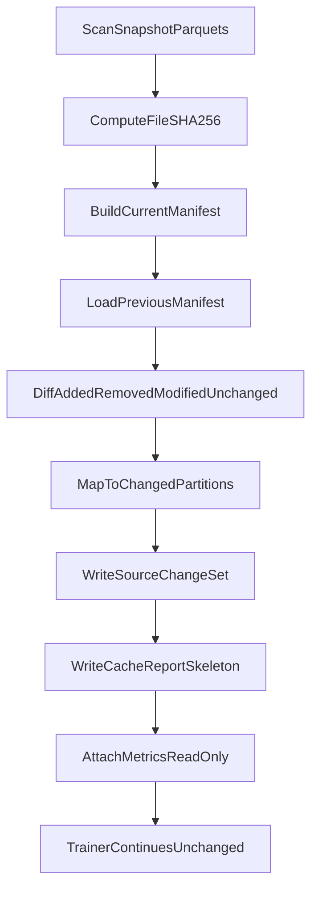

# trainer_hightier - Cache Redesign Working Plan

本文件屬於 **Working / execution plan** 層，承接：

- [Cache Redesign - SSOT.md](./Cache%20Redesign%20-%20SSOT.md)
- [Cache Redesign - IMPLEMENTATION_PLAN.md](./Cache%20Redesign%20-%20IMPLEMENTATION_PLAN.md)

本文件只拆 **Phase 1：Source Identity Foundation**。Phase 2+ 僅保留摘要與 non-goals，不在本輪展開 ticket 級任務。

## 0) Phase 1 Objective

建立 content-addressed source identity foundation，使訓練管線能：

1. 在 source folder 整包覆寫但 bytes 不變時，判定為 unchanged。
2. 在單一 historical parquet 被修改時，只標記該 file / partition changed。
3. 輸出可觀測的 `source_change_set.json` 與 `cache_report.json` skeleton。
4. **不改** Step 3 / Step 3.5 / labels / entity set / cleaned bet segment 的現有訓練行為。

Phase 1 產物是觀測與未來 invalidation 的輸入，不立即驅動 downstream cache miss。

## 1) Decisions Locked (Phase 1)

| ID | 決策 | 備註 |
|----|------|------|
| WP-D-001 | Source correctness key 使用 `sha256_file_bytes_v1`。 | `mtime_ns` 僅診斷欄位。 |
| WP-D-002 | Manifest grain 為 `table + relative_path + partition_yyyymm`。 | 支援 legacy monthly parquet 與 table-dir layout。 |
| WP-D-003 | Diff 分類：`added` / `removed` / `modified` / `unchanged`。 | 以 `file_sha256` 比對，不以 path 存在與否單獨判定 modified。 |
| WP-D-004 | 無法映射 partition month 的 parquet → fail-fast。 | 除非明確標記為 non-training source（Phase 1 不實作例外清單）。 |
| WP-D-005 | Phase 1 不驅動現有 preprocess / Feast / short PIT cache miss。 | 只寫報表與 metrics，行為不變。 |
| WP-D-006 | 沿用現有 `partition_inventory` scan 作為檔案列舉入口。 | 新 manifest 在其上補 content hash，不重寫掃描邏輯。 |
| WP-D-007 | Cache report 先 JSON list，不引入 SQLite catalog。 | 符合 SSOT MVP 假設。 |

## 2) Work Breakdown

| ID | Task | Primary files | DoD |
|----|------|---------------|-----|
| WP-1 | Source file record + SHA helper | 新模組 `trainer_hightier/utils/source_manifest_v2.py`（或擴充 `partition_inventory.py`） | 單檔可產出 `file_sha256`、`schema_sha256`、`num_rows`、`row_group_count`；`mtime_ns` 不參與 hit 判斷 |
| WP-2 | Build current source manifest | `source_manifest_v2.py`, `partition_inventory.py` | 掃描 `t_bet` / `t_session` 下所有 parquet；輸出 `source_manifest_v2/current.json` |
| WP-3 | Load previous manifest + diff | `source_manifest_v2.py` | 產出 `added` / `removed` / `modified` / `unchanged`；modified = same relative_path, different `file_sha256` |
| WP-4 | Map changed files → partitions | `source_manifest_v2.py`, `partition_inventory.py` | 輸出 `changed_partitions: {t_bet: [...], t_session: [...]}`；單檔修改只影響其所屬 `YYYYMM` |
| WP-5 | Emit `source_change_set.json` | `source_manifest_v2.py` | Atomic write；含 `schema_version`、`hash_algorithm`、`snapshot_dir`、`diff_summary`、`changed_files`、`changed_partitions` |
| WP-6 | Cache report skeleton | 新模組或 `source_manifest_v2.py` | 寫入 `artifacts/cache/reports/cache_report_<run_id>.json`；至少含 layer、hit/miss、reason、elapsed、hashed_bytes |
| WP-7 | Trainer read-only integration | `trainer.py` | 在 `prepare_training_frame` 早期呼叫 WP-1–WP-6；結果寫入 `metrics` / `run_report.json` 的 `pipeline_debug.source_manifest_v2`；**不**改 preprocess 分支 |
| WP-8 | Unit tests | `trainer_hightier/tests/test_source_manifest_v2.py` | 覆蓋 overwrite-same-bytes、single-file-modified、added/removed、unmappable partition fail-fast |
| WP-9 | RUNBOOK 補充 | `trainer_hightier/RUNBOOK.md` | 說明 Phase 1 產物路徑、如何解讀 `source_change_set.json`、與現有 `partition_recompute_months` 的關係 |

### WP-1 Detail: Per-file record schema

```json
{
  "schema_version": 2,
  "hash_algorithm": "sha256_file_bytes_v1",
  "table": "t_bet",
  "relative_path": "t_bet/partition_202606/part_000001.parquet",
  "partition_yyyymm": "202606",
  "size_bytes": 123,
  "num_rows": 456,
  "row_group_count": 3,
  "schema_sha256": "...",
  "file_sha256": "...",
  "mtime_ns_diagnostic": 0
}
```

### WP-5 Detail: `source_change_set.json` shape

```json
{
  "schema_version": 1,
  "snapshot_dir": "...",
  "layout_kind": "table_partition_shards",
  "hash_algorithm": "sha256_file_bytes_v1",
  "diff_summary": {
    "added": 0,
    "removed": 0,
    "modified": 1,
    "unchanged": 42
  },
  "changed_files": [
    {
      "table": "t_bet",
      "relative_path": "t_bet/partition_202503/part_000007.parquet",
      "partition_yyyymm": "202503",
      "change_kind": "modified"
    }
  ],
  "changed_partitions": {
    "t_bet": ["202503"],
    "t_session": []
  },
  "hash_elapsed_seconds": 12.34,
  "hashed_bytes": 5368709120
}
```

### WP-7 Detail: Metrics keys (read-only)

建議寫入 `metrics` / `run_report.json`：

- `source_manifest_v2_elapsed_seconds`
- `source_manifest_v2_hashed_bytes`
- `source_manifest_v2_diff_summary`
- `source_manifest_v2_changed_partitions`
- `source_manifest_v2_change_set_path`

**不**在 Phase 1 將 `changed_partitions` 覆寫現有 `partition_recompute_months` 語意；兩者並存，待 Phase 2 再收斂。

## 3) Artifact Paths

```text
trainer_hightier/artifacts/cache/
  source_manifest_v2/
    current.json
    previous.json          # optional: last published snapshot
  source_change_sets/
    source_change_set_<snapshot_id>_<utc>.json
  reports/
    cache_report_<run_id>.json
```

`current.json` 在每次成功 scan 後 atomic publish；`previous.json` 為上一版 published manifest，供 diff 使用。

## 4) Flow (Phase 1)



## 5) Validation Plan

### Unit tests (WP-8)

| Case | Setup | Expected |
|------|-------|----------|
| T-1 | 兩次 scan 相同 bytes，不同 `mtime` | `modified=0`, `unchanged=N` |
| T-2 | 修改一個 historical file 的內容 | 僅該 `relative_path` 在 `modified`；`changed_partitions` 僅含該 `YYYYMM` |
| T-3 | 新增 partition 檔 | `added=1`；對應 partition 在 `changed_partitions` |
| T-4 | 刪除 partition 檔 | `removed=1`；對應 partition 在 `changed_partitions` |
| T-5 | parquet 無法映射 `partition_yyyymm` | fail-fast with explicit error |
| T-6 | corrupt / missing previous manifest | 視為 first run：`modified` 為全部 current files 或 empty previous 策略（需在實作時固定一種並測試） |

### Integration checks (manual / smoke)

- [ ] 跑一次 `python -m trainer_hightier.trainer`（或最小 `prepare_training_frame` path）後，`source_change_set.json` 與 `cache_report_*.json` 存在。
- [ ] `run_report.json` 含 `source_manifest_v2_*` metrics。
- [ ] 訓練 row count、Step 3 行為與 Phase 1 前一致（無語意變更）。
- [ ] 記錄 `hash_elapsed_seconds` 與 `hashed_bytes`，供 Phase 2 前評估 full SHA 成本。

## 6) Definition of Done (Phase 1)

Phase 1 完成當且僅當：

1. `test_source_manifest_v2.py` 全綠。
2. Folder overwrite + identical bytes → diff 報告 `unchanged` 為主，無全量 `modified`。
3. 單一 historical file 修改 → `changed_partitions` 僅含該月。
4. Trainer 產出 `source_change_set.json` 與 `cache_report_*.json` skeleton。
5. **未**改變 Step 3 / Step 3.5 / labels / training_set row 語意。
6. RUNBOOK 已說明 Phase 1 產物與限制。

## 7) Explicit Non-Goals (Phase 1)

本輪 **不做**：

- 替換 cleaned bet segment 或移除 `adt_filter_quantile` preprocess 路徑。
- ADT rank table / selected universe / entity set cache。
- Quantile delta fill。
- Label cache 或 label invalidation 實作。
- Feature primitive cache 或 assembly cache。
- 用 `source_change_set` 驅動 Feast / short PIT / mid-term cache miss。
- Footer fast fingerprint 優化（留待 Phase 1 實測後再決定）。
- SQLite cache catalog。

## 8) Rollback And Safety

- Phase 1 為 additive：新 manifest / report 可隨時停用（feature flag 或 guard），trainer 行為回到現狀。
- Source identity uncertain（hash 失敗、schema 讀取失敗、partition 映射失敗）→ **fail-fast**，不 silent reuse。
- Manifest / change set 寫入採 staging → validate → atomic rename（對齊 SSOT D-013）。
- 若 Phase 1 實測 full SHA 過慢，**不**降級 correctness；改以實測數據更新 SSOT / implementation plan 再決定是否加 footer shortcut。

## 9) Risks And Mitigations (Phase 1)

| Risk | Mitigation |
|------|------------|
| Full SHA 在大型 source 上耗時數分鐘 | 記錄 `hash_elapsed_seconds` / `hashed_bytes`；與 Feast/Step 3.5 成本對比後再優化 |
| 與現有 `partition_inventory` 的 `recompute_months` 重疊 | Phase 1 並存兩套輸出，文件與 metrics 標註差異；Phase 2 收斂 |
| Table-dir vs legacy layout 路徑不一致 | 統一 `relative_path` 規則；測試兩種 layout |
| 工作樹已有 pending cache/table-dir 改動 | Phase 1 PR 盡量獨立模組 + tests，減少與未合併改動衝突 |

## 10) Future Phases (Summary Only)

| Phase | Theme | Prerequisite |
|-------|-------|--------------|
| Phase 2 | Entity set + ADT rank；替換 cleaned bet segment | Phase 1 stable diff + report |
| Phase 3 | Labels + feature primitive cache + quantile delta fill | Phase 2 entity set |
| Phase 4 | Assembly cache + full cache_report + validation hooks | Phase 3 primitives |
| Phase 5 | Retention、compact、移除舊 cache path | Phase 4 stable in production runs |

Phase 2+ 的 ticket 級拆解應在 Phase 1 DoD 達成後另開 working plan 增補或新文件。

## 11) Suggested PR Sequence

1. **PR-1**: WP-1–WP-5 + WP-8（core manifest + diff + tests，無 trainer 接線）。
2. **PR-2**: WP-6–WP-7 + WP-9（report + metrics + RUNBOOK）。
3. **PR-3** (optional): 一次 smoke run 記錄 hash 時間與 changed-month 準確性，更新 SSOT open questions。

## 12) Acceptance Checklist

- [x] `source_manifest_v2` 模組與 tests 存在
- [x] Identical-bytes overwrite → unchanged diff
- [x] Single historical file edit → single partition in `changed_partitions`
- [x] `source_change_set.json` atomic write
- [x] `cache_report_<run_id>.json` skeleton
- [x] Trainer metrics / run_report 含 source manifest summary（`pipeline_debug.source_manifest_v2`；待下一輪 full trainer 驗證）
- [x] Step 3 / Step 3.5 行為未變
- [x] RUNBOOK 已更新 Phase 1 章節
- [x] 未實作 entity set / quantile delta / cleaned segment 替換

## 13) Phase 1 Smoke Findings（2026-06-06）

Production snapshot `data/`（table-dir layout）：

| 指標 | 實測 |
|------|------|
| 檔案數 | 1192（1014 bet + 178 session） |
| `hashed_bytes` | 28.17 GB |
| `hash_elapsed_seconds` | ~22 s（≈ 1.3 GB/s） |
| 第二次 scan（bytes 不變） | `unchanged=1192`，`changed_partitions` 空 |

**結論：** full SHA 成本可接受（約佔上次 `prepare_training_frame` 475 s 的 4.6%）。Phase 2 前不必降級 correctness；footer shortcut 留待實測成為瓶頸再決策。

**下一步：** [Cache Redesign - WORKING_PLAN Phase 2.md](./Cache%20Redesign%20-%20WORKING_PLAN%20Phase%202.md)
