# trainer_hightier - Data Pipeline Implementation Plan

本文件是 **Implementation plan 層**，對齊 [SSOT](./Data%20pipeline%20-%20SSOT.md)，定義 realization strategy、工作流、里程碑、風險與驗證/落地方式；不展開 ticket 級任務清單。

## 非目標（明確排除）

- 不包含模型演算法選型、訓練策略與超參調校。
- 不包含 feature 組合試驗方法學（A/B 或 trial framework）。
- 本計畫僅涵蓋資料管線、特徵物化、訓練資料產製與治理。

## 對齊基準

- SSOT: `trainer_hightier/doc/Data pipeline - SSOT.md`
- 既有訓練入口: `trainer_hightier/trainer.py`
- 既有資料集建置: `trainer_hightier/03_build_training_data.py`
- Feast 定義: `trainer_hightier/feast_repo/definitions.py`

## 已定策略（從 SSOT 與決策會議落地）

- 增量粒度：`gaming_day` 日期分片（`gaming_day` 為既有欄位且必須 non-null）。
- 分片儲存：採「日鍵 + 月桶目錄」，例如 `gaming_month=YYYYMM/gaming_day=YYYY-MM-DD/`。
- 回補策略：雙軌（常規 recent window 回補 + correction-triggered 指定日期/歷史日期重算）。
- 快取指紋 v1：`partition_path + gaming_day + size + mtime + row_count`（v2 再加入 schema hash）。
- 物化重點：優先改造 `step 2b` 與 slow-varying features。
- ADT/player 篩選策略：將「全玩家 base 計算」與「玩家分群投影」解耦，避免擴大 threshold 時重算既有玩家。
- Feast retrieval：以 `gaming_day` 分片規劃，執行層可月桶批次化以控制成本。
- 快取原子（cache atom）：`date_slice × feature_group × feature_group_signature × data_snapshot_signature`。
- 訓練資料保留：最近 10 版。
- Step 3 輸出契約補齊：在最終 training set 匯出時附帶 `canonical_id`、`gaming_day` 作為 Step 4 split keys（不改 Feast retrieval cache 邏輯）。
- Step 4 新增為訓練前整理層：欄位裁切、明確 dtype cast、時間切分與 split 報表。
- Step 5 最終模型策略：Optuna/驗證集選參完成後，預設以 `train+val` refit 產出部署模型；`test` 僅作最終 holdout 驗證，不參與訓練。
- `trainer.py` 新增 `--start-from-features` 流程旗標：可跳過 Step 1-3，直接以既有 training parquet 啟動 Step 4。
- 執行模式：snapshot-based 實驗批次（ad-hoc 下載節奏）。
- 報表：每次 run 產出 run report。

## 實作藍圖（Architecture Realization）

```mermaid
flowchart LR
    rawSnapshot[RawSnapshotPartitions]
    inventory[PartitionInventoryAndFingerprint]
    cleanSession[CleanSessionIncrementalByGamingDay]
    cleanBetBase[CleanBetBasePartitionedByGamingDay]
    playerMembership[PlayerMembershipByThreshold]
    segmentedBet[SegmentedBetProjection]
    featureLayer[FeatureLayerIncrementalByDateAndGroup]
    cachePlanner[DirtyDateAndFeatureGroupPlanner]
    feastRetrieval[FeastHistoricalRetrievalShardReuse]
    trainingSet[VersionedTrainingSetAndManifestWithSplitKeys]
    step4Arrange[Step4DatasetArrangeAndSplit]
    datasetPublish[DatasetPublishSplitArtifactsAndRunReport]
    dvcCtl[DVCStageAndArtifactControl]

    rawSnapshot --> inventory
    inventory --> cleanSession
    inventory --> cleanBetBase
    cleanSession --> cleanBetBase
    cleanSession --> playerMembership
    playerMembership --> segmentedBet
    cleanBetBase --> segmentedBet
    segmentedBet --> featureLayer
    inventory --> cachePlanner
    featureLayer --> feastRetrieval
    cachePlanner --> feastRetrieval
    feastRetrieval --> trainingSet
    trainingSet --> step4Arrange
    step4Arrange --> datasetPublish

    dvcCtl --> inventory
    dvcCtl --> cleanSession
    dvcCtl --> cleanBetBase
    dvcCtl --> playerMembership
    dvcCtl --> segmentedBet
    dvcCtl --> featureLayer
    dvcCtl --> feastRetrieval
    dvcCtl --> trainingSet
    dvcCtl --> step4Arrange
    dvcCtl --> datasetPublish
```

## 工作流與階段（Workstreams / Phases）

### Phase 0: Baseline 對齊與相容封裝

- 保持現有 `trainer_hightier` 入口不破壞（尤其 `trainer.py` orchestration 路徑）。
- 抽離「資料發現 + 分區指紋」為統一輸入層，供後續 dbt/DVC 共用。
- 明確定義 snapshot 邊界與 correction months 輸入格式。

### Phase 1: Partition Inventory + Incremental Selection

- 建立 inventory manifest（`gaming_day` 分片 + 月桶索引、檔案統計、fingerprint、來源 snapshot id）。
- 實作分區重算集合規則：
  - 新增/變更日期分片
  - recent window 回補（按 `gaming_day`）
  - correction-triggered 指定日期/歷史日期
- 將既有 sidecar cache 升級為「日期分片集合級」命中判斷，並保留月桶聚合視角。

### Phase 2: 重型資料步驟增量化

- 優先把 `step 2b`（bet preprocess）轉為可分區增量物化，且拆為兩層：
  - `cleaned_bet_base_all_players`：只做 DQ/dedup/synthetic 時間，不含 ADT 過濾。
  - `segmented_bet_projection`：從 base 與 player membership 做半連接投影。
- `cleaned_bet_base_all_players` 改為 `gaming_day` 分片輸出（目錄為「日鍵 + 月桶」），並在入口加上 `gaming_day` non-null gate。
- 優先把 slow-varying features 轉為增量模型（避免每次全量重算）。
- 使用 dbt-duckdb 作為模型依賴圖與增量控制層，DuckDB 作為執行引擎。

### Phase 3: Feast Batch Retrieval 與 Training Set Versioning

- 將 historical retrieval 調整為 `date_slice × feature_group` 快取命中模式，執行層按月桶批次避免全量 entity 一次入記憶體。
- 設計 feature-group signature（欄位清單/定義 hash）與 data-snapshot signature（分片 fingerprint），避免 feature 清單調整時全量失效。
- dirty 分片計算納入 lookback 擴張規則：來源日期分片變更時，依 feature group 的 lookback 影響後續 anchors。
- 支援 threshold 擴大的 delta 行為：既有玩家重用既有結果，只計算新納入玩家與事件。
- 實作 training set 版本命名規格與「最近 10 版」保留策略。
- 在 Step 3 最終 join 匯出補齊 split keys：`canonical_id`（來自 labels join）與 `gaming_day`（由 cleaned bet 以 `bet_id` 回接），避免 Step 4 重做大表 join。
- 每次建置輸出標準 manifest（來源日期分片、feature groups、row_count、關鍵參數、時間戳）。

### Phase 4: Dataset Arrange 與 Split（Step 4）

- 新增 Step 4 模組，承接 Step 3 training parquet；不提供獨立 CLI，僅由 `trainer.py` orchestrate。
- Step 4 僅做 deterministic 前處理：
  - 欄位裁切（移除不必要訓練欄位）
  - 明確 dtype cast（修正數值欄被儲存為字串/物件的情況）
  - 依 `gaming_day` 進行 train/val/test 時間切分（目標 A：同一批玩家未來預測）
- `canonical_id` 作為切分品質監控鍵，不做 hard holdout（避免偏離目標 A）。
- 產出 split artifacts（單檔 `split_tag` 或三檔）與 split report（row 數、label rate、時間邊界、canonical 覆蓋/冷啟動占比）。
- 實作 schema gate：缺少 `walkaway_label` / `canonical_id` / `gaming_day` 立即 fail-fast。
- 支援 `--start-from-features`：可直接讀既有 training parquet 啟動 Step 4，以加速實驗迭代。

### Phase 5: DVC 治理與 Dataset Publish 報表

- 以 DVC 管理 stage 邊界（ingest / clean_session / clean_bet / features / training_set / dataset_publish）。
- 每次 run 產出 run report（耗時、cache hit ratio、重算分區、輸出列數、失敗/警告摘要）。
- 導入最小治理規則：可續跑條件、失敗恢復語義、artifact retention。
- Step 5 報表需明確記錄 refit 策略（是否 `train+val` refit、refit 使用樣本數），確保部署模型可審計。

### Phase 6: MLflow 訓練可觀測性整合（Training Result Logging）

- 目標：讓 `trainer_hightier/trainer.py` 的一次完整訓練 run，能以單一 MLflow run 記錄核心參數、指標與關鍵 artifacts。
- 採用策略：直接共用 `trainer/core/mlflow_utils.py` 的 safe helper（可用性檢查、retry、no-op 容錯），避免在 hightier 重複維護第二套 MLflow 邏輯。
- run 生命週期：
  - 入口建立單一 run（對齊主 `trainer` 的 pipeline-scope run 模式）。
  - 流程中持續記錄重要參數/指標。
  - 正常結束標記 `SUCCESS`；異常路徑標記 `FAILED` 並附截斷錯誤摘要後 re-raise。
- 實作邊界：
  - 僅接線訓練流程觀測，不改模型演算法、資料切分與 Step 5 評估規則。
  - 不上傳大型中間資料目錄（避免筆電/網路環境耗時與失敗風險），僅上傳必要 artifacts。
- 實驗命名與隔離：
  - `trainer_hightier` 使用獨立 experiment namespace（例如 `patron/patron_walkaway/prod/train_hightier`），避免與主訓練 run 混流。

## MLflow 整合工作流（Implementation Workstreams）

### Workstream M1: Run Scope 與失敗語義

- 在 `run_training()` 外層建立 pipeline-scope MLflow run，run_name 對齊當次訓練版本識別（建議時間戳 + git short hash）。
- 失敗語義固定：
  - 發生 exception 時寫入 `status=FAILED` 與 `error` tag（字串長度限制，避免超長 tag）。
  - 以 `raise` 保持現有失敗行為，不吞錯。
- 成功語義固定：
  - 全流程完成後寫入 `status=SUCCESS`。

### Workstream M2: 參數與指標契約

- 參數（params）分層：
  - run context：`pipeline=trainer_hightier`、`run_profile`、`feature_registry_path`。
  - objective/config：`objective_min_precision`、`step5_skip_optuna`、`step5_feature_count`。
  - data context：`partition_snapshot_dir_effective`、`partition_inventory_fingerprint_sha256_hex`。
- 指標（metrics）策略：
  - 以 `.data/trainer_hightier/run/run_report.json` 為主來源，擷取可數值化鍵寫入 MLflow（由 `log_metrics_safe` 處理型別清洗）。
  - 保留 split 級核心品質指標（如 `val_precision`、`test_ap`、`step5_seconds`）於同一 run 內，便於跨次比較。

### Workstream M3: Artifact Logging 與成本控制

- 必要 artifacts（v1）：
  - `run_report.json`
  - `step5_training_metrics.json`
  - `step5_lgbm_model.pkl`
  - `split_report.json`（存在時）
- 成本控制原則：
  - 不整包上傳大型資料夾（如完整 `artifacts/`、大 parquet 中間層）。
  - 僅上傳可支持「訓練重現與結果審計」的最小集合，降低網路傳輸與本機資源壓力。

### Workstream M4: 文件與操作治理

- 在 `trainer_hightier/RUNBOOK.md` 補充：
  - MLflow 需要的最小環境設定（tracking URI、experiment 命名慣例）。
  - 成功/失敗 run 的查核項目（status tag、核心 metrics、artifact 完整性）。
- 在 `trainer_hightier/README.md` 補充：
  - hightier 已支援 MLflow 訓練結果記錄（與主 `trainer` 共用 helper）。

## 里程碑與交付物（Milestones / Deliverables）

- M1：`gaming_day` inventory + 指紋 + 重算集合規則可用，且能驅動既有流程。
- M2：`step 2b` 改為「日鍵 + 月桶」分片輸出，並完成 `gaming_day` non-null gate。
- M3：Feast `date_slice × feature_group` 快取可用，日期窗變更與 feature 清單變更皆可局部重算，且 Step 3 輸出含 `canonical_id` / `gaming_day`。
- M4：Step 4（dataset arrange + split）上線，可由 `--start-from-features` 直接啟動並產出 split artifacts + split report。
- M5：DVC stage 治理與每次 run 報表上線，形成可審計閉環。
- M6：`trainer_hightier` MLflow pipeline-scope run 上線，完成 params/metrics/artifacts 最小契約與失敗語義。

## 角色與責任（High-level Ownership）

- 資料工程/平台：分區 inventory、DVC stage 與 artifact 治理。
- 特徵工程：dbt 模型改造（特別是 step 2b/slow features）與語義驗證。
- ML 工程：training set versioning、Feast retrieval 批次化、run report integration。

## 風險與緩解

- 風險：歷史 correction 頻繁導致重算範圍失控。
  - 緩解：引入 correction days/months 明確列表，不允許隱式全歷史回補。
- 風險：ADT threshold 調整導致重跑全量 bet/features。
  - 緩解：固定採用 base + membership + projection 三層；threshold 只影響 membership 與 projection。
- 風險：特徵偷偷依賴 cohort-level normalization，造成子集重算與全量不一致。
  - 緩解：納入 metamorphic tests 與 SQL/source guardrails，阻擋全域正規化模式未審核引入。
- 風險：批次 retrieval 仍觸發記憶體壓力。
  - 緩解：日分片優先 + 月桶批次上限與 DuckDB spill 預設；對超大月份做自動切批。
- 風險：Step 4 需額外回接大表取得 split keys，導致迭代速度慢與記憶體壓力升高。
  - 緩解：在 Step 3 匯出時直接補齊 `canonical_id` / `gaming_day`，Step 4 僅做投影與切分。
- 風險：`--start-from-features` 指向舊版 schema（缺 split key）造成流程不一致。
  - 緩解：Step 4 schema gate + 明確錯誤訊息；split report 記錄來源 parquet 與欄位摘要。
- 風險：日分片導致小檔案過多，拖慢 metadata 掃描。
  - 緩解：維持「日鍵 + 月桶」目錄並設定最小檔案大小與定期 compact 策略。
- 風險：新增治理層影響研發速度。
  - 緩解：先包裝現有流程，逐步替換重型路徑，不一次性重構。
- 風險：MLflow 上傳過多 artifacts 導致 run 緩慢或失敗（尤其筆電網路環境）。
  - 緩解：實施最小 artifact 白名單，禁止整包目錄上傳。
- 風險：MLflow 不可達造成訓練中斷。
  - 緩解：全程使用 safe helper，維持「記錄失敗不影響訓練成功/失敗判定」原則。
- 風險：params/tag 放入過長字串或高基數欄位，降低可讀性並觸發限制。
  - 緩解：限制欄位集合與字串長度，保留 summary 級資訊；細節放 artifact JSON。

## 驗證與上線策略

- 驗證主軸：正確性、增量命中率、效能改善、可重現性。
- 對照法：同 snapshot 下，以舊流程 vs 新流程比較 row-level 與核心聚合指標。
- 增量驗證 A：僅調整日期窗時，僅新增/受影響 `gaming_day` 分片被重算。
- 增量驗證 B：僅調整 feature group 清單時，僅變動群組分片失效，其餘命中。
- 測試新增：metamorphic tests（全玩家 vs 子集玩家）驗證重疊事件特徵不變性。
- 測試新增：guardrail tests（source/SQL）限制未審核的 cohort-global normalization 函數與模式。
- 漸進 rollout：先在單一 snapshot 與有限特徵組合試行，再擴到完整資料路徑。
- 治理門檻：未達最小 DQ gate 或 manifest 不完整，不允許提升為正式 training set 版本。
- MLflow 驗證：
  - 正常 run 必須具備 `status=SUCCESS`、核心 metrics（至少 `step5_seconds` 與一組 val/test 品質指標）與最小 artifact 集合。
  - 失敗 run 必須具備 `status=FAILED` 與錯誤摘要 tag，且 pipeline 行為保持 fail-fast（不可被 logging 吞錯）。

## 測試策略補充（Metamorphic + Guardrail）

- Metamorphic test A（重疊不變性）：
  - 輸入同一 snapshot，分別跑 `all_players` 與 `subset_players`。
  - 對重疊 `bet_id` 比較特徵欄位值（容忍浮點誤差），必須一致。
- Metamorphic test B（threshold 擴大 delta）：
  - 比較 `Q_old` 與 `Q_new`（`Q_new` 包含 `Q_old`）。
  - 要求舊集合玩家的既有結果不變，新集合只新增 `Q_new - Q_old` 的事件。
- Guardrail test（靜態規則）：
  - 在 `trainer_hightier` 特徵物化 SQL/程式中，對全域 percentiles/rank/zscore 類模式加白名單審核機制。
  - 若偵測到疑似 cohort-global normalization 且未標註例外，測試失敗。

## 文件邊界

- 本文件：Implementation plan（how at architecture/workstream level）。
- `Data pipeline - SSOT.md`：需求與原則（what/why）。
- Working plan：後續拆成任務、依賴與順序，並回鏈本文件。

