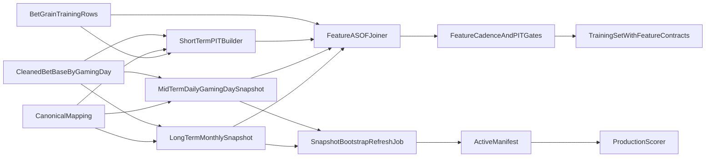

# Mid-Term Feature Snapshot - Training and Production Implementation Plan

本文件是 **Implementation Plan 層**，針對 `trainer_hightier` training pipeline 與 production scorer 的 feature cadence / snapshot 供應提出修正方案。目標是讓訓練與 production 都遵守同一套語意：short-term features 由 event-level PIT / online builder 供應；mid-term features 以 `gaming_day` daily snapshot 供應；long-term features 以 monthly canonical ASOF snapshot 供應。

本計畫涵蓋 training 語意修正、production snapshot bootstrap / refresh、manifest freshness gate、scorer runtime join 與過期處理。Production **source mirror** 契約、deploy supervisor 啟動語意與 `feature_state_meta` 鍵值見 [`Production Snapshot Serving - MANIFEST_INVENTORY.md`](Production%20Snapshot%20Serving%20-%20MANIFEST_INVENTORY.md) 與 [`Production Snapshot Serving - RUNBOOK.md`](Production%20Snapshot%20Serving%20-%20RUNBOOK.md)。Production alert threshold / policy 不在本計畫內。

## 背景與問題

既有設計文件已定義：

- short-term：短窗、接近即時，由 scorer 或實驗 pipeline 以事件級 PIT 計算。
- mid-term：中窗，預設採 daily snapshot 物化，再以 ASOF join 回 bet-grain training samples。
- long-term：長窗，例如 180d patron features，採 monthly snapshot 物化。

目前 implementation 偏離此設計。`trainer_hightier/feature_experiment/materialize_fe_derived.py` 將 `fe__*` 混在同一個 bet-grain materializer 中，並對 `w1d`、`w7d`、`w30d` 使用每筆 bet 的 `payout_complete_dtm` 作為 anchor 進行 rolling window 計算。這導致 mid-term features 實際上變成 per-bet rolling features，而不是 `gaming_day` daily snapshot features。

錯誤語意範例：

```text
target bet: 2026-05-19 14:30
current implementation: use prior 1d/7d/30d ending at 2026-05-19 14:30 minus 1 microsecond
intended mid-term: use latest snapshot as of end of prior gaming_day, i.e. 2026-05-18 end
```

這會造成三個問題：

- Training / intended serving cadence 不一致：mid-term feature 在訓練中被建成即時 rolling signal，production 卻預期日更。
- Feature governance 失效：`time_horizon=mid_term` 只描述 lookback，沒有強制 `cadence=daily_gaming_day_snapshot` 與 `anchor_rule=prior_gaming_day_end`。
- Production supplyability 失效：training bet-id artifact 被誤用為 production supplier 時，live bet IDs 無法命中，導致 `fe__*` / slow patron features 系統性 null。

## Scope

本計畫包含：

- 重定義 training pipeline 中 short / mid / long feature materialization 邊界。
- 將 mid-term `fe__*` 改為 `gaming_day` daily snapshot，再 ASOF join 至 bet-grain samples。
- 保留 short-term event-level PIT rolling 訓練語意，用於對齊 production real-time。
- 保留 long-term monthly snapshot 語意，用於對齊 `patron__*__w180d_m1snap`。
- 增加 training-time feature contract gate，避免 mid-term feature 再次以 per-bet rolling SQL 混入。
- 新增 production snapshot lifecycle：首次 bootstrap、日常 refresh、過期偵測、atomic manifest publish。
- 新增 production scorer freshness / coverage gate，避免用過期或全 null features 打分。

本計畫不包含：

- 模型演算法、thresholding、Optuna 或 alert policy 調整。
- ClickHouse materialized view 設計。
- 長期 feature store / online store 架構替換。
- 新增 business alert threshold 或人工 review policy。

## Target Semantics

### Short-Term Features

Short-term features 代表 production 中可即時計算或近即時計算的 event-level signal。Training pipeline 可以使用 per-bet PIT rolling windows 模擬 production scorer 在 target bet 可見時間點的行為。

典型特徵：

- `bet__*__w1h`
- `fe__*__w15m`
- `fe__*__w1h`
- row-lag / last-N-bets / session-so-far features
- clock features derived directly from target bet timestamp

Anchor rule:

- Anchor = target bet `payout_complete_dtm` / prediction-visible timestamp。
- Window must exclude the current bet and any future rows.

### Mid-Term Features

Mid-term features 必須由 `gaming_day` daily snapshot 供應。若 target bet 的 `gaming_day = D`，training sample 與 production scorer 都應使用最新的 `anchor_gaming_day < D` snapshot；正常日更 cadence 下，這就是 `D - 1`。

Example:

```text
target bet gaming_day = 2026-05-19
mid-term snapshot anchor = 2026-05-18
snapshot covers facts visible through end of gaming_day 2026-05-18
```

Mid-term snapshot grain:

- `canonical_id`
- `anchor_gaming_day`

Mid-term snapshot values:

- May use trailing windows such as 1d / 7d / 30d, but the anchor is the snapshot day end, not each target bet timestamp.
- For a snapshot at `anchor_gaming_day = A`, all rolling windows are computed as of end of gaming day `A`.

Join rule:

- Join training bet rows by `canonical_id`.
- Join production scorer rows by `canonical_id`.
- For target `gaming_day = D`, use latest `anchor_gaming_day < D`.
- For normal daily cadence, this is `D - 1`.
- If a snapshot is missing, trigger bootstrap / refresh before scoring.
- If a snapshot is stale but present and within the configured hard cap, production scorer may continue using the latest available snapshot in degraded mode with explicit warnings.
- If staleness exceeds the hard cap, production scoring stops until a successful refresh publishes a valid manifest (MVP: no manual override path).

Daily production refresh:

- Normal output anchor only needs the latest prior gaming day, `D - 1`.
- If scorer may replay yesterday's bets, bootstrap can output `D - 2` and `D - 1`.
- Backfill / shadow validation jobs may output a wider anchor range, but this is not required for normal live scoring.
- Computing the latest anchor still requires source facts for the maximum lookback window (default **32 calendar days** through `D - 1`, plus bundle-configured buffer for the cleaned **bet** mirror retention).
- Gaming day closes at 03:00; the production deploy refresh supervisor checks at 04:00 or later and refreshes the latest required anchor, giving 1 hour grace after close.
- If the 04:00 refresh misses, scorer continues with the latest snapshot in degraded mode, emits warnings, and records staleness on impacted predictions.

### Long-Term Features

Long-term features remain monthly snapshot features. For target bets, training and production should ASOF join the latest monthly anchor available at or before the target `gaming_day`.

Typical grain:

- `canonical_id`
- `anchor_month` or `anchor_gaming_day`

Example:

- Target `gaming_day = 2026-05-19`
- Use latest monthly snapshot whose per-patron `anchor_gaming_day` is the **last `gaming_day` in each calendar month** (month-end anchor); ASOF join still picks the greatest `anchor_gaming_day <=` target bet `gaming_day`. On calendar day 1st, production refresh targets data through the **previous calendar month-end** anchor.

Production slow patron artifact:

- Must be canonical ASOF grain, not training bet-grain artifact.
- Required manifest metadata includes `slow_patron_grain=canonical_asof` and latest slow anchor.
- High-ADT patrons are assumed to have sufficient 180d history; production gates should still verify the artifact is non-empty, canonical coverage is reasonable, required `patron__*__w180d_m1snap` columns exist, and values are not all null.
- Monthly slow snapshot allows 1 day grace after the monthly close / availability point.
- If the monthly refresh is late, scorer continues with the latest slow snapshot in degraded mode, emits warnings, and records staleness on impacted predictions.
- If slow snapshot staleness exceeds 3 days beyond the allowed grace, production scoring stops until refresh succeeds (MVP: no manual override path).

## Architecture Realization



The key design change is to split the current monolithic `fe_derived` materializer into semantic suppliers:

- `short_term_pit_features`: bet-grain, event-level PIT.
- `mid_term_daily_snapshots`: canonical-grain, daily `gaming_day` snapshot.
- `long_term_monthly_snapshots`: canonical-grain, monthly snapshot.

The final training set can remain bet-grain, but mid-term and long-term feature values must come from ASOF snapshot joins rather than per-bet rolling SQL.

In production, the scorer must not rebuild snapshots. It reads `active_manifest.json`, validates freshness / coverage, joins active snapshots, and scores only when all required feature suppliers are healthy. The deploy-managed refresh supervisor owns snapshot materialization and atomic manifest publish.

**Source of truth for refresh inputs** (not the shipped bundle parquet long-term): a **compact rolling production mirror** under the deploy bundle — `source_mirror/cleaned_bet/` (partitioned cleaned bet for mid-term + short-term) and `source_mirror/cleaned_session.parquet` (cleaned session for slow monthly). Paths and retention (`production_cleaned_bet_mirror_dir`, `production_cleaned_session_mirror_parquet`, retention days) live in `trainer_hightier.config` (not environment variables). `trainer_hightier.serving.production_source_mirror` validates schema and gaming-day coverage before each refresh.

The **shipped** snapshot set in the model bundle remains the **first-deploy seed** for `active_manifest.json` and cold start; ongoing daily/monthly materialization reads the mirror only within bounded windows.

When `trainer_hightier.deploy.main` runs in scorer-capable production modes (`all`, `scorer`), it starts a refresh supervisor by default (`--no-refresh-supervisor` to disable). **Startup** synchronously repairs only **hard failures** (missing/invalid layers, staleness past hard cap); if that targeted refresh fails, deploy fails fast. **`stale_allowed`** does not block startup; the background loop retries. See `Production Snapshot Serving - MANIFEST_INVENTORY.md` for meta keys and poll semantics.

## Workstreams

### Workstream A: Feature Contract Hardening

Extend the feature contract used by training to distinguish horizon from cadence and anchor.

Required contract fields for window features:

- `time_horizon`: `short_term` | `mid_term` | `long_term`
- `max_lookback`
- `cadence`: `event_level` | `daily_gaming_day` | `monthly`
- `anchor_rule`: `target_prediction_time` | `prior_gaming_day_end` | `monthly_snapshot_anchor`
- `grain`: `bet_id` | `canonical_id + anchor_gaming_day` | `canonical_id + anchor_month`
- `allowed_training_supplier`: `short_term_pit_builder` | `mid_term_daily_snapshot` | `long_term_monthly_snapshot`

Hard rule:

- Any `time_horizon=mid_term` feature with `cadence=daily_gaming_day` must not be computed with a per-target-bet rolling window.
- Any feature depending on mid-term snapshot values, such as ratios or z-scores, inherits the mid-term cadence.

### Workstream B: Mid-Term Daily Snapshot Materializer

Create a reusable materialization path that produces canonical daily snapshots from cleaned bet history. In production deploy, materializers read the **bounded cleaned bet mirror** (validated windows); full training-table or ad-hoc ClickHouse rebuilds stay out of the hot deploy path.

Input:

- Partitioned cleaned bet base.
- Canonical mapping.
- Required `gaming_day` range.
- Feature group contract.

Output:

- `mid_term_daily_features.parquet`
- grain: `canonical_id`, `anchor_gaming_day`
- metadata: source snapshot fingerprint, covered gaming day range, row count, distinct canonical count, feature list hash, generated_at.

Snapshot computation:

- For each `anchor_gaming_day = A`, compute all mid-term aggregates as of end of gaming day `A`.
- Windows such as 1d / 7d / 30d are evaluated relative to the end of `A`, not relative to individual target bets on `A + 1`.
- Use partition pruning by `gaming_day` and compute only dirty anchors plus lookback expansion.

Production daily refresh:

- Normal live serving only needs the latest prior-day output anchor.
- If target serving day is `D`, build `anchor_gaming_day = D - 1`.
- To compute that anchor, read source facts covering the largest required lookback, e.g. `D - 30` through `D - 1` for w30d features, plus a configurable buffer.
- Bootstrap can build `{D - 2, D - 1}` when first deploy smoke or small replay support is needed.
- Wider output ranges such as the last 32 anchors are reserved for backfill, replay, or shadow validation, not required for normal scoring.
- Production universe is the high-ADT allowlist canonical universe. When filtering by allowlist players, include all player aliases mapped to the same canonical patron so historical aggregates do not lose linked-card activity.

Cost control:

- Do not build one giant all-history in-memory frame.
- Process by anchor day or month bucket.
- Use canonical universe filtering after base all-player facts are available.
- Persist intermediate snapshots by `anchor_month=YYYYMM/anchor_gaming_day=YYYY-MM-DD/` if row volume is high.

### Workstream C: Training ASOF Join

Replace bet-id merge for mid-term features with ASOF snapshot join.

For each training row:

- Read `canonical_id` and target `gaming_day`.
- Select the latest `mid.anchor_gaming_day < target.gaming_day`.
- In normal cadence, expected anchor is `target.gaming_day - 1`.

Join output must include:

- mid-term feature values.
- `mid_term_anchor_gaming_day`
- `mid_term_snapshot_age_days`
- optional `mid_term_snapshot_missing_flag` for diagnostics.

Strict mode:

- Missing mid-term snapshot for a target row should fail if missing rate exceeds a configured tolerance.
- Tolerance should default to zero for production-grade training runs except at the earliest history boundary where no prior snapshot can exist.

### Workstream D: Refactor Existing `fe_derived`

The current `materialize_fe_derived.py` should stop being the single source of all experimental `fe__*` columns.

Refactor direction:

- Keep short-term PIT-safe calculations in an event-level builder.
- Move `w1d`, `w7d`, `w30d`, daily/today-as-prior-day, and mid-term z-score inputs into the daily snapshot builder.
- Recompute dependent ratios from the correct cadence source.
- Keep clock and raw current-bet transformations separate from snapshot features.

Examples:

- `fe__bets_cnt__w1d`: should come from prior `gaming_day` snapshot, not target bet timestamp rolling 24h.
- `fe__wager_sum__w15m_over_w1d`: numerator may remain short-term PIT; denominator must come from prior-day mid-term snapshot.
- `fe__wager_cv_w7d`: should come from prior-day daily snapshot.
- `fe__payout_odds_z_prior_w30d`: mean/std should come from prior-day daily snapshot; current payout odds remains target-row input.

### Workstream E: Validation and Regression Gates

Add gates that make cadence violations visible before model training.

Required checks:

- Contract gate: every feature column has `time_horizon`, `cadence`, `anchor_rule`, and `grain`.
- SQL/source guardrail: mid-term feature materializers must not contain per-target `RANGE ... PRECEDING` windows over target bet rows unless they are used only to build snapshot rows.
- Grain gate: mid-term artifacts must not be keyed only by `bet_id`.
- ASOF gate: training rows must record the snapshot anchor used for mid-term features.
- Boundary tests: for target `gaming_day = D`, all mid-term features must use `anchor_gaming_day < D`.
- Backward comparison: quantify expected feature distribution shift versus old per-bet rolling implementation; do not expect row-level equality.

### Workstream F: Production Snapshot Bootstrap and Refresh

Production snapshots are maintained by the deploy-managed refresh supervisor, not by the scorer. The same refresh functions remain callable manually for operations, but production deploy should start the supervisor by default.

Bootstrap / startup repair job:

- On deploy startup (before scorer foreground), **only hard-failure** states trigger a **synchronous** targeted refresh (`build_deploy_startup_snapshot_plan` in `snapshot_freshness.py`). **`stale_allowed`** skips blocking startup.
- Shipped bundle snapshots seed the manifest; if layers are missing, invalid, or past **hard cap**, startup attempts repair from the production mirror; **failure fails deploy** in scorer-capable modes.
- Preflight still validates shipped paths; warnings for recoverable preflight issues do not replace the startup hard-failure contract above.
- Builds mid-term latest required anchors:
  - normal first deploy: `D - 1`
  - first deploy with yesterday replay / smoke: `{D - 2, D - 1}`
- Builds long-term monthly canonical ASOF snapshot for the active monthly anchor.
- Writes all artifacts to staging paths first.
- Validates schema, grain, latest anchor, row count, canonical coverage, null rates, and sidecar hashes.
- Publishes a new `active_manifest.json` only after all validation passes.
- Uses a bundle-local lock so multiple production deploy processes do not concurrently materialize and publish the same snapshots.

Daily mid-term refresh job:

- Runs from the deploy refresh **background** supervisor (poll interval from config, e.g. 300s). Refresh is attempted only when HK wall clock is **04:00 or later** after the prior `gaming_day` closes at 03:00, and the layer needs refresh; failures retry on the next poll until success.
- Builds `anchor_gaming_day = D - 1`.
- Uses source facts from the maximum lookback range, not just the anchor day.
- Updates mid-term manifest metadata only after validation passes.
- If refresh is late, scorer continues with the latest snapshot in degraded mode and warns until the stale hard cap is reached.

Monthly long-term refresh job:

- Runs from the same deploy refresh supervisor. Eligibility is evaluated **at most once per calendar day** (HK); when the slow layer is missing, `stale_allowed`, or past hard cap, run `run_slow_refresh` using the **cleaned session mirror** (same aggregation semantics as training `slow_patron_180d_monthly` on cleaned session input).
- Builds canonical ASOF `patron__*__w180d_m1snap` artifact.
- Updates slow patron manifest metadata only after validation passes.
- Allows 1 day grace after monthly availability.
- If refresh is late, scorer continues with the latest snapshot in degraded mode and warns until the stale hard cap is reached.

Failure behavior:

- If refresh fails, keep the previous active manifest.
- If the previous active snapshot remains fresh, scorer can continue using it.
- If the previous active snapshot is stale but within hard cap, scorer continues in degraded mode with warnings.
- If staleness exceeds hard cap, scorer does not run until a successful refresh (MVP: no manual override).
- All-null feature coverage remains a hard failure, regardless of staleness policy.

### Workstream G: Production Manifest, Freshness, and Scorer Gates

`active_manifest.json` should carry per-layer metadata because mid-term and long-term have different cadence and freshness policies.

Recommended manifest fields:

```json
{
  "version": "feature-bootstrap-20260519",
  "mid_term_snapshot_parquet": "mid_term_daily_snapshot.parquet",
  "mid_term_grain": "canonical_daily_asof",
  "mid_term_anchor_gaming_day_max": "2026-05-18",
  "mid_term_coverage_end_exclusive": "2026-05-19T00:00:00+08:00",
  "mid_term_generated_at": "...",
  "mid_term_stale_hard_cap_days": 3,
  "slow_patron_parquet": "slow_patron_180d_monthly.parquet",
  "slow_patron_grain": "canonical_asof",
  "slow_anchor_gaming_day_max": "2026-04-30",
  "slow_generated_at": "...",
  "slow_monthly_grace_days": 1,
  "slow_stale_hard_cap_days": 3,
  "sha256_by_layer": {}
}
```

Scorer runtime gates:

- Read active manifest at boot and each scoring cycle.
- Validate mid-term semantic freshness: latest `mid_term_anchor_gaming_day_max` must cover the required prior `gaming_day`.
- Validate mid-term wall-clock status:
  - fresh when the latest expected prior-gaming-day snapshot is available after the 04:00 refresh target.
  - stale-but-allowed when refresh is late but staleness is within 3 days.
  - hard-cap breach when staleness exceeds 3 days.
- Validate slow patron monthly freshness using a monthly policy, not the mid-term 36h SLA:
  - 1 day grace after monthly availability.
  - stale-but-allowed until 3 days hard cap.
- Validate artifact grain:
  - mid-term must be `canonical_id + anchor_gaming_day`.
  - slow patron must be canonical ASOF, not bet-grain.
- Validate feature coverage after join:
  - `fe__*` must not be all null.
  - `patron__*__w180d_m1snap` must not be all null.
- Emit stale snapshot state to logs, health/status, and prediction log metadata for all impacted predictions.

If a snapshot is stale, the correct remediation is to run the refresh / bootstrap job. The scorer should not synchronously rebuild snapshots, because that risks OOM, high latency, and duplicate rebuilds across scorer instances. Until refresh succeeds, scorer may continue with the latest available snapshot only within the configured hard cap and must expose degraded status. Missing snapshots or all-null feature families are hard failures.

## Migration Strategy

Phase 1 establishes contracts and diagnostics without changing model training output. It records current feature columns by intended cadence and reports violations.

Phase 2 introduces the daily snapshot materializer for a small set of active mid-term features, such as 1d/7d/30d count and wager aggregates.

Phase 3 changes training set enrichment to join mid-term snapshots via `canonical_id + gaming_day`, while keeping short-term PIT builder unchanged.

Phase 4 migrates dependent ratio and z-score features to use snapshot denominators / mean / std.

Phase 5 removes or quarantines legacy per-bet mid-term rolling calculations from the default trainer path.

Phase 6 adds deploy-managed production bootstrap / refresh supervision and manifest metadata for mid-term daily snapshots and slow patron monthly snapshots.

Phase 7 adds deploy preflight and scorer runtime gates. Expired snapshots trigger the deploy refresh supervisor; scorer does not score beyond the hard cap until valid snapshots are published.

## Acceptance Criteria

- Training run report explicitly lists feature counts by `time_horizon`, `cadence`, `grain`, and supplier.
- No default training model can include a `mid_term` feature produced only by bet-grain per-target rolling SQL.
- Mid-term feature artifacts expose `canonical_id` and `anchor_gaming_day`.
- Training set rows expose `mid_term_anchor_gaming_day` or equivalent audit metadata.
- For a sample target row with `gaming_day = 2026-05-19`, mid-term features are sourced from snapshot anchor `2026-05-18`, not from windows ending at the target bet timestamp.
- Legacy `_main_trainer_fe_derived.parquet` is no longer treated as a valid mixed-source production/training supplier for mid-term model columns.
- Production deploy starts a refresh supervisor by default in scorer-capable modes and can rebuild missing / expired mid-term and long-term snapshots before scorer readiness.
- Normal mid-term production refresh builds the latest prior-gaming-day anchor while reading the required **32d** (config default) lookback from the cleaned bet mirror.
- Monthly long-term production refresh builds the canonical ASOF slow patron snapshot after monthly availability and updates manifest metadata atomically.
- Production slow patron artifact uses canonical ASOF grain and does not rely on live `bet_id` matching.
- `active_manifest.json` records per-layer freshness and grain metadata.
- Deploy preflight validates shipped snapshots; startup supervisor performs synchronous repair for **hard** snapshot failures only, with background retry for `stale_allowed`.
- Scorer runtime reports degraded health when snapshots are stale but within hard cap, and includes stale state in prediction logs for impacted predictions.
- Scorer runtime fails when snapshots are missing, wrong-grain, all-null after join, or stale beyond the 3 day hard cap (MVP: no bypass without fixing refresh / manifest).
- Snapshot refresh failure does not overwrite the last good manifest.

## Risks and Mitigations

- Risk: Daily snapshot semantics may reduce model performance versus per-bet rolling features.
  - Mitigation: Treat the previous result as invalid for intended cadence; rerun FQG and model evaluation under corrected semantics.
- Risk: Snapshot materialization increases training wall time.
  - Mitigation: Use `gaming_day` partition pruning, dirty anchor expansion, and month-bucket execution.
- Risk: Earliest training dates lack prior snapshots.
  - Mitigation: Define a warmup period equal to max mid-term lookback plus one day, or explicitly exclude rows without valid prior snapshot.
- Risk: Mixed features such as ratios blur short-term and mid-term boundaries.
  - Mitigation: Composite features inherit the slowest dependency cadence and must document each input supplier.
- Risk: Existing registry labels are insufficient.
  - Mitigation: Add cadence / anchor / grain fields before enabling strict training gates.
- Risk: First deploy starts with missing or expired production snapshots.
  - Mitigation: Deploy starts the refresh supervisor before scorer rollout; preflight and scorer gates block hard failures while stale-but-allowed states remain visible.
- Risk: Expired snapshots hide stale feature semantics if scoring continues indefinitely.
  - Mitigation: Keep last good manifest, warn in logs / health / prediction log, and block scoring after hard cap until refresh succeeds (`feature_state_meta` records supervisor and mirror status for operators).
- Risk: Multiple deploy instances rebuild snapshots concurrently.
  - Mitigation: Deploy refresh supervisor uses a bundle-local lock and atomic manifest publish; scorer remains read-only and never rebuilds snapshots under load.

## Open Questions

- Should `fe__canonical__*__today` remain short-term day-so-far, or be renamed / redefined if the business wants prior-gaming-day daily snapshot semantics?
- Should daily snapshots be generated for all canonical patrons or only the training / ADT universe?
- What tolerance is acceptable for missing prior-day snapshots at historical data boundaries?
- Should `gaming_day` end be interpreted strictly by the warehouse `gaming_day` field, or by HK wall-clock date for features whose current implementation uses `payout_complete_dtm`?
- What exact health/status API shape should expose stale snapshot state?
- What prediction log schema fields should carry mid-term / slow snapshot staleness metadata?

## Next Step

The next layer should be a Working / Execution Plan that breaks this into concrete tasks: contract update, training daily snapshot materializer, production bootstrap / refresh jobs, ASOF join integration, active `fe__*` migration, manifest freshness gates, scorer smoke gates, and regression tests.
