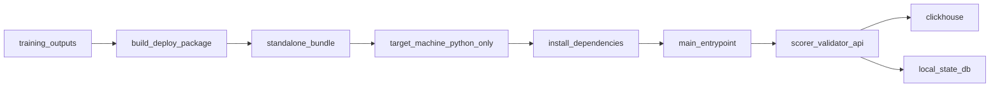

# trainer_hightier - Packaging Implementation Plan

本文件屬於 **Implementation plan 層**，定義 `trainer_hightier` 打包如何落地成「**Standalone production bundle**」：目標機器只有 Python interpreter 與交付包，也能啟動服務。本文描述 realization strategy、模組邊界、階段、里程碑、風險與驗證策略；不展開 ticket 級任務。

## 目標聲明（硬性）

`trainer_hightier` 正式交付目標為：

- 目標機 **不需要 repo checkout**。
- 目標機允許連線 **PyPI** 安裝第三方套件（不需要 repo checkout 與本機預裝專案依賴）。
- 目標機僅需：
  1. Python interpreter（版本符合支援矩陣）  
  2. 一份 deploy bundle（folder 或 zip 解壓後）
- 即可完成安裝與啟動。

> 註：若目標平台缺少 Python 或缺少 OS 層必要動態函式庫，屬平台前置條件，不屬 repo/套件依賴。

## 問題定義（現況差距）

- 現況 `trainer_hightier` 偏 **Artifact Bundle**：打包主要覆蓋模型與 snapshots，runtime 啟動鏈仍非「bundle 內單一入口」模式。
- 目標是 **Standalone Runtime Bundle**：交付包本身包含可啟動入口與所需 Python 安裝契約（允許 PyPI）。
- 核心差距：從「可搬運 artifacts」提升為「可在乾淨主機獨立啟動」。
- 觀測性差距：目前 runtime 僅寫入 `state.db`（alerts/validation），缺少 `archive/trainer` 既有的 `prediction_log.db`（全量 scored rows 稽核）。

## 成功準則（Acceptance Criteria）

- 乾淨目標機（僅 Python）可完成：
  - 建立 venv（可選但建議）
  - 依 `requirements.txt` 安裝依賴（允許從 PyPI 下載）
  - 啟動 scorer/validator/api
- 啟動時完成核心檢查並 fail-fast：
  - `model.pkl`
  - `active_manifest.json`
  - required snapshots（slow + allowlist）
  - mapping 檔案
  - allowlist hash parity（若 training_metrics 提供 hash）
- 同一 `model_version` 連續建包輸出可重現（manifest / allowlist / mapping / fingerprint 一致）。
- folder 與 zip 兩種交付形式具一致啟動結果。
- runtime 可持續寫入 `prediction_log.db`，至少覆蓋每輪全量 scored rows（不只 alert rows），以支援「全部預測」查詢與審計。

## 範圍與非範圍

- 範圍：
  - 打包器（artifact 收斂 + runtime 安裝契約）。
  - standalone runtime 入口（`main.py` 或等效），不依賴 repo module path。
  - deploy 設定契約（`deploy_bundle_paths.json` + `.env.example`/等效 template）。
  - README/RUNBOOK 生產操作文檔（離線安裝與啟動）。
  - prediction audit store（`prediction_log.db`）落地策略與打包契約（路徑、初始化、寫入時機）。
- 非範圍：
  - 重設訓練流程與特徵工程邏輯（本文件僅保證 runtime 自包含）。
  - CI/CD 平台實作細節（僅定義可被 CI 執行的輸出契約）。
  - 前端 dashboard 靜態資源部署。

## 設計前提與約束

- `high_adt_only=true` 為預設安全模式，不可默默降級全量打分。
- `training_metrics.json` 若含 `adt_allowlist_sha256`，必須 fail-fast 比對。
- 採 **Frozen artifact mode**：鎖定該次模型對應 snapshots，不依賴「執行當下最新 snapshot」。
- 不打包 raw CH mirror / 訓練中間 cache，控制體積、降低目標機資源風險。
- 秘密資訊（CH credentials）不可寫入 bundle；由目標機 `.env` 或同級秘密注入機制提供。

## Decision Log

- D-001（已定）：`trainer_hightier` 正式目標為 **Standalone Runtime Bundle**，Artifact Bundle 不可作為 production 完成態。
  - 影響：所有驗收以「無 repo」可啟動為準。
- D-002（已定）：依賴安裝允許 **PyPI online install**；離線 wheel 封裝為可選增強。
  - 影響：`requirements.txt` 需可在標準 PyPI 路徑完成安裝。
- D-003（已定）：Frozen mode 為正式預設。
  - 影響：建包需保存 manifest/allowlist/mapping 版本與 hash。
- D-004（已定）：`trial_bet_behavior_parquet` 保持 optional（除非 manifest 宣告）。
- D-005（新增）：`prediction_log.db` 採獨立 SQLite（不混入 `state.db`），寫入點位於 scorer 每輪 `predict_proba` 後、alert 篩選前，對齊 `archive/trainer` 行為。
  - 影響：可觀測到全量 predictions；不得僅依 alerts 反推。

## 目標架構（Standalone）

## 元件邊界與責任

### 1) Packaging Compiler（`build_deploy_package.py`）

- 收斂並複製 runtime 必要模型與 serving artifacts。
- 產出 bundle 內路徑契約檔（`deploy_bundle_paths.json`、`bundle_info.json`）。
- 產出標準 `requirements.txt` 與安裝契約（預設走 PyPI）。
- strict preflight（artifact 完整性 + hash parity + 路徑重寫檢查）。

### 2) Standalone Entrypoint（`main.py` 或等效）

- 可直接由 `python main.py` 啟動 scorer/api/validator，不依賴 repo import path。
- 啟動前檢查關鍵 artifact，並輸出版本可觀測資訊。
- 支援 mode 切換（all/api/scorer/validator）與 host/port。

### 3) Config Contract

- `deploy_bundle_paths.json`：路徑 SSOT。
- `.env.example`：運維必填與可選設定模板。
- `.env` 僅承載秘密與操作參數；不得再引用 repo 本地路徑。

### 4) Artifact Resolver

- 將 manifest 中路徑重寫為 bundle-relative。
- 驗證 rewritten 路徑可讀。
- 在缺失時提供可操作錯誤（實際值 + 預期值 + 修復方向）。

### 5) Prediction Audit Store（`prediction_log.db`）

- DB 與 `state.db` 分離，預設位於 `local_state/prediction_log.db`。
- scorer 在每輪評分後、alert 篩選前 append 全量 scored rows（含 `score`、`margin`、`is_alert`、`is_rated_obs` 等最低必要欄位）。
- 建議採 WAL + index（`scored_at`、`model_version`）以平衡寫入與查詢。
- 寫入失敗時策略需明確：預設 **降級告警但不阻斷 scoring 主流程**（與 archive 行為一致），並在 runbook 標示風險。

## Packaging Contract（輸出物協定）

必帶內容（production 完成態）：

- `main.py`（或等效 standalone entrypoint）
- `requirements.txt`（於 **bundle 根目錄** 執行 `pip install -r`；首行為相對該目錄之 `wheels/trainer_hightier-*.whl`，其餘相依由 PyPI 解析）
- `wheels/`（**預設**：内含 `trainer_hightier-*.whl`，由建包機 `pip wheel --no-deps` 產生；亦保留作離線備援擴充）
- `.env.example`
- `models/`（至少 `model.pkl`、`training_metrics.json`、`model_version`）
- `snapshots/active_manifest.json`
- `snapshots/artifacts/slow_patron_*.parquet`（required）
- `snapshots/artifacts/adt_allowed_players_*.parquet`（required）
- `mapping/`（canonical mapping parquet）
- `local_state/`（可空）
- `local_state/`（至少保留可建立 `state.db`、`prediction_log.db` 的路徑）
- `README_DEPLOY.md`
- `bundle_info.json`
- `deploy_bundle_paths.json`

可選內容：

- `snapshots/artifacts/trial_bet_behavior_*.parquet`
- `feature_state.db`（如需審計歷史）
- `prediction_log.db`（若交付時預先建立；未預建亦須保證 runtime 可自動初始化）

## Workstreams / Phases

### Phase 0：契約凍結

- 凍結 standalone 契約（輸出物、啟動方式、安裝規範）。
- 明確禁止 production 依賴 repo import。

### Phase 1：打包核心與 runtime artifacts 收斂

- 模型/snapshot/allowlist/mapping 收斂。
- manifest 路徑重寫與校驗。
- strict + hash parity。

### Phase 2：runtime 封裝與安裝契約

- 產出 PyPI 可安裝的依賴清單與版本鎖定策略。
- （可選）提供 wheels 目錄作為離線備援。
- 生成 standalone runtime entrypoint 與 `.env.example`。
- README 明確化為「python + bundle 即可」流程。

### Phase 3：驗證與交付

- 在無 repo 的乾淨環境 smoke test（含 PyPI 安裝）。
- folder 與 zip 等價驗證。
- 回滾流程驗證（上一版 bundle 快速切換）。

### Phase 4：Prediction Log parity（對齊 archive/trainer）

- 對齊 `archive/trainer/serving/scorer.py` 的核心契約：建立 prediction_log schema、append 全量 scored rows。
- 定義最小欄位集合與索引策略，避免目標機長時運行磁碟無上限膨脹。
- 在 deploy smoke 加入「全量 predictions 可查」驗收（非僅 alerts）。

## 里程碑

- M1：輸出符合 standalone contract 的 bundle 目錄。
- M2：strict preflight 可攔截缺檔/壞路徑/hash mismatch。
- M3：乾淨目標機（無 repo）可安裝並啟動服務。
- M4：`high_adt_only` 與版本/hash 可於啟動與 runtime 觀測。
- M5：同一 `model_version` 可重現建包。
- M6：zip 交付與回滾 runbook 可操作。
- M7：`prediction_log.db` 在 target 機可自動建立並可查詢全量 predictions。

## 主要風險與緩解

- 風險：PyPI 套件版本漂移或暫時不可用，導致安裝失敗或行為變動。
  - 緩解：鎖定版本並維護可選內部鏡像/快取（必要時啟用 wheels 備援）。
- 風險：`active_manifest.json` 缺失導致建包失敗。
  - 緩解：明確前置檢查；指引使用 `--snapshot-manifest-source` 或先產生 manifest。
- 風險：bundle 缺 `main.py`/`.env.example` 或入口與文件不一致，導致 target 機無法直接啟動 runtime。
  - 緩解：將入口與設定模板納入必帶契約與 release gate。
- 風險：bundle 體積過大，造成搬運或啟動資源壓力。
  - 緩解：排除非必要大檔；trial parquet 保持 optional。
- 風險：模型與 allowlist 版本漂移。
  - 緩解：hash parity fail-fast + `bundle_info` 版本稽核。
- 風險：prediction log 長時累積導致磁碟壓力或查詢退化。
  - 緩解：建立 retention/summary 策略與必要索引；runbook 加入容量監控與清理步驟。

## 驗證與 rollout 策略

- 功能驗證：輸出內容符合 standalone contract，啟動流程無 repo 依賴。
- 安裝驗證：可連 PyPI 的乾淨主機可完成 install + run；必要時再補離線備援驗證。
- 契約驗證：`high_adt_only` 與 allowlist 約束生效。
- 稽核驗證：`prediction_log.db` 可讀回全量 scored rows，且寫入不依賴 alerts 命中。
- 操作驗證：folder/zip 兩路徑一致。
- rollout：先 shadow，再切正式；保留上一版 bundle 可快速回滾。

## 假設與待確認

- 目標機可提供相容 Python 版本與必要 OS runtime。
- ClickHouse 連線與權限由環境側提供。
- 允許在需要時為特定平台提供對應 wheels 備援集合（非硬性）。
