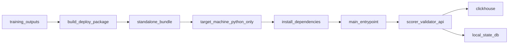

# trainer_hightier - Packaging Implementation Plan

本文件屬於 **Implementation plan 層**，定義 `trainer_hightier` 打包如何落地成「**Standalone production bundle**」：目標機器只有 Python interpreter 與交付包，也能啟動服務。本文描述 realization strategy、模組邊界、階段、里程碑、風險與驗證策略；不展開 ticket 級任務。

## 目標聲明（硬性）

`trainer_hightier` 正式交付目標為：

- 目標機 **不需要 repo checkout**。
- 目標機允許連線 **PyPI** 安裝第三方套件（不需要 repo checkout 與本機預裝專案依賴）。
- 目標機僅需：
  1. Python interpreter（版本符合支援矩陣）  
  2. 一份 deploy bundle（folder 或 zip 解壓後）
- 即可完成安裝與啟動。

> 註：若目標平台缺少 Python 或缺少 OS 層必要動態函式庫，屬平台前置條件，不屬 repo/套件依賴。

## 問題定義（現況差距）

- 現況 `trainer_hightier` 偏 **Artifact Bundle**：打包主要覆蓋模型與 snapshots，runtime 啟動鏈仍非「bundle 內單一入口」模式。
- 目標是 **Standalone Runtime Bundle**：交付包本身包含可啟動入口與所需 Python 安裝契約（允許 PyPI）。
- 核心差距：從「可搬運 artifacts」提升為「可在乾淨主機獨立啟動」。
- 觀測性差距：目前 runtime 僅寫入 `state.db`（alerts/validation），缺少 `archive/trainer` 既有的 `prediction_log.db`（全量 scored rows 稽核）。

## 成功準則（Acceptance Criteria）

- 乾淨目標機（僅 Python）可完成：
  - 建立 venv（可選但建議）
  - 依 `requirements.txt` 安裝依賴（允許從 PyPI 下載）
  - 啟動 scorer/validator/api
- 啟動時完成核心檢查並 fail-fast：
  - `model.pkl`
  - `active_manifest.json`
  - required snapshots（slow + allowlist）
  - mapping 檔案
  - allowlist hash parity（若 training_metrics 提供 hash）
- 建包或 deploy preflight 必須驗證 **model feature supplyability**：
  - `model.pkl` 內每個 `feature_columns` 欄位都必須有且只有一個 runtime supplier。
  - supplier 可以是 ClickHouse 原始欄位、serving 即時計算器、或 bundled parquet（`feast_trial_1h` 僅計 **online** 為 production 主路徑，見 D-009）。
  - 若模型含 `fe_derived` 類欄位，但 bundle / wheel / runtime 沒有對應供應路徑，或 mid-term **freshness** 未達 SLA，必須 fail-fast，不可等到 scorer 第一輪才由 `assert_features_ready` 爆錯。
- 同一 `model_version` 連續建包輸出可重現（manifest / allowlist / mapping / fingerprint 一致）。
- folder 與 zip 兩種交付形式具一致啟動結果。
- runtime 可持續寫入 `prediction_log.db`，至少覆蓋每輪全量 scored rows（不只 alert rows），以支援「全部預測」查詢與審計。

## 範圍與非範圍

- 範圍：
  - 打包器（artifact 收斂 + runtime 安裝契約）。
  - standalone runtime 入口（`main.py` 或等效），不依賴 repo module path。
  - deploy 設定契約（`deploy_bundle_paths.json` + `.env.example`/等效 template）。
  - **模型特徵供應契約**：以 frozen registry + `model.pkl.feature_columns` 驗證 runtime 是否能供應模型需要的每個欄位。
  - README/RUNBOOK 生產操作文檔（離線安裝與啟動）。
  - prediction audit store（`prediction_log.db`）落地策略與打包契約（路徑、初始化、寫入時機）。
- 非範圍：
  - 重設訓練流程與特徵工程邏輯；但 **不得** 因此略過 train/serve feature supplyability 驗證。若模型欄位無 runtime supplier，packaging 必須阻擋或要求明確降級模型。
  - CI/CD 平台實作細節（僅定義可被 CI 執行的輸出契約）。
  - 前端 dashboard 靜態資源部署。

## 設計前提與約束

- `high_adt_only=true` 為預設安全模式，不可默默降級全量打分。
- `training_metrics.json` 若含 `adt_allowlist_sha256`，必須 fail-fast 比對。
- 採 **Frozen artifact mode**：鎖定該次模型對應 snapshots，不依賴「執行當下最新 snapshot」。
- 不打包 raw CH mirror / 訓練中間 cache，控制體積、降低目標機資源風險。
- 秘密資訊（CH credentials）不可寫入 bundle；由目標機 `.env` 或同級秘密注入機制提供。

## 時間視野分類（Time-Horizon / Term）

特徵的 **term** 是**語義標籤**（模型需要多長歷史才能定義該欄位），與 registry 的 `source`、runtime **supplier**（如何供應）**正交**。  
打包與 release gate 須同時驗證「term 是否合理」與「該 term 在 production 是否有對應 supplier」。

### 正式定義（依最大需求 lookback）

分類以該特徵（含複合欄位）所需的**最大歷史 lookback** 為準，不由 `source` 或欄名前綴推斷：

| Term | 最大 lookback 條件 | 典型更新節奏（營運預期，非程式硬編） |
|------|-------------------|-----------------------------------|
| **short-term** | `< 24h` | 接近即時；可 online 或 micro-batch |
| **mid-term** | `>= 24h` 且 `<= 30d` | 日更或 micro-batch（例如每日/每數小時物化） |
| **long-term** | `> 30d` | 月更或更低頻快照 |

**邊界規則**

- `24h` 歸 **mid-term**（含）；`30d` 歸 **mid-term**（含）。
- 複合特徵（ratio、zscore、多窗）以**依賴的最長窗口**定 term。例：`fe__wager_sum__w15m_over_w1d` 依賴 1d → **mid-term**，不可因名稱含 `w15m` 判為 short-term。
- 現況欄位對照（治理用，非 exhaustive）：
  - `bet__*__w1h`（`feast_trial_1h`）→ short-term
  - `fe__*` 中 1d–30d 衍生欄（`fe_derived`）→ mid-term
  - `patron__*__w180d_m1snap`（`feast_slow_180d`）→ long-term

**與 `1h ~ <24h` 灰區**

- 目前啟用 short-term 僅到 **1h**，但分類規則已覆蓋未來 `w6h` / `w12h` 等：只要 lookback `< 24h` 仍屬 short-term，無需改 term 定義。

### Term ≠ Supplier（為何 short-term 也可能用 parquet）

**Supplier** 描述 production **如何**取得欄位值；**term** 描述**需要多長歷史**。兩者分開記錄，避免「short-term 卻用 parquet」被誤判為分類錯誤。

| Supplier 類型 | 說明 | 適用 term（常見） |
|---------------|------|------------------|
| **raw** | ClickHouse `t_bet` 原始欄 | 任意（多為 baseline） |
| **online** | scorer 每輪即時計算（如 `attach_trial_bet_behavior_1h`） | short-term（預設首選） |
| **micro_batch_parquet** | 固定 cadence 物化 parquet，scorer 僅 merge | short-term / mid-term |
| **snapshot_parquet** | 訓練凍結或低頻全量/增量快照（如 slow 180d、fe_derived bundle） | mid-term / long-term |

**範例：short-term 用 micro-batch parquet（非 online）**

- 新增 `fe__bets_cnt__w6h`、`fe__loss_rate__w12h`（term 皆為 short-term，因 lookback `< 24h`）。
- 若每輪 scorer 對全量 allowlist 做 6h/12h rolling，延遲與記憶體成本高。
- 可改為每 **10 分鐘** job 從 CH 增量物化 `short_features_10m.parquet`，scorer 對本輪 `bet_id` merge——**term 仍為 short-term**，supplier 為 `micro_batch_parquet`。
- 取捨：略犧牲 freshness（最多一個 batch 間隔）換取穩定 latency 與可重播；超熱、低算力欄位（現有 1h 四欄）仍優先 **online**。

### 現況 registry `source` → term / 典型 supplier（對照表）

| `source` | Term | 現況典型 supplier | 備註 |
|----------|------|-------------------|------|
| `baseline_model` | （非窗特徵） | raw | 不套用 term 窗規則 |
| `feast_trial_1h` | short-term | **online-only primary**（`attach_trial_bet_behavior_1h`） | `trial_bet_behavior_parquet` 僅診斷/回歸用 artifact，**不是** production 主供應路徑；scorer 不讀 trial parquet 供分 |
| `fe_derived` | mid-term | **snapshot_parquet**（`fe_derived_parquet`） | 訓練由 `materialize_fe_derived`；production 須週期更新（見下節 freshness gate） |
| `feast_slow_180d` | long-term | **snapshot_parquet**（`slow_patron_parquet`） | `snapshot_updater` 可日更/重物化 slow；月更語意 |

詳細 registry 治理欄位（`time_horizon`、`max_lookback`，ISO-8601）見 [`Feature Candidate Registry - IMPLEMENTATION_PLAN.md`](Feature%20Candidate%20Registry%20-%20IMPLEMENTATION_PLAN.md)。

### Mid-term freshness 硬 gate（release / deploy preflight）

若模型含任一 `time_horizon=mid_term` 欄位（registry 必填欄位，見 Feature Candidate Registry plan），建包與 deploy preflight **必須**同時滿足：

1. **Supplier 存在**：`active_manifest.json` 宣告 `fe_derived_parquet`，且檔案存在並含模型所需欄位（既有 feature supplyability gate）。
2. **Freshness 達標**：`coverage_end_exclusive`（manifest 內 ISO-8601）須滿足  
   `coverage_end_exclusive >= now_utc - mid_term_freshness_sla`（建議預設 **PT36H**，日更 SLA 加排程容忍）。

未達標時 fail-fast，錯誤須標 `[feature-supply]` 或 `[pack-schema]` 並列出過期欄位數與 manifest 時間戳。

**實作備註（已更新）**：`trainer_hightier.serving.snapshot_updater` 支援 `--production` 全層 publish、`--refresh-mid-term`、`--refresh-slow`；production 物化前會驗證 bundle 內 `source_mirror` 之 cleaned bet / session mirror。日常 cadence 預設由 **`trainer_hightier.deploy.main` 內建 refresh supervisor**（`all` / `scorer` 模式）驅動；外部 orchestrator 仍可作為備援或 `--no-refresh-supervisor` 時的唯一排程來源。

## Decision Log

- D-001（已定）：`trainer_hightier` 正式目標為 **Standalone Runtime Bundle**，Artifact Bundle 不可作為 production 完成態。
  - 影響：所有驗收以「無 repo」可啟動為準。
- D-002（已定）：依賴安裝允許 **PyPI online install**；離線 wheel 封裝為可選增強。
  - 影響：`requirements.txt` 需可在標準 PyPI 路徑完成安裝。
- D-003（已定）：Frozen mode 為正式預設。
  - 影響：建包需保存 manifest/allowlist/mapping 版本與 hash。
- D-004（已定）：`trial_bet_behavior_parquet` 可選打包，**僅**供診斷/回歸與 schema 對照；**不得**作為 `feast_trial_1h` 的 production 主供應路徑（見 D-009）。
- D-005（新增）：`prediction_log.db` 採獨立 SQLite（不混入 `state.db`），寫入點位於 scorer 每輪 `predict_proba` 後、alert 篩選前，對齊 `archive/trainer` 行為。
  - 影響：可觀測到全量 predictions；不得僅依 alerts 反推。
- D-006（新增）：Step 5 完成後自動產出 `<model-bundle>/deploy_inputs/`（frozen `active_manifest.json` + 對應 parquet 副本，`adt_allowlist_version`/`adt_allowlist_sha256` 與 allowlist 一致）；`build_deploy_package` **優先**自此目錄解析 manifest／canonical mapping。**僅需 `--model-version`** 即可建包——前提為訓練已寫完整 `deploy_inputs`；仍可透過 `--snapshot-manifest-source`／`--mapping-source` override。建包複製 parquet 時，manifest 若以**非絕對路徑**載明檔案，來源為 **`active_manifest.json` 之父目錄**。
- D-007（新增）：Production bundle 的完成條件包含 **feature supplyability**，不僅是檔案完整與 `/health` 成功。建包器必須以 frozen registry 將 `model.pkl.feature_columns` 分派到 runtime suppliers：
  - `baseline_model`：由 scorer ClickHouse `t_bet` 查詢直接供應。
  - `feast_trial_1h`：由 serving **online-only primary**（`attach_trial_bet_behavior_1h`）；bundled trial parquet **不計入** production 主供應判定。
  - `feast_slow_180d`：由 bundled slow parquet 供應。
  - `fe_derived`：必須由 bundled `fe_derived_parquet` 供應（serving-safe online 為後續選項）；若兩者皆無，建包或 deploy preflight 必須 fail-fast。
  - 影響：`GET /health` 不再足以作 production readiness；release gate 必須跑至少一條 scorer feature readiness smoke。
- D-008（已定）：**Time-horizon（term）** 與 **supplier** 分離治理（見上節「時間視野分類」）。
  - short-term = lookback `< 24h`；mid-term = `24h–30d`；long-term = `> 30d`；複合特徵以最大 lookback 定 term。
  - `feast_slow_180d` 為 **long-term**，**不是** mid-term；`fe_derived`（1d–30d）為 **mid-term**。
  - supplier 可為 online / micro_batch_parquet / snapshot_parquet，不得由 `source` 單獨推斷 term。
  - 影響：release gate / supplier summary 應能按 term 彙總；mid-term 缺 supplier 與 long-term 缺 slow 分開排查。
- D-009（已定）：**`feast_trial_1h` production supplier 定版**。
  - Primary：**online**（`attach_trial_bet_behavior_1h`）。
  - `trial_bet_behavior_parquet`：僅診斷/回歸/可選 schema gate，**不得**作為 scorer 主路徑供應或 release 通過條件。
  - 影響：建包 gate 不再因「有 trial parquet」誤判 trial 特徵已可供 production scoring。
- D-010（已定）：**Mid-term freshness 硬 gate**（見上節「Mid-term freshness 硬 gate」）。
  - 含 `mid_term` 欄位的模型：`fe_derived_parquet` 存在、欄位齊、且 `coverage_end_exclusive` 在 SLA 內。
  - 影響：避免訓練截點 fe 快照在 production 長期陳舊卻通過建包。

## 目標架構（Standalone）

## 元件邊界與責任

### 1) Packaging Compiler（`build_deploy_package.py`）

- 收斂並複製 runtime 必要模型與 serving artifacts。
- **Bundle 側 `deploy_inputs/`**：若 `--model-bundle`/`--model-source`/`--model-version` 對應目錄下有 `deploy_inputs/active_manifest.json` 與 `canonical_player_mapping.parquet`，預設採為 Frozen 來源；否則退回全域 serving snapshot／repo mapping（CLI `--snapshot-manifest-source`/`--mapping-source` 仍可覆寫）。
- 產出 bundle 內路徑契約檔（`deploy_bundle_paths.json`、`bundle_info.json`）。
- 產出標準 `requirements.txt` 與安裝契約（預設走 PyPI）。
- strict preflight（artifact 完整性 + hash parity + 路徑重寫檢查）。

### 2) Standalone Entrypoint（`main.py` 或等效）

- 可直接由 `python main.py` 啟動 scorer/api/validator，不依賴 repo import path。
- 啟動前檢查關鍵 artifact，並輸出版本可觀測資訊。
- 支援 mode 切換（all/api/scorer/validator）與 host/port。

### 3) Config Contract

- `deploy_bundle_paths.json`：路徑 SSOT。
- `.env.example`：運維必填與可選設定模板。
- `.env` 僅承載秘密與操作參數；不得再引用 repo 本地路徑。

### 4) Artifact Resolver

- 將 manifest 中路徑重寫為 bundle-relative（讀來源 parquet：絕對路徑直接用；若為相對檔名，則先相對 **`active_manifest.json` 所在目錄** 解析再複製）。
- 驗證 rewritten 路徑可讀。
- 在缺失時提供可操作錯誤（實際值 + 預期值 + 修復方向）。

### 5) Prediction Audit Store（`prediction_log.db`）

- DB 與 `state.db` 分離，預設位於 `local_state/prediction_log.db`。
- scorer 在每輪評分後、alert 篩選前 append 全量 scored rows（含 `score`、`margin`、`is_alert`、`is_rated_obs` 等最低必要欄位）。
- 建議採 WAL + index（`scored_at`、`model_version`）以平衡寫入與查詢。
- 寫入失敗時策略需明確：預設 **降級告警但不阻斷 scoring 主流程**（與 archive 行為一致），並在 runbook 標示風險。

### 6) Runtime Feature Supplier Contract

- Packaging compiler 讀取 frozen registry 與 `model.pkl.feature_columns`，產生「模型欄位 → **term** → runtime **supplier**」檢查結果（term 定義見「時間視野分類」）。
- Supplier 分類（與 term 正交）：
  - **Raw supplier**：`baseline_model` 欄位由 scorer ClickHouse 查詢提供。
  - **Online supplier**：每輪 scoring 即時計算（例：`attach_trial_bet_behavior_1h`）；適合 short-term、低延遲需求。
  - **Micro-batch parquet supplier**：週期性物化 parquet，scorer merge；可用於 short-term 或 mid-term（term 不變）。
  - **Snapshot parquet supplier**：訓練凍結或低頻快照 merge；mid-term（`fe_derived_parquet`）與 long-term（`slow_patron_parquet`）。
- 依 term 的 release 預期（現況 vs 目標）：
  - **short-term**：**online-only primary**（`attach_trial_bet_behavior_1h`）；允許 micro-batch parquet 作為未來擴展，非現況主路徑。
  - **mid-term**：bundled `fe_derived_parquet` + **freshness 硬 gate**（`coverage_end_exclusive` SLA）；不可僅依訓練截點快照長期 serving。
  - **long-term**：`slow_patron_parquet` + `snapshot_updater`（或 `--rematerialize-slow`）；月更語意。
- Gate 原則：
  - dynamic schema gate 僅能放行「實際已有 supplier」的欄位。
  - `feast_trial_1h`：僅 **online** 計入 production 供應判定；`trial_bet_behavior_parquet` 不計入（D-009）。
  - `fe_derived`（mid-term）：除欄位存在外，須通過 `coverage_end_exclusive` freshness SLA（D-010）。
  - `source` 不能被當成供應保證，也不能單獨代表 term（`fe_derived` ≠ slow；`feast_trial_1h` ≠ 全部 short 以外特徵）。
  - 若 registry 新增 feature，但 serving / artifact 未同步，建包應失敗，而不是讓 scorer runtime 失敗。
  - preflight / `bundle_info` 建議輸出：按 term 與 supplier 的欄位計數摘要（便於區分「mid-term fe 缺失/過期」vs「long-term slow 缺失」）。

## Packaging Contract（輸出物協定）

必帶內容（production 完成態）：

- `main.py`（或等效 standalone entrypoint）
- `requirements.txt`（於 **bundle 根目錄** 執行 `pip install -r`；首行為相對該目錄之 `wheels/trainer_hightier-*.whl`，其餘相依由 PyPI 解析）
- `wheels/`（**預設**：内含 `trainer_hightier-*.whl`，由建包機 `pip wheel --no-deps` 產生；亦保留作離線備援擴充）
- `.env.example`
- `models/`（至少 `model.pkl`、`training_metrics.json`、`model_version`）
- `snapshots/active_manifest.json`
- `snapshots/artifacts/slow_patron_*.parquet`（required）
- `snapshots/artifacts/adt_allowed_players_*.parquet`（required）
- `mapping/`（canonical mapping parquet）
- `local_state/`（可空）
- `local_state/`（至少保留可建立 `state.db`、`prediction_log.db` 的路徑）
- `README_DEPLOY.md`
- `bundle_info.json`
- `deploy_bundle_paths.json`

可選內容：

- `snapshots/artifacts/trial_bet_behavior_*.parquet`
- `snapshots/artifacts/fe_derived_*.parquet`（若 production 模型含 `source: fe_derived` 且選擇預物化供應策略）
- `feature_state.db`（如需審計歷史）
- `prediction_log.db`（若交付時預先建立；未預建亦須保證 runtime 可自動初始化）

Feature supplyability contract：

- `models/model.pkl` 的 `feature_columns` 必須全部可由 bundle runtime 供應。
- `models/feature_candidate_registry.snapshot.yaml` 為欄位 source 分派依據。
- `bundle_info.json` 或 deploy preflight log 應輸出 feature supplier summary（每個 **source**、**term**、**supplier** 的欄位數與供應狀態）。

## Workstreams / Phases

### Phase 0：契約凍結

- 凍結 standalone 契約（輸出物、啟動方式、安裝規範）。
- 明確禁止 production 依賴 repo import。

### Phase 1：打包核心與 runtime artifacts 收斂

- 模型/snapshot/allowlist/mapping 收斂。
- manifest 路徑重寫與校驗。
- strict + hash parity。

### Phase 2：runtime 封裝與安裝契約

- 產出 PyPI 可安裝的依賴清單與版本鎖定策略。
- （可選）提供 wheels 目錄作為離線備援。
- 生成 standalone runtime entrypoint 與 `.env.example`。
- README 明確化為「python + bundle 即可」流程。

### Phase 3：驗證與交付

- 在無 repo 的乾淨環境 smoke test（含 PyPI 安裝）。
- folder 與 zip 等價驗證。
- 回滾流程驗證（上一版 bundle 快速切換）。

### Phase 4：Prediction Log parity（對齊 archive/trainer）

- 對齊 `archive/trainer/serving/scorer.py` 的核心契約：建立 prediction_log schema、append 全量 scored rows。
- 定義最小欄位集合與索引策略，避免目標機長時運行磁碟無上限膨脹。
- 在 deploy smoke 加入「全量 predictions 可查」驗收（非僅 alerts）。

### Phase 5：Feature supplyability parity（避免 boot 成功但 scoring 失敗）

- 建包階段：
  - 讀取 `model.pkl.feature_columns`。
  - 讀取 frozen registry snapshot（含 `time_horizon` / `max_lookback`）。
  - 建立 supplier matrix，確認每個模型欄位有 runtime 供應來源。
  - `feast_trial_1h`：僅 online 路徑計入通過；trial parquet 可選打包但不計入。
  - `fe_derived`：驗證 `fe_derived_parquet` 存在、欄位齊、且 `coverage_end_exclusive` 在 SLA 內。
- Runtime 階段：
  - deploy preflight 或 scorer `--once` smoke 必須跑到 `assert_features_ready` 前後，確認模型欄位完整。
  - 若模型需要 `fe_derived`，須有 bundled `fe_derived_parquet` 且 manifest 新鮮度達標（serving-safe online 為後續選項）。
- Release 文件：
  - `RUNBOOK.md` 補上 missing features 的排查：raw、online（trial）、slow parquet、`fe_derived` 缺失或 **stale**（勿將 trial parquet 當 production 主路徑）。

## 里程碑

- M1：輸出符合 standalone contract 的 bundle 目錄。
- M2：strict preflight 可攔截缺檔/壞路徑/hash mismatch。
- M3：乾淨目標機（無 repo）可安裝並啟動服務。
- M4：`high_adt_only` 與版本/hash 可於啟動與 runtime 觀測。
- M5：同一 `model_version` 可重現建包。
- M6：zip 交付與回滾 runbook 可操作。
- M7：`prediction_log.db` 在 target 機可自動建立並可查詢全量 predictions。
- M8：feature supplyability gate 生效；含 `fe_derived` 的模型若無 supplier 或 mid-term freshness 過期，會在建包/preflight 階段失敗，而非 scorer 第一輪失敗。
- M9：`feast_trial_1h` 僅以 online supplier 判定通過；trial parquet 存在不影響 release gate。

## 主要風險與緩解

- 風險：PyPI 套件版本漂移或暫時不可用，導致安裝失敗或行為變動。
  - 緩解：鎖定版本並維護可選內部鏡像/快取（必要時啟用 wheels 備援）。
- 風險：`active_manifest.json` 缺失導致建包失敗。
  - 緩解：明確前置檢查；指引使用 `--snapshot-manifest-source` 或先產生 manifest。
- 風險：bundle 缺 `main.py`/`.env.example` 或入口與文件不一致，導致 target 機無法直接啟動 runtime。
  - 緩解：將入口與設定模板納入必帶契約與 release gate。
- 風險：bundle 體積過大，造成搬運或啟動資源壓力。
  - 緩解：排除非必要大檔；trial parquet 保持 optional。
- 風險：模型與 allowlist 版本漂移。
  - 緩解：hash parity fail-fast + `bundle_info` 版本稽核。
- 風險：prediction log 長時累積導致磁碟壓力或查詢退化。
  - 緩解：建立 retention/summary 策略與必要索引；runbook 加入容量監控與清理步驟。
- 風險：模型包含訓練端可產生、但 serving bundle 不可產生的欄位（例如 `fe_derived`）。
  - 緩解：feature supplyability gate + mid-term freshness 硬 gate；若無 `fe_derived_parquet` 或 SLA 過期，建包/preflight fail-fast。重訓重打包後須確保 fe refresh job 與 manifest 時間戳一併更新。
- 風險：將 `trial_bet_behavior_parquet` 誤當 production 主供應。
  - 緩解：D-009 明確 online-only primary；gate 不以 trial parquet 作為 trial 特徵通過條件。
- 風險：只驗 `/health` 導致部署成功但 scorer 首輪失敗。
  - 緩解：release gate 必須跑 scorer feature readiness smoke；`GET /health` 僅代表 API alive，不代表 model scoring ready。
- 風險：slow / trial / fe parquet 以大檔全量讀入，造成目標機 OOM 或長時間卡住。
  - 緩解：schema gate 僅讀 schema；runtime merge 應優先用 DuckDB/PyArrow filter by current `bet_id` set，避免每輪 pandas 全檔載入。

## 驗證與 rollout 策略

- 功能驗證：輸出內容符合 standalone contract，啟動流程無 repo 依賴。
- 安裝驗證：可連 PyPI 的乾淨主機可完成 install + run；必要時再補離線備援驗證。
- 契約驗證：`high_adt_only` 與 allowlist 約束生效。
- Feature readiness 驗證：在無 repo bundle 環境跑一輪 scorer smoke（或等價 fixture），確認 `model.feature_columns` 全部存在且可進入 `predict_proba`。
- 稽核驗證：`prediction_log.db` 可讀回全量 scored rows，且寫入不依賴 alerts 命中。
- 操作驗證：folder/zip 兩路徑一致。
- rollout：先 shadow，再切正式；保留上一版 bundle 可快速回滾。

## 假設與待確認

- 目標機可提供相容 Python 版本與必要 OS runtime。
- ClickHouse 連線與權限由環境側提供。
- 允許在需要時為特定平台提供對應 wheels 備援集合（非硬性）。
