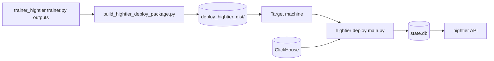

# trainer_hightier - Packaging Implementation Plan

本文件屬於 **Implementation plan 層**，定義 `trainer_hightier` 可部署打包能力（對齊現有 `@package` 體驗）的 realization strategy、模組邊界、里程碑、風險與驗證策略；不展開 ticket 級 task checklist。

## 目標與成功準則

- 目標：
  - 提供一個單一入口，產生可搬移到另一台機器的部署包（資料夾或 zip）。
  - 讓部署操作在「**只指定 model version/bundle**」時即可解析並收斂 deploy 所需 artifact。
  - 讓目標機器在具備相容程式碼環境時，能啟動 `scorer` / `validator` / `api`（與必要的 `snapshot_updater` 操作）。
  - 保證 `high_adt_only` 模式所需 artifact（allowlist / manifest / slow snapshot）可追溯且可驗證。
- 成功準則：
  - 部署包在乾淨環境完成 `pip install -r requirements.txt` 後可啟動服務。
  - 啟動前完整性檢查可阻擋缺失或版本不一致的核心 artifact。
  - 在 `Frozen` 模式下，同一 `model_version` 重複建包輸出可重現（版本與 hash 一致）。
  - 支援 single-folder 與 zip 兩種交付型態，並具備最小操作文件。

## 範圍與非範圍

- 範圍：
  - `trainer_hightier` 專用打包腳本、部署入口、artifact 收斂與驗證。
  - 模型 bundle、active snapshot/allowlist、canonical mapping、必要設定與啟動文件打包。
  - 打包時 manifest 路徑重寫與一致性驗證（搬機後可用）。
- 非範圍：
  - 重新設計訓練流程與模型產生邏輯。
  - 建置 CI/CD 平台細節（僅定義可被 CI 調用的 CLI 契約）。
  - 前端 dashboard 靜態資源部署（本期以 API 與後端 runtime 為主）。

## 已定約束（作為設計前提）

- `high_adt_only=true` 為預設安全模式；部署包不得默默降級成全量打分。
- allowlist 需與訓練同源；若 `training_metrics.json` 提供 `adt_allowlist_sha256`，預設採 fail-fast。
- `state.db` 與 trainer API 協定相容，避免下游 API 使用端破壞。
- 打包流程需避免攜帶不必要大檔（raw ClickHouse mirror / 訓練中間 cache），降低搬運成本與目標機 OOM 風險。
- 本期策略固定為 **Frozen artifact mode**：部署包鎖定訓練當下對應 artifact，不依賴「最新 serving snapshot」。

## 決策紀錄（Decision Log）

- D-001（已定）：採用 **Frozen** 模式作為預設與正式環境基準。
  - 理由：可重現、可回滾、可稽核；同一 `model_version` 不受後續 snapshot 漂移影響。
  - 影響：建包需收斂並封存 long/mid-term snapshot 與 mapping；不以 runtime 動態抓最新檔案為主流程。
- D-002（已定）：`trial_bet_behavior_parquet` 目前列為 **optional**。
  - 理由：現行 scorer 在 runtime 以 bet pool 即時計算 1h 行為特徵，非硬依賴該 parquet。
  - 影響：strict 模式下可不要求此檔；若 manifest 宣告該欄位則需驗證可讀。

## 目前體積基線（2026-05-18 實測）

- 目前單次 model bundle（`out/models_high_tier_mvp/<run_id>`）約 **1.65 MB**（主要為 `model.pkl`）。
- `trainer_hightier/artifacts/mapping`：
  - `canonical_player_mapping.parquet` 約 **4.29 MB**
  - `adt_allowed_players_q0p99.parquet` 約 **69.92 KB**
- `trainer_hightier/artifacts/feast`：
  - `slow_patron_180d_monthly.parquet` 約 **39.51 MB**
  - `trial_bet_behavior_1h.parquet` 約 **40.76 MB**
- Frozen 最小必要集（不含 trial parquet）預估約 **45.5 MB / version**。

## 架構實現藍圖

## 元件邊界與責任

### 1) `build_hightier_deploy_package.py`（打包編譯器）

- 責任：
  - 收集並複製部署必要檔案到輸出目錄。
  - 產出 `requirements.txt`、`README_DEPLOY.md`、可選 zip。
  - 執行 strict preflight（模型、manifest、allowlist、mapping 完整性）。
- 設計重點：
  - 支援 `--strict`（預設建議開）與 `--archive`。
  - 支援以 model bundle/version 為核心輸入，自動解析 snapshot/mapping 預設來源。
  - 對 manifest 內路徑做「部署目錄相對化重寫」，避免跨機器絕對路徑失效。

### 2) Deploy Runtime Entrypoint（例如 `deploy/main.py`）

- 責任：
  - 載入部署設定（單一設定檔或 `.env`）。
  - 啟動 scorer / validator / api（可同進程或分進程策略）。
  - 啟動時做關鍵 artifact 驗證並輸出版本資訊（model / manifest / allowlist）。
- 設計重點：
  - 若 allowlist hash 與訓練標記不一致，預設 fail-fast。
  - 清楚標示是否處於 `high_adt_only` 或除錯全量模式。

### 3) Artifact Resolver（模型與資料定位）

- 責任：
  - 統一解析模型 bundle、snapshot manifest、allowlist、slow snapshot、mapping 路徑。
  - 封裝部署包內固定目錄結構，避免 runtime 各模組自行拼路徑。
- 設計重點：
  - 提供可觀測 meta（active allowlist version/hash、manifest version）。
  - 路徑解析失敗要有具體錯誤訊息（實際值 vs 期望值）。

### 4) Packaging Contract（輸出物協定）

- 最小必要內容：
  - `main.py`
  - `requirements.txt`
  - `models/`（`model.pkl`、`training_metrics.json`、`model_version`）
  - `snapshots/active_manifest.json`（路徑重寫為相對 `snapshots/`）
  - `snapshots/artifacts/slow_patron_*.parquet`（required）
  - `snapshots/artifacts/adt_allowed_players_*.parquet`（required）
  - `mapping/`（canonical mapping parquet）
  - `local_state/`（可空）
  - `README_DEPLOY.md`
  - `bundle_info.json`（model/manifest/allowlist 版本與 hash）
  - `deploy_bundle_paths.json`（runtime 路徑契約）
- 可選內容：
  - `snapshots/artifacts/trial_bet_behavior_*.parquet`（optional）
  - `feature_state.db`（保留審計歷史）

## 工作流與階段（Workstreams / Phases）

### Phase 0：契約定義與目錄佈局凍結

- 定義部署包目錄結構與必帶/可選檔案清單。
- 定義 strict preflight 驗證規則與錯誤碼策略。
- 凍結 Frozen 模式契約（required/optional artifact、hash parity、manifest 重寫規則）。
- 凍結打包 CLI 參數協定（model 輸入優先、輸出位置、archive、strict）。

### Phase 1：打包核心與 artifact 收斂

- 實作模型、snapshot、allowlist、mapping 的收斂與複製策略。
- 實作 manifest 路徑重寫與重寫後驗證。
- 實作由 model bundle/version 推導 snapshot/mapping 預設來源。
- 產出 requirements 與 deploy README。

### Phase 2：部署啟動入口與啟動前防線

- 實作 deploy entrypoint 與配置讀取流程。
- 啟動前驗證 model/manifest/allowlist 一致性。
- 輸出關鍵版本資訊與模式旗標 log。

### Phase 3：驗證、壓測與交付

- 在乾淨環境執行安裝 + 啟動 smoke test。
- 驗證 `high_adt_only=true` 下行為與 allowlist 約束。
- 驗證 zip 交付與解壓後啟動一致性。

## 里程碑與交付物

- M1：打包 CLI 可產出最小部署資料夾。
- M2：strict preflight 可攔截缺檔、壞路徑、hash 不一致。
- M3：目標機可完成安裝並啟動 scorer/validator/api。
- M4：`high_adt_only` 與 allowlist 版本資訊可於啟動與 runtime 觀測。
- M5：Frozen 合約下同一 `model_version` 可重複建包且輸出一致。
- M6：zip 交付流程與 runbook 指令完成。

## 風險與緩解

- 風險：搬機後 manifest 仍指向原機器絕對路徑。
  - 緩解：打包時統一路徑重寫，並做重寫後存在性檢查。
- 風險：打包遺漏 allowlist 或 mapping，導致 runtime fail 或隱性降級。
  - 緩解：strict preflight 強制檢查；錯誤訊息列出缺失檔案。
- 風險：打包包含大體積原始資料，部署慢且目標機記憶體/磁碟壓力高。
  - 緩解：明確排除 raw mirrors 與訓練中間檔，只保留 serving 必要 artifact。
- 風險：Frozen 每版重複攜帶 long/mid-term parquet，累積磁碟成本。
  - 緩解：預設僅打包必要集（slow + allowlist + mapping）；trial parquet 保持 optional；後續可增量評估壓縮/去重策略。
- 風險：模型與 allowlist 版本漂移造成行為不一致。
  - 緩解：啟動時 hash parity 檢查，預設 fail-fast；必要時才允許 degraded-continue。

## 驗證與 rollout 策略

- 功能驗證：
  - 打包輸出內容符合協定。
  - 乾淨環境可啟動服務並通過 `/health`。
- 重現性驗證：
  - 同一 `model_version` 連續建包，`bundle_info` / manifest / allowlist hash 一致。
- 契約驗證：
  - `high_adt_only=true` 時，alerts 僅來自 allowlist 玩家。
  - state/meta 可查到 active allowlist version/hash。
- 操作驗證：
  - 資料夾與 zip 兩條交付路徑都可在目標機啟動。
- rollout：
  - 先 shadow 部署驗證資料與版本一致，再切正式告警流量。

## 假設與待確認

- 目標機可連到 ClickHouse，且憑證由部署設定注入。
- 模型 bundle 來源以最新或指定版本目錄可穩定解析。
- 可提供與該模型同源的 slow snapshot、allowlist、mapping（或可由固定預設路徑解析）。
- 運維流程允許以單一命令執行打包，並接受 strict fail-fast 行為。
- 後續若需前端一體化部署，將另開文件擴充此計畫，不在本期範圍內。
