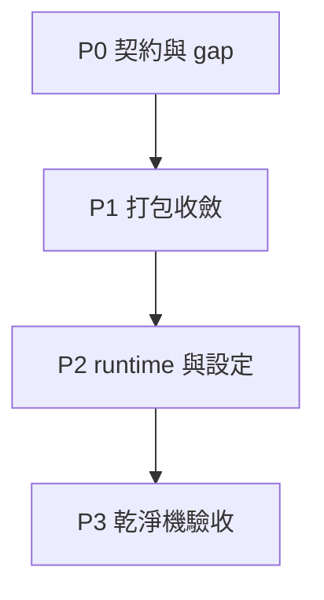

# trainer_hightier — Packaging（Working / execution plan）

本文件為 **Working / execution plan**，承接 [`doc/Packaging - IMPLEMENTATION_PLAN.md`](Packaging%20-%20IMPLEMENTATION_PLAN.md)，記錄可執行任務、依賴、DoD 與驗收證據；**不**重寫產品 SSOT。

## 執行護欄

- 預設 `high_adt_only=true`；除錯外不可用全量模式冒充正式。
- `training_metrics.json` 若含 `adt_allowlist_sha256`，建包與 runtime 預設須 **hash 一致**（建包階段 `_verify_allowlist_training_hash_or_raise` fail-fast）。
- 打包不包含 raw CH mirror／訓練中間大檔。
- `state.db` 與 API 欄位契約維持相容。
- 秘密（CH 帳密等）不入 bundle；由目標機 `.env` 或既有機密注入機制提供（與 implementation plan 對齊）。
- 目標機依賴安裝 **允許從 PyPI 下載**；`requirements.txt` 應鎖版本以降低漂移；若環境無法連 PyPI，則以 bundle 內可選 `wheels/` 作備援（非硬性，見 implementation plan D-002）。

## 目前狀態 vs 目標狀態

| 維度 | 目前（過渡／Artifact Bundle） | 目標（正式／Standalone Runtime Bundle） |
|------|-------------------------------|---------------------------------------------|
| 交付內容 | `models/`、`snapshots/`、`mapping/`、`deploy_bundle_paths.json`、`bundle_info.json`、`README_DEPLOY.md`、`requirements.txt` | 上述 **加上** 可直接啟動入口（`main.py` 或等效）、`.env.example`（或等效 template）、**可在標準 PyPI 路徑安裝的** `requirements.txt`（版本鎖定）；**可選** `wheels/` 供離線／鏡像加速 |
| 目標機前置 | 常需 **repo checkout** 或已安裝可 `import trainer`、`trainer_hightier` 的環境 | **乾淨機器**：venv + `pip install -r requirements.txt`（可連 PyPI）後即可啟動，**不需要 repo** |
| 建包前置 | 預設 snapshot 目錄須已有 `active_manifest.json`，否則建包失敗 | 同左為過渡行為；工作項需補「manifest 缺失」的前置／覆寫流程與文件，避免 production 卡死 |

## 與 implementation plan 里程碑對照（M1–M6）

| 里程碑 | Working 層對應（完成即視為達成） |
|--------|----------------------------------|
| M1 | Phase 1：打包輸出含契約內 artifacts + 契約檔；strict 可跑通 |
| M2 | Phase 1：strict preflight + allowlist hash parity 可攔截 |
| M3 | Phase 3：`no_repo_smoke` checklist 全綠 |
| M4 | Release gate：`high_adt_only` + 啟動 log 可觀測 model/manifest/allowlist |
| M5 | Phase 1：同一 `model_version` 連續建包，`bundle_info` / 關鍵 hash 一致 |
| M6 | Phase 3：zip 與 folder 兩條路徑驗收 + 回滾演練有紀錄 |

## 工作分解（Phase 0–3）

### Phase 0：契約凍結與落差校正

| ID | 任務 | 依賴 | Definition of done |
|----|------|------|-------------------|
| P0-1 | 凍結 **Runtime Bundle** 必帶／可選檔案清單（與 implementation plan `Packaging Contract` 一致） | — | `IMPLEMENTATION_PLAN` 契約段落與本文件「Release gate」一致且無矛盾 |
| P0-2 | 文件化 **Artifact → Runtime** 落差：列出現況 `build_deploy_package` / `deploy.main` 與目標差異（程式實作可後續補，本 phase 只做執行層契約） | P0-1 | Working 文件內有「Gap 清單」小節（見下）且 RUNBOOK 有連結或摘要 |
| P0-3 | 定義 `active_manifest.json` 缺失時的 **操作修復路徑**（`--snapshot-manifest-source`、或先跑 `snapshot_updater` 等），並納入發佈檢查清單 | — | `RUNBOOK.md` 或本文件 CLI 段落含明確步驟與錯誤對應 |

**Gap 清單（執行層追蹤，實作完成後一項項勾銷）**

- [x] bundle 內含 `main.py`（或等效）且啟動指令不依賴 repo root。
- [x] bundle 內含 `.env.example`（或等效 template），與 CH 憑證注入方式一致。
- [x] `requirements.txt` 可在 **無 repo** 機器上透過 **PyPI** 補齊 runtime（必要時鎖版本）；建包預設帶 `wheels/trainer_hightier-*.whl`，無 PyPI 時可擴充為完整離線 wheels／內部鏡像（對照 implementation plan D-002）。
- [x] `README_DEPLOY.md` 描述「僅 bundle + pip + secrets」的完整路徑（與 `main.py` 一致）。

### Phase 1：打包核心與 artifact 收斂（Frozen）

| ID | 任務 | 依賴 | Definition of done |
|----|------|------|-------------------|
| P1-1 | 以 `--model-source`／`--model-version` 建包，驗證 `models/`、`snapshots/`、`mapping/`、`bundle_info.json`、`deploy_bundle_paths.json` 齊備 | P0-1 | 單一 model version 可重複建包，`bundle_info` 與 allowlist/slow（如有記錄）一致 |
| P1-2 | 驗證 manifest 路徑重寫後，`ActiveSnapshotManifest.from_dict(..., manifest_dir=...)` 可解析至 bundle 內檔案 | P1-1 | 測試或人工 checklist：指向的 parquet 均存在 |
| P1-3 | strict 下強制 slow + allowlist；`trial_bet_behavior_parquet` 僅在 manifest 宣告時要求可讀（對齊 D-003） | P1-1 | `--strict` 缺檔 fail；非宣告 trial 不阻擋 |
| P1-4 | 確認不依賴打包不必要大檔（對照 `RAW_CH_MIRROR` 類排除原則） | P1-1 | 交付目錄無 `gmwds_t_*` 等 raw mirror |

### Phase 2：runtime 入口與設定契約落地

| ID | 任務 | 依賴 | Definition of done |
|----|------|------|-------------------|
| P2-1 | 收口目標機啟動方式：單一 primary 指令（例如 `python main.py` 或文件中唯一推薦指令） | P0-1, P1-1 | README 與 RUNBOOK 一致 |
| P2-2 | 啟動前檢查：model.pkl、mapping、`active_manifest`、allowlist 存在性；啟動 log 打出 `bundle_info` 關鍵欄位 | P2-1 | 有範例 log 或截圖寫入驗收附件（內部即可） |
| P2-3 | Config contract：`deploy_bundle_paths.json` 為路徑 SSOT；secrets 僅經 `.env`（或組織標準） | P2-1 | 文件列明「不得把 CH 密碼打進 bundle」 |
| P2-4 | 釐清依賴安裝策略：`requirements.txt` 鎖版 + PyPI 為預設；無 PyPI 環境時的 wheels／內部鏡像 SOP | P2-1 | README 或 RUNBOOK 有一段「網路前提 + 備援安裝」 |

### Phase 3：驗證、壓測與交付

| ID | 任務 | 依賴 | Definition of done |
|----|------|------|-------------------|
| P3-1 | 在 **無 repo checkout**、**可連 PyPI** 的乾淨 VM／容器內執行 `pip install -r requirements.txt` + 啟動 smoke | P2-1, M1–M2 程度就緒 | 下節 `no_repo_smoke` 全綠 |
| P3-1b | （可選）在阻斷 PyPI 的環境用 bundle 內 `wheels/`（若有）重跑 install + smoke | P3-1 | 記錄結果；若無 wheels 則標註「僅限可連 PyPI 之正式 gate」 |
| P3-2 | Folder 與 zip 各跑一次：解壓 → install → 啟動 → `/health`（或合約 health 端點） | P3-1 | 兩條路徑留痕（指令 + 結果） |
| P3-3 | 回滾演練：保留上一版 bundle，切換目錄／連結後重啟，確認版本與 hash 恢復 | P3-2 | 簡短 rollback 紀錄 |

## 任務依賴順序（精簡）



## CLI 與操作速查（建包機／開發機）

```bash
# Frozen：僅指定 model 時，預設 snapshot 目錄須已存在 active_manifest.json
# （否則先：python -m trainer_hightier.serving.snapshot_updater --bundle-dir <Step5_bundle>
#  或 --snapshot-manifest-source 指向既有 manifest）
python -m trainer_hightier.build_deploy_package \
  --model-version <YYYYMMDD-HHMMSS-<git7>> \
  [--archive] [--strict/--no-strict]

python -m trainer_hightier.build_deploy_package \
  [--model-source <bundle_dir> | --model-version <id>] \
  [--snapshot-manifest-source <active_manifest.json 或目錄>] \
  [--mapping-source <canonical_mapping.parquet>] \
  [--output-dir <空目錄>] \
  [--archive] [--strict/--no-strict]
# --output-dir 省略時：out/deploy_hightier/<model_version>/

# Standalone 啟動（交付 bundle 根目錄，已 pip install -r requirements.txt）：
python main.py --mode all
# 等效：
python -m trainer_hightier.deploy.main --bundle-dir <交付根> [--mode all|api|scorer|validator]
```

## 過渡實作對照（已完成／已有雛形）

| 迭代 | 內容 | 主要產物 |
|------|------|----------|
| A | 目錄契約、CLI、`bundle_info.json` | `trainer_hightier/build_deploy_package.py` |
| B | 模型／manifest／parquet／mapping 收斂；manifest 路徑相對 `snapshots/` | 同上 + `feature_state_store.ActiveSnapshotManifest.from_dict(manifest_dir=...)` |
| C | strict preflight、allowlist 與 `training_metrics` hash 對齊 | `_verify_allowlist_training_hash_or_raise` |
| D | deploy 統一入口、`set_hightier_serving_deploy_override` | `trainer_hightier/deploy/main.py` |
| E | 測試、RUNBOOK | `trainer_hightier/tests/test_build_deploy_package.py`、`trainer_hightier/RUNBOOK.md` |

## Release gate（含證據）

### 必過項目

- [ ] 交付目錄／zip 符合 Phase 0 凍結契約；無 raw mirror／訓練中間大檔。
- [ ] `GET /health`（或專案合約之健康檢查）通過。
- [ ] `high_adt_only=true` 下 alerting 受 allowlist 約束（可抽樣或 shadow 驗證）。
- [ ] allowlist／manifest／`bundle_info` 版本與 hash 可追溯且互相一致。

### no_repo_smoke（Standalone Runtime 正式 gate，M3）

在 **無** repo、僅 bundle + secrets，且 **可連 PyPI**（或已設定組織允許的 `pip` 索引／proxy）的環境：

- [ ] `python -m venv .venv` 並 activate
- [ ] `cd <bundle_root>` 後 `pip install -r requirements.txt` 成功（相對路徑 `wheels/*.whl` 依 bundle 根目錄解析；見 README_DEPLOY）
- [ ] 依 README 建立 `.env`（自 `.env.example`）
- [ ] 啟動 primary 指令成功（目標：`python main.py` 或文件唯一指令）
- [ ] `/health` 成功；啟動 log 含 `model_version`、`manifest_version`、`allowlist_sha256`（或契約欄位）

**可選（離線備援）**：若正式環境無法連 PyPI，改為驗證 bundle 內 `wheels/` + 文件化 `pip install` 指令仍可完成同等安裝；未提供 wheels 時須在變更單註記網路／鏡像前提。

### 重現性（M5）

- [ ] 同一 `--model-version` 連續建包兩次：比對 `bundle_info.json` 中 `frozen_fingerprint_sha256`（或約定欄位）一致。

## 執行風險與阻擋處置

| 風險 | 徵兆 | 處置（執行層） |
|------|------|----------------|
| 建包時無 `active_manifest` | `default snapshot manifest dir missing` | 先跑 snapshot updater 或 `--snapshot-manifest-source`；更新 RUNBOOK |
| 目標機無法 import `trainer_hightier` | ModuleNotFoundError | 完成 Phase 2–3 Standalone Runtime（`main.py` + pip）；過渡期僅 repo 部署須標註「非正式 gate」 |
| PyPI 不可用或套件版本漂移 | `pip install` 失敗或執行期 import/行為變動 | 鎖定 `requirements.txt` 版本；維護內部鏡像或 bundle 內 `wheels/` 備援 |
| allowlist hash 不一致 | 建包或啟動 fail-fast | 對齊訓練產物與打包 allowlist 來源；禁止 `--no-strict` 上 production |
| bundle 體積與記憶體 | 複製／啟動 OOM | 排除 trial parquet（非必需）、確認不誤帶 raw parquet |

---

**下一步（僅提醒）**：Gap 清單全勾後，本 working plan 的 Phase 2–3 即與 implementation plan「Standalone Runtime Bundle（無 repo、預設 PyPI 安裝）」正式對齊；此前 production gate 以「過渡部署 + 顯式環境前提」註記於變更單。
