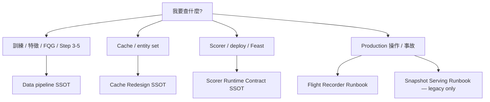

# trainer_hightier Documentation Index

本目錄為 `trainer_hightier` 規劃與營運文件的唯一入口。文件依 **SSOT → Implementation Plan → Working Plan** 三層組織；事故、決策紀錄、Runbook 另列。

**最後整理：** 2026-06-08

---

## 從這裡開始（現行真相）

| 主題 | 文件 | 說明 |
|------|------|------|
| 離線訓練 / 特徵 / FQG / Step 3–5 | [ssot/Data pipeline - SSOT.md](ssot/Data%20pipeline%20-%20SSOT.md) | 訓練管線治理真相 |
| Cache / entity set / invalidation | [ssot/Cache Redesign - SSOT.md](ssot/Cache%20Redesign%20-%20SSOT.md) | 訓練 cache 分層 |
| Scorer / deploy / Feast / 建包 | [ssot/Scorer Runtime Contract - SSOT.md](ssot/Scorer%20Runtime%20Contract%20-%20SSOT.md) | **Serving 側仲裁者**；與舊文件衝突時以此為準 |

### 衝突仲裁規則

1. **Serving / deploy / packaging** → `Scorer Runtime Contract - SSOT.md`
2. **Training pipeline / FQG** → `Data pipeline - SSOT.md`
3. **Cache key / invalidation** → `Cache Redesign - SSOT.md`
4. **Working plan vs Implementation plan** → 先改 IP，再改 WP
5. **Incident vs SSOT** → SSOT 贏；incident 只解釋當時為何改

---

## 目錄結構

```
doc/
├── README.md                 ← 本索引
├── ssot/                     ← 治理真相（3 份）
├── implementation/
│   ├── active/               ← 現行實作計畫
│   └── archive/              ← 歷史參考（pre-scorer-v2 等）
├── working/
│   ├── active/               ← 進行中 execution plan
│   ├── cache-redesign/       ← Cache Phase 1–3（Phase 1–3 已完成）
│   └── archive/              ← 已完成或 superseded WP
├── decisions/                ← 架構決策紀錄
├── incidents/                ← 事故 postmortem（closed）
├── runbooks/
│   ├── active/               ← 現行 operator 手冊
│   └── archive/              ← legacy route runbook
├── templates/                ← schema / 報表模板
├── reports/                  ← 一次性實驗摘要
└── _meta/                    ← Cursor 產物 stub（非 living doc）
```

訓練 / cache 日常操作另見 repo 內 [`../RUNBOOK.md`](../RUNBOOK.md)。

---

## Active workstreams

| 主題 | 層級 | 狀態 | 文件 |
|------|------|------|------|
| Cache redesign Phase 4+ | WP | **active**（Phase 1–3 done） | [working/cache-redesign/](working/cache-redesign/) |
| Short-term PIT perf | IP + WP | **active**（Iteration F pending） | [implementation/active/Short-Term PIT…](implementation/active/Short-Term%20PIT%20Cache%20and%20Materialize%20Performance%20-%20IMPLEMENTATION_PLAN.md) |
| Scorer v2 Feast runtime | IP + WP | **active**（ST-P1/P2） | [implementation/active/Scorer v2…](implementation/active/Scorer%20v2%20Feast%20Runtime%20-%20IMPLEMENTATION_PLAN.md) |
| Feast online refresh | IP | **active** | [implementation/active/Feast Online Refresh…](implementation/active/Feast%20Online%20Refresh%20-%20IMPLEMENTATION_PLAN.md) |
| Feast post-startup supervisor | IP | **active** | [implementation/active/Feast Post-Startup…](implementation/active/Feast%20Post-Startup%20Refresh%20Supervisor%20-%20IMPLEMENTATION_PLAN.md) |
| Feature experimentation | IP + WP | **active** | [working/active/Feature experimentation…](working/active/Feature%20experimentation%20-%20WORKING_PLAN.md) |
| Training acceleration & scope | SSOT + IP + WP | **active** | [ssot/Training Acceleration…](ssot/Training%20Acceleration%20and%20Scope%20-%20SSOT.md) · [implementation/active/Training Acceleration…](implementation/active/Training%20Acceleration%20and%20Scope%20-%20IMPLEMENTATION_PLAN.md) · [working/active/Training Acceleration…](working/active/Training%20Acceleration%20and%20Scope%20-%20WORKING_PLAN.md) |
| Data pipeline | IP | **active** | [implementation/active/Data pipeline…](implementation/active/Data%20pipeline%20-%20IMPLEMENTATION_PLAN.md) |
| Production Flight Recorder | IP + WP + Runbook | **active** | [runbooks/active/Production Flight Recorder…](runbooks/active/Production%20Flight%20Recorder%20-%20RUNBOOK.md) |
| Player cooldown / suppression | IP | **active** | [implementation/active/Player Alert Suppression…](implementation/active/Player%20Alert%20Suppression%20Switch%20-%20IMPLEMENTATION_PLAN.md) |
| Deploy Windows logging | IP | **active** | [implementation/active/Deploy Main Windows…](implementation/active/Deploy%20Main%20Windows%20Console%20+%20File%20Logging%20-%20IMPLEMENTATION_PLAN.md) |
| Production-like E2E gate | IP | **active** | [implementation/active/Production-like Deploy…](implementation/active/Production-like%20Deploy%20E2E%20Gate%20-%20IMPLEMENTATION_PLAN.md) |
| Dynamic schema gate | IP | **active** | [implementation/active/Dynamic Schema Gate…](implementation/active/Dynamic%20Schema%20Gate%20-%20IMPLEMENTATION_PLAN.md) |
| Slow feature train-serve parity | IP | **active** | [implementation/active/Slow Feature…](implementation/active/Slow%20Feature%20Train-Serve%20Parity%20-%20IMPLEMENTATION_PLAN.md) |

---

## Done（保留參考，非 active backlog）

| 主題 | 文件 | 備註 |
|------|------|------|
| Cache Phase 1 | [working/cache-redesign/Cache Redesign - WORKING_PLAN.md](working/cache-redesign/Cache%20Redesign%20-%20WORKING_PLAN.md) | source manifest v2 |
| Cache Phase 2 | [working/cache-redesign/… Phase 2.md](working/cache-redesign/Cache%20Redesign%20-%20WORKING_PLAN%20Phase%202.md) | entity set v1 |
| Cache Phase 3 | [working/cache-redesign/… Phase 3.md](working/cache-redesign/Cache%20Redesign%20-%20WORKING_PLAN%20Phase%203.md) | labels + short PIT primitive cache |

---

## Historical / archive（pre-scorer-v2 Parquet route）

以下文件**不得**作為現行 production scorer 主路徑依據；細節以 [Scorer Runtime Contract - SSOT.md](ssot/Scorer%20Runtime%20Contract%20-%20SSOT.md) 為準。

| 文件 | 說明 |
|------|------|
| [implementation/archive/Packaging - IMPLEMENTATION_PLAN.md](implementation/archive/Packaging%20-%20IMPLEMENTATION_PLAN.md) | 舊建包 gate |
| [implementation/archive/Self-contained - IMPLEMENTATION_PLAN.md](implementation/archive/Self-contained%20-%20IMPLEMENTATION_PLAN.md) | 舊 runtime 去耦 |
| [implementation/archive/Feature Candidate Registry - IMPLEMENTATION_PLAN.md](implementation/archive/Feature%20Candidate%20Registry%20-%20IMPLEMENTATION_PLAN.md) | registry 舊 IP |
| [implementation/archive/Mid-Term Feature Snapshot - IMPLEMENTATION_PLAN.md](implementation/archive/Mid-Term%20Feature%20Snapshot%20-%20IMPLEMENTATION_PLAN.md) | 訓練語意仍有參考價值；production 段已過期 |
| [implementation/archive/Serving pipeline - IMPLEMENTATION_PLAN.md](implementation/archive/Serving%20pipeline%20-%20IMPLEMENTATION_PLAN.md) | pre-scorer-v2 serving 架構 |
| [implementation/archive/Production Snapshot Serving - MANIFEST_INVENTORY.md](implementation/archive/Production%20Snapshot%20Serving%20-%20MANIFEST_INVENTORY.md) | legacy manifest 鍵 |
| [runbooks/archive/Production Snapshot Serving - RUNBOOK.md](runbooks/archive/Production%20Snapshot%20Serving%20-%20RUNBOOK.md) | legacy Parquet refresh |
| [working/archive/Packaging - WORKING_PLAN.md](working/archive/Packaging%20-%20WORKING_PLAN.md) | 承接 historical Packaging IP |

---

## Decision records

| 文件 | 狀態 |
|------|------|
| [decisions/Feast Production Feasibility Spike - DECISION_RECORD.md](decisions/Feast%20Production%20Feasibility%20Spike%20-%20DECISION_RECORD.md) | **adopted** — scorer v2 mid/long Feast online |
| [decisions/Mid-Term Feature Snapshot - DECISION_RECORD.md](decisions/Mid-Term%20Feature%20Snapshot%20-%20DECISION_RECORD.md) | **partial** — training 段有效；production Parquet 段見 SSOT |

---

## Incidents（closed，永久保留）

| 日期 | 文件 |
|------|------|
| 2026-05-19 | [incidents/Feature Serving Incident - 20260519.md](incidents/Feature%20Serving%20Incident%20-%2020260519.md) |
| 2026-05-20 | [incidents/Training Step 3.5 Mid-Term Snapshot Incident - 20260520.md](incidents/Training%20Step%203.5%20Mid-Term%20Snapshot%20Incident%20-%2020260520.md) |
| 2026-05-22 | [incidents/Mid-Term Feast Train-Serve Parity Incident - 20260522.md](incidents/Mid-Term%20Feast%20Train-Serve%20Parity%20Incident%20-%2020260522.md) |

---

## Templates & reports

| 文件 | 用途 |
|------|------|
| [templates/Training logs - TEMPLATE.md](templates/Training%20logs%20-%20TEMPLATE.md) | `run_report.json` schema |
| [reports/high_tier_mvp_performance_summary_20260516_20260517.md](reports/high_tier_mvp_performance_summary_20260516_20260517.md) | 一次性模型比較摘要 |

---

## 文件生命週期（新增文件時）

1. 先決定層級：需要新 SSOT，還是在既有 SSOT 下開 IP？
2. 需要 ticket 級拆解才開 WP；**每主題最多 1 active WP**。
3. 在本 README 登記 `status`。
4. 完成 → WP 標 done，必要時移入 `working/archive/`。
5. 被取代 → 加 historical banner + 移入 `implementation/archive/` 或 `runbooks/archive/`。
6. 勿在 `doc/` 根目錄新增 Cursor `.plan.md`；產物放 `_meta/` 或刪除。

---

## 決策樹：我該讀哪份？


