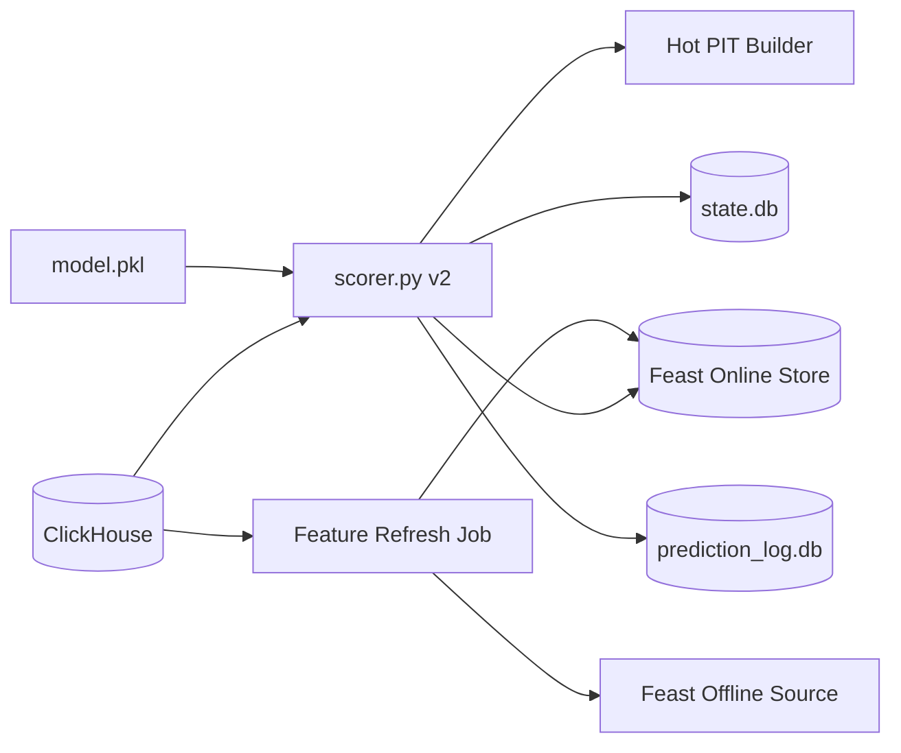

# Scorer v2 Feast Runtime - Implementation Plan

本文件是 **Implementation plan 層**，定義 `trainer_hightier` scorer v2 的 realization strategy、模組邊界、階段里程碑、風險與驗證策略。本文不展開 ticket 級工作清單；具體 task 拆解應放到後續 working / execution plan。

## Context

現有 `trainer_hightier.serving.scorer` 已累積過多 patch：同一主流程同時負責 ClickHouse 增量抓取、allowlist、watermark、hot feature pool、Parquet snapshot join、freshness gate、prediction log、alert 寫入與 daemon loop。這讓 supplier contract 遷移和 Feast 導入都變得高風險。

Feast feasibility spike 已證明 allowlist 範圍內的 production compute path + online lookup 在速度上可行：

- mid-term：ClickHouse export + DuckDB compute 約 6.1 分鐘；Feast lookup 約 0.39 ms/entity。
- long-term：ClickHouse export + DuckDB compute 約 3.8 分鐘；Feast lookup 約 0.14 ms/entity。
- 主要剩餘風險不是 lookup latency，而是 mid-term coverage、`prior_*` NULL policy、refresh ownership、以及 scorer readiness gate。

## Adopted Decisions

- Scorer v2 直接替換現有 `trainer_hightier.serving.scorer` 主流程，保留 CLI 與外部 runtime contract。
- Scorer v2 第一版直接導入 Feast online lookup：
  - mid-term `fe__*` 由 Feast online store 供應。
  - long-term `patron__*__w180d_m1snap` 由 Feast online store 供應。
  - raw baseline 欄位仍由 ClickHouse scoring input 供應。
  - hot/event-level `feast_trial_1h` / `bet__*__w1h` 仍由 scorer 的 bounded PIT builder 供應。
  - short-term `fe__*` 暫不強制走 Feast；先保留 declared online/micro-batch supplier boundary。
- 不保留 scorer runtime fallback 到 legacy training Parquet。Feast readiness 不通過時，scorer 應 fail fast 或進入明確 debug mode，不可默默改用舊 supplier。
- Production scope 仍是 ADT allowlist only；`wider_sample` 不作為 production gate。

## Target Architecture

Scorer v2 的核心原則是把 heavy feature computation 移出 request-time scoring path。每日或排程 refresh job 負責 ClickHouse export、DuckDB materialization、Feast materialize；scorer 只針對本輪新 bet 做 bounded hot feature 計算與 Feast online lookup。

## Module Boundaries

### 1. Scorer Orchestration

`trainer_hightier.serving.scorer` 應成為薄 orchestration layer：

- 載入 model bundle、frozen registry、runtime config。
- 讀取 active allowlist 與 Feast readiness metadata。
- 以 ETL cursor 從 ClickHouse 抓取下一批可見 bet。
- 套用 high-ADT allowlist。
- 建立 raw + hot event-level features。
- 對 canonical ids 批次查詢 Feast mid/long features。
- 執行 feature readiness gate。
- `predict_proba` 後寫入 prediction log 與 alerts。
- 僅在整批成功 durable write 後推進 ETL cursor。

### 2. Feature Supplier Resolver

新增或重構明確的 supplier resolver，責任是把 `model.pkl.feature_columns` 映射到 runtime supplier：

| Feature family | Runtime supplier |
|----------------|------------------|
| `baseline_model` | ClickHouse scoring input |
| `feast_trial_1h` / `bet__*__w1h` | scorer bounded PIT builder |
| mid-term `fe__*` | Feast online lookup |
| long-term `patron__*__w180d_m1snap` | Feast online lookup |
| short-term `fe__*` | declared online/micro-batch supplier; no silent fallback |

Resolver 必須使用 frozen registry，不可只靠欄位前綴猜測。未分類、重複 supplier、或 supplier 缺失都應在 scorer readiness 階段 fail fast。

### 3. Feast Online Adapter

Feast adapter 應是 scorer v2 唯一接觸 Feast SDK 的邊界：

- 接受一批 `canonical_id` / event timestamp metadata。
- 用 dict-of-lists `entity_rows` 執行 batch `get_online_features`。
- 回傳與 scorer batch 對齊的 DataFrame。
- 記錄 lookup latency、row count、missing count、feature family missing rate。
- 對 Feast schema / feature service 名稱做啟動時 smoke check。

Adapter 不負責 feature computation，也不負責 NULL imputation。

### 4. Refresh / Materialize Plane

Refresh plane 負責把 production feature values 推進 Feast online store：

- mid-term：ClickHouse cleaned bet source + DuckDB canonical daily snapshot。
- long-term：ClickHouse cleaned session source + DuckDB canonical slow snapshot。
- apply / materialize Feast definitions。
- 寫入 readiness metadata：latest anchor、generated_at、coverage、row count、null summary、source scope。

這個 plane 可重用現有 spike materializer 與 production materialize 模組，但不應放進 scorer scoring loop。

### 5. State and Logging

保留現有 outward contract：

- `state.db` 的 `alerts` / `validation_results` schema 相容。
- `prediction_log.db` 繼續記錄全部 scored rows。
- prediction log 必須增加或保留可觀測欄位：
  - Feast lookup status。
  - mid/long anchor。
  - freshness / degraded status。
  - feature missing counts。
  - supplier route summary。

Cursor 推進規則必須修正為：一批 rows 完成 feature gate、prediction、prediction log、alerts 寫入後，cursor 推進到該批成功 scored rows 的最大 ETL cursor；不得只以 alert rows 推進。

## Readiness Gates

### Deploy-Time Gate

Production deploy 在啟動 scorer v2 前必須驗證：

- model bundle、frozen registry、allowlist、canonical mapping 可讀。
- Feast repo / feature service 已 apply，online store reachable。
- required mid/long features 的 latest anchor 覆蓋 scoring policy。
- source scope 為 production，不接受 training-scoped artifact。
- null summary 符合已批准 policy。
- allowlist sample 的 online lookup smoke test 通過。

Deploy-time gate 不通過時，不啟動正式 scorer。

### Scoring-Time Gate

每輪 scoring 必須驗證：

- 每個 `model.pkl.feature_columns` 都存在。
- required feature family 不可整族 all-null。
- Feast lookup row count 與 scoring batch 對齊。
- wrong-grain、missing anchor、training-scoped metadata 都是 hard failure。
- stale-but-allowed 只能在 hard cap 內 degraded run，且必須寫入 prediction log。

## NULL and Coverage Policy

Feast spike 顯示 mid-term 主要風險是 `prior_*` NULL 與單日 active coverage。Scorer v2 不應在 implementation 中自行決定 imputation。

第一版採取保守 policy：

- 不做 silent fill。
- 若模型訓練時允許 NULL 作為 signal，scorer 可保留 NULL 進模型，但必須在 prediction log 中標記。
- 若 required feature family 對整批或高比例 rows 缺失，scoring-time gate 應 fail 或 degraded，依 SSOT 的 hard cap / waiver 決策執行。
- allowlist patron 無 mid-term row 的語意必須由 SSOT 或 decision record 明確批准後才能放行。

## Workstreams / Phases

### Phase 0: Contract Alignment

- 更新 scorer runtime contract，將 Feast mid/long supplier 從 experimental reference 升級為 adopted scorer v2 supplier。
- 明確保留 non-goal：scorer 不做 heavy daily mid/long compute。
- 記錄 mid-term NULL / no-row policy 的放行條件。

### Phase 1: Scorer Core Rewrite

- 重寫 `trainer_hightier.serving.scorer` 主流程，保留 CLI 相容。
- 建立清楚的 cycle boundary：fetch -> feature build -> predict -> durable writes -> cursor advance。
- 移除 legacy Parquet fallback 作為正式 scorer path。
- 將 alert subset 與 all-scored prediction log 明確分離。

### Phase 2: Feast Runtime Integration

- 建立 Feast online adapter。
- 將 mid-term `fe__*` 與 long-term `patron__*__w180d_m1snap` 透過 adapter 供應。
- 增加 online lookup metrics 與 readiness smoke check。
- 對 Feast unavailable、schema mismatch、lookup row mismatch 定義 hard failure。

### Phase 3: Refresh Plane Integration

- 將 spike 中驗證過的 ClickHouse -> DuckDB -> Feast materialize path 接入 production refresh ownership。
- 使 refresh job 寫入 scorer 可讀的 readiness metadata。
- 保留 shared / incremental export 的擴充方向，降低每日 full pull 對 ClickHouse 與本機 RAM 的壓力。

### Phase 4: Validation and Rollout

- 用相同 model bundle 驗證 scorer v2 feature columns 完整性。
- 建立 synthetic / fixture tests 覆蓋 cursor advance、Feast missing behavior、allowlist filtering、alert write。
- 在受控 production run 驗證 lookup latency、memory footprint、ClickHouse query rows、prediction log missing counts。
- 驗證 validator / API 對 `state.db` 的相容性。

## Milestones

- M1：scorer v2 可在 `--once` 模式完成一批 ClickHouse bet scoring，並正確寫入 prediction log / alerts。
- M2：Feast mid/long online lookup 接入，且 feature readiness gate 覆蓋 missing / schema mismatch / stale metadata。
- M3：refresh plane 可產出 scorer v2 使用的 Feast online features 與 readiness metadata。
- M4：舊 scorer main flow 被 v2 主流程替換，CLI 與 downstream `state.db` contract 不破壞。
- M5：production dry run 通過 latency、memory、coverage、NULL observability 驗證。

## Risks and Mitigations

- 風險：Feast online store 不可用會直接阻斷 scoring。
  - 緩解：啟動前 smoke check；runtime hard failure 清楚告警；不做 silent Parquet fallback。
- 風險：mid-term coverage 低導致大量 rows 缺 feature。
  - 緩解：把 no-row / NULL policy 前置到 contract；prediction log 記錄 missing counts；必要時先 degraded shadow / dry run。
- 風險：refresh full export 對 ClickHouse 或本機 RAM 壓力過高。
  - 緩解：保留 chunked allowlist export；優先做 shared export；後續導入 incremental export。
- 風險：直接替換 `scorer.py` 造成 validator / API contract 回歸。
  - 緩解：保留 `state.db` alerts schema；以 fixture 驗證 API 需要欄位；prediction log 作為 audit fallback。
- 風險：cursor advance 再次出現重複或漏處理。
  - 緩解：cursor 只在整批 durable write 後推進到 all-scored rows max cursor；用 unit tests 覆蓋 alert / non-alert 混合 batch。

## Validation Strategy

- Unit tests：
  - supplier resolver 對 frozen registry 的分類。
  - Feast adapter row alignment 與 missing feature handling。
  - cursor advance 對 alert / non-alert mixed batch。
  - `high_adt_only` allowlist filtering。
- Integration tests：
  - fake ClickHouse batch + fake Feast response + real model bundle smoke。
  - missing Feast feature / stale anchor / wrong schema hard failure。
  - prediction log 與 alert schema compatibility。
- Production dry run：
  - `--once` bounded batch。
  - 記錄 batch size、lookup latency、RAM、ClickHouse rows、missing counts。
  - 與 Feast spike report 的 latency expectation 對照。

## Assumptions

- Feast integration 已被採納為 scorer v2 mid/long supplier path。
- Production scoring scope 仍為 high-ADT allowlist。
- Short-term `fe__*` 不在第一版強制 Feast 化。
- Existing validator / API 仍依賴 `state.db` contract，因此 scorer v2 必須保留 outward DB compatibility。
- 若 `Scorer Runtime Contract - SSOT.md` 與本文衝突，應先更新 SSOT，再進行 scorer v2 implementation。
