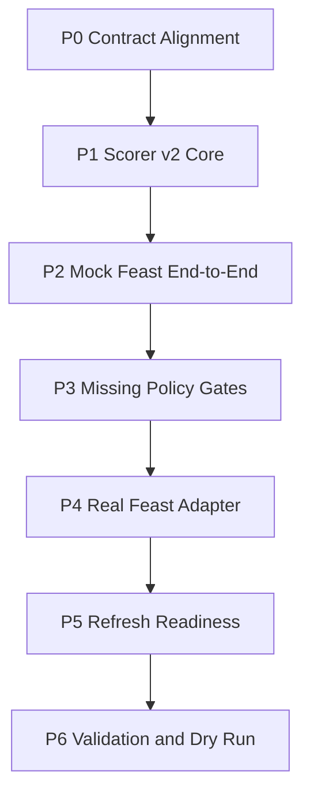

# Scorer v2 Feast Runtime - Working Plan

本文件是 **Working / execution plan 層**，承接：

- SSOT：`Scorer Runtime Contract - SSOT.md`
- Implementation plan：`Scorer v2 Feast Runtime - IMPLEMENTATION_PLAN.md`
- Decision record：`Feast Production Feasibility Spike - DECISION_RECORD.md`

本文件只拆解可執行工作、依賴、Definition of Done、建議順序與驗收證據；不重新定義 scorer v2 的產品範圍或架構。若本文件與 SSOT / implementation plan 衝突，先更新上層文件再執行。

## 已定前置決策

- 第一個可交付 slice 採 **thin end-to-end**：以 fake/mock Feast adapter 先跑通 `fetch -> feature build -> predict -> durable writes -> cursor advance`。
- `trainer_hightier.serving.scorer` 主流程直接由 v2 替換；只保留必要 entrypoint / CLI 形狀與外部 `state.db` contract。
- mid-term `fe__*` 與 long-term `patron__*__w180d_m1snap` 的正式 supplier 是 Feast online lookup。
- short-term `fe__*` 第一版不強制 Feast 化；production scorer v2 由 bounded on-the-fly PIT builder 供應，且只支援目前部署模型需要的欄位。
- `fe_short_term_parquet` 不可進入 production scorer control flow；測試 fixture 必須透過 mock / fixture injection，不可形成 production runtime fallback branch。
- 正常 cell-level NULL 允許進模型，但必須記錄 missing counts / degraded status。
- Feast entity row missing 不等同正常 NULL：第一版採 **skip missing rows + prediction-log audit status**。
- Feast entity row missing 比例 **> 10%** 時，整批 hard fail，避免 refresh / key / mapping 系統性問題被靜默吞掉。
- 不允許 production scorer runtime fallback 到 legacy training Parquet、`fe_derived_parquet` 或 `fe_short_term_parquet`，不提供 production debug fallback。

## 執行護欄

- 避免在 scorer request-time 做 heavy mid/long feature computation；refresh / materialize plane 另行處理。短期 `fe__*` 僅允許 bounded PIT 計算，必須受 batch size、player fanout、lookback 限制。
- 每批成功 durable write 後，cursor 推進到 **all successfully scored rows** 的最大 ETL cursor，不得只用 alert rows。
- 所有新路徑必須考慮筆電 / 小型 production box 的 RAM：batch size、lookup rows、prediction log 寫入都要有 bounded behavior。
- 不把 ClickHouse credentials、Feast online store credentials 或環境差異塞進環境變數控制行為；runtime 行為設定應收斂在既有 config / Python config。
- 不新增多餘架構層。第一輪只允許為 scorer v2 必要邊界新增小型 adapter / helper。

## 建議執行順序

## Phase 0: Contract Alignment

目的：先讓文件 contract 接受 Feast mid/long 作為 scorer v2 adopted supplier，避免 implementation 和 SSOT 互相打架。

- ID: `P0-1`
  - Task: 更新 `Scorer Runtime Contract - SSOT.md`，將 Feast mid/long supplier 從 experimental reference 升級為 scorer v2 adopted runtime path。
  - Owner: agent
  - Dependencies: 已定前置決策
  - Definition of Done: SSOT 明確列出 mid-term `fe__*` / long-term `patron__*__w180d_m1snap` 可由 Feast online supplier 供應，且保留 no silent fill / no training artifact rule。

- ID: `P0-2`
  - Task: 更新 `Feast Production Feasibility Spike - DECISION_RECORD.md` 狀態，標記 spike 已進入 scorer v2 integration planning，不再只是 reference。
  - Owner: agent
  - Dependencies: `P0-1`
  - Definition of Done: 文件指出 scorer v2 採用 Feast mid/long；short-term Feast 仍非第一版 scope，short-term `fe__*` production supplier 為 bounded PIT builder。

- ID: `P0-3`
  - Task: 將 missing policy 寫入 contract：cell-level NULL allowed + logged；entity row missing skip + audit；batch missing rate > 10% hard fail。
  - Owner: agent
  - Dependencies: `P0-1`
  - Definition of Done: SSOT 或 implementation plan 可追溯這三條 runtime policy。

## Phase 1: Scorer v2 Core Rewrite

目的：把 `trainer_hightier.serving.scorer` 從 patch-heavy monolith 改成清楚 cycle boundary 的 orchestration layer。

- ID: `P1-1`
  - Task: 重新組織 `score_once` 主流程為明確階段：load context、fetch batch、feature build、supplier lookup、feature gate、predict、write logs / alerts、advance cursor。
  - Owner: agent
  - Dependencies: `P0-1`
  - Definition of Done: `score_once` 不再混合 legacy fallback 決策；每個階段有可單測的 helper boundary。

- ID: `P1-2`
  - Task: 修正 cursor ownership：只有一批 rows 已完成 prediction log / alerts durable write 後才推進 cursor。
  - Owner: agent
  - Dependencies: `P1-1`
  - Definition of Done: mixed alert / non-alert batch 會推進到 all-scored rows max cursor；無 alert batch 也會正確推進。

- ID: `P1-3`
  - Task: 保留必要 CLI contract：`--once`、`--bundle-dir`、`--canonical-mapping`、`--adt-allowlist`、`--no-high-adt-only` 等仍支援的 operator 入口不破壞；移除不必要 legacy supplier 參數的 production 語意。
  - Owner: agent
  - Dependencies: `P1-1`
  - Definition of Done: 既有 entrypoint 可啟動 scorer v2，外部 deploy command 不需改名；legacy supplier 參數若仍暫存，只能 fail fast 或被明確標為 ignored/deprecated，不能啟動 fallback。

- ID: `P1-4`
  - Task: 移除正式 scorer path 對 legacy `fe_derived_parquet` / `fe_short_term_parquet` / training Parquet 的 runtime fallback。
  - Owner: agent
  - Dependencies: `P1-1`
  - Definition of Done: production scorer 缺 Feast / bounded short-term PIT supplier 時 fail fast；production code 不存在 legacy/debug fallback branch。

- ID: `P1-5`
  - Task: 移除 production scorer 對 `manifest.fe_short_term_parquet` 的 runtime dependency，改以 bounded PIT builder 供應 short-term `fe__*`。
  - Owner: agent
  - Dependencies: `P1-1`, `P1-4`
  - Definition of Done: 含 short-term `fe__*` 的模型不再要求 manifest `fe_short_term_parquet`；unsupported short-term columns 會列名 fail fast。

## Phase 2: Mock Feast End-to-End Slice

目的：先不接真 Feast，用 mock adapter 跑通 scorer v2 end-to-end，降低一次導入太多外部變數的風險。

- ID: `P2-1`
  - Task: 定義 Feast online adapter interface，例如接受 scoring batch 與 required feature columns，回傳 aligned feature frame 與 lookup diagnostics。
  - Owner: agent
  - Dependencies: `P1-1`
  - Definition of Done: scorer 主流程只依賴 interface，不直接依賴 Feast SDK。

- ID: `P2-2`
  - Task: 實作 fake/mock Feast adapter，用 fixture DataFrame 模擬 mid/long lookup 成功、cell-level NULL、entity row missing。
  - Owner: agent
  - Dependencies: `P2-1`
  - Definition of Done: tests 可不連 Feast / ClickHouse 驗證 scorer feature supplier behavior。

- ID: `P2-3`
  - Task: 建立 supplier resolver：用 frozen registry 把 model feature columns 分派到 raw、hot / short-term PIT builder、Feast mid/long。
  - Owner: agent
  - Dependencies: `P2-1`
  - Definition of Done: unknown source、duplicate supplier、missing supplier 會在 readiness gate fail fast。

- ID: `P2-5`
  - Task: 實作 short-term `fe__*` bounded PIT supplier，只覆蓋目前部署模型需要的 `<24h` 特徵與複合特徵依賴。
  - Owner: agent
  - Dependencies: `P1-5`, `P2-3`
  - Definition of Done: 目前模型 short-term `fe__*` 可不依賴 Parquet 產出；計算受 lookback / fanout / batch size 限制，避免 OOM 或長時間 query；非目前模型欄位列名 fail fast，不做通用 builder。

- ID: `P2-4`
  - Task: 用 mock Feast 跑通 `--once` 風格的 scorer smoke：輸入小 batch，產生 prediction log 與 alert subset。
  - Owner: agent
  - Dependencies: `P1-2`, `P2-2`, `P2-3`, `P2-5`
  - Definition of Done: 不需 live Feast 即可驗證 scorer v2 cycle boundary、cursor、writes。

## Phase 3: Missing Policy and Readiness Gates

目的：把 NULL 與 entity row missing 的語意落成程式 gate，避免 production 靜默漏分或靜默填值。

- ID: `P3-1`
  - Task: 實作 cell-level NULL observability：允許模型可接受的 NULL，但 prediction log 記錄 per-row missing feature count / family summary。
  - Owner: agent
  - Dependencies: `P2-4`
  - Definition of Done: `prior_*` 類結構性 NULL 不會 hard fail；audit 可查。

- ID: `P3-2`
  - Task: 實作 entity row missing policy：Feast family 整列缺失的 scoring row 先 skip，不進 `predict_proba`。
  - Owner: agent
  - Dependencies: `P3-1`
  - Definition of Done: skipped rows 寫入 prediction log prediction status（例如 `skipped_feast_entity_missing`）；不會被當作 all-null features 進模型，也不只停留在 process log。

- ID: `P3-3`
  - Task: 實作 batch-level missing threshold：entity row missing rate > 10% 時整批 hard fail。
  - Owner: agent
  - Dependencies: `P3-2`
  - Definition of Done: tests 覆蓋 0%、低於 10%、高於 10% 三種情境。

- ID: `P3-4`
  - Task: 實作 scorer readiness summary：每輪或啟動時輸出 supplier route、required columns、lookup status、missing counts。
  - Owner: agent
  - Dependencies: `P3-3`
  - Definition of Done: failure message 可指出是哪個 supplier / feature family / threshold 失敗，包含 unsupported short-term `fe__*` 列表。

## Phase 4: Real Feast Adapter

目的：在 scorer v2 已能用 mock 跑通後，接入真 Feast online lookup。

- ID: `P4-1`
  - Task: 實作 Feast SDK adapter，使用 dict-of-lists `entity_rows` 批次呼叫 `get_online_features`。
  - Owner: agent
  - Dependencies: `P2-1`, `P3-4`
  - Definition of Done: adapter 回傳與 input batch row order 對齊的 DataFrame；記錄 lookup latency 與 row counts。

- ID: `P4-2`
  - Task: 加入 Feast schema / feature service smoke check。
  - Owner: agent
  - Dependencies: `P4-1`
  - Definition of Done: feature service missing、feature name mismatch、entity key type mismatch 會在啟動或 dry run fail fast。

- ID: `P4-3`
  - Task: 將 scorer v2 supplier resolver 從 mock adapter 切到真 Feast adapter，同時保留 tests 可注入 mock。
  - Owner: agent
  - Dependencies: `P4-1`, `P4-2`
  - Definition of Done: production path 用真 Feast；unit / integration tests 不需真 Feast。

## Phase 5: Refresh Readiness Integration

目的：確保 scorer 查到的是 production-scoped、fresh、可稽核的 Feast online features。

- ID: `P5-1`
  - Task: 定義 scorer 可讀的 Feast readiness metadata：latest anchor、generated_at、coverage、row count、null summary、source scope。
  - Owner: agent
  - Dependencies: `P4-2`
  - Definition of Done: metadata 可由 scorer readiness gate 讀取；training-scoped source 不可通過。

- ID: `P5-2`
  - Task: 將現有 spike / production materialize path 的輸出和 readiness metadata 對齊。
  - Owner: agent
  - Dependencies: `P5-1`
  - Definition of Done: refresh job 成功後，scorer 可判斷 mid/long latest anchor 與 freshness。

- ID: `P5-3`
  - Task: 建立 allowlist sample online lookup smoke。
  - Owner: agent
  - Dependencies: `P4-3`, `P5-2`
  - Definition of Done: deploy / dry run 能用小樣本驗證 online store reachable、key type 正確、missing rate 未超過 policy。

## Phase 6: Validation and Dry Run

目的：用測試和受控 dry run 證明 scorer v2 可替換舊主流程。

- ID: `P6-1`
  - Task: 單元測試 scorer v2 cursor advance、supplier resolver、short-term PIT builder、mock Feast missing policy、prediction log / alerts write。
  - Owner: agent
  - Dependencies: `P3-3`
  - Definition of Done: 覆蓋 alert / non-alert mixed batch、no alert batch、skipped rows、missing rate fail、short-term unsupported column fail-fast。

- ID: `P6-2`
  - Task: integration smoke：fake ClickHouse batch + mock Feast + real model bundle，跑到 `predict_proba` 與 writes。
  - Owner: agent
  - Dependencies: `P2-4`, `P6-1`
  - Definition of Done: 無 live external service 下可重現 scorer v2 end-to-end。

- ID: `P6-3`
  - Task: real Feast dry run：bounded `--once` batch，記錄 lookup latency、RAM、ClickHouse rows、missing entity rate、cell-level NULL counts。
  - Owner: user + agent
  - Dependencies: `P4-3`, `P5-3`
  - Definition of Done: dry run report 顯示 missing entity rate <= 10%，且 latency / memory 沒有超出 laptop / production box 可接受範圍。

- ID: `P6-4`
  - Task: validator / API compatibility check：確認 `state.db` alerts schema 與既有 downstream 讀取不破壞。
  - Owner: agent
  - Dependencies: `P6-2`
  - Definition of Done: 既有 validator / API smoke 能讀取 scorer v2 寫出的 alerts。

## 建議迭代分組

- Iteration 1：`P0-1` 到 `P2-4`
  - 目標：mock Feast scorer v2 最小 end-to-end。
  - Exit：可在測試中跑通 fetch-like batch、features、predict、prediction log、alerts、cursor。

- Iteration 2：`P3-1` 到 `P3-4`
  - 目標：missing policy 與 readiness gates 可測。
  - Exit：cell-level NULL allowed；entity row missing skip；>10% hard fail。

- Iteration 3：`P4-1` 到 `P5-3`
  - 目標：真 Feast adapter 與 refresh readiness metadata 接上。
  - Exit：allowlist sample lookup smoke 通過。

- Iteration 4：`P6-1` 到 `P6-4`
  - 目標：替換前驗證。
  - Exit：bounded production dry run 可接受，validator / API 相容。

## Release Gate

Scorer v2 不應標記 production-ready，除非以下項目全數通過：

- CLI 相容：既有 scorer entrypoint 可啟動 v2。
- Feature supplyability：每個 `model.pkl.feature_columns` 有唯一 runtime supplier。
- Short-term readiness：目前模型所需 short-term `fe__*` 由 bounded PIT builder 供應；production readiness 不接受 `fe_short_term_parquet`。
- Feast readiness：feature service、entity key、online store、latest anchor、source scope 通過 smoke。
- Missing policy：cell-level NULL audit、entity row missing skip、>10% hard fail 均有測試。
- Cursor correctness：all-scored rows max cursor 推進有測試覆蓋。
- Prediction log：所有 scored rows 有 audit；skipped rows 必須有可追蹤 prediction-log status，不另開 separate audit 作為第一版必要路徑。
- Alerts schema：`state.db` downstream validator / API 可讀。
- Performance：bounded dry run 記錄 batch size、lookup latency、ClickHouse rows、RAM；未發現 OOM / 長時間卡住風險。

## Open Execution Risks

- 真 Feast online store schema 與 spike definitions 可能尚未完全 production 化；需在 `P4` 前確認 feature service 名稱與 entity key。
- Refresh plane 可能還沒有 scorer 可讀的 readiness metadata；`P5` 可能需要補小型 metadata writer。
- short-term `fe__*` 若出現在目前 model feature set，且 bounded PIT builder 尚未支援，會阻擋 scorer readiness；不得以 `fe_short_term_parquet` 解鎖 production。
- skipped rows audit 若只寫 process log、不落 prediction log，事後追蹤不足；第一版必須落入 prediction log status。
- `>10%` missing entity threshold 是第一版 operational guardrail；若 dry run 顯示正常業務 coverage 會超過此值，必須回到 SSOT/decision record 重新批准。
