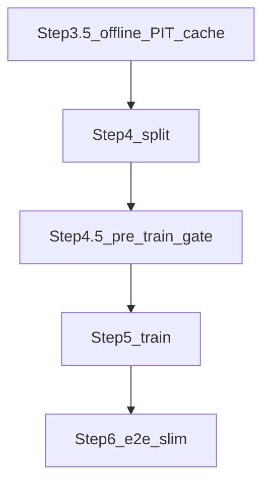
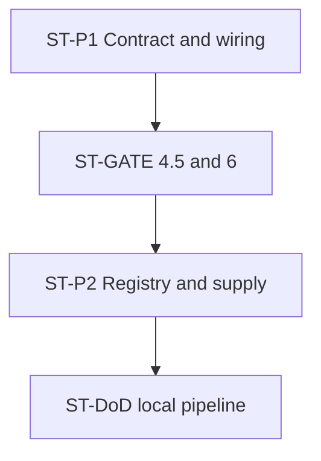
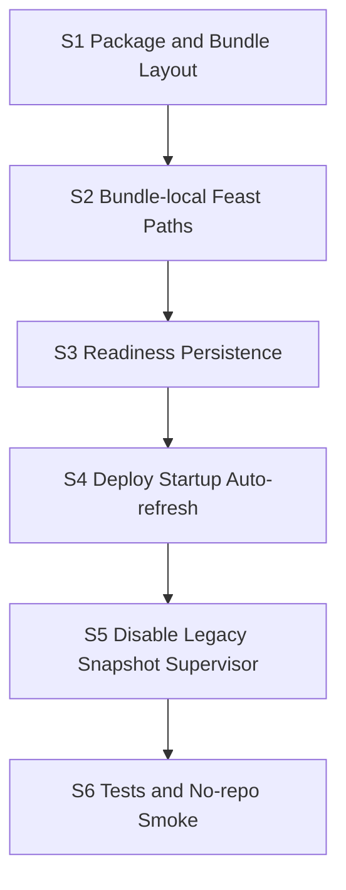
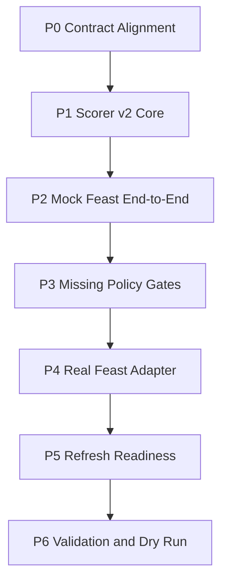

# Scorer v2 Feast Runtime - Working Plan

本文件是 **Working / execution plan 層**，承接：

- SSOT：[`Scorer Runtime Contract - SSOT.md`](Scorer%20Runtime%20Contract%20-%20SSOT.md)（含特徵四層、short PIT、離線 PIT cache、hot pool）
- Implementation plan：[`Scorer v2 Feast Runtime - IMPLEMENTATION_PLAN.md`](Scorer%20v2%20Feast%20Runtime%20-%20IMPLEMENTATION_PLAN.md)（含 **Follow-on P1+P2** 架構決策）
- Data pipeline SSOT：[`Data pipeline - SSOT.md`](Data%20pipeline%20-%20SSOT.md) §5.1（訓練 Step 3.5 short cache）
- Decision record：`Feast Production Feasibility Spike - DECISION_RECORD.md`

本文件只拆解可執行工作、依賴、Definition of Done、建議順序與驗收證據；不重新定義 scorer v2 的產品範圍或架構。若本文件與 SSOT / implementation plan 衝突，先更新上層文件再執行。

### 任務 ID 命名規則

| 前綴 | 含義 |
|------|------|
| **`ST-*`** | **當前 follow-on**：Short-term alignment（對應 implementation plan 的 P1+P2） |
| **`S1`–`S6`** | 已完成：Feast startup / no-repo bundle slice（背景） |
| **`P0`–`P6`** | 廣域 scorer v2 路線圖（背景；與 `ST-P1` 的「Scorer Core P1-1」不同 ID） |

## 已定前置決策

- 第一個可交付 slice 採 **thin end-to-end**：以 fake/mock Feast adapter 先跑通 `fetch -> feature build -> predict -> durable writes -> cursor advance`。
- `trainer_hightier.serving.scorer` 主流程直接由 v2 替換；只保留必要 entrypoint / CLI 形狀與外部 `state.db` contract。
- mid-term `fe__*` 與 long-term `patron__*__w180d_m1snap` 的正式 supplier 是 Feast online lookup。
- short-term `fe__*` 第一版不強制 Feast 化；production scorer v2 由 bounded on-the-fly PIT builder 供應，且只支援目前部署模型需要的欄位。
- `fe_short_term_parquet` 不可進入 production scorer control flow；測試 fixture 必須透過 mock / fixture injection，不可形成 production runtime fallback branch。
- 正常 cell-level NULL 允許進模型，但必須記錄 missing counts / degraded status。
- Feast entity row missing 不等同正常 NULL：第一版採 **skip missing rows + prediction-log audit status**。
- Feast entity row missing 比例 **> 10%** 時，整批 hard fail，避免 refresh / key / mapping 系統性問題被靜默吞掉。
- 不允許 production scorer runtime fallback 到 legacy training Parquet、`fe_derived_parquet` 或 `fe_short_term_parquet`，不提供 production debug fallback。
- Scorer-capable deploy (`all` / `scorer`) 採 **startup Feast online refresh**；`api` / `validator` 不觸發 refresh。
- Production dependency install 第一版接受 `pip install -r requirements.txt` 從 PyPI / internal index 安裝；`wheels/` 必須有 local package wheel，third-party wheelhouse 僅作備援。
- Feast runtime paths 必須 bundle-local：`feast_repo/`、`artifacts/feast/`、`local_state/feature_state.db`、`mapping/adt_allowed_players_q0p99.parquet`。
- Startup refresh lock 採短 timeout + fail-fast；freshness 判斷只讀 config / readiness metadata。
- `feature_state.db` 保存 latest readiness payload/hash/run id/generated_at；`feast_online_readiness.json` 保留為 latest deploy/scorer gate snapshot。
- Post-startup scheduled / daemon Feast refresh 已採用 supervisor（見 deploy）；startup slice 第一版不包含 daemon 細節。

### Follow-on 前置決策（2026-05，當前優先）

- **Short 單層**：`bet__*` + short-horizon `fe__*` 皆為 `short_term_pit_builder`（live PIT）；**不**再區分 Short-T / Short-PIT 兩層時間語意。
- **訓練 offline PIT cache**：`_main_trainer_fe_short_term.parquet`（manifest 鍵 `fe_short_term_parquet`）僅加速 Step 4/5；語意仍 PIT，**不可**供應 production 未見 `bet_id`。
- **Production short = live PIT only（決策 A）**：scorer 僅 `attach_trial_bet_behavior_1h` + `attach_short_term_pit_features`；Route B `join_production_fe_suppliers` 的 short parquet **不作** scorer v2 主路徑／readiness。
- **`expand_canonical_aliases=False`**：訓練物化、Step 4.5、Step 6 replay、production scorer（CH pool 路徑需 ST-P1-4 稽核）。
- **Hot pool**：`compute_hot_pool_window_start`（6h + gaming day open）；baseline 維持 `fe__canonical__*__today`。
- **Parity 兩段**：**Step 4.5** pre-train hard-fail（Step 5 前）；**Step 6** 瘦身（Feast / slow / bundle e2e）。
- **`short__` 欄位改名**：defer（不列入本輪 DoD）。

## 執行護欄

- 避免在 scorer request-time 做 heavy mid/long feature computation；refresh / materialize plane 另行處理。短期 `fe__*` 僅允許 bounded PIT 計算，必須受 batch size、player fanout、lookback 限制。
- 每批成功 durable write 後，cursor 推進到 **all successfully scored rows** 的最大 ETL cursor，不得只用 alert rows。
- 所有新路徑必須考慮筆電 / 小型 production box 的 RAM：batch size、lookup rows、prediction log 寫入都要有 bounded behavior。
- 不把 ClickHouse credentials、Feast online store credentials 或環境差異塞進環境變數控制行為；runtime 行為設定應收斂在既有 config / Python config。
- 不新增多餘架構層。第一輪只允許為 scorer v2 必要邊界新增小型 adapter / helper。

## 本輪聚焦 slice（Current priority）

**Follow-on: Short-term alignment (ST-P1 + ST-P2)**

對齊 implementation plan §Follow-on：統一 **Scoring Context Contract**、**Step 4.5** pre-train gate、**Step 6** 瘦身、registry/supply 單一 short 故事。Feast startup slice（S1–S6）視為 **已完成背景**，不阻塞本輪。

### 訓練管線（parity 插入點）



### Follow-on 建議執行順序



1. ST-P1-1 → ST-P1-3 → ST-P1-5 → ST-P1-6（contract + parity 對齊）
2. ST-GATE-1 → ST-GATE-3（4.5 先於長訓練）
3. ST-P2-1 → ST-P2-3（supply 與 deploy preflight）
4. ST-GATE-4 → ST-GATE-6（Step 6 瘦身）
5. ST-P1-4（production CH pool / alias 稽核）
6. ST-DoD 本機全 pipeline

---

## ST-P1: Scoring Context Contract + 接線

目的：train materialize、scorer live PIT、Step 4.5 / Step 6 replay 共用同一 pool / batch / canonical 政策與計算入口。

**建議新模組**：`trainer_hightier/serving/short_term_scoring_context.py`

- `ShortTermScoringContext`（或模組常數）：`expand_canonical_aliases=False`、`batch_size` = `hightier_scorer_max_bets_per_cycle`（2000）、batch 排序 `payout_complete_dtm`, `bet_id`。
- `build_short_term_features_for_batch(...)`：內部 `attach_trial_bet_behavior_1h` + `compute_fe_derived_features_from_pool` / `attach_short_term_pit_features` 子集；**不**合併 trial 與 derived SQL 檔。

| ID | Task | Files | Dependencies | Definition of Done |
|----|------|-------|--------------|-------------------|
| ST-P1-1 | 新增 contract 模組 + 單元測試 | `serving/short_term_scoring_context.py`, `tests/test_scoring_context_contract.py` | Follow-on 決策 | pytest 綠；expand 預設 False；無全域狀態 |
| ST-P1-2 | materialize 改呼叫 contract | `feature_experiment/materialize_fe_derived.py` | ST-P1-1 | `_short_term_features_for_batch` 行為不變；expand=False、時間序 batch |
| ST-P1-3 | scorer 改呼叫 contract | `serving/scorer.py` | ST-P1-1 | `_build_staged_features` 單一 live PIT 入口 |
| ST-P1-4 | Production CH pool 與 alias 政策對齊 | `serving/scorer.py`, `serving/offline_serving_backtest.py` | ST-P1-1 | player fanout 與 parity 一致；註解或程式與 `expand=False` 對齊 |
| ST-P1-5 | Parity replay 對齊 contract | `06_verify_training_serving_parity.py`, `offline_serving_backtest.py` | ST-P1-1, ST-P1-6 | `expand_canonical_aliases=False`；test batch 時間序 |
| ST-P1-6 | `Step6ParityConfig.batch_size` = 2000 | `config.py` | 無 | 與 materialize / scorer cycle 一致 |

**Iteration ST-A exit**：`test_bounded_short_term_training` + `test_scoring_context_contract` 綠；`test.parquet` 子樣本 short replay diff 相對舊 Step 6 明顯下降。

---

## ST-GATE: Step 4.5（pre-train）與 Step 6（瘦身）

目的：避免長時間 Step 5 後才在 Step 6 發現 short PIT context 錯誤；Step 6 專注 bundle + Feast e2e。

| ID | Task | Files | Dependencies | Definition of Done |
|----|------|-------|--------------|-------------------|
| ST-GATE-1 | `PreTrainFeatureGateConfig`（或擴充 parity config） | `config.py` | 無 | 與 Step 6 共用 `max_rows`（200k）、`diff_fraction_fail_threshold`（0.02） |
| ST-GATE-2 | `run_pre_train_feature_gate` | `06_verify_training_serving_parity.py` 或 `verify_short_term_parity.py` | ST-P1-5, ST-GATE-1 | 輸出 `artifacts/training_data/pre_train_feature_gate.json`；fail → exit 1 |
| ST-GATE-3 | trainer Step 4 後、Step 5 前呼叫 gate | `trainer.py` | ST-GATE-2 | CLI `--skip-pre-train-feature-gate`；hard fail |
| ST-GATE-4 | Step 6 預設跳過 short 全量 replay | `06_verify_training_serving_parity.py`, `trainer.py` | ST-GATE-2 | 保留 slow + Feast；仍寫 `feature_parity_verification.json` |
| ST-GATE-5 | Step 6 可選 short smoke（子樣本） | 同上 | ST-GATE-4 | 與 4.5 分工文件化 |
| ST-GATE-6 | Mid structural null 比對政策 | `06_verify` | 無 | 僅比非 null 列數值；Option B null 率不當 parity fail |

**Iteration ST-GATE exit**：`--skip-step5` 或僅跑至 Step 4 後可單獨驗 4.5；全 pipeline 時 4.5 pass 才進 Optuna。

---

## ST-P2: Registry & feature_supply 單一 short

目的：治理與 deploy preflight 只呈現一個 short 供應故事；`bet__*` 不再進 `feast_trial_cols`。

| ID | Task | Files | Dependencies | Definition of Done |
|----|------|-------|--------------|-------------------|
| ST-P2-1 | `_infer_runtime_supplier` 優先 short PIT | `serving/feature_supply.py` | 無 | baseline 四 `bet__*` ∈ `short_term_cols` |
| ST-P2-2 | `feast_trial_cols` deprecated / 恆空 | `feature_supply.py` | ST-P2-1 | `test_feature_supply.py` 更新 |
| ST-P2-3 | preflight 不要求 `fe_short_term` 作 v2 readiness | `feature_supply.py`, `deploy/main.py` | ST-P2-1 | 決策 A；Route B diagnostic only |
| ST-P2-4 | Registry `bet__*` 可選補 note | `contracts/feature_candidate_registry.yaml` | 無 | 與 SSOT 一致；無欄位改名 |

**Iteration ST-B exit**：`pytest tests/test_feature_supply.py tests/test_feature_cadence.py` 綠。

---

## Follow-on Release Gate（ST-DoD）

本輪完成時至少滿足（**與下方 Startup slice gate 分開**）：

- **pytest**：ST-P1、ST-P2、ST-GATE 相關測試全綠。
- **Step 4.5**：`pre_train_feature_gate.json` 存在且 short baseline `verdict=pass`（`diff_fraction ≤ 0.02`）。
- **Step 5**：完成訓練並產出 bundle（Optuna 依 `Step5TrainConfig`）。
- **Step 6**：`feature_parity_verification.json`；`hard_fail_slow_gate` / `hard_fail_all_feature_gate` 依 config；**short 全量 replay 失敗不應是主因**（已在 4.5 攔截）。
- **禁止**：training `fe_short` parquet 作 production scorer 查表。

### 本機驗收命令（建議）

```bash
export PYTHONUTF8=1
# 全 pipeline（artifact 已齊時可 --start-from-features）
python -m trainer_hightier.trainer --profile main_trainer
# 或分段：Step 3.5+4 後僅驗 4.5（需實作 ST-GATE-3 後）
# python -m trainer_hightier.trainer --start-from-features --skip-step5
```

驗證產物：

- `trainer_hightier/artifacts/training_data/pre_train_feature_gate.json`
- `out/models_high_tier_mvp/<bundle>/feature_parity_verification.json`

---

## 背景（已完成）：Startup Auto-refresh S1–S6

**Status: completed / background.** 以下 task 供稽核；**當前優先執行 ST-P1 / ST-GATE / ST-P2**，不阻塞於 S1–S6。

原 slice 目標：deploy / package / refresh，使 production 在 **無 repo checkout** 下以 `python main.py --mode all` 啟動 scorer v2。



## Slice S1: Package Dependency and Bundle Layout

目的：產出 scorer v2 可用的 no-repo deploy bundle；依賴由 PyPI / internal index 安裝，不要求 vendor third-party wheels。

- ID: `S1-1`
  - Task: 在 `pyproject.toml` 加入 `feast` runtime dependency（版本鎖定），使 `pip install -r requirements.txt` 可安裝 refresh / scorer 所需 Feast SDK。
  - Owner: agent
  - Files: `trainer_hightier/pyproject.toml`, bundle `requirements.txt`
  - Dependencies: 已定前置決策
  - Definition of Done: 乾淨 venv 執行 `pip install -r requirements.txt` 後 `import feast` 成功；wheel 仍只 vendor `trainer_hightier` local wheel。

- ID: `S1-2`
  - Task: `build_deploy_package.py` 打包 `feast_repo/` 到 bundle root；建立可寫入的 `artifacts/feast/`、`local_state/` 目錄。
  - Owner: agent
  - Files: `trainer_hightier/build_deploy_package.py`
  - Dependencies: `S1-1`
  - Definition of Done: bundle 含 `feast_repo/`、`artifacts/feast/`、`local_state/`；`deploy_bundle_paths.json` 記錄 bundle-local Feast / readiness / feature_state 路徑。

- ID: `S1-3`
  - Task: 固定 ADT allowlist bundle 位置為 `mapping/adt_allowed_players_q0p99.parquet`（或 manifest / `deploy_bundle_paths.json` 明確指向）；deploy 與 refresh 從 bundle 解析並傳入 `--adt-allowlist`。
  - Owner: agent
  - Files: `trainer_hightier/build_deploy_package.py`, `trainer_hightier/deploy/main.py`
  - Dependencies: `S1-2`
  - Definition of Done: 無 repo 時 deploy / refresh 不需隱含 dev path 即可找到 allowlist。

- ID: `S1-4`
  - Task: 更新 bundle preflight / strict pack gate：scorer v2 不再以 `slow_patron_parquet` / `mid_term_snapshot_parquet` 缺失作為 production blocker；改驗證 Feast repo、mapping、allowlist、model bundle 結構。
  - Owner: agent
  - Files: `trainer_hightier/build_deploy_package.py`, `trainer_hightier/deploy/main.py`
  - Dependencies: `S1-2`, `S1-3`
  - Definition of Done: Feast-capable bundle 可在缺 legacy snapshot parquet 時建包；legacy-only gate 不阻擋 scorer v2 path。

- ID: `S1-5`
  - Task: 移除或隔離 serving runtime 對 `trainer_hightier.feature_experiment` 的 import（wheel 已 exclude 該 package）；consolidate spike constants 到 production module，避免 no-repo `ModuleNotFoundError`。
  - Owner: agent
  - Files: `trainer_hightier/serving/feast_readiness.py`, `trainer_hightier/serving/feast_online_refresh.py`, 等
  - Dependencies: `S1-1`
  - Definition of Done: 安裝 wheel 後 scorer / refresh 可 import，不依賴 repo checkout 或 `feature_experiment`。

## Slice S2: Bundle-local Feast Path Contract

目的：Feast repo / online store / readiness 路徑在 production 全部 bundle-local，不含 dev machine absolute path。

- ID: `S2-1`
  - Task: 擴充 `HightierServingConfig` / deploy override：bundle-local `scorer_feast_repo_path`、`scorer_feast_readiness_path`、`feature_state_db_path` 預設指向 bundle 內 `feast_repo/`、`artifacts/feast/feast_online_readiness.json`、`local_state/feature_state.db`。
  - Owner: agent
  - Files: `trainer_hightier/config.py`, `trainer_hightier/deploy/main.py`
  - Dependencies: `S1-2`
  - Definition of Done: `_serving_config_for_bundle` 設定 Feast 路徑；scorer / refresh 在 bundle 內不需手動 override。

- ID: `S2-2`
  - Task: 建包或 deploy startup 時 rewrite `feast_repo/feature_store.yaml`（及 registry / online store path）為 bundle-relative 或 bundle-root absolute path。
  - Owner: agent
  - Files: `trainer_hightier/build_deploy_package.py` 或 `trainer_hightier/deploy/main.py`, `trainer_hightier/feast_repo/`
  - Dependencies: `S2-1`
  - Definition of Done: production host 上 Feast apply / materialize / lookup 不讀 dev machine path；smoke 可 reach online store。

## Slice S3: Readiness Persistence

目的：refresh 成功後 DB 保存 audit + latest readiness payload；JSON 作 deploy/scorer gate snapshot。

- ID: `S3-1`
  - Task: 在 `feature_state_store.py` 新增 latest readiness meta helpers，寫入 `feature_state_meta` keys：
    `feast_online_readiness_latest_json`、`feast_online_readiness_latest_sha256`、`feast_online_readiness_latest_run_id`、
    `feast_online_readiness_latest_generated_at`。
  - Owner: agent
  - Files: `trainer_hightier/serving/feature_state_store.py`
  - Dependencies: 無（可與 S1 並行）
  - Definition of Done: unit test 可讀寫上述 keys；payload 為完整 readiness doc JSON。

- ID: `S3-2`
  - Task: `feast_readiness.py` 的 `write_feast_online_readiness` 改為 atomic write（temp + replace），與 manifest publish 同模式。
  - Owner: agent
  - Files: `trainer_hightier/serving/feast_readiness.py`
  - Dependencies: 無
  - Definition of Done: 中斷 write 不會留下半份 JSON；test 覆蓋 atomic replace。

- ID: `S3-3`
  - Task: `feast_online_refresh.py` 固定 publish 順序：build final readiness doc → persist DB latest payload/hash/run id/generated_at → atomic write JSON → return success。
  - Owner: agent
  - Files: `trainer_hightier/serving/feast_online_refresh.py`
  - Dependencies: `S3-1`, `S3-2`
  - Definition of Done: DB persistence 或 JSON publish 任一步失敗則 run status=error、verdict!=ok；test 覆蓋 ordering。

## Slice S4: Deploy Startup Auto-refresh

目的：`deploy/main.py` 在 scorer-capable mode 啟動前執行 Feast startup refresh + smoke；fail-fast。

- ID: `S4-1`
  - Task: 新增 CLI flags：`--no-feast-startup-refresh`（預設 refresh 開）、`--force-feast-refresh`。
  - Owner: agent
  - Files: `trainer_hightier/deploy/main.py`
  - Dependencies: `S2-1`, `S3-3`
  - Definition of Done: flags 可從 bundle `main.py` 轉發；help text 與 README_DEPLOY 一致。

- ID: `S4-2`
  - Task: 實作 `_startup_feast_refresh_or_raise`：讀 config + `feast_online_readiness.json`，用 `evaluate_feast_readiness_gate` / freshness helpers 判斷是否需 refresh；missing / stale / forced 時呼叫 `run_feast_online_refresh`。
  - Owner: agent
  - Files: `trainer_hightier/deploy/main.py`, `trainer_hightier/serving/feast_readiness.py`
  - Dependencies: `S4-1`, `S3-3`
  - Definition of Done: fresh readiness + smoke pass 時跳過 refresh；stale 判斷不 hard-code 在 deploy，只讀 config / readiness metadata。

- ID: `S4-3`
  - Task: 實作 bundle-local Feast refresh lock（例如 `artifacts/feast/.feast_online_refresh.lock`）：短 timeout wait，超時 fail-fast；不與 legacy snapshot lock 混用。
  - Owner: agent
  - Files: `trainer_hightier/deploy/main.py`, `trainer_hightier/config.py`（timeout 常數）
  - Dependencies: `S4-2`
  - Definition of Done: 兩個 deploy process 同時 refresh 時第二個在 timeout 內 fail；test 或 manual 可驗證 contention。

- ID: `S4-4`
  - Task: refresh 成功後執行 deploy Feast readiness gate + allowlist online smoke（reuse `run_deploy_feast_readiness_check`）；任一失敗 abort startup。
  - Owner: agent
  - Files: `trainer_hightier/deploy/main.py`
  - Dependencies: `S4-2`
  - Definition of Done: refresh ok 但 smoke fail 時不啟動 API / validator / scorer。

- ID: `S4-5`
  - Task: mode gating：僅 `mode=all` / `mode=scorer` 跑 startup refresh；`mode=api` / `mode=validator` 不觸發 refresh，且在 scorer-capable startup 成功後才啟動（`all` 模式）。
  - Owner: agent
  - Files: `trainer_hightier/deploy/main.py`
  - Dependencies: `S4-4`
  - Definition of Done: `mode=api` alone 不跑 CH export；`mode=all` 順序為 refresh → smoke → API thread → validator thread → scorer foreground。

- ID: `S4-6`
  - Task: deploy 明確傳 `--adt-allowlist`、`--canonical-mapping`、`--bundle-dir`（或等效 config）給 scorer subprocess / foreground。
  - Owner: agent
  - Files: `trainer_hightier/deploy/main.py`
  - Dependencies: `S1-3`, `S4-5`
  - Definition of Done: scorer 啟動 log 顯示 bundle-local allowlist / mapping path。

## Slice S5: Disable Legacy Snapshot Supervisor

目的：scorer v2 不保留雙路 runtime；Parquet snapshot supervisor 不作 mid/long supplier。

- ID: `S5-1`
  - Task: scorer-capable deploy 預設 **不** 呼叫 `_start_refresh_supervisor` / `_startup_snapshot_repair_or_raise`；移除或 gated 掉 legacy Parquet refresh 作為 v2 主路徑。
  - Owner: agent
  - Files: `trainer_hightier/deploy/main.py`
  - Dependencies: `S4-5`
  - Definition of Done: `mode=all` 啟動 log 無 mid/slow Parquet snapshot repair；Feast startup refresh 為唯一 mid/long refresh plane。

- ID: `S5-2`
  - Task: `_preflight_frozen_artifacts` / `_preflight_feature_supplyability` 改為 Feast / bounded PIT aware：不再 hard-require `slow_patron_parquet` 作 scorer v2 blocker。
  - Owner: agent
  - Files: `trainer_hightier/deploy/main.py`, `trainer_hightier/serving/feature_supply.py`
  - Dependencies: `S1-4`, `S5-1`
  - Definition of Done: Feast bundle preflight 通過時不因 legacy snapshot 缺失 fail；historical manifest keys 可保留但非 v2 gate。

- ID: `S5-3`
  - Task: 保留 `--no-refresh-supervisor` 僅作 legacy/debug 或文件標 deprecated；文件註明 scorer v2 應使用 `--no-feast-startup-refresh` 作 debug skip。
  - Owner: agent
  - Files: `trainer_hightier/deploy/main.py`, `README_DEPLOY.md`（由 builder 生成）
  - Dependencies: `S5-1`
  - Definition of Done: operator 文件不再把 Parquet supervisor 描述為 scorer v2 主 refresh path。

## Slice S6: Tests and No-repo Smoke

目的：自動化驗證 startup slice；production gate 可重現。

- ID: `S6-1`
  - Task: unit tests — latest readiness meta read/write（`S3-1`）、atomic JSON publish（`S3-2`）、refresh publish ordering mock（`S3-3`）。
  - Owner: agent
  - Files: `trainer_hightier/tests/test_feature_state_store.py`（或新 test module）, `trainer_hightier/tests/test_feast_online_refresh.py`
  - Dependencies: `S3-3`
  - Definition of Done: CI 不需 live CH / Feast 即可驗證 persistence contract。

- ID: `S6-2`
  - Task: unit tests — deploy lock short-timeout fail-fast、mode gating（mock refresh / smoke）、`--force-feast-refresh` / `--no-feast-startup-refresh`。
  - Owner: agent
  - Files: `trainer_hightier/tests/test_deploy_main.py`（或等效）
  - Dependencies: `S4-5`, `S5-1`
  - Definition of Done: mock 下 deploy startup 順序與 fail-fast 行為有測試覆蓋。

- ID: `S6-3`
  - Task: integration smoke — 建最小 bundle fixture，`pip install -r requirements.txt`（mock PyPI 或 test venv），驗證 import + deploy preflight path resolution。
  - Owner: agent
  - Files: `trainer_hightier/tests/test_build_deploy_package.py`（或新 test）
  - Dependencies: `S1-2`, `S2-1`
  - Definition of Done: 無 repo checkout 的 bundle 結構測試通過；Feast paths 在 `deploy_bundle_paths.json` 可解析。

- ID: `S6-4`
  - Task: production dry run checklist（manual / user）：在 target host 執行 `python main.py --mode all`，確認 startup refresh → smoke → scorer；記錄 refresh 耗時、RAM、anchor。
  - Owner: user + agent
  - Dependencies: `S4-4`, `S5-1`, `S6-3`
  - Definition of Done: dry run log 含 readiness path、run_id、mid/slow anchor；失敗時 fail-fast 訊息可 action。

## Slice 迭代分組

- **Iteration A（S1 + S2）**：bundle 可建、Feast path bundle-local、依賴可 install。
  - Exit：`build_deploy_package` 產出含 `feast_repo/` 的 bundle；config override 正確。

- **Iteration B（S3）**：readiness persistence + atomic publish。
  - Exit：refresh CLI 成功後 DB + JSON 一致；ordering tests 綠。

- **Iteration C（S4 + S5）**：deploy startup auto-refresh、停用 legacy supervisor。
  - Exit：`python main.py --mode all` 在 mock/staging 上跑通 startup sequence。

- **Iteration D（S6）**：測試 + no-repo smoke + production dry run。
  - Exit：Release gate（見下）startup 相關項全勾。

## Slice Release Gate（Startup S1–S6，已完成）

歷史 slice 完成時至少滿足：

- Bundle：`feast_repo/`、`artifacts/feast/`、`local_state/`、`mapping/adt_allowed_players_q0p99.parquet` 存在且 path 可解析。
- Install：`pip install -r requirements.txt` 從 PyPI / internal index 成功；`feast` import 成功。
- Startup：`mode=all` / `mode=scorer` 在 readiness 缺失/stale 時 auto-refresh；fresh 時 skip。
- Lock：短 timeout contention fail-fast。
- Publish：final doc → DB latest meta → atomic JSON → deploy smoke。
- Legacy：Parquet snapshot supervisor 不作 scorer v2 mid/long path。
- **Out of scope**：post-startup scheduled / daemon Feast refresh（future must-do，另開 slice）。

## 本輪 Out of scope（follow-on）

- 欄位前綴 `short__` / `mid__` / `long__`（P3）
- 合併 trial + derived 為單一 SQL 檔
- 移除 gaming day pool floor 或 baseline `canonical__*__today`
- 以 `fe_short_term_parquet` 作 production 主供應

## 背景：Scorer v2 廣域 Phases（非當前 follow-on）

以下 Phase 0–6 為 scorer runtime 整體路線圖；**當前優先為 ST-P1 / ST-GATE / ST-P2**，不重新執行或阻塞於 P0–P6，除非 task 明確依賴（例如 scorer 已具備 Feast adapter 才做 production dry run）。



## Phase 0: Contract Alignment

> **狀態**：文件層已完成（SSOT、decision record、implementation plan 已對齊）。保留供追溯。

- ID: `P0-1` **done**
  - Task: 更新 `Scorer Runtime Contract - SSOT.md`，將 Feast mid/long supplier 從 experimental reference 升級為 scorer v2 adopted runtime path。
  - Owner: agent
  - Dependencies: 已定前置決策
  - Definition of Done: SSOT 明確列出 mid-term `fe__*` / long-term `patron__*__w180d_m1snap` 可由 Feast online supplier 供應，且保留 no silent fill / no training artifact rule。

- ID: `P0-2` **done**
  - Task: 更新 `Feast Production Feasibility Spike - DECISION_RECORD.md` 狀態，標記 spike 已進入 scorer v2 integration planning，不再只是 reference。
  - Owner: agent
  - Dependencies: `P0-1`
  - Definition of Done: 文件指出 scorer v2 採用 Feast mid/long；short-term Feast 仍非第一版 scope，short-term `fe__*` production supplier 為 bounded PIT builder。

- ID: `P0-3` **done**
  - Task: 將 missing policy 寫入 contract：cell-level NULL allowed + logged；entity row missing skip + audit；batch missing rate > 10% hard fail。
  - Owner: agent
  - Dependencies: `P0-1`
  - Definition of Done: SSOT 或 implementation plan 可追溯這三條 runtime policy。

## Phase 1: Scorer v2 Core Rewrite

目的：把 `trainer_hightier.serving.scorer` 從 patch-heavy monolith 改成清楚 cycle boundary 的 orchestration layer。

- ID: `P1-1`
  - Task: 重新組織 `score_once` 主流程為明確階段：load context、fetch batch、feature build、supplier lookup、feature gate、predict、write logs / alerts、advance cursor。
  - Owner: agent
  - Dependencies: `P0-1`
  - Definition of Done: `score_once` 不再混合 legacy fallback 決策；每個階段有可單測的 helper boundary。

- ID: `P1-2`
  - Task: 修正 cursor ownership：只有一批 rows 已完成 prediction log / alerts durable write 後才推進 cursor。
  - Owner: agent
  - Dependencies: `P1-1`
  - Definition of Done: mixed alert / non-alert batch 會推進到 all-scored rows max cursor；無 alert batch 也會正確推進。

- ID: `P1-3`
  - Task: 保留必要 CLI contract：`--once`、`--bundle-dir`、`--canonical-mapping`、`--adt-allowlist`、`--no-high-adt-only` 等仍支援的 operator 入口不破壞；移除不必要 legacy supplier 參數的 production 語意。
  - Owner: agent
  - Dependencies: `P1-1`
  - Definition of Done: 既有 entrypoint 可啟動 scorer v2，外部 deploy command 不需改名；legacy supplier 參數若仍暫存，只能 fail fast 或被明確標為 ignored/deprecated，不能啟動 fallback。

- ID: `P1-4`
  - Task: 移除正式 scorer path 對 legacy `fe_derived_parquet` / `fe_short_term_parquet` / training Parquet 的 runtime fallback。
  - Owner: agent
  - Dependencies: `P1-1`
  - Definition of Done: production scorer 缺 Feast / bounded short-term PIT supplier 時 fail fast；production code 不存在 legacy/debug fallback branch。

- ID: `P1-5`
  - Task: 移除 production scorer 對 `manifest.fe_short_term_parquet` 的 runtime dependency，改以 bounded PIT builder 供應 short-term `fe__*`。
  - Owner: agent
  - Dependencies: `P1-1`, `P1-4`
  - Definition of Done: 含 short-term `fe__*` 的模型不再要求 manifest `fe_short_term_parquet`；unsupported short-term columns 會列名 fail fast。

## Phase 2: Mock Feast End-to-End Slice

目的：先不接真 Feast，用 mock adapter 跑通 scorer v2 end-to-end，降低一次導入太多外部變數的風險。

- ID: `P2-1`
  - Task: 定義 Feast online adapter interface，例如接受 scoring batch 與 required feature columns，回傳 aligned feature frame 與 lookup diagnostics。
  - Owner: agent
  - Dependencies: `P1-1`
  - Definition of Done: scorer 主流程只依賴 interface，不直接依賴 Feast SDK。

- ID: `P2-2`
  - Task: 實作 fake/mock Feast adapter，用 fixture DataFrame 模擬 mid/long lookup 成功、cell-level NULL、entity row missing。
  - Owner: agent
  - Dependencies: `P2-1`
  - Definition of Done: tests 可不連 Feast / ClickHouse 驗證 scorer feature supplier behavior。

- ID: `P2-3`
  - Task: 建立 supplier resolver：用 frozen registry 把 model feature columns 分派到 raw、hot / short-term PIT builder、Feast mid/long。
  - Owner: agent
  - Dependencies: `P2-1`
  - Definition of Done: unknown source、duplicate supplier、missing supplier 會在 readiness gate fail fast。

- ID: `P2-5`
  - Task: 實作 short-term `fe__*` bounded PIT supplier，只覆蓋目前部署模型需要的 `<24h` 特徵與複合特徵依賴。
  - Owner: agent
  - Dependencies: `P1-5`, `P2-3`
  - Definition of Done: 目前模型 short-term `fe__*` 可不依賴 Parquet 產出；計算受 lookback / fanout / batch size 限制，避免 OOM 或長時間 query；非目前模型欄位列名 fail fast，不做通用 builder。

- ID: `P2-4`
  - Task: 用 mock Feast 跑通 `--once` 風格的 scorer smoke：輸入小 batch，產生 prediction log 與 alert subset。
  - Owner: agent
  - Dependencies: `P1-2`, `P2-2`, `P2-3`, `P2-5`
  - Definition of Done: 不需 live Feast 即可驗證 scorer v2 cycle boundary、cursor、writes。

## Phase 3: Missing Policy and Readiness Gates

目的：把 NULL 與 entity row missing 的語意落成程式 gate，避免 production 靜默漏分或靜默填值。

- ID: `P3-1`
  - Task: 實作 cell-level NULL observability：允許模型可接受的 NULL，但 prediction log 記錄 per-row missing feature count / family summary。
  - Owner: agent
  - Dependencies: `P2-4`
  - Definition of Done: `prior_*` 類結構性 NULL 不會 hard fail；audit 可查。

- ID: `P3-2`
  - Task: 實作 entity row missing policy：Feast family 整列缺失的 scoring row 先 skip，不進 `predict_proba`。
  - Owner: agent
  - Dependencies: `P3-1`
  - Definition of Done: skipped rows 寫入 prediction log prediction status（例如 `skipped_feast_entity_missing`）；不會被當作 all-null features 進模型，也不只停留在 process log。

- ID: `P3-3`
  - Task: 實作 batch-level missing threshold：entity row missing rate > 10% 時整批 hard fail。
  - Owner: agent
  - Dependencies: `P3-2`
  - Definition of Done: tests 覆蓋 0%、低於 10%、高於 10% 三種情境。

- ID: `P3-4`
  - Task: 實作 scorer readiness summary：每輪或啟動時輸出 supplier route、required columns、lookup status、missing counts。
  - Owner: agent
  - Dependencies: `P3-3`
  - Definition of Done: failure message 可指出是哪個 supplier / feature family / threshold 失敗，包含 unsupported short-term `fe__*` 列表。

## Phase 4: Real Feast Adapter

目的：在 scorer v2 已能用 mock 跑通後，接入真 Feast online lookup。

- ID: `P4-1`
  - Task: 實作 Feast SDK adapter，使用 dict-of-lists `entity_rows` 批次呼叫 `get_online_features`。
  - Owner: agent
  - Dependencies: `P2-1`, `P3-4`
  - Definition of Done: adapter 回傳與 input batch row order 對齊的 DataFrame；記錄 lookup latency 與 row counts。

- ID: `P4-2`
  - Task: 加入 Feast schema / feature service smoke check。
  - Owner: agent
  - Dependencies: `P4-1`
  - Definition of Done: feature service missing、feature name mismatch、entity key type mismatch 會在啟動或 dry run fail fast。

- ID: `P4-3`
  - Task: 將 scorer v2 supplier resolver 從 mock adapter 切到真 Feast adapter，同時保留 tests 可注入 mock。
  - Owner: agent
  - Dependencies: `P4-1`, `P4-2`
  - Definition of Done: production path 用真 Feast；unit / integration tests 不需真 Feast。

## Phase 5: Refresh Readiness Integration

目的：確保 scorer 查到的是 production-scoped、fresh、可稽核的 Feast online features。

- ID: `P5-1`
  - Task: 定義 scorer 可讀的 Feast readiness metadata：latest anchor、generated_at、coverage、row count、null summary、source scope。
  - Owner: agent
  - Dependencies: `P4-2`
  - Definition of Done: metadata 可由 scorer readiness gate 讀取；training-scoped source 不可通過。

- ID: `P5-2`
  - Task: 將現有 spike / production materialize path 的輸出和 readiness metadata 對齊。
  - Owner: agent
  - Dependencies: `P5-1`
  - Definition of Done: refresh job 成功後，scorer 可判斷 mid/long latest anchor 與 freshness。

- ID: `P5-3`
  - Task: 建立 allowlist sample online lookup smoke。
  - Owner: agent
  - Dependencies: `P4-3`, `P5-2`
  - Definition of Done: deploy / dry run 能用小樣本驗證 online store reachable、key type 正確、missing rate 未超過 policy。

## Phase 6: Validation and Dry Run

目的：用測試和受控 dry run 證明 scorer v2 可替換舊主流程。

- ID: `P6-1`
  - Task: 單元測試 scorer v2 cursor advance、supplier resolver、short-term PIT builder、mock Feast missing policy、prediction log / alerts write。
  - Owner: agent
  - Dependencies: `P3-3`
  - Definition of Done: 覆蓋 alert / non-alert mixed batch、no alert batch、skipped rows、missing rate fail、short-term unsupported column fail-fast。

- ID: `P6-2`
  - Task: integration smoke：fake ClickHouse batch + mock Feast + real model bundle，跑到 `predict_proba` 與 writes。
  - Owner: agent
  - Dependencies: `P2-4`, `P6-1`
  - Definition of Done: 無 live external service 下可重現 scorer v2 end-to-end。

- ID: `P6-3`
  - Task: real Feast dry run：bounded `--once` batch，記錄 lookup latency、RAM、ClickHouse rows、missing entity rate、cell-level NULL counts。
  - Owner: user + agent
  - Dependencies: `P4-3`, `P5-3`
  - Definition of Done: dry run report 顯示 missing entity rate <= 10%，且 latency / memory 沒有超出 laptop / production box 可接受範圍。

- ID: `P6-4`
  - Task: validator / API compatibility check：確認 `state.db` alerts schema 與既有 downstream 讀取不破壞。
  - Owner: agent
  - Dependencies: `P6-2`
  - Definition of Done: 既有 validator / API smoke 能讀取 scorer v2 寫出的 alerts。

## 建議迭代分組

- Iteration 1：`P0-1` 到 `P2-4`
  - 目標：mock Feast scorer v2 最小 end-to-end。
  - Exit：可在測試中跑通 fetch-like batch、features、predict、prediction log、alerts、cursor。

- Iteration 2：`P3-1` 到 `P3-4`
  - 目標：missing policy 與 readiness gates 可測。
  - Exit：cell-level NULL allowed；entity row missing skip；>10% hard fail。

- Iteration 3：`P4-1` 到 `P5-3`
  - 目標：真 Feast adapter 與 refresh readiness metadata 接上。
  - Exit：allowlist sample lookup smoke 通過。

- Iteration 4：`P6-1` 到 `P6-4`
  - 目標：替換前驗證。
  - Exit：bounded production dry run 可接受，validator / API 相容。

## Release Gate（廣域 production-ready）

Scorer v2 不應標記 production-ready，除非以下項目全數通過（**且** Follow-on Release Gate / ST-DoD 已 pass）：

- CLI 相容：既有 scorer entrypoint 可啟動 v2。
- Feature supplyability：每個 `model.pkl.feature_columns` 有唯一 runtime supplier。
- Short-term readiness：目前模型所需 short-term `fe__*` 由 bounded PIT builder 供應；production readiness 不接受 `fe_short_term_parquet`。
- Feast readiness：feature service、entity key、online store、latest anchor、source scope 通過 smoke。
- Missing policy：cell-level NULL audit、entity row missing skip、>10% hard fail 均有測試。
- Cursor correctness：all-scored rows max cursor 推進有測試覆蓋。
- Prediction log：所有 scored rows 有 audit；skipped rows 必須有可追蹤 prediction-log status，不另開 separate audit 作為第一版必要路徑。
- Alerts schema：`state.db` downstream validator / API 可讀。
- Performance：bounded dry run 記錄 batch size、lookup latency、ClickHouse rows、RAM；未發現 OOM / 長時間卡住風險。

## Open Execution Risks

### Follow-on（ST-P1 / ST-GATE / ST-P2）

- **Step 6 `batch_size=5000` vs materialize `2000`**：現況未對齊，為 short parity 失敗主因之一；**ST-P1-6** 必須修。
- **`expand_canonical_aliases` 預設 True**（`offline_serving_backtest.build_pool_from_cleaned_parquet`）：與訓練 materialize 不一致；**ST-P1-5** 必須改 parity 路徑預設 False。
- **Production CH `fetch_bet_pool_window`** 可能隱含與 cleaned-parquet pool 不同的 player 集合；**ST-P1-4** 需稽核並文件化。
- Step 4.5 未實作前，長訓練後 Step 6 仍可能浪費時間；**ST-GATE-3** 為高優先。
- Mid Option B structural null（~15%）若 parity 把 null vs non-null 混比，會誤報；**ST-GATE-6** 需釐清比對規則。

### 背景（Startup / 廣域）

- `feature_experiment` 被 wheel exclude 時 serving 需無 repo import（`S1-5`，多已解）。
- Feast-only bundle、metadata-only manifest、停用 legacy snapshot supervisor（`S1-4`、`S5-1`，多已解）。
- 真 Feast online schema 與 production feature service 名稱需在 dry run 前確認。
- short-term 欄位若 bounded PIT 未支援會 fail fast；**不得**以 `fe_short_term_parquet` 解鎖 production（決策 A）。
- `>10%` Feast entity-missing 為 operational guardrail；超過需回 SSOT 重批。
