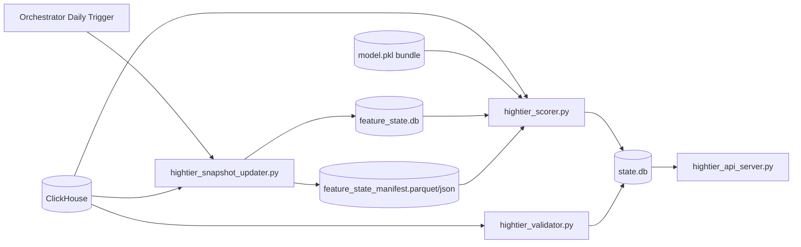

# trainer_hightier - Serving Pipeline Implementation Plan

本文件是 **Implementation plan 層**，定義 high-tier 上線 serving 的 realization strategy、模組邊界、階段里程碑、風險與驗證策略；不展開 ticket 級 task checklist。

## 範圍與非範圍

- 範圍：
  - `scorer`、`validator`、`api`、`snapshot_updater` 的拆服務設計與落地策略。
  - ClickHouse-only 線上資料通道。
  - serving state 與 feature-state 的儲存契約。
- 非範圍：
  - 模型訓練演算法、特徵發明與 ablation 策略本身。
  - orchestrator 平台實作細節（只定觸發契約，不綁具體產品）。
  - online feature store 新建（本期不導入）。

## 已定決策（作為本計畫約束）

- 資料來源：上線 scorer 僅讀 ClickHouse。
- 部署形態：拆服務，先採 dedicated script per component。
- validator 規則：沿用 `trainer/serving/validator.py` 判定邏輯，但部署時不可依賴 `trainer` package。
- 特徵集合：serving 僅計算「模型訓練使用欄位」（目前 baseline 為主）。
- 快照更新 SLA：每日，由 orchestrator 觸發 `hightier_snapshot_updater.py`。
- 缺口回補範圍：僅需補 `last_training_cutoff -> now`。
- 狀態儲存：
  - scorer / validator 共用單一 state DB（相容 trainer 既有模式）。
  - feature-state 另用獨立 SQLite + Parquet manifest。
- API 相容：保留 trainer API 相容欄位命名（`alerts` / `validation_results` 協定不破壞）。

## 架構實現藍圖

## 元件邊界與責任

### 1) `hightier_scorer.py`

- 責任：
  - 以 ingest watermark 從 ClickHouse 拉取新 bet（增量）。
  - 計算模型所需 baseline serving features。
  - 讀取 active snapshot 版本（來自 feature-state）並做 as-of 特徵拼接。
  - 產生告警並寫入共用 `state.db` 的 `alerts`。
- 關鍵策略：
  - 不以固定 8h 當主邏輯；以增量 cursor + 特徵窗口需求控制查詢範圍。
  - 每輪檢查 feature-state version（manifest mtime/version），若更新則熱切換。

### 2) `hightier_validator.py`

- 責任：
  - 對 `alerts` 做實現結果回查與 MATCH/MISS/PENDING 判定。
  - 寫入 `validation_results` 與相關 metrics。
- 解耦策略：
  - 將判定核心從 `trainer/serving/validator.py` vendor 到 hightier serving 模組。
  - 把外部依賴改為 adapter（config / ClickHouse / state DB）避免部署耦合 `trainer`。
- 相容要求：
  - 維持既有判定語義與欄位契約，避免 API 消費端回歸風險。

### 3) `hightier_api_server.py`

- 責任：
  - 對外提供 trainer 相容 API（欄位命名與核心輸出 shape 對齊）。
  - 僅讀 `state.db`，不直接讀模型或 ClickHouse。

### 4) `hightier_snapshot_updater.py`

- 責任：
  - 每日補齊中長期快照（例如 slow/monthly）缺口。
  - 維護 `feature_state.db` watermark 與 active snapshot 版本。
  - 輸出/更新 Parquet manifest 供 scorer 快速感知版本。
- 觸發與節奏：
  - 由 orchestrator 每日觸發。
  - scorer 不負責計算快照，只負責「持續檢查並套用新快照版本」。

## 儲存與資料契約

### A. 共用 serving state DB（`state.db`）

- 角色：scorer / validator / api 共用 runtime state。
- 相容性目標：沿用 trainer 既有核心表命名與欄位協議。
- 核心表：
  - `alerts`
  - `validation_results`
  - `processed_alerts`
  - `meta` / `runtime_meta`（依 hightier 實作收斂）

### B. 獨立 feature state DB（`feature_state.db`）

- 角色：追蹤快照覆蓋範圍、版本與更新審計。
- 建議表：
  - `feature_state_meta`：active 版本、training cutoff、coverage 區間。
  - `snapshot_watermark`：各快照族群最後補齊時間點。
  - `snapshot_job_log`：每日更新執行紀錄（成功/失敗、耗時、列數）。

### C. Parquet manifest

- 角色：scorer 快速判斷快照版本變更與可用區間，降低 DB 查詢負擔。
- 內容最小集合：
  - `snapshot_version`
  - `coverage_start_ts`
  - `coverage_end_ts`
  - `generated_at`
  - `artifact_path`

## 工作流與階段（Workstreams / Phases）

### Phase 0: 相容基線與解耦框架

- 建立 hightier serving package 入口與 script 邊界。
- 定義共用 `state.db` schema 相容映射。
- 定義 validator vendor+adapter 框架，先確保行為等價。

### Phase 1: Scorer 增量化與 baseline 特徵路徑

- 實作 ClickHouse 增量抓取（ingest watermark）。
- 實作 baseline 特徵計算與模型欄位白名單校驗。
- 實作 `alerts` 寫入與去重策略。

### Phase 2: Validator 邏輯等價遷移

- 將判定核心搬入 hightier 模組並完成依賴替換。
- 保留 PENDING / finalization / no-bet retry 等行為語義。
- 實作與 `state.db` 的增量讀寫與保留策略。

### Phase 3: Feature-state 與每日快照更新

- 建立 `feature_state.db` 與 manifest 契約。
- 實作 `hightier_snapshot_updater.py`：
  - 讀 `training_cutoff`
  - 補 `cutoff -> now` 缺口
  - 更新 active version
- scorer 加入快照版本輪詢與熱切換。

### Phase 4: API 相容層與服務化收斂

- 實作 trainer 相容輸出欄位與端點行為。
- 完成 4 個 script 的部署參數契約與健康檢查訊號。

## 里程碑與交付物

- M1：`hightier_scorer.py` 可從 ClickHouse 增量出 alert，寫入 `state.db`。
- M2：`hightier_validator.py` 輸出與 trainer validator 判定一致（基準資料集）。
- M3：`feature_state.db` + manifest + `hightier_snapshot_updater.py` 每日補齊可運行。
- M4：scorer 可自動感知快照版本更新並在不中斷服務下生效。
- M5：`hightier_api_server.py` 提供 trainer 相容欄位命名 API。

## 風險與緩解

- 風險：每日快照節奏下，日內特徵可能偏舊。
  - 緩解：明確標記 snapshot staleness 指標；支援手動補跑。
- 風險：只補 `training_cutoff -> now` 無法反映 cutoff 前遲到修正。
  - 緩解：在文件層明示「不追溯」假設，避免誤判為 bug。
- 風險：解耦後 validator 行為漂移。
  - 緩解：建立 parity regression 測試（同 alerts 輸入比對逐列結果）。
- 風險：長窗口查詢造成 ClickHouse 壓力或本機 OOM。
  - 緩解：增量 cursor、查詢分批、特徵窗口最小化、避免全量回看。

## 驗證與上線策略

- 正確性驗證：
  - scorer 輸出欄位契約符合 trainer API 相容要求。
  - validator 對照測試：hightier vs trainer 逐列判定一致。
- 性能驗證：
  - 每輪查詢列數、耗時、記憶體峰值監控；確保可在筆電資源運行。
- 版本與一致性驗證：
  - 快照更新後，scorer 在下一輪可觀察到 version 變更並使用新版本。
- 漸進 rollout：
  - 先單機 shadow run（不對外告警）比對結果，再切換正式告警輸出。

## 假設與待確認

- `training_cutoff` 可由當前 model bundle metadata 穩定取得。
- orchestrator 可保證每日觸發 `hightier_snapshot_updater.py` 至少一次。
- 共用 `state.db` 的併發寫入策略採 WAL（避免 scorer/validator lock 衝突）。

