# trainer_hightier - Data Pipeline Working Plan

本文件是 **Working / execution plan 層**，僅描述具體執行任務與順序，並回鏈 Implementation plan：

- [C:/Users/longp/Patron_Walkaway/trainer_hightier/doc/Data pipeline - IMPLEMENTATION_PLAN.md](C:/Users/longp/Patron_Walkaway/trainer_hightier/doc/Data pipeline - IMPLEMENTATION_PLAN.md)

## 執行原則

- 以資料管線、特徵物化、訓練資料產製與治理為主。
- **Step 5（`fit_model`）**：以下「Iteration 6」為獨立執行切片，描述單一 LightGBM、可選 Optuna、閾值與報表；不展開 FE 試驗矩陣或雙模型等主線完整範圍。
- 每個階段必須完成 DoD 才能進下一階段。

## 時程分組（建議 5 個 iteration）

### Iteration 1: Pipeline 骨架與分區治理底座

- 任務 W1.1：建立分區 inventory 與 snapshot manifest 產出。
  - 主要落點：[C:/Users/longp/Patron_Walkaway/trainer_hightier/01_data_ingest.py](C:/Users/longp/Patron_Walkaway/trainer_hightier/01_data_ingest.py)
  - Owner：資料工程/平台
  - 依賴：無
  - DoD：可輸出 `gaming_day` 分片清單（含月桶索引）與整體 fingerprint，並能標記來源 snapshot id。
- 任務 W1.2：建立重算集合決策器（新增/變更日期分片 + recent window 回補 + correction days/months）。
  - 主要落點：[C:/Users/longp/Patron_Walkaway/trainer_hightier/trainer.py](C:/Users/longp/Patron_Walkaway/trainer_hightier/trainer.py)
  - Owner：資料工程/平台
  - 依賴：W1.1
  - DoD：輸入 inventory 與 correction 清單，可產出 deterministic 重算日期分片集合。
- 任務 W1.3：配置與驗證 runtime profile（workstation 預設）與 spill 行為。
  - 主要落點：[C:/Users/longp/Patron_Walkaway/trainer_hightier/config.py](C:/Users/longp/Patron_Walkaway/trainer_hightier/config.py)
  - Owner：資料工程/平台
  - 依賴：無
  - DoD：在大型分區資料下可穩定跑完，不出現系統性 OOM。

### Iteration 2: Step 2b 解耦（全玩家 base + 玩家分群投影）

- 任務 W2.1：將 bet preprocess 拆成 `cleaned_bet_base_all_players`（不含 ADT 過濾）。
  - 主要落點：[C:/Users/longp/Patron_Walkaway/trainer_hightier/utils/bet_l0_preprocess.py](C:/Users/longp/Patron_Walkaway/trainer_hightier/utils/bet_l0_preprocess.py)
  - Owner：特徵工程
  - 依賴：W1.2
  - DoD：可在不依賴 ADT threshold 的情況下輸出全玩家 cleaned bet，並採 `gaming_month=YYYYMM/gaming_day=YYYY-MM-DD/` 分片落地。
- 任務 W2.1b：加入 `gaming_day` non-null gate 與分片品質檢查。
  - 主要落點：[C:/Users/longp/Patron_Walkaway/trainer_hightier/utils/bet_l0_preprocess.py](C:/Users/longp/Patron_Walkaway/trainer_hightier/utils/bet_l0_preprocess.py)
  - Owner：特徵工程
  - 依賴：W2.1
  - DoD：若 `gaming_day` 為 null 立即 fail 並輸出具體錯誤統計；分片 row_count 與 manifest 對齊。
- 任務 W2.2：獨立 player membership 產物（依 ADT quantile/手選清單）。
  - 主要落點：[C:/Users/longp/Patron_Walkaway/trainer_hightier/utils/patron_session_metrics.py](C:/Users/longp/Patron_Walkaway/trainer_hightier/utils/patron_session_metrics.py)
  - Owner：特徵工程
  - 依賴：W2.1b
  - DoD：membership 檔可版本化，且可回溯 quantile 與來源。
- 任務 W2.3：建立 segmented projection（base + membership 半連接）。
  - 主要落點：[C:/Users/longp/Patron_Walkaway/trainer_hightier/trainer.py](C:/Users/longp/Patron_Walkaway/trainer_hightier/trainer.py)
  - Owner：特徵工程
  - 依賴：W2.2
  - DoD：擴大 threshold 時可只新增 `Q_new - Q_old` 對應事件，不重算舊玩家結果。

### Iteration 3: slow features、feature group 快取與 Feast 分片重用

- 任務 W3.1：slow-varying features 增量物化（按 `gaming_day` 分片，月桶批次）。
  - 主要落點：[C:/Users/longp/Patron_Walkaway/trainer_hightier/utils/slow_patron_180d_monthly.py](C:/Users/longp/Patron_Walkaway/trainer_hightier/utils/slow_patron_180d_monthly.py)
  - Owner：特徵工程
  - 依賴：W2.3
  - DoD：非受影響日期分片可命中快取，整體耗時較全量重跑明顯下降。
- 任務 W3.2：實作 `date_slice × feature_group` 快取鍵與 manifest。
  - 主要落點：[C:/Users/longp/Patron_Walkaway/trainer_hightier/03_build_training_data.py](C:/Users/longp/Patron_Walkaway/trainer_hightier/03_build_training_data.py)
  - Owner：ML 工程
  - 依賴：W3.1
  - DoD：可依 `feature_group_signature` 與 `data_snapshot_signature` 命中；僅變動群組/分片失效。
- 任務 W3.3：加入 lookback dirty 擴張規則（來源分片變更影響後續 anchors）。
  - 主要落點：[C:/Users/longp/Patron_Walkaway/trainer_hightier/03_build_training_data.py](C:/Users/longp/Patron_Walkaway/trainer_hightier/03_build_training_data.py)
  - Owner：ML 工程
  - 依賴：W3.2
  - DoD：變更單日來源時，只重算受 lookback 影響日期；結果與全量重跑一致。
- 任務 W3.4：Feast historical retrieval 分片重用（執行層月桶批次）。
  - 主要落點：[C:/Users/longp/Patron_Walkaway/trainer_hightier/03_build_training_data.py](C:/Users/longp/Patron_Walkaway/trainer_hightier/03_build_training_data.py)
  - Owner：ML 工程
  - 依賴：W3.3
  - DoD：可完成大規模資料抽取且不依賴單次全量 entity_df 載入，並可重用已命中分片。
- 任務 W3.5：training set 版本命名與最近 10 版保留。
  - 主要落點：[C:/Users/longp/Patron_Walkaway/trainer_hightier/03_build_training_data.py](C:/Users/longp/Patron_Walkaway/trainer_hightier/03_build_training_data.py)
  - Owner：ML 工程
  - 依賴：W3.4
  - DoD：每次產物具版本 id 與 retention 行為，保留策略生效可驗證。

### Iteration 4: 測試防線（Metamorphic + Guardrail）

- 任務 W4.1：Metamorphic test A（all_players vs subset_players 重疊不變性）。
  - 主要落點：[C:/Users/longp/Patron_Walkaway/trainer_hightier/tests/test_bet_preprocess.py](C:/Users/longp/Patron_Walkaway/trainer_hightier/tests/test_bet_preprocess.py)
  - Owner：特徵工程 + QA
  - 依賴：W2.3, W3.1
  - DoD：重疊 bet_id 的特徵值在誤差容忍範圍內一致。
- 任務 W4.2：Metamorphic test B（threshold 擴大 delta 只新增新玩家）。
  - 主要落點：[C:/Users/longp/Patron_Walkaway/trainer_hightier/tests/test_bet_preprocess.py](C:/Users/longp/Patron_Walkaway/trainer_hightier/tests/test_bet_preprocess.py)
  - Owner：特徵工程 + QA
  - 依賴：W2.3
  - DoD：`Q_new` 結果 = `Q_old` 穩定結果 + `Q_new - Q_old` 新增事件。
- 任務 W4.3：Guardrail test（禁止未審核 cohort-global normalization 模式）。
  - 主要落點：[C:/Users/longp/Patron_Walkaway/tests/unit/test_dq_guardrails.py](C:/Users/longp/Patron_Walkaway/tests/unit/test_dq_guardrails.py)
  - Owner：QA
  - 依賴：W4.1
  - DoD：偵測到未白名單的 percentile/rank/zscore 全域模式即 fail。

### Iteration 5: DVC stage 化與每次 run 報表

- 任務 W5.1：DVC stage 落地（ingest / clean_session / clean_bet_base / membership / segmented / features / training_set / publish）。
  - 主要落點：[C:/Users/longp/Patron_Walkaway/trainer_hightier](C:/Users/longp/Patron_Walkaway/trainer_hightier)
  - Owner：資料工程/平台
  - 依賴：W3.5
  - DoD：各 stage 可獨立重跑且依賴正確。
- 任務 W5.2：每次 run 報表標準化輸出。
  - 主要落點：[C:/Users/longp/Patron_Walkaway/trainer_hightier/trainer.py](C:/Users/longp/Patron_Walkaway/trainer_hightier/trainer.py)
  - Owner：ML 工程
  - 依賴：W5.1
  - DoD：每次 run 產生固定欄位報表（耗時、命中率、重算分區、輸出列數、警告摘要）。
- 任務 W5.3：端到端回歸驗收（舊流程對照）。
  - 主要落點：[C:/Users/longp/Patron_Walkaway/trainer_hightier](C:/Users/longp/Patron_Walkaway/trainer_hightier)
  - Owner：全體（平台/特徵/ML）
  - 依賴：W5.2
  - DoD：與基準流程結果差異在可接受範圍，並達成效能改善目標。

### Iteration 6: Step 5 LightGBM 訓練、特徵契約與主線對齊之 alert 密度

**輸入**：Step 4 產物 `trainer_hightier/artifacts/training_data/splits/{train,val,test}.parquet`（不做 CV）。

**LightGBM 特徵欄（唯一允許進模型的欄名集合，共 13 欄）**

| 來源 | 欄名 |
|------|------|
| cleaned bet（Feast `cleaned_bet_features`，僅此 6 欄） | `wager`, `wager_nn`, `casino_win`, `is_back_bet`, `bet_type`, `type_of_bet` |
| trial 1h（`trial_bet_behavior_1h_features`） | `bet__bets_cnt__w1h`, `bet__wager_sum__w1h`, `bet__back_bet_ratio__w1h`, `bet__payout_odds_avg__w1h` |
| slow 180d（`slow_patron_180d_monthly_features`） | `patron__theo_win_sum__w180d_m1snap`, `patron__gaming_days_cnt__w180d_m1snap`, `patron__adt__w180d_m1snap` |

**明確排除（不得進 `X`）**

- 識別 / 切分 / 標籤：`bet_id`, `session_id`, `player_id`, `game_id`, `table_id`, `walkaway_label`, `canonical_id`, `gaming_day`。
- `cleaned_bet_features` 其餘所有欄位（例如 `payout_complete_dtm`, `status`, `position_*`, `theo_win`, …）—**一律不進模型**。
- 其餘出現在 split Parquet 但不在上表者（例如 `event_timestamp`）：**預設不進 `X`**；若日後要時間衍生特徵，須另開任務與契約。

**`payout_complete_dtm` 的用途（僅指標，非特徵）**

- 為對齊主線「每小時 alert 密度」，採與 `trainer/training/trainer.py` 之 `_split_window_hours_from_payout_df` **相同語意**：在該 split 上取 `payout_complete_dtm` 可解析值之 **min/max 時間差（小時）** 作為 `window_hours`。
- 若欄位缺失、有效時間戳 < 2、或跨度 ≤0：**不報** `alerts_per_hour`（或報 `null`）並 **warning**（與主線在無效 window 時不給有意義密度一致）。
- 實作可優先使用 DuckDB 對 Parquet 的 `MIN`/`MAX`（對齊 `_split_window_hours_from_parquet_payout` 思路），避免整表載入 pandas。

**主線對齊的報表鍵（建議與 `trainer/training/model_eval_runtime._split_alert_density_prefixed_dict` 同形）**

- 對 `train` / `val` / `test` 各別輸出（在 **val 上選定之同一 `threshold`** 下計算 alerts）：
  - `{split}_window_hours`
  - `{split}_alerts`（`score >= threshold` 之列數）
  - `{split}_alerts_per_hour` = `{split}_alerts / {split}_window_hours`（僅當 `window_hours` 為有限正數）
- 另建議保留與主線可比之 scalar：`{split}_ap`（PR-AUC，無 threshold）、`{split}_precision`, `{split}_recall`, `{split}_f1`（於該 threshold）、`{split}_samples`, `{split}_positives`。

**閾值與目標（實作契約，接續先前決策）**

- Floor：`HighTierObjectiveConfig.min_precision`。
- 在 **val** 分數上掃 threshold：在 `precision >= min_precision` 之可行集合內取 **recall 最大**；同 recall 則 **precision 較高**，再同分則 **threshold 較高**。
- 若無任何 threshold 可達 floor：**warning**，並改報 **可達之最佳 precision** 及其 **recall**（與對應 threshold、三 split 之 alert 計數／密度一併寫入報表 JSON）。

**訓練行為（摘要）**

- Early stopping：`binary_logloss`；**不加** class weight。
- Optuna：固定 seed + **時間預算**（timeout）；`--skip-optuna` 時走固定 baseline 超參數。

- 任務 W6.1：在 `trainer_hightier` 內實作特徵投影（僅上表 13 欄 + 讀取 `payout_complete_dtm` 僅供 window）、缺失欄位於載入時 **fail fast** 並列出實際 schema。
  - 主要落點：[C:/Users/longp/Patron_Walkaway/trainer_hightier/trainer.py](C:/Users/longp/Patron_Walkaway/trainer_hightier/trainer.py)（`fit_model`）或同套件小型模組（保持單一職責）。
  - Owner：ML 工程
  - 依賴：Step 4 產物存在且 `split_report.json` 與本契約一致。
  - DoD：單元測試覆蓋「允許欄集合」與「排除欄不得出現在 `feature_name`」。
- 任務 W6.2：實作 `window_hours` + 三 split `alerts_per_hour` 與主線鍵名對齊；寫入 `run_report.json` 或並列 `training_metrics.json` sidecar。
  - 主要落點：同上。
  - Owner：ML 工程
  - 依賴：W6.1
  - DoD：手動對照一筆小樣本：手算 `MIN/MAX(payout_complete_dtm)` 與程式輸出小時數一致；`alerts_per_hour` = `alerts / window_hours`。
- 任務 W6.3：Optuna（時間預算 + seed）與 `--skip-optuna` baseline；artifact 寫出模型與選定 threshold、特徵清單版本。
  - 主要落點：同上 + `trainer_hightier/config.py`（必要時僅擴充與訓練相關之常數/預設，避免與管線 SSOT 混淆）。
  - Owner：ML 工程
  - 依賴：W6.2
  - DoD：同一 split 重跑（同 seed、skip Optuna）指標在浮點誤差內可重現。

## 依賴圖（高層）

```mermaid
flowchart LR
    W11[W1.1Inventory] --> W12[W1.2RecomputeSet]
    W12 --> W21[W2.1BetBasePartitioned]
    W21 --> W21b[W2.1bGamingDayGate]
    W21b --> W22[W2.2Membership]
    W22 --> W23[W2.3SegmentedProjection]
    W23 --> W31[W3.1SlowFeatureIncremental]
    W31 --> W32[W3.2ShardGroupCache]
    W32 --> W33[W3.3LookbackDirtyExpansion]
    W33 --> W34[W3.4FeastShardReuse]
    W34 --> W35[W3.5TrainingVersionRetention]
    W23 --> W42[W4.2ThresholdDeltaTest]
    W31 --> W41[W4.1OverlapInvarianceTest]
    W41 --> W43[W4.3GuardrailTest]
    W35 --> W51[W5.1DVCStages]
    W51 --> W52[W5.2RunReport]
    W52 --> W53[W5.3E2ERegression]
    W35 --> W61[W6.1LgbmFeatureContract]
    W61 --> W62[W6.2AlertDensityMetrics]
    W62 --> W63[W6.3OptunaArtifacts]
```

## 優先序與執行策略

- P0（必做先行）：W1.1, W1.2, W2.1, W2.1b, W2.2, W2.3。
- P1（核心效能）：W3.1, W3.2, W3.3, W3.4, W3.5。
- P1（風險防線）：W4.1, W4.2, W4.3。
- P2（治理固化）：W5.1, W5.2, W5.3。
- P1（訓練最小切片，與 Step 4 銜接）：W6.1 → W6.2 → W6.3（可與 W5.* 並行開發，但上線驗收取決於 Step 4 穩定產物）。

## 阻塞條件與升級規則

- 若 W2.3 未達「threshold 擴大不重算舊玩家」DoD，禁止進入 W3.*。
- 若 W2.1b 未通過 `gaming_day` non-null gate，禁止推進 W2.2 之後任務。
- 若 W3.3 lookback dirty 擴張與全量對照不一致，禁止推進 W3.4/W3.5。
- 若 W4.* 任一 fail，禁止推進 W5.3 驗收。
- 若 run report 欄位不完整，禁止標記為正式 training set publish。

## 完成定義（Working plan 層）

- 交付完整分區增量資料管線，且能支援 ADT threshold 擴大時僅補新玩家。
- 交付完整 `gaming_day` 分片輸出（「日鍵 + 月桶」），並落實 `gaming_day` non-null 品質門檻。
- 建立 `date_slice × feature_group` 快取與 lookback dirty 擴張，支援「改日期窗 / 改 feature 組」局部重算。
- 建立 metamorphic + guardrail 測試防線，保障特徵不依賴未審核 cohort-global normalization。
- 建立每次 run 報表與可重現治理流程，並以對照驗證通過驗收。
- Step 5：依「Iteration 6」特徵契約完成 LightGBM 訓練，並以 `payout_complete_dtm` 跨度計算各 split 之 `window_hours` 與主線語意一致之 `alerts_per_hour`。

