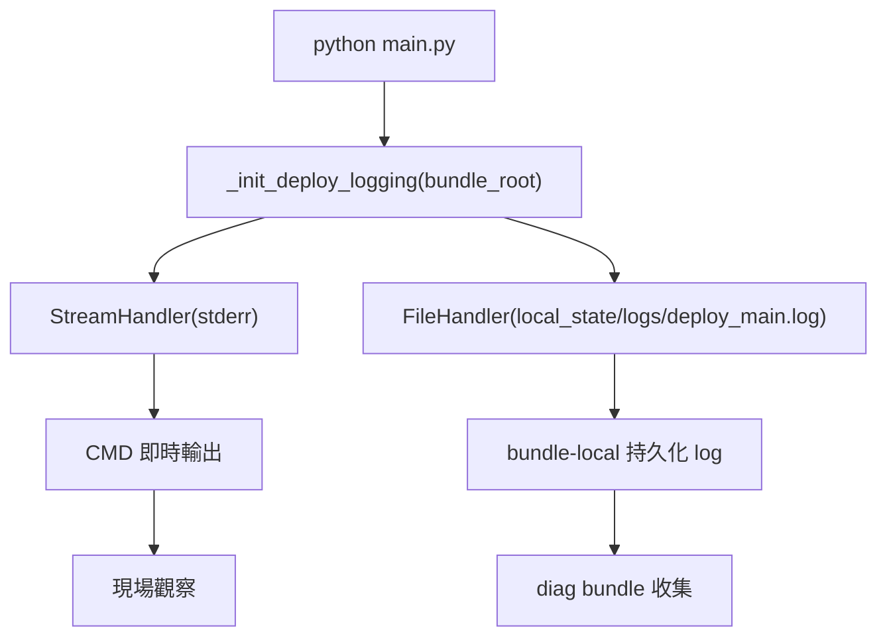

# Deploy Main Windows Console + File Logging - IMPLEMENTATION_PLAN

本文件是 **Implementation plan 層**，定義 `trainer_hightier.deploy.main` 在 Windows CMD 的 logging 策略：執行 `python main.py` 時，必須同時滿足「當前 CMD 即時可見」與「bundle-local 檔案可收集」。

本文件不展開 ticket 級 task 清單；工作拆解與 owner 應放在後續 working / execution plan。

上層契約：

- [`Scorer Runtime Contract - SSOT.md`](../../ssot/Scorer%20Runtime%20Contract%20-%20SSOT.md) — deploy/scoring runtime contract
- [`Feast Post-Startup Refresh Supervisor - IMPLEMENTATION_PLAN.md`](Feast%20Post-Startup%20Refresh%20Supervisor%20-%20IMPLEMENTATION_PLAN.md) — 既有 deploy 長駐背景流程與觀測語意

## Objective

在不改變 operator 啟動方式（仍為 bundle root 下 `python main.py`）前提下，建立單一 logging plane：

1. CMD 視窗持續即時輸出（方便現場觀察）。
2. 所有 deploy/api/validator/scorer 同一程序樹 log 同步寫入固定檔案。
3. 產生的 log 路徑與命名可被後續 production diagnostic bundle 收集與上傳至 model registry。

## Scope

### Included

- 在 `trainer_hightier/deploy/main.py` 建立顯式 logging 初始化函數（替代裸 `logging.basicConfig` 語意）。
- Root logger 同時掛載：
  - `StreamHandler`（stderr，保留 CMD 即時輸出）
  - `FileHandler`（bundle-local log file）
- 建立 bundle-local log 目錄（`local_state/logs/`）與固定檔名（`deploy_main.log`）。
- 啟動時輸出 log 配置摘要（log path、level、handler 數）。
- Logging 初始化要具備 idempotent 行為（避免重複 handler 導致重複行）。
- README deploy 操作說明更新（保留 `python main.py`，不要求 operator 改成 redirect）。

### Excluded

- 不新增外部 log collector（Windows Event Log、Fluent Bit、Cloud agent）。
- 不改動 scorer/validator/api 內部 logger naming。
- 不導入環境變數控制 logging 行為（依專案規範，採 config/程式內固定策略）。
- 不在本 slice 內實作完整 incident bundle collector（另案）。
- 不處理多進程/多機分散式 log 聚合。

## Adopted Decisions

| # | 決策 | 採用方案 |
|---|------|----------|
| 1 | Operator 命令 | 維持 `python main.py` |
| 2 | Console 即時輸出 | 保留 `StreamHandler`（stderr） |
| 3 | 檔案輸出 | 新增 `FileHandler` 寫入 bundle-local 檔 |
| 4 | 預設位置 | `<bundle>/local_state/logs/deploy_main.log` |
| 5 | 失敗策略 | 檔案 handler 建立失敗時不可中斷 deploy；至少保留 console logging 並明確 warning |
| 6 | 收集關聯 | diagnostic zip 上傳 MLflow 失敗不影響 zip 產出（由 collector 層承擔） |
| 7 | 保留策略 | collector 層保留最近 3 份 zip；log 本身先不在 deploy 層做複雜輪替策略 |

## Target Architecture

核心原則：**單一 root logger、雙 handler、一致 format**。

## Module Boundaries

| Module | 責任 | 本 slice 變更 |
|--------|------|---------------|
| `deploy/main.py` | deploy 入口、logging 初始化、mode 啟動 | **主要實作** |
| `config.py` | 若需常數化 log 相對路徑或檔名 | 可選（建議） |
| `build_deploy_package.py` | README / bundle layout 文件輸出 | README 說明同步更新 |
| `serving/*` | 子 logger 發送訊息 | 不改業務邏輯，沿用 root handlers |

## Logging Contract

### Path contract

- 預設 log file: `<bundle_root>/local_state/logs/deploy_main.log`
- `local_state/logs` 不存在時自動建立。
- 路徑解析以 bundle root 為錨，不依賴當前工作目錄。

### Format contract

沿用現行 format，避免運維解析破壞：

- `%(asctime)s %(levelname)s %(name)s: %(message)s`

### Initialization contract

- 初始化時先取得 root logger。
- 若已有相同目的地 handler，禁止重複掛載（idempotent）。
- 在 `main()` 最前段完成 logging 初始化，再做其餘 preflight/startup refresh。

### Failure contract

- 檔案 handler 建立失敗（權限/磁碟）：
  - deploy 流程不中止；
  - console handler 仍可用；
  - 以 warning 明確記錄失敗原因與目標路徑。

## Performance and Resource Considerations

本專案需在有限資源機器運行，logging 策略需控制額外負擔：

- CPU：單一格式化流程 + 單檔 append，額外開銷可忽略。
- RAM：不在記憶體緩存大型 log batch，採標準 handler 即時寫入。
- I/O：長時間服務可能導致檔案膨脹。此 slice 不引入複雜 rotate，但文件需標註後續可升級為 `RotatingFileHandler`（大小上限 + backup count）以避免磁碟壓力。
- 風險提示：若 incident 長時間高頻 debug log，磁碟可能快速增長；應搭配運維清理策略或後續 rotate slice。

## Phases and Deliverables

### Phase 1: Logging bootstrap abstraction

- 抽出 `_init_deploy_logging(bundle_root, level)` 類型函數。
- 實作 stream + file handlers 與 idempotent 保護。

**Deliverable:** deploy 入口可在不改 CLI 的情況下同時輸出 console + file。

### Phase 2: Path and startup integration

- 以 bundle root 推導 `local_state/logs/deploy_main.log`。
- 在 `main()` 起始完成 logging init，並輸出配置摘要。

**Deliverable:** Windows CMD 下直接 `python main.py` 可立即看到輸出且生成 log 檔。

### Phase 3: Packaging documentation alignment

- 更新 deploy README 對 logging 行為的說明：
  - 不需 `> file 2>&1`
  - 預設 log 位置
  - 排障時如何 tail/查看最後 N 行（Windows 指令示例）

**Deliverable:** operator 可在 bundle 內獨立操作，無需 repo 知識。

### Phase 4: Validation

- 單元或輕量整合驗證：
  - 啟動後 log 檔存在且有新內容。
  - CMD 仍有即時輸出（以 subprocess 捕捉 stderr 驗證）。
  - 重入初始化不重複寫雙倍 log。
  - 模擬無法建立檔案時，deploy 不 crash 且警告可見。

**Deliverable:** logging contract 可回歸測試。

## Milestones

- **M1:** `deploy/main.py` 完成雙 handler 初始化，`python main.py` 可見雙通道輸出。
- **M2:** README deploy 說明完成，operator 無需額外 redirect 命令。
- **M3:** 以長跑 smoke 驗證 log 檔可持續增長且不影響 scorer/validator/API 正常運作。

## Risks and Mitigations

| 風險 | 緩解 |
|------|------|
| Handler 重複掛載造成每行重複 N 次 | 初始化前檢查同型別/同檔案 handler；加 idempotent guard |
| log 檔過大造成磁碟壓力 | 文件標註容量風險；後續 slice 導入 rotating strategy |
| 檔案權限或路徑失敗導致啟動中斷 | fail-open：保留 console logging，僅告警 |
| 多執行緒同時寫檔互相干擾 | 使用 Python logging 內建 thread-safe handler，不自行實作鎖 |
| Windows 路徑分隔符不一致 | 全部以 `Path` 組路徑，最終轉字串給 handler |

## Validation Strategy

- Functional:
  - 啟動 `python main.py --mode scorer`，確認 CMD 有即時 log。
  - 確認 `<bundle>/local_state/logs/deploy_main.log` 內容同步更新。
- Regression:
  - `mode=api` / `mode=validator` / `mode=all` 都共用同一 logging 初始化，不應回退到 console-only。
- Resilience:
  - 人工將 `local_state/logs` 設為不可寫，確認流程不 crash 且 warning 出現在 console。

## Assumptions

- Windows production 以單機單程序（或單 bundle-root）運行 `python main.py`。
- 現有 logger 結構（deploy/api/scorer/validator）都走 Python logging root propagation。
- 後續 diagnostic collector 會以 `local_state/logs/` 為預設收集來源。

## Open Questions

- 是否在同一 PR 直接導入 `RotatingFileHandler`（例如 50MB x 5）以降低長期磁碟風險？  
  本文件先採最小可行（plain FileHandler），若要保守可在實作階段一併升級 rotating。

## Next Step

產出對應 working / execution plan（task/subtask/DoD），再進入 `deploy/main.py` 與 README 的實作與測試。
