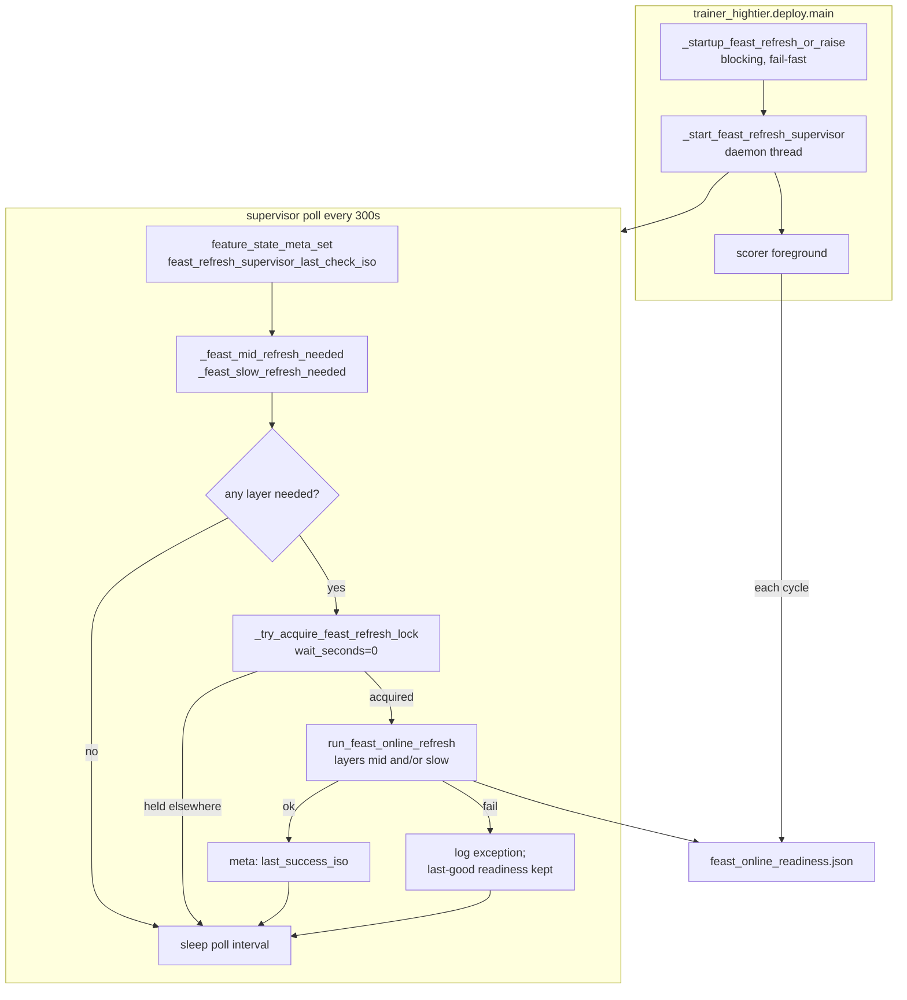

# Feast Post-Startup Refresh Supervisor - IMPLEMENTATION_PLAN

本文件是 **Implementation plan 層**，定義 scorer v2 production deploy 在 startup Feast refresh 之後，如何以 **in-process daemon supervisor** 維持 mid/long Feast online anchor freshness。本文不展開 ticket 級工作清單；具體 task 拆解應放到後續 working / execution plan。

上層契約：

- [`Scorer Runtime Contract - SSOT.md`](../../ssot/Scorer%20Runtime%20Contract%20-%20SSOT.md) — deploy / scoring contract
- [`Feast Online Refresh - IMPLEMENTATION_PLAN.md`](Feast%20Online%20Refresh%20-%20IMPLEMENTATION_PLAN.md) — refresh orchestration CLI 與 publish 順序
- [`Scorer v2 Feast Runtime - IMPLEMENTATION_PLAN.md`](Scorer%20v2%20Feast%20Runtime%20-%20IMPLEMENTATION_PLAN.md) — scorer v2 refresh plane 與 Phase 3b 背景

## Objective

在 `mode=all` / `mode=scorer` 的 long-running production deploy 中，於 **startup Feast refresh 成功後** 啟動 background supervisor，依 gaming-day / month-turn 契約自動觸發 mid + slow Feast online refresh，避免 anchor 過期後 scorer 只能 degraded scoring 或 hard fail。

Supervisor **不**負責 feature computation 本體；refresh body 完全 reuse `trainer_hightier.serving.feast_online_refresh.run_feast_online_refresh`。

## Scope

### Included

- Deploy-managed **daemon thread**（bundle-local poll loop）於 scorer-capable modes 預設啟用。
- Mid-term + slow 兩層 eligibility 判斷，anchor 來源為 `feast_online_readiness.json`（非 legacy Parquet manifest）。
- Background refresh 使用既有 bundle-local lock（`artifacts/feast/.feast_online_refresh.lock`）、`run_feast_online_refresh`、readiness publish 順序與 smoke gate。
- `feature_state_meta` 觀測鍵：supervisor poll / attempt / success timestamp。
- Config 常數與 CLI flag（`--no-feast-refresh-supervisor`）。
- Unit tests：eligibility、lock skip、fail-soft、mode gating（mock refresh）。

### Excluded

- Scoring-loop 內 refresh（`scorer.py` 仍只 consume readiness + Feast lookup）。
- Legacy Parquet snapshot supervisor 復活（`run_mid_term_refresh` / `run_slow_refresh` 不作 scorer v2 supplier path）。
- Short-term `fe__*` Feast online refresh。
- External cron / 外部 orchestrator 作為 primary path（可選 backup SOP，不與 in-process daemon 同時啟用）。
- Incremental ClickHouse export、refresh 期間 pause scorer、Feast feature view 改名。
- Production alert threshold / paging policy（ops 另定）。

## Adopted Decisions

| # | 決策 | 選項 |
|---|------|------|
| 1 | Scope | **mid + slow 一起** |
| 2 | Background 失敗 | **fail-soft**：log + meta + 下輪 retry；保留 last-good readiness；不 kill scorer |
| 3 | 與 scorer 並行 | **同時跑**；publish 成功前 scorer 繼續用舊 anchor |
| 4 | Background lock | **non-blocking skip**（wait=0）；拿不到 lock 則 skip 本輪 |
| 5 | Poll interval | **300s**（bundle config constant） |
| 6 | Slow 每日 check | **`missing` / `hard_cap_breached` bypass「今日已 check」**；其餘 slow 狀態維持每日最多 evaluate 一次 |
| 7 | 預設 | Supervisor **on**；不用 external cron 作 primary |
| 8 | Production RAM | **32GB** — mid+slow refresh 與 scorer 並行可接受；不實作 pause scorer |

### Startup vs background 語意對照

| 面向 | Startup（既有） | Post-startup supervisor（本 slice） |
|------|-----------------|-------------------------------------|
| 觸發 | missing / stale / `--force-feast-refresh` | eligibility（見下） |
| 失敗 | **fail-fast**，不啟動 scorer | **fail-soft**，scorer 繼續 |
| Lock | 短 wait（`feast_startup_refresh_lock_wait_seconds`），超時 abort deploy | non-blocking skip |
| `bootstrap_mid` | 允許（coverage 不足時） | **禁止** — 僅 incremental daily refresh |
| Smoke | deploy gate + allowlist lookup smoke | reuse `run_feast_online_refresh` 內建 smoke；失敗不 publish |

## Target Architecture

Supervisor 位置：**僅** `trainer_hightier/deploy/main.py` 新增 thread 與 eligibility helpers；不新增 orchestration CLI。

## Refresh Eligibility

Anchor 與 freshness 一律從 `load_feast_online_readiness()` 讀取，並 reuse `evaluate_mid_term_freshness` / `evaluate_slow_freshness`（`snapshot_freshness.py`）。Hard cap / grace / month-turn 閾值來自 `HightierServingConfig`，不在 supervisor 寫死。

Gaming day 關閉：**03:00 HK**（`gaming_day_close_hour`）。Mid 排程目標：**04:00 HK 後**（`mid_term_refresh_target_hour`）。

### Mid-term

| Freshness status | HK 時間 | Refresh? |
|------------------|---------|----------|
| `missing` | 任意 | **是**（立即） |
| `hard_cap_breached` | 任意 | **是**（立即） |
| `stale_allowed` | `< 04:00` | 否（等到 gaming day 關閉後窗口） |
| `stale_allowed` | `>= 04:00` | **是** |
| `fresh` | 任意 | 否 |

`require_mid` 為 false 時（model 無 Feast mid 欄位）跳過 mid eligibility。

### Slow

| Freshness status | 每日 check 限制 | Refresh? |
|------------------|-----------------|----------|
| `missing` | bypass | **是**（立即） |
| `hard_cap_breached` | bypass | **是**（立即） |
| `stale_allowed` | 受每日限制 | **是**（當日首次 evaluate 時） |
| `fresh` | 受每日限制 | 否 |

每日限制：寫入 `feature_state_meta`（建議新鍵 `feast_slow_refresh_last_check_day`，或文件化 reuse `slow_refresh_last_check_day` 語意僅限 Feast plane）。**僅** `fresh` 或未觸發 refresh 的 routine check 受「同日不重複 evaluate」約束；hard failure 狀態不受限。

`require_slow` 為 false 時跳過 slow eligibility。

### Layer selection for `run_feast_online_refresh`

- 僅 refresh needed layers（`mid` / `slow` / both）。
- `source="clickhouse"`（production default）。
- `bootstrap_mid=False`（background 永不 bootstrap）。
- `skip_apply`：registry 存在且非 bootstrap 時與 startup 相同（通常 skip apply，僅 materialize）。

## Module Boundaries

| Module | 責任 | 本 slice 變更 |
|--------|------|---------------|
| `deploy/main.py` | Supervisor thread、eligibility、lock 呼叫、mode gating | **主要實作** |
| `config.py` | Poll interval、background lock wait、target hour | 新增常數 / `HightierServingConfig` 欄位 |
| `serving/contracts.py` | `feature_state_meta` 鍵名 | 新增 supervisor 觀測鍵 |
| `feast_online_refresh.py` | Refresh body | **不變**（reuse） |
| `feast_readiness.py` | Readiness model / gate | **不變**（reuse evaluate helpers） |
| `scorer.py` | Scoring loop | **不變** |

## Config and CLI

新增 config（`trainer_hightier/config.py`，非 environment variable）：

| Constant / field | Default | 用途 |
|------------------|---------|------|
| `FEAST_REFRESH_SUPERVISOR_POLL_SECONDS` | `300` | Daemon poll interval |
| `FEAST_BACKGROUND_REFRESH_LOCK_WAIT_SECONDS` | `0` | Background lock：0 = non-blocking skip |

既有 reuse：

- `mid_term_refresh_target_hour` = `4`
- `mid_term_stale_hard_cap_days` = `3`
- `gaming_day_close_hour` = `3`
- `feast_startup_refresh_lock_wait_seconds` = `30`（僅 startup）

CLI（`deploy/main.py`）：

- `--no-feast-refresh-supervisor` — debug；停用 background supervisor（startup refresh 不受影響）。
- 既有 `--no-feast-startup-refresh` / `--force-feast-refresh` 語意不變。

Mode gating：

- `mode=all` / `mode=scorer`：startup refresh → **start supervisor** → scorer foreground。
- `mode=api` / `mode=validator`：不啟動 supervisor。

## Observability

`feature_state.db` → `feature_state_meta` 建議鍵：

| Key | 用途 |
|-----|------|
| `feast_refresh_supervisor_last_check_iso` | 最近一次 poll（UTC ISO） |
| `feast_refresh_supervisor_last_attempt_iso` | 最近一次實際啟動 refresh |
| `feast_refresh_supervisor_last_success_iso` | 最近一次 refresh verdict ok |
| `feast_slow_refresh_last_check_day` | Slow routine check 的 HK calendar day（YYYY-MM-DD） |

Refresh 詳細 audit 仍寫入既有 `feast_refresh_run` / `feast_refresh_layer`（由 `run_feast_online_refresh` 負責）。

Log prefix 建議：`[deploy] feast refresh supervisor`。

## Phases and Deliverables

### Phase 1: Eligibility helpers

- `_feast_mid_refresh_needed(cfg, readiness, *, require_mid) -> tuple[bool, str]`
- `_feast_slow_refresh_needed(cfg, readiness, *, require_slow) -> tuple[bool, str]`
- 從 bundle 推導 `require_mid` / `require_slow`（reuse startup plan 邏輯）

**Deliverable：** 可 unit test 的 pure eligibility API。

### Phase 2: Supervisor loop

- `_feast_refresh_supervisor_once(...)` — 單次 poll：meta → eligibility → lock → `run_feast_online_refresh` → meta
- `_feast_refresh_supervisor_loop(...)` — `while True: once(); sleep(poll)`
- `_start_feast_refresh_supervisor(...)` — daemon thread；在 `_startup_feast_refresh_or_raise` 成功後啟動

**Deliverable：** `mode=all` long-running deploy 自動 daily/monthly refresh。

### Phase 3: Config, CLI, contracts

- Config 常數與 deploy CLI flag
- Meta keys in `contracts.py`
- `build_deploy_package.py` 生成的 `README_DEPLOY.md` 段落更新（supervisor 預設 on、勿與 cron 並用）

**Deliverable：** Operator 可從 bundle README 理解 post-startup 行為。

### Phase 4: Tests

- Mid：fresh / stale@03:59 / stale@04:01 / hard_cap immediate
- Slow：post-gap wrong anchor / daily check bypass on hard_cap
- Supervisor once：needed → refresh called；lock held → skip；refresh raises → no propagate
- Mode：`mode=api` 不啟動 thread

**Deliverable：** CI 無 live CH/Feast 即可驗證 supervisor contract。

### Phase 5: SSOT alignment（implement 後）

更新上層文件，將 Phase 3b 從 future must-do 改為 adopted（指向本文件）：

- `Scorer Runtime Contract - SSOT.md` Deploy-Time Contract
- `Feast Online Refresh - IMPLEMENTATION_PLAN.md` excluded scope 第 37–38、55 行
- `Scorer v2 Feast Runtime - IMPLEMENTATION_PLAN.md` 「Future must-do: refresh cadence after startup」小節

**Deliverable：** 文件與 runtime 一致。

## Milestones

- **M1：** Eligibility helpers + unit tests green。
- **M2：** Supervisor thread 在 staging / fixture bundle 上完成至少一次 mid refresh cycle。
- **M3：** Production dry run：deploy 跨 1 個 gaming day rollover，確認 04:00 後 mid refresh、readiness anchor 前進、scorer 不 restart。
- **M4：** 跨月 slow refresh 驗證（或 month-turn fixture test + 一次 production 月轉觀測）。
- **M5：** SSOT / sibling IMPLEMENTATION_PLAN 交叉引用更新完成。

## Risks and Mitigations

| 風險 | 緩解 |
|------|------|
| Mid+slow refresh 與 scorer 並行造成 RAM spike | 32GB 假設下可接受；refresh 排程在 04:00+；log refresh 耗時；後續 slice 可做 incremental export |
| Background refresh 失敗導致 silent staleness | fail-soft 但 scorer 每 cycle 仍算 staleness；degraded / hard_cap 寫入 prediction_log 與 meta；supervisor retry |
| 雙 deploy process 同時 refresh | 共用 bundle-local lock；background non-blocking skip |
| Background smoke fail 覆寫 good readiness | reuse `run_feast_online_refresh`：smoke 失敗不 atomic publish |
| Slow 每日 check 延遲月轉 refresh | hard_cap / missing bypass 每日限制 |
| Operator 同時開 cron + daemon | README 明確禁止；提供 `--no-feast-refresh-supervisor` 給 cron-only 模式 |

## Validation Strategy

- **Unit tests**（mock time + mock `run_feast_online_refresh`）：eligibility、lock skip、fail-soft、mode gating。
- **Integration**（fixture bundle + local_cleaned 或 deploy_e2e_gate 路徑）：supervisor 觸發 refresh 並更新 readiness JSON。
- **Production dry run checklist：**
  1. `python main.py --mode all` startup refresh ok。
  2. 確認 log 出現 `feast refresh supervisor thread started poll_seconds=300`。
  3. 人工或等待 gaming day +1：04:00 後 mid refresh attempt meta 更新。
  4. `feast_online_readiness.json` 的 `anchor_gaming_day_max` 前進；scorer prediction_log `snapshot_scoring_degraded` 回到 false。
  5. 記錄 refresh wall time 與 peak RSS（預期 mid ~6min、slow ~4min 量級，與 spike 一致）。

## Assumptions

- Production host **≥ 32GB RAM**；Feast + DuckDB + scorer 並行可接受。
- Startup Feast refresh 已上線且 stable（`run_feast_online_refresh`、`feast_online_readiness.json` publish 順序不變）。
- 僅一個 scorer-capable deploy process 持續持有 bundle（多 instance 靠 lock 互斥，非 HA 設計）。
- ClickHouse credentials 在 bundle `.env` 長期有效。
- Model 仍使用 Feast mid/long supplier（frozen registry 分類不變）。

## Open Questions

- 無（adopted decisions 已關閉 Phase 3b 主要選項）。Working plan 可再細化 task owner 與 PR 切分。

## Next Step

產出 **Working / execution plan**（task breakdown、PR 順序、definition of done），再進入 `deploy/main.py` 實作 Phase 1–2。
