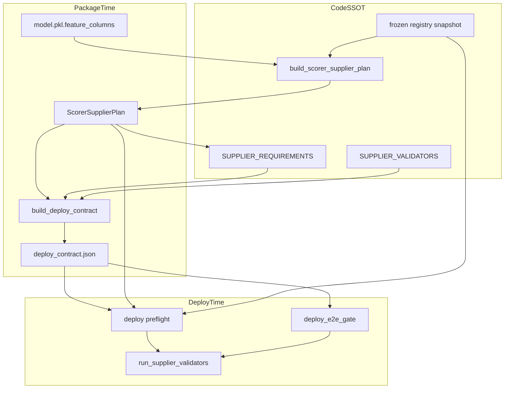

# trainer_hightier - Feature Supplier Contract Implementation Plan

本文件為 **Implementation Plan 層**，定義如何把 [`Feature Supplier Contract - SSOT.md`](../../ssot/Feature%20Supplier%20Contract%20-%20SSOT.md) 落地到 code、bundle 產物與 deploy gates。

它不重新定義 SSOT scope，也不展開 ticket 級工作清單（Working Plan 另案）。

**最後更新：** 2026-06-15

---

## 0) Scope

### In scope

- 建立 **supplier requirement map** 與 **validator registry**，使每個 production `runtime_supplier` 可機械查詢、可驗證。
- 在 package 階段生成 **`deploy_contract.json`**（derived artifact），內容來自 frozen registry + `ScorerSupplierPlan` + requirement map。
- 統一 **package / deploy e2e / deploy preflight** 的 supplier contract gate；讀 contract 時須 cross-check registry + plan builder，避免兩套真相。
- 補齊初版 validators，覆蓋現行 scorer v2 supplier taxonomy。
- 新增 focused tests：contract 生成、missing validator、unknown supplier、contract drift、gate failure path。

### Out of scope

- 不改 feature 計算語意、PIT 規則、mid/slow bounded ASOF（見 [`Scorer Runtime Contract - SSOT.md`](../../ssot/Scorer%20Runtime%20Contract%20-%20SSOT.md)）。
- 不實作 [`t_casino_txn Short-PIT Runtime - IMPLEMENTATION_PLAN.md`](t_casino_txn%20Short-PIT%20Runtime%20-%20IMPLEMENTATION_PLAN.md) 本體；僅把 `txn_lite_builder` 納入 contract / validator 框架。
- 不重做 Feast refresh supervisor、Step 6 parity runner、training pipeline。
- 不新增可手動調整 production feature algorithm 的 runtime config knobs。

---

## 1) Decisions

| ID | Decision | Rationale |
|----|----------|-----------|
| FSC-IMPL-001 | `deploy_contract.json` 僅 package 生成；preflight 讀取但須 cross-check registry + plan builder | 避免人工 drift；ops 可讀 derived artifact，真相仍在 code SSOT |
| FSC-IMPL-002 | 新增 `trainer_hightier/serving/feature_contract.py` 承載 requirement map、validator registry、contract builder | `feature_supply.py` 已負責 routing；contract 邏輯獨立模組較易測試，且不引入過度抽象 |
| FSC-IMPL-003 | Validator registry 以 `runtime_supplier` 為 key；缺 entry 時 package hard fail | 落實 SSOT FSC-004 |
| FSC-IMPL-004 | Contract schema version 初版為 `deploy_contract_v1` | 解決 SSOT OQ-002；後續 bump 須保留 audit trail |
| FSC-IMPL-005 | Emergency override 僅允許 connection / credential 類 env；不進 contract generator | 解決 SSOT OQ-003；path / supplier 行為不得 env 控制 |
| FSC-IMPL-006 | Rollout 分三階：report-only compare → strict package → strict deploy preflight | 降低一次性切換風險 |
| FSC-IMPL-007 | `active_manifest.json` 保留 metadata flags（如 `deploy_requires_ch_txn_supplier`），但 supplier 詳情以 `deploy_contract.json` 為準 | 與 SSOT derived-artifact 分層一致 |
| FSC-IMPL-008 | Contract builder 必須無條件加入 `bundle_static_artifact` requirements（mapping + ADT allowlist），不得只從 `ScorerSupplierPlan` 推導 | Mapping / allowlist 不在 model feature buckets；若不強制加入會漏掉 deploy 必備靜態 artifacts |
| FSC-IMPL-009 | Scorer v2 contract 中 `ScorerSupplierPlan.feast_trial_cols` 必須為空；非空為 hard fail | `feast_trial_1h` 僅歷史 source 標籤；production short features 應歸 `short_term_pit_builder`，不可留下 legacy supplier 灰區 |

---

## 2) Current State

### 已有能力

| 元件 | 現況 |
|------|------|
| [`feature_supply.py`](../../serving/feature_supply.py) | `build_scorer_supplier_plan()`、`ScorerSupplierPlan`、`assert_scorer_supplier_plan_or_raise()` |
| [`build_deploy_package.py`](../../build_deploy_package.py) | Package 時 build plan；`active_manifest` 可寫 `deploy_requires_ch_txn_supplier` |
| [`deploy_e2e_gate.py`](../../serving/deploy_e2e_gate.py) | `run_external_data_roots_gate()`、`run_deploy_smoke_gate()`、`run_scorability_gate()` |
| [`deploy/main.py`](../../deploy/main.py) | `_preflight_feature_supplyability()` 呼叫 plan + external roots check |
| [`txn_lite_ch_runtime.py`](../../serving/txn_lite_ch_runtime.py) | CH txn supplier readiness helper（scoped txn plan 產物） |

### 缺口

- **無** centralized supplier requirement map；各 gate 分散知道 CH / Feast / bundle artifact 需求。
- **無** validator registry；新增 supplier 無機械化「缺 validator 即 fail」。
- **無** `deploy_contract.json` generator；deploy preflight 無法讀取 per-model machine-readable contract。
- Package gate 的 `validation_stage="package"` 歷史上可跳過部分 runtime readiness；production 才暴露（txn path 事故即例）。
- Preflight 與 e2e gate 尚未驗證「bundle 內 contract 與 live recompute plan 一致」。

---

## 3) Target Architecture



### Per-model contract flow

```text
model.pkl.feature_columns
  → load_frozen_registry_for_bundle()
  → build_scorer_supplier_plan()
  → assert_scorer_supplier_plan_or_raise()
  → assert_no_legacy_feast_trial_cols(plan)
  → resolve_supplier_requirements(plan)
  → add_bundle_static_requirements(bundle_paths)
  → assert_all_suppliers_have_validators(plan)
  → build_deploy_contract(...) → deploy_contract.json
```

Deploy 時：

```text
load deploy_contract.json
  → recompute plan from bundle registry + model.pkl
  → assert_no_legacy_feast_trial_cols(plan)
  → assert_contract_matches_recomputed(contract, plan, registry_sha)
  → run registered validators per required supplier
  → hard fail on mismatch or readiness failure
```

---

## 4) Module Boundaries

| 模組 | 職責 | 不負責 |
|------|------|--------|
| [`feature_supply.py`](../../serving/feature_supply.py) | Feature → supplier routing；`ScorerSupplierPlan` | Contract JSON schema、validator registry |
| **`feature_contract.py`（新增）** | Requirement map、validator registry、contract builder、contract cross-check | Scoring、Feast refresh、feature compute |
| [`build_deploy_package.py`](../../build_deploy_package.py) | 呼叫 contract builder；寫入 bundle | Validator 實作細節 |
| [`deploy_e2e_gate.py`](../../serving/deploy_e2e_gate.py) | Orchestrate gate steps；呼叫 contract validators | 複製 scorer 邏輯 |
| [`deploy/main.py`](../../deploy/main.py) | Startup preflight；讀 contract + run validators | 手動維護 contract |

**原則**：validator 實作可委派既有 helper（如 `assert_ch_txn_supplier_ready_or_raise`、`run_deploy_feast_readiness_check`），contract 模組只做 registration 與 orchestration。

---

## 5) Supplier Requirement Map

初版 `SUPPLIER_REQUIREMENTS`（`runtime_supplier` → contract metadata）：

| `runtime_supplier` | Taxonomy | Runtime resources | Package artifact | Deploy gate |
|--------------------|----------|-------------------|------------------|-------------|
| `clickhouse_raw` | `clickhouse_raw` | CH `{source_db}.t_bet`；scoring input columns | — | CH connectivity smoke |
| `short_term_pit_builder` | `short_term_pit` | CH `{source_db}.t_bet` hot pool | — | CH schema + bounded PIT smoke |
| `txn_lite_builder` | `short_term_pit` | CH `{source_db}.t_casino_txn` | — | CH txn schema + sample `txn__*` |
| `feast_online_mid` | `feast_online_mid` | Bundle `feast_repo/` + online mid FV | `artifacts/feast/` readiness | Feast refresh + mid smoke |
| `feast_online_slow` | `feast_online_slow` | Bundle `feast_repo/` + online slow FV | `artifacts/feast/` readiness | Feast refresh + slow smoke |
| `composite` | `mid_composite` | Score-time deps from plan closure | — | Composite impl + dependency closure |
| *(bundle static)* | `bundle_static_artifact` | `mapping/canonical_player_mapping.parquet`、`mapping/adt_allowed_players_q0p99.parquet` | 同上 | Parquet schema + row count |

**禁止**將 training parquet（`fe_short_term_parquet`、`fe_derived_parquet`、cleaned txn root）列為 production requirement。

**強制加入**：`bundle_static_artifact` 不由 `ScorerSupplierPlan` 推導。Contract builder 每次都必須加入 mapping 與 ADT allowlist requirements；缺失時 package / deploy preflight hard fail。

**Legacy bucket policy**：`ScorerSupplierPlan.feast_trial_cols` 在 scorer v2 contract 中必須為空。若非空，表示 registry / inference 還把 feature 留在 legacy `feast_trial_1h` supplier，應在 package 階段 hard fail，並要求改歸 `short_term_pit_builder` 或明確新增受治理 supplier。

Requirement map 輸出結構（Python dataclass，非 JSON SSOT）：

- `supplier_id`（= `runtime_supplier` 或 `bundle_static_artifact`）
- `taxonomy`
- `required_clickhouse_tables: tuple[str, ...]`
- `required_bundle_paths: tuple[str, ...]`
- `required_feast_layers: tuple[str, ...]`
- `validator_id`
- `always_include: bool`（僅用於 `bundle_static_artifact` 等非 model bucket requirements）

---

## 6) Validator Registry

### 6.1 Registry shape

```python
SUPPLIER_VALIDATORS: dict[str, SupplierValidatorSpec] = {
    "clickhouse_raw": SupplierValidatorSpec(
        validator_id="validate_clickhouse_bet_source",
        stages=("deploy_e2e", "deploy_preflight"),
        fn=...,
    ),
    ...
}
```

每個 `SupplierValidatorSpec` 至少包含：

- `validator_id`：寫入 `deploy_contract.json`
- `stages`：在哪些 gate 執行
- `validate(plan, cfg, bundle_root) -> dict`：回傳 detail；失敗 raise

### 6.2 初版 validator 對應

| Validator ID | 覆蓋 supplier | 最低檢查 | 可重用現有 code |
|--------------|---------------|----------|-----------------|
| `validate_clickhouse_bet_source` | `clickhouse_raw`, `short_term_pit_builder` | CH 可連、`t_bet` required columns | `ch_adapter` patterns |
| `validate_ch_txn_supplier` | `txn_lite_builder` | CH `t_casino_txn` schema；sample 產出全部 model `txn__*` | `txn_lite_ch_runtime.assert_ch_txn_supplier_ready_or_raise` |
| `validate_feast_online_mid` | `feast_online_mid` | Readiness、anchor freshness、schema、cell-null | `feast_readiness.run_deploy_feast_readiness_check` |
| `validate_feast_online_slow` | `feast_online_slow` | 同上（slow 層） | 同上 |
| `validate_mid_composite` | `composite` | `assert_composite_implementations_or_raise` | `feature_supply` |
| `validate_bundle_static_artifacts` | bundle static | mapping / allowlist 存在、required columns | `build_deploy_package` static contracts |

### 6.3 Missing validator policy

- Package 時：`assert_all_suppliers_have_validators(plan)` → 任一 plan 中出現的 `runtime_supplier` 無 registry entry → **hard fail**。
- Package 時另跑 `assert_no_legacy_feast_trial_cols(plan)`；`plan.feast_trial_cols` 非空 → **hard fail**。
- `bundle_static_artifact` validator 不靠 `plan` 觸發；contract builder 必須固定加入並驗證。
- CI：新增 test 掃描 registry keys 與 taxonomy 對照表一致。

---

## 7) `deploy_contract.json` Schema（v1）

**Schema version：** `deploy_contract_v1`

**建議路徑：** `{bundle_root}/models/deploy_contract.json`（與 model bundle 同目錄，方便 preflight 載入）

### 7.1 Top-level fields

| Field | Type | 說明 |
|-------|------|------|
| `schema_version` | string | 固定 `deploy_contract_v1` |
| `generated_at` | ISO-8601 UTC | package 生成時間 |
| `model_version` | string | 來自 bundle |
| `feature_count` | int | `len(model.pkl.feature_columns)` |
| `registry_fingerprint` | string | frozen registry sha256 或等價 fingerprint |
| `supplier_plan` | object | 各 bucket column lists 或 stable hash |
| `requirements` | array | 本 model 需要的 `SupplierRequirement` 摘要 |
| `validators` | array | `{validator_id, supplier_id, stages}` |
| `flags` | object | `deploy_requires_clickhouse`, `deploy_requires_feast_online`, `deploy_requires_ch_txn`, … |
| `contract_fingerprint` | string | 對 plan + requirements 的 stable hash（cross-check 用） |

### 7.2 Cross-check rules

Preflight / e2e 必須：

1. 讀取 bundle 內 `deploy_contract.json`。
2. 從 bundle 重新 compute `ScorerSupplierPlan`。
3. 比對 `contract_fingerprint`、`feature_count`、`supplier_plan` bucket hash。
4. **不一致 → hard fail**，錯誤訊息須指出 drift 欄位；**不以 contract 覆寫 registry 真相**。

---

## 8) Gate Wiring

### 8.1 Package (`build_deploy_package`)

在現有 `build_scorer_supplier_plan()` 之後：

1. `assert_scorer_supplier_plan_or_raise(plan)`
2. `assert_no_legacy_feast_trial_cols(plan)`
3. `requirements = resolve_supplier_requirements(plan, include_bundle_static=True)`
4. `assert_all_requirements_have_validators(requirements)`
5. `contract = build_deploy_contract(...)`
6. 寫入 `models/deploy_contract.json`
7. 將 summary flags 鏡射到 `active_manifest.json`（optional，向後相容）

Phase 1 rollout 可先 **write + log compare** 而不 fail；Phase 3 改為 strict required artifact。

### 8.2 Deploy E2E (`deploy_e2e_gate`)

新增 gate step：`supplier_contract`（在 `bundle_contract` 之後、`external_data_roots` 之前或合併）：

1. Load + cross-check `deploy_contract.json`
2. Run validators for suppliers required by plan（依 contract `validators` 列表）
3. 合併 detail 進 `deploy_e2e_gate_report.json`

現有 `external_data_roots` / `deploy_smoke` / `scorability` 保留；逐步把分散邏輯收斂到 validator registry 呼叫。

### 8.3 Deploy Preflight (`deploy/main`)

`_preflight_feature_supplyability()` 擴充為：

1. 現有 registry + plan + `assert_deploy_external_data_roots_or_raise`
2. Load `deploy_contract.json` + cross-check
3. Run `deploy_preflight` stage validators

**禁止**僅 log warning 後繼續啟動 scorer（strict mode 下）。

---

## 9) Runtime Config Policy（Implementation）

- Resource binding 繼續由 `HightierServingConfig` + deploy bundle override（`.py`）提供。
- Contract generator **只讀** config 中的 `source_db`、bundle-relative paths；不寫入可變 absolute path 作為 SSOT。
- `.env` 僅透過既有 `apply_hightier_serving_environ_overrides()` 影響 credentials / connection；contract 與 validator **不得**新增 path override env keys。
- 移除或 deprecate production 對 `cleaned_casino_txn_root` 的 deploy requirement（與 txn short-PIT plan 對齊）；validator 改查 CH txn。

---

## 10) Phases and Milestones

### Phase 1 — Contract builder + report-only

- 新增 `feature_contract.py`：requirement map、validator registry skeleton、contract builder。
- Package 生成 `deploy_contract.json`；deploy preflight **只 compare + log**，不 hard fail on drift。
- Unit tests：contract generation、stable fingerprint。

**Milestone：** Active model `20260613-162313-3eb8de4` bundle 可產出 contract；42/42 routable 寫入 contract。

### Phase 2 — Validator hardening

- 實作初版 validators；接線 deploy e2e + preflight。
- Package fail on missing validator / unknown supplier。
- 整合 `txn_lite_ch_runtime` validator；移除 cleaned txn root deploy gate。

**Milestone：** 新增 supplier 無 validator 時 package CI fail；txn model deploy 不再要求 cleaned partition。

### Phase 3 — Strict contract enforcement

- Preflight / e2e hard fail on contract drift。
- `deploy_contract.json` 成為 strict bundle 必備產物。
- 更新 `README_DEPLOY.md` 說明 ops 如何解讀 contract（implementation 時改，非本 plan scope 的 doc 任務）。

**Milestone：** Production deploy 在 scorer 啟動前即可 fail-fast 所有 supplier contract violations。

---

## 11) Validation Strategy

### Unit tests（`tests/test_feature_contract.py`）

- `build_deploy_contract` 對固定 registry + model fixture 產出 stable fingerprint。
- Missing validator in registry → package assertion raises。
- Unknown `runtime_supplier` in plan → fail（via existing plan unknown_cols + registry coverage test）。
- `bundle_static_artifact` 即使 model plan 無對應 bucket，也必定出現在 requirements / validators。
- Non-empty `feast_trial_cols` → package assertion raises。
- Contract drift：mutate bucket → cross-check raises。

### Integration tests

- Extend [`test_build_deploy_package.py`](../../tests/test_build_deploy_package.py)：strict pack 產出 `deploy_contract.json`。
- Extend [`test_deploy_e2e_gate.py`](../../tests/test_deploy_e2e_gate.py)：`supplier_contract` step pass/fail paths。

### Acceptance（reference model）

對 `20260613-162313-3eb8de4`：

- Contract lists 42 features across suppliers consistent with SSOT taxonomy。
- Flags：`deploy_requires_clickhouse=true`，`deploy_requires_feast_online=true`，txn via CH not parquet。
- Deploy e2e + preflight pass with validators green。

---

## 12) Risks and Mitigations

| Risk | Mitigation |
|------|------------|
| Contract 與 registry 雙 SSOT drift | Cross-check fingerprint；不一致 hard fail |
| Validator 僅檢查 existence | SSOT 最低要求寫入 validator spec；code review checklist |
| `feature_supply.py` 與 contract 模組循環 import | Contract 模組只 import plan **types** 與 result dataclasses；builder 接受 plan 參數 |
| Rollout 一次 strict 阻斷現有 deploy | 三階段 rollout；Phase 1 report-only |
| Emergency override 被濫用 | FSC-IMPL-005；override 須 deploy log + 限 allowlist |
| Parity 與 production source 不一致 | Contract 標註 training vs production source pair；txn parity 另案 |

---

## 13) Acceptance Criteria

1. Bundle 含 versioned `deploy_contract.json`，由 package 自動生成，非人工維護。
2. 每個 active model 的 `runtime_supplier` 在 registry 有 validator；缺則 package fail。
3. Deploy preflight 與 e2e 使用同一 validator registry；結果可稽核。
4. Contract cross-check 可偵測 plan drift；strict mode hard fail。
5. Production 不要求 training/package absolute data path；`.env` 不控制 supplier 行為。
6. Reference model 42/42 features 可路由且 contract 與 SSOT taxonomy 一致。
7. Mapping / ADT allowlist 以 `bundle_static_artifact` 無條件進 contract；缺失 hard fail。
8. `feast_trial_cols` 在 scorer v2 contract 中為空；非空 hard fail。

---

## 14) Related Documents

| 層級 | 文件 |
|------|------|
| SSOT | [`Feature Supplier Contract - SSOT.md`](../../ssot/Feature%20Supplier%20Contract%20-%20SSOT.md) |
| Scorer runtime | [`Scorer Runtime Contract - SSOT.md`](../../ssot/Scorer%20Runtime%20Contract%20-%20SSOT.md) |
| Txn short-PIT（scoped） | [`t_casino_txn Short-PIT Runtime - IMPLEMENTATION_PLAN.md`](t_casino_txn%20Short-PIT%20Runtime%20-%20IMPLEMENTATION_PLAN.md) |
| Deploy E2E gate | [`Production-like Deploy E2E Gate - IMPLEMENTATION_PLAN.md`](Production-like%20Deploy%20E2E%20Gate%20-%20IMPLEMENTATION_PLAN.md) |
| Serving 事故 | [`Feature Serving Incident - 20260519.md`](../../incidents/Feature%20Serving%20Incident%20-%2020260519.md) |

---

## 15) Open Questions（Implementation 層已決）

| SSOT ID | 決策 |
|---------|------|
| OQ-001 | Code 落點：`trainer_hightier/serving/feature_contract.py` |
| OQ-002 | Schema：`deploy_contract_v1`；path `models/deploy_contract.json` |
| OQ-003 | Emergency override allowlist 僅 connection/credential；須 deploy log |

**下一步（非本文件）**：撰寫 **Working Plan**，拆解 Phase 1–3 的具體實作與驗收任務。
