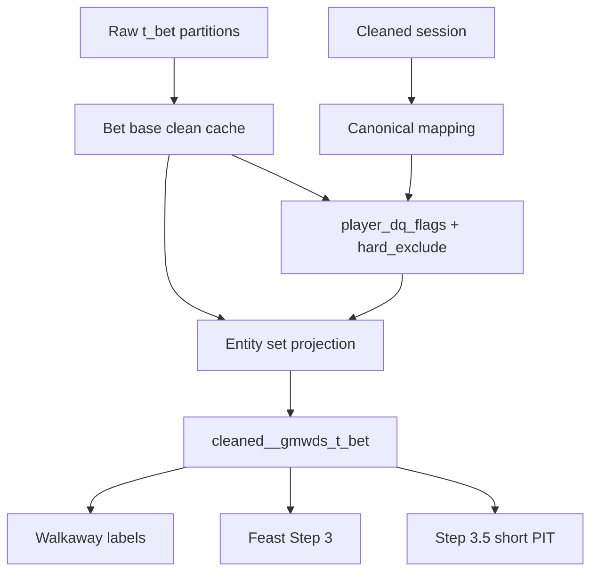

# trainer_hightier - Player DQ Implementation Plan

本文件為 **Implementation plan 層**，定義如何把 player-level DQ 接入現有 high-tier training pipeline。範圍聚焦 realization strategy、cache invalidation、模組邊界與驗證；不展開 ticket 級任務清單。

## Scope

- v1 hard exclude：`casino_player_id` cleaned 後 `LIKE '4444%'`，以及 pace hard thresholds。
- v1 review flag：pace review thresholds，保留在訓練資料中，只輸出調查 artifact / metrics，不 join 回 model features。
- v1 不納入 multi-table 同秒規則。
- `PlayerDqConfig.enabled=True` 為預設；關閉時應盡量維持既有 cache fingerprint 行為。

## Decisions

- Threshold 比較使用嚴格 `>`：hard 為 `>240 games/hour` 或 `>2880 games/day`；review 為 `>120 games/hour` 或 `>1440 games/day`。
- Pace 使用 distinct `game_id`，以 `payout_complete_dtm` 分 hour / day bucket。
- Hard exclude 粒度為 `player_id`，不是 `canonical_id`。
- Review flag 不作為 model feature，避免時間洩漏、serving parity 問題與 schema churn。
- Hard exclude 接在 `cleaned__gmwds_t_bet_base` 之後、entity set / legacy segment 投影之前，不修改 bet base clean。

## Target Files

- `trainer_hightier/config.py`：新增 `PlayerDqConfig`，並接到 `HighTierTrainArgs`。
- `trainer_hightier/utils/player_dq.py`：新增 player DQ artifact materializer。
- `trainer_hightier/utils/entity_set_v1.py`：把 hard-exclude policy fingerprint 納入 entity set cache key，並在 entity projection anti-join hard excludes。
- `trainer_hightier/utils/bet_l0_preprocess.py`：legacy ADT segment path 加 hard-exclude anti-join；不改 base clean cache record。
- `trainer_hightier/trainer.py`：在 Step 2b base clean cache 之後、entity set 之前呼叫 player DQ materializer，並寫 run metrics。
- `trainer_hightier/tests/`：新增或擴充 focused tests，覆蓋 flags、fingerprint、cache hit/miss、enabled rollback。

## Data Flow

## Implementation Approach

1. Add `PlayerDqConfig` with explicit constants:
   - `enabled=True`
   - `known_test_casino_player_id_prefixes=("4444",)`
   - `hard_distinct_game_id_per_hour=240`
   - `hard_distinct_game_id_per_day=2880`
   - `review_distinct_game_id_per_hour=120`
   - `review_distinct_game_id_per_day=1440`
   - output paths under `trainer_hightier/artifacts/dq/`.

2. Implement `trainer_hightier/utils/player_dq.py`:
   - Read from `cleaned__gmwds_t_bet_base` for pace metrics.
   - Read from canonical mapping for cleaned `casino_player_id` test-account mapping.
   - Write `player_dq_flags.parquet` with `player_id`, hard/review booleans, max pace metrics, and reason columns.
   - Write `player_dq_hard_exclude.parquet` with only hard-excluded `player_id` rows.
   - Write sidecar manifest keyed by bet base fingerprint, canonical mapping file hash, hard policy fingerprint, flags policy fingerprint, and module code fingerprint.

3. Preserve cache locality:
   - Do not include player DQ in `build_bet_base_clean_cache_record`.
   - Do not edit base bet cleaning SQL.
   - Add only hard-exclude policy fingerprint to entity set policy fingerprint.
   - Keep review policy fingerprint scoped to the DQ artifact sidecar only.

4. Update entity set projection:
   - Add optional `hard_exclude_parquet` argument to the entity projection path.
   - Apply anti-join on `TRY_CAST(b.player_id AS BIGINT)` only when DQ is enabled and hard-exclude parquet exists.
   - Extend `entity_set_cache_is_hit` and manifest write/read to compare `hard_exclude_policy_fingerprint`.

5. Update legacy segment fallback:
   - Add equivalent optional anti-join to `segment_cleaned_bet_from_base_parquet`.
   - Include hard-exclude policy in legacy segment policy fingerprint when enabled.

6. Update trainer orchestration:
   - After bet base clean is available and canonical mapping exists, materialize player DQ artifacts.
   - Pass `hard_exclude_parquet` and `hard_exclude_policy_fingerprint` into entity set or legacy segment.
   - Emit metrics: `player_dq_flags_cache_hit`, `player_dq_hard_player_count`, `player_dq_review_player_count`, `player_dq_known_test_player_count`, `player_dq_hard_bet_estimate` if cheap.

7. Tests:
   - Unit test DQ materializer with small Parquet fixtures for `4444`, hard pace, review pace, and clean players.
   - Test review players remain absent from hard-exclude output.
   - Test `enabled=False` preserves prior entity set fingerprint behavior.
   - Test changing review thresholds invalidates only DQ flags cache, not entity set fingerprint.
   - Test changing hard thresholds invalidates entity set fingerprint.
   - Test entity projection excludes hard players and keeps review players.

## Cache Impact

- Preserved: source manifest, session clean, canonical mapping inputs, ADT rank / selected universe, bet base clean.
- First run miss expected: player DQ artifact, entity set projection, labels, Step 3 affected month groups, Step 3.5 short PIT shards.
- Subsequent same-source runs should hit player DQ artifact, entity set, labels, Step 3, and Step 3.5 caches.
- `enabled=False` rollback should avoid applying anti-join and avoid changing the entity set policy fingerprint compared with current behavior.

## Validation

- Run focused pytest for new DQ and entity-set cache tests.
- Run a smoke command with caches enabled and inspect metrics for expected first-run misses.
- Rerun the same smoke command to verify cache hits return.
- Validate hard-exclude count matches investigation expectation: the two pace hard players plus `4444` mapped players, with only currently active `4444` bet rows contributing to row removal.

## Risks And Mitigations

- Risk: Including review policy in entity set fingerprint would cause unnecessary cache misses. Mitigation: split hard policy fingerprint from flags policy fingerprint.
- Risk: Hard exclude by `canonical_id` could over-exclude legitimate linked players. Mitigation: v1 uses `player_id` only.
- Risk: Offline-only review flag could leak future information if used as a feature. Mitigation: keep review in artifact / CSV only, not model features.
- Risk: First run short PIT cache miss is expensive. Mitigation: accepted for v1; leave shard-level invalidation as a future optimization if runtime is unacceptable.
