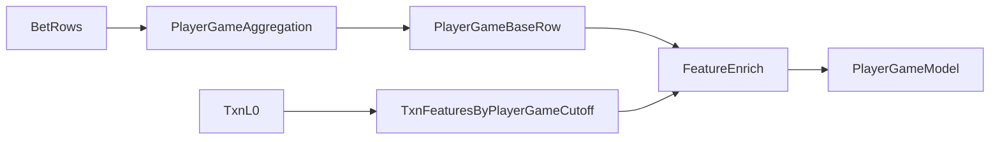
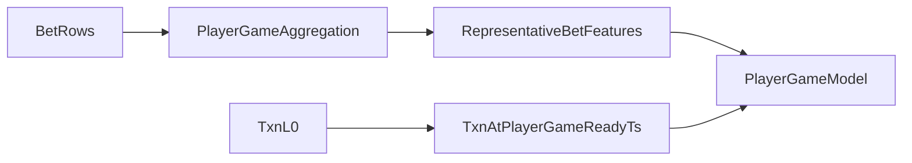
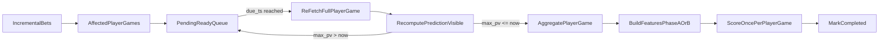

# trainer_hightier - Player-Game Grain Implementation Plan

本文件屬於 **Implementation Plan 層**，定義如何把 high-tier walkaway 從「bet-level model + player-game score aggregation」遷移到 **true player-game grain**（同一 `player_id + game_id` 的主注與邊注先合併，再 score 一次），並在 serving 以 **player-game ready queue + visibility holdback** 避免 late side bet 被漏掉。

本文件不重新定義 label 業務語意；ticket 級執行拆解應另由 Working Plan 承接。

## 0) 對齊範圍與非目標

### 0.1 Governing 文件

| 文件 | 角色 |
|------|------|
| [`Scorer Runtime Contract - SSOT.md`](../../ssot/Scorer%20Runtime%20Contract%20-%20SSOT.md) | Serving / PIT / `prediction_visible_ts_cf` 語意 |
| [`Data pipeline - SSOT.md`](../../ssot/Data%20pipeline%20-%20SSOT.md) | Step 3–5 training grain、cleaned bet contract |
| [`time_semantics_and_feast_mapping.md`](../../contracts/time_semantics_and_feast_mapping.md) | `prediction_visible_ts_cf` poll ceiling 公式 |

較早的 repo 根目錄 [`doc/player_game_level_evaluation_implementation_plan.md`](../../../doc/player_game_level_evaluation_implementation_plan.md) 僅涵蓋 **evaluation/alert 層 aggregation**（`top3_mean`）；本計畫涵蓋 **model input grain、feature materialization、serving completeness**，為上位實作計畫。

### 0.2 範圍

- 凍結 player-game row contract：`player_id + game_id`，`player_game_ready_ts = max(prediction_visible_ts_cf)`。
- Offline player-game materializer：main/side bet aggregation、DQ audit、PIT cutoff 對齊。
- Serving **pending ready queue**：45s visibility holdback、re-fetch、defer、completed idempotency。
- Offline 比較：current `per-bet + top3_mean` vs true player-game model；**serving migration gate 以 baseline-parity fair test 為準**。
- Train/serve parity 分兩階段：
  - **Phase A（now）：** minimal parity — 非 `txn__*` 從 `representative_bet_id` 帶入；`txn__*` 以 `player_game_ready_ts` PIT（對齊 offline B1）。
  - **Phase B（later）：** full PIT — short/mid/feast/txn 全部以 `player_game_ready_ts` 為 cutoff；shadow gate 通過後再做。

### 0.3 非目標

- 不改 `walkaway_label` 定義與 lookahead/gap。
- 不在本輪做 prefix/in-game alert（局未完全可見即 score）。
- 不把 alert 再聚合到 player-day / player-session。
- 不調整 `SCORER_POLL_INTERVAL_SECONDS`（維持 45s）；accepted latency worst ≈ **+75s** vs 過去 first-visible scoring。
- 不在 Phase A 做 full short/mid/feast PIT re-materialization（延後至 Phase B）。

## 1) 已定決策（Decision Log）

| ID | 決策 | 理由 |
|----|------|------|
| PG-001 | Canonical key = `(player_id, game_id)` | `game_id` 假設全域唯一；全量 audit 支持 player-game 層 `payout_complete_dtm` 幾乎一致 |
| PG-002 | `player_game_ready_ts = max(prediction_visible_ts_cf)` within group | 對齊 counterfactual visibility；涵蓋 late side bet 的最晚可見時間 |
| PG-003 | Serving holdback = `first_seen_prediction_visible_ts_cf + SCORER_POLL_INTERVAL_SECONDS` | 無 oracle 知道 late bet；bounded wait 後 re-fetch |
| PG-004 | 接受 worst +75s vs 舊 first-visible score | 45s holdback + ~30s scorer loop wait |
| PG-005 | Label = `max(bet_label)` within player-game | 與現有 alert aggregation 一致 |
| PG-006 | DQ：同 player-game `payout_complete_dtm` span > 60s 或跨 table/跨天 → exclude | 極少數 `game_id` reuse / CDC 異常不等 |
| PG-007 | Serving migration gate = baseline-parity fair test | Sparse composition-only PG arms 不足以作 go/no-go；需 42 MVP 特徵公平比較 |
| PG-008 | Phase A feature path before full PIT | Full materialization 耗時大；先以 representative bet + txn_pg 驗證 serving path |

## 2) 資料檢查摘要（2026-06）

- Cleaned bet（~66.9M rows, 202501+）：同 `player_id + game_id` 的 `payout_complete_dtm` 幾乎一致；`prediction_visible_ts_cf` spread 正常 ≤ 45s。
- `__etl_insert_Dtm_synthetic` 同局內常不一致（~24% player-games）；**不可**作 group cutoff。
- 相對 `payout_complete_dtm`，worst score time ≈ `2m avail_delay + 45s poll + 45s holdback + loop wait` ≈ **4m**。
- Offline baseline-parity gate（2026-06-16）：native PG @ K=3149 precision 58.8% vs baseline 57.9% — **pass**。

## 3) Player-Game Row Contract

一列 = 玩家在一局內、於 decision time 前可見的所有合格 bets。

| 欄位 | 說明 |
|------|------|
| `player_id`, `game_id` | Grain key |
| `player_game_payout_complete_dtm` | 組內單一 `payout_complete_dtm`（DQ 異常除外） |
| `player_game_ready_ts` | `max(prediction_visible_ts_cf)` |
| `player_game_label` | `max(walkaway_label)` |
| `representative_bet_id`, `bet_ids` | Audit；Phase A 中非 txn 特徵來源 |
| `pg__*` features | 見 §4 |

## 4) Aggregation Design

### 4.1 Exposure / amount

- `pg__bet_count`, `pg__main_bet_count`, `pg__side_bet_count`
- `pg__wager_sum`, `pg__wager_max`, `pg__wager_mean`, `pg__wager_std`
- `pg__main_wager_sum`, `pg__side_wager_sum`, `pg__side_wager_ratio`
- `pg__casino_win_sum`, `pg__payout_odds_wager_weighted_avg`（settlement 欄位需 leakage audit）

### 4.2 Main / side composition

- `pg__has_main_bet`, `pg__has_side_bet`, `pg__side_only_flag`
- `pg__distinct_bet_type_count`, top-K `bet_type` counts/sums
- `pg__side_to_main_wager_ratio`

### 4.3 Temporal / audit

- `pg__pcd_span_seconds`, `pg__prediction_visible_span_seconds`, `pg__synthetic_observed_span_seconds`
- `pg__late_side_bet_flag`
- table/session mismatch flags（多值時不 arbitrary `last`）

## 5) Feature Joining（PIT）

### 5.1 Target architecture（Phase B）



- Mid/slow：`canonical_id + player_game_ready_ts`（或 gaming-day anchor，與現有 mid 語意對齊）。
- Short-term：cutoff = `player_game_ready_ts`；排除本 player-game bets。
- Txn：由 `bet_id` grain 改為 `player_id + player_game_ready_ts`。

### 5.2 Phase A — minimal parity（serving migration 第一版）



- 非 `txn__*`：從 `representative_bet_id` 對應 bet row 帶入（與 offline B1 一致）。
- `txn__*`：`player_id + player_game_ready_ts` PIT。
- 限制：feast / short / mid 仍為 bet-level PIT，與 `player_game_ready_ts` 可能有微小偏差；shadow gate 須驗證 train-serve parity。

## 6) Serving Flow

不在第一批 bet 可見時立即 score。



**State**

- Pending：`player_id`, `game_id`, `first_seen_prediction_visible_ts_cf`, `due_ts`, `attempt_count`
- Completed：`player_id`, `game_id`, `player_game_ready_ts`, `scored_at`, `representative_bet_id`
- Idempotency：同一 `(player_id, game_id)` 僅一次 business score（late-after-score 另記 audit）
- Cursor：incremental cursor 可前進；scoring identity 為 pending/completed player-game

**Example**

```text
14:54:45  A(main), B(side) visible -> enqueue, due_ts=14:55:30
14:55:30  re-fetch -> A, B, C(late side); max(pv)=14:55:30 -> score once
```

## 7) Implementation Phases

| Phase | 內容 | 狀態 |
|-------|------|------|
| P1 | Offline DQ + player-game materializer prototype | Done |
| P2 | Offline experiment + baseline-parity gate | Done（gate pass） |
| P3 | Contract hardening（registry、scorer contract、`player_game_ready_ts`） | Partial |
| P4 | Serving ready-queue dry-run（completeness / +75s / late-after-score） | Done |
| P5 | Shadow-capable scorer（Phase A minimal parity；不改 prod route） | Done |
| P6 | Shadow gate → production switch；Phase B full PIT；retire `top3_mean` prod path | **Next** |

## 8) Validation Gates

- 每 `(player_id, game_id)` 訓練集僅一列；null key 可追蹤排除。
- `player_game_ready_ts = max(prediction_visible_ts_cf)`；serving `scored_at >= player_game_ready_ts`。
- Holdback：不得在 `first_seen + SCORER_POLL_INTERVAL_SECONDS` 前 score。
- PIT（Phase B）：joined features 不晚於 `player_game_ready_ts`。
- PIT（Phase A）：`txn__*` 不晚於 `player_game_ready_ts`；非 txn 來自 representative bet（documented approximation）。
- Composition：bet_count / wager_sum 與原始 bets 一致。
- Observation DQ：`pcd` span > 60s 或 `pv` span > 45s → warn/exclude。
- Completeness：`late_after_score` 計數與 sample。
- Metrics：固定 capacity 下 baseline-parity player-game precision/recall vs `top3_mean` baseline。
- Shadow serving：feature / score parity vs offline baseline-parity arm within agreed tolerance。

## 9) Open Workstreams

- [x] PG-002 / PG-003 contract 凍結
- [x] P1 offline materializer + DQ audit
- [x] P2 offline comparison（baseline-parity gate pass）
- [ ] P3 contract hardening（registry、doc sync）
- [x] P4 serving ready-queue dry-run
- [x] P5 shadow-capable scorer migration（Phase A）
- [ ] P6 shadow gate + production switch + Phase B full PIT

## 10) 相關程式碼

- [`player_game_grain.py`](../../../player_game_grain.py) — materializer、baseline-parity enrich、PG train
- [`feature_experiment/player_game_grain_experiment.py`](../../../feature_experiment/player_game_grain_experiment.py) — W2 offline harness
- [`05_lgbm_train.py`](../../../05_lgbm_train.py) — 現行 `aggregate_bets_to_player_game` / `top3_mean`
- [`serving/scorer.py`](../../../serving/scorer.py) — incremental fetch、`_build_player_game_alert_frame`
- [`utils/bet_l0_preprocess.py`](../../../utils/bet_l0_preprocess.py) — `prediction_visible_ts_cf` 計算
- [`serving/feature_builder.py`](../../../serving/feature_builder.py) — serving 端 synthetic + poll ceiling
- [`config.py`](../../../config.py) — `BET_AVAIL_DELAY_MIN`, `SCORER_POLL_INTERVAL_SECONDS`
