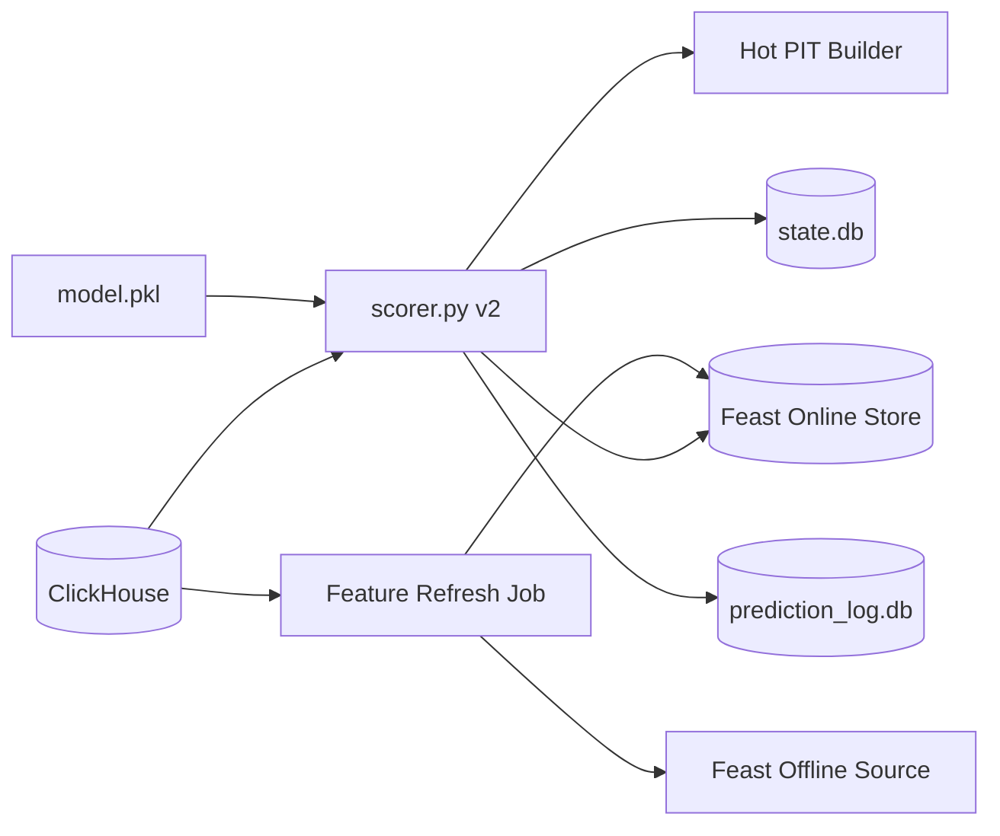
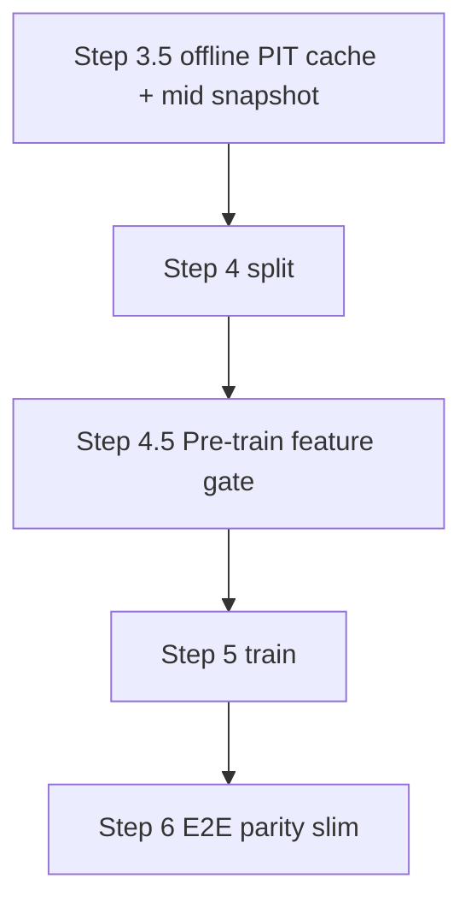

# Scorer v2 Feast Runtime - Implementation Plan

本文件是 **Implementation plan 層**，定義 `trainer_hightier` scorer v2 的 realization strategy、模組邊界、階段里程碑、風險與驗證策略。本文不展開 ticket 級工作清單；具體 task 拆解應放到後續 working / execution plan。

**治理對齊**：特徵四層（raw / short / mid / long）、short-term PIT 語意、離線 PIT cache、hot pool 邊界以 [`Scorer Runtime Contract - SSOT.md`](../../ssot/Scorer%20Runtime%20Contract%20-%20SSOT.md) 為準；與本文衝突時先改 SSOT。

## Context

現有 `trainer_hightier.serving.scorer` 已累積過多 patch：同一主流程同時負責 ClickHouse 增量抓取、allowlist、watermark、hot feature pool、Parquet snapshot join、freshness gate、prediction log、alert 寫入與 daemon loop。這讓 supplier contract 遷移和 Feast 導入都變得高風險。

Feast feasibility spike 已證明 allowlist 範圍內的 production compute path + online lookup 在速度上可行：

- mid-term：ClickHouse export + DuckDB compute 約 6.1 分鐘；Feast lookup 約 0.39 ms/entity。
- long-term：ClickHouse export + DuckDB compute 約 3.8 分鐘；Feast lookup 約 0.14 ms/entity。
- 主要剩餘風險不是 lookup latency，而是 mid-term coverage、`prior_*` NULL policy、refresh ownership、以及 scorer readiness gate。

## Adopted Decisions

- Scorer v2 直接替換現有 `trainer_hightier.serving.scorer` 主流程；只保留必要外部 contract（entrypoint / 支援中的 CLI 形狀 / `state.db` alerts 與 validation schema），不保留舊 feature supplier 相容路徑。
- Scorer v2 第一版直接導入 Feast online lookup：
  - mid-term `fe__*` 由 Feast online store 供應。
  - long-term `patron__*__w180d_m1snap` 由 Feast online store 供應。
  - raw baseline 欄位仍由 ClickHouse scoring input 供應。
  - **short 單層**（`bet__*` + short-horizon `fe__*`）一律由 **bounded live PIT**（`short_term_pit_builder`）供應；registry `source: feast_trial_1h` 僅為歷史標籤，**不是**與 `fe_derived` short 不同的時間層。
- **Production short 唯一主路徑（決策 A）**：scorer 僅 `attach_trial_bet_behavior_1h` + `attach_short_term_pit_features`（live pool）；**不得**以 Route B `fe_short_term_parquet` join 作 production readiness 或主供應。該 parquet 若保留，僅 diagnostic / 歷史 Route B。
- **訓練**使用 **offline short-term PIT cache**（artifact 慣用名 `_main_trainer_fe_short_term.parquet`；manifest 鍵 `fe_short_term_parquet`）：對訓練集每個 `bet_id` 離線算 PIT 後 join enrich；**語意仍為 PIT**，不是 mid 式可給未見 bet 查表的全局特徵表。
- **`expand_canonical_aliases=False`** 為訓練物化、pre-train gate、Step 6 replay、**production scorer** 的統一政策（與 bounded materialize 一致）。
- **Hot pool**：`pool_start = min(payout_min − hot_feature_pool_lookback_hours, gaming_day_open)`；baseline 維持 `fe__canonical__*__today` 時 **保留 gaming day floor**（不可改為僅 6h）。
- 不保留 scorer runtime fallback 到 legacy training Parquet、`fe_derived_parquet` 或 training-scoped `fe_short_term_parquet`。Feast readiness 或 short-term PIT supplier readiness 不通過時，scorer 應 fail fast。
- **Train-serve parity 分兩段**（見下 §Train-serve parity gates）：**Step 4.5** 在 Step 5 前 hard-fail short（及 mid 靜態）錯誤；**Step 6** 瘦身為 bundle + Feast **e2e**。
- Production scope 仍是 ADT allowlist only；`wider_sample` 不作為 production gate。
- **欄位前綴 v2**（`short__` / `mid__`）：**defer**（P3）；本 follow-on 僅文件與 supplier 語意，不改 `model.pkl` 欄位名。

## Target Architecture

Scorer v2 的核心原則是把 heavy mid/long feature computation 移出 request-time scoring path。每日或排程 refresh job 負責 ClickHouse export、DuckDB materialization、Feast materialize；scorer 只針對本輪新 bet 做 bounded hot / short-term PIT feature 計算與 Feast online lookup。

## Short-term layer & Scoring Context Contract

### Semantic model (one short layer)

| 概念 | 說明 |
|------|------|
| **Live PIT** | Production 與 parity replay 主路徑：每批 bets 拉 hot pool → trial 1h pack（`bet__*`）+ derived SQL（short `fe__*`） |
| **Offline PIT cache** | 訓練 Step 3.5：對 `training_set` 內 `bet_id` 用**同一 contract** 寫 parquet，供 Step 4 enrich；加速 ML，**不**供應 production 新 bet |
| **非目標** | 將 `bet__*` 與 short `fe__*` 當成兩個時間層（Short-T / Short-PIT）；將 cache 稱為「非 PIT 預計算」 |

### Scoring Context Contract（P1 單一真相）

下列參數在 **materialize、scorer、pre-train gate、Step 6 short smoke** 必須一致：

| 參數 | 治理值 |
|------|--------|
| `expand_canonical_aliases` | `False` |
| Batch 排序 | `payout_complete_dtm ASC`, `bet_id ASC` |
| Batch size | `HightierServingConfig.hightier_scorer_max_bets_per_cycle`（預設 2000） |
| Pool 起點 | `compute_hot_pool_window_start`（6h + gaming day open floor） |
| 計算入口 | 單一 `build_short_term_features_for_batch`（或等價模組），內含 trial + `compute_fe_derived_features_from_pool` |

Implementation 不把 trial SQL 與 derived SQL 合併成單一公式檔；只合併 **context 與呼叫路徑**。

## Module Boundaries

### 1. Scorer Orchestration

`trainer_hightier.serving.scorer` 應成為薄 orchestration layer：

- 載入 model bundle、frozen registry、runtime config。
- 讀取 active allowlist 與 Feast readiness metadata。
- 以 ETL cursor 從 ClickHouse 抓取下一批可見 bet。
- 套用 high-ADT allowlist。
- 建立 raw + hot event-level + short-term `fe__*` PIT features。
- 對 canonical ids 批次查詢 Feast mid/long features。
- 執行 feature readiness gate。
- `predict_proba` 後寫入 prediction log 與 alerts。
- 僅在整批成功 durable write 後推進 ETL cursor。

### 2. Feature Supplier Resolver

新增或重構明確的 supplier resolver，責任是把 `model.pkl.feature_columns` 映射到 runtime supplier：

| Feature family | Runtime supplier |
|----------------|------------------|
| `baseline_model` | ClickHouse scoring input |
| **short**（`bet__*` + short `fe__*`） | `short_term_pit_builder`（live PIT） |
| mid-term `fe__*` | Feast online lookup + Option B bounded window（scorer 後處理） |
| long-term `patron__*__w180d_m1snap` | Feast online lookup |

Resolver 必須使用 frozen registry；`allowed_training_supplier: short_term_pit_builder` **優先於** `source: feast_trial_1h`（P2）。`feast_trial_cols` 供應分桶應併入 `short_term_cols` 或標 deprecated。

`fe_short_term_parquet` **不可**出現在 production scorer 主路徑；training cache 與 Route B rolling cache 不得作 readiness 替代。測試用 mock / fixture，禁止 production Parquet fallback branch。

### 3. Feast Online Adapter

Feast adapter 應是 scorer v2 唯一接觸 Feast SDK 的邊界：

- 接受一批 `canonical_id` / event timestamp metadata。
- 用 dict-of-lists `entity_rows` 執行 batch `get_online_features`。
- 回傳與 scorer batch 對齊的 DataFrame。
- 記錄 lookup latency、row count、missing count、feature family missing rate。
- 對 Feast schema / feature service 名稱做啟動時 smoke check。

Adapter 不負責 feature computation，也不負責 NULL imputation。

### 4. Refresh / Materialize Plane

Refresh plane 負責把 production feature values 推進 Feast online store：

- mid-term：ClickHouse cleaned bet source + DuckDB canonical daily snapshot。
- long-term：ClickHouse cleaned session source + DuckDB canonical slow snapshot。
- apply / materialize Feast definitions。
- 寫入 readiness metadata：latest anchor、generated_at、coverage、row count、null summary、source scope。
- 成功 refresh 後同時保存 latest readiness payload / hash 到 `feature_state.db`，保留 `feast_online_readiness.json`
  作為 deploy/scorer gate 的 latest snapshot。

這個 plane 可重用現有 spike materializer 與 production materialize 模組，但不應放進 scorer scoring loop。
詳細 orchestration realization 見 `Feast Online Refresh - IMPLEMENTATION_PLAN.md`；production 預設 source 是
ClickHouse export，local cleaned inputs 僅作 debug / fixture override。

## Deploy bundle and startup (no-repo production)

Production 目標是不依賴 repo checkout：只 ship wheel + bundle 內容 + `.env` ClickHouse credentials，然後 `python main.py --mode all` 即可工作。

### Dependency install strategy (adopted)

Production host 可用 `pip install -r requirements.txt` 從 PyPI 或 internal package index 安裝 Feast 與其 transitive
dependencies。`wheels/` 第一版只必須包含 `trainer_hightier` local wheel；完整 third-party wheelhouse / offline vendor
是備援 SOP，不是 go-live blocker，因 production machine OS / architecture 尚未固定。

### Bundle-local Feast path contract

Scorer v2 bundle 必須包含或產生下列 bundle-local 路徑；不得把 dev machine absolute path 寫進 production
`feature_store.yaml`、readiness metadata、或 deploy overrides：

- `feast_repo/`：Feast definitions / feature store config。
- `artifacts/feast/`：Feast materialization artifacts、refresh reports、`feast_online_readiness.json`。
- `local_state/feature_state.db`：refresh audit DB 與 latest readiness payload/hash。
- `mapping/adt_allowed_players_q0p99.parquet`：ADT allowlist bundle default。

若 Feast repo 內含 online store / registry path，deploy startup 必須 resolve 或 rewrite 成 bundle-local path。

### Deploy startup auto-refresh (adopted)

`mode=all` 與 `mode=scorer`（預設開啟，可用 `--no-feast-startup-refresh` 關閉）：

1. 載入 bundle-local config 與 `.env` ClickHouse credentials。
2. Preflight model、mapping、allowlist、**bundle-local `feast_repo/`**。
3. 判斷 freshness 時只讀 config / readiness metadata，不在 `deploy.main` 寫死 stale threshold。
4. 若 `feast_online_readiness.json` 缺失、stale，或 `--force-feast-refresh`：取得 bundle-local Feast refresh lock
   （短 timeout，超時 fail-fast），再執行 `feast_online_refresh`（CH export + materialize + smoke）。
5. Refresh publish 順序固定為：final readiness doc → DB latest payload/hash → atomic write
   `feast_online_readiness.json` → deploy readiness gate + allowlist online smoke。
6. 成功後才啟動 API thread、validator thread、scorer foreground。
7. refresh、publish、或 smoke 失敗則 **fail-fast**，不啟動 scorer。

### Deploy must not use legacy snapshot supervisor for scorer v2

歷史 `trainer_hightier.deploy.main` Parquet snapshot refresh supervisor（`run_mid_term_refresh` / `run_slow_refresh`）**不是** scorer v2 mid/long supplier path。Scorer v2 deploy 應停用該 supervisor，改以 Feast online readiness 為準。

### Post-startup Feast refresh supervisor (adopted)

`mode=all` / `mode=scorer` 在 startup Feast refresh 成功後，預設啟動 **in-process daemon supervisor**（poll 300s）維持 mid/long anchor freshness。Background refresh reuse `run_feast_online_refresh`；失敗 **fail-soft**（log + retry，保留 last-good readiness）；lock **non-blocking skip**。詳見 [`Feast Post-Startup Refresh Supervisor - IMPLEMENTATION_PLAN.md`](Feast%20Post-Startup%20Refresh%20Supervisor%20-%20IMPLEMENTATION_PLAN.md)。

- CLI：`--no-feast-refresh-supervisor`（debug；停用 background supervisor，不影響 startup refresh）
- 勿與 external cron 同時啟用 daemon + cron refresh

### 5. State and Logging

保留現有 outward contract：

- `state.db` 的 `alerts` / `validation_results` schema 相容。
- `prediction_log.db` 繼續記錄全部 scored rows，且必須記錄因 Feast entity row missing 被 skip 的 rows。
- prediction log 必須增加或保留可觀測欄位：
  - Feast lookup status。
  - mid/long anchor。
  - freshness / degraded status。
  - feature missing counts。
  - supplier route summary。
  - prediction status（例如 `scored`、`skipped_feast_entity_missing`）。

Cursor 推進規則必須修正為：一批 rows 完成 feature gate、prediction、prediction log、alerts 寫入後，cursor 推進到該批成功 scored rows 的最大 ETL cursor；不得只以 alert rows 推進。

## Train-serve parity gates

長時間 Step 5（Optuna）後才在 Step 6 發現 short PIT context 不一致成本過高。採 **兩段 gate**：

### Step 4.5 — Pre-train feature gate（fail-fast，Step 5 前）

| 檢查 | 說明 |
|------|------|
| Short PIT parity | `test.parquet`（或 enriched）欄位 vs **live replay**（Scoring Context Contract）；baseline short 欄位含 `bet__*` + short `fe__*` |
| Mid static | Bounded ASOF / enrich 與 `feature_cadence_audit`；可不依賴 `model.pkl` |
| Schema | Baseline 欄位齊、short cache 存在 |
| 輸出 | `pre_train_feature_gate.json`（建議路徑：`artifacts/training_data/`） |
| 失敗 | **Hard fail** 整條 pipeline（與 Step 6 同級） |
| 抽樣 | 與 `Step6ParityConfig.max_rows` 共用（預設 200k） |

Feature 欄位清單來自 **frozen registry baseline**，不必等 Step 5 產出 `model.pkl`。

### Step 6 — E2E parity（Step 5 + bundle 後，瘦身）

| 檢查 | 說明 |
|------|------|
| Feast online | `_sync_feast_online_for_step6`；mid/slow replay |
| Slow artifact | Month-turn、`deploy_inputs` slow parquet |
| Bundle contract | `feature_parity_verification.json`；`hard_fail_slow_gate` / `hard_fail_all_feature_gate` 維持 |
| Short | **預設不重跑**全量 all-feature replay（4.5 已覆蓋）；可選 short **smoke**（同 contract、子樣本） |
| Mid null | Structural null（Option B ~15%）**不**視為數值 diff 失敗；比對非 null 列數值 |

Promotion / deploy e2e 仍以 Step 6 pass 為準；但 short context 類錯誤應在 4.5 攔截。

## Readiness Gates

### Deploy-Time Gate

Production deploy（`mode=all` / `mode=scorer`）在啟動 scorer v2 前必須：

- 驗證 model bundle、frozen registry、allowlist、canonical mapping 可讀。
- 在 readiness 缺失 / stale / `--force-feast-refresh` 時執行 **startup Feast online refresh**（ClickHouse → materialize → smoke）。
- 取得 bundle-local Feast refresh lock；只等待短 timeout，超時、refresh、publish、或 smoke 失敗皆 **fail-fast**。
- 驗證 Feast repo / feature service 已 apply，online store reachable。
- 驗證 required mid/long features 的 latest anchor 覆蓋 scoring policy；stale 判斷只來自 config / readiness metadata。
- 驗證 short-term `fe__*` 全部由 bounded PIT builder 支援；不允許用 `fe_short_term_parquet` 作為 production readiness 替代。
- 驗證 source scope 為 production，不接受 training-scoped artifact。
- 執行 allowlist sample 的 online lookup smoke test。

`mode=api` / `mode=validator` 不觸發 Feast refresh；須在 scorer-capable startup 成功後才啟動。

Deploy-time gate 不通過時，不啟動正式 scorer。

Post-startup supervisor 詳見 [`Feast Post-Startup Refresh Supervisor - IMPLEMENTATION_PLAN.md`](Feast%20Post-Startup%20Refresh%20Supervisor%20-%20IMPLEMENTATION_PLAN.md)。

### Scoring-Time Gate

每輪 scoring 必須驗證：

- 每個 `model.pkl.feature_columns` 都存在。
- required feature family 不可整族 all-null。
- short-term PIT builder 對目前部署模型的 required short-term `fe__*` 產出欄位；第一版不做通用 feature engine，unsupported columns fail fast。
- Feast lookup row count 與 scoring batch 對齊。
- wrong-grain、missing anchor、training-scoped metadata 都是 hard failure。
- stale-but-allowed 只能在 hard cap 內 degraded run，且必須寫入 prediction log。

## NULL and Coverage Policy

Feast spike 顯示 mid-term 主要風險是 `prior_*` NULL 與單日 active coverage。Scorer v2 不應在 implementation 中自行決定 imputation。

第一版採取保守 policy：

- 不做 silent fill。
- 若模型訓練時允許 NULL 作為 signal，scorer 可保留 NULL 進模型，但必須在 prediction log 中標記。
- 若 Feast entity row missing 比例超過 SSOT 門檻，scoring-time gate hard fail；低於門檻的 rows 只能 skip 並寫入 prediction log audit status。
- allowlist patron 無 mid-term / long-term Feast entity row 不可被當作 all-null feature row scored。

## Follow-on workstreams: Short-term alignment (P1 + P2)

在 Feast scorer v2 主線已落地後，**當前優先 follow-on**（不含 P3 欄位改名）：

### P1 — Scoring Context Contract + parity gates

| 交付物 | 說明 |
|--------|------|
| Contract 模組 | 統一 pool / batch / `expand_canonical_aliases` / short 計算入口 |
| 接線 | `materialize_fe_derived_short_term_parquet`、`scorer._build_staged_features`、`06_verify` replay、CH fetch 路徑 |
| Step 4.5 | `trainer.py` 於 Step 4 後、Step 5 前；`--skip-pre-train-feature-gate` 可關 |
| Step 6 瘦身 | 預設跳過 short 全量 replay；保留 Feast + slow + bundle |
| 測試 | `test_scoring_context_contract`、`test_pre_train_feature_gate`；擴充 bounded short-term tests |
| 文件 | SSOT 已含四層；本 plan §Train-serve parity gates |

**Milestone P1-Done**：本機 `test.parquet` 上 short baseline `diff_fraction ≤ 0.02`（4.5 pass）；Step 6 不再因 short context 全掛。

### P2 — Registry & feature supply 單一 short 故事

| 交付物 | 說明 |
|--------|------|
| Registry | `bet__*` 與 short `fe__*` 同一 `short_term_pit_builder` 敘事；註解釐清 `feast_trial_1h` legacy |
| `feature_supply.py` | `_infer_runtime_supplier` 優先 short PIT；`feast_trial_cols` deprecated |
| Route B | `join_production_fe_suppliers` short parquet 標 **non-production**；preflight 不要求作 scorer v2 readiness |
| 測試 | `test_feature_supply` baseline `bet__` ∈ `short_term_cols` |

**Milestone P2-Done**：supplier plan 對外只呈現一個 short 桶；文件與 preflight 與決策 A 一致。

### Follow-on DoD（本機 artifact 一輪）

1. Step 3 → 3.5 → 4（或 `--start-from-features` 若 artifact 已齊）。
2. **Step 4.5 pass**（`pre_train_feature_gate.json`）。
3. Step 5（Optuna 預算維持專案設定，如 10 min）。
4. **Step 6 pass**（瘦身後 e2e）。
5. 建議 `PYTHONUTF8=1` 避免 MLflow 編碼 noise（不影響 gate 語意）。

## Workstreams / Phases

### Phase 0: Contract Alignment

- 更新 scorer runtime contract，將 Feast mid/long supplier 從 experimental reference 升級為 adopted scorer v2 supplier。
- 明確保留 non-goal：scorer 不做 heavy daily mid/long compute。
- 記錄 mid-term NULL / no-row policy 的放行條件。

### Phase 1: Scorer Core Rewrite

- 重寫 `trainer_hightier.serving.scorer` 主流程，只保留必要 entrypoint / CLI / outward DB contract。
- 建立清楚的 cycle boundary：fetch -> feature build -> predict -> durable writes -> cursor advance。
- 移除 legacy Parquet fallback 作為正式 scorer path。
- 移除 `fe_short_term_parquet` 作為 production scorer v2 supplier；改由 bounded PIT builder 供應 short-term `fe__*`。
- 將 short-term PIT builder scope 限定為目前 model feature set；缺支援欄位時列名 fail fast。
- 將 alert subset 與 all-scored prediction log 明確分離。
- 將 skipped rows audit 落在 prediction log，而不是只寫 process log 或 separate ad-hoc file。

### Phase 2: Feast Runtime Integration

- 建立 Feast online adapter。
- 將 mid-term `fe__*` 與 long-term `patron__*__w180d_m1snap` 透過 adapter 供應。
- 增加 online lookup metrics 與 readiness smoke check。
- 對 Feast unavailable、schema mismatch、lookup row mismatch 定義 hard failure。

### Phase 3: Refresh Plane Integration

- 將 spike 中驗證過的 ClickHouse -> DuckDB -> Feast materialize path 接入 production refresh ownership。
- 使 refresh job 寫入 scorer 可讀的 readiness metadata。
- 保留 shared / incremental export 的擴充方向，降低每日 full pull 對 ClickHouse 與本機 RAM 的壓力。

### Phase 3b: Post-startup refresh cadence (adopted)

Implemented as deploy-managed **Feast refresh supervisor daemon** in `trainer_hightier/deploy/main.py`. See
[`Feast Post-Startup Refresh Supervisor - IMPLEMENTATION_PLAN.md`](Feast%20Post-Startup%20Refresh%20Supervisor%20-%20IMPLEMENTATION_PLAN.md).

### Phase 4: Validation and Rollout

- 用相同 model bundle 驗證 scorer v2 feature columns 完整性。
- 建立 synthetic / fixture tests 覆蓋 cursor advance、Feast missing behavior、allowlist filtering、alert write。
- 在受控 production run 驗證 lookup latency、memory footprint、ClickHouse query rows、prediction log missing counts。
- 驗證 validator / API 對 `state.db` 的相容性。

## Milestones

- M1：scorer v2 可在 `--once` 模式完成一批 ClickHouse bet scoring，並正確寫入 prediction log / alerts。
- M2：Feast mid/long online lookup 接入，且 feature readiness gate 覆蓋 missing / schema mismatch / stale metadata。
- M3：refresh plane 可產出 scorer v2 使用的 Feast online features 與 readiness metadata。
- M4：舊 scorer main flow 被 v2 主流程替換，CLI 與 downstream `state.db` contract 不破壞。
- M5：production dry run 通過 latency、memory、coverage、NULL observability 驗證。

## Risks and Mitigations

- 風險：Feast online store 不可用會直接阻斷 scoring。
  - 緩解：啟動前 smoke check；runtime hard failure 清楚告警；不做 silent Parquet fallback。
- 風險：mid-term coverage 低導致大量 rows 缺 feature。
  - 緩解：把 no-row / NULL policy 前置到 contract；prediction log 記錄 missing counts；必要時先 degraded shadow / dry run。
- 風險：refresh full export 對 ClickHouse 或本機 RAM 壓力過高。
  - 緩解：保留 chunked allowlist export；優先做 shared export；後續導入 incremental export。
- 風險：直接替換 `scorer.py` 造成 validator / API contract 回歸。
  - 緩解：保留 `state.db` alerts schema；以 fixture 驗證 API 需要欄位；prediction log 作為 audit fallback。
- 風險：cursor advance 再次出現重複或漏處理。
  - 緩解：cursor 只在整批 durable write 後推進到 all-scored rows max cursor；用 unit tests 覆蓋 alert / non-alert 混合 batch。

## Validation Strategy

- Unit tests：
  - supplier resolver 對 frozen registry 的分類（P2：`bet__*` → `short_term_cols`）。
  - Scoring Context Contract：materialize batch ≡ replay batch（`expand_canonical_aliases=False`）。
  - short-term PIT builder 對 required short 欄位（`bet__*` + `fe__*`）與 unsupported column fail-fast。
  - Step 4.5 gate：合成/fixture 上 train vs live diff 閾值。
  - Feast adapter row alignment 與 missing feature handling。
  - cursor advance 對 alert / non-alert mixed batch。
  - `high_adt_only` allowlist filtering。
- Integration tests：
  - fake ClickHouse batch + fake Feast response + real model bundle smoke。
  - missing Feast feature / stale anchor / wrong schema hard failure。
  - prediction log 與 alert schema compatibility。
- Production dry run：
  - `--once` bounded batch。
  - 記錄 batch size、lookup latency、RAM、ClickHouse rows、missing counts。
  - 與 Feast spike report 的 latency expectation 對照。

## Assumptions

- Feast integration 已被採納為 scorer v2 mid/long supplier path。
- Production scoring scope 仍為 high-ADT allowlist。
- Short 不在第一版 Feast 化；production 僅 **live PIT**；訓練用 **offline PIT cache** 加速。
- Baseline 維持 `fe__canonical__*__today` → hot pool 必須保留 **gaming day open floor**（見 SSOT）。
- Existing validator / API 仍依賴 `state.db` contract，因此 scorer v2 必須保留 outward DB compatibility。
- 若 `Scorer Runtime Contract - SSOT.md` 與本文衝突，應先更新 SSOT，再進行 implementation。

## Decision log (follow-on)

| 日期 | 決策 |
|------|------|
| 2026-05 | **P1+P2** follow-on；**production short = live PIT only**；**expand_canonical_aliases=False** 全系統 |
| 2026-05 | **Step 4.5** pre-train hard-fail gate；**Step 6** 瘦身為 Feast/slow/bundle e2e |
| 2026-05 | Baseline 與 gaming day pool floor **維持**；`short__` 欄位改名 **defer** |
| 2026-05 | DoD = 本機 artifact 全 pipeline 一輪（4.5 + 5 + 6） |

## Related documents

| 層級 | 文件 |
|------|------|
| SSOT | [`Scorer Runtime Contract - SSOT.md`](../../ssot/Scorer%20Runtime%20Contract%20-%20SSOT.md) |
| 訓練管線四層 | [`Data pipeline - SSOT.md`](../../ssot/Data%20pipeline%20-%20SSOT.md) §5.1 |
| Working plan | 待撰：`Scorer v2 Feast Runtime - WORKING_PLAN.md`（ticket 級拆解） |
| Feast refresh | [`Feast Online Refresh - IMPLEMENTATION_PLAN.md`](Feast%20Online%20Refresh%20-%20IMPLEMENTATION_PLAN.md) |
