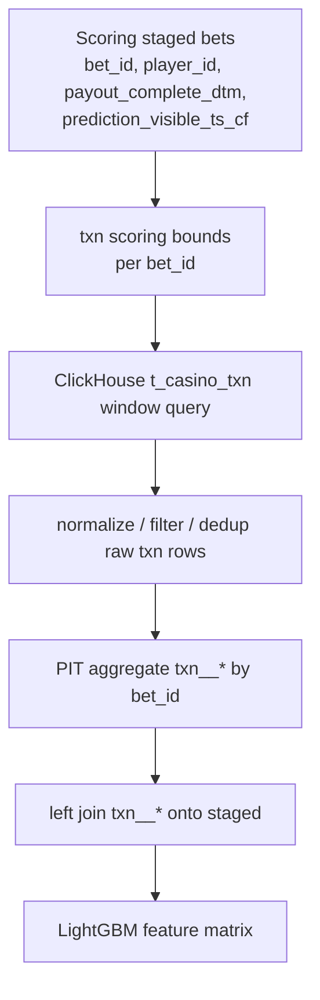

# trainer_hightier - `t_casino_txn` Short-PIT Runtime Implementation Plan

本文件為 **Implementation Plan 層**，定義如何把目前 production `txn_lite_builder` 從 L0 cleaned parquet runtime dependency 改為 ClickHouse live short-PIT supplier。範圍只限 `t_casino_txn` 的 7 個 `txn__*` feature；整體 feature supplier contract / deploy contract 另案處理。

**最後更新：** 2026-06-15

---

## 0) Scope

### In scope

- Production scorer `txn_lite_builder` 改由 ClickHouse `t_casino_txn` 查詢與 batch-scoped PIT 聚合供應。
- 保持模型 feature list、registry feature ids、`runtime_supplier=txn_lite_builder` 不變。
- 保持 training / offline / parity 使用 L0 cleaned `t_casino_txn` parquet 作為歷史重放來源。
- 新增或更新 parity / deploy gates，確認 ClickHouse runtime supplier 可服務 active model 的 7 個 `txn__*` features。
- 移除 production deploy 對手動準備 `cleaned__gmwds_t_casino_txn` partition 的依賴。

### Out of scope

- 不重做整體 feature supplier contract / `deploy_contract.json`。
- 不把 `txn__*` 轉成 Feast mid / long snapshot。
- 不變更 `t_casino_txn` L0 cleaning / quarantine exit SSOT。
- 不新增模型 feature、不重新訓練、不調整 feature selection。
- 不改 mid / slow Feast refresh supervisor。

---

## 1) Decisions

| ID | Decision | Rationale |
|----|----------|-----------|
| TXN-PIT-001 | Production `txn_lite_builder` 一律走 ClickHouse `t_casino_txn` live PIT | 與 `t_bet` short-PIT 對齊；不依賴手動部署 cleaned parquet |
| TXN-PIT-002 | 不保留 production cleaned-parquet fallback | fallback 會掩蓋 source supply 問題；production source 不完整時應 fail-fast |
| TXN-PIT-003 | Training/offline 繼續使用 cleaned parquet | 保留 reproducibility 與 L0 DQ / correction traceability |
| TXN-PIT-004 | PIT 條件同時使用 event time 與 availability time | 避免事件發生前或資料可見前洩漏 |
| TXN-PIT-005 | 缺 raw 欄位 / CH source schema drift 時 hard fail | active model 依賴 7 個 txn feature，缺 source 等同 feature supply failure |
| TXN-PIT-006 | 初版使用 batch-scoped CH query + local aggregation | 與現有 hot pool pattern 一致，避免新增 mirror / snapshot infrastructure |

---

## 2) Current State

Active model `20260613-162313-3eb8de4` 使用 7 個 `txn__*` features：

- `txn__has_cash_out__w15m`
- `txn__cash_out_cnt__w1h`
- `txn__cash_out_sum__w1h`
- `txn__net_cash_out_flag__w1h`
- `txn__net_cash_flow__w1h`
- `txn__buyin_cash_sum__w1h`
- `txn__buyin_prize_redemption_flag__w1h`

目前 production path：

```text
score_once()
  -> _build_staged_features()
  -> attach_txn_lite_features()
  -> compute_txn_lite_features_for_bets(cleaned_casino_txn_root=...)
  -> requires cleaned__gmwds_t_casino_txn parquet root on deploy host
```

問題：

- deploy host 不應手動準備 cleaned partition。
- default path 可能落到 installed wheel 的 package directory。
- Step 6 / deploy e2e 先前未完整驗 txn external root，production startup 才 fail。

Target production path：

```text
score_once()
  -> _build_staged_features()
  -> attach_txn_lite_features()
  -> fetch t_casino_txn window from ClickHouse for staged player_ids
  -> compute txn_lite PIT features for staged bet_ids
  -> merge back on bet_id
```

---

## 3) Runtime Semantics

### 3.1 Source table

Production supplier reads from:

```text
{cfg.source_db}.t_casino_txn
```

The implementation should follow the existing `t_bet` ClickHouse access style:

- use `default_hightier_serving_config()` for source DB / CH connection settings;
- use existing ClickHouse adapter / query helper patterns;
- use batch-scoped `player_id` filtering;
- bound query time range by the active scoring batch.

### 3.2 Required raw fields

The production query must provide enough columns to reconstruct the cleaned L1 semantics:

| Logical field | Expected meaning |
|---------------|------------------|
| `player_id` | join key to staged scoring bets |
| transaction id | optional for dedup if raw contains multiple versions |
| `txn_event_ts` equivalent | business event time, currently aligned to cleaned `txn_event_ts` / raw `start_dtm` |
| `txn_available_ts` equivalent | conservative observed-at / availability timestamp |
| `type` | L1 filter for BUYIN / CASHOUT |
| `sub_type` | prize redemption flag logic |
| `txn_value` | cashflow amount |
| deletion / status fields | exclude deleted / invalid logical rows when available |

If the raw ClickHouse table does not expose a direct `txn_available_ts`, implementation must explicitly map the closest raw ingestion / update timestamp and document that mapping in code and parity report. It must not silently use event time as availability time.

### 3.3 PIT predicate

For each staged bet row:

```text
txn.player_id = bet.player_id
txn_event_ts <= bet.payout_complete_dtm
txn_available_ts <= bet.prediction_visible_ts_cf
txn_event_ts >= bet.payout_complete_dtm - max_txn_window
```

`max_txn_window` is 1 hour for the active feature set. A small source-query buffer may be used to account for timestamp precision / timezone casting, but the final aggregation predicate must remain the exact feature window.

### 3.4 Feature definitions

The production runtime must match `materialize_txn_lite.py` output semantics:

| Feature | Window | Definition |
|---------|--------|------------|
| `txn__has_cash_out__w15m` | 15m | 1 if any eligible CASHOUT exists, else 0 |
| `txn__cash_out_cnt__w1h` | 1h | count eligible CASHOUT rows |
| `txn__cash_out_sum__w1h` | 1h | sum CASHOUT values |
| `txn__net_cash_out_flag__w1h` | 1h | 1 if cash_out_sum > buyin_cash_sum, else 0 |
| `txn__net_cash_flow__w1h` | 1h | cash_out_sum - buyin_cash_sum |
| `txn__buyin_cash_sum__w1h` | 1h | sum eligible BUYIN cash values |
| `txn__buyin_prize_redemption_flag__w1h` | 1h | 1 if any eligible BUYIN prize redemption exists |

Null behavior should match training: no matching txn rows should produce zeros for count / sum / flags unless existing training materializer defines nulls for a column.

---

## 4) Module Boundary



### Expected code boundaries

| Area | Direction |
|------|-----------|
| `feature_builder.attach_txn_lite_features` | becomes production adapter entrypoint; no default cleaned root for production |
| `feature_experiment.materialize_txn_lite` | remains training/offline cleaned parquet implementation |
| New helper near serving layer | CH fetch + PIT aggregation, preferably small and testable |
| `feature_supply` / deploy preflight | no longer requires `cleaned_casino_txn_root` for production `txn_lite_builder` |
| deploy e2e | verifies CH txn supplier readiness / parity instead of local cleaned root presence |

---

## 5) Validation Strategy

### 5.1 Unit / focused tests

Add focused tests for the CH runtime aggregation using synthetic DataFrames or a query adapter seam:

- window boundary: 15m / 1h include and exclude behavior;
- availability boundary: event before payout but available after prediction must be excluded;
- BUYIN / CASHOUT filters;
- prize redemption flag;
- zero-fill behavior when no txn rows match;
- duplicate / deleted raw logical rows if raw fields support dedup.

### 5.2 Train/offline vs production parity

Add a parity gate:

```text
sample staged bets
  -> compute txn__* from cleaned parquet implementation
  -> compute txn__* from ClickHouse production query
  -> compare 7 txn__* columns
```

Initial gate proposal:

- sample size: 200-500 bets;
- hard fail if any required CH field is missing;
- hard fail if any required output column is missing;
- hard fail if diff fraction for stable count / sum / flag columns exceeds 0.5%;
- warning band up to 2% only when differences are explainable by known late-arrival / availability boundary cases and examples are reported.

### 5.3 Deploy preflight

Production startup should validate:

- ClickHouse can query `t_casino_txn`;
- required columns / expressions are available;
- at least one recent row can be scanned for schema smoke;
- active model routes `txn_lite_builder` to CH runtime supplier;
- no deploy requirement for `cleaned_casino_txn_root` remains in production mode.

### 5.4 Deploy E2E

Step 6 deploy e2e should include the txn supplier in the same scorer smoke used for active model scorability:

- startup Feast refresh still validates mid / slow;
- scorer replay computes `txn__*` via CH;
- post-join smoke includes txn output column presence and not-all-null / expected zero-fill sanity;
- report includes `txn_lite` supplier diagnostics.

---

## 6) Rollout

### Phase 1: Production CH runtime behind existing supplier

- Keep registry `runtime_supplier=txn_lite_builder`.
- Change production implementation of `attach_txn_lite_features` to CH short-PIT.
- Keep cleaned parquet implementation available only for training/offline/parity/debug.

### Phase 2: Parity and e2e hardening

- Add parity report artifact for txn CH vs cleaned replay.
- Add deploy e2e diagnostics for txn supplier.
- Remove production preflight requirement for cleaned txn root.

### Phase 3: Cleanup

- Delete or demote temporary `cleaned_casino_txn_root` production override once CH runtime is stable.
- Update deployment README / runbook to state that `txn__*` is ClickHouse-supplied.
- Ensure future supplier contract work treats `txn_lite_builder` as a live short-term PIT supplier.

---

## 7) Risks and Mitigations

| Risk | Mitigation |
|------|------------|
| Raw CH `t_casino_txn` schema differs from cleaned parquet assumptions | schema smoke + explicit field mapping + parity examples |
| Availability timestamp not directly available | require explicit mapping; hard fail if no conservative availability source exists |
| Query too slow for large scoring batches | player fanout cap, bounded time window, chunking similar to `t_bet` pool fetch |
| Timezone mismatch | normalize timestamps using existing HK / UTC semantics and include boundary tests |
| Dedup / delete semantics differ from L0 cleaned | implement raw logical dedup only if required fields exist; otherwise document difference and let parity gate quantify |
| Production model depends on txn features but CH txn unavailable | fail-fast before scorer starts |

---

## 8) Acceptance Criteria

- Production deploy no longer requires manually copying `cleaned__gmwds_t_casino_txn` into the bundle or wheel.
- Active model with 7 `txn__*` features can pass deploy preflight using ClickHouse `t_casino_txn`.
- `score_once()` can compute all `txn__*` columns without cleaned parquet.
- Txn parity report compares cleaned replay vs CH runtime and passes agreed thresholds.
- Deploy e2e report includes txn supplier diagnostics and remains `verdict=pass`.
- Training / offline flows using cleaned parquet remain unchanged.

