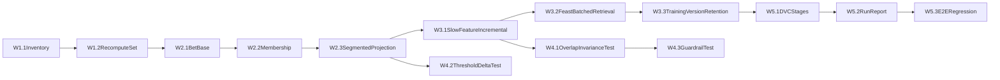

# trainer_hightier - Data Pipeline Working Plan

本文件是 **Working / execution plan 層**，僅描述具體執行任務與順序，並回鏈 Implementation plan：

- [C:/Users/longp/Patron_Walkaway/trainer_hightier/doc/Data pipeline - IMPLEMENTATION_PLAN.md](C:/Users/longp/Patron_Walkaway/trainer_hightier/doc/Data pipeline - IMPLEMENTATION_PLAN.md)

## 執行原則

- 僅涵蓋資料管線、特徵物化、訓練資料產製與治理。
- 不包含模型訓練策略、調參、FE 試驗方法學。
- 每個階段必須完成 DoD 才能進下一階段。

## 時程分組（建議 5 個 iteration）

### Iteration 1: Pipeline 骨架與分區治理底座

- 任務 W1.1：建立分區 inventory 與 snapshot manifest 產出。
  - 主要落點：[C:/Users/longp/Patron_Walkaway/trainer_hightier/01_data_ingest.py](C:/Users/longp/Patron_Walkaway/trainer_hightier/01_data_ingest.py)
  - Owner：資料工程/平台
  - 依賴：無
  - DoD：可輸出每月分區清單與整體 fingerprint，並能標記來源 snapshot id。
- 任務 W1.2：建立重算集合決策器（新增/變更 + 1 個月回補 + correction months）。
  - 主要落點：[C:/Users/longp/Patron_Walkaway/trainer_hightier/trainer.py](C:/Users/longp/Patron_Walkaway/trainer_hightier/trainer.py)
  - Owner：資料工程/平台
  - 依賴：W1.1
  - DoD：輸入 inventory 與 correction months，可產出 deterministic 重算月份清單。
- 任務 W1.3：配置與驗證 runtime profile（workstation 預設）與 spill 行為。
  - 主要落點：[C:/Users/longp/Patron_Walkaway/trainer_hightier/config.py](C:/Users/longp/Patron_Walkaway/trainer_hightier/config.py)
  - Owner：資料工程/平台
  - 依賴：無
  - DoD：在大型分區資料下可穩定跑完，不出現系統性 OOM。

### Iteration 2: Step 2b 解耦（全玩家 base + 玩家分群投影）

- 任務 W2.1：將 bet preprocess 拆成 `cleaned_bet_base_all_players`（不含 ADT 過濾）。
  - 主要落點：[C:/Users/longp/Patron_Walkaway/trainer_hightier/utils/bet_l0_preprocess.py](C:/Users/longp/Patron_Walkaway/trainer_hightier/utils/bet_l0_preprocess.py)
  - Owner：特徵工程
  - 依賴：W1.2
  - DoD：可在不依賴 ADT threshold 的情況下輸出全玩家 cleaned bet，並具分區增量命中。
- 任務 W2.2：獨立 player membership 產物（依 ADT quantile/手選清單）。
  - 主要落點：[C:/Users/longp/Patron_Walkaway/trainer_hightier/utils/patron_session_metrics.py](C:/Users/longp/Patron_Walkaway/trainer_hightier/utils/patron_session_metrics.py)
  - Owner：特徵工程
  - 依賴：W2.1
  - DoD：membership 檔可版本化，且可回溯 quantile 與來源。
- 任務 W2.3：建立 segmented projection（base + membership 半連接）。
  - 主要落點：[C:/Users/longp/Patron_Walkaway/trainer_hightier/trainer.py](C:/Users/longp/Patron_Walkaway/trainer_hightier/trainer.py)
  - Owner：特徵工程
  - 依賴：W2.2
  - DoD：擴大 threshold 時可只新增 `Q_new - Q_old` 對應事件，不重算舊玩家結果。

### Iteration 3: slow features 與 Feast retrieval 增量化

- 任務 W3.1：slow-varying features 增量物化（按月份）。
  - 主要落點：[C:/Users/longp/Patron_Walkaway/trainer_hightier/utils/slow_patron_180d_monthly.py](C:/Users/longp/Patron_Walkaway/trainer_hightier/utils/slow_patron_180d_monthly.py)
  - Owner：特徵工程
  - 依賴：W2.3
  - DoD：非受影響月份可命中快取，整體耗時較全量重跑明顯下降。
- 任務 W3.2：Feast historical retrieval 按月批次。
  - 主要落點：[C:/Users/longp/Patron_Walkaway/trainer_hightier/03_build_training_data.py](C:/Users/longp/Patron_Walkaway/trainer_hightier/03_build_training_data.py)
  - Owner：ML 工程
  - 依賴：W3.1
  - DoD：可完成大規模資料抽取且不依賴單次全量 entity_df 載入。
- 任務 W3.3：training set 版本命名與最近 10 版保留。
  - 主要落點：[C:/Users/longp/Patron_Walkaway/trainer_hightier/03_build_training_data.py](C:/Users/longp/Patron_Walkaway/trainer_hightier/03_build_training_data.py)
  - Owner：ML 工程
  - 依賴：W3.2
  - DoD：每次產物具版本 id 與 retention 行為，保留策略生效可驗證。

### Iteration 4: 測試防線（Metamorphic + Guardrail）

- 任務 W4.1：Metamorphic test A（all_players vs subset_players 重疊不變性）。
  - 主要落點：[C:/Users/longp/Patron_Walkaway/trainer_hightier/tests/test_bet_preprocess.py](C:/Users/longp/Patron_Walkaway/trainer_hightier/tests/test_bet_preprocess.py)
  - Owner：特徵工程 + QA
  - 依賴：W2.3, W3.1
  - DoD：重疊 bet_id 的特徵值在誤差容忍範圍內一致。
- 任務 W4.2：Metamorphic test B（threshold 擴大 delta 只新增新玩家）。
  - 主要落點：[C:/Users/longp/Patron_Walkaway/trainer_hightier/tests/test_bet_preprocess.py](C:/Users/longp/Patron_Walkaway/trainer_hightier/tests/test_bet_preprocess.py)
  - Owner：特徵工程 + QA
  - 依賴：W2.3
  - DoD：`Q_new` 結果 = `Q_old` 穩定結果 + `Q_new - Q_old` 新增事件。
- 任務 W4.3：Guardrail test（禁止未審核 cohort-global normalization 模式）。
  - 主要落點：[C:/Users/longp/Patron_Walkaway/tests/unit/test_dq_guardrails.py](C:/Users/longp/Patron_Walkaway/tests/unit/test_dq_guardrails.py)
  - Owner：QA
  - 依賴：W4.1
  - DoD：偵測到未白名單的 percentile/rank/zscore 全域模式即 fail。

### Iteration 5: DVC stage 化與每次 run 報表

- 任務 W5.1：DVC stage 落地（ingest / clean_session / clean_bet_base / membership / segmented / features / training_set / publish）。
  - 主要落點：[C:/Users/longp/Patron_Walkaway/trainer_hightier](C:/Users/longp/Patron_Walkaway/trainer_hightier)
  - Owner：資料工程/平台
  - 依賴：W3.3
  - DoD：各 stage 可獨立重跑且依賴正確。
- 任務 W5.2：每次 run 報表標準化輸出。
  - 主要落點：[C:/Users/longp/Patron_Walkaway/trainer_hightier/trainer.py](C:/Users/longp/Patron_Walkaway/trainer_hightier/trainer.py)
  - Owner：ML 工程
  - 依賴：W5.1
  - DoD：每次 run 產生固定欄位報表（耗時、命中率、重算分區、輸出列數、警告摘要）。
- 任務 W5.3：端到端回歸驗收（舊流程對照）。
  - 主要落點：[C:/Users/longp/Patron_Walkaway/trainer_hightier](C:/Users/longp/Patron_Walkaway/trainer_hightier)
  - Owner：全體（平台/特徵/ML）
  - 依賴：W5.2
  - DoD：與基準流程結果差異在可接受範圍，並達成效能改善目標。

## 依賴圖（高層）

## 優先序與執行策略

- P0（必做先行）：W1.1, W1.2, W2.1, W2.2, W2.3。
- P1（核心效能）：W3.1, W3.2, W3.3。
- P1（風險防線）：W4.1, W4.2, W4.3。
- P2（治理固化）：W5.1, W5.2, W5.3。

## 阻塞條件與升級規則

- 若 W2.3 未達「threshold 擴大不重算舊玩家」DoD，禁止進入 W3.*。
- 若 W4.* 任一 fail，禁止推進 W5.3 驗收。
- 若 run report 欄位不完整，禁止標記為正式 training set publish。

## 完成定義（Working plan 層）

- 交付完整分區增量資料管線，且能支援 ADT threshold 擴大時僅補新玩家。
- 建立 metamorphic + guardrail 測試防線，保障特徵不依賴未審核 cohort-global normalization。
- 建立每次 run 報表與可重現治理流程，並以對照驗證通過驗收。

