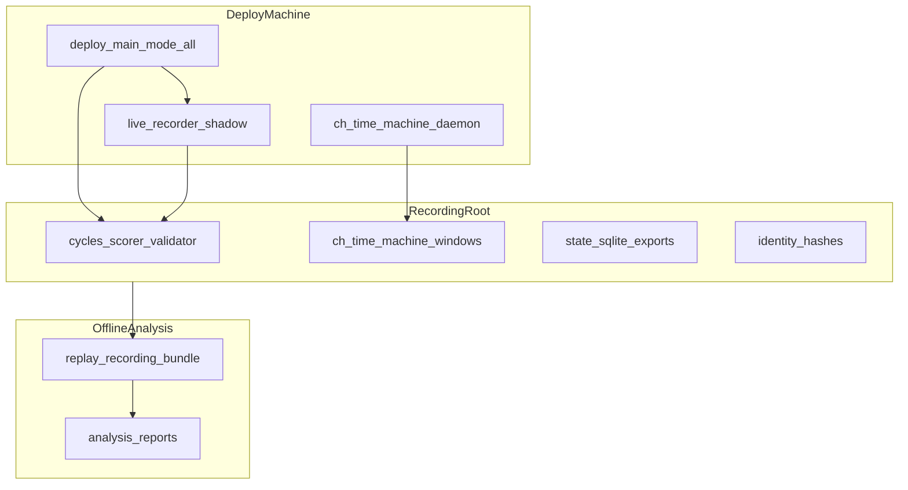
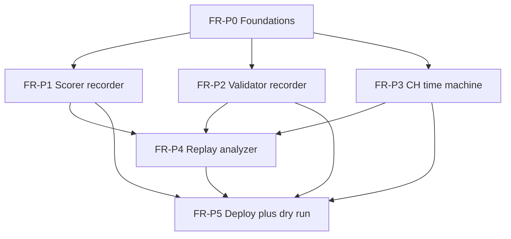

# Production Flight Recorder - WORKING PLAN

本文件是 **Working / execution plan 層**，承接：

- Implementation plan：[Production Flight Recorder - IMPLEMENTATION_PLAN.md](../../implementation/active/Production%20Flight%20Recorder%20-%20IMPLEMENTATION_PLAN.md)
- Serving contract（背景）：[Scorer Runtime Contract - SSOT.md](../../ssot/Scorer%20Runtime%20Contract%20-%20SSOT.md)
- Schema 參考：[GDP_GMWDS_Raw_Schema_Dictionary.md](../../schema/GDP_GMWDS_Raw_Schema_Dictionary.md)

本文件只拆解可執行工作、依賴、Definition of Done、建議順序與驗收證據；不重新定義產品範圍或架構。若與 implementation plan 衝突，先更新 implementation plan 再執行。

### 任務 ID 命名規則

| 前綴 | 含義 |
|------|------|
| **FR-P0** | Foundations：config、manifest、identity、redaction、packaging skeleton |
| **FR-P1** | Live scorer recorder：shadow hooks、stage artifacts、feature provenance |
| **FR-P2** | Validator recorder：cycle capture、ground-truth queries、state transitions |
| **FR-P3** | ClickHouse time-machine：`FINAL` vs non-`FINAL`、late arrival、system tables |
| **FR-P4** | Replay analyzer：score/validator replay、casebooks、root-cause reports |
| **FR-P5** | Deploy integration、runbook、collect_debug_bundle 銜接、production dry-run |

## 已定前置決策

- **Model-agnostic**：從 deploy bundle 讀 `model_version`、threshold、feature columns、registry snapshot、mapping、allowlist；不寫死任一模型。
- **Production-exact first**：shadow recorder 必須記錄 scorer / validator 當下實際走過的路徑與 ClickHouse 回傳列。
- **Diagnostic superset**：額外記錄 non-`FINAL`、system tables、`t_session` / `t_game` context，用於解釋 hazard，不取代 production path。
- **Row-level evidence**：每個 scored row / alert 可追溯到 source rows → stages → model matrix → score → validation。
- **Validator 真相**：以 bundle 內 `validator.py` 的 bet-based verdict 為準；session fetch 僅作診斷證據。
- **Scorer / validator 皆用 `FINAL`**：與現行 [`scorer.py`](../serving/scorer.py)、[`validator.py`](../serving/validator.py) 一致。
- **Feast**：deploy 啟動時可跑 startup refresh；另有 post-startup Feast refresh supervisor（[`deploy/main.py`](../deploy/main.py)）。
- **不打包 credentials**：只存 connection alias、query manifest、permission probe 結果、hash/fingerprint。
- **可本機重播與分析**：bundle 含 package freeze、identity hashes、replay CLI；分析可不依賴 production 連線。
- **Production fail-fast**：只要 `--record-production-flight` 啟用，recorder 寫入、manifest、redaction 或 query contract 失敗都要讓 deploy 停止；不允許 production 在缺證據鏈狀態下繼續跑。

### CDC / 業務鍵假設（recorder 必須遵守）

| 表 | 參考鍵 | 版本欄位（必錄） | 備註 |
|----|--------|------------------|------|
| `t_bet` | `bet_id` | `__ts_ms`, `__op`, `__deleted`, `__etl_insert_Dtm` | schema 未標 duplicate warning；仍當 versioned business key |
| `t_session` | `session_id` | `lud_dtm`, `crtd_dtm`, `__ts_ms`, `__op`, `__deleted`, `__etl_insert_Dtm` | **有重複**；dedup 政策需與 validator 一致（`MAX(lud_dtm)` 等） |
| `t_game` | `game_id` | `__ts_ms`, `__op`, `__deleted`, `__etl_insert_Dtm` | **有重複**；latest-row 選取需可重現 |

## 執行護欄

- 不複製 scorer / validator 業務邏輯；只在既有函數邊界 **hook + 寫 artifact**，避免 drift。
- 不把 recorder 行為塞進環境變數；使用 bundle 內 `recording_config.yaml`（或 Python dataclass + YAML loader）。
- 每個寫入檔案登記 `MANIFEST.json`：`path`, `sha256`, `size_bytes`, `row_count`（若適用）。
- Production recording 預設 **fail-fast**：`--record-production-flight` 啟用時，required artifact 寫入失敗、schema/manifest validation 失敗、redaction 失敗、query manifest contract 失敗，都必須 raise fatal error 並停止 deploy。
- Fail-open 只允許在明確 debug/local config 下使用；必須在 logs 與 manifest 標 `recorder_partial=true`、`fail_fast=false`、`evidence_grade=debug_only`，不得作為 production incident evidence。
- ClickHouse time-machine 與 live recorder **可並行 process**；透過 shared `recording_root` + window registry 協調。
- 第一版允許大體積；不為 size 做抽樣省略（incident mode）。

## 本輪聚焦 slice

**目標**：新模型 deploy 前後，能在 production deploy machine 上產出 **可離線重播、可定責** 的 recording bundle，回答：

1. production score 能否從 captured artifacts 100% 重現？
2. validator MATCH/MISS 能否用 captured `t_bet FINAL` 重現？
3. ClickHouse 是否在 T+1h / T+24h 後改變 rows，導致事後看起來像「模型錯」？
4. 哪一層 feature supplier / freshness 與 false positive 最相關？



## 建議執行順序



1. **FR-P0**（可與 FR-P1 stub 並行）：config、manifest writer、identity capture、redaction。
2. **FR-P1 + FR-P2**：scorer / validator shadow hooks（可先 mock ClickHouse 整合測試）。
3. **FR-P3**：time-machine scheduler + diff engine（可先用 fixture Parquet）。
4. **FR-P4**：replay analyzer + casebooks。
5. **FR-P5**：`deploy/main.py` flag、runbook、與 `collect_debug_bundle.py` 銜接、production dry-run。

---

## FR-P0: Foundations

目的：所有後續元件共用同一 recording root 契約與安全邊界。

**建議新模組**（擇一，implementation plan 待決）：

- `trainer_hightier/serving/production_flight_recorder/` 子套件，或
- `trainer_hightier/serving/flight_recorder_core.py` + 各 CLI 模組

| ID | Task | Files | Dependencies | Definition of Done |
|----|------|-------|--------------|-------------------|
| FR-P0-1 | `FlightRecorderConfig` + YAML loader | `serving/flight_recorder/config.py`, bundle 內 `local_state/flight_recording_config.yaml` 範例 | 無 | 欄位覆蓋 implementation plan §Configuration；無 env 控制行為 |
| FR-P0-2 | `RecordingManifest` 寫入/遞增 cycle id | `serving/flight_recorder/manifest.py` | FR-P0-1 | 每檔案 sha256；支援 partial bundle |
| FR-P0-3 | Identity snapshot（model、registry、mapping、allowlist hashes） | `serving/flight_recorder/identity.py` | FR-P0-2 | 對齊 implementation plan `identity/` 佈局 |
| FR-P0-4 | SQL / env redaction | `serving/flight_recorder/redact.py` | FR-P0-2 | 單元測試：password、host、token 不出現在輸出 |
| FR-P0-5 | SQLite export 輔助（reuse collect_debug_bundle 邏輯） | `serving/flight_recorder/state_export.py` | FR-P0-2 | 匯出 `state.db` / `prediction_log.db` / `feature_state.db` 至 recording root |
| FR-P0-6 | `pack_flight_recording` CLI 骨架 | `serving/pack_flight_recording.py` | FR-P0-2 | 產 zip 或 tar；保留 `MANIFEST.json` |
| FR-P0-7 | Query manifest / window registry schema | `serving/flight_recorder/ch_capture.py`, `serving/flight_recorder/window_registry.py` | FR-P0-2, FR-P0-4 | Schema 強制 `requeryable`, `business_key`, executable `sql_final`, `sql_non_final` 或 skip reason；禁止 pseudo SQL |
| FR-P0-8 | Fail-fast / fail-open failure policy | `serving/flight_recorder/config.py`, `context.py`, hooks 共用 helper | FR-P0-1, FR-P0-2 | `fail_fast=true` 為 production default；required recorder failure 會 raise；debug fail-open manifest 標 `evidence_grade=debug_only` |

**Iteration FR-A exit**：`pytest tests/test_flight_recorder_manifest.py tests/test_flight_recorder_redact.py` 綠；空 recording root 可初始化並寫 identity。

---

## FR-P1: Live Scorer Recorder

目的：每個 scorer cycle 留下完整 stage 與 query 證據。

**Hook 點**（對齊現有程式，不複製邏輯）：

| Hook | 現有位置 |
|------|----------|
| Incremental `t_bet` fetch | [`scorer.py`](../serving/scorer.py) `fetch_bets_incremental` |
| Short-term pool fetch | [`scorer.py`](../serving/scorer.py) `fetch_bet_pool_window` |
| Staged features | [`scorer.py`](../serving/scorer.py) `_build_staged_features` |
| Feast mid/slow | [`scorer.py`](../serving/scorer.py) `_attach_feast_mid_slow` |
| Model matrix + predict | [`feature_builder.py`](../serving/feature_builder.py), scorer predict path |
| Prediction log write | [`prediction_log.py`](../serving/prediction_log.py) |

| ID | Task | Files | Dependencies | Definition of Done |
|----|------|-------|--------------|-------------------|
| FR-P1-1 | `RecorderContext` + cycle 目錄配置 | `serving/flight_recorder/context.py` | FR-P0-1 | 每 cycle 一個 `cycles/scorer/cycle_NNNNNN/` |
| FR-P1-2 | 包裝 ClickHouse query：存 replayable SQL+params+external inputs+result Parquet | `serving/flight_recorder/ch_capture.py` | FR-P0-4, FR-P0-7, FR-P1-1 | incremental + pool manifest 都符合 query replay contract |
| FR-P1-2a | Allowlist incremental replay payload | `ch_capture.py`, scorer hook allowlist plumbing | FR-P1-2 | `allowlist_external_input` 不得只存 `allowlist_size`；需存實際 player ids 或 mark `requeryable=false` |
| FR-P1-2b | Pool window executable query manifest | `ch_capture.py` | FR-P1-2 | 不得出現 `SELECT ...` placeholder；需存完整 SQL 與實際 player ids |
| FR-P1-3 | Stage snapshot hooks（00–09） | `serving/flight_recorder/scorer_hooks.py`, 修改 `scorer.py` | FR-P1-1 | 開關 `capture_scorer_stages`；關閉時零開銷路徑可測 |
| FR-P1-4 | `feature_missing_provenance.parquet` | `serving/flight_recorder/provenance.py` | FR-P1-3 | 每 model feature：source layer、null reason、upstream ids |
| FR-P1-5 | Cycle 結束寫 `row_counts.json` + score distribution | `scorer_hooks.py` | FR-P1-3 | 與 prediction_log 行數可對帳 |
| FR-P1-6 | Scorer hook fail-fast propagation | `scorer_hooks.py`, `context.py` | FR-P0-8, FR-P1-1–P1-5 | mock artifact write failure 時 scorer cycle 不繼續；error 含 step + path + exception |
| FR-P1-7 | Shadow CLI：`production_flight_recorder --mode shadow` | `serving/production_flight_recorder.py` | FR-P1-1–P1-6 | 可 attach 到 deploy 行程（見 FR-P5） |

**Iteration FR-B exit**：fixture 跑 1 個 scorer cycle → 目錄樹含 `clickhouse/`、`stages/stage_08_model_feature_matrix.parquet`、`audits/`；manifest 有 model_version hash；`windows.json` 中 scorer windows 若 `requeryable=true`，必須可由 time-machine fixture 重放；注入 scorer recorder 寫入失敗時 production fail-fast 測試必須停止 cycle。

---

## FR-P2: Validator Recorder

目的：記錄 validator 每輪讀取的 alerts、ClickHouse ground-truth、決策轉移。

**Hook 點**：

| Hook | 現有位置 |
|------|----------|
| Alert load | [`validator.py`](../serving/validator.py) `validate_once` |
| `fetch_bets_by_canonical_id` | [`validator.py`](../serving/validator.py) |
| `fetch_bet_payout_times_by_bet_ids` | [`validator.py`](../serving/validator.py) |
| Final write | `validation_results` / `prediction_validation_results` |

| ID | Task | Files | Dependencies | Definition of Done |
|----|------|-------|--------------|-------------------|
| FR-P2-1 | Validator cycle manifest | `serving/flight_recorder/validator_hooks.py` | FR-P0-1 | `cycles/validator/cycle_NNNNNN/` |
| FR-P2-2 | 存 `fetch_bets_by_canonical_id` query + result | `validator_hooks.py` | FR-P0-4, FR-P0-7 | 與 production SQL 一致（`FINAL`）；manifest 有 `business_key`，若用 `bet_id` diff 必須 select `bet_id` |
| FR-P2-3 | 存 no-bet `bet_id` lookup query + result | `validator_hooks.py` | FR-P0-4, FR-P0-7 | 對照 `VALIDATOR_NO_BET_BET_ID_LOOKUP` 路徑；存實際 bet ids 或 mark non-requeryable |
| FR-P2-4 | Per-alert decision trace（含 PENDING） | `validator_hooks.py` | FR-P2-1 | 欄位含 `result`, `reason`, `gap_start`, `gap_minutes`, `validated_at` |
| FR-P2-5 | Validator hook fail-fast propagation | `validator_hooks.py`, `context.py` | FR-P0-8, FR-P2-1–P2-4 | ground-truth / decision artifact 寫入失敗時 validator 不繼續產生未記錄 verdict |
| FR-P2-6 | Validator shadow 接入 `production_flight_recorder` | `production_flight_recorder.py` | FR-P2-1–P2-5 | 與 scorer 共用 recording root |

**Iteration FR-C exit**：fixture alert 跑一輪 validator → ground-truth Parquet 可重播 `validate_alert_row` 輸入；validator windows 的 business key 與輸出欄位一致；注入 validator recorder 寫入失敗時 production fail-fast 測試必須停止 validator cycle。

---

## FR-P3: ClickHouse Time Machine

目的：證明同一 window 在 T0 / T+1h / T+24h / T+72h 是否變化；區分 `FINAL` vs non-`FINAL`。

| ID | Task | Files | Dependencies | Definition of Done |
|----|------|-------|--------------|-------------------|
| FR-P3-1 | Window registry（由 scorer/validator cycle 註冊） | `serving/flight_recorder/window_registry.py` | FR-P0-7, FR-P1, FR-P2 | 每 window 有 stable `window_id`、`requeryable`、`business_key`、`skip_reason`（如不可重查） |
| FR-P3-2 | Query rebuild contract | `serving/flight_recorder/ch_requery.py` | FR-P3-1 | `windows.json -> rebuild_query_record` 不靠 fetch-name guess；讀取 explicit replay contract |
| FR-P3-3 | Scheduled requery runner | `serving/ch_time_machine.py` | FR-P3-1, FR-P3-2, FR-P0-1 | 預設 schedule：0m, 15m, 1h, 6h, 24h, 72h；0 capture 時輸出 readiness reason |
| FR-P3-4 | `FINAL` + non-`FINAL` 雙份 capture | `ch_time_machine.py` | FR-P3-3 | 只對 `requeryable=true` window 執行；每 capture 子目錄各一份 Parquet |
| FR-P3-5 | Non-requeryable skipped reports | `ch_time_machine.py` | FR-P3-3 | non-requeryable window 寫 skipped report，不記為 failure |
| FR-P3-6 | Diff engine：per-window business key add/remove/change + column hash | `serving/flight_recorder/diff.py` | FR-P3-4 | 輸出 `diffs/t0_vs_t_plus_*.json`；不得 hard-code `bet_id` |
| FR-P3-7 | Business-key validation report | `diff.py`, `ch_time_machine.py` | FR-P3-6 | key 欄位缺失時寫 structured `business_key_missing`，不拋未處理 exception |
| FR-P3-8 | `t_session` / `t_game` context extracts | `ch_time_machine.py` | FR-P3-3 | session / game window 需先定義 business key；game 用 referenced `game_id` |
| FR-P3-9 | System table permission probe | `ch_time_machine.py` | FR-P0-1 | 寫 `permissions/clickhouse_system_table_permissions.json` |
| FR-P3-10 | Optional：attach `system.query_log` metadata | `ch_time_machine.py` | FR-P3-9 | 有權限則寫；無權限則記錄 failure |

**Iteration FR-D exit**：fixture registry 覆蓋 supported fetch types 與 non-requeryable windows → `windows.json -> rebuild_query_record -> execute_query -> diff` 綠；模擬 late row 的 diff 報告顯示 added keys + version 欄位變化；不可重查 window 有 skipped report 且沒有 warning。

---

## FR-P4: Replay Analyzer

目的：離線重算 score / validator，產出定責報告。

| ID | Task | Files | Dependencies | Definition of Done |
|----|------|-------|--------------|-------------------|
| FR-P4-1 | Load recording bundle + validate manifest | `serving/replay_recording_bundle.py` | FR-P0-2 | 缺檔 / hash 不符 → 明確錯誤 |
| FR-P4-2 | Score replay from `stage_08` + model.pkl | `serving/flight_recorder/replay_score.py` | FR-P1 | `score_replay_diff_report.json`：match rate + attribution |
| FR-P4-3 | Validator replay from captured queries | `serving/flight_recorder/replay_validator.py` | FR-P2 | `validator_replay_diff_report.json` |
| FR-P4-4 | Aggregate reports | `replay_recording_bundle.py` | FR-P3-4, FR-P4-2 | `clickhouse_late_arrival_report.json`, `final_vs_non_final_report.json` |
| FR-P4-5 | Casebooks | `serving/flight_recorder/casebook.py` | FR-P4-2, FR-P2-4 | `false_positive_casebook.parquet`, `high_score_casebook.parquet` |
| FR-P4-6 | `feature_root_cause_rank.json` | `casebook.py` | FR-P1-4, FR-P4-5 | 按 null reason / freshness / supplier 排序 |

**Iteration FR-E exit**：對一個小型 recording fixture，score replay 100% match；validator replay 與 production final 一致；late-arrival diff 可選連結到 verdict change。

---

## FR-P5: Deploy Integration & Production Runbook

目的：新模型上線時的操作路徑清晰；與現有 debug bundle 互補。

| ID | Task | Files | Dependencies | Definition of Done |
|----|------|-------|--------------|-------------------|
| FR-P5-1 | `deploy/main.py` 增加 `--record-production-flight` | [`deploy/main.py`](../deploy/main.py) | FR-P1-7, FR-P2-6 | 與 `mode=all` 相容；預設關閉 |
| FR-P5-2 | Deploy fail-fast default wiring | [`deploy/main.py`](../deploy/main.py), `serving/flight_recorder/attach.py` | FR-P0-8, FR-P5-1 | `--record-production-flight` 預設 `fail_fast=true`；recording root 不可寫時 deploy 立即退出 |
| FR-P5-3 | Runbook：新模型 deploy + recording | `doc/runbooks/active/Production Flight Recorder - RUNBOOK.md` | FR-P5-1, FR-P5-2 | 含雙 process、建議錄製時長、pack 指令、fail-fast 故障處理 |
| FR-P5-4 | `collect_debug_bundle.py` 可選納入 recording manifest | [`collect_debug_bundle.py`](../serving/collect_debug_bundle.py) | FR-P0-6 | zip 內有 `flight_recording/MANIFEST.json` 指標 |
| FR-P5-5 | Production dry-run checklist | RUNBOOK + 本文件 §驗收 | FR-P1–P4, FR-P5-2 | 至少 1 scorer + 1 validator cycle；本機 replay 成功；fail-fast 故障演練完成 |

### Production 使用摘要（新模型 deploy）

```bash
# Terminal 1 — deploy + shadow recorder
cd /path/to/deploy_bundle
python main.py --bundle-dir . --mode all \
  --record-production-flight \
  --recording-config local_state/flight_recording_config.yaml

# Terminal 2 — ClickHouse time machine（建議獨立 process）
python -m trainer_hightier.serving.ch_time_machine \
  --bundle-dir . \
  --recording-root local_state/flight_recording \
  --config local_state/flight_recording_config.yaml
```

建議錄製時長：

- **最短**：覆蓋 scoring 活躍期 + validator horizon（45–60 分鐘）+ 2–4 小時 buffer。
- **查 late arrival**：至少 **24–72 小時** 保持 time-machine 運行。
- **Incident 深度調查**：2–3 天（size 不限制時）。

time-machine dry-run 最低檢查：

```bash
python -m trainer_hightier.serving.ch_time_machine \
  --bundle-dir . \
  --recording-root local_state/flight_recording \
  --config local_state/flight_recording_config.yaml \
  --once
```

驗收 log 必須能區分：

- successful captures
- skipped non-requeryable windows with explicit `skip_reason`
- partial captures（例如 business key missing）
- failed captures

`captures=0` 必須附 readiness reason（例如 no registry、pending not due、no pending labels），不能只印裸數字。

打包：

```bash
python -m trainer_hightier.serving.pack_flight_recording \
  --recording-root local_state/flight_recording \
  --output local_state/flight_recording_<model_version>_<start>_<end>.zip
```

離線分析：

```bash
python -m trainer_hightier.serving.replay_recording_bundle \
  --recording-root /path/to/unzipped_recording \
  --output-dir /path/to/analysis
```

---

## 測試策略

| 層級 | 範圍 |
|------|------|
| Unit | redaction、manifest、fingerprint、diff、provenance serialization |
| Unit | query manifest schema：拒絕 pseudo SQL、`allowlist_size` only、缺 business key |
| Unit | fail-fast policy：required artifact 寫入失敗會 raise；debug fail-open 只產生 `evidence_grade=debug_only` |
| Integration | mock CH + 小 fixture：1 scorer cycle + 1 validator cycle + time-machine replay + replay analyzer |
| Integration | scorer / validator hook 注入 recorder failure；production fail-fast 必須停止流程 |
| Production dry-run | 真實 deploy bundle + CH credentials；不打包 secret；驗證 pack/replay；檢查 `windows.json` 可重放契約 |
| Production dry-run | recording root 不可寫或 manifest validation 失敗時，deploy 必須 fail before continuing scorer cycles |

建議新增測試檔：

- `tests/test_flight_recorder_manifest.py`
- `tests/test_flight_recorder_redact.py`
- `tests/test_flight_recorder_diff.py`
- `tests/test_flight_recorder_query_manifest.py`
- `tests/test_ch_time_machine_replay_contract.py`
- `tests/test_flight_recorder_scorer_hooks.py`（mock）
- `tests/test_flight_recorder_replay.py`（fixture bundle）

---

## Release Gate（FR-DoD）

本輪 **code + doc** 完成時至少滿足：

- [ ] FR-P0：config + manifest + identity + pack CLI 可用。
- [ ] FR-P1：至少 1 個真實或整合測試 scorer cycle 產出完整 `cycles/scorer/` 樹。
- [ ] FR-P2：至少 1 個 validator cycle 產出 ground-truth + decision trace。
- [ ] FR-P3：time-machine 對 requeryable window 產出 `t0_vs_t_plus_*` diff；non-requeryable window 產出 skipped report；不得有 pseudo SQL 或 hard-coded `bet_id` 假設。
- [ ] FR-P4：replay 產出 `score_replay_diff_report.json` 與 `validator_replay_diff_report.json`。
- [ ] FR-P5：RUNBOOK 與 `--record-production-flight` 文件化；dry-run 檢查表完成一次；production fail-fast 故障演練通過。
- [ ] 全程 **無 credentials** 寫入 recording root（自動掃描測試）。

### 建議本機驗收命令（實作完成後）

```bash
export PYTHONUTF8=1
pytest tests/test_flight_recorder_manifest.py \
  tests/test_flight_recorder_redact.py \
  tests/test_flight_recorder_diff.py \
  tests/test_flight_recorder_query_manifest.py \
  tests/test_ch_time_machine_replay_contract.py \
  tests/test_flight_recorder_scorer_hooks.py \
  tests/test_flight_recorder_replay.py -q
```

---

## 風險與緩解

| 風險 | 緩解 |
|------|------|
| Recorder I/O 拖慢 scorer | production fail-fast 下視為部署風險；先用 dry-run 量測，必要時降低 capture 範圍或暫停 production recorder，不用 silent fail-open |
| Recorder artifact 寫入失敗但 serving 繼續 | `fail_fast=true` 為 production default；required failure 直接 halt；fail-open 僅限 debug/local 並標 `evidence_grade=debug_only` |
| CH 負載過高 | time-machine schedule 可調；incident 模式才開 full population baseline |
| 磁碟爆滿 | manifest 逐檔 size；支援按日輪轉 recording root |
| 無法讀 `system.*` | permission report 記錄失敗；不依賴 system tables 才能跑核心 replay |
| Query manifest 不可重放 | `requeryable=true` 但缺 executable SQL、external inputs、business key 時視為 release-blocking；測試拒絕 pseudo SQL |
| Time-machine 成功/略過/失敗混淆 | logs 與 diff reports 必須分開 successful、skipped、partial、failed；`captures=0` 必須有 readiness reason |
| Allowlist external input 遺失 | registry 必須保存實際 allowlist ids 或 mark non-requeryable；只存 `allowlist_size` 禁止 release |
| Composite feature null reason 不全 | 第一版記 source layer + upstream ids；迭代補 reason enum |
| Validator PENDING 遺失 | FR-P2-4 強制記錄每輪 trace，不只 final row |

## 明確 Out of Scope（本輪）

- 自動修復 production 或自動調 threshold。
- 取代 `collect_debug_bundle`；兩者並存，recorder 偏 **證據鏈**。
- 在 recorder 內重跑 Feast materialize（只 **記錄** refresh 輸入輸出與 readiness 快照）。
- Bet-level ClickHouse delta merge 工具（屬 Phase 2+ 優化，非本輪 DoD）。

## Open Questions（實作前需定案）

| 問題 | 建議默認 |
|------|----------|
| 套件路徑 `serving/flight_recorder/` vs 頂層 `recording/` | **`serving/flight_recorder/`**（與現有 serving 模組一致） |
| 每 cycle 都跑 non-`FINAL`？ | **否**；僅 time-machine scheduled windows |
| Full population baseline | **allowlist-exact path + 可選 full diagnostic window**（config 開關） |
| `t_game` 預設範圍 | **僅 referenced `game_id`**；全 gaming_day slice 用 config 顯式開啟 |
| 輸出 zip vs 目錄 | **目錄為主**；`pack_flight_recording` 產 zip |
| Non-requeryable windows 是否登記 | **可以登記**，但必須 `requeryable=false` + `skip_reason`；time-machine 不得嘗試執行 |
| Validator canonical window business key | **優先 include `bet_id`**；若 production verdict 只需 player/time，需明確宣告 composite key 並測試 diff |

## 與 Implementation Plan 的對照

| Implementation plan 章節 | Working plan 對應 |
|--------------------------|-----------------|
| Component 1 Live Recorder | FR-P1 |
| Component 2 CH Time Machine | FR-P3 |
| Component 3 Replay Analyzer | FR-P4 |
| Bundle Layout / CLI | FR-P0, FR-P5 |
| Rollout Phase 1–4 | FR-P0 → P1/P2/P3 → P4 → P5 順序 |
