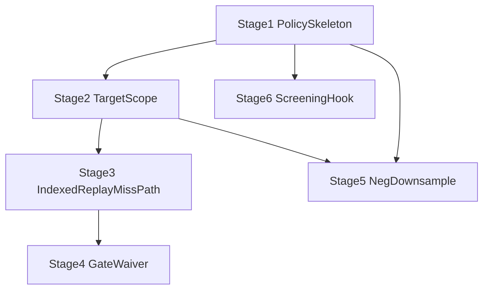

# trainer_hightier - Training Acceleration and Scope - Working Plan

本文件屬於 **Working / Execution Plan 層**，承接：

- SSOT：[`Training Acceleration and Scope - SSOT.md`](../../ssot/Training%20Acceleration%20and%20Scope%20-%20SSOT.md)
- Implementation Plan：[`Training Acceleration and Scope - IMPLEMENTATION_PLAN.md`](../../implementation/active/Training%20Acceleration%20and%20Scope%20-%20IMPLEMENTATION_PLAN.md)

本文件只定義可執行任務拆解、順序、DoD、驗證與 blocker 管理；不重寫 scope 或 architecture。

---

## 1) 範圍與護欄

### 1.1 In scope

- `TrainingScopePolicy` / `SamplePolicy` config object 與 fingerprint
- target horizon 只縮 target rows，不截斷 primitive source history
- Step 3.5 short-PIT miss-path 改接 indexed replay
- full-month gate / waiver artifact 正式化（WP-10 治理決策落 code）
- train-only negative downsampling artifact layer
- feature screening hook + manifest contract（預設關閉）

### 1.2 Out of scope

- 改 walkaway label business definition
- 改 production scorer runtime contract
- harmonize batch-local vs full-month canonical fanout（`bet__*` waiver 維持特例）
- 通用 waiver framework
- feature screening 完整 top-k rollout 或直接改 registry baseline
- bounded DuckDB 作 miss-path automatic fallback

### 1.3 已鎖定決策

| 項目 | 決策 |
|------|------|
| Step 3.5 miss-path | 預設 `indexed replay`（`emit_opt`） |
| Gate | `fe__*` hard parity；`legacy bet 1h pack` 採 **特例釘死 waiver** |
| Waiver 形式 | 不做通用 framework；只接受已文件化 WP-10 root cause 類型 |
| Failure mode | fail-fast；無 bounded auto fallback |
| Neg downsampling | 僅 speed / iteration run；**release / promoted run 維持 `neg_sample_frac=1.0`** |
| Val/test | 永不採樣 |
| Refit-on-train+val | 若有 refit，val 不 downsample |
| Feature screening | Phase 4 hook only；預設關閉；只產 manifest |
| Policy config | Python dataclass；不用 env var |
| Default horizon | MVP `recent_full_months=3`，`include_current_partial_month=true` |
| Completeness | dev/benchmark `warn`；release 建議 `strict`（可後續治理） |

### 1.4 上位追溯

| 層級 | 文件 | 職責 |
|------|------|------|
| SSOT | `Training Acceleration and Scope - SSOT.md` | policy truth、TA-001～017、DL-001 |
| Implementation Plan | `Training Acceleration and Scope - IMPLEMENTATION_PLAN.md` | module boundary、phase strategy |
| Working Plan | **本檔** | ticket 拆解、順序、DoD、驗證 |

若實作與上位文件衝突，不得在工作層直接改寫 scope；先回寫 SSOT 或 Implementation Plan。

---

## 2) 任務總覽

| Batch | Stage | 主題 | 狀態 |
|-------|-------|------|------|
| A | 1 | Policy foundation + reporting skeleton | **pending** |
| A | 2 | WS-A target scope / completeness / split | **pending** |
| B | 3 | WS-B Step 3.5 indexed replay miss-path | **pending** |
| B | 4 | WS-C gate / waiver / report formalization | **pending** |
| C | 5 | WS-D train-only negative downsampling | **pending** |
| D | 6 | WS-E feature screening hook | **pending** |

**前置已完成：** WP-10 full-month gate（202605，10.28× speedup，`fe__*` pass，`bet__*` waiver accepted，DL-001）。

---

## 3) Stage 1 — Policy Foundation and Reporting Skeleton

**目標：** 固定 policy 介面與 run artifact schema，後續 workstream 只填值、不回頭改 contract。

| ID | 任務 | Files | DoD |
|----|------|-------|-----|
| TA-WP-1.1 | 定義 `TrainingScopePolicy` dataclass | `config.py` | 含 `recent_full_months`, `include_current_partial_month`, `as_of_date`, `data_completeness_mode`, resolved `target_months` |
| TA-WP-1.2 | 定義 `SamplePolicy` dataclass | `config.py` | 含 `neg_sample_frac`, `neg_sample_seed`, `neg_sample_scope=train_only` |
| TA-WP-1.3 | 定義 screening hook policy stub | `config.py` | `feature_screening_enabled=false` 預設；fingerprint helper 預留 |
| TA-WP-1.4 | Policy fingerprint helpers | `config.py` 或小型 helper module | 產出 `training_scope_policy_fingerprint`, `sample_policy_fingerprint`, `feature_selection_policy_fingerprint` |
| TA-WP-1.5 | Trainer policy resolution wiring | `trainer.py` | run 開始時 resolve policies；傳入 downstream steps |
| TA-WP-1.6 | Run manifest / report skeleton | `reporting/writer.py`, `trainer.py` | 預留欄位：target months, completeness, cache hit/miss, gate/waiver summary |
| TA-WP-1.7 | Release guard for sampling | `trainer.py` 或 `05_lgbm_train.py` | promoted/release run 若 `neg_sample_frac != 1.0` → fail-fast |
| TA-WP-1.8 | Focused tests | `tests/test_training_scope_policy.py`（新建） | fingerprint 穩定、default values、release guard |

**Stage 1 DoD：**

- config / trainer / reporting 間 policy 介面固定
- fingerprint 清楚區分 target scope、sampling、screening，未混入 primitive cache fingerprint
- dry-run 可輸出最小 run artifact schema

**驗證：**

```bash
pytest trainer_hightier/tests/test_training_scope_policy.py -q
```

---

## 4) Stage 2 — WS-A Target Scope / Completeness / Split

**目標：** `recent_full_months=3` 只縮 target rows，primitive history 不受 horizon 截斷。

| ID | 任務 | Files | DoD |
|----|------|-------|-----|
| TA-WP-2.1 | Target-month resolution | `config.py`, `trainer.py` | 由 `as_of_date + recent_full_months + include_current_partial_month` 解析 selected months |
| TA-WP-2.2 | Target-row filtering at assembly | `03_build_training_data.py`, `trainer.py` | 只 filter target rows；primitive materialization 仍依 entity set / source coverage |
| TA-WP-2.3 | Step 3 month pruning at assembly boundary | `03_build_training_data.py`, `trainer.py` | Feast / slow-snap month batching 只 iterate selected target months；不得先全量 assemble 17–18 個月再於 Step 3 後做 horizon filter |
| TA-WP-2.4 | Completeness audit | `03_build_training_data.py` 或 helper | 輸出 expected months、missing `gaming_day_event` dates、per-month row/censored counts |
| TA-WP-2.5 | `warn/strict` branch | `trainer.py` | `strict` 缺 full-month dates → fail；`warn` → report only |
| TA-WP-2.6 | Split reporting | `04_split_dataset.py` | censored exclusion、selected target months、month-level counts 寫入 artifact |
| TA-WP-2.7 | Cache invalidation alignment | `utils/cache_invalidation_v1.py`, `trainer.py` | horizon change 只 invalidate assembly/split/sample/model |
| TA-WP-2.8 | Focused tests | `tests/test_training_scope_policy.py`, split tests, Step 3 integration smoke | horizon resolution、target-vs-source boundary、strict/warn，且 recent horizon run 不得觸發非 target month Feast assembly |

**Stage 2 DoD：**

- `recent_full_months=3` 只影響 target rows
- Step 3 在 assembly boundary 就只物化 / assemble selected target months，不接受先全量月批次再裁 target rows 的實作
- val/test 仍保有最新 eligible uncensored rows
- run artifact 能解釋 selected months、completeness、censored counts

**驗證：**

```bash
pytest trainer_hightier/tests/test_training_scope_policy.py -q
pytest trainer_hightier/tests/test_split_dataset.py -q
# 代表 run：比較 3m vs 6m invalidation 範圍（手動或 integration smoke）
# 代表 run：recent_full_months=3 時，Step 3 日誌 / artifact 僅涵蓋 target months
```

---

## 5) Stage 3 — WS-B Step 3.5 Indexed Replay Miss-Path

**目標：** shard hit path 不變；miss / cold-build / fill 走 indexed replay。

| ID | 任務 | Files | DoD |
|----|------|-------|-----|
| TA-WP-3.1 | Miss branch wiring | `feature_experiment/short_term_pit_cache.py` | miss 改呼叫 `short_term_pit_replay_indexed_prototype`；hit 仍讀 month shard |
| TA-WP-3.2 | Callable contract freeze | `short_term_pit_replay_indexed_prototype.py`, `materialize_fe_derived.py` | 輸入/輸出、column set、emit mode 固定並文件化 |
| TA-WP-3.3 | Materializer fingerprint expansion | `short_term_pit_cache.py` | fingerprint 納入 miss-path engine、`indexed_replay_gate_mode` |
| TA-WP-3.4 | Fail-fast on replay failure | `short_term_pit_cache.py` | 無 bounded silent fallback |
| TA-WP-3.5 | Run report metrics | `trainer.py`, `reporting/writer.py` | shard hit/miss counts、miss reason、replay wall time、materializer choice |
| TA-WP-3.6 | Hit path regression tests | `tests/test_short_term_pit_cache.py` | 既有 hit / force refresh 行為不變 |
| TA-WP-3.7 | Miss-path wiring test | `tests/test_short_term_pit_cache.py` 或新 test | miss 時選 indexed replay；failure propagate |

**Stage 3 DoD：**

- shard hit path 行為不變
- shard miss 走 indexed replay 且 failure fail-fast
- bounded path 僅 benchmark / oracle / diagnosis

**驗證：**

```bash
pytest trainer_hightier/tests/test_short_term_pit_cache.py -q
# 代表 cold-build run：確認 artifact 含 replay metrics
```

---

## 6) Stage 4 — WS-C Gate / Waiver / Report Formalization

**目標：** WP-10 治理決策寫入 code；artifact 與 SSOT DL-001 一致。

| ID | 任務 | Files | DoD |
|----|------|-------|-----|
| TA-WP-4.1 | Refactor gate evaluator | `short_term_pit_replay_indexed_prototype.py` | 拆 output validation / hard parity / waiver / speedup / final decision |
| TA-WP-4.2 | Hard parity on `fe__*` | same | zero mismatch required |
| TA-WP-4.3 | Pinned waiver for `legacy bet 1h pack` | same | scope 限已知 pack；需 root cause doc、ratio 上限、hard parity pass |
| TA-WP-4.4 | Preserve `parity.passed=false` on waiver | same | 不得 silent rewrite 成 full pass |
| TA-WP-4.5 | Report schema formalization | `reporting/writer.py` | `hard_parity_passed`, `waiver_accepted`, `waiver`, `decision_basis`, `final_integration_met` |
| TA-WP-4.6 | Separate Step 4.5 gate | `06_verify_training_serving_parity.py` | 不混入 indexed-vs-bounded cold-build logic |
| TA-WP-4.7 | Gate tests | `tests/test_short_term_pit_replay_indexed_prototype.py` | pass / hard fail / waiver accepted / waiver rejected |
| TA-WP-4.8 | Benchmark replay validation | benchmark harness | 用 WP-10 artifact 或同級 run 驗 decision block |

**Waiver 接受條件（釘死）：**

- scope = `legacy_bet_pack_1h` only
- `fe__*` hard parity passed
- mismatch ratio ≤ 約定上限（WP-10 參考：54 / 3.4M ≈ 0.0016%）
- root cause = batch-local bounded pool fanout vs full-month alias fanout
- 非 scope 欄位 mismatch → fail

**Stage 4 DoD：**

- code 直接輸出與 DL-001 一致 gate artifact
- 非 waiver scope 或 waiver 條件不成立 → fail-fast

**驗證：**

```bash
pytest trainer_hightier/tests/test_short_term_pit_replay_indexed_prototype.py -q
```

---

## 7) Stage 5 — WS-D Train-Only Negative Downsampling

**目標：** Step 4 與 Step 5 間加入 sampled-train layer；evaluation 不受污染。

| ID | 任務 | Files | DoD |
|----|------|-------|-----|
| TA-WP-5.1 | Sampled-train artifact layer | `trainer.py`, 新 helper 或 step module | Step 4 後產出 sampled train parquet |
| TA-WP-5.2 | Negative-only sampling | same | 正樣本預設全保留；固定 seed |
| TA-WP-5.3 | Step 5 integration | `05_lgbm_train.py` | policy enabled 時讀 sampled train |
| TA-WP-5.4 | Metrics disclosure | `05_lgbm_train.py`, `reporting/writer.py` | pre/post train rows、sample ratio、evaluation unsampled 標記 |
| TA-WP-5.5 | Cache invalidation | `utils/cache_invalidation_v1.py` | `neg_sample_frac` change → 只 invalidate sampled train + model |
| TA-WP-5.6 | Leakage / config guards | `trainer.py` | invalid config fail-fast；release `neg_sample_frac=1.0` |
| TA-WP-5.7 | Focused tests | `tests/test_step5_lgbm_train.py` 或新 test | reproducibility、val/test untouched、release guard |

**Stage 5 DoD：**

- sampling 只作用 train split
- val/test metrics 完全來自 unsampled split
- policy change 不重算 primitive caches

**驗證：**

```bash
pytest trainer_hightier/tests/test_step5_lgbm_train.py -q
```

---

## 8) Stage 6 — WS-E Feature Screening Hook

**目標：** hook + manifest contract；預設 no-op；不動 registry baseline。

| ID | 任務 | Files | DoD |
|----|------|-------|-----|
| TA-WP-6.1 | Trainer hook position | `trainer.py` | Step 4 後、Step 5 前 optional hook |
| TA-WP-6.2 | Manifest contract | helper + docs in WP | `selected_features`, method, evidence refs, fingerprint |
| TA-WP-6.3 | FQG pattern alignment | 參照 `feature_quality_gate.py` | manifest schema 與 experiment pipeline 對齊 |
| TA-WP-6.4 | Report fields | `reporting/writer.py` | `feature_selection_policy_fingerprint`, screening metadata |
| TA-WP-6.5 | Default off behavior | `trainer.py`, `config.py` | 關閉時 baseline path 完全不變 |
| TA-WP-6.6 | Focused tests | new test | no-op regression；manifest-enabled smoke |

**Stage 6 DoD：**

- hook 關閉 = no-op
- hook 開啟只讀 manifest，不直接改 `feature_candidate_registry.yaml`

**驗證：**

```bash
pytest trainer_hightier/tests/test_feature_screening_hook.py -q
```

---

## 9) 建議執行順序

```text
Batch A: TA-WP-1.* → TA-WP-2.*
Batch B: TA-WP-3.* → TA-WP-4.*
Batch C: TA-WP-5.*
Batch D: TA-WP-6.*
```



Stage 3–4 與 Stage 5 可在 Batch A 完成後部分並行，但 **Stage 5 不應早於 Stage 2 split 穩定**；Stage 6 不阻塞主線。

---

## 10) 整體驗收門檻

| 項目 | 門檻 |
|------|------|
| Target scope | `recent_full_months=3` 只縮 target rows，且 Step 3 只 assemble target months |
| Primitive reuse | horizon change 不重算 L0–L5 primitives（coverage 足夠時） |
| Step 3.5 miss-path | 預設 indexed replay；`fe__*` hard parity 綠燈 |
| Waiver governance | `parity.passed=false` 保留；`hard_parity_passed` + pinned waiver 可 integration |
| Downsampling | train-only；release `neg_sample_frac=1.0` |
| Screening | 預設關閉且 no-op |
| Reporting | run report 能解釋 time saved、cache reuse、row reduction、gate/waiver decision |

---

## 11) Blockers / Escalation

**立即停止並回頭修正：**

- target scope 導致 primitive cache 被重算
- recent horizon run 仍對非 target months 做 Step 3 Feast / slow-snap assembly
- Step 3.5 hit path regression
- gate artifact 無法區分 `hard_parity_passed` 與 `waiver_accepted`
- sampling 改變 val/test row count 或 metrics contract
- screening hook 關閉時仍改變 baseline path

**升級回 SSOT / Implementation Plan：**

- `legacy bet 1h pack` waiver 不再是 isolated 特例
- `recent_full_months=3` 明顯損害模型品質
- release run 必須允許 sampling（與現行 frozen decision 衝突）

---

## 12) 每批交付清單

每一 Batch 完成時至少交付：

1. focused automated tests
2. 一次 representative run 或 benchmark，佐證 artifact 正確
3. 簡短驗收摘要（cache invalidation 範圍、report 新欄位、fail-fast 行為）

---

## 13) 相關文件

| 文件 | 用途 |
|------|------|
| [`Training Acceleration and Scope - SSOT.md`](../../ssot/Training%20Acceleration%20and%20Scope%20-%20SSOT.md) | policy truth |
| [`Training Acceleration and Scope - IMPLEMENTATION_PLAN.md`](../../implementation/active/Training%20Acceleration%20and%20Scope%20-%20IMPLEMENTATION_PLAN.md) | architecture / phases |
| [`Short-Term PIT … WORKING_PLAN.md`](Short-Term%20PIT%20Cache%20and%20Materialize%20Performance%20-%20WORKING_PLAN.md) | WP-10 歷史與 prototype 細節 |
| `out/replay_benchmark_202605_indexed_full_month_gate16_emit_opt/benchmark_report.json` | DL-001 證據 |
