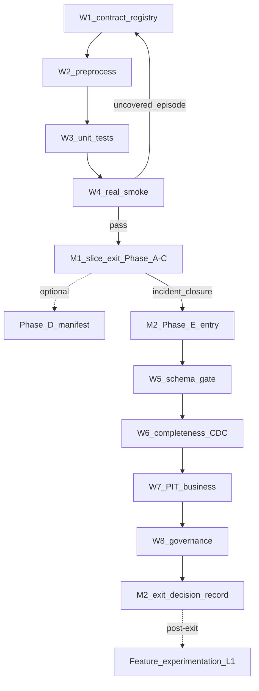

# trainer_hightier - `t_casino_txn` Source Integration Working Plan（執行計畫）

本文件屬於 **Working / execution plan 層**，承接：

- SSOT：`doc/ssot/Data pipeline - SSOT.md` **§5.2**
- Implementation Plan：`doc/implementation/active/t_casino_txn Source Integration - IMPLEMENTATION_PLAN.md`

內容包含 **`t_casino_txn` L0 source integration**（Phase A–D）與 **quarantine exit**（Phase E / M2）的可執行任務拆解、workstream 順序、DoD、阻擋條件與驗收。**不含** L1 feature materialize、registry promotion、Step 3.5 enrich 或 Gate 1。

> **狀態（2026-06-11）**：**active**；上游 **data source incident** 期間，cleaned artifact 一律 **`not_model_eligible`**。  
> **M1（Phase A–C）**：第一個 code slice 進行中或已完成。  
> **M2（Phase E）**：待 M1 + incident closure 後啟動；對齊 IP **Phase E — Quarantine Exit & Source Promotion**。  
> **不重疊**：本計畫 **不取代** [`Feature experimentation - WORKING_PLAN.md`](Feature%20experimentation%20-%20WORKING_PLAN.md) §1.7（txn_lite 已 **PAUSED**）；L1 恢復須待 **M2 exit** 後另案。

---

## 1) 範圍與護欄（Scope & Guardrails）

### 1.1 本 working plan 的範圍

| 層級 | In scope（本 WP） | Out of scope |
|------|-------------------|--------------|
| **L0** | raw partition discovery、registry-driven correction、dedup、hard exclude、suspicious flags、cleaned parquet、DQ sidecar | — |
| **Phase E** | exit evidence package 彙整、8 gates 稽核、completeness / PIT audit、decision record 起草與 snapshot-scoped release | L1 materialize、registry promote |
| **L1** | — | `materialize_txn_lite.py`、`txn__*`、bet-grain join |
| **Training / model** | — | Step 3.5 enrich、registry baseline、Gate 1、production trainer、serving |
| **Ops** | Phase D manifest；Phase E evidence 目錄 | `source_manifest_v2` 全鏈（Phase D 可並行） |

### 1.2 已鎖定的設計決策（對齊 SSOT §5.2 + IP §0.1）

| ID | 決策 |
|----|------|
| TXN-L0-001 | `txn_available_ts` = **logical observed-at**（非 raw `__etl_insert_Dtm` 直用） |
| TXN-L0-002 | `txn_event_ts` = `start_dtm` |
| TXN-L0-003 | L0 **保留所有 `type`**；BUYIN/CASHOUT 篩選屬 L1 |
| TXN-L0-004 | Hard exclude：缺 `casino_txn_id`、`start_dtm` 或 `__etl_insert_Dtm` |
| TXN-L0-005A | raw `__etl_insert_Dtm < start_dtm`：**preflight**；未登錄 correction → **hard-fail** |
| TXN-L0-005B | 登錄 `TXN-BULK-INGEST-2025-05-27`；`ingest_delay_cap_sec = 128` |
| TXN-L0-006 | 輸出：`artifacts/cleaned/cleaned__gmwds_t_casino_txn/` |
| TXN-L0-007 | 第一個 code slice **不含** Phase D（Step 1 manifest） |
| TXN-L0-008 | **Source quarantine**：`not_model_eligible: true` 直至 incident 關閉 |
| TXN-EXIT-001 | Quarantine exit 以 SSOT **8 gates** 為驗收真相 | 對齊 IP Phase E |
| TXN-EXIT-002 | Phase E exit **≠** registry promote | L1 恢復屬 Feature experimentation |
| TXN-EXIT-003 | quarantine 期 `txn_lite` / Gate 1 **不得**單獨作 exit 依據 | 僅背景參考 |

### 1.3 Correction 治理模式（對齊 `t_bet` / `t_session`）

- **規則真相**：`contracts/preprocess_l0_data_contract_registry.yaml` 之 `tables.gmwds_t_casino_txn`（bulk episodes、synthetic observed-at contract、`active_rules`）。
- **程式邊界**：薄 Python parser/helper（對齊 [`preprocess_bet_fix_registry.py`](../../../preprocess_bet_fix_registry.py)）；**禁止**把 cap / episode 硬編碼在 `txn_l0_preprocess.py` 內而不經 registry。
- **參考實作**：[`utils/bet_l0_preprocess.py`](../../../utils/bet_l0_preprocess.py)、[`utils/session_l0_preprocess.py`](../../../utils/session_l0_preprocess.py)。

### 1.4 Raw 來源與分區契約

| 項目 | v1 規則 |
|------|---------|
| 正式 raw 根目錄 | `data/t_casino_txn/` |
| 分區結構 | `partition_YYYYMM/part_*.parquet` |
| 探索樣本 | `data/new tables/t_casino_txn__part_*.parquet` **不得**作正式 smoke / production path |
| 分區語意 | `partition_YYYYMM` 為 **audit boundary**；`start_dtm` 可 spill 到鄰近日（casino day cutover） |

### 1.5 Logical observed-at v1（registry 必須可機讀）

```sql
GREATEST(
  LEAST(
    TRY_CAST(__etl_insert_Dtm AS TIMESTAMP),
    TRY_CAST(start_dtm AS TIMESTAMP) + INTERVAL 128 SECOND
  ),
  TRY_CAST(start_dtm AS TIMESTAMP)
)
```

- 物化欄位：`txn_observed_at_raw`（保留 raw）、`txn_available_ts`（logical）、`observed_at_correction_rule_id`（有套用時必填）。
- 不變式：`txn_available_ts >= txn_event_ts`（= `start_dtm`）。

### 1.6 Quarantine 護欄（強制）

Quarantine 期間 **允許**：ingest、L0 preprocess、unit tests、real partition smoke、DQ / investigation。  
Quarantine 期間 **禁止**：

- 將 cleaned artifact 標為 model-eligible
- `feature_candidate_registry.yaml` baseline / promotion 變更
- Step 3.5 txn enrich hook
- Feature experimentation Gate 1 結論作 promote 依據
- 依 incident 前 txn_lite ablation 做 model 決策

---

## 2) Execution slice（第一個 code slice：Phase A–C）

本 slice 對齊 IP **Phase A–C**；**Phase D** 僅在 §5 列為後續，不納入本 slice exit。

### Slice entry criteria

- SSOT §5.2 與 Source Integration IP 已鎖定（2026-06-10）。
- Raw 正式路徑 `data/t_casino_txn/partition_YYYYMM/` 可讀（至少 `partition_202505`、`partition_202605` 存在或可取得）。

### Slice exit criteria（第一個 code slice DoD）

- [ ] `tables.gmwds_t_casino_txn` 已寫入 `preprocess_l0_data_contract_registry.yaml`，含 `TXN-BULK-INGEST-2025-05-27` 與 cap=128
- [ ] `utils/txn_l0_preprocess.py` 可從正式 partition 寫入 `cleaned__gmwds_t_casino_txn/`
- [ ] preflight：uncovered `observed_before_event` → hard-fail + evidence sidecar（**不**產 cleaned parquet）
- [ ] covered correction：`txn_available_ts >= txn_event_ts` 且 `observed_at_correction_rule_id` 有值
- [ ] `tests/test_txn_l0_preprocess.py` 全通過（§4.2 清單）
- [ ] Real smoke：`partition_202505`（correction path）與 `partition_202605`（normal path）各一輪成功
- [ ] `source_metadata.json` 含 `not_model_eligible: true`
- [ ] **未**修改 registry baseline、Step 3.5、production trainer、serving

### Slice 產物（最低）

```
trainer_hightier/artifacts/cleaned/cleaned__gmwds_t_casino_txn/
  partition_YYYYMM/
    cleaned.parquet                    # 或等價分片命名
    txn_l0_materialization_report.json
    source_metadata.json
```

---

## 3) 任務拆解（Task breakdown）

以下依 **W1–W4** workstream 拆分；**Owner** 執行前指派。

### Workstream W1 — Contract & registry（Phase A）

| Task ID | Task | Owner | 依賴 | DoD | 產出 |
|---------|------|-------|------|-----|------|
| W1-1 | 在 `preprocess_l0_data_contract_registry.yaml` 新增 `tables.gmwds_t_casino_txn` | TBD | — | 含 `semantics`（event/observed/available）、`logical_key`、`dedup_order`、`hard_exclude` | registry YAML diff |
| W1-2 | 登錄 `bulk_historical_ingest_episodes` + `TXN-BULK-INGEST-2025-05-27` | TBD | W1-1 | `match_rule_sql` 對齊 observed calendar day 2025-05-27；附 evidence 欄位 | episode 區塊 |
| W1-3 | 定義 `synthetic_observed_at_contract`（cap=128、logical expr） | TBD | W1-1 | 與 SSOT §5.2 / IP §1.1 SQL 一致 | contract 區塊 |
| W1-4 | 新增 `active_rules`（例如 `TXN-INGEST-FIX-001` normalize_observed_at） | TBD | W1-3 | enabled=true；cap 與 contract 一致 | active_rules 條目 |
| W1-5 | 薄 parser：載入 `gmwds_t_casino_txn` 區段並 resolve cap / applied rules | TBD | W1-4 | 對齊 `resolve_bet_ingest_fix004_cap_binding` 模式；unit test 可讀 registry | `preprocess_txn_fix_registry.py` 或擴充既有 parser |
| W1-6 | Registry schema validator test | TBD | W1-1–W1-5 | 缺欄 / cap 不一致 → fail-fast | `test_txn_l0_registry.py`（可併入 W3） |

### Workstream W2 — L0 preprocess 實作（Phase B）

| Task ID | Task | Owner | 依賴 | DoD | 產出 |
|---------|------|-------|------|-----|------|
| W2-1 | `txn_l0_preprocess.py` 骨架：partition discovery、DuckDB runtime、atomic write | TBD | W1-5 | 只接受 `partition_YYYYMM/part_*.parquet` | 模組檔 |
| W2-2 | **Preflight**：掃描 raw `__etl_insert_Dtm < start_dtm` | TBD | W2-1 | uncovered 列 → `PreflightHardFailError` + evidence JSON；**不**寫 cleaned | preflight 函式 + evidence schema |
| W2-3 | Delete-aware dedup（`casino_txn_id`） | TBD | W2-1 | `__op='d'` / `__deleted='True'` 整 logical id 排除 | SQL + 計數進 sidecar |
| W2-4 | Hard exclude + suspicious flags | TBD | W2-3 | 缺 key/timestamp 排除；非正 `txn_value` 等保留+flag | DQ flag 欄位 |
| W2-5 | Logical observed-at materialization | TBD | W1-3, W2-2 | 套用 registry cap；填 `observed_at_correction_rule_id` | `txn_available_ts` 欄位 |
| W2-6 | 寫 sidecar：`txn_l0_materialization_report.json`、`source_metadata.json` | TBD | W2-5 | 含 fingerprint、correction counts、`not_model_eligible: true` | sidecar JSON |
| W2-7 | CLI / entrypoint（指定 partition + output dir） | TBD | W2-6 | 可單獨跑單一 `partition_YYYYMM` | CLI 或 `python -m` |

### Workstream W3 — Validation & unit tests（Phase B–C）

| Task ID | Task | Owner | 依賴 | DoD | 產出 |
|---------|------|-------|------|-----|------|
| W3-1 | Test：delete-aware dedup deterministic | TBD | W2-3 | 同 fixture 重跑結果一致 | pytest case |
| W3-2 | Test：hard exclude 計數 | TBD | W2-4 | sidecar 與實際排除列一致 | pytest case |
| W3-3 | Test：**uncovered** observed-before-event → hard-fail | TBD | W2-2 | 無 cleaned parquet；evidence 含 violation 列數 | pytest case |
| W3-4 | Test：**covered** `TXN-BULK-INGEST-2025-05-27` correction | TBD | W2-5 | `txn_available_ts >= txn_event_ts`；rule id 非空 | pytest case |
| W3-5 | Test：suspicious flags 保留於 output | TBD | W2-4 | flag 欄位存在且計數合理 | pytest case |
| W3-6 | Test：sidecar schema + deterministic fingerprint | TBD | W2-6 | 同輸入兩次 fingerprint 相同 | pytest case |
| W3-7 | Test：registry cap mismatch → fail-fast | TBD | W1-5 | contract cap ≠ active rule cap 時拋錯 | pytest case |

### Workstream W4 — Real partition smoke & evidence review（Phase C）

| Task ID | Task | Owner | 依賴 | DoD | 產出 |
|---------|------|-------|------|-----|------|
| W4-1 | Smoke：`data/t_casino_txn/partition_202505` | TBD | W2-7, W3-* | 流程成功；correction 列有 rule id；sidecar 完整 | `artifacts/.../partition_202505/` |
| W4-2 | Smoke：`data/t_casino_txn/partition_202605` | TBD | W2-7, W3-* | 流程成功；無未登錄 preflight violation | `artifacts/.../partition_202605/` |
| W4-3 | Evidence review checklist | TBD | W4-1, W4-2 | 人工確認 type 分布、delay percentiles、row counts 合理 | review 筆記（可掛 sidecar 目錄） |
| W4-4 | 若 smoke 暴露 **未登錄 episode** | TBD | W4-* | **停止 slice**；先更新 registry（W1-2）再重跑；不得 silent bypass | incident / decision note |

---

## 4) 驗收清單（Acceptance checklists）

### 4.1 Preflight & correction gate

| 檢查項 | Pass 條件 | Fail 行為 |
|--------|-----------|-----------|
| Raw path | 僅 `data/t_casino_txn/partition_YYYYMM/part_*.parquet` | fail-fast |
| Uncovered `observed_before_event` | 0 列，或全數被登錄 episode / rule 覆蓋 | hard-fail；輸出 evidence；**不**產 cleaned |
| Covered correction | `txn_available_ts >= txn_event_ts` | hard-fail |
| Rule traceability | sidecar 含 `applied_correction_rules` 或等價 | fail-fast |

### 4.2 Unit test 最低覆蓋

- [ ] dedup + delete-aware
- [ ] hard exclude
- [ ] uncovered observed-before-event hard-fail
- [ ] covered `TXN-BULK-INGEST-2025-05-27` correction
- [ ] suspicious flags
- [ ] sidecar schema + deterministic fingerprint
- [ ] registry cap binding validation

### 4.3 Real smoke 最低覆蓋

- [ ] `partition_202505` 成功產出 cleaned + sidecar
- [ ] `partition_202605` 成功產出 cleaned + sidecar
- [ ] 兩輪 `source_metadata.json` 皆含 `not_model_eligible: true`
- [ ] 兩輪 `cleaning_policy_id = t_casino_txn_l0_v1_fnd19`

### 4.4 Quarantine 合規（必須全勾）

- [ ] 未改 `feature_candidate_registry.yaml` baseline
- [ ] 未改 Step 3.5 / production trainer / serving
- [ ] 未跑 Gate 1 或 txn_lite ablation 作決策依據

---

## 5) 後續 slice（Phase D — 不在第一個 code slice）

| Task ID | Task | 依賴 | 備註 |
|---------|------|------|------|
| D-1 | Step 1 manifest / `source_manifest_v2` 掛鉤 | Slice exit | 與 Cache Redesign SSOT 對齊 |
| D-2 | Cache invalidation 鍵含 raw shard fingerprint | D-1 | 後續 IP bump |

**Entry**：第一個 code slice exit 達成 + incident 調查仍進行中亦可做 D（純 manifest，仍 `not_model_eligible`）。

---

## 5.1) Execution slice（Phase E — M2 quarantine exit）

本 slice 對齊 IP **Phase E** 與 SSOT §5.2 **Quarantine exit checklist**（8 gates）。

### Slice entry criteria（M2 進入）

- [ ] **M1 達成**：§10 Slice 完成定義全勾（Phase A–C）。
- [ ] **上游 incident closure**：data source incident 已正式關閉（外部輸入；須附 incident closure 紀錄連結）。
- [ ] **Phase D 建議完成**：`source_manifest_v2` 或等價 inventory 可 raw→cleaned 追溯；若未完成，decision record 須明示 traceability 風險。
- [ ] 擬 exit 之 snapshot / 月份範圍已鎖定（例如 `snapshot_id=202605_batch`、月份 `202505–202605`）。

### Exit evidence package 路徑（v1）

```
trainer_hightier/artifacts/quarantine_exit/t_casino_txn/<snapshot_id>/
  manifest.json                         # 8 gates 完成狀態 + artifact 指標
  schema_contract/
  completeness_audit/
  cdc_correction/
  pit_safety/
  business_semantics/
  join_readiness/
  evidence_boundary/
  decision_record_link.json             # 指向 doc/decisions/... DECISION_RECORD.md
```

### Slice exit criteria（M2 DoD）

- [ ] 8 gates 均有對應 artifact（見 §5.2 W5–W8）
- [ ] `doc/decisions/t_casino_txn Quarantine Exit - DECISION_RECORD.md` 已建立
- [ ] exit scope 為 **snapshot-scoped**（非 blanket release）
- [ ] **未**以 quarantine 期 `txn_lite` / Gate 1 作為唯一 exit 依據

### Workstream W5 — Schema contract & drift gate（Gate 1）

| Task ID | Task | Owner | 依賴 | DoD | 產出 |
|---------|------|-------|------|-----|------|
| W5-1 | 執行 schema drift 測試套件 | TBD | M1 | `assert_txn_l0_schema_matches_ddl()` + `assert_dictionary_section5_matches_ddl()` 全通過 | pytest log → `schema_contract/` |
| W5-2 | 彙整 fingerprint 與 contract ref | TBD | W5-1 | 含 `schema_ddl_ref`、`schema_fingerprint_sha256_hex` | `schema_contract/fingerprint.json` |

### Workstream W6 — Completeness & CDC closure（Gate 2–3）

| Task ID | Task | Owner | 依賴 | DoD | 產出 |
|---------|------|-------|------|-----|------|
| W6-1 | 跨分區掃描 `is_partial_partition` | TBD | M1 | 彙總各月 `source_metadata.json` | `completeness_audit/partition_status.csv` |
| W6-2 | 產出合格 / 排除月份清單 | TBD | W6-1 | partial 月已補齊重跑，或列入 decision record 排除項 | `completeness_audit/eligible_partitions.json` |
| W6-3 | CDC / correction closure 稽核 | TBD | M1 | 彙總 preflight reports、correction counts；未登錄 episode = 0 | `cdc_correction/closure_audit.json` |
| W6-4 | 若發現未登錄 episode | TBD | W6-3 | **停止 M2**；回 W1-2 登錄 episode 後重跑 L0 | incident note |

### Workstream W7 — PIT safety & business semantics（Gate 4–5）

| Task ID | Task | Owner | 依賴 | DoD | 產出 |
|---------|------|-------|------|-----|------|
| W7-1 | 彙總 delay 分布（eligible 月份） | TBD | W6-2 | 含 observed−event percentiles | `pit_safety/delay_distribution.json` |
| W7-2 | 對已核准 snapshot 跑 PIT audit | TBD | W6-2 | `txn_asof_join.py` 或等價；`txn_available_ts <= prediction_ts` | `pit_safety/pit_audit_report.json` |
| W7-3 | 撰寫 L1 業務規則矩陣（供 domain review） | TBD | — | `type`/`status`/`sub_type`/`buyin_status`；含 Prize Redemption 邊界 | `business_semantics/rule_matrix.md` |
| W7-4 | DQ 切片（按 type/status/sub_type） | TBD | W6-2 | 覆蓋 BUYIN/CASHOUT 主要組合 | `business_semantics/dq_slices/` |
| W7-5 | 取得 domain sign-off | TBD | W7-3, W7-4 | 書面或等價紀錄 | `business_semantics/domain_signoff.md` |

### Workstream W8 — Join readiness, evidence boundary & governance（Gate 6–8）

| Task ID | Task | Owner | 依賴 | DoD | 產出 |
|---------|------|-------|------|-----|------|
| W8-1 | 首個 model-eligible use case 規格 | TBD | W7-5 | join grain、key 選擇；**非** `bet_id`/`session_id` 核心 join | `join_readiness/use_case_spec.md` |
| W8-2 | Key coverage 摘要 | TBD | W6-2 | `player_id` coverage；`player_id` vs `canonical_id` 決策或 defer | `join_readiness/coverage_summary.json` |
| W8-3 | 證據邊界清單 | TBD | — | 明列採納 / 排除證據；quarantine 期 txn_lite 僅背景 | `evidence_boundary/sources.json` |
| W8-4 | 起草 decision record | TBD | W5–W8 | 含 snapshot 範圍、批准人、回退條件、已知排除項 | `doc/decisions/t_casino_txn Quarantine Exit - DECISION_RECORD.md` |
| W8-5 | 組裝 exit evidence package manifest | TBD | W5–W8 | `manifest.json` 8 gates 全 PASS | `<snapshot_id>/manifest.json` |
| W8-6 | snapshot-scoped release 標記（若程式支援） | TBD | W8-4 | `not_model_eligible` 僅對綁定月份解除；新分區預設仍 quarantine | sidecar / registry patch（依 decision） |

### 4.5 Phase E 驗收清單（M2）

- [ ] Gate 1：schema drift 測試全通過
- [ ] Gate 2：eligible 月份清單與 decision record 一致；無靜默 partial 月
- [ ] Gate 3：CDC closure audit 通過；未登錄 episode = 0
- [ ] Gate 4：PIT audit 對已核准 snapshot 完成
- [ ] Gate 5：business semantics 有 domain sign-off
- [ ] Gate 6：join / entity readiness 已鎖定或 defer 已明示
- [ ] Gate 7：evidence boundary 已列 quarantine 期實驗為排除或背景
- [ ] Gate 8：decision record 已建立；snapshot-scoped

---

## 6) 阻擋條件與升級路徑（Blockers & Escalation）

### 6.1 預期 blocker（非意外）

| Blocker | 處置 |
|---------|------|
| Real smoke 發現 **未登錄** `observed_before_event` episode | 停止；新增 registry episode + rule；**不得** inline bypass |
| `partition_202505` / `202605` 不存在 | 先補資料下載；WP 不改成用 `data/new tables` 代替 |
| Registry cap 與 SSOT 不一致 | 先修 SSOT/IP/registry 三角一致，再寫程式 |
| 上游 incident 未關閉 | 維持 `not_model_eligible`；M1 slice 仍可完成；**M2 不得啟動** |
| **M2：partial 月未處理即 exit** | W6-2 強制產出 eligible 清單；partial 月須補齊或 decision record 明示排除 |
| **M2：以 quarantine 期 Gate 1 作 exit 依據** | W8-3 證據邊界；decision record 不得僅引用歷史 ablation |
| **M2：blanket 解除 not_model_eligible** | W8-4/W8-6 強制 snapshot-scoped；新分區預設仍 quarantine |

### 6.2 升級至 L1（M2 exit 後，**非本 WP Phase E**）

- 觸發條件：**M2 exit** + decision record 批准（非僅 M1 完成）。
- 另開 feature experimentation 恢復步驟（§1.7）或新 WP。
- L1 materializer **應消費 L0 cleaned**，而非重讀 raw。
- **須 post-quarantine 重跑** txn_lite / Gate 1；quarantine 期結果僅背景參考。

---

## 7) 建議執行順序



**M1（Phase A–C）**

1. **W1** 完成 registry + parser。
2. **W2** 實作 preflight → dedup → materialize → sidecar。
3. **W3** fixture 測試。
4. **W4** real smoke；未登錄 episode 回 W1。

**M2（Phase E）**

5. 確認 incident closure + 鎖定 snapshot 範圍。
6. **W5–W8** 依序產出 exit evidence package 8 區塊。
7. **W8-4** decision record 批准後，方可標記 snapshot-scoped release。
8. L1 恢復由 Feature experimentation WP 承接（**不在 W8 內**）。

---

## 8) 操作備註（非 RUNBOOK）

第一個 slice 完成後，預期可執行（實際 CLI 以 W2-7 實作為準）：

```bash
# 單一分區 smoke（路徑示意）
python -m trainer_hightier.utils.txn_l0_preprocess \
  --raw-partition data/t_casino_txn/partition_202505 \
  --output-dir trainer_hightier/artifacts/cleaned/cleaned__gmwds_t_casino_txn/partition_202505

python -m trainer_hightier.utils.txn_l0_preprocess \
  --raw-partition data/t_casino_txn/partition_202605 \
  --output-dir trainer_hightier/artifacts/cleaned/cleaned__gmwds_t_casino_txn/partition_202605

pytest trainer_hightier/tests/test_txn_l0_preprocess.py -q
```

---

## 9) Traceability（文件追溯）

| 層級 | 文件 |
|------|------|
| SSOT | `Data pipeline - SSOT.md` §5.2 |
| Implementation Plan | `t_casino_txn Source Integration - IMPLEMENTATION_PLAN.md`（Phase A–E） |
| Decision record（M2 必要） | `doc/decisions/t_casino_txn Quarantine Exit - DECISION_RECORD.md` |
| Working Plan（本檔） | `t_casino_txn Source Integration - WORKING_PLAN.md` |
| Source findings | `doc/FINDINGS.md` [FND-19] |
| Raw schema | `schema/GDP_GMWDS_Raw_Schema_Dictionary.md` §5 |
| Registry 參考 | `contracts/preprocess_l0_data_contract_registry.yaml`（`t_bet` / `t_session` 模式） |
| Feature 實驗（背景，paused） | `Feature experimentation - WORKING_PLAN.md` §1.7 |

---

## 10) M1 完成定義（Phase A–C — 簽核用）

執行者勾選並附 artifact 路徑 / pytest log：

- [ ] W1：registry + parser 完成
- [ ] W2：`txn_l0_preprocess.py` 完成
- [ ] W3：§4.2 全項 pytest 通過
- [ ] W4：`partition_202505`、`partition_202605` smoke 通過
- [ ] §4.4 quarantine 合規全勾
- [ ] `doc/README.md` active workstream 已登記（若尚未）

## 11) M2 完成定義（Phase E — 簽核用）

- [ ] §5.1 entry criteria 全勾（含 incident closure）
- [ ] W5：schema contract gate 通過
- [ ] W6：completeness + CDC closure audit 通過
- [ ] W7：PIT audit + business semantics sign-off 完成
- [ ] W8：join readiness + evidence boundary + decision record 完成
- [ ] exit evidence package 路徑完整（§5.1 目錄結構）
- [ ] §4.5 Phase E 驗收清單全勾
- [ ] **未**以 quarantine 期 Gate 1 作唯一 exit 依據

---

*文件版本：v2（2026-06-11）；M1 = Phase A–C + real smoke；M2 = Phase E quarantine exit（8 gates + evidence package）。*
