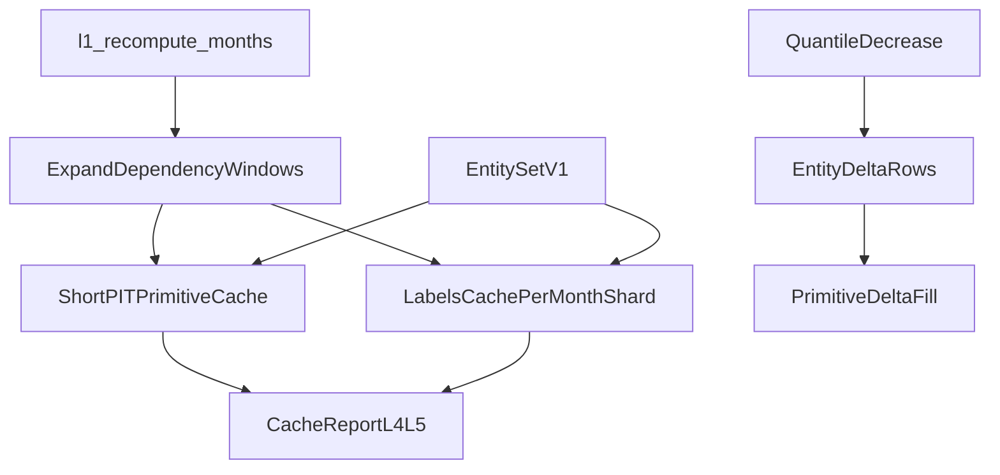

# trainer_hightier - Cache Redesign Working Plan (Phase 3)

本文件屬於 **Working / execution plan** 層，承接：

- [Cache Redesign - SSOT.md](../../ssot/Cache%20Redesign%20-%20SSOT.md)
- [Cache Redesign - IMPLEMENTATION_PLAN.md](../../implementation/active/Cache%20Redesign%20-%20IMPLEMENTATION_PLAN.md)
- [Cache Redesign - WORKING_PLAN Phase 2.md](Cache%20Redesign%20-%20WORKING_PLAN%20Phase%202.md)（Phase 2 已完成）

本文件只拆 **Phase 3：Labels And Feature Primitive Cache**。Phase 4+ 僅保留摘要與 non-goals。

## 0) Phase 3 Objective

在 Phase 2 entity set 穩定後：

1. **Labels cache**（L4）：canonical shard + month grain；dirty month 用 **prev/current/next** 安全窗失效（SSOT §4.4）。
2. **Feature primitive cache**（L5）：按 **supplier family + window** 分組；registry exact feature list 不進 primitive key。
3. **Dependency window helpers**：集中展開 source dirty month → labels / short PIT / mid / slow 受影響月份。
4. **Quantile delta fill**：quantile 降低時只補新增 entity rows 的 primitive（不重算既有 rows）。

**Milestone（Implementation Plan §12）：** feature registry add/remove 多數只 miss assembly（Phase 4），不重跑 supplier。

## 1) Decisions Locked (Phase 3)

| ID | 決策 | 備註 |
|----|------|------|
| P3-D-001 | Label MVP invalidation = `prev(dirty) + dirty + next(dirty)`。 | 對齊 SSOT；精準 time-range 留 Phase 3+ 升級項。 |
| P3-D-002 | Label cache grain = `month × canonical_shard`。 | `labels_v1/month=YYYYMM/canonical_shard=<N>/data.parquet` |
| P3-D-003 | Short PIT primitive identity = `short_term:<window>` + entity set fp + source deps。 | 移除/替換 `columns_fingerprint` 作為 primary miss 驅動（改 schema fp 僅驗證）。 |
| P3-D-004 | Short PIT source invalidation 改用 `l1_recompute_months`（source manifest v2），退役 `partition_inventory_fingerprint`。 | 與 Phase 2 收斂。 |
| P3-D-005 | Primitive manifest 必含 `entity_set_fingerprint` + `source_dependency_window`。 | Universe / quantile 變透過 entity set fp 傳遞。 |
| P3-D-006 | Quantile 降低：diff selected universe → `added_entity_rows` → delta primitive parquet。 | Base primitive 保留；assembly 合併 base+delta（Phase 4）。 |
| P3-D-007 | Phase 3 不改 walkaway label **business definition**。 | 只加 cache 邊界與 manifest。 |
| P3-D-008 | Dependency expansion 集中在 `cache_invalidation_v1`（擴充），不散落各 supplier。 | Implementation Plan §7.3 |
| P3-D-009 | Downstream labels / primitives depend on selected universe **membership**, not exact ADT values。 | 若 top-x canonical/player set 不變，即使 ADT 數值漂移也應命中 entity/labels/primitive cache。 |
| P3-D-010 | Short PIT cold build 不得每 batch 重掃相同 cleaned bet month partitions。 | Miss month 內先建立 month-level hot-pool source，再讓 batch 查 local pool / month-scoped parquet。 |
| P3-D-011 | Full short PIT cold build 不是互動式 smoke gate。 | Integration smoke 用 bounded month/sample；全量 cold build 只作 cache warming / overnight validation。 |

## 2) Work Breakdown

| ID | Task | Primary files | DoD |
|----|------|---------------|-----|
| P3-WP-1 | Dependency window helpers | 擴充 `cache_invalidation_v1.py` | `label_invalid_months(dirty)`、`short_pit_invalid_months(dirty, neighbor=1)`、`mid_term_invalid_months(dirty, lookback=32)`；單元測試 |
| P3-WP-2 | Labels cache v1 | 新模組 `trainer_hightier/utils/labels_cache_v1.py`；擴充 `walkaway_labels.py` | 按月+shard materialize；manifest 含 entity set fp、label semantic version、`WALKAWAY_GAP_MIN`/`ALERT_HORIZON_MIN`；atomic write |
| P3-WP-3 | Trainer labels integration | `trainer.py` | `materialize_walkaway_labels` 路徑改呼叫 labels cache；metrics `labels_cache_hit` |
| P3-WP-4 | Short PIT primitive manifest v2 | `feature_experiment/short_term_pit_cache.py` | Key 用 `supplier_family=short_term:w*`、`entity_set_fingerprint`、`source_month_fps`；`columns_fingerprint` 降為驗證欄位 |
| P3-WP-5 | Short PIT invalidation 收斂 | `short_term_pit_cache.py`, `trainer.py` | `recompute_months` 來自 P3-WP-1；移除 partition inventory fp 依賴 |
| P3-WP-6 | Entity set quantile delta | `entity_set_v1.py`, `universe_cache_v1.py` | `diff_selected_universe_added_players`；寫 `entity_set_v1/.../delta/`；metrics `entity_delta_row_count` |
| P3-WP-7 | Primitive delta fill (short PIT MVP) | `short_term_pit_cache.py` | quantile 降低時只 materialize added-entity 對應 shard rows；合併進 shard wide schema |
| P3-WP-8 | cache_report 擴充 L4/L5 | `source_manifest_v2.py` 或專用 builder | 每層 hit/miss/reason/elapsed；primitive hit ratio |
| P3-WP-9 | Unit + integration tests | `test_labels_cache_v1.py`, `test_cache_invalidation_v1.py`, 擴充 short PIT tests | P3-T-1～P3-T-10（見 §5） |
| P3-WP-10 | RUNBOOK §5.7 | `RUNBOOK.md` | labels / primitive / delta fill 路徑與失效語意 |
| P3-WP-11 | Short PIT month-pool reuse | `cleaned_bet_pool_read.py`, `offline_serving_backtest.py`, `materialize_fe_derived.py` | 每個 miss month 只掃 target+neighbor cleaned partitions 一次或使用 month-scoped pool source；batch size / pool policy 進 manifest；bounded smoke 證明每月寫 shard |

### P3-WP-2 Detail: Label manifest (excerpt)

```json
{
  "schema_version": 1,
  "kind": "walkaway_labels_v1",
  "month": "202503",
  "canonical_shard": 7,
  "entity_set_fingerprint": "...",
  "label_semantic_fingerprint": "...",
  "walkaway_gap_min": 30,
  "alert_horizon_min": 15,
  "row_count": 12345,
  "data_path": "artifacts/cache/labels_v1/month=202503/canonical_shard=7/data.parquet"
}
```

### P3-WP-4 Detail: Short PIT shard manifest v2 (excerpt)

```json
{
  "schema_version": 2,
  "supplier_family": "short_term:w1h",
  "yyyymm": "202503",
  "entity_set_fingerprint": "...",
  "source_invalid_months": ["202502", "202503"],
  "code_fingerprint": "...",
  "output_schema_fingerprint": "...",
  "training_universe_num_rows": 456
}
```

### P3-WP-11 Detail: Short PIT cold-build policy

Cold-building `short_term:w1h` over the full 67M-row entity set is not a routine smoke. The implementation should preserve exact per-bet PIT semantics while reducing repeated I/O:

1. For each miss month, derive the candidate pool partitions from `payout_yyyymm` plus the configured neighbor / lookback window.
2. Build a month-level hot-pool source once（DuckDB temp table or month-scoped parquet），filtered to required columns and target-month player ids where practical.
3. Iterate target bet batches against that local pool source; do not issue a fresh full cleaned-hive `read_parquet(**/*.parquet)` per batch.
4. Persist the month shard under `short_term_pit_v1/shards/yyyymm=<month>/data.parquet` with manifest fields for supplier family, entity set fp, source dependency window, output schema fp, materializer version, and batch/pool policy.

This is distinct from a future ASOF / time-bucket primitive cache. Time-bucket primitives may reduce storage and CPU further, but they change feature semantics and require a separate validation plan.

### P3-WP-6 Detail: Metrics keys

- `labels_cache_hit` / `labels_cache_elapsed_seconds`
- `labels_invalid_months`
- `short_term_pit_primitive_hit_ratio`
- `short_term_pit_recompute_months`
- `entity_delta_row_count`
- `entity_delta_fill_elapsed_seconds`

## 3) Artifact Paths

```text
trainer_hightier/artifacts/cache/
  labels_v1/
    month=YYYYMM/canonical_shard=<N>/
      data.parquet
      manifest.json
  feature_primitives_v1/
    short_term/
      window=w1h/entity_set=<fp>/yyyymm=YYYYMM/
        data.parquet
        manifest.json
  entity_set_v1/
    .../delta/run=<run_id>/yyyymm=YYYYMM.parquet   # quantile 降低
  reports/
    cache_report_<run_id>.json                     # 擴充 L4/L5
```

既有路徑過渡：

- `artifacts/labels/walkaway_labels.parquet` → Phase 3 仍產出（assembly 輸入）；來源改 labels cache 合併
- `artifacts/training_data/cache/short_term_pit_v1/` → manifest schema v2；舊 shard 自然 miss

## 4) Flow (Phase 3)



## 5) Validation Plan

### Unit tests (P3-WP-9)

| Case | Setup | Expected |
|------|-------|----------|
| P3-T-1 | dirty month `202503` | `label_invalid_months` = `{202502,202503,202504}` |
| P3-T-2 | dirty month at year boundary `202501` | prev = `202412` |
| P3-T-3 | short PIT neighbor expand | dirty `202503` → invalid `{202502,202503,202504}` |
| P3-T-4 | labels cache hit（entity + semantic 不變） | `labels_cache_hit=True` |
| P3-T-5 | entity set fp 變 | labels miss；source 不變時 L1 仍 hit |
| P3-T-5b | ADT value drift but selected top-x membership unchanged | entity set fp 不變；labels / short PIT downstream cache hit |
| P3-T-6 | registry 移除 feature | short PIT shard **仍 hit**；assembly miss（Phase 4 測） |
| P3-T-7 | registry 新增既有 primitive 可衍生 feature | short PIT **仍 hit** |
| P3-T-8 | quantile 0.99→0.95 | entity delta > 0；short PIT delta fill 只算新 rows |
| P3-T-9 | quantile 0.95→0.99 | 無 delta fill；primitive 全 hit |
| P3-T-10 | single historical file modify | 僅 P3-WP-1 展開月份重算 labels + short PIT |

### Integration checks (smoke)

- [x] `--skip-training-dataset` smoke 後 `labels_cache_*` / `entity_set_*` metrics 存在（membership smoke rerun2）
- [ ] Bounded short PIT smoke（1–2 month or sample）：month-pool reuse 生效；每個 miss month 產出 `short_term_pit_v1/shards/yyyymm=<month>/data.parquet`
- [ ] 完整 Step 3 run：short PIT `cache_hit_ratio` 上升（相對 Phase 2 前；不作互動式 gate）
- [ ] quantile-only 變更：bet base hit + labels miss + short PIT partial delta

## 6) Definition of Done (Phase 3)

Phase 3 完成當且僅當：

1. P3-T-1～P3-T-10 測試全綠。
2. Labels 按月+shard cache 命中；dirty month ± neighbor 失效正確。
3. Short PIT 以 entity set fp + supplier family 為 miss 主因；`columns_fingerprint` 不再主導全 shard miss。
4. Short PIT cold-build path 使用 month-level hot-pool reuse；bounded smoke 完成並記錄 batch / month throughput。
5. Quantile 降低觸發 delta fill；quantile 上升不重算既有 primitive rows。
6. `partition_inventory_fingerprint` 自 short PIT 路徑移除。
7. RUNBOOK §5.7 已更新。

## 7) Explicit Non-Goals (Phase 3)

本輪 **不做**：

- Assembly cache（Phase 4）。
- Full cache_report SQLite catalog。
- Label time-range 精準 invalidation（僅 MVP month 窗）。
- Mid-term / slow primitive cache 重構（可只加 P3-WP-1 展開 helper + stub manifest）。
- Serving runtime label/primitive 路徑變更。

## 8) Risks And Mitigations

| Risk | Mitigation |
|------|------------|
| Label shard 檔案過碎 | 固定 `canonical_shard` 桶數（如 32）；定期 compact 留 Phase 5 |
| Short PIT manifest v2 全 miss | 一次性 rebuild；文件註明升級 |
| Short PIT full cold build 超過互動時間窗 | 不把全量 cold build 作 smoke gate；bounded month/sample smoke 先驗邏輯；month-level pool reuse 降低 repeated parquet scan |
| Delta fill 與 wide shard schema 不一致 | merge 前 schema fp 驗證；fail-fast |
| `columns_fingerprint` 移除導致 silent stale | 保留為 output_schema 驗證欄位 |

## 9) Suggested PR Sequence

1. **PR-1**: P3-WP-1 + tests（dependency windows）
2. **PR-2**: P3-WP-2 + P3-WP-3 + tests（labels cache）
3. **PR-3**: P3-WP-4 + P3-WP-5 + tests（short PIT manifest v2 + invalidation）
4. **PR-4**: P3-WP-11 + bounded smoke（month-level pool reuse；避免 full cold build 作 gate）
5. **PR-5**: P3-WP-6 + P3-WP-7 + tests（quantile delta fill）
6. **PR-6**: P3-WP-8 + P3-WP-10 + smoke 文件

## 10) Prerequisites (Phase 2 → Phase 3)

- [x] Entity set v1 預設路徑
- [x] `l1_recompute_months` 由 source manifest v2 驅動
- [x] ADT rank / selected universe cache（L3 identity = **selected membership fp**；2026-06-07 完成並 smoke 簽核）
- [x] Phase 2 smoke run 通過（見 Phase 2 §13 + 本節）

## 11) Phase 2 Smoke Checklist

- [x] `entity_set_cache_hit` / `universe_adt_rank_cache_hit` 出現在 `run_report.json`（rerun2：`cache_hit=false` 因 `slow_anchor` 日切，非邏輯錯誤）
- [x] `cleaned__gmwds_t_bet.cache.json` 不存在（segment sidecar 已退役）
- [x] `bet_segment_legacy_fallback_used=false`（預設路徑）
- [x] `l1_recompute_months` 與 `source_manifest_v2.changed_partitions` 一致（source 不變時為空）

### Labels smoke（`out/phase3_labels_smoke.log`，2026-06-07）

```bash
python -m trainer_hightier.trainer \
  --skip-step5 --skip-step4 --skip-training-dataset --skip-optuna
```

| 檢查 | 結果 |
|------|------|
| `[Step 2c] walkaway labels OK` | ✅ `rows=67860984` |
| `labels_cache_hit`（首輪 materialize） | ✅ `false`（預期） |
| `pipeline_debug.labels_v1` 有值 | ✅ |
| `status=SUCCESS` | ✅ |
| MLflow `UnicodeEncodeError`（cp932 emoji） | ⚠️ 程序結束碼 1；業務路徑 SUCCESS |

**Membership fingerprint smoke**（`out/phase3_labels_smoke_membership_fix*.log`，2026-06-07）：

```bash
PYTHONIOENCODING=utf-8 python -m trainer_hightier.trainer \
  --skip-step5 --skip-step4 --skip-training-dataset --skip-optuna
```

| Run | 檢查 | 結果 |
|-----|------|------|
| Run1 | `entity_set_cache_hit` / `labels_cache_hit` | `false` / `false`（新 membership fp 首輪 materialize，預期） |
| Run1 | `[Step 2c] walkaway labels OK` | ✅ `rows=67860984`；~2269s |
| Run2 | `entity_set_cache_hit` / `labels_cache_hit` | ✅ **`true` / `true`** |
| Run2 | `selected_universe_fingerprint` | ✅ 穩定 `e6169c542f5a2d17…` |
| Run2 | `labels_cache_elapsed_seconds` | ✅ ~0.002s |
| Run2 | 總耗時 | ✅ ~405s（vs post-fix rerun2 ~2388s） |
| Both | `status=SUCCESS` | ✅ |

**歷史 rerun**（`phase3_labels_smoke_rerun.log`）：修復前 `labels_cache_hit=false`（rank bytes / profile fp 驅動 L3 identity）。

**可選下一步：** `--use-sharded-labels-cache` smoke；完整 Step 3 short PIT hit ratio smoke（Phase 3 §5 integration）。

### Short PIT full cold-build finding（2026-06-08）

Full Step 3.5 smoke over the default `theo_train_quantile=0.95` entity set is not suitable as an interactive gate:

| Observation | Finding |
|-------------|---------|
| Entity set size | `rows=67860984`（top 5% ADT patrons by membership, but high betting density） |
| Previous sharded labels cold path | Too slow relative to monolithic labels; labels remain monolithic by default |
| Short PIT cold path | Dominated by per-batch hot-pool scans and full miss month materialization |
| Root cause | Batch-level pool lookup repeatedly reads overlapping cleaned bet partitions; full cold build also warms all month shards |
| Decision | Keep exact per-bet PIT semantics, but require P3-WP-11 month-level hot-pool reuse and bounded smoke before treating full Step 3.5 as a gate |

Recommended validation order:

1. Bounded 1-month short PIT smoke to validate month-pool reuse and shard manifest compatibility.
2. Warm rerun to validate `short_term_pit_primitive_hit_ratio`.
3. Full cold build only as explicit cache-warming / overnight validation.

## 12) Implementation Status

| ID | 狀態 |
|----|------|
| P3-WP-1 | ✅ 完成 | `label_invalid_months` / `short_pit_invalid_months` / `mid_term_invalid_months` |
| P3-WP-2 | ✅ 完成 | `labels_cache_v1.py` monolithic + `materialize_labels_v1_sharded_cached`（trainer 預設 `use_sharded_cache=False`） |
| P3-WP-3 | ✅ 完成 | `trainer.py` Step 2c 接 labels cache；metrics `labels_cache_hit` |
| P3-WP-4 | ✅ 完成 | short PIT shard manifest schema v2 + `entity_set_fingerprint` |
| P3-WP-5 | ✅ 完成 | `short_pit_invalid_months` 驅動 shard miss；移除 trainer 傳 `partition_inventory_fp` |
| P3-WP-6 | ✅ 完成 | quantile 降低寫 `delta/latest/added_player_ids.parquet` |
| P3-WP-7 | ✅ 完成 | short PIT shard delta merge（`restrict_player_ids` + merge） |
| P3-WP-8 | ✅ 完成 | `finalize_cache_report_from_metrics` L4/L5 layers |
| P3-WP-9 | ✅ 完成 | P3-T-1～T-10；含 source→invalidation wiring + sharded labels invalid month |
| P3-WP-10 | ✅ 完成 | RUNBOOK §5.7 + §6.1 v2 更新 |
| P3-WP-11 | 🟡 部分完成 | `cleaned_bet_pool_read.py` + pool partition prune + batch size 100k；仍需 month-level temp/local pool reuse 與 bounded smoke 簽核 |
